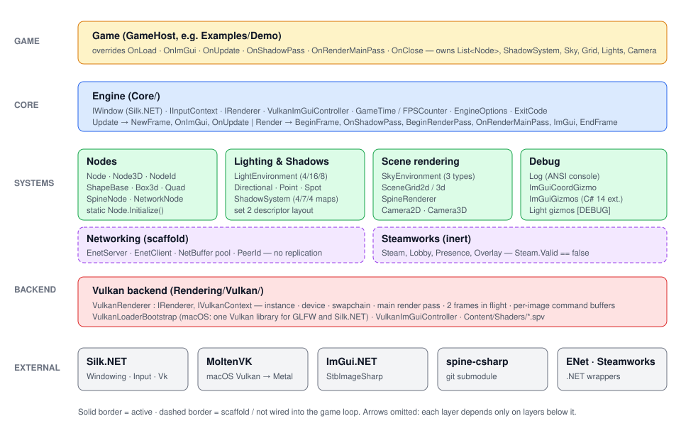
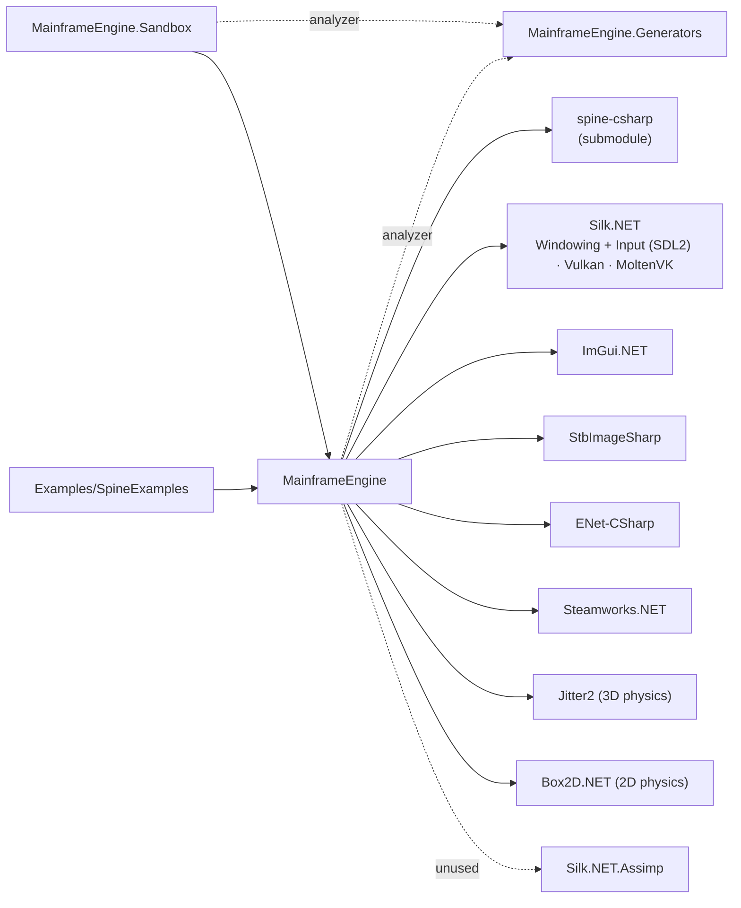

# Architecture Overview

## Purpose

Mainframe Engine is a C# (.NET 10) game engine built on Vulkan 1.2 through Silk.NET. It is a
learning-oriented engine with a Godot-style scene model: a game subclasses `Engine` and puts nodes in the
engine-owned `SceneTree`, usually by loading a scene file. The engine provides windowing, a Vulkan renderer,
ImGui, the node tree with servers behind it, scene/resource files, lighting, shadows, a sky, Spine skeletal
animation, debug grids/gizmos, and early networking and Steam wrappers.

## Assemblies

| Project | Kind | Role |
|---|---|---|
| [`MainframeEngine`](../../MainframeEngine/MainframeEngine.csproj) | class library | The engine. Ships `Content/**` (compiled `.spv` shaders, assets) to dependants' output; shaders compile during the build (`build/Shaders.targets`). |
| [`MainframeEngine.Generators`](../../MainframeEngine.Generators/MainframeEngine.Generators.csproj) | Roslyn source generator (netstandard2.0, referenced as an analyzer) | Registers every node/resource type's `[Export]` properties and `[Signal]` events. See [Scene serialization](scene-serialization.md#source-generator). |
| [`MainframeEngine.Sandbox`](../../MainframeEngine.Sandbox/MainframeEngine.Sandbox.csproj) | exe | The test game and the only runnable engine consumer in the main flow. See [Sandbox](sandbox.md). |
| `Plugins/Spine/spine-csharp` | class library (git submodule) | Spine C# runtime. Vendored — do not modify. |
| `Examples/SpineExamples` | exe | Spine showcase that references the engine (runs without a `ShadowSystem`, see [Spine](spine.md#known-issues)). |
| `Examples/SilkVulkanExamples` | exe | Standalone Vulkan tutorial ports. Does **not** reference the engine. |

## Source layout (`MainframeEngine/Src`)

| Folder | Contents | Doc |
|---|---|---|
| `Core/` | `Engine`, `EngineOptions`, `GameTime`, `FPSCounter`, `ExitCode`, `RenderingBackend` | [Engine lifecycle](engine-lifecycle.md) |
| `Scene/` | `Node`, `SceneTree`, `SceneViewport`, `World3D`, `Node3D`/`Node2D`, `Transform3D`/`Transform2D`, `NodePath`, `NodeId`, `Timer`; `Nodes3D/` (`VisualInstance3D`, `Camera3D`, lights, `WorldEnvironment`, `Grid3D`), `Nodes2D/` (`Camera2D`), `Input/` | [Scene graph & nodes](scene-graph-and-nodes.md) |
| `Nodes/` | `SpineNode`, `NetworkNode` | [Scene graph & nodes](scene-graph-and-nodes.md) |
| `Scene/Nodes3D/GeometryInstance3D.cs`, `Scene/SubViewport.cs` | `GeometryInstance3D`, `MeshInstance3D`, `Sprite3D`, `SubViewport` | [Materials & meshes](materials-and-meshes.md) |
| `Rendering/Resources/` | `Mesh`/`ArrayMesh`/`MeshSurface`, primitive meshes, `StandardMaterial3D`, `Texture2D` | [Materials & meshes](materials-and-meshes.md) |
| `Rendering/Meshes/` | `MeshRenderer` (batching), `PipelineStateCache`, `DrawList`, `Aabb`/`Frustum`, picking, sub-viewport compositor | [Materials & meshes](materials-and-meshes.md) |
| `Resources/Import/` | `AssetImporters`, `TextureImporter`, `ModelImporter` (Assimp) | [Asset pipeline](asset-pipeline.md) |
| `Servers/` | `IServer`, `ServerRegistry`, `RenderServer` | [Scene graph & nodes](scene-graph-and-nodes.md#servers-and-render-nodes) |
| `Resources/` | `Resource`, `PackedScene`, `ResourceLoader`, `SceneSaver`/`ResourceSaver`, `AssetDatabase`, `AssetUid` | [Scene serialization](scene-serialization.md) |
| `Serialization/` | attributes, `TypeRegistry`, `NodeTypeInfo`, codecs, scene reader/writer | [Scene serialization](scene-serialization.md) |
| `Rendering/Vulkan/` | `VulkanRenderer`, `IVulkanContext`, `VulkanLoaderBootstrap`, `VulkanImGuiController` | [Vulkan renderer](vulkan-renderer.md) |
| `Rendering/Shadows/` | `ShadowSystem` | [Shadow system](shadow-system.md) |
| `Rendering/Sky/` | `SkyEnvironment` + Procedural/Panoramic/Cubemap | [Sky](sky.md) |
| `Rendering/Spine/` | `SpineRenderer`, `SpineTextureLoader` | [Spine](spine.md) |
| `Rendering/SceneGrid/` | `SceneGrid`, `SceneGrid2d`, `SceneGrid3d` | [Scene grid](scene-grid.md) |
| `Rendering/Camera/` | `ICamera`, `PerspectiveCamera`, `OrthographicCamera` (math; the nodes wrap them) | [Cameras & input](cameras-and-input.md) |
| `Rendering/Gizmos/`, `Utils/`, `Debugging/` | `ImGuiCoordGizmo`, `ImGuiGizmos`, `ColorExtensions`, `Log` | [ImGui & debug tools](imgui-and-debug-tools.md) |
| `Lighting/` | `LightEnvironment`, `Light` + Directional/Point/Spot | [Lighting](lighting.md) |
| `Networking/` | ENet client/server, `PeerId`, `NetBuffer*`, `NetworkUtils` | [Networking](networking.md) |
| `Steamworks/` | Static Steam wrappers, `SteamServer` | [Steamworks](steamworks.md) |

## Dependency graph

## Design principles in the current code

- **Inheritance over composition at the top.** The game *is* an `Engine` (not a plugin or interface);
  the four legacy hooks (`OnImGui`, `OnUpdate`, `OnShadowPass`, `OnRenderMainPass`) are optional.
- **The engine owns the scene.** A `SceneTree` (Godot model) runs lifecycle, physics/process, deferred
  calls, transform sync and input for every node; behaviour is C# node subclasses. Scenes are data
  (`.mscene`) loaded through `ResourceLoader`; node properties are discovered by a source generator, not
  reflection.
- **Nodes are front-ends to servers.** Nodes hold editable state; servers (`RenderServer`, the physics servers
  `PhysicsServer3D`/`PhysicsServer2D` (M6), `AudioServer` (M7); UI later) hold GPU, simulation, audio and native
  objects and are reached through `SceneTree.Servers`. Physics library calls (Jitter2, Box2D.NET) never leave the
  physics spaces ([Physics](physics.md)).
- **Vulkan is the only backend.** `IRenderer` is backend-neutral in name, but everything that draws
  casts to `IVulkanContext`. `EngineOptions.RenderingBackend` is not consulted.
- **Each drawable owns its GPU state.** Every shape, the sky, the grid and each Spine renderer create
  their own pipeline, descriptor pool, and per-frame-slot uniform buffers (created through the render
  server when the node enters the tree). Only the `ShadowSystem` is shared; pipelines are shared in M3.
- **Per-frame-slot resources.** Uniform buffers, dynamic vertex buffers and their descriptor sets are
  indexed by `IVulkanContext.FrameSlot` (`MaxFramesInFlight = 2`), never by swapchain image, so they
  survive swapchain image-count changes (see [Vulkan renderer](vulkan-renderer.md#per-frame-slot-resources)).
- **No static service locators for nodes.** The old `Node.Initialize(renderer, shadowSystem)` globals are
  gone; per-world state lives in `World3D`, so the editor can render several worlds.

## Ownership & disposal

| Object | Created by | Disposed by |
|---|---|---|
| Window | `Engine` ctor | `Engine.Dispose` |
| `SceneTree` (root viewport, `World3D` with its `LightEnvironment`) | `Engine` ctor | `Engine.OnClose` (`Tree.Shutdown()` frees every node) |
| Input context, `VulkanRenderer`, `VulkanImGuiController`, servers (`RenderServer` → `ShadowSystem`, `DebugLinesRenderer`; `PhysicsServer3D/2D` → one space per world) | `Engine.OnLoad` | `Engine.OnClose` (servers after the tree, before the renderer) |
| Nodes and their GPU objects (shapes, Spine, sky, grid) | the game / `PackedScene.Instantiate` (GPU objects: the render server on enter) | `Free`/`QueueFree`, else the tree shutdown; orphans by the render server |
| Loaded resources (`PackedScene`, `.mres`) | `ResourceLoader.Load` | last `Release()`, else `ResourceLoader.ClearCache()` in `Engine.OnClose` |

## Related docs

[Engine lifecycle](engine-lifecycle.md) · [Build & platforms](build-and-platforms.md) ·
[Milestones](../milestones.md)
