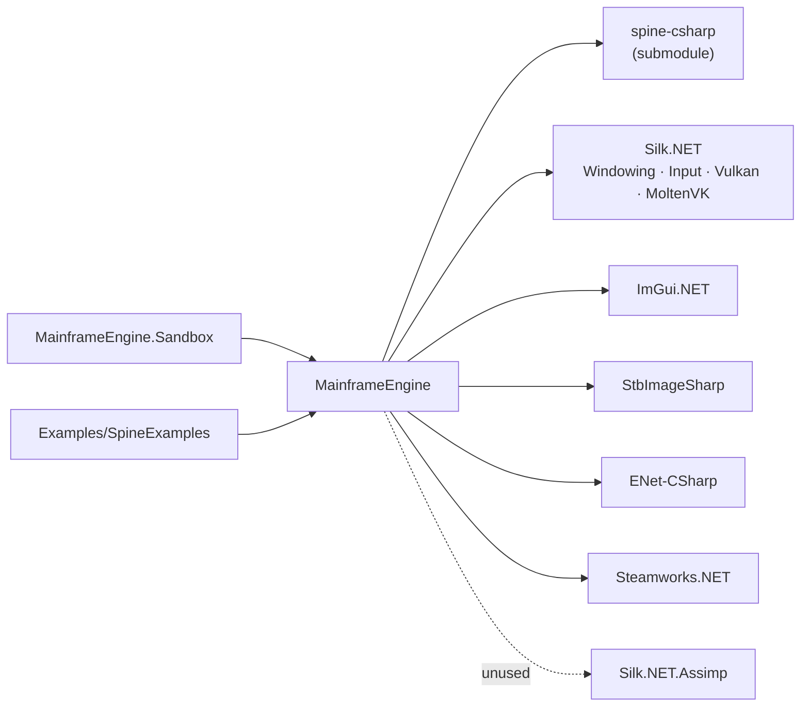

# Architecture Overview

## Purpose

Mainframe Engine is a C# (.NET 10) game engine built on Vulkan 1.2 through Silk.NET. It is a
learning-oriented engine: a game subclasses `Engine`, overrides four hooks, and owns its own scene
objects. The engine provides windowing, a Vulkan renderer, ImGui, lighting, shadows, a sky, Spine
skeletal animation, debug grids/gizmos, and early networking and Steam wrappers.

## Assemblies

| Project | Kind | Role |
|---|---|---|
| [`MainframeEngine`](../../MainframeEngine/MainframeEngine.csproj) | class library | The engine. Ships `Content/**` (shaders, `.spv`) to dependants' output. |
| [`MainframeEngine.Sandbox`](../../MainframeEngine.Sandbox/MainframeEngine.Sandbox.csproj) | exe | The test game and the only runnable engine consumer in the main flow. See [Sandbox](sandbox.md). |
| `Plugins/Spine/spine-csharp` | class library (git submodule) | Spine C# runtime. Vendored — do not modify. |
| `Examples/SpineExamples` | exe | Spine showcase that references the engine (runs without a `ShadowSystem`, see [Spine](spine.md#known-issues)). |
| `Examples/SilkVulkanExamples` | exe | Standalone Vulkan tutorial ports. Does **not** reference the engine. |

## Source layout (`MainframeEngine/Src`)

| Folder | Contents | Doc |
|---|---|---|
| `Core/` | `Engine`, `EngineOptions`, `GameTime`, `FPSCounter`, `ExitCode`, `RenderingBackend` | [Engine lifecycle](engine-lifecycle.md) |
| `Nodes/` | `Node`, `Node3D`, `NodeId`, `SpineNode`, `NetworkNode`, `Shapes/` | [Scene graph & nodes](scene-graph-and-nodes.md) |
| `Rendering/Vulkan/` | `VulkanRenderer`, `IVulkanContext`, `VulkanLoaderBootstrap`, `VulkanImGuiController` | [Vulkan renderer](vulkan-renderer.md) |
| `Rendering/Shadows/` | `ShadowSystem` | [Shadow system](shadow-system.md) |
| `Rendering/Sky/` | `SkyEnvironment` + Procedural/Panoramic/Cubemap | [Sky](sky.md) |
| `Rendering/Spine/` | `SpineRenderer`, `SpineTextureLoader` | [Spine](spine.md) |
| `Rendering/SceneGrid/` | `SceneGrid`, `SceneGrid2d`, `SceneGrid3d` | [Scene grid](scene-grid.md) |
| `Rendering/Camera/` | `ICamera`, `Camera2D`, `Camera3D` | [Cameras & input](cameras-and-input.md) |
| `Rendering/Gizmos/`, `Utils/`, `Debugging/` | `ImGuiCoordGizmo`, `ImGuiGizmos`, `ColorExtensions`, `Log` | [ImGui & debug tools](imgui-and-debug-tools.md) |
| `Lighting/` | `LightEnvironment`, `Light` + Directional/Point/Spot | [Lighting](lighting.md) |
| `Networking/` | ENet client/server, `PeerId`, `NetBuffer*`, `NetworkUtils` | [Networking](networking.md) |
| `Steamworks/` | Static Steam wrappers | [Steamworks](steamworks.md) |

## Dependency graph

## Design principles in the current code

- **Inheritance over composition at the top.** The game *is* an `Engine` (not a plugin or interface),
  overriding `OnImGui`, `OnUpdate`, `OnShadowPass` and `OnRenderMainPass`.
- **The game owns the scene.** There is no engine-side scene: the game keeps its own `List<Node>`,
  calls `OnUpdate`/`Draw`/`DrawShadow*` on each node and disposes them in `OnClose`.
- **Vulkan is the only backend.** `IRenderer` is backend-neutral in name, but everything that draws
  casts to `IVulkanContext`. `EngineOptions.RenderingBackend` is not consulted.
- **Each drawable owns its GPU state.** Every shape, the sky, the grid and each Spine renderer create
  their own pipeline, descriptor pool, and per-swapchain-image uniform buffers. Nothing is shared or cached.
- **Per-swapchain-image resources.** Uniform buffers and descriptor sets are indexed by
  `IVulkanContext.CurrentImageIndex` rather than by frame-in-flight index.
- **Static service locator for nodes.** `Node.Initialize(renderer, shadowSystem)` stores globals
  that shape and Spine constructors read.

## Ownership & disposal

| Object | Created by | Disposed by |
|---|---|---|
| Window | `Engine` ctor | `Engine.Dispose` |
| Input context, `VulkanRenderer`, `VulkanImGuiController` | `Engine.OnLoad` | `Engine.OnClose` |
| `ShadowSystem`, sky, grid, nodes, `LightEnvironment` | the game (`OnLoad`) | the game (`OnClose`, before `base.OnClose()`) |

## Related docs

[Engine lifecycle](engine-lifecycle.md) · [Build & platforms](build-and-platforms.md) ·
[Milestones](../milestones.md)
