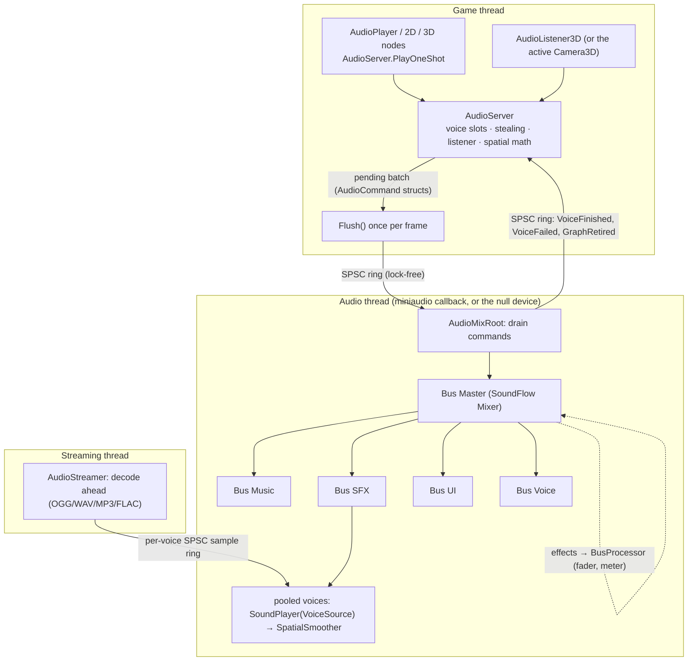

# Audio

## Purpose

Sound for games: Godot-style audio nodes (non-positional, 2D and 3D players and a listener) on top of an
engine-owned `AudioServer` that drives [SoundFlow](https://github.com/LSXPrime/SoundFlow) 1.4.1 (MIT; miniaudio
underneath). The server owns the output device, a bus mixer (Master → Music, SFX, UI, Voice by default), pooled
voices and the threads; nodes hold editable state and send it commands. Short sounds are decoded to memory, long
ones are streamed from disk by a dedicated thread. Positional sounds are attenuated with engine curves, panned in
the listener's frame and smoothed, so moving emitters never click or zipper. Decisions:
[SoundFlow backend](../../memory/decisions/0030-soundflow-audio-backend.md),
[engine panner instead of `SurroundPlayer`](../../memory/decisions/0031-positional-audio-engine-panner.md),
[OGG via NVorbis](../../memory/decisions/0032-ogg-via-nvorbis.md),
[threading and command queue](../../memory/decisions/0033-audio-threading-and-command-queue.md),
[null device](../../memory/decisions/0034-audio-null-device.md),
[bus layout resource](../../memory/decisions/0035-audio-bus-layout-resource.md).

## Key types

| Type | File | Notes |
|---|---|---|
| `AudioServer`, `AudioOptions`, `AudioDeviceMode`, `AudioVoiceHandle`, `AudioServerStats` | [Audio/AudioServer.cs](../../MainframeEngine/Src/Audio/AudioServer.cs) | `IFrameServer`; voice pools, stealing, listener, command batching |
| `AudioBus` | [Audio/AudioBus.cs](../../MainframeEngine/Src/Audio/AudioBus.cs) | live fader / mute / solo / meter |
| `AudioBusLayout`, `AudioBusInfo`, `AudioEffect` (+ `LowPass`, `HighPass`, `Reverb` (engine Freeverb), `Compressor`) | [Audio/AudioBusLayout.cs](../../MainframeEngine/Src/Audio/AudioBusLayout.cs) | `.mres` resources |
| `AudioStream`, `AudioLoadMode` | [Audio/AudioStream.cs](../../MainframeEngine/Src/Audio/AudioStream.cs) | the sound resource; `.meta` import settings |
| `AudioPlayer`, `AudioPlayer2D`, `AudioPlayer3D`, `AudioListener3D` | [Audio/Nodes/](../../MainframeEngine/Src/Audio/Nodes/) | nodes |
| `AudioMath`, `AttenuationModel` | [Audio/AudioMath.cs](../../MainframeEngine/Src/Audio/AudioMath.cs) | dB, attenuation curves, listener projection, pan law, doppler |
| `AudioMixRoot`, `AudioGraph`, `AudioVoice`, `VoiceSource`, `SpatialSmoother`, `BusProcessor` | [Audio/Graph/](../../MainframeEngine/Src/Audio/Graph/) | audio-thread side (internal) |
| `SpscRing<T>`, `AudioStreamChannel`, `AudioStreamer` | [Audio/Threading/](../../MainframeEngine/Src/Audio/Threading/) | lock-free rings, streaming thread (internal) |
| `AudioDecoder` (`WavDecoder`, `VorbisDecoder`, `MiniAudioFileDecoder`), `AudioClipData`, `AudioStreamSource` | [Audio/Decoding/](../../MainframeEngine/Src/Audio/Decoding/) | decoding (internal) |
| `AudioOutput` (`SoundFlowOutput`, `NullOutput`), `NullAudioEngine` | [Audio/Devices/AudioOutput.cs](../../MainframeEngine/Src/Audio/Devices/AudioOutput.cs) | devices (internal) |

## Architecture



- **One server per process**, created by `Engine.OnLoad` when `EngineOptions.Audio.Enabled` (default) and
  registered in `SceneTree.Servers` as an `IFrameServer`, so `SceneTree.Tick` runs `AudioServer.Process` after
  transform sync. Nodes find it in `OnEnterTree`; without one (headless trees, tools) they are inert.
- **Startup never throws.** `AudioServer.Create` tries the default playback device through SoundFlow; with no
  device, a missing native library or any init failure it logs a warning and runs on the **null device**, which
  pulls audio in real time on a background thread and discards it (positions advance, `Finished` fires). The
  engine also guards the call, so audio can never fail a game's startup. `AudioDeviceMode.Null` forces the null
  device (render tests); `NullManual` renders only when `RenderNullDevice` is called (unit tests).
- **Mix format:** 32-bit float stereo at 48 kHz (configurable); miniaudio converts to the hardware. miniaudio follows
  OS default-device changes (headphones plugged in) on Core Audio and WASAPI by itself.

### Threading

| Thread | Runs | Talks to the others through |
|---|---|---|
| Game | nodes, `AudioServer` (allocation, stealing, listener, spatial math) | appends `AudioCommand`s to a pending array; `Flush` publishes the frame's batch with one release store |
| Audio | `AudioMixRoot.GenerateAudio`: drain commands → mix the SoundFlow graph → report ends | command ring in, event ring out; reads clips (immutable) |
| Streaming | `AudioStreamer`: opens files, decodes ahead, loops by seeking, closes files | per-voice `AudioStreamChannel`: a seqlocked request + an SPSC float ring |

- **Lock-free and allocation-free on the audio path.** Commands and events are value types in `SpscRing<T>`
  (power-of-two array, cache-line-padded 64-bit head/tail, acquire/release, dequeued slots cleared). The audio thread
  only touches SoundFlow objects created up front on the game thread, and the game thread only creates (and, once
  retired, disposes) SoundFlow objects the audio thread is not using. Fader and voice gains go through the engine's
  own modifiers, so SoundFlow's locking setters (`Volume`, `AddModifier`) never run on the audio thread. (SoundFlow's device callback reads its solo slot under an
  uncontended monitor; the engine never solos through SoundFlow, so it never blocks.)
- **Batched:** a frame's commands appear to the audio thread together. Per-voice parameter updates are coalesced
  (one `SetVoiceParams` per voice per batch, latest wins) and only sent when they change. If the ring is full the
  rest of the batch waits for the next flush, in order; nothing is dropped.
- **Faults:** an exception inside the audio callback would unwind into miniaudio and kill the process, so the
  root catches it, outputs silence and keeps the exception for the game thread to log once
  (`AudioServerStats.Faulted`); applying a new layout resets it.
- **Unity gain:** SoundFlow applies its constant-power pan law at the centre on every component (×√0.5 per
  channel); every mixer and player the engine creates is set to volume √2 so the chain is exactly unity (tested).

## Buses

`AudioBusLayout` is a resource: a list of `AudioBusInfo` (name, send, volume dB, mute, solo, voice-pool size,
effect chain). The default layout is Master (16 voices) → Music (4), SFX (32), UI (8), Voice (8). The server
loads `AudioOptions.BusLayoutPath` (default `Content/Settings/AudioBusLayout.mres`) and falls back to the default
on a missing or invalid file. `GetBusLayout()` snapshots the live state, `SaveBusLayout()` writes it through
`ResourceSaver` (regular `.mres` with a `res_` UID), `ApplyBusLayout()` swaps a new graph in at runtime (all voices
stop without `Finished`; the old graph is disposed when the audio thread reports it retired). M10 can store the
same resource inline in `project.mfproj` instead of the file.

- Each bus is a SoundFlow `Mixer` nested in its send's mixer, with its effects (`AudioEffect` resources create the
  modifiers: SoundFlow's low-pass, high-pass and compressor; the engine's own allocation-free Freeverb
  `ReverbProcessor` for reverb, because SoundFlow's `AlgorithmicReverbModifier` reallocates its comb buffers on the
  audio thread as its modulation moves) and then a `BusProcessor`: the fader gain (ramped over ~10 ms) and a peak
  meter (`AudioBus.Peak`).
- **Solo:** when any bus is soloed, only soloed buses, their sub-buses, and the buses they send through are
  heard; a bus that only passes a soloed sub-bus through has its *own* voices silenced (`DirectAudible`).
- `AudioBus.VolumeDb` / `Mute` / `Solo` setters mark the buses dirty; gains are recomputed and sent in the next
  `Process`. A node naming an unknown bus plays on Master.

## Nodes

| Node | Base | Positional | Properties (besides the shared ones) |
|---|---|---|---|
| `AudioPlayer` | `Node` | no | — |
| `AudioPlayer2D` | `Node2D` | 2D | `MaxDistance` (2000), `Attenuation` exponent (1), `PanningStrength` (1) |
| `AudioPlayer3D` | `Node3D` | 3D | `AttenuationModel` (Inverse), `UnitSize` (10), `MaxDistance` (0 = none), `RolloffFactor` (1), `CustomAttenuationCurve`, `LowPassAtMaxDistance` (0 = off), `PanningStrength` (1), `DopplerTracking` (off) |
| `AudioListener3D` | `Node3D` | — | `Current`; `MakeCurrent()`, `ClearCurrent()`, `IsCurrent` |

Shared player properties: `Stream`, `Bus` (Master), `VolumeDb`, `PitchScale` (resampling: pitch and speed together),
`Autoplay`, `Loop` (or the stream's), `MaxPolyphony` (1), `Priority` (0), runtime `StreamPaused`. Methods:
`Play(fromSeconds)`, `Stop()`, `Seek()`, `GetPlaybackPosition()`, `Playing`. Signal: `Finished` — when a voice plays
to its end (not on `Stop`, stealing, layout changes, a streamed file failing to decode, or for loops). Players stop when they leave the tree and
preload their stream when they enter it.

## Streams and resources

`AudioStream` (resource) holds `File` (project path or `aud_` UID), `LoadMode`, `Loop`, `LoopStart`, `LoopEnd`
(seconds; 0 = end). `AudioStream.Load(path)` applies import settings from the file's `.meta` sidecar
(`"importer": "audio", "settings": {"loadMode", "loop", "loopStart", "loopEnd"}`); `AudioStream.FromSamples` wraps
generated PCM (procedural audio, the QA melody, tests). `AudioImporter` makes sound files loadable through
`ResourceLoader` too (`.wav/.ogg/.mp3/.flac` → `AudioStream.Load`), so a resource's `AudioStream` property can reference
the file directly, as an imported asset (path + `aud_` UID) like a texture. Loading happens on first use or `Preload()`; a failure is
logged once and the stream stays silent (`LoadError`).

| Load mode | What happens | Used for |
|---|---|---|
| `Memory` | decoded once to float PCM (`AudioClipData`, cached weakly per file and shared by every voice) | short sounds |
| `Stream` | header probed at load; the streaming thread decodes while it plays, one decoder per voice | music, ambience |
| `Auto` (default) | `Memory` under 1 MB, else `Stream` | |

| Format | Decoder |
|---|---|
| WAV (PCM 8/16/24/32, float 32/64, `WAVE_FORMAT_EXTENSIBLE`) | engine `WavDecoder` (managed) |
| OGG Vorbis | NVorbis 0.10.5 (`VorbisDecoder`; sample-accurate seeking done by the engine, see the ADR) |
| MP3, FLAC | SoundFlow's miniaudio codecs (`MiniAudioFileDecoder`; header read by SoundFlow's managed metadata reader) |

Sources wider than stereo are downmixed (ITU coefficients, normalized against clipping); everything is resampled to
the mix rate per voice (linear interpolation, with pitch scale and doppler folded into the step, ramped over each
block).

**Streaming.** Each voice that ever streams gets an `AudioStreamChannel` (reused): the game thread writes a request
(source, start frame, loop points) under a sequence lock and bumps its generation; the streaming thread opens the
file, seeks, publishes the generation's start position, and keeps a 32 768-frame float ring topped up, rewinding
the decoder at the loop end so the voice reads one continuous stream. The voice only reads once the active
generation is its own (skipping leftovers of the previous sound). A voice that runs dry outputs silence and counts
an underrun; it ends when the producer has finished its generation and the ring is empty. The generation record
(active generation, its start and channels, and where the previous one closed) is published under a sequence lock,
and a consumer reads at most up to its own generation's end, never into the next sound's samples. A file that fails
to open or decode ends its voice as an error (`VoiceFailed`: counted in `StreamErrors`, no `Finished`); any
exception on the streaming thread only affects that voice. Seeking a streamed voice sends `RestartStream`, which the
audio thread ignores once the voice has ended, so a seek racing the natural end cannot resurrect it. Released
voices close their file two frames later (after the stop fade).

## Voices

- Voices are created up front per bus (`AudioBusInfo.MaxVoices`), each a SoundFlow `SoundPlayer` permanently in its
  bus mixer, reading a retargetable `VoiceSource` (an `ISoundDataProvider` that reports a "live" length of 0, so
  SoundFlow never ends or disables it), followed by `SpatialSmoother`. Idle voices are disabled and cost nothing.
- **Allocation** (game thread): a free voice of the bus, preferring the one released longest ago (its fade has
  finished). **Node polyphony:** playing a node at `MaxPolyphony` restarts its oldest voice. **Stealing** when the
  pool is full: lowest priority first, then the quietest (current gain), then the oldest; a voice with a higher
  priority than the new sound is never stolen — the new sound is dropped instead (`Stats.Rejected`).
- **Stop** fades out over ~3 ms (no click); a voice stopped before it rendered anything goes silent at once.
  Starting a sound snaps to its level (no fade-in blunting the attack). A sound started while its owner may not run
  (tree paused) starts paused in the same command.
- `AudioServer.PlayOneShot(stream, bus, volumeDb, pitchScale, position, priority, processMode)` plays without a
  node; with a position it uses inverse attenuation (unit size 1) and full panning.

## Spatialization

Every frame `AudioServer.Process` resolves the listener — the current `AudioListener3D`, else the viewport's active
`Camera3D`, else the origin (the 2D listener is the active `Camera2D`) — then, for each positional voice:

```
rel      = emitter.GlobalPosition − listener.Origin
x, z     = rel · normalize(listener.Basis.X), rel · normalize(listener.Basis.Z)   // listener space, looks down −Z
d        = |rel|                                                                  // full 3D distance
pan      = x / |(x, z)| · PanningStrength                                         // flattened: elevation does not pan
gain     = DbToLinear(VolumeDb) · attenuation(model, d, UnitSize, MaxDistance, RolloffFactor) · busDirectAudible
(L, R)   = (min(1, √2·cos a), min(1, √2·sin a)),  a = (pan + 1)·π/4               // centre = unity on both
cutoff   = lerp(20 kHz, LowPassAtMaxDistance, (d − U)/(M − U))                    // optional
pitch    = PitchScale · doppler(listener/emitter velocities)                       // optional
```

| `AttenuationModel` | Gain for `d > U` (1 within the unit size; 0 beyond a set max distance) |
|---|---|
| `Disabled` | 1 |
| `Inverse` | `U / (U + R·(d − U))` (−6 dB per doubling at R = 1) |
| `InverseSquare` | `Inverse²` |
| `Logarithmic` | `1 − ln(d/U) / ln(M/U)` |
| `Linear` | `1 − R·(d − U)/(M − U)` |
| `Exponential` | `(d/U)^−R` |
| `Custom` | `CustomAttenuationCurve` sampled evenly over `[0, M]` |

Range-based models use `M = 100·U` when no max distance is set. `AudioPlayer2D` uses Godot's
`(1 − d/MaxDistance)^Attenuation` and pans by the horizontal offset over `AudioServer.PanDistance2D` (960).

- The audio thread's **`SpatialSmoother`** (one per voice) ramps gain, both pan gains and the low-pass coefficient
  towards their targets with a ~10 ms one-pole per sample: no zipper noise, however fast emitters move (tested:
  a left→right jump changes the output by < 0.005 per sample). Positional voices are folded to mono before panning.
- **Doppler** (`DopplerTracking`, off by default): emitter and listener velocities from per-frame position deltas;
  `AudioServer.SpeedOfSound` (343) and `DopplerScale`; the factor is clamped to [0.5, 2] and applied as resampling,
  so it is a true pitch shift.
- **Why not SoundFlow's `SurroundPlayer`:** the design proposed it as the panner. Measured on 1.4.1 it hard-switches
  between the left and right speaker under VBAP (a centred source plays only on the left), its other panning modes
  allocate on the audio thread on every block, it does not interpolate panning, and its in-place channel mapping
  corrupts sources narrower than the output. The engine therefore pans in `SpatialSmoother` with the same
  listener-space projection; see the [ADR](../../memory/decisions/0031-positional-audio-engine-panner.md).

## Pause and process mode

Each frame a voice runs when its owner `CanProcess()` (the node's resolved `ProcessMode` against
`SceneTree.Paused`) and is not `StreamPaused`; transitions send pause/resume commands (SoundFlow `Pause`/`Play` on
the audio thread), so a voice resumes exactly where it stopped. `Pausable` voices hold while the tree is paused,
`Always` voices keep playing (menu sounds), `WhenPaused` play only while paused, `Disabled` never. One-shots carry
their own `ProcessMode` (default `Pausable`).

## Debugging and QA

- The dev overlay's Audio panel ([Developer overlay](dev-overlay.md)) shows the device, voice/steal/underrun counters and a
  fader, mute, solo and peak meter per bus (allocation-free; writes go through `AudioServer` commands).
- `AudioServer.Stats`: active/total voices, steals, rejected plays, stream underruns and errors, rendered frames and
  blocks, pending commands, fault flag.

## Performance

- Steady-state frames allocate nothing on the game thread or the audio thread, with positional, moving, streamed,
  paused/resumed and finishing voices (unit test `AudioAllocationTests`; the render-test `showcase` scene gate also
  plays a streamed and an orbiting doppler voice).
- Benchmarks ([baseline.json](../../Tests/MainframeEngine.Benchmarks/baseline.json), Apple M5): a 64-command batch
  enqueue + drain ≈ 0.25 µs; spatial math for 32 emitters ≈ 0.25 µs; `AudioServer` frame for 32 moving positional
  voices ≈ 2.2 µs; mixing a 10 ms block of 32 voices ≈ 59 µs (≈0.6 % of one core). All 0 B.

## Known issues

- Output is stereo: multichannel (5.1/7.1) panning is not implemented (miniaudio upmixes stereo for such devices).
- NVorbis seeking is not sample-accurate, so OGG seeks reopen the file and decode forward to the target: cheap for
  loops back to the start, but a loop point (or `Seek`) deep into a long OGG decodes up to it each time.
- Linear interpolation resampling: fine for game audio, audible aliasing on bright content pitched far up.
- `AudioEffect` parameters apply when a layout is applied; there is no live per-parameter automation yet.
- A stolen voice is restarted at once with the new sound, cutting its stop fade short (it can click); stealing only
  happens when a bus pool is exhausted.
- If the audio or null-device thread fails to stop within 2 s at shutdown, its graph is left to the GC rather than
  disposed under it.
- SoundFlow 1.4.1 reports the miniaudio backend through an enum that is off by one; the engine names backends by
  native value.
- Editor integration (inspector preview bus, range gizmos, the Audio bus panel) arrives with M10.

## Related docs

[Scene graph & nodes](scene-graph-and-nodes.md) · [Scene serialization](scene-serialization.md) ·
[Engine lifecycle](engine-lifecycle.md) · [Testing](testing.md) · [Demo](demo.md) ·
[Game UI](game-ui.md) · [Editor](editor.md)
