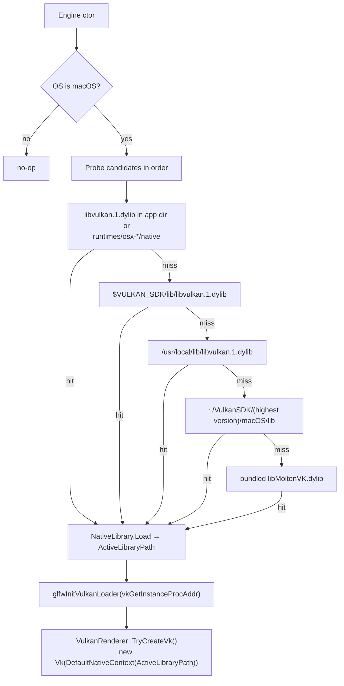

# Build & Platforms

## Purpose

How the solution is built, what it depends on, how content and shaders reach the output folder, and
what works on each platform.

## Building

```bash
dotnet build MainframeEngine.sln
dotnet run --project MainframeEngine.Sandbox
```

Run from the build output (or via `dotnet run`). All content paths (`"Content/..."`) are resolved
relative to the **current working directory**, not `AppContext.BaseDirectory`.

### Solution

[`MainframeEngine.sln`](../../MainframeEngine.sln) contains `MainframeEngine`,
`MainframeEngine.Sandbox`, `Examples/SpineExamples`, `Examples/SilkVulkanExamples` and
`Plugins/spine-csharp`. Configurations: `Debug|Any CPU` and `Release|Any CPU` only. There is no
`Directory.Build.props`, `global.json` or central package management.

### Project settings

| Setting | Value |
|---|---|
| Target framework | `net10.0` |
| Language | `default` (C# 14 — `ImGuiGizmos` uses `extension` blocks) |
| Nullable / ImplicitUsings | enabled |
| `AllowUnsafeBlocks` | `true` in Debug and Release (required; do not remove) |

### Packages (`MainframeEngine.csproj`)

| Package | Version | Used for |
|---|---|---|
| Silk.NET.Windowing | 2.21.0 | Window, GLFW (transitive) |
| Silk.NET.Input | 2.21.0 | Keyboard/mouse |
| Silk.NET.Vulkan (+ Extensions.EXT/KHR) | 2.22.0 | Vulkan bindings |
| Silk.NET.MoltenVK.Native | 2.22.0 | Bundled MoltenVK for macOS |
| Silk.NET.Assimp | 2.21.0 | *Referenced but unused* |
| ImGui.NET | 1.89.9.3 | Debug UI |
| StbImageSharp | 2.30.15 | Image decoding (sky, Spine atlas, icon) |
| ENet-CSharp | 2.4.8 | UDP networking |
| Steamworks.NET | 2024.8.0 | Steam wrappers (inert, see [Steamworks](steamworks.md)) |

New NuGet dependencies must be discussed before they are added (CLAUDE.md).

### Content

`MainframeEngine.csproj` copies `Content\**` with `CopyToOutputDirectory=Always`; this flows to the
Sandbox output through the project reference. The Sandbox copies its own `Content\**` as well.

### Shaders

Shaders are GLSL in `MainframeEngine/Content/Shaders/**`. Only `*.vk.*` files are used and they
must be compiled to SPIR-V by hand; the `.spv` files are committed:

```bash
glslc path/to/shader.vk.frag -o path/to/shader.vk.frag.spv
```

There is no build step that compiles or validates shaders. See [Shaders](shaders.md).

## macOS: Vulkan loader bootstrap

Vulkan on macOS runs on MoltenVK. GLFW (which creates the surface) and Silk.NET's `Vk` must bind the
**same** Vulkan library: instances from two different loaders are not interchangeable, and modern
dyld no longer searches `/usr/local/lib` for leaf-name `dlopen`.
[`VulkanLoaderBootstrap`](../../MainframeEngine/Src/Rendering/Vulkan/VulkanLoaderBootstrap.cs) is the
first thing the `Engine` constructor calls. On other platforms it is a no-op.



The renderer then enables `VK_KHR_portability_enumeration` (instance) and `VK_KHR_portability_subset`
(device) only when they are advertised, so Windows/Linux are unaffected.

**Rule:** never call bare `Vk.GetApi()` in engine code; take `Vk` from `IVulkanContext`.

> Planned (M0): windowing moves from GLFW to SDL, and the handoff becomes `SDL_Vulkan_LoadLibrary`. See
> [SDL windowing](future/sdl-windowing.md).

## Platform matrix

| Feature | Windows x64 | Linux x64 | macOS x64 | macOS arm64 |
|---|---|---|---|---|
| Vulkan renderer | ✅ | ✅ | ✅ MoltenVK | ✅ MoltenVK (verified, 120 fps Sandbox) |
| Validation layers | Vulkan SDK | Vulkan SDK | Vulkan SDK | Vulkan SDK |
| ENet networking | ✅ | ✅ | ✅ | ❌ native is x86_64-only |
| Steamworks | ⚠ no `steam_api` shipped | ⚠ same | ⚠ same | ❌ no osx-arm64 assets |

MoltenVK limits that shaped the design: `mutableComparisonSamplers = false` (shadow samplers are
immutable) and 16 samplers per shader stage (`MaxShadowSpot = 7`). See [Shadow system](shadow-system.md).

## Known issues

- Silk.NET versions are mixed (2.21.0 vs 2.22.0).
- `Silk.NET.Assimp` is referenced but unused.
- `VulkanLoaderBootstrap` relies on `Silk.NET.GLFW`, which arrives only transitively through Windowing.
- [`MainframeEngine.Sandbox.csproj`](../../MainframeEngine.Sandbox/MainframeEngine.Sandbox.csproj) has
  stale `Content\SpineBoy\*` entries; the files live in `Content/Models/Spine/SpineBoy/`.
- Content paths are CWD-relative, so launching from another directory fails to find shaders/assets.
- `.spv` files are compiled manually and can drift from their GLSL source.

## Related docs

[Architecture overview](architecture-overview.md) · [Shaders](shaders.md) ·
[Future: asset & shader pipeline](future/asset-and-shader-pipeline.md)
