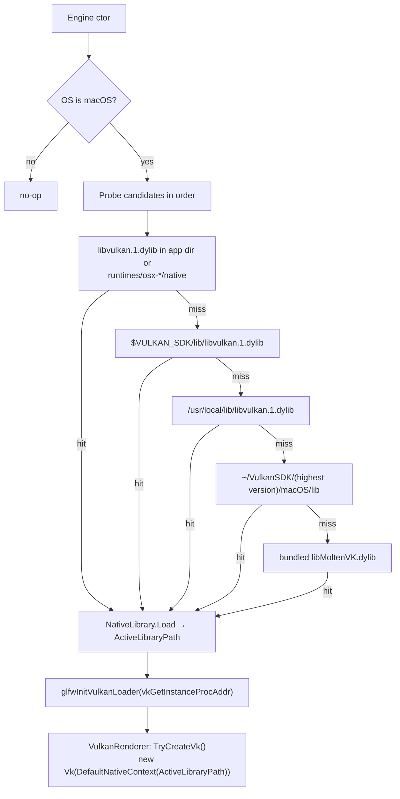

# Build & Platforms

## Purpose

How the solution is built, what it depends on, how content and shaders reach the output folder, and
what works on each platform.

## Building

```bash
just build              # dotnet build MainframeEngine.sln (warnings are errors)
just test               # unit tests          just test-render   # render tests
just sandbox            # dotnet run --project MainframeEngine.Sandbox
```

`just` (1.58+) wraps every local command; run `just` for the list. The Sandbox and the render-test
host set the working directory to `AppContext.BaseDirectory` at startup, because content paths
(`"Content/..."`) are relative. Engine code still resolves them against the working directory.

### Solution

[`MainframeEngine.sln`](../../MainframeEngine.sln) contains `MainframeEngine`,
`MainframeEngine.Sandbox`, `Examples/SpineExamples`, `Examples/SilkVulkanExamples`,
`Plugins/spine-csharp` and, in the `Tests` folder, `MainframeEngine.Tests`,
`MainframeEngine.RenderTests`, `MainframeEngine.RenderTests.Host` and `MainframeEngine.Benchmarks`
(see [Testing](testing.md)). Configurations: `Debug|Any CPU` and `Release|Any CPU` only.

### Shared build settings

| File | Role |
|---|---|
| [`global.json`](../../global.json) | Pins the .NET SDK to 10.0.401 (`rollForward: latestFeature`) |
| [`Directory.Build.props`](../../Directory.Build.props) | `LangVersion latest`, nullable, implicit usings, `TreatWarningsAsErrors`, `AnalysisLevel latest-recommended`, deterministic builds (`ContinuousIntegrationBuild` on CI), `Version 0.0.0-dev` (publish overrides with `-p:Version`), authors/company "Mainframe Games". Analyzer suppressions are listed here with their reason. |
| [`Directory.Build.targets`](../../Directory.Build.targets) | Exempts the vendored `spine-csharp` (submodule) from warnings-as-errors, analyzers and nullable warnings |
| [`Directory.Packages.props`](../../Directory.Packages.props) | Central package management: every version lives here; project files have no `Version` |
| [`.editorconfig`](../../.editorconfig) | Formatting (`dotnet format`) and analyzer options; keeps column-aligned declarations |
| [`Tests/Directory.Build.props`](../../Tests/Directory.Build.props) | Test-project defaults (chains to the root props) |

Every project targets `net10.0` (the vendored Spine runtime keeps `net8.0`). `AllowUnsafeBlocks` is set
in each project that needs it and must stay. The build has **0 warnings** in Debug and Release.

### Packages

All versions are in `Directory.Packages.props`. Silk.NET is unified on **2.22.0**.

| Package | Version | Used by / for |
|---|---|---|
| Silk.NET.Windowing, .Input | 2.22.0 | Window, GLFW (transitive), keyboard/mouse |
| Silk.NET.Vulkan (+ Extensions.EXT/KHR) | 2.22.0 | Vulkan bindings |
| Silk.NET.MoltenVK.Native | 2.22.0 | Bundled MoltenVK for macOS |
| Silk.NET.Assimp | 2.22.0 | *Referenced but unused* (kept for M3) |
| Silk.NET (meta) | 2.22.0 | `Examples/SilkVulkanExamples` |
| ImGui.NET | 1.89.9.3 | Debug UI |
| StbImageSharp | 2.30.15 | Image decoding (sky, Spine atlas, icon) |
| ENet-CSharp | 2.4.8 | UDP networking |
| Steamworks.NET | 2024.8.0 | Steam wrappers (inert, see [Steamworks](steamworks.md)) |
| Spectre.Console | 0.54.1-alpha.0.86 | Example picker in `SilkVulkanExamples` |
| xunit.v3, xunit.runner.visualstudio, Microsoft.NET.Test.Sdk, coverlet.collector | see props | Tests only |
| BenchmarkDotNet | see props | Benchmarks only |

New NuGet dependencies must be discussed before they are added (CLAUDE.md).

### Content

`MainframeEngine.csproj` copies `Content\**` with `CopyToOutputDirectory=Always` (except
`shaders.lock`); this flows to the Sandbox and test outputs through project references. The Sandbox
copies its own `Content\**` as well.

### Shaders

Shaders are GLSL in `MainframeEngine/Content/Shaders/**`. Only `*.vk.*` files are used; the `.spv`
files are committed. [`build/shaders.sh`](../../build/shaders.sh) (POSIX sh, used by `just` and CI):

| Command | What it does |
|---|---|
| `just shaders` | `glslc --target-env=vulkan1.2` on every engine `*.vk.{vert,frag,comp}` and every `Examples/SilkVulkanExamples` shader, `spirv-val` each result, then rewrite `MainframeEngine/Content/Shaders/shaders.lock` |
| `just shaders-check` | Fails if a source or `.spv` no longer matches the lock (source edited without recompiling, or `.spv` not committed) |

The lock stores the sha256 of each source and of its `.spv`. After editing a shader, run
`just shaders` and commit the `.spv` files with the lock. See [Shaders](shaders.md).

### CI

[`.github/workflows/ci.yml`](../../.github/workflows/ci.yml) runs on every pull request and on pushes
to `main` (one run per ref; newer pushes cancel older ones). Checkouts include the Spine submodule and
Git LFS files.

| Job | Runs |
|---|---|
| `build-test` (ubuntu-24.04, windows-latest, macos-14) | `dotnet build -c Release -warnaserror`, unit tests with coverage; uploads `.trx` results and (Linux) Cobertura coverage |
| `format` | `dotnet format --verify-no-changes --exclude Plugins/Spine` |
| `shaders` | apt `glslc` + `spirv-tools`, compiles every shader to a temp dir, `spirv-val`, `build/shaders.sh check` |
| `render-tests` | Ubuntu with lavapipe (`mesa-vulkan-drivers`, `VK_DRIVER_FILES` = `lvp_icd.x86_64.json`), `vulkan-validationlayers`, Xvfb; uploads `artifacts/render-tests` (frames, diffs) |
| `ci-success` | Runs always; fails unless every job above succeeded. **The required status check** in the `main` ruleset — do not rename. |

## macOS: Vulkan loader bootstrap

Vulkan on macOS runs on MoltenVK. GLFW (which creates the surface) and Silk.NET's `Vk` must bind the
**same** Vulkan library: instances from two different loaders are not interchangeable, and modern
dyld no longer searches `/usr/local/lib` for leaf-name `dlopen`.
[`VulkanLoaderBootstrap`](../../MainframeEngine/Src/Rendering/Vulkan/VulkanLoaderBootstrap.cs) is the
first thing the `Engine` constructor calls. On other platforms it is a no-op.



The renderer then enables `VK_KHR_portability_enumeration` (instance) and `VK_KHR_portability_subset`
(device) only when they are advertised, so Windows/Linux are unaffected.

**Rule:** never call bare `Vk.GetApi()` in engine code; take `Vk` from `IVulkanContext`.

> Planned (M0): windowing moves from GLFW to SDL, and the handoff becomes `SDL_Vulkan_LoadLibrary`. See
> [SDL windowing](future/sdl-windowing.md).

## Platform matrix

| Feature | Windows x64 | Linux x64 | macOS x64 | macOS arm64 |
|---|---|---|---|---|
| Vulkan renderer | ✅ | ✅ | ✅ MoltenVK | ✅ MoltenVK (verified, 120 fps Sandbox) |
| Validation layers | Vulkan SDK | Vulkan SDK | Vulkan SDK | Vulkan SDK |
| ENet networking | ✅ | ✅ | ✅ | ❌ native is x86_64-only |
| Steamworks | ⚠ no `steam_api` shipped | ⚠ same | ⚠ same | ❌ no osx-arm64 assets |

MoltenVK limits that shaped the design: `mutableComparisonSamplers = false` (shadow samplers are
immutable) and 16 samplers per shader stage (`MaxShadowSpot = 7`). See [Shadow system](shadow-system.md).

## Known issues

- `VulkanLoaderBootstrap` relies on `Silk.NET.GLFW`, which arrives only transitively through Windowing.
- [`MainframeEngine.Sandbox.csproj`](../../MainframeEngine.Sandbox/MainframeEngine.Sandbox.csproj) has
  stale `Content\SpineBoy\*` entries; the files live in `Content/Models/Spine/SpineBoy/`.
- Engine content paths are CWD-relative; only the Sandbox and the render-test host pin the working
  directory (proper fix: `ContentPaths`, M3).
- `.spv` files are still compiled by hand (`just shaders`); `shaders-check` only detects drift.
- GLFW reports no monitor while a Mac's display sleeps; the engine then skips window centering.

## Related docs

[Architecture overview](architecture-overview.md) · [Testing](testing.md) · [Shaders](shaders.md) ·
[Future: asset & shader pipeline](future/asset-and-shader-pipeline.md)
