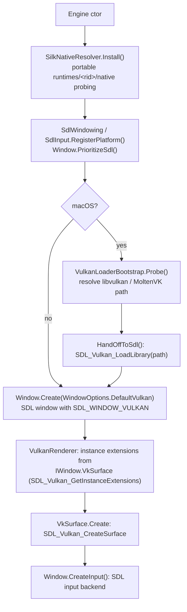
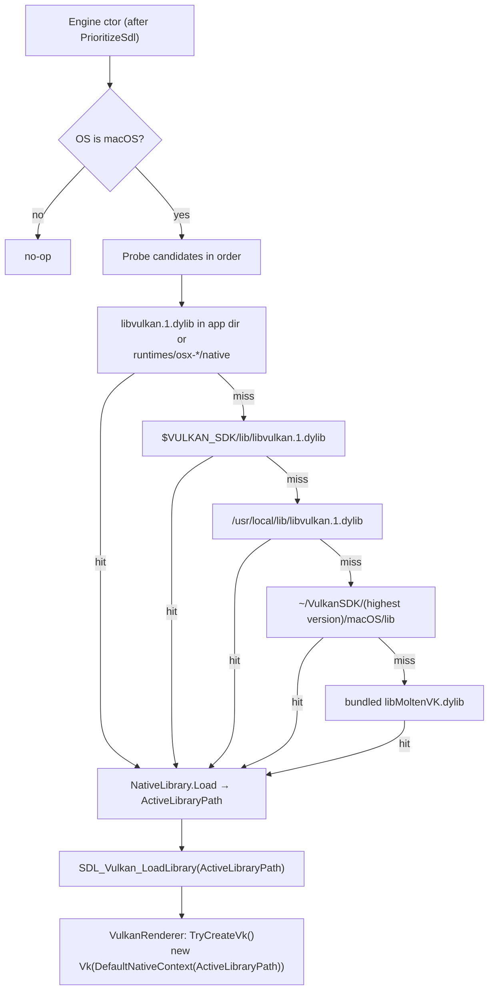

# Build & Platforms

## Purpose

How the solution is built, what it depends on, how content and shaders reach the output folder, and
what works on each platform.

## Building

```bash
just build              # dotnet build MainframeEngine.slnx (warnings are errors)
just test               # unit tests          just test-render   # render tests
just demo               # dotnet run --project Examples/Demo/Demo.Launcher
```

`just` (1.58+) wraps every local command; run `just` for the list. Engine code resolves every content
path with `ContentPaths.Resolve` against `AppContext.BaseDirectory` (rooted paths unchanged,
`"Content/…"` relative to the app folder, anything else relative to `Content/`), so it works from any
working directory. The render-test host still pins the working directory for
`SpineFolder`, which enumerates its folder relative to it.

### Solution

[`MainframeEngine.slnx`](../../MainframeEngine.slnx) (the XML solution format, SDK 9.0.200+; migrated from
`MainframeEngine.sln` with `dotnet sln migrate`) contains `MainframeEngine`,
`MainframeEngine.Generators` (the source generator, netstandard2.0, referenced as an analyzer by the
engine and the unit tests; its only package, `Microsoft.CodeAnalysis.CSharp`, is build-time
only — see [Scene serialization](scene-serialization.md#source-generator)),
`MainframeEngine.Editor`, and the solution folders `Plugins` (`spine-csharp`), `Tools` (`MainframeEngine.L10n`, the `mf-l10n` CLI) and `Tests`
(`MainframeEngine.Tests`, `MainframeEngine.Editor.Tests`, `MainframeEngine.RenderTests`,
`MainframeEngine.RenderTests.Host` and `MainframeEngine.Benchmarks`; see [Testing](testing.md)). The template package
`Templates/MainframeEngine.Templates` is not in the solution (it is packed on its own: `just template-pack`), nor is
its `mfgame` content, which CI's `template` job instantiates and builds (`just template-smoke`). Configurations: `Debug|Any CPU` and `Release|Any CPU` only.

### Shared build settings

| File | Role |
|---|---|
| [`global.json`](../../global.json) | Pins the .NET SDK to 10.0.401 (`rollForward: latestFeature`) |
| [`Directory.Build.props`](../../Directory.Build.props) | `LangVersion latest`, nullable, implicit usings, `TreatWarningsAsErrors`, `AnalysisLevel latest-recommended`, deterministic builds (`ContinuousIntegrationBuild` on CI), `Version 0.0.0-dev` (publish overrides with `-p:Version`), authors/company "Mainframe Games". Analyzer suppressions are listed here with their reason. |
| [`Directory.Build.targets`](../../Directory.Build.targets) | Exempts the vendored `spine-csharp` (submodule) from warnings-as-errors, analyzers and nullable warnings |
| [`Directory.Packages.props`](../../Directory.Packages.props) | Central package management: every version lives here; project files have no `Version` |
| [`.editorconfig`](../../.editorconfig) | Formatting (`dotnet format`) and analyzer options; keeps column-aligned declarations |
| [`Tests/Directory.Build.props`](../../Tests/Directory.Build.props) | Test-project defaults (chains to the root props); `DeterministicSourcePaths=false`, so CI builds keep real `[CallerFilePath]` paths that tests check against files on disk |

Every project targets `net10.0` (the vendored Spine runtime keeps `net8.0`). `AllowUnsafeBlocks` is set
in each project that needs it and must stay. The build has **0 warnings** in Debug and Release.

### Packages

All versions are in `Directory.Packages.props`. Silk.NET is unified on **2.23.0**.

| Package | Version | Used by / for |
|---|---|---|
| Silk.NET.Windowing.Sdl, .Input.Sdl | 2.22.0 | Window, keyboard/mouse/gamepad on SDL2 (`Silk.NET.SDL`, `Ultz.Native.SDL` 2.30.8 transitive). GLFW is not referenced ([ADR 0003](../../memory/decisions/0003-sdl2-via-silk-net-2x.md)). |
| Silk.NET.Vulkan (+ Extensions.EXT/KHR) | 2.22.0 | Vulkan bindings |
| Silk.NET.MoltenVK.Native | 2.22.0 | Bundled MoltenVK for macOS |
| Silk.NET.Assimp | 2.22.0 | *Referenced but unused* (kept for M3) |
| ImGui.NET | 1.91.6.1 | Debug UI |
| StbImageSharp | 2.30.16 | Image decoding (sky, Spine atlas, icon) |
| ENet-CSharp | 2.4.8 | UDP networking |
| Steamworks.NET | 2024.8.0 | Steam wrappers (inert, see [Steamworks](steamworks.md)) |
| SoundFlow | 1.4.1 (exact) | Audio device, mixer graph, MP3/FLAC decoding ([Audio](audio.md), [ADR 0030](../../memory/decisions/0030-soundflow-audio-backend.md)). Ships its miniaudio natives in `runtimes/<rid>/native/` (win-x64/x86/arm64, linux-x64/arm/arm64, osx-x64/arm64, …); NuGet copies them to the app's `runtimes/` and SoundFlow resolves them. |
| NVorbis | 0.10.5 (exact) | OGG Vorbis decoding, managed ([ADR 0032](../../memory/decisions/0032-ogg-via-nvorbis.md)) |
| xunit.v3, xunit.runner.visualstudio, Microsoft.NET.Test.Sdk, coverlet.collector | see props | Tests only |
| BenchmarkDotNet | see props | Benchmarks only |

New NuGet dependencies must be discussed before they are added (CLAUDE.md).

### Content

`MainframeEngine.csproj` copies `Content\**` with `CopyToOutputDirectory=Always`, except
`Content/Shaders/**` (sources, includes, lock, committed `.spv`), whose compiled `.spv` files are added by
[`build/Shaders.targets`](../../build/Shaders.targets); this flows to the test outputs and to games (the Demo) through
project references. A game copies its own `Content\**` as well.

### Shaders

Shaders are GLSL in `MainframeEngine/Content/Shaders/**` (`*.vk.*`, shared includes in `include/`).
**`dotnet build` compiles them** ([`build/Shaders.targets`](../../build/Shaders.targets),
[ADR 0007](../../memory/decisions/0007-build-time-shaders-and-shared-limits.md)):

| Target | What it does |
|---|---|
| `GenerateShaderLimits` | `Content/Shaders/limits.json` → `Src/Rendering/Generated/ShaderLimits.g.cs` + `include/limits.glsl` (rewritten only when the content changes; both committed) |
| `CompileShaders` | Incremental (sources, includes, `limits.json`): `glslc --target-env=vulkan1.2 -I Content/Shaders/include` → `obj/<config>/Shaders/**.spv`; glslc errors are build errors. glslc = `$(Glslc)`, `$(VULKAN_SDK)/bin/glslc` or `PATH`. |
| `IncludeShadersInOutput` | Copies the compiled `.spv` (or, without glslc, the committed ones after warning `MFSHADER001`) to `Content/Shaders/` in every output |

`-p:CompileShaders=false` uses the committed `.spv` files (CI does: no glslc on the runners, and the
warning would fail `-warnaserror`). The committed `.spv` files are the fallback for machines without
the Vulkan SDK; [`build/shaders.sh`](../../build/shaders.sh) (POSIX sh, used by `just` and CI) keeps
them current:

| Command | What it does |
|---|---|
| `just shaders` | `glslc --target-env=vulkan1.2 -I MainframeEngine/Content/Shaders/include` on every engine `*.vk.{vert,frag,comp}` (same flags as the build), `spirv-val` each result, then rewrite `MainframeEngine/Content/Shaders/shaders.lock` |
| `just shaders-check` | Fails if a source, an include or a `.spv` no longer matches the lock (source edited without recompiling, or `.spv` not committed) |

The lock stores the sha256 of each source and of its `.spv`, and of each `include/*.glsl`. After
editing a shader or include, run `just shaders` and commit the `.spv` files with the lock. See
[Shaders](shaders.md).

### CI

[`.github/workflows/ci.yml`](../../.github/workflows/ci.yml) runs on every pull request and on demand
for any branch (`workflow_dispatch`: `gh workflow run ci.yml --ref <branch>`). It does not run on pushes to
`main`: the `main-protection` ruleset only lets changes in through pull requests that already passed it, so a
second run on `main` would only cost Actions minutes. `publish.yml` re-runs it before a release.
There is one run per ref; newer runs cancel older ones. Checkouts include the Spine submodule. To save
LFS bandwidth, jobs check out without LFS and fetch only the LFS files they need (`git lfs pull --exclude=…`;
never the README screenshots or `Examples/` images), with `.git/lfs` cached under a key hashed from the needed object IDs
(`.lfs-assets-id`), so a run whose LFS files did not change downloads none. `format` and `shaders` fetch no LFS
files; `publish.yml`'s editor builds follow the same pattern, and `natives.yml`'s verify job fetches only
`MainframeEngine/runtimes/**`.

| Job | Runs |
|---|---|
| `build-test` (ubuntu-24.04, windows-latest, macos-14) | `dotnet build -c Release -warnaserror -p:CompileShaders=false` (committed `.spv`), unit tests with coverage; uploads `.trx` results and (Linux) Cobertura coverage |
| `format` | `dotnet format --verify-no-changes --exclude Plugins/Spine` |
| `shaders` | apt `glslc` + `spirv-tools`, compiles every shader to a temp dir, `spirv-val`, `build/shaders.sh check` |
| `render-tests` | Ubuntu with lavapipe (`mesa-vulkan-drivers`, `VK_DRIVER_FILES` = `lvp_icd.json`), `vulkan-validationlayers`, Xvfb; compares against `Goldens/lavapipe/`; uploads `artifacts/render-tests` (frames, diffs). Re-recording: [Testing](testing.md#golden-images) |
| `template` | Ubuntu with lavapipe + Xvfb: `build/template-smoke.sh` installs the `mfgame` template from source, builds a game against the checkout (Release, warnings as errors) and runs its `GameHost` launcher for 30 hidden frames, failing on logged errors; packs `MainframeEngine.Templates`. See [Projects & GameHost](project-and-gamehost.md#template) |
| `ci-success` | Runs always; fails unless every job above succeeded. **The required status check** in the `main` ruleset — do not rename. |

## Windowing: SDL2

Window, Vulkan surface and input run on **SDL2** through Silk.NET's SDL backend
(`Silk.NET.Windowing.Sdl`, `Silk.NET.Input.Sdl`; decision in
[ADR 0003](../../memory/decisions/0003-sdl2-via-silk-net-2x.md)). SDL brings the community controller
database, rumble/gyro, IME text input, clipboard and DPI queries that later milestones need, and is
Silk.NET 3's long-term backend. Games see no difference: `Engine.Window`, `InputContext`, the events
and the frame loop are unchanged.



- The platforms are registered explicitly in the `Engine` constructor (no reflection discovery, so
  trimming/AOT keep them). GLFW is not in the dependency graph and is never loaded.
- **HiDPI.** SDL reports `IWindow.Size` in points, and Silk's `IWindow.FramebufferSize` returns the GL
  drawable, which for a Vulkan window is also in points. `Engine.FramebufferSize`
  ([`WindowPixels`](../../MainframeEngine/Src/Core/WindowPixels.cs)) returns
  `SDL_Vulkan_GetDrawableSize` in **pixels** (3024×1692 for a 1512×846 pt Retina window); the
  renderer's extent fallback, minimise detection, ImGui's framebuffer scale and game aspect ratios
  use it. Prefer it over `Window.FramebufferSize`.
- **Fixed content scale.** `EngineOptions.ContentScale` > 0 makes the framebuffer exactly `WindowSize` × that scale in
  pixels on any display: before `OnLoad` creates the swapchain, the engine measures the display's pixels per point and
  sizes the OS window to the request ÷ that ratio (`WindowPixels.ResizeToPixels`; again after centring, in case it moved
  displays), and throws if the framebuffer still differs (a fractional scale that does not divide it). The UI's dp
  ratio (`UiServer.ContentScale`) and ImGui's points use the fixed scale; mouse and IME positions keep converting with
  the display's real pixels per point. `Engine.ResizeWindow` resizes in the same layout points. Render tests and
  the Demo's screenshots use it so images do not depend on the monitor; 0 (default) follows the display.
- **Finding libSDL2 (and other Silk.NET package natives).** A RID-agnostic build (`dotnet build/run/test`)
  keeps package natives under `runtimes/<rid>/native/`. Silk.NET's `DefaultPathResolver` picks that
  folder from the distro-specific RID of `Microsoft.DotNet.PlatformAbstractions` (`ubuntu.24.04-x64`).
  It maps that RID back to a portable one with a hard-coded distro list, and Ubuntu is not on it. A .NET 8+
  deps.json has no RID graph to fall back on, so on Ubuntu Silk never probes `runtimes/linux-x64/native`.
  `Window.Create` then fails with "SdlPlatform - not applicable", and the `FileNotFoundException`
  says SDL could not be loaded.
  [`SilkNativeResolver`](../../MainframeEngine/Src/Core/SilkNativeResolver.cs) fixes this. The `Engine`
  constructor calls it before anything loads SDL, and it appends a resolver to Silk's process-wide
  `PathResolver.Default`. That resolver probes `runtimes/<RuntimeInformation.RuntimeIdentifier>`, then
  `runtimes/<os>-<arch>`, then `runtimes/<os>`. It runs after Silk's own resolvers. macOS and Windows RIDs
  already map correctly. RID-specific builds and publishes (`dotnet publish -r linux-x64`) copy the
  natives next to the app and never need it. Engine code that can load a Silk.NET native before an
  `Engine` exists (e.g. a future Assimp import path used by tools) must call the idempotent
  `SilkNativeResolver.Install()` first.
- On Linux, SDL dlopens X11 (or Wayland) at runtime; CI installs `libx11-6 libxext6 libxfixes3
  libxrandr2 libxinerama1 libxcursor1 libxi6 libxss1 libxkbcommon0` for the Xvfb render tests.

## macOS: Vulkan loader bootstrap

Vulkan on macOS runs on MoltenVK. SDL (which creates the surface) and Silk.NET's `Vk` must bind the
**same** Vulkan library: instances from two different loaders are not interchangeable, and modern
dyld no longer searches `/usr/local/lib` for leaf-name `dlopen`.
[`VulkanLoaderBootstrap`](../../MainframeEngine/Src/Rendering/Vulkan/VulkanLoaderBootstrap.cs) runs in
the `Engine` constructor after SDL is selected and before the window exists, in two steps:
`Probe()` (find and load a library, set `ActiveLibraryPath`) and `HandOffToSdl()`
(`SDL_Vulkan_LoadLibrary(ActiveLibraryPath)` on the shared `SdlProvider` instance). On other
platforms both are no-ops and SDL and Silk load the system loader. `MAINFRAME_VULKAN_LIBRARY=<path>`
forces one library, which is how each source below is QA'd.



The renderer then enables `VK_KHR_portability_enumeration` (instance) and `VK_KHR_portability_subset`
(device) only when they are advertised, so Windows/Linux are unaffected.

**Rule:** never call bare `Vk.GetApi()` in engine code; take `Vk` from `IVulkanContext`.

Verified on macOS arm64 against all three sources: SDK loader (`/usr/local/lib`), `~/VulkanSDK/<ver>`
and the bundled `libMoltenVK.dylib` (no validation layers through that one).

## Platform matrix

| Feature | Windows x64 | Linux x64 | macOS x64 | macOS arm64 |
|---|---|---|---|---|
| Vulkan renderer | ✅ | ✅ | ✅ MoltenVK | ✅ MoltenVK (verified, the Demo at 120 fps) |
| Validation layers | Vulkan SDK | Vulkan SDK | Vulkan SDK | Vulkan SDK |
| ENet networking | ✅ | ✅ | ✅ | ❌ native is x86_64-only |
| Audio (SoundFlow/miniaudio) | ✅ WASAPI | ✅ ALSA/PulseAudio | ✅ Core Audio | ✅ Core Audio (verified with the Demo's Audio scenes); null device on machines without one (CI) |
| Steamworks | ⚠ no `steam_api` shipped | ⚠ same | ⚠ same | ❌ no osx-arm64 assets |

MoltenVK limits that shaped the design: `mutableComparisonSamplers = false` (shadow samplers are
immutable), 16 samplers per shader stage (the shadow set uses 6 since M4; before, `MaxShadowSpot` was 7), and a mutable-format swapchain whose
UNORM view intermittently resolves to a stale drawable (why the default swapchain is UNORM; see
[Color pipeline](color-pipeline.md#swapchain)). See [Shadow system](shadow-system.md).

## Known issues

- `SpineFolder` (node code) still lists its folder relative to the working directory.
- Node-side shape shaders are still loaded by path through `File.ReadAllBytes` (CWD-relative), not the
  shader-module cache; the materials rewrite moves them.
- The window layer may report no monitor while a Mac's display sleeps; the engine then skips window
  centering.

## Related docs

[Architecture overview](architecture-overview.md) · [Testing](testing.md) · [Shaders](shaders.md) ·
[GPU resources](gpu-resources.md) · [Color pipeline](color-pipeline.md)
