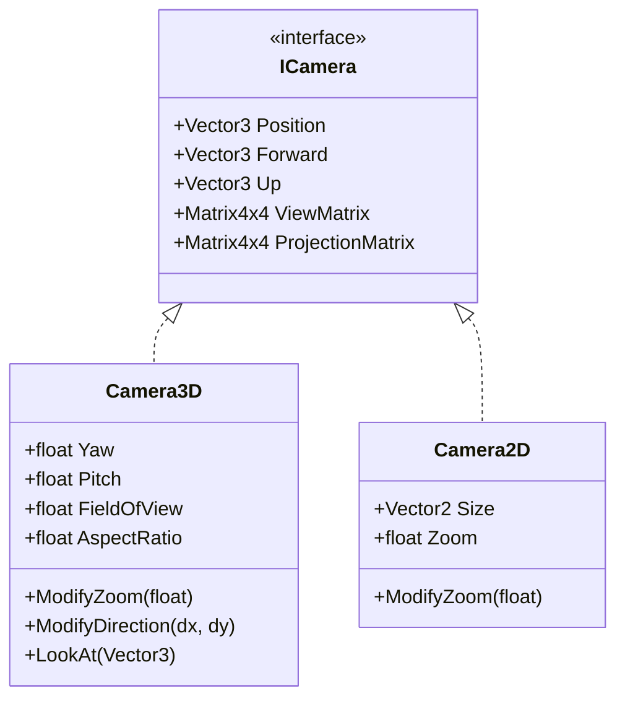

# Cameras & Input

## Purpose

Cameras provide view and projection matrices to every drawable. Input handling lives in the game,
not the engine. The engine only exposes `InputContext`.

## Key types

| Type | File |
|---|---|
| `ICamera` | [Camera/ICamera.cs](../../MainframeEngine/Src/Rendering/Camera/ICamera.cs) — `Position`, `Forward`, `Up`, `ViewMatrix`, `ProjectionMatrix` |
| `Camera3D` | [Camera/Camera3D.cs](../../MainframeEngine/Src/Rendering/Camera/Camera3D.cs) |
| `Camera2D` | [Camera/Camera2D.cs](../../MainframeEngine/Src/Rendering/Camera/Camera2D.cs) |

All math is `System.Numerics`: right-handed, row vectors. Projections produce depth in **[0, 1]**.

## `Camera3D`

| Property | Default / behaviour |
|---|---|
| `Forward` / `Up` | −Z / +Y |
| `Yaw` / `Pitch` | −90° / 0°. Pitch is clamped to ±89°. |
| `FieldOfView` | 45°. `ModifyZoom` clamps it to 1–90°. |
| `ViewMatrix` | `CreateLookAt(Position, Position + Forward, Up)` |
| `ProjectionMatrix` | `CreatePerspectiveFieldOfView(FOV, AspectRatio, 0.1, 1000)` |
| `ModifyDirection(dx, dy)` | `yaw += dx; pitch -= dy`, then rebuilds `Forward` |
| `LookAt(target)` | sets `Forward` and recomputes yaw/pitch |

`AspectRatio` is not updated automatically. The game must set it every frame; the Sandbox does this in
`OnRenderMainPass` from `IVulkanContext.SwapchainExtent` (pixels — the image being rendered; see
[Build & platforms](build-and-platforms.md#windowing-sdl2) for points vs pixels).

## `Camera2D`

Orthographic projection: `CreateOrthographic(Size.X·Zoom, Size.Y·Zoom, 0.1, 1000)`, centred on
the camera. The game must set `Size` to the framebuffer size. `ModifyZoom(a)` computes
`Zoom = clamp(Zoom + a·0.1, 0.001, 10)`.

## Input (Sandbox)

The engine creates `InputContext` in `OnLoad` (Silk's **SDL** input backend: keyboard, mouse, gamepads)
and leaves bindings to the game. `CursorMode.Raw` maps to SDL relative mouse mode. `just qa` can drive a
scripted right-drag through SDL's event queue (`--qa-input <frame>`), which checks the SDL → `IMouse` →
fly-camera path end to end.

| Input | Action |
|---|---|
| Hold **right mouse** | Enable fly camera (cursor → Raw). Release → Normal. |
| Mouse move (while held) | `ModifyDirection(dx·0.1, dy·0.1)` |
| W / S | forward / back along `Forward` |
| A / D | strafe along `Cross(Forward, Up)` |
| Q / E | down / up along `Up` |
| Left Shift | 2× speed (base 10 u/s) |
| Left Alt | toggle Raw/Normal cursor (does not enable look) |
| Escape | close window |

`Examples/SpineExamples` uses a different scheme. Movement is enabled whenever the cursor is Raw; in 2D,
mouse movement pans and the wheel zooms.

## Known issues

- README says "right-click to capture, Alt to release". The code is hold-right-click to move, and Alt only toggles the cursor.
- `Camera2D.Size` and `Camera3D.AspectRatio` must be pushed by the game every frame.
- The Sandbox's 2D movement branch is dead code, because `isPerspectiveCamera` is always true.

## Related docs

[Coordinate conventions](coordinate-conventions.md) · [Sandbox](sandbox.md) · [ImGui & debug tools](imgui-and-debug-tools.md)
