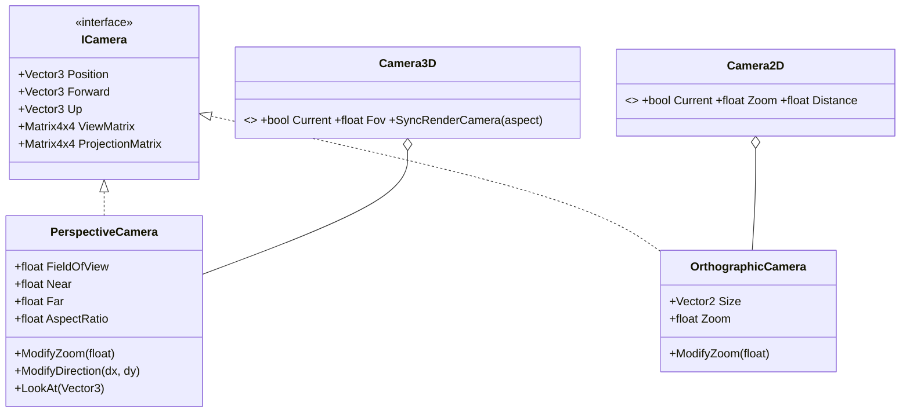

# Cameras & Input

## Purpose

Cameras provide view and projection matrices to every drawable. In scenes they are nodes
(`Camera3D`, `Camera2D`) that the render server uses for their viewport; the matrix math lives in
`PerspectiveCamera` / `OrthographicCamera`, which tree-less code can still use directly. Input from the
window is routed through the scene tree as `InputEvent`s (`Node.OnInput` / `OnUnhandledInput`); games
can also read Silk's `InputContext` directly.

## Key types

| Type | File |
|---|---|
| `ICamera` | [Camera/ICamera.cs](../../MainframeEngine/Src/Rendering/Camera/ICamera.cs) — `Position`, `Forward`, `Up`, `ViewMatrix`, `ProjectionMatrix` |
| `PerspectiveCamera` | [Camera/PerspectiveCamera.cs](../../MainframeEngine/Src/Rendering/Camera/PerspectiveCamera.cs) (was `Camera3D` before M2) |
| `OrthographicCamera` | [Camera/OrthographicCamera.cs](../../MainframeEngine/Src/Rendering/Camera/OrthographicCamera.cs) (was `Camera2D`) |
| `Camera3D` (node) | [Scene/Nodes3D/Camera3D.cs](../../MainframeEngine/Src/Scene/Nodes3D/Camera3D.cs) |
| `Camera2D` (node) | [Scene/Nodes2D/Camera2D.cs](../../MainframeEngine/Src/Scene/Nodes2D/Camera2D.cs) |
| `InputEvent*`, `InputRouter` | [Scene/Input/](../../MainframeEngine/Src/Scene/Input/) |

All math is `System.Numerics`: right-handed, row vectors. Projections produce depth in **[0, 1]**.

## Camera nodes

- **`Camera3D : Node3D`** looks along its global `-Z` from its global position. Exported: `Current`,
  `Fov` (45°), `Near` (0.1), `Far` (1000). The viewport's active camera is the last one made
  `Current`, else the first to enter (`SceneViewport.ActiveCamera3D`). Each frame the render server calls
  `SyncRenderCamera(aspect)` — position, forward, up (global basis Y) and the swapchain aspect — and draws
  with `RenderCamera` (the wrapped `PerspectiveCamera`). Orient it with `LookAt(target)` or
  `RotationDegrees`.
  **Rays:** `ProjectRayOrigin(pixel)` / `ProjectRayNormal(pixel)` give the world ray through a framebuffer pixel
  (top-left origin; the viewport's `Size`, so pass `SceneViewport`/input pixel coordinates), like Godot's
  `project_ray_origin/normal`. `Camera3D.ProjectRay(ICamera, pixel, viewportSize)` is the tree-less form; feed the
  ray to `DirectSpaceState` for picking.
- **`Camera2D : Node2D`**: `Current`, `Zoom`, `Distance` (how far in front of the z = 0 plane it sits,
  default 500). Used when the viewport has no 3D camera; the framebuffer size becomes its `Size`.

## `PerspectiveCamera`

| Property | Default / behaviour |
|---|---|
| `Forward` / `Up` | −Z / +Y |
| `Yaw` / `Pitch` | −90° / 0°. Pitch is clamped to ±89°. |
| `FieldOfView`, `Near`, `Far` | 45°, 0.1, 1000. `ModifyZoom` clamps the FOV to 1–90°. |
| `ViewMatrix` | `CreateLookAt(Position, Position + Forward, Up)` |
| `ProjectionMatrix` | `CreatePerspectiveFieldOfView(FOV, AspectRatio, Near, Far)` |
| `ModifyDirection(dx, dy)` | `yaw += dx; pitch -= dy`, then rebuilds `Forward` |
| `LookAt(target)` | sets `Forward` and recomputes yaw/pitch |

Tree-less code must set `AspectRatio` every frame (from `IVulkanContext.SwapchainExtent` — pixels, the
image being rendered; see [Build & platforms](build-and-platforms.md#windowing-sdl2)).

## `OrthographicCamera`

Orthographic projection: `CreateOrthographic(Size.X·Zoom, Size.Y·Zoom, 0.1, 1000)`, centred on
the camera. `ModifyZoom(a)` computes `Zoom = clamp(Zoom + a·0.1, 0.001, 10)`.

## Input

The engine creates `InputContext` in `OnLoad` (Silk's **SDL** input backend: keyboard, mouse, gamepads)
and an `InputRouter` that turns its callbacks into events pushed through the scene tree
(`SceneTree.PushInput`): `InputEventKey` (key, scancode, pressed), `InputEventText`,
`InputEventMouseButton`, `InputEventMouseMotion` (position, relative), `InputEventMouseWheel`,
`InputEventGamepadButton`, `InputEventGamepadAxis` (sticks, triggers). Nodes get them in `OnInput` in
reverse tree order, then `OnUnhandledInput`, until one calls `GetViewport().SetInputAsHandled()`; paused
nodes get none. Events are reused instances (read them in the callback, `Clone()` to keep one). Devices
connected later are picked up. See [Scene graph & nodes](scene-graph-and-nodes.md#input).

**Input actions (M10).** Every tree also keeps polled state (`SceneTree.Input`, an `InputState`) fed by `PushInput`
before the UI and nodes: `InputMap` actions (keys, mouse buttons, gamepad buttons and axis directions, from
`project.mfproj`), read with `Input.IsActionPressed/JustPressed/JustReleased`, `GetActionStrength`, `GetAxis`,
`GetVector`, or on events with `inputEvent.IsActionPressed("jump")`. See
[Projects & GameHost → Input actions](project-and-gamehost.md#input-actions).

`CursorMode.Raw` maps to SDL relative mouse mode. `just qa` can drive a scripted right-drag through SDL's
event queue (`--qa-input <frame>`), which checks the SDL → `IMouse` → `InputRouter` → `FlyCamera` path end
to end.

### Sandbox controls

The Sandbox camera is a `FlyCamera : Camera3D` node in its scene; `Game` handles the cursor and Escape.

| Input | Action |
|---|---|
| Hold **right mouse** | Enable fly camera (cursor → Raw). Release → Normal. |
| Mouse move (while held) | yaw/pitch by `LookSensitivity` (0.1°/px), pitch clamped ±89° |
| W / S | forward / back along the camera's forward |
| A / D | strafe along `Cross(Forward, +Y)` |
| Q / E | down / up along +Y |
| Left Shift | 2× speed (`Speed`, 10 u/s) |
| Left Alt | toggle Raw/Normal cursor (does not enable look) |
| Escape | quit |

Tree-less code (no scene tree) can use the math cameras directly. Movement is enabled whenever the
cursor is Raw; in 2D, mouse movement pans and the wheel zooms.

## Known issues

- README says "right-click to capture, Alt to release". The code is hold-right-click to move, and Alt only toggles the cursor.
- ImGui does not consume input before the tree (the game UI server will, M8).

## Related docs

[Coordinate conventions](coordinate-conventions.md) · [Sandbox](sandbox.md) · [ImGui & debug tools](imgui-and-debug-tools.md) ·
[Scene graph & nodes](scene-graph-and-nodes.md)
