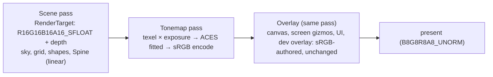

# Color Pipeline

## Purpose

How colour flows from authored values to the display: linear-space lighting in an HDR offscreen
target, an exposure + ACES tonemap pass, sRGB encoding for the swapchain, and the UI composited after
tonemapping so it looks exactly as authored. Implemented in
[`VulkanRenderer.Presentation.cs`](../../MainframeEngine/Src/Rendering/Vulkan/VulkanRenderer.Presentation.cs),
[`RenderTarget`](../../MainframeEngine/Src/Rendering/Vulkan/RenderTarget.cs),
[`ColorSpace`](../../MainframeEngine/Src/Rendering/ColorSpace.cs) and
[`Post/Tonemap.vk.frag`](../../MainframeEngine/Content/Shaders/Post/Tonemap.vk.frag). Decisions:
[ADR 0006](../../memory/decisions/0006-color-pipeline-aces-and-unorm-swapchain.md).

Before M3 the swapchain was UNORM, lighting ran on gamma-encoded values (overlapping lights clipped to
white), sky textures were sRGB and came out darker, and Spine's premultiplied alpha was applied twice.

## Frame

| Step | Who | Detail |
|---|---|---|
| `BeginRenderPass()` | Engine, after the shadow pass | Begins the scene target pass; clears colour to `SetClearColor` **converted to linear**, depth to 1 |
| scene draws | `RenderServer.RenderMain` (the scene tree), then game `OnRenderMainPass` | Pipelines built against `IVulkanContext.RenderPass` (the scene pass) write linear HDR colour |
| `BeginOverlayPass()` | `EndFrame` | Ends the scene pass; begins the swapchain pass; draws the fullscreen tonemap triangle; leaves the pass open for the overlay |
| overlay draws | canvas, `ScreenGizmos`, UI layers, dev overlay (`OverlayOrder`) | Pipelines built against `IVulkanContext.OverlayRenderPass` |
| `EndFrame()` | Engine | Runs whatever step is missing (a frame always ends tonemapped and presentable), ends the pass, optional frame capture |

## Formats and colour spaces

| Asset | Format / space | Converted where |
|---|---|---|
| Scene target | `R16G16B16A16_SFLOAT`, linear Rec.709 | — |
| Swapchain | `B8G8R8A8_UNORM` (or `R8G8B8A8_UNORM`), sRGB-encoded by the tonemap shader | see [Swapchain](#swapchain) |
| Albedo, sky, straight-alpha Spine atlas | `R8G8B8A8_SRGB` (`TextureColorSpace.Srgb`) | sampler decodes |
| Data textures (normals, masks, font coverage) | `R8G8B8A8_UNORM` (`TextureColorSpace.Linear`) | — |
| Premultiplied Spine atlas (`pma: true`) | `R8G8B8A8_UNORM` | `SpineLit.vk.frag`: un-premultiply → decode → re-premultiply |
| Light colour, ambient | authored sRGB (`Light.Color`, `LightEnvironment.AmbientColor`) | once, when set (`Light.LinearColor`) |
| Shape colour (`System.Drawing.Color`), grid line colour, Spine slot tint, sky gradient/sun colour | authored sRGB | in the shader (`srgbToLinear`, `include/common.glsl`) |
| Clear colour | authored sRGB | `BeginRenderPass` |
| Screen-gizmo vertex colours | authored sRGB | not converted (drawn after the tonemap into a UNORM target) |

`ColorSpace.SrgbToLinear/LinearToSrgb` (C#) and `srgbToLinear/linearToSrgb` (GLSL) are the exact
IEC 61966-2-1 curves.

## Tonemap

- **Curve:** ACES filmic, Stephen Hill's fit of the RRT + sRGB ODT (input matrix, rational fit, output
  matrix), the usual "ACES fitted". Greys stay grey, black stays black, highlights roll off below 1
  (the procedural sky's `SunIntensity = 20` no longer clips). `ColorSpace.AcesFitted` is a C# mirror the
  render tests compare against. No bloom (ADR).
- **Exposure:** `IVulkanContext.Exposure` multiplies the HDR colour first. Default
  `IVulkanContext.DefaultExposure = 1.3`, calibrated so a white surface lit at ~0.75 (the test scenes'
  sun) shows about as bright as before the HDR pipeline; adjust it with the Demo's Basic 3D **Exposure** slider
  (or `RendererDebugWindow`).
- **Ambient default:** `LightEnvironment.DefaultAmbientColor` is sRGB (0.22, 0.22, 0.25) — linear
  ≈ 0.04, which after ACES' toe lights unlit surfaces like the old gamma-space (0.08, 0.08, 0.10) did.
  `WorldEnvironment.AmbientColor` defaults to the same value.
- The pass reads the scene with `texelFetch` at `gl_FragCoord` (one texel per pixel, no filtering),
  viewport not flipped (the scene image already has +Y up).

## Swapchain

`ChooseSurfaceFormat` (unit-tested) picks, in order:

| Encoding | When | Tonemap | Overlays (gizmos, UI) |
|---|---|---|---|
| `UnormShaderEncode` | default: an 8-bit UNORM format in `SRGB_NONLINEAR` | encodes sRGB in the shader | same pass, colours written as-is — **byte-identical** to before M3, including blending |
| `SrgbWithUnormOverlay` | only sRGB formats + `VK_KHR_swapchain_mutable_format` (or `MAINFRAME_SWAPCHAIN_ENCODING=srgb-mutable`) | writes an sRGB view (hardware encode) | separate overlay pass on a UNORM view of the same image (`LoadOp = LOAD`) |
| `SrgbOnly` | only sRGB formats, no extension (or `=srgb`) | sRGB view | linearises its colours (specialization constant); blending then happens in linear space |

The proposal preferred `B8G8R8A8_SRGB`. The UNORM path is the default because it is the only one that
keeps the overlays exact without a second pass over the swapchain image, it is one pass cheaper on tile-based
GPUs, and on MoltenVK the UNORM view of a mutable-format swapchain image intermittently refers to a
stale drawable (the overlay then misses the presented image on some frames — observed in the
`color-pipeline` render test). All three paths produce byte-identical scene pixels; the override exists
for QA.

## Spine premultiplied alpha

Handled once, in `SpineLit.vk.frag`: the CPU passes the slot/skeleton tint straight (never × alpha);
the shader premultiplies (straight atlases, decoded by the sRGB sampler) or un-premultiplies, decodes and
re-premultiplies (PMA atlases, stored UNORM because the exporter multiplied in sRGB space); output is
premultiplied with blend `One, OneMinusSrcAlpha`. The specialization constant `kPremultipliedTexture`
comes from the atlas page's `pma` flag.

## Render targets

`RenderTarget(ctx, RenderTargetDesc, extent)`: any number of colour attachments
(`RenderTargetAttachment(format, finalLayout, usage)`, e.g. `Sampled(R16G16B16A16_SFLOAT)` or
`Readback(R32_UINT)`) plus an optional depth attachment (`SampleDepth` keeps it). Every attachment is
cleared on `Begin(cb, clearValues)`. `Resize(extent)` recreates the images and framebuffer through the
deletion queue but keeps the render pass, so pipelines stay valid (callers rewrite descriptor sets that
sample it). Subpass dependencies order this frame's writes after the previous frame's sampling/copies
of the same images and make the writes visible to fragment sampling and transfers. The renderer's
scene target is one (`IVulkanContext.SceneTarget`); the editor viewport's colour + depth + object-ID
target will be another.

## Testing

- `color-pipeline` render scene: a panoramic sky made from a solid sRGB texture fills the frame, so
  every scene pixel must equal `encode(aces(decode(c) · exposure))` (±2) at two exposures; an opaque
  screen-gizmo rectangle must keep its exact sRGB value and 50 % white over black must give 128 (sRGB-space
  blend, as before). Covers the sRGB texture decode, HDR target, exposure, ACES, encode and the overlay.
- `sky-grid` render scene: every procedural-sky pixel away from the grid lines must equal the CPU reference
  (ray → gradient → exposure → ACES → encode, ±3) — the whole chain on a gradient, on every driver.
- Unit tests: transfer curves, ACES properties, default-exposure and sky-ground calibration, swapchain choice.
- Goldens (`moltenvk`) re-recorded for M3 and reviewed: no clipping where lights overlap, coloured
  lights stay saturated, shadows keep the ambient tint.

## Known issues

- The procedural sky's ground gradient was inverted before M3 (ground colour at the horizon); fixed, and
  the ground default recalibrated for ACES ([Sky](sky.md#procedural-parameters)), so the area beyond the test
  scenes' floor is a muted earth tone. The scene grid draws before the floor and writes depth, so grid lines
  over the floor can show the sky behind it where the coplanar z-fight goes the line's way — a pre-existing
  ordering artefact.
- No bloom, no auto-exposure, no HDR display output.

## Related docs

[Vulkan renderer](vulkan-renderer.md) · [GPU resources](gpu-resources.md) · [Shaders](shaders.md) ·
[Coordinate conventions](coordinate-conventions.md#color-space) · [Spine](spine.md) · [Sky](sky.md) ·
[Lighting](lighting.md)
