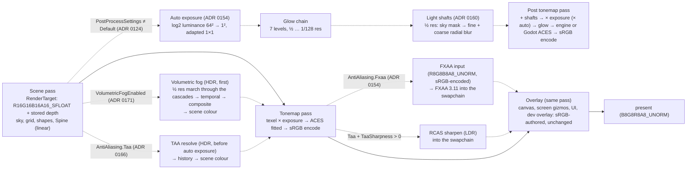
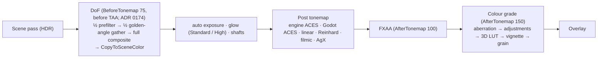

# Color Pipeline

## Purpose

How colour flows from authored values to the display: linear-space lighting in an HDR offscreen
target, an exposure + ACES tonemap pass, sRGB encoding for the swapchain, and the UI composited after
tonemapping so it looks exactly as authored. Implemented in
[`VulkanRenderer.Presentation.cs`](../../MainframeEngine/Src/Rendering/Vulkan/VulkanRenderer.Presentation.cs),
[`RenderTarget`](../../MainframeEngine/Src/Rendering/Vulkan/RenderTarget.cs),
[`ColorSpace`](../../MainframeEngine/Src/Rendering/ColorSpace.cs) and
[`Post/Tonemap.vk.frag`](../../MainframeEngine/Content/Shaders/Post/Tonemap.vk.frag). Decisions:
[ADR 0006](../../memory/decisions/0006-color-pipeline-aces-and-unorm-swapchain.md).

Before M3 the swapchain was UNORM, lighting ran on gamma-encoded values (overlapping lights clipped to
white), sky textures were sRGB and came out darker, and Spine's premultiplied alpha was applied twice.

Since ADR 0163 the effects around the tonemap are `PostEffect`s in stages (`BeforeTonemap`: volumetric fog (ADR 0171),
depth of field, TAA (TAAU while upscaling, ADR 0174), the spatial upscale, auto exposure, glow, light shafts; `AfterTonemap`: TAA's sharpen, FXAA, the colour grade and film effects of ADR 0168),
recorded by the main view's `PostProcessStack`, and a depth prepass with motion
vectors can run before the scene pass: see [Post-processing](post-processing.md). The colour handling below is
unchanged by it.

## Frame

| Step | Who | Detail |
|---|---|---|
| `BeginRenderPass()` | Engine, after the shadow pass (and the depth prepass, when one ran) | Begins the scene target pass; clears colour to `SetClearColor` **converted to linear**, depth to 1 (the depth is stored for light shafts, ADR 0160), or, after a prepass (ADR 0163), loads the prepass depth |
| scene draws | `RenderServer.RenderMain` (the scene tree), then game `OnRenderMainPass` | Pipelines built against `IVulkanContext.RenderPass` (the scene pass) write linear HDR colour |
| `BeginOverlayPass()` | `EndFrame` | Ends the scene pass; records the `BeforeTonemap` effects; begins the swapchain pass (or the `AfterTonemap` stage's LDR image); draws the fullscreen tonemap triangle; records the `AfterTonemap` effects, the last of which draws into the swapchain pass; leaves the pass open for the overlay |
| overlay draws | canvas, `ScreenGizmos`, UI layers, dev overlay (`OverlayOrder`) | Pipelines built against `IVulkanContext.OverlayRenderPass` |
| `EndFrame()` | Engine | Runs whatever step is missing (a frame always ends tonemapped and presentable), ends the pass, optional frame capture |

## Formats and colour spaces

| Asset | Format / space | Converted where |
|---|---|---|
| Scene target | `R16G16B16A16_SFLOAT`, linear Rec.709 | — |
| Swapchain | `B8G8R8A8_UNORM` (or `R8G8B8A8_UNORM`), sRGB-encoded by the tonemap shader | see [Swapchain](#swapchain) |
| Albedo, sky, straight-alpha Spine atlas | `R8G8B8A8_SRGB` (`TextureColorSpace.Srgb`) | sampler decodes |
| Data textures (normals, masks, font coverage) | `R8G8B8A8_UNORM` (`TextureColorSpace.Linear`) | — |
| Premultiplied Spine atlas (`pma: true`) | `R8G8B8A8_UNORM` | `SpineLit.vk.frag`: un-premultiply → decode → re-premultiply |
| Light colour, ambient | authored sRGB (`Light.Color`, `LightEnvironment.AmbientColor`) | once, when set (`Light.LinearColor`) |
| Shape colour (`System.Drawing.Color`), grid line colour, Spine slot tint, sky gradient/sun colour | authored sRGB | in the shader (`srgbToLinear`, `include/common.slang`) |
| Clear colour | authored sRGB | `BeginRenderPass` |
| Screen-gizmo vertex colours | authored sRGB | not converted (drawn after the tonemap into a UNORM target) |

`ColorSpace.SrgbToLinear/LinearToSrgb` (C#) and `srgbToLinear/linearToSrgb` (Slang, `include/common.slang`) are the exact
IEC 61966-2-1 curves.

## Tonemap

- **Curve:** ACES filmic, Stephen Hill's fit of the RRT + sRGB ODT (input matrix, rational fit, output
  matrix), the usual "ACES fitted". Greys stay grey, black stays black, highlights roll off below 1
  (the procedural sky's `SunIntensity = 20` no longer clips). `ColorSpace.AcesFitted` is a C# mirror the
  render tests compare against. Bloom/glow and Godot's ACES are opt-in per world ([ADR 0124](../../memory/decisions/0124-godot-tonemap-and-glow.md); see below).
- **Exposure:** `IVulkanContext.Exposure` multiplies the HDR colour first. Default
  `IVulkanContext.DefaultExposure = 1.3`, calibrated so a white surface lit at ~0.75 (the test scenes'
  sun) shows about as bright as before the HDR pipeline; adjust it with the Demo's Basic 3D **Exposure** slider
  (or `RendererDebugWindow`).
- **Ambient default:** `LightEnvironment.DefaultAmbientColor` is sRGB (0.22, 0.22, 0.25) — linear
  ≈ 0.04, which after ACES' toe lights unlit surfaces like the old gamma-space (0.08, 0.08, 0.10) did.
  `WorldEnvironment.AmbientColor` defaults to the same value.
- The pass reads the scene with `texelFetch` at `gl_FragCoord` (one texel per pixel, no filtering),
  viewport not flipped (the scene image already has +Y up).

## Swapchain

`ChooseSurfaceFormat` (unit-tested) picks, in order:

| Encoding | When | Tonemap | Overlays (gizmos, UI) |
|---|---|---|---|
| `UnormShaderEncode` | default: an 8-bit UNORM format in `SRGB_NONLINEAR` | encodes sRGB in the shader | same pass, colours written as-is — **byte-identical** to before M3, including blending |
| `SrgbWithUnormOverlay` | only sRGB formats + `VK_KHR_swapchain_mutable_format` (or `MAINFRAME_SWAPCHAIN_ENCODING=srgb-mutable`) | writes an sRGB view (hardware encode) | separate overlay pass on a UNORM view of the same image (`LoadOp = LOAD`) |
| `SrgbOnly` | only sRGB formats, no extension (or `=srgb`) | sRGB view | linearises its colours (specialization constant); blending then happens in linear space |

The proposal preferred `B8G8R8A8_SRGB`. The UNORM path is the default because it is the only one that
keeps the overlays exact without a second pass over the swapchain image, it is one pass cheaper on tile-based
GPUs, and on MoltenVK the UNORM view of a mutable-format swapchain image intermittently refers to a
stale drawable (the overlay then misses the presented image on some frames — observed in the
`color-pipeline` render test). All three paths produce byte-identical scene pixels; the override exists
for QA.

## Spine premultiplied alpha

Handled once, in `SpineLit.vk.frag`: the CPU passes the slot/skeleton tint straight (never × alpha);
the shader premultiplies (straight atlases, decoded by the sRGB sampler) or un-premultiplies, decodes and
re-premultiplies (PMA atlases, stored UNORM because the exporter multiplied in sRGB space); output is
premultiplied with blend `One, OneMinusSrcAlpha`. The specialization constant `kPremultipliedTexture`
comes from the atlas page's `pma` flag.

## Render targets

`RenderTarget(ctx, RenderTargetDesc, extent)`: any number of colour attachments
(`RenderTargetAttachment(format, finalLayout, usage)`, e.g. `Sampled(R16G16B16A16_SFLOAT)` or
`Readback(R32_UINT)`) plus an optional depth attachment (`SampleDepth` keeps it). Every attachment is
cleared on `Begin(cb, clearValues)`. `Resize(extent)` recreates the images and framebuffer through the
deletion queue but keeps the render pass, so pipelines stay valid (callers rewrite descriptor sets that
sample it). Subpass dependencies order this frame's writes after the previous frame's sampling/copies
of the same images and make the writes visible to fragment sampling and transfers. The renderer's
scene target is one (`IVulkanContext.SceneTarget`); the editor viewport's colour + depth + object-ID
target will be another.

## Testing

- `color-pipeline` render scene: a panoramic sky made from a solid sRGB texture fills the frame, so
  every scene pixel must equal `encode(aces(decode(c) · exposure))` (±2) at two exposures; an opaque
  screen-gizmo rectangle must keep its exact sRGB value and 50 % white over black must give 128 (sRGB-space
  blend, as before). Covers the sRGB texture decode, HDR target, exposure, ACES, encode and the overlay.
- `sky-grid` render scene: every procedural-sky pixel away from the grid lines must equal the CPU reference
  (ray → gradient → exposure → ACES → encode, ±3) — the whole chain on a gradient, on every driver.
- `fxaa` render scene (`FxaaSmoothsEdgesButNotTheOverlay`, golden): FXAA blends the edges of an unshaded box (hundreds of
  grey pixels where no AA has none) and a screen-gizmo square drawn after it stays exact, with nothing bleeding out.
- `auto-exposure` render scene (`AutoExposureBrightensADarkSceneOverTime`, golden at frame 80): the light dims on frame
  20; the frame after is dark and 60 fixed frames later the mean luminance has risen ≥ 1.6× without overshooting.
- `sky-physical --count 2`: 0 B per frame with a moving sun, auto exposure, glow and FXAA (allocation gate).
- `light-shafts` render scene (`ShaftsStreamThroughTheGapsBetweenPosts`, golden at frame 6): a physical-sky sun 10° up
  behind a row of tall posts, the camera looking straight at it (the scene checks that `LightShaftsSun` puts it at the
  centre, fade 1). Against the same frame without shafts, the mean luminance rises by more than 10 and, on a circle
  below the sun, what the shafts add varies by more than 40 (streaks through the gaps, not a uniform glow).
  `--count 2` swings the sun ±90° through the screen and out past its edges: 0 B per frame (allocation gate).
- `volumetric-fog` render scene (ADR 0171, `VolumetricFogTests`, golden at frame 30 on both drivers): uniform fog under a
  wide roof with a 3 × 3 m hole, a high sun, an unshaded black wall beyond the fog's length. Across a row through the
  beam, the brightest pixels are > 3× (and > 15 codes above) the shadowed fog at the image's edges, which is still above
  the frame without volumetric fog (sky ambient); without it the row is flat. Still frames 60–62 differ by < 0.25 codes on
  average (≤ 16 anywhere) and frame 60 is within 0.5 of frame 30 (converged). `--count 2` swings the camera ±12°: 0 B
  per frame (allocation gate).
- `post-grade`, `post-dof`, `post-film` and `glow --count 3|4` (ADR 0168, `CinematicPostTests`): an identity LUT leaves the
  colour chart within ±1, a channel-rotation LUT gives the rotated colours (±2; at strength 0.5 their mix), the
  adjustments follow Godot's formula, every tonemapper matches `TonemapCurves` (±2; AgX golden), far DoF blurs the far wall
  (contrast < 0.6×) and leaves the subject (≤ 1 mean difference; golden), near DoF blurs the box's edge and leaves the
  wall, the vignette follows its formula and darkens outwards, grain keeps the mean (±1), varies frame to frame and is
  the same on every run, aberration fringes the bars and leaves flat grey grey (golden), glow High bleeds only above the
  threshold (golden); 0 B per frame with the whole chain on, and a resize.
- Unit tests: transfer curves, ACES properties, default-exposure and sky-ground calibration, swapchain choice;
  auto-exposure blend and clamps, the anti-aliasing setting's defaults and `project.mfproj` round trip; light-shaft
  defaults, sample clamp and per-pass step/decay, the sun's screen position and fade (behind, at 90°, the off-screen
  sweep, orthographic cameras) and the `WorldEnvironment` round trip (`LightShaftsTests`).
- Goldens (`moltenvk`) re-recorded for M3 and reviewed: no clipping where lights overlap, coloured
  lights stay saturated, shadows keep the ambient tint.

## Known issues

- The procedural sky's ground gradient was inverted before M3 (ground colour at the horizon); fixed, and
  the ground default recalibrated for ACES ([Sky](sky.md#procedural-parameters)), so the area beyond the test
  scenes' floor is a muted earth tone. The scene grid draws before the floor and writes depth, so grid lines
  over the floor can show the sky behind it where the coplanar z-fight goes the line's way — a pre-existing
  ordering artefact.
- No HDR display output.
- SubViewports always use the engine curve without glow, auto exposure, light shafts, FXAA, TAA or any other post
  effect (ADR 0124, ADR 0154, ADR 0160, ADR 0163, ADR 0166), so the editor viewport shows no grade, DoF or film effects
  either.
- Volumetric fog (ADR 0171): sun only (no local lights; froxels wait for M11's compute); one shadow tap per step (no
  PCSS, no cascade blend: a faint step at a cascade boundary in thin fog); transparent surfaces and water get the fog of
  the air behind them (they write no depth); the sky ambient it scatters is not occluded under the canopy until G8e.1's
  probes; no quality setting yet (always ½ res × 24 steps).
- Depth of field has one layer: a near-field blur over a high-frequency background shows half-resolution sparkle along
  its silhouette (separate near/far layers and TAA would fix it; ADR 0168). No lens dirt (`GlowMap`) yet.

## Godot tonemap and glow (ADR 0124)

A `WorldEnvironment`'s `PostProcessProfile` (`WorldEnvironment.PostProcess`, ADR 0169; [Post-processing → The
profile](post-processing.md#the-profile)) can ask for Godot 4.7's tonemap and glow (`Tonemapper = GodotAces`, `TonemapExposure`,
`TonemapWhite`; `GlowEnabled`, `GlowLevel1..7`, `GlowNormalized`, `GlowIntensity`, `GlowStrength`, `GlowMix`,
`GlowBloom`, `GlowBlendMode`, `GlowHdrThreshold/Scale/LuminanceCap`, all with Godot's defaults). The render server copies
the root world's `PostProcessSettings` to `IVulkanContext.PostProcess` each frame. With the default settings the frame is
exactly as above. Otherwise `BeginOverlayPass` records `GlowEffect` (two raster passes per level, `GlowBlur.vk.frag`,
Godot's 9-tap kernel, strength per level, exposure + threshold feedback + cap on the first level) between the scene pass
and the swapchain pass, then draws `TonemapPost.vk.frag`: × exposure, glow gathered with Godot's bicubic B-spline and
blended (Screen by default) before the curve, the engine's ACES fit or Godot's (input × 1.8, output ÷ the curve at
1.8 · white), soft-light glow after it, sRGB encode.

## Auto exposure (ADR 0154)

`PostProcessProfile.AutoExposureEnabled` (default off; `AutoExposureScale` 0.4 and `AutoExposureSpeed` 0.5 are Godot's,
`AutoExposureMinLuminance` 0.05, `AutoExposureMaxLuminance` 2) puts the root world's frame on the post tonemap pass and
records [`AutoExposure`](../../MainframeEngine/Src/Rendering/Post/AutoExposure.cs) after the scene pass, before the glow.
Everything is a raster pass and nothing is read back to the CPU:

| Pass | Target | Shader |
|---|---|---|
| Log luminance | 64 × 64 `R16_SFLOAT` | `AutoExposureLuminance`: per texel, the mean `log2(max(Y, 1e-5))` of a 4 × 4 grid of scene texels over its footprint |
| Reduce × 3 | 16², 4², 1² `R16_SFLOAT` | `AutoExposureReduce`: the mean of a 4 × 4 block |
| Adapt | 1 × 1 `R32_SFLOAT` | `AutoExposureAdapt`: `L = clamp(2^mean, min, max)`; `adapted = prev + (L − prev) · (1 − e^(−dt·speed))`, snapping on the first frame after it is enabled |
| Copy | 1 × 1 `R32_SFLOAT` | `AutoExposureReduce` again: adapted → previous, for the next frame |

`TonemapPost` and the glow's first level multiply the scene by `exposure × AutoExposureScale / adapted`: the manual
exposure (`IVulkanContext.Exposure`, or `TonemapExposure` for the Godot curve) is compensation on top. `dt` is
`IVulkanContext.FrameDeltaTime`, which `Engine` sets from `GameTime.DeltaTime` (fixed under `--fixed-fps`, so adaptation is
deterministic in render tests). Nothing blends, so no format needs blend support. Proposal G8d.3 describes a 64-bin
histogram with percentile clipping; this first version uses the mean log luminance (the histogram can replace the reduce
passes later without changing the tonemap side).

## FXAA (ADR 0154)

`AntiAliasing { None, Fxaa }` — `rendering.antiAliasing` in `project.mfproj` (`GameHost` applies it),
`EngineOptions.AntiAliasing`, or `IVulkanContext.AntiAliasing` at runtime; default `None`. FXAA is an `AfterTonemap`
effect ([`FxaaEffect`](../../MainframeEngine/Src/Rendering/Post/FxaaEffect.cs), ADR 0163): with it the tonemap pass
(either pipeline, a copy built against the LDR image's render pass) writes sRGB-encoded values into an
`R8G8B8A8_UNORM` image of the swapchain's size (the stage's first LDR image, owned by the renderer); the
present pass then draws `Post/Fxaa.vk.frag` (FXAA 3.11, PC quality preset 12, luma computed from the encoded colour) and
the overlay renderers follow in the same pass, so the 2D canvas, gizmos, UI and dev overlay are never filtered. On an
sRGB swapchain view the FXAA shader decodes before writing (the view encodes again). `AntiAliasing.Taa` replaces it
(below): one mode at a time.

## TAA (ADR 0166)

`AntiAliasing.Taa` resolves the jittered HDR scene colour against a history **before** auto exposure, glow, light shafts
and the tonemap ([`TaaEffect`](../../MainframeEngine/Src/Rendering/Post/TaaEffect.cs), `Post/Taa.vk.frag`; the
algorithm is in [Post-processing → TAA](post-processing.md#taa)), so every later step reads a stable, jitter-free image:
exposure metering and glow thresholds do not flicker with the jitter. The colour handling around it:

- **Linear HDR in, linear HDR out.** The history is `R16G16B16A16_SFLOAT` like the scene colour and is copied back into
  it (`CopyToSceneColor`); the tonemap is unchanged.
- **Karis luminance weighting.** The resolve blends `c / (1 + exposure · luma(c))` and unweights the result: a
  partially covered pixel averages roughly what the tonemap will show (a white needle on bright sky does not dominate
  its pixel), and bright texels through the canopy do not flicker. The weight uses the project exposure
  (`IVulkanContext.Exposure`), not auto exposure's adapted value (a few stops off only changes how strongly highlights
  are weighted).
- **The sharpen is LDR.** `rendering.taaSharpness` (0–1, default 0.25; `IVulkanContext.TaaSharpness`) runs RCAS on the
  tonemapped, display-encoded image as an `AfterTonemap` effect, like FXAA: the tonemap writes the stage's LDR image and
  the sharpen draws into the swapchain pass, under the canvas, gizmos and UI. 0 turns it off (the tonemap then draws
  straight into the swapchain again).
- **Water is reactive.** Water in the main view blends with `BlendMode.AlphaReactive`: colour as before, but the scene
  alpha becomes `dst · (1 − water alpha)`. Every opaque shader and the sky write alpha 1, so `1 − scene alpha` marks
  animated water that has no motion vectors of its own, and the resolve keeps less of its history there. Sub-viewports
  keep the plain `Alpha` blend (their alpha is the transparent background's).

## Light shafts (ADR 0160)

`PostProcessProfile.LightShaftsEnabled` (default off) streaks the sky around the sun through the gaps between leaves,
trunks and anything else that wrote depth: Mitchell's radial blur from GPU Gems 3 ch. 13, as fragment passes
([`LightShafts`](../../MainframeEngine/Src/Rendering/Post/LightShafts.cs)). The sun is the world's **first
`DirectionalLight3D`** (the physical sky's sun too); the render server projects its direction with the root camera
each frame into `IVulkanContext.LightShaftsSun` (`LightShaftsSun.Compute`: scene-image UV, 0,0 top-left, and a fade).

| Pass | Target | Shader |
|---|---|---|
| Mask | ½ res `R16G16B16A16_SFLOAT` | `LightShaftsMask`: the mean of each texel's 2 × 2 scene texels whose depth is still the cleared 1 (sky), each capped at luminance 8 (`LightShafts.LuminanceCap`; the sun disc would swamp the rest), × `(1 − smoothstep(0, 0.6, d))²` with `d` the aspect-corrected screen distance to the sun in screen heights |
| Fine blur | ½ res | `LightShaftsBlur`: `n` taps (`LightShaftsTapsPerPass`, `LightShaftsSamples` clamped to 4–64) towards the sun, step `density / n²` × (texel − sun), the i-th weighted `decay^(16 i / n²)`, averaged; bilinear, black past the image edges |
| Coarse blur | ½ res | the same shader with step `density / n` and `decay^(16 i / n)`: together `n²` effective taps over `LightShaftsDensity` (0.8) of the way to the sun, tap `k` weighing `LightShaftsDecay^(16 k / n²)` |

`LightShaftsDecay` (0.96) is the weight left after each sixteenth of a ray, so the look does not depend on the sample
count; the two-pass split keeps 2 × 16 taps per texel instead of 256 (and two encoders on Apple's tile-based GPUs).

**Composite:** the post tonemap pass (binding 3) samples the result bilinearly and adds it × `LightShaftsIntensity`
(1) × fade to the HDR scene **before exposure, alongside glow**: the shafts are scene radiance like the sky they come
from, but neither glow nor auto exposure sees them (both read the scene target, before the shafts exist). That saves a
full-resolution blend pass into the scene, keeps auto exposure from chasing the shafts, and puts a bright sky gap's
bloom and its shaft side by side rather than blooming the shaft.

**Fade:** 1 while the sun is on screen, `1 − smoothstep(0, 0.3, outside)` as it moves `outside` (in UV) past an edge
(`LightShaftsSun.OffscreenMargin`), 0 behind the camera, at 90° to it or with an orthographic camera. With fade 0 or
the shafts off, no shaft pass is recorded and the tonemap adds nothing.

**Depth:** the scene pass stores its depth (`RenderTargetDesc.SampleDepth`, final layout
`DEPTH_STENCIL_READ_ONLY_OPTIMAL`; `RenderTarget.End` adds the depth to its barrier) every frame. Storing measured
≤ 0.02 ms of the scene pass at 2560 × 1440 on an Apple M5 (MoltenVK; timestamps around the pass, three scenes,
600-frame averages), so it is not switched with the setting. No depth prepass is needed (with one, ADR 0163, the
scene pass loads and keeps the prepass depth in the same image). Transparent surfaces that do not write depth count as
sky.

Created the first frame that enables them (three ½-res `R16G16B16A16_SFLOAT` targets, ≈ 21 MiB at 1440p); the post set
binds the glow's smallest level as a placeholder until then, and a second post set binds the shafts, so no descriptor
set in flight is rewritten. Colour grading is ADR 0168's (below).

## Volumetric fog (ADR 0171)

`WorldEnvironment.VolumetricFogEnabled` (default off) fills the air within `VolumetricFogLength` (64 m) of the camera
with fog lit by the sun **through its shadow maps** ([ADR 0171](../../memory/decisions/0171-volumetric-fog.md), G8e.3):
shafts fall through every gap in the canopy whether the sun is on screen or not, and the shaded air stays clear. The
effect and its passes: [Post-processing → Volumetric fog](post-processing.md#volumetric-fog).

| Setting (Godot's name) | Default | What |
|---|---|---|
| `VolumetricFogDensity` | 0.05 | extinction per metre at and below `FogHeight`; above it thins like the height fog (`FogHeightDensity`) |
| `VolumetricFogAlbedo` | white (sRGB) | the colour the fog scatters light with |
| `VolumetricFogEmission` × `EmissionEnergy` | black × 1 | light the fog emits (an infinitely deep fog shows this colour) |
| `VolumetricFogAnisotropy` | 0.2 | Henyey–Greenstein g (−0.9..0.9): positive glows towards the sun |
| `VolumetricFogLength` | 64 m | how far the march reaches; the analytic fog takes over from there |
| `VolumetricFogDetailSpread` | 2 | step i of n ends at (i/n)^spread of the ray: finer steps near the camera |
| `VolumetricFogAmbientInject` | 0 | how much the sky's ambient light (the irradiance up and down) lights the fog |
| `VolumetricFogSkyAffect` | 1 | how much of the fog covers the sky |
| `VolumetricFogTemporalReprojectionEnabled` / `Amount` | on / 0.9 | blend each frame's march with the reprojected history |
| `VolumetricFogNoiseScale` / `NoiseStrength` (engine) | 8 m / 0 | a tiling 3D noise varies the density (0..2×); it drifts with the wind |

**Where it sits.** First in `BeforeTonemap`, on linear HDR scene radiance: `colour · T + in-scatter`, before TAA (which
smooths it with the image), auto exposure (which adapts to the fogged scene), glow and the tonemap. **The analytic fog**
(`applyFog`, `applySkyFog`) starts its integral at the length in a view that runs the march (`FogColor.a` = 1 + the
start), so distant hills keep their aerial perspective and nothing is counted twice; other views (sub-viewports without
post-processing) keep the whole integral.

**Light shafts with volumetric fog.** The screen-space shafts (ADR 0160) stay a separate `PostProcessProfile` effect;
they still work with volumetric fog on, but add a second, radial set of streaks and their bloom on top of the real
ones. The Forest turns them off (its R1 glade was milky with both).

## Cinematic post (ADR 0168)

The film look, all of it off by default ([ADR 0168](../../memory/decisions/0168-cinematic-post-chain.md); G8e.4 of the
[visual-quality proposal](future/forest-visual-quality.md#g8e4-cinematic-post-chain)). In frame order:

**Tonemappers.** `Tonemapper.Linear`, `Reinhard`, `Filmic` and `Agx` (ordinals 2–5 after `Engine` and `GodotAces`) are
Godot 4.4's `tonemap.glsl` curves in `TonemapPost` (MIT, credited in THIRD_PARTY_NOTICES); `TonemapCurves` mirrors them
in C# (unit and render tests compare). Every Godot curve uses `TonemapExposure` (`PostProcessSettings.ExposureFor`: the
engine curve keeps `rendering.exposure`). Reinhard is the extended formula, 1 at `max(1, TonemapWhite)`; filmic is Hable's
with Godot's 2× bias, divided by its value at that white (`FilmicWhiteTonemapped`); AgX is Blender's look (EaryChow's AgX
base: a log2 encoding from −12.47 to +4.03 EV in an inset Rec.2020, a 6th-order sigmoid fit, ^2.4, the outset back to
sRGB) and ignores the white. AgX takes a saturated colour to white as it brightens (the sun through leaves goes white,
not saturated yellow) and keeps its hue in the mid-tones; middle grey 0.18 stays ≈ 0.18 display-linear. The glow's white
(`GlowWhite`) is `max(1, white)` for ACES, Reinhard and filmic, 1 otherwise.

**Adjustments and LUT** (`PostProcessProfile`, Godot's names): `AdjustmentEnabled` turns on `AdjustmentBrightness`,
`AdjustmentContrast`, `AdjustmentSaturation` (Godot 4's `apply_bcs` on the display-encoded value: × brightness, around
0.5 by contrast, from the channel mean by saturation) and `AdjustmentColorCorrection`, a `Texture3D` looked up with
hardware trilinear at `c · (N − 1)/N + 0.5/N` (texel centres; an identity LUT reproduces the input within ±1), mixed in by
the engine's `AdjustmentColorCorrectionStrength` (1). LUTs are `.cube` files (`CubeLut`, `CubeLutImporter`: any 3D size
2–256, 1D tables and other domains resampled to 33³), stored as `R16G16B16A16_SFLOAT` 3D images
(`GpuTexture.Create3D`). The grade reads the stage's LDR image after FXAA (so the grain is not smoothed away) and writes
the swapchain (decoding first on an sRGB view).

**Glow quality.** `GlowQuality.Standard` is Godot's chain, bit for bit. `High` (Jimenez 2014) fills the same images
differently: `temp[k]` = the 13-tap downsample of the level above (bilinear taps at 0, ±1, ±2 source texels; on level 0
the five 2 × 2 boxes are Karis-weighted by `1 / (1 + luma)`, so one sun glint cannot flare a block, then exposure ×
auto exposure, the HDR threshold and the cap as Godot's level 0; × `GlowStrength` per level), then up the chain
`level[k] = tent3×3(level[k+1]) + weight_k · temp[k]` (tent taps `GlowEffect.UpsampleRadius` = 2 lower-level texels apart,
normalised: energy conserving). The tonemap composites `level[0]` alone (`GlowEffect.CombinedWeights`), with the blend
mode and intensity as before.

**Lens: `CameraAttributesPractical`** on `WorldEnvironment.CameraAttributes` or `Camera3D.Attributes` (the root view's
current camera's replaces the environment's, as a whole). Depth of field with Godot's names and defaults
(`DofBlurFarEnabled`, `DofBlurFarDistance` 10, `DofBlurFarTransition` 5, `DofBlurNearEnabled`, `DofBlurNearDistance` 2,
`DofBlurNearTransition` 1, `DofBlurAmount` 0.1) and engine film effects (`DofQuality` 16/32 taps, `VignetteIntensity`,
`VignetteRoundness`, `FilmGrainIntensity`, `FilmGrainSize`, `ChromaticAberrationIntensity`).

| Effect | How |
|---|---|
| **Depth of field** (`DepthOfFieldEffect`) | Blur 0–1 per pixel: linear over each plane's transition (`PostProcessSettings.DofBlur`), the larger of near and far; radius `amount × 64 × height / 1080` px (`DofMaxRadius`). View distance from the scene depth and the unjittered projection's M33/M34/M43/M44 (perspective or orthographic). **Prefilter** (½): per texel the signed CoC of its nearest depth when that is in the near field (the near blur dilates), else of its farthest (a sharp foreground edge never darkens the background's blur), and the mean colour of the 2 × 2 texels whose CoC is within a pixel of it. **Gather** (½): a golden-angle (Vogel) disc of 16 or 32 taps out to the radius, Gustafsson's single-pass bokeh: a tap counts where its own circle reaches this texel, a tap behind this texel is limited to twice this texel's circle (no background over a sharp subject), the others keep the running mean; alpha carries how far a foreground blur spread here. **Composite** (full): `lerp(sharp, bokeh, smoothstep(0.5, 1.5, max(|CoC|, spread)))`, then `CopyToSceneColor`. Targets from the pool: `dof prefilter`, `dof bokeh` (½), `dof composite` (full), RGBA16F |
| **Vignette** | In linear light: × `1 − intensity · r³` with `r²` 0 at the centre and 1 in the corners (aspect-corrected towards a circle by `VignetteRoundness`) |
| **Film grain** | Value noise on a `FilmGrainSize`-pixel lattice hashed (pcg3d) with the frame number, ±`intensity` display values × a response of 0.25 in black and white, 1 in the mid-tones; deterministic under `--fixed-fps` |
| **Chromatic aberration** | Red and blue read radially apart, `intensity` pixels at the corners |

**Cost** (the Forest at 1920 × 1080, Apple M5 (MoltenVK), GPU timestamps around the stages, p50 over 1 740 frames,
two runs each): the `AfterTonemap` stage takes 0.37–0.39 ms with the grade and 0.21–0.22 ms with FXAA alone, so the grade,
vignette and grain cost ≈ 0.16 ms; `just forest-bench` p50 13.85 ms with the grade, 13.84 / 14.39 ms without (noise; other
lanes' GPU work was running). R5's depth of field (32 taps) did not move the `BeforeTonemap` timestamps (0.33–0.34 ms
with it, 0.35 ms without) within their resolution on MoltenVK, which samples timestamps at encoder boundaries.

**The Forest** applies `Content/Grading/forest-morning.cube` (`ForestGrade`, generated: warm white balance sparing the
sky, a soft curve with lifted blacks, split toning, olive foliage, film saturation), vignette 0.2 and grain 0.015; R4 and
R5 are photo shots with subtle depth of field ([forest.md](forest.md#the-look-forestscenecreateenvironment-the-sun)).

## Related docs

[Post-processing](post-processing.md) · [Vulkan renderer](vulkan-renderer.md) · [GPU resources](gpu-resources.md) · [Shaders](shaders.md) ·
[Coordinate conventions](coordinate-conventions.md#color-space) · [Spine](spine.md) · [Sky](sky.md) ·
[Lighting](lighting.md)
