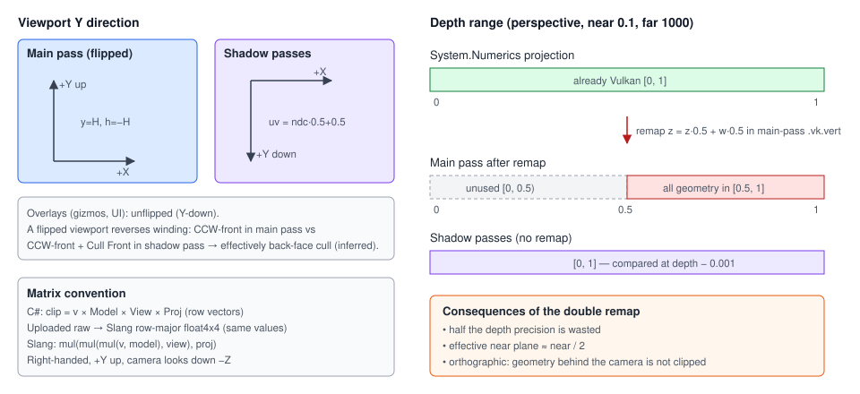

# Coordinate, Depth & Color Conventions

## Purpose

Collects the space, handedness, depth and color conventions that every renderer subsystem relies on.
Most subtle rendering bugs in the engine come from a mismatch here.

## Spaces & matrices

| Convention | Value |
|---|---|
| Math library | `System.Numerics` |
| Handedness | right-handed, +Y up, camera looks down −Z (3D) |
| 2D | **Y-down** like Godot and screen space (ADR 0110): `Node2D` +Y is down on screen, positive rotation is clockwise on screen, 2D gravity is +Y, `CharacterBody2D.UpDirection` is −Y. `Camera2D` and the editor's 2D view look at the z = 0 plane along **+Z** from behind it (a rotation, not a mirror), so 3D visuals drawn by a 2D camera show their back faces |
| Vector convention | **row vectors**: `world = v × Model`, `clip = v × Model × View × Proj` |
| Matrix upload | `Matrix4x4` is written raw into UBOs/push constants. Shaders are Slang compiled with `-matrix-layout-row-major` (ADR 0144), so a `float4x4` holds the C# matrix as-is and shaders use the same row-vector order: `mul(mul(mul(v, model), view), proj)` |
| Model matrix | `Scale × RotX × RotY × RotZ × Translation` (Euler degrees) |
| Light matrices | composed as `view * proj` (row-vector order) |

## Viewport

| Pass | Viewport | Why |
|---|---|---|
| Main pass: shapes, Spine, grid, sky | **Y-flipped** (`y = height`, `height = −height`) | Keep +Y up on screen, like GL |
| Shadow passes | not flipped | Shadow UVs are computed as `ndc·0.5 + 0.5` and match unflipped rendering |
| Overlay pass (screen gizmos, UI) | not flipped | Pixel space is Y-down, the same as Vulkan |

A flipped viewport reverses winding. Geometry is authored CCW. The main pass uses `FrontFace = CCW`
*with* the flip, so CCW stays front. The shadow passes render *without* the flip, so geometric front
faces arrive clockwise; their pipelines say so explicitly (`FrontFace = Clockwise`, `CullMode = Back`).
See [Shadow system](shadow-system.md#pipelines).

## Depth

| Convention | Value |
|---|---|
| Clip depth range | Vulkan [0, 1]. `CreatePerspectiveFieldOfView` already produces it. |
| Clear / compare | clear 1.0, `Less` |
| Near / far | `Camera3D`: 0.1 / 1000. Grid shader hard-codes the same values. |
| Shadow 2D | standard [0,1], compare bias 0.001 + raster depth bias 1.25 / 1.75 |
| Shadow point | linear `distance / range` written to `gl_FragDepth`, bias 0.015 |

Every pass writes `gl_Position` straight from the System.Numerics projection (already [0, 1]); no
vertex shader remaps depth. (Until M1 the main-pass shaders also applied the OpenGL remap
`z = z·0.5 + w·0.5`, which squeezed depth into [0.5, 1], halved precision and disagreed with the shadow
passes.) The grid shader's `LinearizeDepth` assumes this [0, 1] convention. Reversed-Z is deferred
([ADR 0004](../../memory/decisions/0004-renderer-stabilization-defaults.md)).

## Color space

| Surface | Format | Effect |
|---|---|---|
| Scene target | `R16G16B16A16Sfloat`, linear | Lighting and blending of scene content in linear space |
| Swapchain | `B8G8R8A8Unorm`, sRGB-encoded by the tonemap shader | Exposure + ACES, then sRGB encode |
| Sky, albedo, straight-alpha Spine textures | `R8G8B8A8Srgb` | Decoded to linear on sample |
| Data textures, PMA Spine atlases | `R8G8B8A8Unorm` | PMA atlases are decoded in the shader |
| Authored colours (lights, shapes, sky, grid, clear) | sRGB | Converted to linear once |
| Screen gizmos, UI | sRGB, drawn after the tonemap | Unchanged |

Details: [Color pipeline](color-pipeline.md).

## Related docs

[Vulkan renderer](vulkan-renderer.md) · [Shadow system](shadow-system.md) · [Cameras & input](cameras-and-input.md) ·
[Color pipeline](color-pipeline.md)
