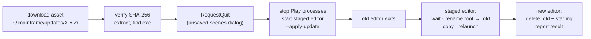

# Editor updates — check GitHub Releases, update in place

**Status:** implemented. Engine packages for games without the editor are a separate sub-project
([distribution via NuGet](future/distribution-nuget.md)); the release archives are described in
[Release & versioning](release.md).

## Problem

Installing the editor is "download the archive for your OS and unpack it". Updating is the same, by hand, with no
signal that a new version exists. The editor should notice a newer release and update itself with one click, on
macOS, Windows and Linux, without a terminal.

## Goals

- At launch the editor checks GitHub Releases in the background and, when a newer release has a build for this
  platform, shows a quiet badge in the Project Manager and the editor toolbar.
- One click — **Update & restart** — downloads the archive, verifies it, replaces the install and relaunches the new
  version, reopening the project that was open.
- Never interrupts work: no modal at startup; unsaved scenes go through the normal quit dialog; any failure leaves
  the old install working.
- Automatic checks can be turned off; **Help › Check for Updates…** still works in every run that has an update
  service (released builds; the item is disabled in tests, `--smoke`, `--qa-script` and `--hidden` runs).

## Non-goals

Code signing / notarization, delta updates, release channels (pre-releases, betas), installing older versions,
updating without a click, updating the engine packages or game projects.

## Behaviour

### When the editor checks

At startup, on a background task, unless any of these hold:

- `EditorSettings.CheckForUpdates` is `false` (Editor Settings checkbox "Check for updates at startup", default on);
- the editor is a development build: `EngineInfo.Version` has a pre-release suffix (`0.0.0-dev`);
- the editor runs with `--smoke`, `--qa-script` or `--hidden` (tests and CI never touch the network).

**Help › Check for Updates…** (`help.check_updates`) runs the same check on demand, ignores the setting, and reports
every outcome in a dialog: up to date, newer version (opens the update dialog), dev build, no build for this platform,
or the error.

### What counts as an update

`GET https://api.github.com/repos/Mainframe-Games/mainframe-engine/releases/latest` (headers `Accept:
application/vnd.github+json`, `X-GitHub-Api-Version: 2022-11-28`, `User-Agent: MainframeEngine-Editor/X.Y.Z`; 10 s
timeout; no token — the repository is public). `latest` already excludes drafts and pre-releases. The release is an
update when:

1. `tag_name` is `vX.Y.Z` (three numeric parts, no suffix) and `X.Y.Z` is **strictly greater** than
   `EngineInfo.Version` — never a downgrade;
2. it has the asset for this platform: `MainframeEngine-X.Y.Z-<rid>.tar.gz` (`osx-arm64`, `linux-x64`) or
   `MainframeEngine-X.Y.Z-win-x64.zip` — the names [`build/package-editor.sh`](../../build/package-editor.sh)
   already produces. The RID comes from `OperatingSystem` + `RuntimeInformation.ProcessArchitecture`; any other
   combination (Intel Mac, Windows on ARM, …) has no update;
3. that asset has a `digest` of the form `sha256:<hex>`.

Network errors, timeouts, rate limiting (HTTP 403/429; the unauthenticated limit is 60 requests/hour per IP) and
unparseable responses log one `Log.Info` line and show no badge.

### The badge and the update dialog

The badge is an icon button (editor icon set, tooltip "Mainframe Engine vX.Y.Z is available") in the Project
Manager header and at the right of the editor toolbar; it is hidden when there is no update. Clicking it opens the
update dialog:

- title "Mainframe Engine vX.Y.Z", the current version underneath;
- the release notes (`body`, shown as plain text in a scrolling box) and **View release** (opens `html_url` in the
  browser);
- **Update & restart** (or **Download** when the install cannot be replaced — see [Fallback](#fallback-download-and-reveal))
  and **Later** (Escape does the same);
- while downloading: a progress bar (bytes / `size`) and **Cancel**; on failure: the error and **Retry**.

**Cancel** stays offered while the archive is hashed and unpacked. The downloader checks the token after verifying
and after extracting (its clean-up then deletes the folder), and a Cancel the download task no longer saw still
counts: the controller reads the token before disposing it and returns to *Idle* — the editor never quits into the
applier against an explicit Cancel.

`help.update` (the badge's command) does nothing while there is no available update. A check that finds a newer
release while one is downloading or staged keeps the one in progress (the dialog describes what **Restart now**
installs). The download continues into
Update & restart automatically **only while the dialog is open**. After **Later** (or Escape) a running download
finishes quietly and waits in the *Ready* state: the badge stays, and reopening the dialog offers **Restart now** — the
editor never quits unattended.

### Update & restart

1. **Download** `browser_download_url` (HTTPS only — a non-HTTPS asset URL is refused; GitHub redirects to its asset host) into a freshly emptied
   `~/.mainframe/updates/X.Y.Z/`, streaming with progress. **Cancel** deletes the folder.
2. **Verify** the SHA-256 of the file against `digest`. A mismatch deletes the file and shows the error with
   **Retry**.
3. **Extract** to `~/.mainframe/updates/X.Y.Z/app/` (`System.Formats.Tar` over `GZipStream` keeps Unix execute
   bits; `ZipFile` on Windows; both reject entries that escape the target folder). Then locate the staged
   executable — `app/Mainframe Engine.app/Contents/MacOS/MainframeEngine.Editor` (macOS),
   `app/MainframeEngine-X.Y.Z-<rid>/MainframeEngine.Editor[.exe]` (Windows, Linux) — and fail if it is missing.
   Files downloaded with `HttpClient` carry no quarantine attribute, so Gatekeeper does not block the unsigned staged
   app.
4. **Quit** through `EditorWorkspace.RequestQuit` (the existing unsaved-scenes dialog; cancelling it cancels the
   update and keeps the staged files for the next click). `RequestQuit` gains an optional continuation that runs
   once quitting is confirmed.
5. The continuation **stops Play** (`PlayController.Stop`), starts the staged executable with
   `--apply-update <install-root> --wait-pid <editor pid> --from <current version> [--project <open project folder>]`, then quits.

**Applier argument contract.** The old editor starts the *new* version's applier, so every future applier must keep
accepting `--apply-update <root> --wait-pid <pid> --from <version> [--project <folder>]` exactly (arguments passed
through `ProcessStartInfo.ArgumentList`, never a joined string). New options may be added only as optional ones.

### Applying (`--apply-update`)

`Program.cs` handles `--apply-update` before any window, SDL or engine exists; the process has no UI and appends to
`~/.mainframe/updates/update.log`.

1. **Wait** for `--wait-pid` to exit (60 s; on timeout abort: change nothing, relaunch the old editor).
2. **Back up**: delete a stale `<root>.old` if present, then rename `<root>` → `<root>.old` (same parent folder, so
   the rename is atomic). On Windows, retry the rename for up to 10 s (antivirus and indexers hold files briefly).
3. **Copy** the staged install (the `.app` bundle on macOS, the folder elsewhere) to `<root>`. A copy, not a move:
   `~/.mainframe` and the install may be on different volumes. `File.Copy` keeps Unix permissions. Then **keep the
   user's entries**: every top-level entry of `<root>.old` whose name the new release does not have (notes, a project
   kept in the editor's folder) is moved into the new `<root>` and logged; an entry both have keeps the new release's
   version. A failure here is an install failure (roll back).
4. **Record** `~/.mainframe/updates/result.json` (`from`, `to`, `ok`, `error`) — before relaunching, so the new editor
   always finds it.
5. **Relaunch** detached and exit: macOS `open -n "<root>" --args [--project …]` (LaunchServices then shows the app
   name, as in [ADR 0096](../../memory/decisions/0096-macos-app-name.md)); Windows and Linux start
   `<root>/MainframeEngine.Editor[.exe]` with the same arguments.

If step 1 or 2 fails, nothing changed: record the error and relaunch the old editor. If step 3 or 5 fails, roll back:
rename the partial `<root>` aside to `<root>.failed` (deleting a stale one first; with the same Windows retry — a
rename works where deleting freshly written, still-scanned DLLs does not), rename `<root>.old` back, move the user's
entries kept in step 3 from `.failed` into the restored root, delete `.failed` (best-effort; kept, and named in the
error, if one of the user's entries could not be moved back), record the error (overwriting a success record) and
relaunch the old editor. If `<root>.old` cannot be moved back, the applier relaunches the **backup's** editor
(`<root>.old`; on macOS its executable directly, since a folder named `.app.old` is no bundle) — never the
half-installed copy — and the error names the backup's path.

**On every start** of a release build that has an update service (in the background; not in tests, `--smoke`,
`--qa-script` or `--hidden` runs, and dev builds skip it; the `CheckForUpdates` setting does not), the editor reads
and deletes `result.json` — logging "Updated to vX.Y.Z" or "Update to vX.Y.Z failed: … (see
~/.mainframe/updates/update.log)" to the Output panel — then deletes `<root>.old` and a leftover `<root>.failed`
(both are **kept after a failed update**: the backup may be the only working install, the partial copy may hold the
user's files) and the staging folders — except those of versions **newer than the running editor**, which belong to a
second editor that is mid-download or has a staged update waiting. The root comes from the path alone (no
writability probe). The applier cannot do this itself: it runs from the staging folder, which Windows will not let it
delete.

### Install root

- **macOS:** `AppContext.BaseDirectory` is `<X>.app/Contents/MacOS/`; the root is `<X>.app`. A bare executable
  outside a bundle cannot be updated in place.
- **Windows, Linux:** the root is `AppContext.BaseDirectory` (the unpacked `MainframeEngine-X.Y.Z-<rid>` folder). The
  folder keeps its name after an update; the version in the name is just where it was first unpacked.
- Every platform: `InstallLocation.Inspect` treats the root as an install only when it holds the editor executable
  (`UpdatePlatform.ExecutablePath`); otherwise the update is downloaded for installing by hand.

### Fallback: download and reveal

When the root cannot be replaced, the dialog's button is **Download** instead: steps 1–3 run, then the staged
install is revealed in Finder / Explorer / the file manager and the dialog says how to finish by hand. The root
cannot be replaced when:

- the root's parent folder or the root itself is not writable (probe: create and delete a temp file in each) —
  `Program Files`, read-only mounts;
- macOS App Translocation: the path contains `/AppTranslocation/` (an unsigned app opened from where it was
  downloaded runs from a random read-only copy). The dialog says "Move Mainframe Engine to Applications to enable
  automatic updates.";
- macOS without a bundle, or a root without the editor executable (above). The dialog says "This editor does not run
  from a released Mainframe Engine install, so the update is downloaded for you to install by hand."

## Components

All new code lives in `MainframeEngine.Editor/Src/Updates/`. No new packages: `HttpClient`, `System.Text.Json`,
`System.Formats.Tar`, `System.IO.Compression`, `System.Security.Cryptography`.

| Unit | Responsibility | Depends on |
|---|---|---|
| `ReleaseInfo` | Record: version, tag, notes, page URL, assets (name, URL, size, SHA-256). `ReleaseFeed.Parse(json)` is pure. | — |
| `ReleaseFeed` | Fetches `releases/latest` with the headers above. | `HttpClient` (constructor takes an `HttpMessageHandler`) |
| `UpdatePlatform` | Current RID, asset name for a version, staged-executable path inside an extracted archive. | — |
| `InstallLocation` | Install root from a base directory; `CanReplace` (holds the editor executable, writable, not translocated, bundled). `FindRoot` is pure; the executable check and the writability probe are injectable. | — |
| `UpdateChecker` | Dev-build and platform rules, version comparison, `CheckAsync` → `UpdateCheckResult` (update / up to date / dev build / unsupported platform / error). | `ReleaseFeed`, `UpdatePlatform` |
| `IUpdateService`, `GitHubUpdateService` | The editor's seam: check, download, start the applier, reveal, clean up. `EditorWorkspaceOptions.Updates` holds it; only the editor executable sets it (not with `--hidden`), so tests, `--smoke` and `--qa-script` runs have no updates. Tests and QA pass fakes. | the units above |
| `UpdateController` | Owned by the workspace: the start-up check (honours `CheckForUpdates`), clean-up reporting, download state, Update & restart. Polls its tasks each frame on the main thread (the Project Manager's SDK-check pattern). | `IUpdateService`, `EditorWorkspace` |
| `UpdateDownloader` | Download with progress and cancellation, SHA-256 check, extraction, staged-executable lookup. | `HttpClient` |
| `UpdateApplier` | `--apply-update`: wait, back up, copy, keep the user's entries, relaunch, roll back, write `result.json`; `UpdateCleanup.Run` for the next start. Process waiting, launching, copying and folder moves are injected. | — |
| Badges, `UI/UpdateDialog` | Badge buttons in the toolbar and Project Manager (`help.update`), the dialog (`Content/Editor/update.rml`), `help.check_updates`. | `UpdateController` |

Other changes: `EditorSettings.CheckForUpdates` (+ the Editor Settings checkbox); `RequestQuit(Func<bool>? beforeQuit)` (runs once quitting is confirmed; false keeps the editor open);
`Program.cs` dispatches `--apply-update` before `EditorCommandLine.Parse`; a Help menu item. `publish.yml` and the
archive layout do not change.

## Security and privacy

- HTTPS only; the archive must match the SHA-256 digest GitHub computes for the uploaded asset. This catches corrupt
  and truncated downloads. It is not a signature: trust rests on the GitHub account, the release ruleset (immutable
  `v*` tags, `publish.yml` gated to `main` and one actor) and TLS. Signing is out of scope.
- Extraction rejects paths outside the staging folder.
- Each check sends one request to `api.github.com`: the IP address and the `User-Agent` (editor version). Nothing
  else. The setting turns it off.

## Testing

Unit tests in `Tests/MainframeEngine.Editor.Tests/Updates/`, no network:

- `ReleaseFeed.Parse` on a recorded `releases/latest` response (fixture), plus missing fields, non-SemVer tags,
  pre-release tags, missing or non-`sha256` digests;
- version comparison (newer, equal, older, dev build);
- `UpdatePlatform`: asset names and staged-executable paths per RID; unsupported combinations;
- `InstallLocation`: `.app` bundle root, flat folder root, bare macOS executable, translocated path;
- gating: setting off, dev build, no `Updates` service (tests, `--smoke`, `--qa-script`, `--hidden`); error and rate-limit responses
  through a fake `HttpMessageHandler`;
- `UpdateDownloader` with a fake handler: digest match, mismatch, missing; cancellation deletes the folder; a tar
  keeps the execute bit (Unix only); an archive entry escaping the folder is rejected;
- `UpdateApplier` on temp folders with fake process functions: success; the old process already gone; wait timeout
  (nothing changed); copy failing halfway (root restored from `.old` via `.failed`); a stale `.old` or `.failed` from
  an earlier run; a failed roll-back (injected `MoveDirectory` failure) relaunches the backup; the user's top-level
  files and folders survive an update and a roll-back; `UpdateCleanup.Run` reads `result.json`, deletes `.old`,
  `.failed` and staging, and keeps `.old`/`.failed` after a failed update;
- cancelling after the download finished (while verifying or unpacking) installs nothing.

Editor QA: the badge is hidden without an update, so existing goldens do not change. One QA screenshot of the update
dialog with an injected `UpdateCheckResult` (the QA-script step `update-preview X.Y.Z` — it injects a made-up release
instead of checking), recorded in `just qa-editor` as `14-update.png`.

End to end (manual, before the first release that ships the updater, on each OS; documented in `release.md`):
`dotnet publish` the editor with `-p:Version=0.9.0` and `just publish-local`, unpack it somewhere writable, launch it,
click the badge, **Update & restart**, and confirm the relaunched editor shows the latest version, reopened the
project, and left no `.old` folder or staging behind. Repeat from a read-only location to see the **Download**
fallback.

## Related docs

[Release & versioning](release.md) · [Editor](editor.md) · [Future: distribution via NuGet](future/distribution-nuget.md)
