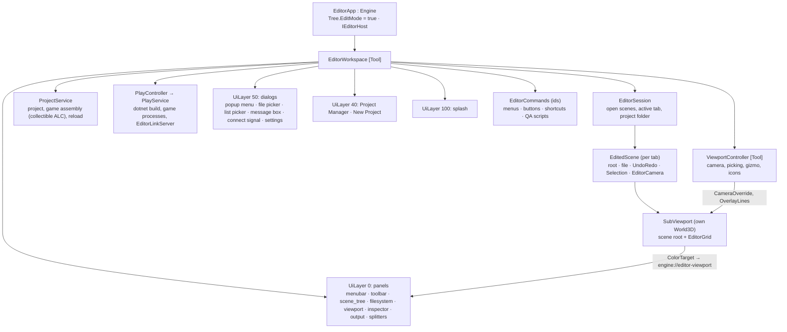

# Editor

## Purpose

The Mainframe Editor (`MainframeEngine.Editor`, milestone M10) edits `.mscene` files the way Godot does: a scene tree,
an inspector driven by the generated node metadata, a 3D viewport with picking and gizmos, undo/redo, all in a UI built
with the engine's own game UI stack (RmlUi). This page describes what ships: **E1 shell**, **E2 scene tree +
inspector + undo**, **E3 viewport**, **E4 projects** (Project Manager, New Project wizard, project settings, the
FileSystem panel, out-of-process Play, game code loading and reload) and **E5 polish** (signals, multi-select editing, 2D
editing, resource files and custom inspectors, editor settings). What is still open is in
[Future: editor](future/editor.md).


```sh
just editor                                  # the Project Manager (recent projects, New Project, Open)
just editor path/to/MyGame                   # open a project folder (or its project.mfproj)
just editor Examples/Demo/Content/Scenes/basic_3d.mscene   # open one scene (its project becomes current)
```

On macOS the app is called **Mainframe Engine** (Dock tooltip, bold app menu, Cmd+Tab) in development runs as well as in
the release `.app`: the build assembles `bin/<cfg>/net10.0/Mainframe Engine.app` and `dotnet run` starts the editor from
inside it ([release: macOS app name](release.md#macos-app-name)). Launching the bare `bin/…/MainframeEngine.Editor`
still works but shows the executable name.

Decisions: [0080 code-driven editor, edit mode, a SubViewport per tab](../../memory/decisions/0080-editor-code-driven-edit-mode.md) ·
[0081 one document per panel, data binding, generated inspector](../../memory/decisions/0081-editor-ui-documents-and-binding.md) ·
[0082 undo/redo](../../memory/decisions/0082-editor-undo-redo.md) ·
[0083 files before projects, crash safety, close interception](../../memory/decisions/0083-editor-files-projects-and-safety.md) ·
[0084 brand and window icons](../../memory/decisions/0084-brand-and-window-icons.md) ·
[0085 Tabler icon atlas](../../memory/decisions/0085-editor-icon-atlas.md) ·
[0086 `[EditorIcon]` and families](../../memory/decisions/0086-editor-icon-attribute-and-families.md) ·
[0087 tooltip widget](../../memory/decisions/0087-editor-tooltips.md) ·
[0088 tree create dialog](../../memory/decisions/0088-editor-create-dialog.md) ·
[0089 icons over text](../../memory/decisions/0089-editor-icons-over-text.md) ·
[0096 macOS app name](../../memory/decisions/0096-macos-app-name.md) ·
[0097 projects and code reload](../../memory/decisions/0097-editor-projects-and-code-reload.md) ·
[0098 Play pipeline](../../memory/decisions/0098-editor-play-pipeline.md) ·
[0099 FileSystem panel and reference fix-ups](../../memory/decisions/0099-filesystem-panel-and-reference-fixups.md) ·
[0101 E5 polish](../../memory/decisions/0101-editor-polish-e5.md).

## Structure



| Type | File | Role |
|---|---|---|
| `EditorApp` | [EditorApp.cs](../../MainframeEngine.Editor/Src/EditorApp.cs) | `Engine` host: edit mode, window title/size, modifier keys, SDL close-request filter, automation hooks |
| `EditorWorkspace` | [EditorWorkspace.cs](../../MainframeEngine.Editor/Src/EditorWorkspace.cs) | Composition root node: builds the panels, dialogs, splash and viewport controller; layout sync; shortcuts; quit prompt; recovery copies |
| `EditorCommands` | [EditorCommands.cs](../../MainframeEngine.Editor/Src/EditorCommands.cs) | Every action by id (`file.save`, `edit.undo`, `gizmo.rotate`, …); failures are reported, never thrown |
| `EditorSession`, `EditedScene` | [Session/](../../MainframeEngine.Editor/Src/Session/) | Tabs, open/save/close, project folder; the per-scene edit operations |
| `UndoRedo`, actions | [Undo/](../../MainframeEngine.Editor/Src/Undo/) | History, merging, dirty tracking; set property, add, remove, reparent, rename, move, composite |
| `InspectorModel`, `InspectorProperty` | [Inspector/](../../MainframeEngine.Editor/Src/Inspector/) | Rows from `NodeTypeInfo`; editor kinds, parsing/formatting; `[CustomInspector]` |
| `SceneTreeModel` | [SceneTree/](../../MainframeEngine.Editor/Src/SceneTree/) | Flattened rows with expand state |
| `EditorCamera`, `TransformGizmo`, `ViewportController` | [Viewport/](../../MainframeEngine.Editor/Src/Viewport/) | Camera math, gizmo math, the viewport's per-frame work |
| `EditorLayout`, `FilePickerModel`, `OutputLog`, `AtomicFile` | [Layout/](../../MainframeEngine.Editor/Src/Layout/), [Files/](../../MainframeEngine.Editor/Src/Files/), [Output/](../../MainframeEngine.Editor/Src/Output/) | Pure models (unit-tested) |
| `ProjectService`, `ProjectCreator`, `RecentProjects`, `ProjectSettingsModel`, `DotnetSdk` | [Projects/](../../MainframeEngine.Editor/Src/Projects/) | The open project, game assembly load/reload, New Project (`dotnet new mfgame`), recent list, the settings dialog's model |
| `PlayService`, `PlayController`, `GameBuilder`, `GameLauncher` | [Play/](../../MainframeEngine.Editor/Src/Play/) | Build, launch, track and control game instances |
| `ProjectFileSystem`, `FileOperations`, `ReferenceFixer`, `Trash`, `ThumbnailCache` | [FileSystem/](../../MainframeEngine.Editor/Src/FileSystem/) | The FileSystem panel's model and file operations |
| `EditorSettings`, `CodeEditorLauncher`, `EditorTheme` | [Settings/](../../MainframeEngine.Editor/Src/Settings/) | Editor preferences, the external code editor, the accent overlay |
| `ProcessRunner` | [Tools/](../../MainframeEngine.Editor/Src/Tools/) | Child processes (`dotnet`) with line callbacks, timeout and a clean MSBuild environment |
| Panels and dialogs | [UI/](../../MainframeEngine.Editor/Src/UI/) | One `EditorDocument` (a `UiDocument`) per RML file in [Content/Editor](../../MainframeEngine.Editor/Content/Editor/) |

## Edit mode and edited worlds

- The editor's scene tree runs with **`SceneTree.EditMode`**: only nodes whose type is marked `[Tool]` get
  `OnProcess`/`OnPhysicsProcess`/`OnInput`/`OnUnhandledInput`, and physics does not step (bodies stay where they were
  authored; collision shapes are still drawn). Enter/ready/exit callbacks run, so visuals, lights and cameras register
  with their worlds as usual. The editor's own `EditorWorkspace` and `ViewportController` are `[Tool]` nodes.
- **One world per tab**: each open scene lives under its own `SubViewport` (its own `World3D`: lights, sky, physics
  space). Only the active tab renders. Its tonemapped colour target (`SubViewport.ColorTarget`) is published to the UI as
  `engine://editor-viewport` and shown by an `` in the viewport panel; the view's pixel size follows the panel.
- **The editor camera** is `SceneViewport.CameraOverride` — the scene's own `Camera3D`s and their `Current` flags are
  never touched.
- Audio is disabled in the editor process. The edited scene is **shadowed**: its view sets `SubViewport.Shadows`, and
  since the editor's main world draws nothing, the shared shadow maps (Shadows v2: cascades, atlas, PCF) go to the
  active tab's view.
- **The current project** (see [Projects](#projects)) sets `AssetDatabase.Current` and `ContentPaths.ProjectDirectory`,
  so scenes' textures, models, sky and Spine folders load from the project sources. Opening a lone scene without a
  project makes its project current: the nearest ancestor folder holding a `project.mfproj`, else the folder above the
  scene's `Content/`. Game node types come from the project's game assembly; a type that is not loaded is a
  `MissingNode`, kept intact and written back (the inspector says so).

## UI

| Panel | Document | What it does |
|---|---|---|
| Menu bar | `menubar.rml` | The C3 logo mark (About), File (New/Open Scene, New/Open Project, Project Manager, Save, Save As, Close, Quit), Edit (Undo/Redo with the action names, Undo History, Add Node, Instance Scene, Rename, Duplicate, Delete), View (frame, axis views, reset, 2D/3D view, grid), Project (Project Settings, Build & Reload Code, Reload Code, Editor Settings, Close Project), Run (Play, Play Scene, Run Another Instance, Pause/Resume, Reload Scene in Game, Stop), Help (shortcuts, Check for Updates…, about) — every item with a leading icon and its shortcut; the scene's icon and name and an unsaved dot on the right |
| Toolbar | `toolbar.rml` | Icon tool buttons with tooltips: Select/Move/Rotate/Scale (Q/W/E/R), Global/Local (T, the icon switches world/cube), Snap (Y) + move step, Frame (F), Grid (G); the play group — Play (F5), Play Scene (F6), Pause (F7), Stop (F8), Build & Reload (Ctrl+Shift+B) — with a chip per running instance (status icon, label; click for its menu) and a build/reload status; fps / frame-time readout |
| Scene tree | `scene_tree.rml` | The hierarchy with a type icon tinted by family per row (name and type in its tooltip); badges for configuration warnings (`NodeWarnings`), instanced sub-scenes (their insides are not listed) and scripts (game types; tool scripts); an eye toggling `Visible` (undoable); expand/collapse, click / Cmd+click / Shift+click, drag onto a row's middle to reparent or onto its top/bottom edge to reorder (global transform kept), double-click/F2 rename, right-click menu with icons (add child, instance scene, rename, duplicate, move up/down, delete); Add/Instance as header icon buttons |
| Viewport | `viewport.rml` | Scene tabs (the root node's icon, title with `*` when dirty, file path tooltip, close ×, +), the 3D view, the view's mode with an icon in the corner, an empty-state hint |
| Inspector | `inspector.rml` | Header with the type's icon and family-coloured name (doc summary and base chain in its tooltip), editable name, Properties / Signals tabs, custom-inspector header, collapsible sections per declaring type (its icon) / `[ExportGroup]`, one row per `[Export]` with an icon before its name and a tooltip (below); also edits resource files ([Resource files](#resource-files-and-custom-inspectors)) |
| Output | `output.rml` | Engine `Log` messages (`OutputLog` is an `ILogSink`): level icon, time, category icon (subsystem; name in the tooltip), text, ×N for folded repeats, a link to the logging source line (opens `MAINFRAME_CODE_EDITOR`, VS Code or the system app). Header: per-level toggles with counts, filter field, Collapse Duplicates, Follow, Copy, Clear (filters and toggles persisted) |
| File system | `filesystem.rml` | The project's files as a tree, list or thumbnail grid ([FileSystem panel](#filesystem-panel)) |
| Splitters | `splitters.rml` | Four drag handles (left dock, right dock, output, scene tree / file system) |
| Project Manager, New Project | `project_manager.rml`, `new_project.rml` | Layer 40 above the panels ([Projects](#projects)) |
| Settings dialogs | `project_settings.rml`, `editor_settings.rml`, `connect_signal.rml` | Project Settings, Editor Settings, Connect Signal |
| Dialogs | `tree_picker.rml`, `file_picker.rml`, `list_picker.rml`, `message.rml`, `popup_menu.rml` | The create dialog (Add Node, New Resource, Instance Scene; below), modal file picker with file-type icons (open/save/folder, filters, Home/Project/Content places, overwrite confirmation), searchable list (node paths), message box / prompt with a title icon, popup menus |
| Tooltips | `tooltip.rml` | Its own layer above the dialogs ([Tooltips](#tooltips)) |
| Splash | `splash.rml` | Logo, "Mainframe Engine", "Editor vX.Y.Z", status line, progress bar on the brand navy; shown while the editor starts and while a scene loads, then fades. It never outlasts the loading, except a 1 s minimum on the very first launch |

- **Theme**: `theme.rcss` + `dialogs.rcss`, a dark palette (base `#15171c`, panels `#1f2128`, accent `#3b82f6`) over
  the shared widget library's controls; all sizes in dp (the panel layer uses `UiScaleMode.Dpi`).
- **Layout**: `EditorLayout` computes every panel rectangle from the window size and the persisted sizes (left/right
  dock widths, output height, scene tree share), clamped to minimums; each document body is positioned in dp. Sizes,
  the window size and the output filter persist in **`~/.mainframe/editor_layout.json`** (user profile on every OS,
  written atomically; unreadable, newer or nonsensical files fall back to defaults).
- **Lists are data-bound** (no work on idle frames); the inspector is generated RML updated in place (see below).
- The F12 developer overlay ([Developer overlay](dev-overlay.md)) is off by default in the editor; F9 opens the RmlUi debugger (F8 is Stop, as in Godot).

### Keyboard shortcuts

Cmd (macOS) or Ctrl: N new · O open · S save · Shift+S save as · W close tab · Q quit · Z undo · Shift+Z / Y redo ·
D duplicate · A add node · Shift+A instance scene · Up/Down move in tree · Shift+B build & reload. Plain keys:
Delete/Backspace delete, F2 rename, F frame, G grid, Q/W/E/R tool, T local/global, Y snap, 1/3/7 front/right/top, F5
play (Shift+F5 another instance), F6 play the open scene, F7 pause/resume, F8 stop, F9 RmlUi debugger. Shortcuts are
unhandled input: a focused text field keeps its keys, and closed dialogs release focus.

## Icons

**Icons over text** (Godot-style): every editor surface uses the shared icon atlas. A control shows an icon instead of a
label wherever the icon is unambiguous, and every icon-only control has a tooltip naming it, its shortcut and what it
does. Text stays where an icon cannot carry the meaning: menu item labels (which still get a leading icon), dialog
primary actions, inputs and values.

**Markup contract** (shared by every lane and panel):

```html
<span class="icon icon-player-play"/>                <!-- a Tabler icon by name, 16 dp, tinted #c9cedb -->
<span class="icon icon-sm icon-cube icon-3d"/>       <!-- icon-sm 14 dp / icon-lg 24 dp; family tint -->
<button class="tool-button" data-command="gizmo.translate"
        data-tooltip="Move (W) — translate selected nodes"><span class="icon icon-arrows-move"/></button>
```

| Family class | Colour | Used for |
|---|---|---|
| `icon-3d` | `#fc7f7f` red | Node3D and its subclasses, scenes, models |
| `icon-2d` | `#8da5f3` blue | Node2D and its subclasses |
| `icon-ui` | `#8eef97` green | UiLayer, UiDocument, RML/RCSS files |
| `icon-audio` | `#5eead4` teal | audio players and the listener, audio files |
| `icon-physics` | `#fbbf24` amber | collision objects (bodies, areas) and shapes |
| `icon-net` | `#c4a5ff` purple | NetworkNode |
| `icon-logic` | `#a3abbd` grey | Node, Timer, SubViewport, other plain nodes |
| `icon-resource` | `#e2e6ee` neutral | every Resource type |

Also: `icon-dir` (folders, `#e8c15a`), `icon-missing` (types not loaded, red), `icon-muted`, `icon-accent`, and the
level tints `icon-info`/`icon-warn`/`icon-error`/`icon-debug`. The colours are Godot's family hues lightened to read on
the `#1f2128` panels; selected rows keep the tint.

- **Atlas** ([0085](../../memory/decisions/0085-editor-icon-atlas.md)): [Tabler icons](https://tabler.io/icons) (MIT,
  outline; `name-filled` for filled ones). [`Content/icons/icons.txt`](../../MainframeEngine.Editor/Content/icons/icons.txt)
  lists the icons the editor uses; only their SVGs are vendored (`MainframeEngine.Editor/Icons/tabler`).
  `just editor-icons` ([make_atlas.py](../../build/editor-icons/make_atlas.py), needs Inkscape) renders one sheet SVG
  at 1x (16 px), 1.5x (24 px, `icon-lg`), 2x (32 px) and 3x (48 px) — white glyphs on a 20-unit pitch so linear filtering
  never bleeds — and writes `icons.rcss`: the sprite sheets (the 2x ones inside `@media (min-resolution: 1.5x)`, so
  Retina picks them) and one `.icon-NAME { decorator: image(i-NAME) }` class per icon. Outputs are committed; builds
  never need Inkscape. New name: add it to `icons.txt`, run `just editor-icons-fetch` (vendors the SVG from the npm
  package) and commit. Every RML document links `/Content/icons/icons.rcss` before `theme.rcss`; tinting is RCSS
  `image-color`.
- **Types** ([0086](../../memory/decisions/0086-editor-icon-attribute-and-families.md)): `[EditorIcon("name", Family =
  …)]` on a node or resource type (engine or game), recorded by the generator in `NodeTypeInfo.Icon/IconFamily`.
  **`EditorIcons`** resolves the nearest base type that declares one (and the nearest family), caches the result weakly
  per type (game types unload) and resets on `TypeRegistry.Changed`: `For(Type|Node)`, `Family(Type)` (`icon-3d` …),
  `FamilyOf`, `Classes(Type|Node)` (`"icon icon-cube icon-3d"`, the same string instance every call), `ForFile(path)` and
  `FileFamily(path)` (scenes `movie`, resources `package`, images `photo`, audio, models, fonts, RML/RCSS, translations,
  shaders, C#, project and JSON files; folders `folder` + `icon-dir`). Every engine type has its own icon (Camera3D
  `video`, lights `sun`/`bulb`/`lamp`, WorldEnvironment `world`, MeshInstance3D `cube`, Sprite3D `photo`, SpineNode
  `bone`, audio players `volume`, AudioListener3D `ear`, bodies `box`/`ball-bowling`/`run`/`border-corners`, shapes
  `shape`, UI `stack-2`/`layout`, NetworkNode `network`, Timer `clock`, SubViewport `device-desktop`, Node `circle-dot`,
  Node3D/Node2D `axis-x`/`axis-y`; resources: meshes, `palette` materials, `photo` textures, `music` streams, shapes,
  `movie` scenes, `adjustments` bus layouts …).
- **Properties**: `PropertyIcons` picks the icon before a property's name — the member's own (`[Export(Icon = "…")]` or
  `[EditorIcon]`), a resource slot's resource type (tinted), a `NodePath`'s target node (or its `NodeType` hint), then a
  semantic icon by name (Position `arrows-move`, Rotation `rotate`, Scale `arrows-maximize`, Visible `eye`, `…Color`
  `palette`, Volume `volume`, Mass `weight`, `…Speed`/`…Velocity` `gauge`, Text `letter-t`, layers, process, shadows …),
  else the value kind (number `hash`, bool `toggle-left`, text `letter-t`, vector `axis-x`, enum `list`, flags
  `list-check`, array `brackets`, quaternion `rotate`, transform `transform`).
- **Gotcha**: RmlUi drops bare text that is a direct child of a flex container — wrap labels next to icons in a
  `<span>` (`<button class="with-icon"><span class="icon …"/><span>Home</span></button>`).

### Tooltips

`TooltipOverlay` ([0087](../../memory/decisions/0087-editor-tooltips.md)) is a document on its own UI layer (90: above
the dialogs, below the splash) whose body never takes the mouse. Any element of an editor document — or its nearest
ancestor — with `data-tooltip` shows a tooltip after **0.5 s** of hovering, or the same delay after it gets keyboard
focus (`:focus-visible`). Text format: `Title (Shortcut) — description`, further lines after `\n`: a bold title, the
shortcut as a key cap (Ctrl reads Cmd on macOS), the description muted. The box sits under the element and is kept
inside the window (above the element when there is no room below; measured one frame after layout). A click, key or
wheel hides it until the pointer moves to another element. Per frame it reads the hovered and focused element of the
dialog and panel layers and compares handles: idle frames allocate nothing.

### Create dialog

`TreePickerDialog` ([0088](../../memory/decisions/0088-editor-create-dialog.md)) serves **Add Node**, the inspector's
**New** resource button and **Instance Scene** (`PickerSources`: registered node types, the resource types a slot
accepts, the project's `.mscene` files as a folder tree with Browse… for others). The entries form a tree
(`PickerTree`: inheritance, abstract types as italic structure-only rows; game types under their engine base with their
inherited icons), sorted by name. The search is fuzzy (exact > prefix > word start > substring > subsequence, shorter
names first; "mi3" finds MeshInstance3D), keeps every match's ancestors visible and selects the best creatable match.
**Favourites** (star a row) and **Recent** (the last 8 created) are persisted per dialog in the editor settings
(`PickerFavorites`/`PickerRecent` in `editor_layout.json`). The description pane shows the selection's icon and name,
its ancestor chain with icons and its doc summary. Double click or Enter creates; Up/Down move; Escape cancels.

## Inspector

`InspectorModel.Build(target)` walks the generated `NodeTypeInfo.Properties` (base types first) of a node or resource.
Rows are grouped into sections by `[ExportGroup]`, else by declaring type ("Node", "Node3D", "Light3D"…). The widget
comes from the value type and the `[Export]` hints:

| Kind | From | Widget |
|---|---|---|
| Bool | `bool` | checkbox |
| Integer / float | integer and floating types | text field (invariant culture) |
| Range | `Range = "min,max[,step]"` | slider + field; values clamp |
| Text, multiline | `string`, `Multiline` | field, text area |
| File / directory path | `File = "*.png,…"`, `Directory` | field + browse (stored project-relative) |
| Enum, flags | enums; `[Flags]` or `Flags = true` | dropdown; a checkbox per single-bit flag |
| Vector2/3/4 | `Vector2/3/4` | one field per axis (coloured X/Y/Z/W) |
| Quaternion | `Quaternion` | Euler degrees (X→Y→Z, like `RotationDegrees`) |
| Color | `System.Drawing.Color`, or a `Vector3`/`Vector4` named `…Color` (lights) | swatch + hex field; the swatch opens RGBA sliders |
| NodePath | `NodePath` (`NodeType` hint filters) | field + pick from the scene's nodes (stored relative to the node) |
| Resource | `Resource` subclasses | label with the resource's icon + Edit (fold), Load (file), New (the create dialog: types assignable to the slot), Clear icon buttons; inline resources expand into nested rows (up to 3 levels) |
| Array | `T[]`, `List<T>` | count, + Add, per-element fields (scalars) and remove |
| Transform, unsupported | `Transform3D/2D`, others | read-only text |

- **Every row has an icon** before its name (`PropertyIcons`, [Icons](#icons)) and a **tooltip**: "Label — doc
  summary" (the member's `<summary>`, recorded by the generator), then the hints (range and step, file filter, folder,
  target node type, translated) and the member with its type (`RotationDegrees: Vector3`). Row actions (pick node,
  browse, resource edit/load/new/clear, array add/remove, colour picker) are icon buttons with tooltips.
- **The name column** fits the longest label (up to a cap) unless the splitter between names and values was dragged;
  the dragged width persists (`InspectorLabelWidth` in `editor_layout.json`), double-clicking the splitter returns to
  automatic. Long names end in an ellipsis; the tooltip has the full name.
- **Several selected nodes** edit together ([Multi-select editing](#multi-select-editing)); the **Signals** tab is
  described under [Signals](#signals).

- Edits go through the scene's undo history: text fields commit on Enter or focus loss (a field being edited commits
  to its own node before the inspector switches to another), checkboxes/dropdowns/buttons at once, slider drags as
  **one** merged entry. Invalid text is rejected and the field restored.
- After any change (undo, redo, gizmo drag — live while dragging) only values that changed are written into the
  existing elements; the RML is regenerated when the selection or a shape (array length, resource) changes.
- **`[CustomInspector(typeof(T))]`** classes implementing `ICustomInspector` (public parameterless constructor) can add
  header RML (elements with `data-action` call back), hide generated rows and act through the scene's history. The
  editor's own `MissingNodeInspector` explains missing types, `AudioBusLayoutInspector` edits bus layouts. They are
  found in loaded assemblies that reference the editor, game assemblies included
  ([Resource files and custom inspectors](#resource-files-and-custom-inspectors)).

## Undo / redo

Each tab has an `UndoRedo` of `IEditorAction`s (`Do`, `Undo`, `TryMerge`): `SetPropertyAction`, `AddNodeAction` (new
nodes, duplicates, instanced scenes), `RemoveNodeAction`, `ReparentAction`, `RenameAction`, `MoveInTreeAction`,
`CompositeAction` (multi-node edits), `ConnectSignalAction`/`DisconnectSignalAction`.

- Committing after undo cuts the redo branch; beyond 256 entries the oldest are dropped. Actions holding detached nodes
  free them when they leave the history (`IDiscardableAction`).
- Continuous edits merge by key until released (`EndMerge` on mouse up / commit / undo / save). Gizmo drags apply live
  and commit once on release.
- Delete keeps the subtree detached (owners, signal connections and index restored on undo); reparent restores the exact
  local transform on undo; duplicate packs the scene and re-instantiates the copies (unique names Box → Box2, nested
  instances stay instances, connections inside the copy belong to the edited scene).
- **Dirty state**: the history position against the saved one. Tab and window titles show `*`; closing a dirty tab, or
  the window (close button, Cmd+Q, the Dock's Quit — intercepted with an SDL event filter), asks Save / Don't Save / Cancel.
  Closing the window always works (`EditorWorkspace.OnCloseRequested`): open dialogs — the Project Manager, pickers,
  wizards, settings — are closed first (Project Settings asks about its unsaved edits); only an open message box must
  be answered first, and a load in progress finishes before the request is handled.
- Edit › Undo History lists every entry; choosing one undoes or redoes up to it.

## Viewport

| Input (over the view) | Action |
|---|---|
| Left click | select (Cmd/Shift: toggle): icons of lights/cameras/audio first, else the GPU object-ID pick (two frames later). A picked node inside an instanced sub-scene selects the instance |
| Left drag on a gizmo handle | move / rotate / scale along that axis (centre: view plane / uniform), snapped when Snap is on (move step, 15°, 0.1) |
| Alt + left drag, middle drag | orbit around the pivot |
| Shift + middle drag | pan |
| Wheel | zoom (while flying: fly speed) |
| Hold right button | fly: mouse look + W/A/S/D/Q/E (Shift faster); the view says "fly" |
| F / 1 / 3 / 7 | frame the selection / front / right / top |

- **Gizmos** (`TransformGizmo`): constant on-screen size (points × pixel scale), hit-tested by screen distance to the
  projected axes or rings, dragged by intersecting the mouse ray with the axis line (or the view plane), rotation from the
  accumulated screen angle around the pivot; local or global axes (scale is always local). Drawn into the view's
  `OverlayLines` (no depth test) with highlighted hover/active handles.
- **Editor-only visuals** (never saved): `Grid3D`, orange selection boxes (mesh bounds) or crosses, sun/omni/spot icons
  with direction, cone and (selected) range, camera frusta, audio markers and range spheres, collision shapes
  (physics debug draw).

### 2D view

Scenes whose root is a `Node2D` open in an **orthographic view of the z = 0 plane** in pixels (y down, as in Godot; seen from −Z); View › 2D View /
3D View switches any tab ([0101](../../memory/decisions/0101-editor-polish-e5.md)). Middle or right drag (or Alt+left)
pans, the wheel zooms around the mouse, F frames the selection. A pixel grid (power-of-two steps at least 16 screen
pixels apart, every 8th brighter, coloured axes), Node2D markers, collision shape outlines and Camera2D frames are
drawn. Picking is on the CPU (rectangle and circle shapes, then node origins; later nodes are on top).
`TransformGizmo2D` (axis arrows and a free-move square, a rotation ring, scale handles) shares the tool, space and snap
settings with the 3D gizmo; moves snap to whole pixels, or to the move step when Snap is on. There is no sprite
rendering yet, so 2D scenes show shapes, markers and camera frames.

## Projects

([0097](../../memory/decisions/0097-editor-projects-and-code-reload.md)) The editor works on a game project: a folder
with `project.mfproj` and the `mfgame` template's C# projects ([Project & game host](project-and-gamehost.md)).

- **Start-up**: a project argument (folder or `project.mfproj`, or `--project <dir>`) opens it; a scene argument opens
  that scene and makes its project current; neither (or `--project-manager`) shows the **Project Manager**.
- **Project Manager** (`project_manager.rml`, UI layer 40): the recent projects (`~/.mainframe/recent_projects.json`,
  newest first; a missing folder is flagged and can be removed from the list), New Project, Open Project (also File › Open Project: a file picker that lists and accepts only `.mfproj` files, never a folder, and opens the project of a `project.mfproj`), Download Demo, and the
  **.NET SDK check** (`DotnetSdk`: a .NET 10 or newer SDK is required; without one, a link to the download page).
  File › Project Manager returns to it. Each row shows the project's **icon**, `window.icon` of its `project.mfproj`
  (Godot's `application/config/icon`): `ProjectIconResolver` resolves it to an absolute PNG inside the project folder
  (anything else, a missing file or a malformed project means no icon, and the row keeps the folder glyph), caching by
  the modification times of `project.mfproj` and the icon, and reports a change once so the rows rebuild and
  `RmlCore.ReleaseTextures()` re-reads the image. New projects ship `Content/icon.png` (the template default, the brand
  logo) with `window.icon` set, and the Demo has its own. Project Settings › Window › Icon previews the PNG (32 dp)
  beside its field.
- **New Project** (`new_project.rml`): name, parent folder, the engine checkout (found above the editor, or chosen) and
  a live validation (`NewProjectValidation`: a valid C# identifier, an empty or missing target folder, the SDK).
  Create runs `dotnet new mfgame --engine-path …` from a private template hive (`~/.mainframe/templates`; the user's
  global templates are untouched), builds the game, then opens it.
- **Download Demo** (`download_demo.rml`, `DownloadDemoDialog`; the Demo… button of the Project Manager): fetches the
  [Demo](demo.md) for this editor version and opens it. The location (default `~/MainframeProjects`, created when
  missing) and the engine checkout (found above the editor, or `MAINFRAME_ENGINE_PATH`; without one Download stays
  disabled with the same explanation as New Project) are validated as you type; the demo goes to
  `<location>/MainframeEngine.Demo`, which must not exist or be empty. `DemoDownloader` streams
  `MainframeEngine.Demo-vX.Y.Z.zip` from the GitHub release of `EngineInfo.Version` (a development or prerelease build
  uses `releases/latest/download/MainframeEngine.Demo.zip`; `DemoRelease` holds the one base URL) through the shared
  `EditorHttp` client into `~/.mainframe/downloads/`, with a progress bar and a size cap; `DemoArchive` extracts into a
  hidden staging folder beside the destination with zip-slip, symlink and 1 GiB guards and validates it (one top folder
  with `project.mfproj`, a desktop project, scenes); `EnginePathRewriter` points `MainframeEnginePath` of its
  `Directory.Build.props` at the engine checkout; then the folder is moved into place (same volume), the project opens
  like a New Project and joins the recent list. Cancel stops the download; a failure (no published demo, no network,
  disk) shows its message with Download still enabled to retry, and the zip and staging folder are always deleted, so
  the destination is never half written. Tests inject `EditorWorkspaceOptions.DemoHttpHandler` /
  `DemoDownloadsDirectory`.
- **`ProjectService`** opens a project: `EditorSession.OpenProject` (the asset database scans `Content/` and creates
  missing `.meta` sidecars), `GameProjectLayout` finds the game library, desktop project (or a legacy `*.Launcher`) and solution, and the game assembly
  loads into a collectible `AssemblyLoadContext` (`GameAssemblyLoader`), built first when it is missing or fails to
  load. Its node and resource types join the create dialog, the inspector and `[CustomInspector]` discovery.
- **Code reload**: a debounced watcher on the build output reloads after any build (the editor's Build & Reload, F5,
  or an IDE's); a watcher on the sources shows "rebuild needed". Only scenes that use game code (`GameCodeScanner`:
  game or missing node/resource types, nested resources included) are serialized (unsaved edits included), freed, the
  old assembly unloaded and **verified collected**, the new one loaded and the scenes re-instantiated in the same tabs
  with their file, dirty state, selection and camera. Their undo history is dropped; other scenes keep theirs. A type
  the new build no longer has loads as `MissingNode` with its data. If the old context survives, `ReferencePathFinder`
  logs the reference path that keeps it alive.
- **Project Settings** (Project › Project Settings, `ProjectSettingsModel`): every section of `project.mfproj` —
  Application (name, main scene, game assemblies, Steam app id), Window, Input Map (actions, deadzones, bindings
  captured from the next key or mouse press, gamepad inputs from a list), Physics 3D/2D, Audio, Localization,
  Rendering, Autoloads. Each edit is undoable (the dialog's own history, Ctrl+Z inside it); invalid values are refused
  with a message; Save writes the file atomically and applies it to the session.

## Play

([0098](../../memory/decisions/0098-editor-play-pipeline.md)) Games run **out of process**, connected over the editor
link ([Project & game host](project-and-gamehost.md)).

| Action | Key | What happens |
|---|---|---|
| Play | F5 | save the open scenes that have a file, `dotnet build` the solution, launch the game with `--editor-port` (its main scene) |
| Play Scene | F6 | the same with `--scene <uid>` of the open tab (an untitled scene asks for a file first) |
| Run Another Instance | Shift+F5 | one more instance (server + client tests); each gets a label |
| Pause / Resume | F7 | over the link |
| Stop | F8 | a stop command; the process is killed after 3 s (at once if it never connected) |
| Reload Scene in Game | Run menu, instance menu | the game re-reads its current scene from disk |
| Build & Reload | Ctrl/Cmd+Shift+B | build, then reload the editor's game code |

- **Build errors** (`GameBuilder`: `-v:minimal -p:GenerateFullPaths=true`) are parsed into Output lines of category
  `build`; clicking one opens the file at its line in the code editor. A failed build does not launch.
- **Game logs** stream into Output as category `game` (`game·Category` for the game's own categories), with the
  instance label when several run; their caller file and line open in the code editor. Process stdout/stderr is shown
  only until the game connects, or when it crashes before connecting.
- **Instances** (`PlayService`): each is a chip in the toolbar (status icon — launching, running, paused, exited,
  crashed — and label); clicking it opens its menu (pause/resume, reload scene, stop, clear). A hello is matched to its
  instance by process id. Exit code 0 or a requested stop is *exited*, anything else *crashed* (the exit code is
  logged).

## FileSystem panel

([0099](../../memory/decisions/0099-filesystem-panel-and-reference-fixups.md)) The project folder (C# and project
files included; build output, `.mainframe` and `.meta` sidecars hidden — header toggles) in three views: a **tree**,
the current folder as a **list**, or a **grid** of tiles with thumbnails (images decoded and downscaled in the
background into `<project>/.mainframe/cache/thumbnails`). Every entry has its file-kind icon (`EditorIcons.ForFile`;
scenes tinted by their root type's family, resources by type) and badges: unsaved (an open scene with changes),
missing dependency, import error (invalid JSON, undecodable image).

- **Double click** opens scenes in a tab, resource files in the inspector, C# files in the code editor; folders open.
- **Right-click menu**: Open, New Folder, New Scene, New Resource (the create dialog), Rename (F2), Move To, Move to
  Trash (Del), Copy Path, Copy UID, Reveal in Finder / Show in File Manager.
- **Rename and move** keep references working: the `.meta` moves with the file, and every scene, resource and
  `project.mfproj` that refers to a moved file is rewritten (`ReferenceFixer`: `path` hints of `ref`/`instance` objects
  by UID, and plain path strings; folders map every file inside). Open scenes follow the move.
- **Delete** moves to the OS trash (macOS `NSFileManager`, Windows recycle bin, the freedesktop trash on Linux); only
  when there is no trash does it ask before deleting permanently. Open scenes inside are closed first.
- **Drag** a file onto a folder (move), a scene tree row (a scene is instanced under it; a resource is assigned to a
  matching slot), the viewport (instanced under the root) or an inspector resource slot.
- A debounced watcher picks up outside changes; the panel applies them on the main thread.

## Signals

The inspector's **Signals** tab ([0101](../../memory/decisions/0101-editor-polish-e5.md)) lists the selected node's
`[Signal]`s, each with the connections the edited scene owns (connections inside instanced sub-scene files belong to
those files and are not listed). **Connect** opens `connect_signal.rml`: the scene's nodes, the target's methods that
match the signal (`Node.Connect`'s rule), Deferred and One Shot flags. Connect and disconnect are undoable actions
(`SignalActions`) and are saved with the scene.

## Multi-select editing

With several nodes selected, the inspector shows the properties **every** selected node has (the same exported member,
such as `Node3D.Position` on a light and a mesh). A value that differs shows "—"; editing one vector component keeps
each node's other components. An edit is one undo entry for all nodes (`EditedScene.SetProperties`), and slider drags
merge as usual. Arrays, nested resource sub-inspectors, custom inspectors and the Signals tab stay single-node.

## Resource files and custom inspectors

A `.mres` file opened from the FileSystem panel is edited in the inspector (`EditedResource`) with its own undo
history and Save. `ICustomInspector` gets an `IInspectorContext` (a scene or a resource; the `EditedScene` overload
still works), so a custom inspector can act on either. The shipped example is `AudioBusLayoutInspector`: a mixer strip
for `AudioBusLayout` buses, every change undoable. Game assemblies' `[CustomInspector]`s are found when they load.

## Editor settings

Project › Editor Settings (`editor_settings.rml`, saved to `~/.mainframe/editor_settings.json`):

- **Accent colour**, applied live: recoloured copies of `theme.rcss` and `dialogs.rcss` go to an overlay content folder
  checked before the editor's own, and the style sheets reload.
- **Autosave** every N minutes (0 = off) for scenes that have a file.
- **External code editor**: a command with `{file}`, `{line}`, `{column}` and `{project}` placeholders (with presets);
  empty means `MAINFRAME_CODE_EDITOR`, else VS Code when found, else the OS default. Used by Output links, build errors
  and C# files.
- **Reload code automatically** after builds.
- **Check for updates at startup** (default on) — see [Editor updates](editor-updates.md).

## Updates

Released builds check GitHub Releases at start-up (Editor Settings › Updates; Help › Check for Updates… always works). A
newer release shows a green badge in the toolbar and the Project Manager; it opens the update dialog (notes, View
release, **Update & restart**). Runs with `--hidden`, `--smoke`, `--qa-script` and tests have no update service; QA
captures the dialog with `update-preview X.Y.Z`. See [Editor updates](editor-updates.md).

## Files and safety

- Open/Save/Save As go through the RmlUi file picker; scenes are written by `SceneSaver` (temp file + rename) and keep
  their UID across saves. A failed save keeps the old file and the scene dirty and shows the error.
- Every command runs guarded: an exception becomes an Output error and a message box, never a crash.
- An unhandled exception writes recovery copies of unsaved scenes to `~/.mainframe/recovery/`.

## Brand

The window icon, macOS bundle icon, Windows `ApplicationIcon` and the splash use the "C3 Circuit" logo
([docs/images/brand](../images/brand/README.md)): `logo-macos-512.png` on macOS (Apple's icon grid; it is the Dock
icon), `logo-48.png` elsewhere. Window icon pixels are reordered for Silk's SDL surface masks (`WindowIcon`).

## Engine changes made for the editor

| Change | Where |
|---|---|
| `SceneTree.EditMode`, `Node.IsTool` | [Scene graph & nodes](scene-graph-and-nodes.md) |
| `SceneViewport.CameraOverride`, `SceneViewport.OverlayLines`, `SubViewport.ColorTarget` | [Scene graph & nodes](scene-graph-and-nodes.md), [Materials & meshes](materials-and-meshes.md#offscreen-views-subviewport) |
| `SubViewport.Shadows` (a view of another world may own the shadow maps when the main world has nothing to shadow) | `Scene/SubViewport.cs`, `Servers/RenderServer.cs` |
| `ContentPaths.ProjectDirectory` | `Core/ContentPaths.cs` |
| List bindings tolerate rows past the end of a list that just shrank | [Game UI](game-ui.md#data-binding) |
| `WindowIcon` byte order for window icons | `Core/WindowIcon.cs` |
| `[EditorIcon]`, `EditorIconFamily`, `Export(Icon)`; `NodeTypeInfo.Icon/IconFamily/Description`, `ExportHints.Icon/Description` | [Scene serialization](scene-serialization.md#source-generator) |
| `UiServer.ClipboardText` (the Output panel's Copy) | `UI/UiServer.cs` |
| `SceneTree.ReleaseCodeOf` also clears the process lists' snapshots (they held freed game nodes and kept an unloaded game assembly alive) | `Scene/SceneTree.cs` |
| Unregistering a UI texture releases RmlUi's texture cache entry, so a name registered again is reloaded (the viewport after switching tabs) | `UI/Rendering/VulkanUiRenderer.Tables.cs` |

## Testing and QA

- **Unit tests** ([Tests/MainframeEngine.Editor.Tests](../../Tests/MainframeEngine.Editor.Tests/), `just test`, CI on all
  three OSes): undo/redo (do/undo/redo/merge/limits/dirty), the inspector model for every type and hint, scene
  operations (delete/undo restores subtree + owners + connections, reparent keeps the global transform, duplicate with
  unique names, instances and connections, atomic save + reload), layout and its persistence, the file picker, camera
  and gizmo math, the output log, and the **whole UI headless** (RmlUi with the null renderer): panels load without
  RmlUi warnings, tree clicks and drags, inspector edits for every kind, Add Node, menus, shortcuts, rename, Save As,
  the quit prompt, recovery copies, and **0 B per idle frame with 1 000 nodes** (and with a tooltip shown).
- **Icon gates** ([IconTests](../../Tests/MainframeEngine.Editor.Tests/IconTests.cs)): the generated atlas matches
  `icons.txt` (every sheet, sizes, vendored SVGs); every icon the editor's RML, RCSS and C# reference (class lists,
  sprite references, `[EditorIcon]`, `Export(Icon)`, `Icon:` arguments, the resolvers) exists — a missing name fails the
  build; every engine node/resource type resolves to its own icon and a family; a headless **lint** walks every panel,
  dialog and menu: each icon element names one atlas icon and **every icon-only control has a `data-tooltip`**.
  Tooltip timing, placement, keyboard focus and dismissal, the create dialog's tree and search, Output features, scene
  tree badges and inspector icons have their own tests ([IconPanelTests](../../Tests/MainframeEngine.Editor.Tests/IconPanelTests.cs)).
- **Render tests** ([EditorRenderTests](../../Tests/MainframeEngine.RenderTests/EditorRenderTests.cs)): the editor's
  `--smoke` run in a hidden window — open the showcase fixture (`Tests/Content/Scenes/Showcase.mscene`), select the Column by GPU picking at its projected pixel, change
  its position through the inspector model, undo/redo, save to a temp file, reload and re-save byte-identically — plus
  the editor window golden, frame times on the scene, the allocation gate (0 B over 300 idle frames with 1 000 nodes,
  validation on), the splash golden, and the **Project Manager** and **FileSystem panel** goldens
  (`--smoke-golden project-manager|filesystem`, a fixed sample project).
- **Projects, Play and FileSystem tests**: the New Project validation, recent projects, SDK detection, the
  `ProjectSettingsModel` (every setting, input map, autoloads, undo, save), build-diagnostic parsing, `PlayService`
  with fake builder/launcher and a real `EditorLinkServer`, the file tree, file operations and reference fix-ups,
  thumbnails and the trash (the real OS trash only with `MAINFRAME_TEST_SYSTEM_TRASH=1`). **Code reload** is tested
  with game assemblies compiled by Roslyn in the test (`CodeReloadTests`: a type added, changed and removed; state kept;
  the old context collected). `ProjectWorkflowTests` drive the headless editor through the panels (create, open,
  rename with fix-ups, drag onto the scene tree, Play with a fake launcher). A slow integration test
  (`Category=Slow`) runs the real `dotnet new mfgame` and build.
- **Scripted QA** (`just qa-editor`, [Tests/QA/editor-walkthrough.qa](../../Tests/QA/editor-walkthrough.qa)): the real
  editor driven through the UI input path (`--qa-script`: clicks by point or `#element-id`, drags, gizmo drags, keys,
  text, commands, dialog answers, `window-close`) with captures in `artifacts/qa-editor`. **`just qa-projects`**
  ([project-workflow.qa](../../Tests/QA/project-workflow.qa)) creates a game from the Project Manager, adds nodes and
  saves, plays it (game frame and logs), pauses and stops, edits its C# and builds & reloads, with `timing` lines for
  each step (`wait-for project|playing|stopped|idle`, `new-project`, `add-node`, `replace-in-file`, `play-args`). The
  walkthrough also captures the update dialog (`update-preview X.Y.Z`, no network) and the Editor Settings dialog.
- **README screenshots** (`just readme-screenshots`, [readme-screenshots.qa](../../Tests/QA/readme-screenshots.qa)):
  the Project Manager (`recent-project` seeds the list), the showcase scene (`open-project`, `camera`, `collapse`), the
  create dialog (`favorite`, `search`, `pick`) and a new game after a code reload while it plays, captured at 2x
  (`--scale 2`, 3200×1920 px) and downscaled to 1600×960 into `docs/images/editor*.png` with ImageMagick. The scene is
  [Examples/Demo](../../Examples/Demo) — a `GameHost` game project (engine by project reference, `../..`) whose
  game code the editor loads, so every node type resolves. Projects are opened from the
  neutral `/tmp/MainframeProjects` (the recipe links the Demo there), so no user path is on screen; editor log
  lines show project files relative to the project (`Saved Content/Scenes/basic_3d.mscene`).

## Performance

Apple M5, MoltenVK, hidden 1280×720-point window at content scale 2 (2560×1440 px), the showcase fixture scene open (sky, five
lights with Shadows v2 cascades and atlas, Spine, physics crates, a glTF model), Debug build with validation: **8.3 ms
average, 9.0 ms p95** per frame (the 120 Hz display rate). Idle frames allocate nothing.

## Known issues

- A code reload drops the undo history of the scenes it re-creates (selection, view and dirty state are kept).
- The gizmo moves the last selected node only; there is no box selection. 2D scenes have no sprites to show yet.
- Signal connections are real delegates in the editor: a `[Tool]` node emitting in edit mode calls its targets.
- The accent colour recolours the shared style sheets; a few inline document styles keep the default blue.
- A scene file rewritten by a reference fix-up loses hand-written formatting (other files are untouched).
- Lines are one framebuffer pixel wide; gizmo handles are drawn as several parallel lines.
- The Output panel has four levels (the engine's `Log` has no trace level). Icons are fixed-colour glyphs tinted per
  family; there are no per-icon multi-colour glyphs like Godot's.

## Related docs

[Future: editor](future/editor.md) · [Project & game host](project-and-gamehost.md) · [Game UI](game-ui.md) ·
[Scene graph & nodes](scene-graph-and-nodes.md) ·
[Scene serialization](scene-serialization.md) · [Materials & meshes](materials-and-meshes.md) · [Release](release.md) ·
[Editor updates](editor-updates.md) · [Testing](testing.md)
