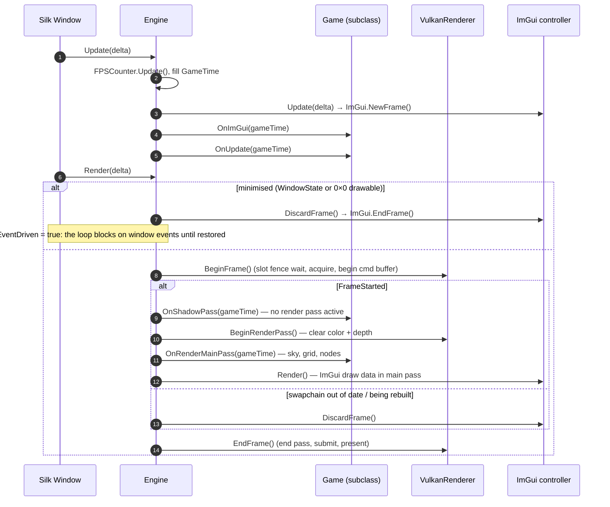

# Engine Lifecycle

## Purpose

`Engine` owns the window, input, renderer and ImGui, and drives the game loop through Silk.NET's
window events. Games subclass it and override four abstract hooks.

## Key types

| Type | File | Notes |
|---|---|---|
| `Engine` | [Engine.cs](../../MainframeEngine/Src/Core/Engine.cs) | `public abstract class Engine : IDisposable` |
| `EngineOptions` | [Engine.cs](../../MainframeEngine/Src/Core/Engine.cs) | `struct` with `required GameName`, `RenderingBackend = Vulkan`, `WindowSize = 800×600`, `IconPath`, `VSync = true`, `EnableValidation = DefaultEnableValidation` (**true in Debug, false in Release**), `EnableFrameCapture`, `WindowVisible = true`, `MaxFrames` (0 = until closed), `FixedDeltaTime` (0 = wall clock) |
| `FrameCapture` | [FrameCapture.cs](../../MainframeEngine/Src/Rendering/FrameCapture.cs) | RGBA8 pixels of a rendered frame, `SavePng(path)` |
| `GameTime` | [GameTime.cs](../../MainframeEngine/Src/Core/GameTime.cs) | `FrameCount`, `DeltaTime`, `FramesPerSecond`, `FramesTimeMs` |
| `FPSCounter` | [FPSCounter.cs](../../MainframeEngine/Src/Core/FPSCounter.cs) | 500 ms sampling window |
| `ExitCode` | [ExitCode.cs](../../MainframeEngine/Src/Core/ExitCode.cs) | `Ok = 0`, `Error = 1` |
| `RenderingBackend` | [RenderingBackend.cs](../../MainframeEngine/Src/Core/RenderingBackend.cs) | `Vulkan` only |

## Writing a game

```csharp
public sealed class Game() : Engine(new EngineOptions { GameName = "My Game" })
{
    protected override void OnLoad() { base.OnLoad(); /* create ShadowSystem, Node.Initialize, nodes */ }
    protected override void OnImGui(in GameTime t) { }
    protected override void OnUpdate(in GameTime t) { }
    protected override void OnShadowPass(in GameTime t) { }
    protected override void OnRenderMainPass(in GameTime t) { }
    protected override void OnClose() { /* dispose game objects */ base.OnClose(); }
}
```

- Call `base.OnLoad()` **first** (it creates input, renderer and ImGui).
- Call `base.OnClose()` **last** (it disposes ImGui, input and the renderer).
- `Run()` blocks until the window closes and returns an `ExitCode`. `Quit(code)` records the code and
  requests shutdown; the window closes at the end of that iteration's render (SDL raises `Closing`
  synchronously inside `Close()`, and `OnClose` disposes the renderer, so closing mid-update would
  dispose it under a running frame). `Run()` then returns the code — covered by the
  `QuitWithErrorReturnsErrorExitCode` render test. `MaxFrames` closes the same way.
- `Engine.FramebufferSize` is the drawable size in **pixels**; `Window.Size` is in points. For a
  camera's aspect ratio inside `OnRenderMainPass`, use `IVulkanContext.SwapchainExtent` — the image
  actually being rendered (it can lag the window by a frame during a resize).

## Startup

1. **Constructor:** stores options → selects SDL (`SdlWindowing`/`SdlInput.RegisterPlatform()`,
   `Window.PrioritizeSdl()`) → `VulkanLoaderBootstrap.Initialize()` (macOS probe +
   `SDL_Vulkan_LoadLibrary` handoff, see [Build & platforms](build-and-platforms.md#windowing-sdl2))
   → creates the window from
   `WindowOptions.DefaultVulkan` (title `"{GameName} ({RenderingBackend})"`, API 1.2) → subscribes
   `Load`, `FramebufferResize`, `Update`, `Render`, `Closing`.
2. **`Load`:** centres the window on its monitor (skipped when none is reported, e.g. a sleeping
   macOS display), then **`OnLoad()`** (base): `Window.CreateInput()` (SDL input) →
   `new VulkanRenderer(Window, { EnableValidation, VSync, EnableFrameCapture })` →
   `new VulkanImGuiController(...)` → `SetWindowIcon(IconPath)` (StbImageSharp, RGBA).

### Deterministic runs and frame capture

Tests and QA tools set `FixedDeltaTime` (every update gets that delta instead of wall-clock time) and
`MaxFrames` (the window closes after that many rendered frames; `RenderedFrameCount` excludes skipped
frames). `CaptureFrame()` — legal from `OnImGui`, `OnUpdate` or a render hook, and only with
`EnableFrameCapture` — copies the frame being built back to the CPU; after `EndFrame` the engine calls
`protected virtual OnFrameCaptured(FrameCapture)`. See [Testing](testing.md).

## The frame

Update and Render are separate Silk.NET window events. ImGui is built **before** game update, and
the shadow pass runs with the command buffer open but no render pass active.



### Minimise

While the window is minimised (`WindowState.Minimized`, or `Engine.FramebufferSize` is 0×0) `OnRender`
renders nothing, closes the ImGui frame, and switches the window to `IsEventDriven` so Silk's loop
blocks in `SDL_WaitEvent` instead of spinning; the first render after restore switches it back. The
renderer likewise refuses to rebuild a 0×0 swapchain and keeps the request pending (no busy wait).
`just qa --qa-minimize <frame>` (Sandbox) minimises for 1.5 s and logs how many updates and frames ran
meanwhile (2 updates, ~0 frames on macOS).

### `MaxFPS` and VSync

- `Engine.MaxFPS` sets both `Window.FramesPerSecond` and `Window.UpdatesPerSecond` (≤ 0 → unlimited).
  It has no effect while VSync is on.
- `Renderer.VSync` changes the present mode by forcing a swapchain rebuild. See
  [Vulkan renderer](vulkan-renderer.md#swapchain-recreation).

### `GameTime` and `FPSCounter`

`FPSCounter.Update()` counts frames and, every ≥ 500 ms, computes `Fps = frames / seconds` and
`Ms = 1000 / Fps` (integer). It is ticked from the **Update** event, so it measures update rate,
not presented frames.

## Shutdown

`Closing` → `OnClose()` (base): dispose ImGui controller → dispose input → dispose renderer.
`Run()` returns the exit code (`Ok` unless `Quit(code)` set another). `Dispose()` disposes the window.

## Invariants

- `Renderer` is `null!` until `base.OnLoad()` runs.
- `Node.Initialize` must run after the renderer and `ShadowSystem` exist, before any node is created.
  See [Scene graph & nodes](scene-graph-and-nodes.md).
- Anything drawn must be recorded inside `OnShadowPass` or `OnRenderMainPass`; the command buffer is
  only valid while `IVulkanContext.FrameStarted` is true.

## Known issues

- **`EngineOptions.RenderingBackend` is ignored**; `VulkanRenderer` is always created.
- **FPS counts updates, not presents.**
- README/CLAUDE.md show `Game(in EngineOptions options)`; the Sandbox uses a parameterless primary
  constructor that passes options to `Engine` directly. Both work.

## Related docs

[Architecture overview](architecture-overview.md) · [Vulkan renderer](vulkan-renderer.md) ·
[Sandbox](sandbox.md) · [Build & platforms](build-and-platforms.md)
