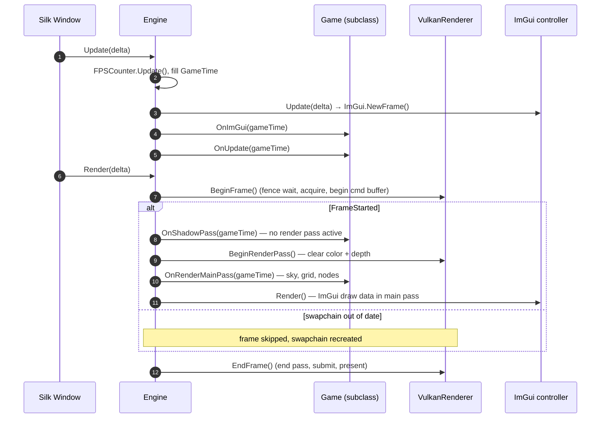

# Engine Lifecycle

## Purpose

`Engine` owns the window, input, renderer and ImGui, and drives the game loop through Silk.NET's
window events. Games subclass it and override four abstract hooks.

## Key types

| Type | File | Notes |
|---|---|---|
| `Engine` | [Engine.cs](../../MainframeEngine/Src/Core/Engine.cs) | `public abstract class Engine : IDisposable` |
| `EngineOptions` | [Engine.cs:10-16](../../MainframeEngine/Src/Core/Engine.cs) | `struct` with `required GameName`, `RenderingBackend = Vulkan`, `WindowSize = 800×600`, `IconPath` |
| `GameTime` | [GameTime.cs](../../MainframeEngine/Src/Core/GameTime.cs) | `FrameCount`, `DeltaTime`, `FramesPerSecond`, `FramesTimeMs` |
| `FPSCounter` | [FPSCounter.cs](../../MainframeEngine/Src/Core/FPSCounter.cs) | 500 ms sampling window |
| `ExitCode` | [ExitCode.cs](../../MainframeEngine/Src/Core/ExitCode.cs) | `Ok = 0`, `Error = 1` |
| `RenderingBackend` | [RenderingBackend.cs](../../MainframeEngine/Src/Core/RenderingBackend.cs) | `Vulkan` only |

## Writing a game

```csharp
public sealed class Game() : Engine(new EngineOptions { GameName = "My Game" })
{
    protected override void OnLoad() { base.OnLoad(); /* create ShadowSystem, Node.Initialize, nodes */ }
    protected override void OnImGui(in GameTime t) { }
    protected override void OnUpdate(in GameTime t) { }
    protected override void OnShadowPass(in GameTime t) { }
    protected override void OnRenderMainPass(in GameTime t) { }
    protected override void OnClose() { /* dispose game objects */ base.OnClose(); }
}
```

- Call `base.OnLoad()` **first** (it creates input, renderer and ImGui).
- Call `base.OnClose()` **last** (it disposes ImGui, input and the renderer).
- `Run()` blocks until the window closes and returns an `ExitCode`. `Quit(code)` closes the window.

## Startup

1. **Constructor:** stores options → `VulkanLoaderBootstrap.Initialize()` → creates the window from
   `WindowOptions.DefaultVulkan` (title `"{GameName} ({RenderingBackend})"`, API 1.2) → subscribes
   `Load`, `FramebufferResize`, `Update`, `Render`, `Closing` → centres the window on the main monitor.
2. **`OnLoad()`** (base): `Window.CreateInput()` → `new VulkanRenderer(Window, enableValidationLayers: true)`
   → `new VulkanImGuiController(...)` → `SetWindowIcon(IconPath)` (StbImageSharp, RGBA).

## The frame

Update and Render are separate Silk.NET window events. ImGui is built **before** game update, and
the shadow pass runs with the command buffer open but no render pass active.



### `MaxFPS` and VSync

- `Engine.MaxFPS` sets both `Window.FramesPerSecond` and `Window.UpdatesPerSecond` (≤ 0 → unlimited).
  It has no effect while VSync is on.
- `Renderer.VSync` changes the present mode by forcing a swapchain rebuild. See
  [Vulkan renderer](vulkan-renderer.md#swapchain-recreation).

### `GameTime` and `FPSCounter`

`FPSCounter.Update()` counts frames and, every ≥ 500 ms, computes `Fps = frames / seconds` and
`Ms = 1000 / Fps` (integer). It is ticked from the **Update** event, so it measures update rate,
not presented frames.

## Shutdown

`Closing` → `OnClose()` (base): `_exitCode = 0` → dispose ImGui controller → dispose input →
dispose renderer. `Run()` returns `_exitCode`. `Dispose()` disposes the window.

## Invariants

- `Renderer` is `null!` until `base.OnLoad()` runs.
- `Node.Initialize` must run after the renderer and `ShadowSystem` exist, before any node is created.
  See [Scene graph & nodes](scene-graph-and-nodes.md).
- Anything drawn must be recorded inside `OnShadowPass` or `OnRenderMainPass`; the command buffer is
  only valid while `IVulkanContext.FrameStarted` is true.

## Known issues

- **`Quit(ExitCode.Error)` returns `Ok`.** `Quit` sets `_exitCode` ([Engine.cs:164](../../MainframeEngine/Src/Core/Engine.cs)), then `OnClose` resets it to 0 ([Engine.cs:150](../../MainframeEngine/Src/Core/Engine.cs)).
- **Validation layers are always on**, including Release ([Engine.cs:82](../../MainframeEngine/Src/Core/Engine.cs)).
- **`EngineOptions.RenderingBackend` is ignored**; `VulkanRenderer` is always created.
- **ImGui frames can be unbalanced** *(inferred)*: `NewFrame` runs on Update, `Render` only on a started
  render frame. A skipped frame (swapchain recreation) or several Updates per Render calls `NewFrame`
  twice without `Render`.
- **FPS counts updates, not presents.**
- README/CLAUDE.md show `Game(in EngineOptions options)`; the Sandbox uses a parameterless primary
  constructor that passes options to `Engine` directly. Both work.

## Related docs

[Architecture overview](architecture-overview.md) · [Vulkan renderer](vulkan-renderer.md) ·
[Sandbox](sandbox.md) · [Future: renderer stabilization](future/renderer-stabilization.md)
