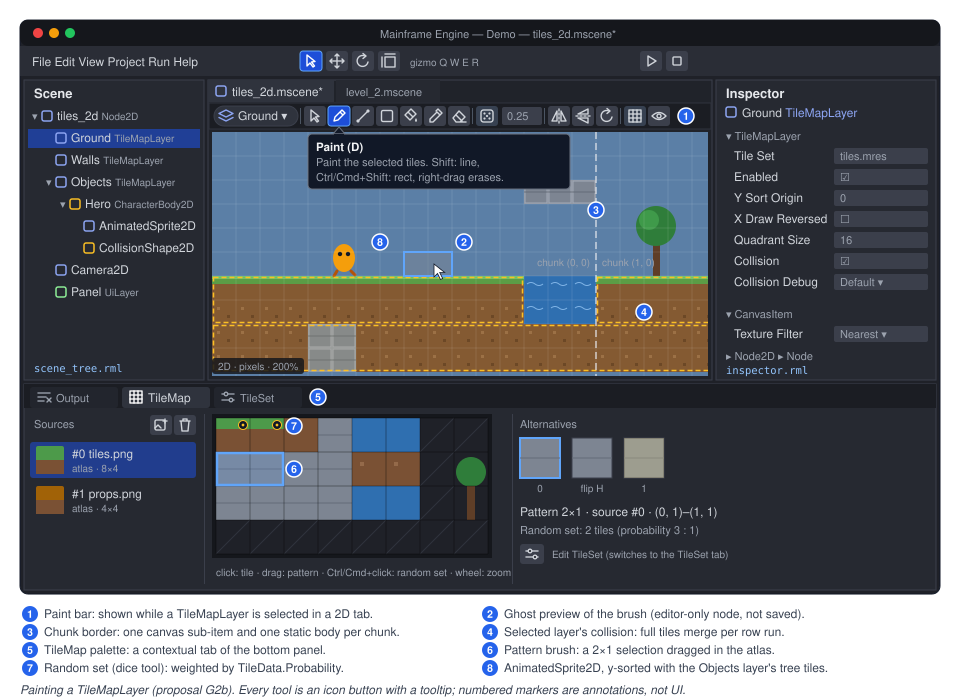
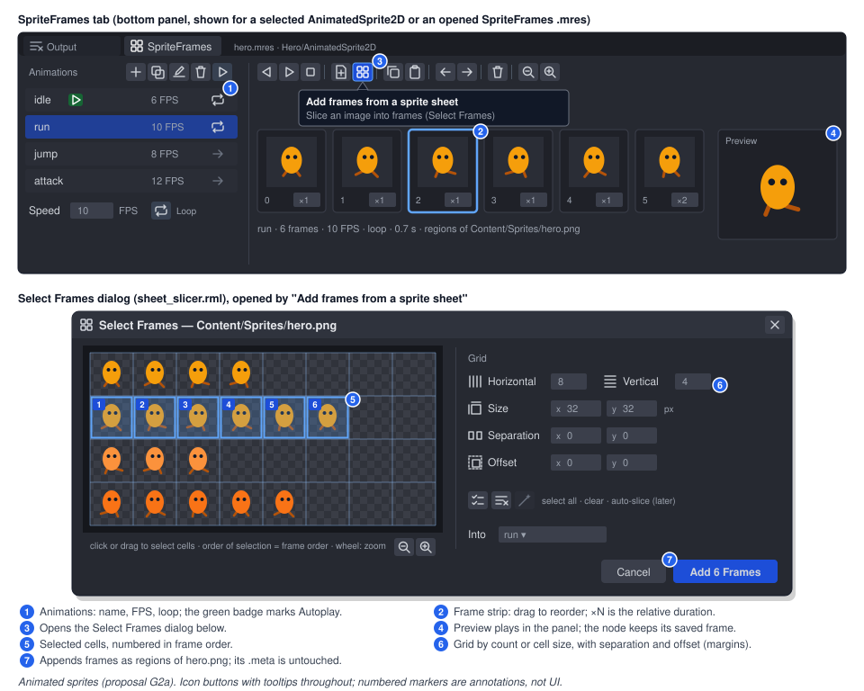

# Proposal: 2D content (animated sprites and tile maps)

**Milestone:** [Gameplay toolkit](../../milestones.md#gameplay-toolkit-) (G2) · **Status:** ⬜ planned ·
**Depends on:** [2D canvas](../canvas.md), [Physics](../physics.md) (Box2D), [Editor → 2D view](../editor.md#2d-view) ·
**Related:** [Keyframe animation](keyframe-animation.md) (G1), [Navigation](navigation.md) (G3),
[Editor viewport tools](editor-viewport-tools.md) (G7), [Asset pipeline](../asset-pipeline.md),
[Scene serialization](../scene-serialization.md)

## Problem

The 2D canvas is a faithful port of Godot 4.7's canvas: culling, z and y-sort, batching, materials, lights, text. What
it lacks is content: flipbook animation and tile maps. Every 2D game needs one or both.

What exists today (checked against the code):

- **`Sprite2D`** (`MainframeEngine/Src/Scene/Nodes2D/Sprite2D.cs:11`) draws a texture or a region of it. It can split
  the texture into a uniform grid (`Hframes`/`Vframes`/`Frame`, `Sprite2D.cs:92-111`) and draws one cell through
  `CanvasPrimitives.TextureRectRegion` in `DrawBuiltin` (`Sprite2D.cs:137-142`). Nothing advances `Frame`, and frames
  have no timing.
- **Other 2D nodes:** `GpuParticles2D` (`Nodes2D/GpuParticles2D.cs:78`, which despite its name simulates on the CPU,
  `GpuParticles2D.cs:71`), `Camera2D` (`Nodes2D/Camera2D.cs:29`) and `PointLight2D` (`Nodes2D/PointLight2D.cs:21`).
  `PointLight2D` is the only 2D light. There is no `DirectionalLight2D` and there are no 2D shadows
  ([canvas → known issues](../canvas.md#known-issues)).
- **Canvas pipeline.** `CanvasCuller` (`Rendering/Canvas/CanvasCuller.cs:33`) culls and orders **nodes**: it walks
  `CanvasItem.ChildList` and attaches one entry per item whose draw-list bounds meet the clip rect
  (`CanvasCuller.cs:223-231`). Y-sort flattens a subtree and orders the entries by origin Y (`CanvasCuller.cs:130-163`).
  `CanvasFrame` pre-transforms every visible vertex on the CPU each frame and merges runs that share a texture,
  sampler, material and blend into one batch (`CanvasFrame.cs:143-228`). An item's whole draw list is rebuilt when it
  redraws (`CanvasItem.RunDraw`, `CanvasItem.cs:234-256`).
- **Texture import.** `.meta` settings cover colour space, mipmaps, filter, wrap, anisotropy, `svgScale` and
  `fixAlphaBorder` ([asset pipeline → textures](../asset-pipeline.md#textures)). They say nothing about frames or regions.
  The canvas samples with the item's `TextureFilter`/`TextureRepeat` (`CanvasItem.cs:142-146`), not the `.meta` filter.
- **2D physics.** Bodies are nodes with `CollisionShape2D` children (`Physics/2D/CollisionObject2D.cs:79-92`). Every
  `BodyRecord2D` belongs to a `CollisionObject2D` (`Physics/2D/PhysicsSpace2D.cs:23-25`). `ConvexPolygonShape2D` takes
  at most 8 points, which is Box2D's limit (`Shapes2D.cs:231-234`). Query and slide results carry a `CollisionObject2D`
  collider (`PhysicsServer2D.cs:8-11`, `CharacterBody2D.cs:9`), but the body signals already pass a `Node2D`
  (`CollisionObject2D.cs:381`, `:452`).
- **Editor 2D view.** 2D tabs are `Disable3D` sub-viewports drawn by the canvas renderer, with the editor camera as
  the canvas transform (`MainframeEngine.Editor/Src/Viewport/ViewportController.cs:163-175`, ADRs 0126 and 0127). So
  `Sprite2D`s already show in the editor. Picking hits collision shapes first, then node origins
  (`ViewportController.2D.cs:159-185`). Sprites are not picked by their drawn rect.
- **Serialization.** `int[]`/`string[]` exports work. Arrays of up to 16 scalars stay on one line, and longer ones
  get one element per line ([scene serialization → file format](../scene-serialization.md#file-format)). That layout
  does not suit tens of thousands of cells.
- **Geometry.** `CanvasPrimitives.Triangulate` does ear clipping (`Scene/Canvas/CanvasPrimitives.cs:610`).
- No type named `SpriteFrames`, `AnimatedSprite2D`, `AtlasTexture`, `TileSet`, `TileMap` or `TileMapLayer` exists.

> **Stale docs found while checking.** At `HEAD`, the "2D content" row of [future/editor.md](editor.md) says "the
> engine has no sprite renderer yet". That is false: `Sprite2D` and the canvas renderer exist (ADR 0111), and since
> ADR 0127 the editor's 2D tabs render canvas items. The same claim is stale in [editor.md](../editor.md) (§2D view,
> "There is no sprite rendering yet", and Known issues, "2D scenes have no sprites to show yet") and in
> [canvas.md](../canvas.md) Known issues ("The editor's 2D view does not draw canvas items yet (E18)"). The
> coordinator should correct these when wiring this proposal in. This proposal does not edit them.

## Goals

- **G2a, animated sprites.** A `SpriteFrames` resource (named animations, frames, fps, loop) and an
  `AnimatedSprite2D` node with Godot 4's API and signals. No allocation per frame.
- **Sprite sheets.** Slice an image into frames by cell count or cell size, with margins and separation. The same
  grid maths serves tile set atlases.
- **G2b, tile maps.** A `TileSet` resource (atlas sources, tile size, per-tile collision polygons, custom data
  layers) and a `TileMapLayer` node with chunked storage, chunked rendering through the existing canvas batcher,
  y-sort, one static Box2D body per chunk, and a compact cell format in `.mscene`.
- **Editor.** Paint tools in the 2D view (paint, line, rect, bucket fill, erase, picker, random scatter), a TileSet
  palette, a TileSet editor, a SpriteFrames panel and a sheet slicer. All tools are icon buttons with tooltips, and
  every edit can be undone.
- **Demo.** A "Tiles 2D" scene with placeholder art generated in code, in keeping with the placeholder-first
  approach.

## Non-goals

- Isometric, half-offset and hexagonal tile shapes. `TileSet.TileShape` is reserved, and only `Square` ships in G2.
- Scene tiles (Godot's `TileSetScenesCollectionSource`), tile patterns, occlusion layers and 2D light occluders. 2D
  shadows do not exist yet.
- Moving tile maps with kinematic bodies (Godot's `use_kinematic_bodies`). Moving a layer moves its static bodies
  (teleport).
- One-way tile collision. It arrives together with one-way `CollisionShape2D`, which does not exist either.
- Runtime tile data overrides (Godot's `_use_tile_data_runtime_update`).
- `AtlasTexture` as a `Texture2D` subclass. See [open questions](#open-questions).
- Navigation polygons on tiles. G2 reserves the hook and [Navigation](navigation.md) (G3) defines it.
- Importing Godot `.tres`/`.tscn` tile sets and maps. The cell format below keeps that possible later.

## Design

### New types

| Type | Kind | Where |
|---|---|---|
| `SpriteSheetGrid` | value type: grid slicing maths | `MainframeEngine/Src/Scene/Nodes2D/Sprites/` |
| `SpriteFrames`, `SpriteAnimation` | resources (`.mres`) | same |
| `SpriteFrame` | `[SerializableValue]` struct with a built-in codec | same |
| `AnimatedSprite2D` | node | same |
| `TileSet`, `TileSetAtlasSource`, `TileData`, `TileSetPhysicsLayer`, `TileSetCustomDataLayer`, `TileCollisionPolygon` | resources | `MainframeEngine/Src/Scene/Nodes2D/Tiles/` |
| `TileMapLayer` | node | same |
| `TileCell` | value type: one cell | same |
| `TileShape`, `TileCellNeighbor`, `DebugVisibilityMode`, `CustomDataType` | enums (Godot's names) | same |
| `CanvasSubItem` | internal class: a draw list a canvas item owns besides its own | `MainframeEngine/Src/Scene/Canvas/` |
| `TileBodies2D` | internal: a layer's static bodies per chunk | `MainframeEngine/Src/Physics/2D/` (Box2D calls stay in `Src/Physics`) |

Godot 4 names, defaults and behaviour are used everywhere unless a deviation is called out.

### Sprite sheets: `SpriteSheetGrid`, and where slicing lives

```csharp
/// <summary>A uniform grid over an image (Godot's "Select Frames" dialog and TileSetAtlasSource layout). New.</summary>
public readonly record struct SpriteSheetGrid(Vector2I CellSize, Vector2I Margins, Vector2I Separation)
{
    public static SpriteSheetGrid FromCounts(Vector2I imageSize, int columns, int rows, Vector2I margins = default, Vector2I separation = default);
    public Vector2I GridSize(Vector2I imageSize);        // whole cells that fit
    public Rect2I CellRect(Vector2I cell);              // texture pixels
    public Vector2I CellAt(Vector2 texturePixel);       // (-1,-1) outside / in a gap
}
```

**Decision: slicing is data in the resource that uses it, not an import setting.** A `SpriteAnimation` frame stores
its texture and region. A `TileSetAtlasSource` stores its texture, `Margins`, `Separation` and
`TextureRegionSize`. The texture stays one `Texture2D` with one `.meta`. Reasons:

1. One sheet often feeds several animations, and sometimes a tile set too. Per-use data avoids one global slicing
   that fits nobody.
2. Import products such as sub-textures or generated `.mres` files would need cache invalidation and UID fix-ups
   when a sheet changes. Regions in resources need neither.
3. It is Godot's model (SpriteFrames regions, atlas source layout). Unity's per-texture "sprite mode: multiple" is
   the alternative, and it ties every user of the sheet to one grid.

The sheet slicer dialog remembers the last grid per texture in `<project>/.mainframe/cache/sheet_grids.json`. This
editor state lives next to the thumbnail cache (`MainframeEngine.Editor/Src/FileSystem/ThumbnailCache.cs:11`) and is
not committed. Pixel-art sheets should set `filter: nearest`, and linear-filtered sheets with transparent gutters
should set `fixAlphaBorder: true` in their `.meta`. The canvas uses the node's `TextureFilter`, so pixel-art games set
`TextureFilter = Nearest` on their root `Node2D`, and children inherit it via `ParentNode`.

### `SpriteFrames` (G2a)

```csharp
[EditorIcon("library-photo")]
public sealed class SpriteFrames : Resource                  // new
{
    [Export] public List<SpriteAnimation> Animations { get; set; } = [];   // "default" created by the editor

    public SpriteAnimation? GetAnimation(string name);       // ordinal lookup, cached name → index, no allocation
    public bool HasAnimation(string name);
    public SpriteAnimation AddAnimation(string name);        // editor and tools; Godot's add_animation
    public void RemoveAnimation(string name);
    public void RenameAnimation(string from, string to);
}

public sealed class SpriteAnimation : Resource              // new, inline sub-resource
{
    [Export] public string Name { get; set; } = "default";
    [Export(Range = "0,120,0.01")] public float Speed { get; set; } = 5f;   // frames per second (Godot's default)
    [Export] public bool Loop { get; set; } = true;
    [Export] public Texture2D?[] Textures { get; set; } = [];             // the sheets/images the frames use
    [Export] public SpriteFrame[] Frames { get; set; } = [];
}

[SerializableValue]
public readonly record struct SpriteFrame(int Texture, Rect2 Region, float Duration = 1f);  // new
// Texture: index into Textures. Region: texture pixels (zero size = whole texture). Duration: relative (Godot).
```

`SpriteFrame` gets a built-in `FloatArray` codec registered in `Codecs` (six numbers:
`[texture, x, y, w, h, duration]`). Each frame therefore takes one line in the file, and the 16-scalar layout rule
already applies. Godot stores one `Texture2D` per frame, usually an `AtlasTexture`. A texture table plus a region
keeps frames value-typed: there is no inline resource per frame, no `AtlasTexture` and no boxing.

A `SpriteFrames` saved as `.mres`
([`ResourceSaver`](../scene-serialization.md#saving) format: `format`, `uid`, `type`, `resources`, `props`):

```json
{
  "format": 2,
  "uid": "res_51c0aa7e3d19",
  "type": "SpriteFrames",
  "resources": {
    "Texture2D_0h3k1": { "ref": "tex_9b2e40c7a1f3", "path": "Content/Sprites/hero.png" },
    "SpriteAnimation_4f2qz": {
      "type": "SpriteAnimation",
      "props": {
        "Name": "run",
        "Speed": 10,
        "Textures": [{ "res": "Texture2D_0h3k1" }],
        "Frames": [
          [0, 0, 32, 32, 32, 1],
          [0, 32, 32, 32, 32, 1],
          [0, 64, 32, 32, 32, 1],
          [0, 96, 32, 32, 32, 2]
        ]
      }
    }
  },
  "props": { "Animations": [{ "res": "SpriteAnimation_4f2qz" }] }
}
```

### `AnimatedSprite2D` (G2a)

Godot 4's node. It draws like `Sprite2D` (centred, offset, flips) and reuses its rect maths through a shared
internal helper. It does **not** subclass `Sprite2D` (Godot keeps them separate, and `Hframes`/`Region` would make no
sense on it).

```csharp
[EditorIcon("slideshow", Family = EditorIconFamily.Space2D)]
public class AnimatedSprite2D : Node2D                      // new
{
    [Export] public SpriteFrames? SpriteFrames { get; set; }
    [Export] public string Animation { get; set; } = "default";
    [Export] public string Autoplay { get; set; } = "";     // played on ready (not in edit mode)
    [Export] public int Frame { get; set; }
    [Export(Range = "0,1")] public float FrameProgress { get; set; }
    [Export(Range = "-8,8,0.01")] public float SpeedScale { get; set; } = 1f;
    [Export] public bool Centered { get; set; } = true;
    [Export] public Vector2 Offset { get; set; }
    [Export] public bool FlipH { get; set; }
    [Export] public bool FlipV { get; set; }

    public void Play(string? name = null, float customSpeed = 1f, bool fromEnd = false);
    public void PlayBackwards(string? name = null);
    public void Pause();
    public void Stop();                                       // frame 0, progress 0
    public bool IsPlaying();
    public void SetFrameAndProgress(int frame, float progress);
    public float GetPlayingSpeed();                           // SpeedScale × customSpeed, signed
    public Rect2 GetRect();                                   // local drawn rect (editor picking)

    [Signal] public event Action? AnimationChanged;
    [Signal] public event Action? AnimationFinished;          // non-looping animation reached its end
    [Signal] public event Action? AnimationLooped;
    [Signal] public event Action? FrameChanged;
    [Signal] public event Action? SpriteFramesChanged;
}
```

- **Timing** follows Godot's `AnimatedSprite2D::_notification(INTERNAL_PROCESS)`. Each frame lasts
  `Duration / (Speed × |playing speed|)` seconds. `OnProcess` carries the remainder across frames, so a long delta
  skips frames and emits `FrameChanged` once per frame step (several per tick on a hitch) and
  `AnimationLooped`/`AnimationFinished` at the boundary, in Godot's order.
- **No allocation per frame.** `Play("run")` resolves the name through the resource's cached `Dictionary<string, int>`
  (`TryGetValue` on the caller's literal) and stores the `SpriteAnimation` reference. Each tick does float arithmetic,
  then `QueueRedraw()` when the frame index changed (an add to the tree's existing redraw list,
  `SceneTree.Canvas.cs:11`). It invokes parameterless `Action` signals with no boxing, and the redraw adds one quad
  through `CanvasPrimitives.TextureRectRegion`. The resource's `Changed` event (`Resource.cs:45`) is subscribed when
  `SpriteFrames` is set, not per frame.
- **Edit mode.** The node is not `[Tool]`, so it does not process in the editor (ADR 0080). The editor shows
  `Animation`/`Frame` statically. The SpriteFrames panel's play button previews by setting `Frame` on the selected
  node from an editor ticker, and restores the frame on stop with no undo entry and without dirtying the scene.
- **Constructor** is empty. The name→index cache lives on `SpriteFrames` and is rebuilt lazily after `Changed`.

### Interplay with keyframe animation (G1)

`AnimatedSprite2D` is a self-timed flipbook: walk cycles, idle loops and effects. [Keyframe animation](keyframe-animation.md)
(G1) choreographs properties over time. The two combine the way they do in Godot:

- An `AnimationPlayer` can key `AnimatedSprite2D.Animation` (string discrete track), `Frame` (int) and `FlipH`, or
  call `Play`/`Stop` through a method track. G1's typed property tracks write through `ExportPropertyInfo<TOwner,TValue>`
  setters, so this needs nothing from G2.
- The other Godot pattern, `Sprite2D` + `Hframes`/`Vframes` + an `AnimationPlayer` keying `Frame`, works as soon as
  G1 lands.
- G2 adds no timeline integration. A frame strip is not a G1 track type.

### `TileSet` (G2b)

```csharp
[EditorIcon("layout-grid")]
public sealed class TileSet : Resource                       // new
{
    [Export] public TileShape TileShape { get; set; } = TileShape.Square;   // only Square in G2
    [Export] public Vector2I TileSize { get; set; } = new(16, 16);
    [Export] public bool UvClipping { get; set; }            // inset sampling half a texel (Godot)
    [Export] public List<TileSetPhysicsLayer> PhysicsLayers { get; set; } = [];
    [Export] public List<TileSetCustomDataLayer> CustomDataLayers { get; set; } = [];
    [Export] public List<TileSetAtlasSource> Sources { get; set; } = [];

    public TileSetAtlasSource? GetSource(int sourceId);       // id → source, cached, no allocation
    public int GetCustomDataLayerByName(string name);         // -1 if missing
}

public sealed class TileSetAtlasSource : Resource            // new
{
    [Export] public int Id { get; set; }                     // the source id cells store (Godot's source_id)
    [Export] public Texture2D? Texture { get; set; }
    [Export] public Vector2I Margins { get; set; }
    [Export] public Vector2I Separation { get; set; }
    [Export] public Vector2I TextureRegionSize { get; set; } = new(16, 16);
    [Export] public bool UseTexturePadding { get; set; } = true;
    [Export] public Vector2I[] Tiles { get; set; } = [];     // atlas coords of created tiles
    [Export] public List<TileData> TileOverrides { get; set; } = [];        // only tiles with non-default data

    public SpriteSheetGrid Grid { get; }                     // from Margins/Separation/TextureRegionSize
    public bool HasTile(Vector2I atlasCoords);
    public TileData GetTileData(Vector2I atlasCoords, int alternative = 0); // shared default instance if none
    public void CreateTilesFromOpaqueRegions();              // editor: Godot's "create tiles in non-transparent regions"
}

public sealed class TileData : Resource                      // new
{
    [Export] public Vector2I AtlasCoords { get; set; }
    [Export] public int AlternativeId { get; set; }          // 0 = base tile
    [Export] public Vector2I TextureOrigin { get; set; }
    [Export] public Vector4 Modulate { get; set; } = Vector4.One;
    [Export(Range = "-4096,4096,1")] public int ZIndex { get; set; }
    [Export] public int YSortOrigin { get; set; }
    [Export(Range = "0,1000,0.01")] public float Probability { get; set; } = 1f;   // random scatter weight
    [Export] public List<TileCollisionPolygon> Collision { get; set; } = [];
    [Export] public string[] CustomData { get; set; } = [];  // invariant text per custom data layer, see below

    public bool GetCustomBool(int layer); public long GetCustomInt(int layer);
    public double GetCustomFloat(int layer); public string GetCustomString(int layer);   // parsed once, cached
}

public sealed class TileCollisionPolygon : Resource          // new
{
    [Export] public int PhysicsLayer { get; set; }
    [Export] public Vector2[] Points { get; set; } = [];     // tile-local pixels, origin at the tile centre (Godot)
}
```

- **Tiles are created explicitly**, as in Godot. A cell may only reference a created tile. `Tiles` lists coordinates
  and `TileOverrides` holds `TileData` only for tiles with non-default values. A 16×16 atlas with collision on a
  dozen tiles writes about a dozen `TileData` entries, not 256. Big tiles (`size_in_atlas`) and atlas tile animation
  are later work (see the task list).
- **Alternatives and flips.** As in Godot 4.2+, the alternative id's high bits are transform flags
  (`TransformFlipH = 4096`, `TransformFlipV = 8192`, `TransformTranspose = 16384`). The paint tools' flip and rotate
  buttons set those bits, the renderer mirrors or transposes the quad's UVs, and collision polygons are transformed
  the same way. User alternatives (`AlternativeId` 1…4095) let a tile carry different `TileData`, such as another
  modulate or no collision.
- **Texture padding.** With `UseTexturePadding`, the source builds a padded copy of the atlas at load. Every tile is
  surrounded by a 1 px copy of its own edge pixels (Godot's behaviour). The copy uses `Texture2D.FromPixels` once per
  load or texture change, so linear filtering and fractional zoom do not bleed neighbouring tiles.
- **Physics layers.** `TileSetPhysicsLayer` holds `CollisionLayer`, `CollisionMask` and a `PhysicsMaterial`. A
  polygon belongs to one physics layer.
- **Custom data layers.** `TileSetCustomDataLayer` holds a `Name` and a `Type` (`Bool`, `Int`, `Float`, `String`,
  `Vector2`, `Color`). Values are stored as invariant text, aligned to the layers, and parsed into a typed table when
  the tile set loads or changes. The typed getters never parse or box. This deviates from Godot, which stores
  `Variant`s. The engine has no `Variant`, and an `object` export would box and break AOT-friendly generated
  serialization. Typical uses are `"damage"` (int), `"surface"` (string, for footstep sounds) and `"solid"` (bool,
  for G3's grid).
- **Navigation hook (G3).** G3a's grid A* reads a `TileMapLayer` through public API: `GetUsedCells`, `GetCellTileData`,
  collision on a chosen physics layer, or a custom data bool layer. Godot-style navigation polygons per tile
  (`TileSetNavigationLayer`) are defined by [Navigation](navigation.md). G2 reserves the names and adds no fields.
- **Terrains (later, G2b.5).** Godot 4 terrain sets (match corners and sides, match corners, match sides), peering
  bits on `TileData`, and `SetCellsTerrainConnect`/`SetCellsTerrainPath`. They would be ported from Godot's
  `TileMapLayer` terrain solver (MIT, like the canvas culler port). They are a later phase because the solver is the
  largest single piece of this proposal and tile maps are useful without it.

### `TileMapLayer` (G2b): the naming decision

**Decision: ship `TileMapLayer` only, with no multi-layer `TileMap` node.** Godot 4.3 deprecated `TileMap` in favour
of one `TileMapLayer` node per layer. That is the right model for this engine:

- Each layer is an ordinary `CanvasItem`. It gets z-index, modulate, material, visibility, light mask and y-sort from
  `CanvasItem`, so per-layer duplicates of those settings are not needed.
- Layers are ordered and grouped by the tree. Parallax or y-sorted object layers are just siblings or children.
- Projects ported from Godot 4.3+ map one to one, and current Godot documentation applies.
- The milestone row already names a "tile map layer node".

The editor's paint bar includes a layer switcher that cycles sibling layers, so editing several layers stays quick.

```csharp
[EditorIcon("grid-pattern", Family = EditorIconFamily.Space2D)]
public class TileMapLayer : Node2D                           // new
{
    [Export] public bool Enabled { get; set; } = true;
    [Export] public TileSet? TileSet { get; set; }
    [Export] public int YSortOrigin { get; set; }
    [Export] public bool XDrawOrderReversed { get; set; }
    [Export(Range = "1,64,1")] public int RenderingQuadrantSize { get; set; } = 16;   // chunk edge in cells (Godot)
    [Export] public bool CollisionEnabled { get; set; } = true;
    [Export] public DebugVisibilityMode CollisionVisibilityMode { get; set; }        // Default / ForceShow / ForceHide
    [Export(Storage = true)] internal string[] TileMapData { get; set; }             // see Serialization

    public void SetCell(Vector2I coords, int sourceId = -1, Vector2I? atlasCoords = null, int alternative = 0);
    public void EraseCell(Vector2I coords);
    public void Clear();
    public int GetCellSourceId(Vector2I coords);             // -1 when empty
    public Vector2I GetCellAtlasCoords(Vector2I coords);
    public int GetCellAlternativeTile(Vector2I coords);
    public TileData? GetCellTileData(Vector2I coords);
    public bool IsCellFlippedH(Vector2I coords); public bool IsCellFlippedV(Vector2I coords); public bool IsCellTransposed(Vector2I coords);
    public int GetUsedCells(List<Vector2I> results);          // fills the caller's list (no allocation once sized)
    public int GetUsedCellsById(List<Vector2I> results, int sourceId = -1, Vector2I? atlasCoords = null, int alternative = -1);
    public Rect2I GetUsedRect();
    public Vector2I LocalToMap(Vector2 localPosition);
    public Vector2 MapToLocal(Vector2I mapPosition);          // cell centre
    public Vector2I GetNeighborCell(Vector2I coords, TileCellNeighbor neighbor);
    public bool GetCoordsForCollision(Vector2 globalPosition, Vector2 normal, out Vector2I coords);   // see Physics
    public void UpdateInternals();                            // apply pending chunk rebuilds now (Godot)

    [Signal] public event Action? Changed;
}

public readonly record struct TileCell(short SourceId, ushort AtlasX, ushort AtlasY, ushort Alternative)   // new
{
    public static readonly TileCell Empty = new(-1, 0xFFFF, 0xFFFF, 0);
}
```

`ExportAttribute.Storage` is a **new hint**, Godot's `PROPERTY_USAGE_STORAGE` without `EDITOR`. The member is
serialized but has no inspector row. `Node2D.ToLocal`/`ToGlobal` (Godot's names) are added too, because the usual
"which cell is under the mouse" call needs them: `layer.LocalToMap(layer.ToLocal(GetGlobalMousePosition()))`.

#### Cell storage: chunks

- Cells live in `Dictionary<Vector2I, TileChunk>`, keyed by chunk coordinates (`floor(cell / RenderingQuadrantSize)`).
  A `TileChunk` holds a flat `TileCell[size × size]`, a used count, a dirty flag for rendering and one for physics,
  its `CanvasSubItem` and its body handle. A chunk whose used count drops to 0 is removed.
- `SetCell` writes the cell, marks the chunk dirty, adds it to the layer's pending list and queues one rebuild for
  the end of the frame. Painting 1 000 cells in one frame rebuilds each touched chunk once.
- Lookups are a dictionary probe plus an index and do not allocate. A new chunk allocates its arrays on the first
  write only, which is a load-time or edit-time cost.

#### Rendering: canvas sub-items through the existing batcher

The culler only knows nodes, and a chunk should not be a node: it would show in `GetChildren`, be saved, and appear
in the editor tree. Godot's `TileMapLayer` uses rendering quadrants, which are canvas items that are not nodes. The
engine gets the same thing:

- **`CanvasSubItem` (new, internal):** a `CanvasDrawList`, a local transform and a y-sort origin, owned by a
  `CanvasItem` (`CanvasItem.SubItems`, empty for every existing type).
- **`CanvasCuller`** treats an item's sub-items as children that draw right after the item's own list and before its
  node children. Each one is attached and culled on its own bounds, so off-screen chunks cost a bounds test. Under
  y-sort, `CollectYSortChildren` adds sub-items as entries with their own Y. `CulledCanvasItem` gains the
  `CanvasDrawList` to draw (the item's own or a sub-item's), and `CanvasFrame.Append` reads that instead of
  `culled.Item.DrawList` (`CanvasFrame.cs:149`). Modulate, material, light mask and filter still come from the owning
  item.
- **Chunk draw.** `TileMapLayer` overrides `DrawBuiltin` (`private protected`, `CanvasItem.cs:229`) and rebuilds only
  the dirty chunks' lists, not its own empty list. Each chunk records one textured quad per cell
  (`TextureRectRegion`, flips and transposes from the alternative bits, `TileData.Modulate`, `TextureOrigin`), in
  Godot's order: rows top to bottom, and x reversed with `XDrawOrderReversed`. Tiles with a non-zero
  `TileData.ZIndex` go to a separate sub-item per z, as in Godot.
- **Batching comes for free.** Consecutive quads with the same atlas texture and state merge into one batch
  (`CanvasFrame.cs:201`), so a layer that uses one atlas draws in about one batch however many chunks are visible.
- **Cost.** `CanvasFrame` pre-transforms vertices on the CPU every frame. A 1920×1080 view of 16 px tiles at zoom 1
  is about 8 200 tiles, or 33 000 vertices per layer per frame. A benchmark (see Testing) guards this. If it becomes
  the bottleneck, chunks could keep static GPU vertex buffers and draw through the existing `LocalVertices` batch
  path (`CanvasFrame.cs:33`), which is a later optimisation that needs no API change.

#### Y-sort

With `YSortEnabled` on the layer, Godot's rule applies. Chunks become rows: a sub-item per (chunk x, cell row, tile
y-sort origin), whose sort Y is the row's origin plus `TileData.YSortOrigin` plus the layer's `YSortOrigin`. They
are y-sorted together with the layer's node children. A character that is a child of the layer, or a sibling under
a y-sorted parent together with the layer, therefore walks behind a tree tile's top row and in front of its trunk
row. Without y-sort a chunk is one sub-item.

#### Physics: one static body per chunk

- **`TileBodies2D` (new, internal, `Src/Physics/2D`)** manages one Box2D static body per chunk per physics layer
  that has shapes. No Box2D call lives outside `Src/Physics`. The layer hands it the chunk's cells and the tile set,
  and gets a handle back.
- **Shapes.** Each tile polygon is transformed by the cell's flips and position. A convex polygon with at most 8
  points becomes one Box2D polygon. Anything else is triangulated with `CanvasPrimitives.Triangulate` and merged
  greedily into convex pieces of at most 8 points (Hertel–Mehlhorn). Full-cell square polygons in a row are merged
  into one rectangle per run. That cuts shape counts by an order of magnitude on solid ground and removes most of
  the internal seams that make bodies snag between neighbouring boxes.
- **Owner.** `BodyRecord2D` today requires a `CollisionObject2D`. It gains `Node2D Owner` (the `TileMapLayer`) with
  `CollisionObject2D? Node` null for tile bodies. Queries and slides then report the layer:
  - `RayHit2D.Collider`, `ShapeCastHit2D.Collider`, `KinematicCollision2D.Collider` and the `IntersectPoint`/
    `IntersectShape` result lists widen from `CollisionObject2D` to `Node2D`. This matches Godot, where
    `get_collider()` returns `Object` (a `TileMapLayer` for tiles), and matches the engine's own
    `BodyEntered(Node2D)`.
  - This is a **breaking change**. Code that used a `CollisionObject2D` member on `Collider` needs a cast and fails
    to compile until it gets one, while `is Player` checks keep compiling. The repository has a handful of uses in
    `Src/Physics` and the physics tests.
  - `TileMapLayer.GetCoordsForCollision(position, normal, out coords)` returns the hit cell, using the point pushed
    half a pixel into the surface, which is the usual Godot idiom. A shape → cell map kept in the chunk's body makes
    this exact for slide collisions.
- **Transform.** Bodies follow the layer's global transform. A moved layer teleports its bodies (`Teleport`). This
  path is for edit and setup, not animation.
- **Debug.** Physics debug draw includes tile shapes. `CollisionVisibilityMode.ForceShow` draws them at run time. The
  editor draws the selected layer's collision outlines like `CollisionShape2D`s.
- **Rebuilds** happen in the physics server's pre-step (`BeforeFixedSteps`), never inside a step. Engine-side
  rebuild code reuses scratch lists. Box2D's own allocations on shape creation are allowed by the physics rules.

#### Serialization: one base64 line per chunk

`TileMapData` is a `string[]`, one entry per non-empty chunk, sorted by chunk (y, then x). Each entry is base64 of a
little-endian `u16` format (1) followed by 12-byte cell records: `i16 x, i16 y, u16 sourceId, u16 atlasX, u16 atlasY,
u16 alternative`. That is the record of Godot 4.3's `tile_map_data`, so a future Godot importer only has to split by
chunk.

```json
{
  "name": "Ground",
  "parent": ".",
  "type": "TileMapLayer",
  "props": {
    "TileSet": { "res": "TileSet_7u1pe" },
    "TileMapData": [
      "AQAAAAAAAAAAAAEAAAAAAAEAAAAAAAEAAAAAAAIAAAAAAAEA…",
      "AQAQAAAAAAAAAAMAAQAAABEAAAAAAAMAAQAAABIAAAAAAAMA…"
    ]
  }
}
```

- **Why chunked base64.** A JSON array per cell would be about 10× larger and unreadable. One blob for the whole map
  turns every paint stroke into a whole-file diff. One line per chunk keeps files compact (a full 16×16 chunk is
  about 4 KB of text) and makes a diff show which areas changed. Merge conflicts become per-chunk, which is coarse
  but tractable.
- **Layout fix.** `SceneJsonLayout` keeps arrays of up to 16 scalars on one line, which would put a small map's
  chunks on one line. It gains one rule: an array containing a string longer than 64 characters is laid out one
  element per line.
- Determinism: same cells, same bytes. Chunks are sorted and the records inside a chunk follow cell order.
  `SceneSaver` writes the same file twice.
- Loading decodes with `Convert.FromBase64String` and fills chunks. That is load-time allocation, AOT-safe, with no
  reflection.

### Editor



#### Paint bar (2D view)

When a `TileMapLayer` with a `TileSet` is selected in a 2D tab, a bar appears under the scene tabs. It is built like
the existing `#preview-bar` in `viewport.rml`. Every control is an icon button with a tooltip ("Title (Shortcut):
what it does").

| Icon (Tabler) | Tool | Shortcut | Behaviour |
|---|---|---|---|
| `pointer` | Select | S | Select cells (drag a rectangle); Cut/Copy/Paste/Delete act on them; Esc deselects |
| `pencil` | Paint | D | Paint the palette selection (a single tile or a pattern) under the cursor; Shift+drag draws a line and Ctrl/Cmd+Shift+drag a rect, as in Godot |
| `line` | Line | L | Drag a line of cells (Bresenham) |
| `square` | Rect | R | Drag a filled rectangle |
| `bucket-droplet` | Bucket | B | Flood fill; with **Contiguous** off, replace every matching cell in the used rect; bounded by the used rect grown by one chunk when filling empty space |
| `color-picker` | Picker | P | Click a cell to select its tile in the palette; Ctrl/Cmd+click does this from any tool |
| `eraser` | Eraser | E | Erase with the current tool's shape; right-drag erases from any tool (Godot) |
| `dice-5` | Random tile | — | Paint picks among the selected tiles by `Probability`; **Scattering** (0–1) leaves that fraction empty |
| `flip-horizontal`, `flip-vertical`, `rotate-clockwise` | Transform | C, V, X (Z counter-clockwise) | Set the alternative's flip/transpose bits for the next strokes |
| `stack-2` | Layer | — | Switch to the previous or next sibling `TileMapLayer` (a chip shows the layer's name); **Highlight** dims other layers |
| `grid-3x3` | Grid | — | Show the cell grid and chunk borders |

- **Preview.** A ghost of the brush follows the cursor at 50 % alpha. It is drawn by an editor-only, unowned
  `TilePaintPreview2D` node (`[Tool]`, not saved, hidden from the scene tree because it is not owned, see
  `EditedScene.IsEditable`, `EditedScene.cs:73`). Line, rect and bucket strokes preview the whole affected region
  before mouse-up.
- **Shortcuts.** E and R are also the Rotate/Scale gizmo keys. While the paint bar is shown and a paint tool other
  than Select is active, Godot's tile shortcuts win, as they do in Godot's editor. Q (gizmo Select) leaves painting.
  See open questions.
- **Picking.** In Select mode a click on painted cells selects the layer. `Pick2D` gains drawn-rect picking for
  `Sprite2D`, `AnimatedSprite2D` and tile layers (the cell under the cursor is non-empty). Today it only hits shapes
  and origins. The same bounds (`AnimatedSprite2D.GetRect()`, and `GetUsedRect()` mapped to local pixels for a
  layer) feed G7's box selection ([Editor viewport tools](editor-viewport-tools.md), which calls the layer `TileMap`
  and should read `TileMapLayer`).

#### TileMap palette (bottom panel)

The bottom region becomes tabbed: **Output**, plus contextual **TileMap**, **TileSet** and **SpriteFrames** tabs that
appear when the selection or opened resource needs them. This follows Godot's bottom panel. `EditorLayout` already
owns the bottom rectangle (`Layout/EditorLayout.cs:257-264`). The TileMap tab shows:

- a **source list** with a thumbnail, id and texture name per atlas source;
- an **atlas view** showing the source's texture with the grid, created tiles bright and others dimmed. Click selects
  a tile, drag selects a rectangle (a pattern brush), and Ctrl/Cmd+click toggles tiles in the random set. Wheel zooms
  and middle-drag pans;
- an **alternatives strip** for the selected tile's alternatives;
- an **Edit TileSet** button (icon `adjustments`) that switches to the TileSet tab.

#### TileSet editor

The **TileSet** tab edits the selected layer's `TileSet`, or a `TileSet` `.mres` opened from the FileSystem panel
(`EditedResource`, with its own undo history, `MainframeEngine.Editor/Src/Session/EditedResource.cs:21`).

- **Sources:** add an atlas from a texture (`photo-plus`, which opens the file picker), remove, and set the id.
  Adding asks "Create tiles in non-transparent regions?", as Godot does.
- **Setup mode:** `Margins`, `Separation` and `TextureRegionSize` with a live grid overlay. Click toggles a tile
  created or erased.
- **Select mode:** the selected tile's `TileData` shows in the inspector, where every property, including custom data
  rows typed by the layer, is undoable as usual.
- **Collision:** a zoomed tile view with polygon handles per physics layer. Toolbar: Full tile (`square`), Add
  polygon (`polygon`), Clear (`trash`) and Snap to ½/¼ tile (`magnet`). Drag moves points, a double-click on an edge
  inserts a point, and Delete removes one.

#### SpriteFrames panel and sheet slicer



- **SpriteFrames tab** (when an `AnimatedSprite2D` is selected or a `SpriteFrames` `.mres` is opened):
  - the **animation list** with name, FPS and Loop toggle. Toolbar: Add, Duplicate, Rename, Delete, and Autoplay on
    load (`player-play` badge on the row);
  - the **frame strip** with thumbnails, index and relative duration (editable). Toolbar: Play backwards, Play, Stop,
    Add frames from files (`file-plus`), Add frames from a sprite sheet (`layout-grid`), Copy, Paste, Move left/right,
    Delete and Zoom. Drag reorders.
- **Select Frames dialog** (`sheet_slicer.rml`, new): the sheet with the grid overlay. **Horizontal/Vertical**
  (counts) or **Size** (cell size), **Separation** and **Offset** (margins) set the grid. Click or drag selects cells,
  numbered in selection order. Buttons: Select all, Clear, Auto-slice by opaque bounds (later, see open questions).
  The primary action "Add N Frames" uses text, per the icons rule (dialog primary actions keep text).
- The same dialog serves "New SpriteFrames from sheet…" in the FileSystem context menu of an image. That creates a
  `.mres` with one animation per selected row, which is the fastest path from a downloaded sheet to a playing
  character.

#### Undo

- `PaintTilesAction : IEditorAction` (new, `MainframeEngine.Editor/Src/Undo/TileActions.cs`) records
  `(Vector2I coords, TileCell before, TileCell after)` entries. A stroke applies cells live and commits with
  `alreadyApplied: true` and a per-stroke merge key (`UndoRedo.Commit`, `UndoRedo.cs:94`). Mouse-up calls `EndMerge`,
  so one stroke is one entry: "Paint Tiles", "Erase Tiles", "Fill Tiles" or "Paste Tiles". Undo writes `before` back
  through `SetCell`, which marks the chunks dirty as usual.
- SpriteFrames and TileSet edits go through `SetPropertyAction`, with typed setters on the resource and history in
  the scene or the `EditedResource`.

### Threading and allocation

- Everything runs on the main thread: node processing, chunk rebuilds in the canvas redraw flush, and body rebuilds
  in the physics pre-step.
- Steady state allocates nothing. `AnimatedSprite2D` playback, an unchanged `TileMapLayer`, culling of sub-items and
  frame building reuse lists and arrays. Painting at run time (`SetCell`) allocates only when a chunk is created or
  a draw list grows past its capacity. Both are amortised and excluded from the steady-state gate, as `CanvasDrawList`
  growth is today.
- AOT and trimming: there is no reflection. Codecs are registered statically (`SpriteFrame`) or are built-in (the
  string array).

### Demo scene

`tiles_2d` ("Tiles 2D") is added to `DemoScenes.All` and built in code like the others ([Demo](../demo.md)):

- **Placeholder art first.** The builder generates `Content/Tiles2D/tiles.png` (a 16 px atlas: grass, dirt, stone,
  water, a two-tile tree with a y-sort origin) and `Content/Tiles2D/hero.png` (a 4×4 sheet of a blob with
  idle/run/jump frames, numbered) with `Png.WriteRgba8` (`MainframeEngine/Src/Imaging/Png.cs:68`). It is all MIT and
  replaceable by real art without code changes.
- `tiles.mres` (`TileSet`: one physics layer with full-tile collision on stone, and custom data `surface`) and
  `hero.mres` (`SpriteFrames`: idle, run and jump).
- Scene: `Ground` and `Walls` `TileMapLayer`s, filled from a small ASCII level in the builder, and a y-sorted
  `Objects` layer with trees. A `CharacterBody2D` hero with an `AnimatedSprite2D` switches idle/run/jump from its
  velocity and walks behind or in front of the trees. A `Camera2D` follows.
- Panel controls: show collision, y-sort on/off, click to toggle a wall cell at run time (live chunk and body
  rebuild), and play speed.
- The nav bar's number keys stop at 8 (`Examples/Demo/Demo/Src/Nav/DemoNav.cs:102`). Extend them to 1–9 then 0
  (keyboard-row order) in tab order; the Gameplay toolkit's Demo tabs (`animation_3d` from
  [Keyframe animation](keyframe-animation.md), `tiles_2d`, `navigation_2d` from [Navigation](navigation.md)) take the
  next free key in the order they land. Tabs past the tenth are reached with the nav bar or the
  `scene_next`/`scene_prev` actions from [Save games and settings](save-and-settings.md).

## Testing

- **Unit (`Tests/MainframeEngine.Tests/Canvas/`, new files):**
  - `SpriteSheetGridTests`: counts ↔ sizes, margins and separation, `CellAt` in gaps.
  - `AnimatedSprite2DTests`: frame timing against Godot's rule (durations, negative speed, `PlayBackwards`, `fromEnd`),
    signal order on loop and finish, several frame steps in one long tick, `SetFrameAndProgress`, the autoplay rule
    in edit mode, and redraws only on frame change.
  - `SpriteFramesSerializationTests`: `.mres` round trip, one line per frame, `SpriteFrame` codec.
  - `TileMapLayerTests`: `SetCell`/`EraseCell`/getters, chunk creation and removal, negative coordinates,
    `LocalToMap`/`MapToLocal`, `GetUsedRect`, alternative flip bits, invalid source ids (cell kept, not drawn, a warning
    as in Godot's `fix_invalid_tiles`).
  - `TileMapSerializationTests`: base64 chunk round trip, deterministic bytes, Godot-record compatibility (a known
    `tile_map_data` byte array decodes to the expected cells), `SceneJsonLayout` long-string rule, `Storage` hint
    hidden from `NodeTypeInfo`'s inspector list.
  - `CanvasSubItemTests` (culler): sub-items cull on their own bounds, order after the owner and before node children,
    y-sort rows interleave with sibling nodes, owner modulate and material apply.
- **Physics (`Tests/MainframeEngine.Tests/Physics/`):** `TileBodies2DTests`. One body per chunk, merged rectangles,
  concave polygon decomposition at ≤ 8 points, a ray hitting a tile reporting the layer and `GetCoordsForCollision`,
  a `CharacterBody2D` sliding along a 20-tile floor without snagging, and an erased cell removing its shape.
- **Allocation gates:** `Canvas2DContentAllocationTests`. **0 bytes** over 300 ticks of tree tick + `CanvasServer`
  frame build with 1 000 playing `AnimatedSprite2D`s and a 256×256-cell layer (scrolling camera, y-sorted objects
  layer). The existing `Physics2DAllocationTests` gains a tile layer.
- **Benchmark:** `TileMapLayerFrameBuild` in `Tests/MainframeEngine.Benchmarks` (a full-screen 16 px layer, 3 layers),
  added to `baseline.json`.
- **Render tests (`Tests/MainframeEngine.RenderTests/CanvasRenderTests.cs`):** a `tiles` host scene with a tile layer,
  flips and transposes, y-sorted rows with a sprite between them, and an `AnimatedSprite2D` captured at frames 1 and
  12. Goldens for `moltenvk` and `lavapipe`, the validation gate, and a seam check: no neighbouring-tile colour along
  tile edges at zoom 1.37 with linear filtering and padding on.
- **Editor (`Tests/MainframeEngine.Editor.Tests`):** each tool's cell set (paint, line, rect, bucket contiguous and
  global, eraser, picker, random scatter with a seeded RNG). One undo entry per stroke, and undo/redo restoring exact
  cells. Sheet slicer grid maths and "Add N Frames". Shortcut routing between the paint bar and the gizmo.
- **QA (`Tests/QA/editor-walkthrough.qa`):** new steps: add a `TileMapLayer`, create a `TileSet` from the Demo atlas,
  paint a rect, bucket-fill, undo, save, reopen, then create `SpriteFrames` from a sheet and preview. Screenshots go
  to `artifacts/qa-editor`.
- **Demo:** `SceneFilesTests.CommittedScenesMatchTheBuilders` covers `tiles_2d`. The headless run of every scene
  covers it too, and `just demo-screenshots` adds its README image.

## Acceptance

- `AnimatedSprite2D` plays a `SpriteFrames` animation with Godot's timing and signals, in game and in the
  SpriteFrames panel preview, with 0 bytes allocated in steady state.
- A sprite sheet can be sliced by count or size with margins and separation into a new or existing animation in
  under a minute, without touching `.meta` files.
- A `TileSet` with an atlas source, full-tile and polygon collision and a custom data layer can be built in the
  TileSet tab and saved as `.mres`.
- In a 2D tab, all seven tools plus random scatter and flips paint a `TileMapLayer` with a live preview. Each stroke
  is one undo entry, and the scene saves with one base64 line per chunk.
- A 256×256-cell layer renders at 60 fps on CI hardware with visible chunks batched (about one batch per atlas per
  layer), y-sorts with characters, and collides through one static body per chunk.
- The `tiles_2d` Demo scene runs headless in CI and appears in the README gallery.
- Gates: `just build`, Release build, `just test`, `just test-render` (new goldens on both drivers),
  `just format-check`. No new NuGet or native dependency.
- **Docs to update when this ships:** [canvas.md](../canvas.md) (new sections for animated sprites and tile maps;
  sub-items in Model and Frame; remove the stale E18 known issue), [editor.md](../editor.md) (§2D view: paint bar,
  bottom panel tabs, sheet slicer; remove the stale "no sprites" lines), [physics.md](../physics.md) (tile bodies,
  `Collider` widened to `Node2D`), [scene-serialization.md](../scene-serialization.md) (`Storage` hint, long-string
  layout rule, `SpriteFrame` codec), [demo.md](../demo.md) (the `tiles_2d` row), plus `docs/milestones.md` (G2a/G2b
  status) and the "2D content" row in [future/editor.md](editor.md).

## Task list

**G2a: animated sprites**

1. **G2a.1** `SpriteSheetGrid`, `SpriteFrames`, `SpriteAnimation`, `SpriteFrame` + codec; `.mres` round trip; unit
   tests.
2. **G2a.2** `AnimatedSprite2D` (timing, signals, drawing via the shared `Sprite2D` rect helper, `GetRect`); allocation
   gate; render test frames.
3. **G2a.3** Editor: bottom panel tabs (Output + contextual), SpriteFrames tab (animation list, frame strip, preview
   ticker), Select Frames dialog, FileSystem "New SpriteFrames from sheet…"; icons added to `icons.txt` (`slideshow`,
   `library-photo`, ...); editor tests; drawn-rect picking for sprites.

**G2b: tile maps**

4. **G2b.1** `CanvasSubItem` in `CanvasItem`/`CanvasCuller`/`CanvasFrame` (no behaviour change for existing items;
   `canvas_frame0005` golden unchanged); `ExportAttribute.Storage`; `SceneJsonLayout` long-string rule;
   `Node2D.ToLocal`/`ToGlobal`.
5. **G2b.2** `TileSet`, `TileSetAtlasSource` (texture padding, opaque-region tile creation), `TileData`, custom data
   layers; `TileMapLayer` storage, chunk rendering, y-sort rows, serialization; unit, render and allocation tests;
   benchmark.
6. **G2b.3** Physics: `BodyRecord2D` owner generalisation, `Collider` → `Node2D` (breaking, noted in the release
   notes), `TileBodies2D` (merging, convex decomposition), `GetCoordsForCollision`, debug draw; physics tests.
7. **G2b.4** Editor: paint bar and tools, `TilePaintPreview2D`, TileMap palette, TileSet tab (setup, select,
   collision editor), `PaintTilesAction`, shortcut routing; editor tests; QA script steps.
8. **G2b.5** Demo `tiles_2d` scene with generated placeholder art; README screenshot.
9. **G2b.6 (later)** Terrains (Godot terrain sets and solver, Terrain paint tab), atlas tile animation (columns,
   per-frame durations, chunk redraw on frame change), big tiles (`size_in_atlas`), isometric/hex shapes.

## Open questions

- **`AtlasTexture`?** Godot's frames and UI textures are often `AtlasTexture`s. A subclass of the engine's concrete
  `Texture2D` (file, pixels, GPU upload, viewport and clip-group variants, `Texture2D.cs:158-170`) would need every
  `Texture2D` consumer, from canvas primitives to 3D materials to UI registration, to resolve the region. G2 avoids
  it with region data in `SpriteFrame`. Should a later Godot-import effort add it, and with which consumers
  supported?
- **Collider type.** Widening `Collider` to `Node2D` is Godot-like but breaking. The alternative is keeping
  `CollisionObject2D? Collider` and adding a `Node2D ColliderObject`. Which does the user prefer? Should hits also
  expose a shape tag so game code can map any hit to a cell without the half-pixel idiom?
- **Shortcut conflict.** Keep Godot's tile letters (E eraser, R rect) while painting, or remap to avoid the gizmo's
  Q/W/E/R entirely?
- **Default canvas texture filter.** Godot has `rendering/textures/canvas_textures/default_texture_filter`. Add a
  `rendering.defaultCanvasTextureFilter` to `project.mfproj` so pixel-art projects do not set `Nearest` on every
  root? That is small, but outside G2's core.
- **Auto-slice by opaque bounds** (packed, non-grid sheets): in G2a.3, or later? It needs a connected-components
  pass over the pixels, which is cheap but extra UI (editable rects).
- **Custom data types.** Is the invariant-text storage acceptable, or should `TileData` hold typed parallel arrays
  (`long[]`, `double[]`, `string[]`) for a cleaner file?
- **Chunk size.** Rendering and physics share `RenderingQuadrantSize` (16). Godot exposes separate quadrant sizes. Is
  one knob enough?

## Related

[2D canvas](../canvas.md) · [Physics](../physics.md) · [Editor](../editor.md) · [Asset pipeline](../asset-pipeline.md) ·
[Scene serialization](../scene-serialization.md) · [Demo](../demo.md) · [Keyframe animation](keyframe-animation.md) (G1) ·
[Navigation](navigation.md) (G3) · [Editor viewport tools](editor-viewport-tools.md) (G7, box selection shares the
rectangle-select gesture with the paint bar's Select tool) · [Future: editor](editor.md) ·
[Milestones](../../milestones.md#gameplay-toolkit-)
