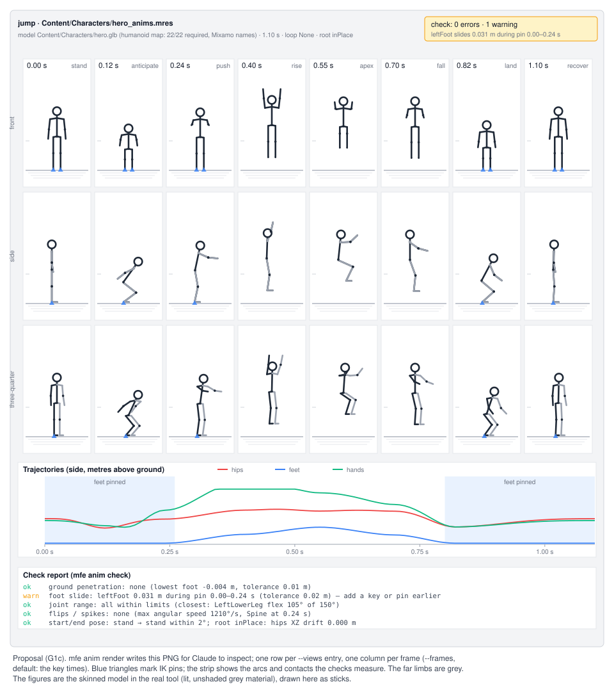
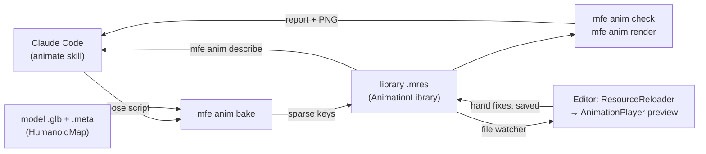
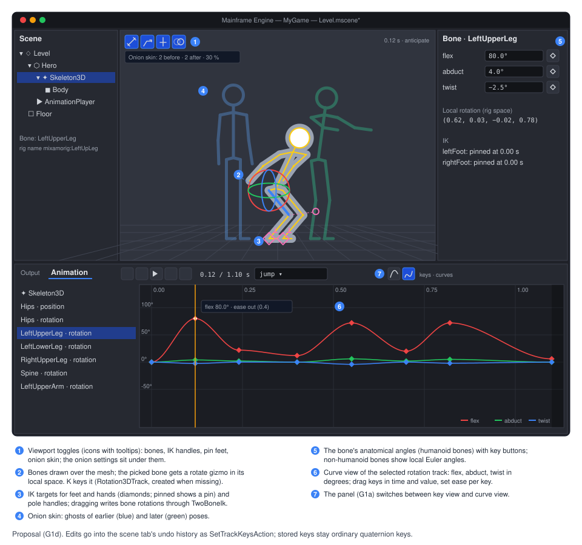

# Proposal: Animation authoring (Claude-made clips, `mfe`, posing tools)

**Milestone:** [Gameplay toolkit](../../milestones.md#gameplay-toolkit-) (G1c authoring, G1d posing tools, G1e root
motion, G1f auto-rigging and non-humanoid rigs) · **Status:** ⬜ planned · **Depends on:**
[Keyframe animation](keyframe-animation.md) (G1a `Animation`/`AnimationPlayer`, G1b `Skeleton3D`/`Skin`/skinning/import),
[Asset pipeline](../asset-pipeline.md) (`.meta` settings), [Editor](../editor.md) · **Related:**
[Editor viewport tools](editor-viewport-tools.md) (G7: Save as `.mres`), [Physics](../physics.md) (`CharacterBody3D`),
[Localization tool](../localization.md) (`mf-l10n`, the CLI pattern)



## Problem

The goal is to tell Claude Code "make me a jump animation" and get a clip that plays on a rigged glTF character inside
the engine, without opening Blender, and to fix by hand in the editor whatever Claude gets wrong.

[Keyframe animation](keyframe-animation.md) (G1a/G1b) gives the data and playback: `Animation` with
`Position3DTrack`/`Rotation3DTrack` bone tracks, `Skeleton3D` (bones as data), `Skin`, compute skinning, imported clips
and an Animation panel. It does not give an agent a way to make a clip:

- **Bone tracks are rig-specific.** A `Rotation3DTrack` holds quaternions in one bone's local space. Mixamo,
  Unreal-style and AI-generated rigs differ in bone names, rest poses (T or A) and local axes, so the same "bend the knee
  60°" is a different quaternion on every rig. Writing those by hand is how an agent gets flipped knees and sliding feet.
- **Nothing measures a clip.** No tool says that a foot went through the floor, a joint bent backwards or a pinned foot
  slid. Claude cannot see the editor, so without numbers or pictures it cannot correct itself.
- **There is no command-line way in.** The engine's tools are `mf-l10n` and `mf-shaders`
  (`Tools/MainframeEngine.L10n`, `Tools/MainframeEngine.ShaderBuild`); the editor's automation is the batch `--qa-script`
  (`MainframeEngine.Editor/Src/Qa/EditorQaScript.cs`). Nothing loads a model, poses it, renders it or writes a clip.
- **The editor does not reload changed files.** `ProjectFileSystem` watches the project
  (`MainframeEngine.Editor/Src/FileSystem/ProjectFileSystem.cs:187-202`) but only rescans the file tree; `ResourceLoader`
  has no reload (`MainframeEngine/Src/Resources/ResourceLoader.cs`: `ClearCache`, `ReleaseTypesOf` only). A clip written
  on disk does not show up in an open scene.
- **The G1a panel edits keys, not poses.** It has no bones in the viewport, no IK, no curves and no onion skin, so
  fixing a character's pose means typing quaternions.
- **Root motion is an open question** ([keyframe animation, open question 3](keyframe-animation.md#open-questions)),
  and a jump either moves the body by physics or by the clip.

## Goals

- **G1c.** Claude Code makes and changes clips on rigged humanoid characters:
  - a **humanoid map** per model (detected from bone names and structure, overridable in `.meta`) that turns
    anatomical joint angles into the rig's bone rotations;
  - a **pose script** (JSON, input only) of key poses in those terms, with IK pins and ballistic arcs, **baked** into
    ordinary sparse `Animation` keys in a library `.mres`;
  - the **`mfe` CLI** (mainframe engine/editor), a general tool whose first command group is `anim`: `rig`, `bake`,
    `describe`, `check`, `render`;
  - the editor **reloads resources changed on disk** and previews a player's clips, so a baked clip plays in the open
    scene;
  - an **`animate` Claude Code skill** that teaches the loop.
- **Keys are the truth.** The baked keys are the only source. A later "make the jump higher" reads the current keys,
  hand fixes included, and edits on top of them; nothing regenerates over a person's work.
- **G1e.** Clips are in place by default; a clip can carry **root motion** that the player extracts and a
  `CharacterBody3D` applies.
- **G1d.** Hand fixing in the editor: **bones in the viewport** with a rotate gizmo, **IK handles** with feet pinning,
  a **curve view** of bone rotations in anatomical angles, and **onion skinning**, all producing ordinary keys.
- **G1f** (sketch). Pose scripts for **non-humanoid rigs** through native bone channels, and **auto-rigging** a static
  humanoid mesh.

## Non-goals

- Text-to-motion models, motion-capture libraries or any new dependency. The baker is geometry: angles, IK, arcs.
- Retargeting imported clips between rigs. The humanoid map is the base for it; see [open questions](#open-questions).
- `AnimationTree`, blend spaces, state machines, layered or additive animation (as in G1a).
- Facial animation and morph targets.
- Driving the editor's UI from `mfe`. `mfe` reads and writes project files; the editor follows the files.

## Design



Engine code lives in `MainframeEngine/Src/Animation/Humanoid/` and `MainframeEngine/Src/Animation/Authoring/`, so the CLI
and the editor share it. The CLI is `Tools/MainframeEngine.Cli/` (`mfe`). Editor code is in
`MainframeEngine.Editor/Src/Animation/` (next to the G1a panel) and `MainframeEngine.Editor/Src/FileSystem/`.

### Canonical humanoid space

Every humanoid pose is written in one space, whatever the rig:

- **Axes:** Y up, +Z forward (the character faces +Z), +X the character's left — glTF's convention. Metres.
- **Reference pose:** the canonical **T-pose**: standing, legs straight down, arms straight out along ±X, palms down.
  All joint angles are relative to it. A rig whose rest is an A-pose is corrected to it by the map (below).
- **Bones** (`HumanoidBone`, VRM 1.0's humanoid set, which most rigs can fill):
  - required: `Hips`, `Spine`, `Chest`, `Neck`, `Head`, and per side `UpperLeg`, `LowerLeg`, `Foot`, `UpperArm`,
    `LowerArm`, `Hand` (`LeftUpperLeg`, `RightHand`, …);
  - optional: `UpperChest`, `Shoulder`, `Toes`, `Jaw`, eyes and the fingers (`LeftIndexProximal`, …). A pose that names
    an optional bone the rig lacks folds it into the parent (an `UpperChest` angle goes to `Chest`) with one note in the
    report.
- **Joint angles** (degrees), per bone, in a joint frame built from the T-pose: the bone's own axis (twist), the
  character's forward axis and the lateral axis.
  - `flex`: rotation in the sagittal plane. Positive is anatomical flexion: hip and shoulder swing forward, knee and
    elbow bend, spine and neck bend forward, ankle points the toes up (dorsiflexion).
  - `abduct`: rotation away from the midline. Positive lifts a leg sideways or an arm up from the T-pose; negative brings
    an arm down towards the body.
  - `twist`: rotation about the bone. Positive is internal (medial) rotation.
  - Angles are **mirrored**: the same numbers mean the same anatomical motion on the left and on the right.
  - Composition: `twist`, then `abduct`, then `flex`, in the joint frame (intrinsic). Hinges (`LowerLeg`, `LowerArm`)
    take `flex` only; other components on a hinge are a check error.
- **Hips** take an offset `x/y/z` (metres, from the rest hips position) and `yaw/pitch/roll` (degrees; `pitch` positive
  leans forward).
- **Range of motion.** `HumanoidLimits` (one table, per bone and component) feeds the checks and clamps the editor's
  sliders. Typical values: hip flex −30…130, knee flex 0…150, ankle flex −50…30, spine flex −30…60 (per spine bone),
  shoulder abduct −90…90 (from the T-pose), elbow flex 0…150. The table is the same for every character in G1c;
  per-character limits (stylised rigs) can come later as a `.meta` setting.
- **Named poses** ship with the engine: `tpose` (all zeros), `rest` (the rig's own rest, converted), and `stand`
  (arms down at the sides: shoulder abduct −80, elbow flex 10; the start pose of most clips). They are data in
  `MainframeEngine/Content/Animation/poses.json`, so the skill and the editor list the same names.

### Humanoid map

```csharp
public enum HumanoidBone : byte { Hips, Spine, Chest, UpperChest, Neck, Head, LeftShoulder, LeftUpperArm, /* … VRM set */ }

public sealed class HumanoidMap                           // immutable: canonical bone → rig bone name
{
    public string? Get(HumanoidBone bone);               // rig bone name, null when unmapped
    public static HumanoidMap Detect(Skeleton3D skeleton, IReadOnlyDictionary<HumanoidBone, string>? overrides,
        out HumanoidMapReport report);                    // report: per bone source (name/structure/override), confidence, unmapped rig bones
}

public sealed class HumanoidRig                            // a map bound to one skeleton's rest pose
{
    public HumanoidRig(Skeleton3D skeleton, HumanoidMap map);
    public HumanoidProportions Proportions { get; }       // hip height, leg/arm length, shoulder width, height (m)
    public RestPoseKind RestKind { get; }                  // TPose, APose, Other (arm angle from horizontal)
    public Quaternion ToBoneRotation(HumanoidBone bone, in JointAngles angles); // canonical → rig-local
    public JointAngles FromBoneRotation(HumanoidBone bone, Quaternion local);   // rig-local → canonical
}
```

- **Detection, step 1 — names.** Bone names are normalised (prefixes such as `mixamorig:` / `mixamorig1:` stripped,
  case and separators folded) and matched against tables: Mixamo (`LeftUpLeg`, `LeftLeg`, `LeftFoot`, `Spine1`, …),
  Unreal-style (`thigh_l`, `calf_l`, `upperarm_l`, …), Blender-style (`thigh.L`, `upper_arm.L`, `DEF-` prefixes) and
  generic sides (`Left`/`L`/`.L`/`_L`/`l_`). Tables for AI generator exports (Meshy, Tripo) are added from sample files
  when [G1.12](#task-list) starts; the structural step covers any naming the tables miss.
- **Detection, step 2 — structure.** From the hips (the bone whose subtree holds both leg chains and the spine), the
  mapper walks the skeleton: two downward three-bone chains are the legs, the upward chain is the spine to the head, two
  sideways chains from the upper spine are the arms. Left and right come from the rest positions (+X is left after
  orienting the skeleton so the toes point to +Z). Each bone records whether it came from a name, the structure or an
  override, with a confidence.
- **Overrides** in the model's `.meta` win over detection:

  ```json
  { "importer": "model",
    "settings": { "scale": 1,
                  "humanoid": { "LeftUpperLeg": "Thigh.L", "LeftLowerLeg": "Shin.L" },
                  "libraries": [ "Content/Characters/hero_anims.mres" ] } }
  ```

  `ModelImportSettings` (`MainframeEngine/Src/Resources/Import/ModelImporter.cs:20-85`) gains `Humanoid` and
  `Libraries`, with cases in `FromMeta` and entries in `ToMetaSettings`; `AssetJsonContext`
  (`MainframeEngine/Src/Resources/AssetDatabase.cs:32-38`) gains `Dictionary<string, string>` and `string[]`. Both
  properties need value equality because the importer's template cache compares settings records
  (`cached.Settings == settings`); the record overrides `Equals`/`GetHashCode` for them.
- **Joint frames.** For each mapped bone, `HumanoidRig` measures the bone's direction in the rest pose (to its mapped
  child, or its rig child for end bones) and builds the frame from it and the character's forward and up. The rotation
  from the rig's rest to the canonical T-pose is part of the frame, which is how an A-pose rig takes the same angles as a
  T-pose rig. The frames are computed once per skeleton.
- **Where it is stored.** Detection runs on demand (in `mfe`, in the editor), never at import: playing clips needs only
  the baked keys. `mfe anim rig --write-meta` writes the detected map into the `.meta` when the user wants it fixed.

### Pose script

A pose script describes one clip as a few key poses. It is **input only**: `mfe anim bake` reads it and writes keys;
the script is not kept by the engine ([open question 1](#open-questions)).

```json
{
  "model": "Content/Characters/hero.glb",
  "library": "Content/Characters/hero_anims.mres",
  "name": "jump",
  "length": 1.1,
  "loop": "None",
  "root": "inPlace",
  "keys": [
    { "t": 0.0,  "pose": "stand", "ik": { "leftFoot": "pin", "rightFoot": "pin" } },
    { "t": 0.12, "ease": "out",
      "hips": { "y": -0.28, "pitch": 28 },
      "joints": { "Spine": { "flex": 8 }, "LeftUpperArm": { "flex": -55 }, "RightUpperArm": { "flex": -55 } } },
    { "t": 0.24, "hips": { "y": 0.02, "pitch": 12 },
      "joints": { "LeftUpperArm": { "flex": 70 }, "RightUpperArm": { "flex": 70 } },
      "ik": { "leftFoot": "release", "rightFoot": "release" } },
    { "t": 0.55, "joints": { "LeftUpperLeg": { "flex": 72 }, "LeftLowerLeg": { "flex": 92 } }, "mirror": true },
    { "t": 0.82, "hips": { "y": -0.25, "pitch": 22 }, "ik": { "leftFoot": "pin", "rightFoot": "pin" } },
    { "t": 1.1,  "pose": "stand" }
  ],
  "arcs": [ { "from": 0.24, "to": 0.82, "height": 0.6 } ]
}
```

- **Keys** are times (`t`, seconds) with any of:
  - `pose`: a named pose as the base of this key (else the previous key's pose);
  - `hips`: offsets and angles (above);
  - `joints`: per canonical bone, any of `flex`/`abduct`/`twist`; unnamed bones and components hold their value from
    the previous key;
  - `mirror: true`: copy this key's left-side joints to the right (and right to left when only right is given);
  - `ik`: per effector (`leftFoot`, `rightFoot`, `leftHand`, `rightHand`): `"pin"` (hold the effector's world position
    from this key until `"release"`), `"release"`, or `{ "pos": [x, y, z] }` (a target in character space, metres;
    `"space": "world"` for world space at the clip's root);
  - `ease`: the key's transition (`"linear"`, `"in"`, `"out"`, `"inOut"`, or a number: Godot's ease curve value, as in
    G1a's `Transitions`).
- **IK.** `TwoBoneIk` (`Animation/Authoring/TwoBoneIk.cs`, shared with the editor's handles) solves upper leg + lower
  leg to the foot target (and upper arm + lower arm to the hand), keeping the knee or elbow in the plane of its pole: the
  rest pose's bend direction, turned with the hips' yaw. The script's own angles for those bones are the starting point;
  IK replaces flex and abduct of the upper bone, flex of the hinge, and keeps the authored twist. The foot's own
  rotation is kept level with the ground while pinned unless the key gives `Foot` angles.
- **Arcs.** `{ from, to, height }` puts the hips on a ballistic parabola between two times: the take-off and landing
  heights come from the poses at `from` and `to`, the apex is `height` above take-off. Without `height`, the apex follows
  the project's 3D gravity (`Physics3D.Gravity` in `project.mfproj`) and the flight time: `g·T²/8`. `check` warns when an
  explicit height disagrees with gravity by more than 25 % (game feel may want it; the warning says so).
- **Root** (G1e):
  - `"inPlace"` (default): the clip never translates the character. Horizontal hips drift and the arcs' vertical
    displacement are removed; key offsets stay (a crouch still lowers the hips). This is the jump for a game whose
    `CharacterBody3D` does the jumping.
  - `"motion"`: arcs and horizontal motion are kept and written as root motion ([below](#g1e-root-motion)).
- **Validation.** The script is parsed with a source-generated `System.Text.Json` context (AOT-safe, like
  `AssetJsonContext`). Errors name the JSON path and the problem (`keys[3].joints.LeftKnee: unknown bone (did you mean
  LeftLowerLeg?)`), exit code 2, nothing written.

### Baking

`PoseBaker` (`Animation/Authoring/PoseBaker.cs`) turns a script into an `Animation`:

1. Resolve each key's full canonical pose (base pose, then the key's values; held values from earlier keys).
2. Evaluate the canonical pose at each key time, apply arcs and root mode, solve IK.
3. Convert to rig space with `HumanoidRig.ToBoneRotation`: one `Rotation3DTrack` per bone that moves, one
   `Position3DTrack` for the hips (`Path` = the skeleton, `Bone` = the rig's hips bone), interpolation `Cubic`, the keys'
   `ease` in the tracks' `Transitions`.
4. **Keys stay sparse**: keys only at the script's key times, so a person can grab them in the panel. Then the baker
   samples the result at 60 Hz and adds keys only where cubic interpolation misses an IK constraint by more than the
   tolerance (a pinned foot sliding more than 1 cm; a target missed by more than 1 cm), refining until it holds or a key
   per sample is reached. A typical jump is 6–10 keys per track.
5. Bones that never move get no track. Quaternions are kept in one hemisphere along each track (no flips).
6. Write: open the library `.mres` (create an `AnimationLibrary` with `ResourceName = ""`, the default library, when
   missing), add or replace the animation by `name`, save with `ResourceSaver`. The first bake into a new library also
   adds it to the model's `.meta` `libraries` (skip with `--no-link`); the importer appends linked libraries to the
   imported model's `AnimationPlayer` ([Linking libraries](#linking-libraries-to-models)).

**This needs two small changes to G1a** ([keyframe-animation.md](keyframe-animation.md#animation-resource) is updated
with them): transform tracks (`Position3DTrack`, `Rotation3DTrack`, `Scale3DTrack`) gain `Transitions` (per key, as
`ValueTrack` has), so eases survive baking and the curve view can edit them; and `Animation` gains
`[Export] string BakedHash` ([Edits](#edits-keys-are-the-truth)).

### Edits: keys are the truth

After a clip is baked, its keys are what the game plays and what the editor edits. To change a clip, Claude reads it and
edits on top:

- **`mfe anim describe`** prints the clip in canonical terms: per key time, the hips offset and angles, every mapped
  bone's `flex/abduct/twist`, the feet's and hands' heights, which effectors touch the ground, and the eases. Keys a
  person added or moved in the editor are just keys; they show up like any other.
- **Edit scripts** start from a clip instead of from nothing:

  ```json
  { "model": "Content/Characters/hero.glb", "library": "Content/Characters/hero_anims.mres",
    "base": "jump", "name": "jump",
    "edits": [
      { "range": [0.24, 0.82], "arc": { "height": "*1.3" } },
      { "t": 0.12, "joints": { "LeftUpperArm": { "flex": "-=10" }, "RightUpperArm": { "flex": "-=10" } } },
      { "t": 0.40, "insert": true, "joints": { "Spine": { "flex": -10 } } } ] }
  ```

  - Values are absolute (`20`), relative (`"+=5"`, `"-=10"`) or scaled (`"*1.3"`).
  - `t` edits the key at that time (within 1 ms); `range` edits every key in it; `insert: true` adds a key (sampled from
    the clip, then edited). Nothing else moves: existing key times, counts and eases are kept, including hand-placed
    keys.
  - `arc` edits rescale the hips' vertical motion between the range's ends (the apex height measured from the clip).
  - IK pins in an edit (`"ik": { "leftFoot": "pin" }`) re-solve the affected keys and may add refinement keys (as when
    baking).
  - `name` may differ from `base` to write a variant (`jump_high`) and keep the original.
- A **full re-bake** (a plain script with the same `name`) replaces the clip, hand fixes included. `mfe anim bake`
  refuses to replace a clip that was changed since it was baked unless `--replace` is given. It knows because the baker
  stores a hash of the keys it wrote in `Animation.BakedHash` (a new `[Export] string`, empty for clips made by hand):
  if the clip's current hash differs, someone edited it. The `animate` skill always edits unless asked for a new clip.

### Checks

`AnimationChecks` (`Animation/Authoring/AnimationChecks.cs`) samples a clip on its rig at 60 Hz (and at every key) and
reports findings with a severity, a time range and a suggested fix. Tolerances have defaults and can be set per run
(`--tolerance footSlide=0.03`).

| Check | What it measures | Default |
|---|---|---|
| Ground | Lowest point of feet, toes, hands, hips below the ground plane (the plane the rest pose's feet stand on) | error below −1 cm |
| Foot slide | Horizontal motion of a pinned effector, and of any foot within 2 cm of the ground with downward speed ≈ 0 (a contact) | warning over 2 cm |
| Range of motion | Each canonical angle against `HumanoidLimits`; non-flex motion on hinges | error over the limit + 5° |
| Flips and spikes | Angular speed per bone; quaternion hemisphere flips between samples | error over 1 500°/s, any flip |
| Loop | For `Linear`/`PingPong` clips, pose and velocity continuity across the wrap | error over 2° / 1 cm |
| Start and end | Distance of the first and last pose from the declared `pose` of the first/last key | warning over 2° |
| Root | `inPlace`: hips XZ drift (warning over 1 cm). `motion`: root path is continuous, root yaw stays within ±180° per second | |
| Physics | An `arcs` height that disagrees with project gravity (above) | warning over 25 % |

`bake` runs the checks after writing. `check` alone exits 0 with no errors, 1 with errors (warnings do not fail).

### The `mfe` CLI

`Tools/MainframeEngine.Cli/` builds `mfe` (`AssemblyName` `mfe`), a general command-line tool for the engine and editor.
It follows `mf-l10n` (`Tools/MainframeEngine.L10n/L10nCli.cs`, `CommandLine.cs`): `Program.cs` is
`return MfeCli.RunConsole(args);`, `MfeCli.Run(args, output, error)` is testable, options are parsed by hand (no CLI
library), unknown options are errors, exit codes are 0 ok, 1 failed checks, 2 usage or input errors. It references the
engine.

- **Shape:** `mfe <group> <command> [args] [options]`. `anim` is the first group; later groups (scenes, rigs, …) are
  added the same way. `mfe help`, `mfe <group> help`.
- **Project:** found by walking up from the working directory to `project.mfproj`, or `--project <dir>`. Content paths
  in arguments and scripts are project-relative and resolved like the engine does (`ContentPaths.Resolve`). The game
  assembly is not loaded (clips need only engine types).
- **Output:** readable text by default; `--json` prints one JSON document (the same data), for scripts.
- **Running it:** `just mfe anim rig Content/Characters/hero.glb` (a recipe over
  `dotnet run --project Tools/MainframeEngine.Cli -c Release --`, like `l10n`). Game projects created by `dotnet new
  mfgame` have no justfile; they run `dotnet run --project <engine>/Tools/MainframeEngine.Cli --` against their
  `--engine-path` checkout (the skill gives the command).

| Command | Does |
|---|---|
| `mfe anim rig <model> [--write-meta]` | Loads the model (the importer, in memory), prints the bone tree, the humanoid map with each bone's source and confidence, unmapped bones, rest kind (T/A, arm angle) and proportions. `--write-meta` stores the map in the `.meta`. |
| `mfe anim poses` | Lists the named poses and the canonical bones, components and limits (the skill's reference, always current). |
| `mfe anim bake <script.json> [--replace] [--no-link]` | Bakes a pose or edit script into its library, then runs the checks. Prints the tracks and key counts written. |
| `mfe anim describe <library> <name> --model <m>` | Prints the clip's keys in canonical terms (above). `--times 0.2,0.4` samples arbitrary times instead. |
| `mfe anim check <library> <name> --model <m>` | Runs the checks; exit 1 on errors. |
| `mfe anim render <library> <name> --model <m> -o <png>` | Renders the contact sheet. `--frames 8` (default: the key times, at most 12), `--views front,side,threequarter`, `--size 1600`. `--frame 0.55` renders one large frame. |
| `mfe anim list <library>` | Lists the library's animations with length, loop and key counts. |

### Contact sheet rendering

`mfe anim render` writes the picture at the top of this page: a header (clip, model, map, length, loop, root, the check
summary), one row per view and one column per frame (time and key name), the model on a ground grid with IK pins marked,
a trajectory strip (hips, feet and hands heights over time, contact and pin bands) and the check report.

- It runs a small `Engine` subclass (`ContactSheetRenderer`, in the CLI) with a hidden window and
  `EnableFrameCapture`, as the render-test host does (`Tests/MainframeEngine.RenderTests/Scenes/RenderTestGame.cs`). The
  model is instanced once per cell into a `SubViewport` each (front, side and three-quarter orthographic cameras framed
  from the proportions); each viewport is captured with `SubViewport.CaptureImage`
  (`MainframeEngine/Src/Scene/SubViewport.cs:73`), the player posed with `Seek(t, update: true)` in `Manual` mode.
- The trails, grid, labels and report are drawn on the CPU into the final RGBA image (lines and the engine's
  `GlyphRasterizer` text), then written with `Png.WriteRgba8` (`MainframeEngine/Src/Imaging/Png.cs`).
- Material: the model's own materials by default; `--flat` uses one unlit grey so the silhouette reads.
- Needs a GPU and a display (macOS: awake, as `just qa`). With no display it fails with a clear message, and `describe`
  plus `check` still give Claude numbers ([open question 6](#open-questions)).

### Linking libraries to models

A baked library has to reach the character's `AnimationPlayer`. The importer gives every animated model an
`AnimationPlayer` child with an inline library of its imported clips (G1b). The `.meta` `libraries` list (above) makes
the importer append those external `AnimationLibrary` resources to that player's `Libraries`, after the imported one.
Every instance of the model gets them; no scene is edited. A baked clip in the default library plays as
`Play("jump")`; imported clips keep their library prefix (`imported/run`).

### Editor live loop (G1c)

- **`ResourceReloader`** (new, `MainframeEngine.Editor/Src/FileSystem/ResourceReloader.cs`). `ProjectFileSystem`'s
  watcher already reports changes; the reloader gets the changed paths (the watcher callback gains them) and, on the
  main thread:
  - for a `.mres` that `ResourceLoader` has cached and no editor tab has unsaved edits to, it **reloads in place**: it
    loads the file fresh (bypassing the cache), copies the exported property values into the cached instance through the
    type registry, and calls `NotifyChanged` where the type has it (`Animation` bumps `Version`, so players re-bind on
    their next evaluation). References in open scenes stay valid. Writes the editor itself makes (saves) are ignored by
    path and modification time.
  - when an open resource tab (`EditedResource`) has unsaved edits to the file, it shows a non-blocking notice with two
    icon buttons, "Keep mine" and "Load from disk".
  - for a model whose `.meta` changed (a newly linked library), clean scenes that instance the model are reopened (the
    path code reload uses); dirty ones get a notice.
  - `ResourceLoader` gains `internal Resource? GetCached(string path)` and `ReloadInPlace(string path)` for this.
  This is general: any `.mres` edited outside the editor (by a person, a script or `mfe`) shows up.
- **Player preview** before the G1a panel exists: the `AnimationPlayer` inspector gets a clip dropdown and icon buttons
  (play, stop, loop) with tooltips. Preview uses the panel's capture and restore
  ([keyframe animation → Preview](keyframe-animation.md#editor-the-animation-panel)): the `AnimationEditor` `[Tool]`
  node advances the player with `Advance(delta)` in edit mode, and the scene is restored when preview stops or the scene
  saves. A reloaded clip that is previewing restarts from its current time. When the panel lands (G1.6) the inspector
  keeps the dropdown and the panel takes over.

### Claude Code skill

`.claude/skills/animate/SKILL.md` in the engine repo, and the same file in the `mfgame` template
(`Templates/MainframeEngine.Templates/content/mfgame/.claude/skills/animate/`), so game projects have it:

- **Workflow:** `mfe anim rig` (once per model; report mapping problems instead of guessing) → write the script in the
  session's scratch space → `bake` → read the checks → `render` and look at the sheet → fix and repeat (at most five
  rounds, then report what is still off) → tell the user the clip name and how to play it.
- **Changing a clip:** always `describe` first, then an edit script; never re-bake over a clip the user may have
  touched (the `--replace` guard enforces it).
- **Reference:** the axes, the angle conventions and mirroring, the hips fields, IK pins, arcs, root modes, eases, and
  `mfe anim poses` for the bone list and limits.
- **Motion notes:** anticipation before a jump (0.1–0.25 s crouch), arms swing back then up on take-off, a tuck at the
  apex, knees bend on landing (absorb over 0.1–0.2 s), overlap (the spine and arms lag the hips by a frame or two),
  arcs, and that a clip for a physics-driven jump uses `root: inPlace`.
- `CLAUDE.md` gains one line pointing at the skill and `mfe`.

### G1e: root motion

- **`AnimationPlayer`** gains `[Export] NodePath RootMotionTrack` (the skeleton) and `[Export] string RootMotionBone`
  (Godot's `root_motion_track`), plus `[Export] bool RootMotionVertical` (default false). Each update the player
  evaluates that bone's position and yaw, applies the pose **without** that motion (horizontal position and yaw, plus
  vertical when `RootMotionVertical`), and accumulates the difference since the last update into
  `GetRootMotionPosition()` and `GetRootMotionRotation()` (character space, consumed per update). Loop wraps add the
  clip's full displacement, so a looping walk keeps walking. Crossfades blend the two clips' deltas by weight.
- **Which bone.** Rigs with a bone above the hips (Unreal-style `root`) use it; Mixamo-style rigs, whose hips are the top
  bone, use the hips. The baker in `root: "motion"` writes the trajectory into that bone and the rest of the hips motion
  below it.
- **`CharacterBody3D`** (`MainframeEngine/Src/Physics/3D/CharacterBody3D.cs`) keeps its API: `MoveAndSlide()` reads
  `Velocity`. A convenience `ApplyRootMotion(AnimationPlayer player)` sets `Velocity` from the player's position delta (rotated
  to the body's basis, times `PhysicsTicksPerSecond`) and turns the body by the yaw delta; the game calls it before
  `MoveAndSlide()`.
  The player must run in `Physics` callback mode (a node warning says so when `RootMotionTrack` is set).
- This resolves [keyframe animation, open question 3](keyframe-animation.md#open-questions).

### G1d: character animation editing

These build on the G1a Animation panel ([G1.5/G1.6](keyframe-animation.md#task-list)) and edit ordinary keys, so the
hand fixes are what `mfe anim describe` reads later.



- **Bones in the viewport.** When a `Skeleton3D` (or a node under it) is selected, or the panel edits a player whose
  tracks target one, the 3D view draws its bones over the mesh (octahedral bones through `DebugLines`, the selected one
  highlighted). Click picks a bone (screen-space distance to the bone segments; no ID pass). The rotate gizmo works in
  the bone's local space; dragging previews, release commits. `K` keys the selected bones at the playhead
  (`Rotation3DTrack`, created when missing; the hips also get `Position3DTrack`). The inspector shows the bone's
  anatomical angles (humanoid bones) or local Euler angles, each with a key button. Undo is G1a's `SetTrackKeysAction`
  per track, merged per drag.
- **IK handles.** Diamonds at the feet and hands, and pole handles for knees and elbows (humanoid rigs; non-humanoid
  rigs get handles for chains declared in G1f's rig profile). Dragging one runs `TwoBoneIk` and writes the limb's bone
  rotations; keying stores those rotations, so tracks stay ordinary. **Pin feet** (a toggle) keeps both feet at their
  world positions while the hips or spine are posed, re-solving the legs every drag.
- **Curve view.** The panel's curve view shows the selected rotation track as three curves: `flex`, `abduct`, `twist`
  for humanoid bones (`HumanoidRig.FromBoneRotation` per sample), local Euler X/Y/Z for other bones. Position and scale
  tracks show their components. Keys can be dragged in time and value (value edits convert back with
  `ToBoneRotation`) and get an ease per key (`Transitions`). Bezier handles on rotation tracks are not in v1
  ([open question 4](#open-questions)).
- **Onion skinning.** A viewport toggle with settings for frames before and after (0–4 each), spacing (keys, or every
  N frames) and opacity. Ghosts are extra skinned draws of the selected skeleton's meshes with a translucent unlit
  material (earlier poses blue, later green). Their joint palettes come from evaluating the clip at the ghost times into
  scratch pose buffers, through the same skinning pass. Editor-only; the buffers are reused, so dragging the playhead
  does not allocate.
- **Icons** (to `MainframeEngine.Editor/Content/icons/icons.txt`): `bone` exists and G1a adds `pin` and
  `vector-bezier`; add `ik-handle` and `onion`. Every button is an icon with a tooltip.

### G1f: non-humanoid rigs and auto-rigging (sketch)

Designed in outline here; each gets its own detailed design when it starts.

- **Native bone channels.** Pose scripts gain `bones`: per rig bone name, `rot` (local Euler degrees, or
  `{ "axis": "parent"|"world", … }`) and `pos`. They work on any skeleton, humanoid or not, and mix with `joints`.
- **Rig profiles** in the `.meta` (`rig`): named IK chains (`{ "name": "frontLeftLeg", "bones": ["fl_upper",
  "fl_lower"], "pole": [0, 0, 1] }`), a ground contact list and optional limits. `ik` keys accept chain names; checks
  run the generic subset (ground, slide, flips, loop, root); the editor's IK handles come from the chains.
- **Auto-rigging (`mfe rig auto <mesh>`).** For a static humanoid mesh in a T- or A-pose: fit the canonical skeleton to
  landmarks found from horizontal and vertical cross-sections (crotch, armpits, neck, wrists, knees from the leg
  profile), then compute skin weights by bone heat diffusion (Baran & Popović 2007, Blender's "automatic weights").
  Output is the open question: a rigged `.glb` needs a glTF writer ([open question 5](#open-questions)). A weight-paint
  tool in the editor would follow it.

## Testing

- **Unit (`Tests/MainframeEngine.Tests/Animation/Humanoid/`, `…/Authoring/`):**
  - `HumanoidMap.Detect` on synthetic skeletons with Mixamo (`mixamorig:` prefix), Unreal and Blender names, generic
    names, and unnamed bones (structure only); T-pose and A-pose rests; overrides win; reports list unmapped bones.
  - `HumanoidRig` round trips (angles → rotation → angles) for every bone on T and A rests; mirroring gives mirrored
    rotations; hinge components.
  - `TwoBoneIk`: reachable, unreachable (straightens towards the target), pole plane, zero-length guard.
  - `PoseBaker`: held values, named poses, mirror, eases into `Transitions`, sparse keys at script times, refinement keys
    only where a pin slides, `inPlace` versus `motion`, quaternion hemisphere continuity, library create/replace and
    `.meta` linking.
  - Edits: absolute, relative and scaled values; `range`; `insert`; key times, counts and eases of untouched keys are
    unchanged (a hand-added key survives); `--replace` guard via `BakedHash`.
  - `AnimationChecks`: one crafted clip per check that triggers it, and one clean clip that passes all.
  - Root motion: accumulated deltas over a non-looping and a looping clip, crossfade weighting, vertical flag.
  - Script parsing: errors carry JSON paths and suggestions.
- **CLI (`Tests/MainframeEngine.Tests/Cli/`):** `MfeCli.Run` with captured output, as `L10nCliTests` does
  (`Tests/MainframeEngine.Tests/Localization/L10nCliTests.cs`): `rig`, `bake`, `describe`, `check`, `list`, `--json`
  shapes, exit codes, project discovery.
- **Editor (`Tests/MainframeEngine.Editor.Tests/FileSystem/`, `…/Animation/`):** `ResourceReloader` (clean reload keeps
  references and bumps `Version`, own saves ignored, conflict notice, model `.meta` change reopens a clean scene); the
  inspector preview captures and restores; bone picking, gizmo keying, IK handle solve, curve-view value round trip,
  onion settings (G1d).
- **Render tests:** a `humanoid_pose` golden: the test character baked from a fixed script, posed at one time, with a
  shadow (`moltenvk` and `lavapipe`). A smoke run of `mfe anim render` in `just test-render` (the PNG exists, has the
  expected size, cells are not blank). The allocation gate covers root-motion extraction in a running player.
- **Test assets:** a CC0 rigged humanoid glTF (from Quaternius or Kenney; picked and licence-checked in G1.12) in
  `Tests/Content/Models/`, plus G1b's generated skinned test model. Mixamo and AI-generator naming is tested with
  synthetic skeletons only (their models are not redistributable).
- **QA (`Tests/QA/animation-authoring.qa`):** open a scene with the test character, run `mfe anim bake` from the script
  (`edit-file` writes the library), wait for the reload, preview the clip, capture a screenshot for `docs/images`.

## Acceptance

- In a game project with a rigged Mixamo-named or CC0 character, asking Claude Code "make me a jump animation" (with the
  `animate` skill) produces a clip that bakes, passes `mfe anim check`, renders a contact sheet Claude looks at, appears
  and previews in the open editor without a restart, and plays in game with `Play("jump")`.
- The same clip with `root: "motion"` moves a `CharacterBody3D` through `ApplyRootMotion` and lands where the clip says.
- After a person moves a key in the editor and saves, "make the jump higher" keeps that key (time and value outside the
  edited range) and raises the arc.
- (G1d) A person poses a leg with the rotate gizmo and with the foot IK handle, keys it, adjusts the ease in the curve
  view and checks the arc with onion skin; every action is undoable and saving writes ordinary keys.
- Per-frame engine code added here (root motion) allocates nothing and passes the validation gate.
- Docs updated when this ships: a current-state `docs/design/animation-authoring.md` (or a section of the
  `animation.md` G1a creates); `asset-pipeline.md` (`humanoid`, `libraries` in `.meta`); `editor.md` (resource reload,
  player preview, bone posing, IK, curves, onion); `physics.md` (root motion); `CLAUDE.md` (`mfe`, the skill, project
  structure).

## Task list

Order: G1a core (G1.1–G1.4) → G1b (G1.8–G1.10) → **G1c + G1e** (G1.12–G1.20) → G1a panel (G1.5–G1.6) → **G1d**
(G1.21–G1.24) → G1f (G1.25–G1.26). G1.7 and G1.11 fit wherever convenient.

**G1c**

12. **G1.12 Humanoid map.** `HumanoidBone`, `HumanoidMap.Detect` (name tables, structure), `HumanoidRig` (joint frames,
    rest correction, proportions, round trips), `HumanoidLimits`, named poses, `.meta` `humanoid`; test asset; unit tests.
13. **G1.13 Pose script and baker.** Script model and JSON context, `TwoBoneIk`, arcs, root modes, `PoseBaker` with
    sparse and refinement keys, library writing and `.meta` `libraries`; transform-track `Transitions` and
    `Animation.BakedHash` (G1a changes);
    importer appends linked libraries; unit tests.
14. **G1.14 Describe and edits.** Canonical description, edit scripts (absolute, relative, scaled, range, insert,
    arc), `BakedHash` guard; unit tests.
15. **G1.15 Checks.** `AnimationChecks` with every check in the table, tolerances, report model; unit tests.
16. **G1.16 `mfe`.** `Tools/MainframeEngine.Cli`, `MfeCli`, `CommandLine`, project discovery, `anim
    rig/poses/bake/describe/check/list`, `--json`, `just mfe`; add to `MainframeEngine.slnx`; CLI tests.
17. **G1.17 Contact sheet.** `mfe anim render`: hidden-window renderer, per-cell sub-viewports and cameras, trails,
    labels, report, `--flat`, `--frame`; render smoke test.
18. **G1.18 Editor reload and preview.** `ResourceReloader`, `ResourceLoader.GetCached/ReloadInPlace`, watcher paths,
    conflict notice, model `.meta` reopen; `AnimationPlayer` inspector preview; editor tests; QA script.
19. **G1.19 Skill and docs.** `.claude/skills/animate/SKILL.md` (engine and template), `CLAUDE.md`, current-state doc,
    `asset-pipeline.md`; an end-to-end run on the CC0 character recorded in the PR.

**G1e**

20. **G1.20 Root motion.** `RootMotionTrack`/`RootMotionBone`/`RootMotionVertical`, extraction and accumulation, loop
    wrap, crossfade, `CharacterBody3D.ApplyRootMotion`, node warning, baker `motion`; unit tests, allocation gate;
    `physics.md`; a Demo jump with root motion.

**G1d** (after G1.5/G1.6)

21. **G1.21 Bones in the viewport.** Bone overlay, picking, local rotate gizmo, `K`, inspector angles with key buttons,
    undo.
22. **G1.22 IK handles.** Effector and pole handles, `TwoBoneIk` drags, pin feet.
23. **G1.23 Curve view.** Rotation tracks as anatomical/Euler curves, position/scale components, key drags, ease per
    key.
24. **G1.24 Onion skinning.** Ghost draws, palettes at offset times, settings, icons; editor tests; `editor.md`.

**G1f**

25. **G1.25 Non-humanoid rigs.** `bones` channels, `.meta` rig profiles, chain IK in scripts and the editor, generic
    checks.
26. **G1.26 Auto-rigging.** After [open question 5](#open-questions) is decided: landmark fitting, heat-diffusion
    weights, output.

## Open questions

1. **Keep the pose script?** Ephemeral by default (keys are the truth). Saving it next to the clip (`jump.pose.json`)
   would document how a clip was made, but it goes stale as soon as someone edits keys; `BakedHash` already tells
   whether a clip was touched.
2. **`mfe` as the one tool.** Should `mf-l10n` and `mf-shaders` become `mfe l10n …` and `mfe shaders …`? It would give
   one entry point; it touches the justfile, `build/Localization.targets` and CI.
3. **Retargeting.** The humanoid map makes "play this Mixamo clip on that rig" a conversion through canonical angles
   (`describe` then bake on another model). Worth a command (`mfe anim retarget`) once two rigs exist in a project.
4. **Bezier handles on rotation tracks.** The curve view edits values, times and eases. Full handles need a new track
   form (per-component curves or handles on quaternion keys) and a G1a format change.
5. **Auto-rig output.** A rigged `.glb` needs a glTF writer: hand-written (glTF JSON + a binary buffer is small) or
   SharpGLTF (MIT; a new dependency, discuss first). The alternative is an engine-side rig that the importer applies
   from the `.meta` (skeleton plus weights stored next to the mesh), which avoids writing glTF but keeps the rig out of
   other tools.
6. **Rendering without a display.** `mfe anim render` needs a window today (no window-less Vulkan path). A true
   offscreen path would let CI and remote sessions render sheets.
7. **Physics-aware checks.** Centre of mass over the support polygon during contacts (balance) would catch poses that
   look wrong; it needs per-bone mass estimates from the mesh.

## Related

[Keyframe animation](keyframe-animation.md) · [Asset pipeline](../asset-pipeline.md) · [Editor](../editor.md) ·
[Physics](../physics.md) · [Editor viewport tools](editor-viewport-tools.md) · [Localization](../localization.md) ·
[Testing](../testing.md)
