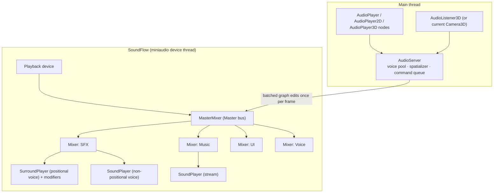

# Proposal: Audio (SoundFlow)

**Milestone:** M7 · **Status:** ⬜ planned · **Decision:** SoundFlow (agreed 2026-10-05) ·
**Depends on:** [Node system](../scene-graph-and-nodes.md)

## Library

| | |
|---|---|
| Package | [`SoundFlow`](https://www.nuget.org/packages/SoundFlow) **1.4.1** (pin) |
| Repo | [LSXPrime/SoundFlow](https://github.com/LSXPrime/SoundFlow) |
| License | MIT. No fees, no logo requirement. |
| Backend | miniaudio through SoundFlow's own C shim (device, decoder, encoder only) |
| Natives | shipped **inside the package** for win-x64/x86/arm64, linux-x64/arm/arm64, **osx-x64, osx-arm64**, and more |
| Decoding | WAV, MP3, FLAC built in. **OGG/Opus need extra work** (see [Formats](#formats)). |
| Mixing | `Mixer` components that nest as buses; `MasterMixer` per playback device |
| Effects | `SoundModifier`s: reverb, delay, chorus, compressor, parametric EQ, low/high-pass, and more |
| Positional audio | **`SurroundPlayer`**: the source's channels are virtual speakers on a 2D plane, and a `Vector2 ListenerPosition` moves among them. Panning is `Vbap`, `EqualPower` or `Linear`, with built-in `1/(1 + RolloffFactor·d)` attenuation and stereo/quad/5.1/7.1 output. ([docs](https://lsxprime.github.io/soundflow-docs/), `Src/Components/SurroundPlayer.cs`) |
| Not in SoundFlow | elevation (the panner is 2D), listener orientation, a world emitter/listener model, custom falloff curves, doppler |

SoundFlow gives us a solid playback, mixing and effects graph, plus object-based panning through
`SurroundPlayer`. **The engine uses `SurroundPlayer` as its panner.** It adds the game-side pieces:
- mapping world-space emitters and an oriented listener onto SoundFlow's 2D listener plane;
- Godot-style attenuation curves;
- smoothing and voice management.

See [Spatialization](#spatialization).

## Goals

- Godot-style audio nodes: non-positional, 2D and 3D players, plus a listener.
- Buses (Master → Music, SFX, UI, Voice) with volume, mute and effects, editable in project settings.
- Short sounds decoded to memory; music streamed from disk.
- Distance attenuation, panning (stereo through 7.1, via SoundFlow `SurroundPlayer`) and optional
  low-pass for 3D sounds, smoothed so there is no zipper noise.
- Voice pooling and polyphony limits, so one-shots are cheap.
- Pause follows `SceneTree.Paused` and `ProcessMode`.

## Non-goals (v1)

HRTF, occlusion raycasts, reverb zones, adaptive music system, FMOD-style authoring tool.

## Architecture



- **`AudioServer`** (engine-owned, one per process) creates the `MiniAudioEngine`, initializes the
  default playback device and builds the bus tree from project settings. It also follows device
  changes, such as headphones being plugged in.
- **Buses** are nested SoundFlow `Mixer`s. Each bus has volume (dB), mute, solo and an effect chain
  (`SoundModifier`s). The layout is saved in `project.mfproj` and edited in the [editor](editor.md)'s
  Audio panel.
- **Threading:**
  - SoundFlow mixes on miniaudio's device thread, and graph edits take a lock.
  - Nodes never touch SoundFlow directly. They enqueue commands (play, stop, set volume or pan), and
    `AudioServer.Flush()` applies them in one batch per frame, after `OnProcess`.

## Nodes

| Node | Positional | Key properties |
|---|---|---|
| `AudioPlayer` | no | `Stream`, `Bus`, `VolumeDb`, `PitchScale`, `Autoplay`, `Loop`, `MaxPolyphony` |
| `AudioPlayer2D` | 2D | + `MaxDistance`, `Attenuation` (curve exponent), `PanningStrength` |
| `AudioPlayer3D` | 3D | + `UnitSize`, `MaxDistance`, `AttenuationModel` (Inverse, InverseSquare, Logarithmic, Disabled), `PanningStrength`, `LowPassAtMaxDistance` |
| `AudioListener3D` | — | `Current`. If none is current, the active `Camera3D` is the listener. |

Signals: `Finished`. Methods: `Play(fromSeconds)`, `Stop()`, `Seek()`, `GetPlaybackPosition()`.

## Streams and resources

| Resource | Import option | SoundFlow provider |
|---|---|---|
| `AudioStream` (wav/mp3/flac/ogg) | **Load mode: Memory** (default for files under 1 MB) | decoded once, shared samples → `AssetDataProvider` per voice |
| | **Load mode: Stream** (default for music) | `StreamDataProvider` over a file stream, one per playing instance |

The import settings live in the asset's `.meta` sidecar ([Scene serialization](../scene-serialization.md#uids-and-the-asset-database)):
load mode, loop and loop points, default bus.

### Formats

- WAV, MP3 and FLAC: native.
- **OGG Vorbis (open decision):**

  | Option | Pros | Cons |
  |---|---|---|
  | `SoundFlow.Codecs.FFMpeg` 1.4.0 | official, also gives Opus/AAC | **LGPL v2.1+**, large FFmpeg natives per platform |
  | **NVorbis** (managed, MIT) behind a custom `ISoundDataProvider` | small, pure C#, no natives | new dependency; Vorbis only |

  **Recommendation:** NVorbis. It needs sign-off as a new dependency, per CLAUDE.md.

## Spatialization

Positional voices are SoundFlow **`SurroundPlayer`s**. Each one is configured with a custom
`SurroundConfiguration` that holds **one virtual speaker at the origin**: the emitter, with mono
sources downmixed. Moving the `ListenerPosition` relative to that speaker places the sound in the
output field. SoundFlow's VBAP then distributes it across the device's real channels (stereo, quad,
5.1 or 7.1), so multichannel output works without extra engine code.

Run once per frame for each playing positional voice, after transforms are synced:

```
rel      = listener.GlobalTransform.Inverse() · emitter.GlobalPosition   // listener space, looks down −Z
flat     = (rel.x, -rel.z)                         // project onto SoundFlow's 2D plane (front = +y)
d        = |rel|                                   // full 3D distance
gain     = attenuation(d)                          // engine curve: Inverse / InverseSquare / Logarithmic / Disabled
player.ListenerPosition  = -normalize(flat) · panRadius · PanningStrength   // direction only
player.VbapParameters.RolloffFactor = 0            // SoundFlow rolloff off; the engine curve applies via Volume
player.Volume = busGain · nodeVolume · gain
cutoff   = lerp(20 kHz, LowPassAtMaxDistance, d / MaxDistance)            // optional LowPass modifier
```

- **Why the engine still owns attenuation:** SoundFlow's rolloff is a fixed `1/(1 + k·d)` law in the
  plane. Godot-style `UnitSize`/`MaxDistance` curves need true 3D distance. Setting
  `RolloffFactor = 0` keeps SoundFlow doing pure panning while the engine sets gain through `Volume`.
  For quick prototypes, the built-in rolloff can be used instead (`AttenuationModel = SoundFlowRolloff`).
- **Listener orientation and elevation:** SoundFlow's listener has no rotation, so the engine
  transforms the emitter into listener space first. Elevation is dropped by the projection. That's
  fine for stereo and horizontal surround; HRTF/elevation is a non-goal.
- **Smoothing:** a small `SpatialSmoother` `SoundModifier` placed after each positional player ramps
  volume and cutoff over about 10 ms, which avoids zipper noise. **To verify during implementation:**
  - whether `SurroundPlayer` interpolates its panning factors when `ListenerPosition` changes. If it
    doesn't, quantize position updates and rely on the volume ramp.
  - its recalculation allocates `float[]` arrays on the audio thread each time the position is
    dirtied. If profiling shows GC pressure, update positions at 30 Hz or contribute a non-allocating
    path upstream.
- **2D (`AudioPlayer2D`):** the same pipeline, with `flat` = the screen-space offset from the 2D
  listener (the active `Camera2D`) scaled by pixels-per-metre. No low-pass by default.
- **Non-positional voices** (`AudioPlayer`, UI, music) use a plain `SoundPlayer` with `Pan` and `Volume`.
- **Doppler:** later. It would come from listener and emitter velocity via resampling. SoundFlow's
  `PlaybackSpeed` uses WSOLA time-stretch, which is not a pitch shift.

## Voice management

- `AudioServer` keeps a pool of `SoundPlayer`s per bus, created up front (default 32 SFX, 4 music,
  8 UI, 8 voice). This avoids graph churn when one-shots fire.
- `MaxPolyphony` per node: when exceeded, steal the oldest voice of that node.
- A global limit: when all voices are busy, steal the quietest (by current gain × priority).
- `AudioServer.PlayOneShot(stream, position, bus)` fires and forgets without a node.

## Pause and process mode

When `SceneTree.Paused` is set, voices from `Pausable` nodes pause, and `Always`/`WhenPaused` voices
(for example menu UI sounds) keep playing. Pausing is a SoundFlow `Pause()` per voice, applied in the
batched flush.

## Editor integration

- Inspector preview button (plays on an editor bus). Edit mode never autoplays.
- 3D range gizmo: wire spheres at `UnitSize` and `MaxDistance`.
- An Audio panel for buses: faders, mute and solo, effect chain editor, VU meters (via SoundFlow
  analyzers).

## Sandbox / test plan

- Footstep one-shots triggered from Spine animation events on the spineboy walk cycle.
- Looping streamed music on the Music bus, with a volume slider in the HUD (RmlUi).
- A 3D emitter orbiting the camera to verify attenuation and panning.

## Task list

- [ ] Add `SoundFlow` 1.4.1 (pinned)
- [ ] `AudioServer`: engine and device init, bus tree from project settings, device-change handling
- [ ] Command queue + per-frame flush
- [ ] `AudioStream` resource + import settings (memory vs stream)
- [ ] `AudioPlayer`, `AudioPlayer2D`, `AudioPlayer3D`, `AudioListener3D`
- [ ] Spatializer on `SurroundPlayer` (one-speaker config, listener-space projection, engine attenuation) + `SpatialSmoother`
- [ ] Voice pool + polyphony and stealing
- [ ] OGG support (decision: NVorbis vs FFmpeg codec)
- [ ] Pause and process-mode handling
- [ ] Editor preview, range gizmo, bus panel
- [ ] ADR in `memory/decisions/` (SoundFlow choice; OGG choice)

## Risks

| Risk | Mitigation |
|---|---|
| SoundFlow has one maintainer and has been quiet since 2026-05 | keep all SoundFlow calls inside `AudioServer`; the API surface we use is small (device, mixer, player, providers, modifiers) |
| `SurroundPlayer` is a 2D panner with no listener orientation | engine projects into listener space; attenuation curves stay engine-side |
| `SurroundPlayer` allocates on panning recalculation | throttle position updates; profile; upstream fix if needed |
| Graph-edit lock contention | batched flush once per frame; pooled players |
| LGPL if FFmpeg is chosen for OGG | prefer NVorbis |

## Related

[Milestones](../../milestones.md) · [Node system](../scene-graph-and-nodes.md) · [Game UI](game-ui.md) · [Editor](editor.md)
