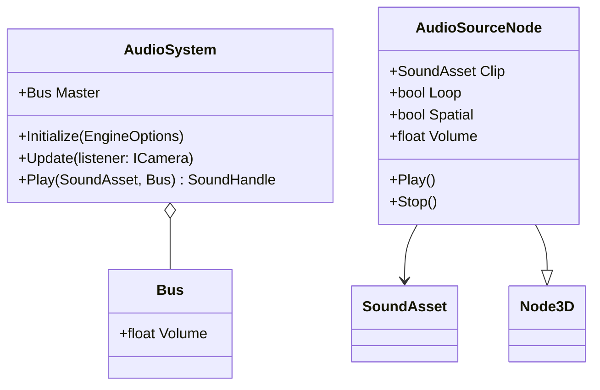

# Proposal: Audio

**Milestone:** M6 · **Status:** ⬜ planned · **Needs:** dependency decision

## Problem

The engine has no audio. The README lists candidate libraries (FmodAudio, SoundFlow), but none is
integrated.

## Goals

- Play one-shot and looping sounds, with 2D and 3D spatialization tied to `Node3D` and the active camera.
- Music streaming with crossfade.
- Bus/mixer: Master, Music, SFX, UI, with volume in ImGui.
- Same behaviour on Windows, Linux, macOS x64 and macOS arm64.

## Dependency decision (to discuss)

| Option | Pros | Cons |
|---|---|---|
| FMOD (FmodAudio binding) | Industry standard, authoring tool, great 3D | Proprietary licence; native libraries per platform |
| SoundFlow | Pure .NET, MIT | Younger; feature set to verify |
| Silk.NET.OpenAL + decoders | Already in the Silk family | More engine code (mixing, streaming) |

Per CLAUDE.md, no package is added until this is decided. Record the outcome as an ADR in
`memory/decisions/`.

## Proposed design

`Engine` owns `AudioSystem`. In `OnUpdate` it sets the listener from the active camera and updates the
3D positions of playing sources.

## Task list

- [ ] Decide on the library (ADR)
- [ ] `AudioSystem` lifecycle in `Engine` (init / update / dispose)
- [ ] `SoundAsset` loading (wav/ogg) + streaming
- [ ] `AudioSourceNode` with 3D attenuation
- [ ] Buses + ImGui mixer panel
- [ ] Sandbox: footstep sound synced to the Spine walk animation (Spine events)

## Related

[Milestones](../../milestones.md) · [Scene graph v2](scene-graph-v2.md)
