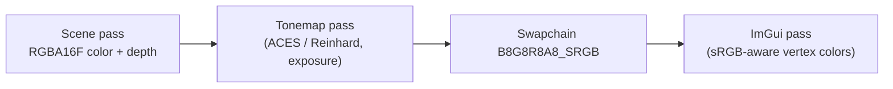

# Proposal: Color Pipeline

**Milestone:** M3 · **Status:** ⬜ planned · **Touches:** swapchain, texture formats, lit shaders, Spine blending

## Problem

The swapchain is UNORM, lighting runs on gamma-encoded values, sky textures are sRGB (so they come
out darker), Spine/ImGui textures are UNORM, and Spine premultiplied alpha is applied twice. See
[Coordinate conventions → color space](../coordinate-conventions.md#color-space).

## Goals

- Linear-space lighting with correct sRGB encode on output.
- An HDR intermediate target with a tonemap pass, so `SunIntensity = 20` stops clipping.
- Consistent texture formats: color data sRGB, data textures UNORM.
- Correct premultiplied-alpha blending for Spine.

## Proposed design

| Asset | Format |
|---|---|
| Albedo, sky, Spine atlas | `R8G8B8A8_SRGB` |
| Normal / data maps | `R8G8B8A8_UNORM` |
| Scene target | `R16G16B16A16_SFLOAT` |
| Swapchain | `B8G8R8A8_SRGB` (fall back to UNORM + manual encode) |

- **Spine PMA:** when `pma` is set, use `One / OneMinusSrcAlpha` and leave vertex RGB unmultiplied, or
  keep the multiply and switch the blend. Pick one consistently.
- **ImGui:** convert style colors to linear, or render ImGui after tonemapping into a UNORM view of the
  swapchain image (`MutableFormat`).

## Task list

- [ ] Offscreen HDR target + tonemap fullscreen pass (exposure in ImGui)
- [ ] sRGB swapchain selection with fallback
- [ ] Texture format audit (Sky, Spine, ImGui, future materials)
- [ ] Spine PMA blend fix
- [ ] Before/after screenshots in this doc

## Open questions

- ACES or AgX? Add bloom in the same milestone?

## Related

[Milestones](../../milestones.md) · [Sky](../sky.md) · [Spine](../spine.md) · [Lighting](../lighting.md)
