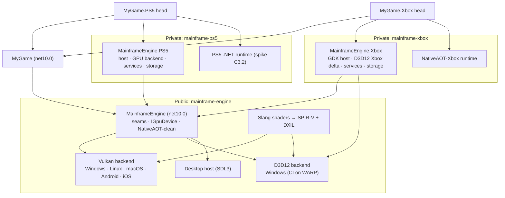

# Proposal: Consoles (PlayStation 5 + Xbox Series X|S)

**Milestone:** none yet (readiness work only; ports start after developer-program access) · **Status:** ⬜ planned ·
**Shapes:** [M11 backend abstraction](rendering-backend-abstraction.md) (GPU API, D3D12 backend, shader language) ·
**Reuses:** [M12 mobile core](mobile.md) (platform seams, AOT, content packs),
[M13 mobile services](mobile-services.md) (service backends), [G4 saves](save-and-settings.md) (`ISaveStorage`) ·
**Decision:** [ADR 0143](../../../memory/decisions/0143-console-strategy.md)

> **This repository is public. Console SDKs, their documentation and their certification requirements are under NDA.**
> This document uses public information only, checked on 2026-10-08 and linked inline. Rows marked **⚠** are uncertain
> or rest on press, job-ad or community sources. Anything learnt under NDA goes into the private console repositories,
> never into this repository, its issues, its CI logs or its commit messages.

## Problem

The goal is to ship Mainframe Games titles on PlayStation 5 and Xbox Series X|S eventually. Nobody has applied to either
developer program yet and there is no date. Today the engine would need rewrites, not add-ons, to get there:

- **Rendering.** Every drawable records raw Vulkan through `IVulkanContext` (51 files under `MainframeEngine/Src` use
  `Silk.NET.Vulkan`). Xbox requires Direct3D 12 and PS5 has its own API. Neither runs Vulkan. M11's planned abstraction
  is modelled on WebGPU and only plans a WebGPU second backend.
- **Shaders.** The engine's shaders were GLSL compiled with `glslc`; they are Slang now
  ([ADR 0144](../../../memory/decisions/0144-slang-shader-language.md)), but only SPIR-V is produced. Nothing produces
  DXIL yet, and consoles need every shader compiled ahead of time.
- **Runtime.** The engine runs on the JIT. Consoles forbid JIT, and Microsoft's .NET does not list either console as a
  supported NativeAOT target.
- **Natives and dependencies.** SDL2 comes through Silk.NET 2.x. SoundFlow/miniaudio, ENet and Steamworks have no
  console builds.
- **Platform concepts the engine lacks.** Signed-in users and pairing users to controllers, suspend/resume, packaged
  read-only content, platform save storage, entitlements, controller-first UI and platform button glyphs.

The mobile proposal already adds most of the platform seams (`IAppPlatform`, `IContentFileSystem`, AOT gates). This
proposal makes sure M11 and those seams are shaped so that a console port is a **private add-on** to a released engine,
not a fork.

## Goals

- **Targets:** PlayStation 5 and Xbox Series X|S (Series S is the minimum spec). Current generation only.
- **Audience:** Mainframe Games' own titles. Console code is private to the studio.
- **Public readiness now:**
  - M11's GPU API is designed to map onto explicit APIs: Vulkan, D3D12 and a console-style API.
  - A **D3D12 backend is built publicly on Windows** and runs in CI on WARP.
  - One shader source compiles to SPIR-V and DXIL.
  - The engine is NativeAOT-clean, with a desktop NativeAOT smoke test in CI.
  - Every console concern sits behind a seam in core that has a desktop or null implementation.
- **After access:** private repositories (`mainframe-xbox`, `mainframe-ps5`) that hold only platform code, build
  against tagged engine releases, and turn a game into a console build with a head project.
- **Feature parity:** the same 3D + 2D feature set and the same scenes as desktop, at 60 fps on Series S with dynamic
  resolution.

## Non-goals

- Last-generation consoles (PS4, Xbox One) and Nintendo Switch. Switch 2 may come later and would reuse the Vulkan
  backend, but it is not designed here.
- Console export for engine users (the FNA/MonoGame/W4 access model). Possible later; the repository split allows it.
- Anything that needs NDA knowledge: console GPU backend design, cert checklists, platform API mappings. Those are
  written privately after access.
- Running the editor on a console, or code reload on a console. Content live preview over the editor link is an
  open question for later.
- A hand-written native Metal backend. Consoles do not change the [mobile](mobile.md) decision.

## Facts this design rests on

| Area | Fact | Source |
|---|---|---|
| .NET on consoles | Microsoft's NativeAOT platform table lists Windows, Linux, macOS, iOS/tvOS/Mac Catalyst and Android, and no console. | [Native AOT](https://learn.microsoft.com/en-us/dotnet/core/deploying/native-aot/) |
| Xbox .NET | Microsoft released **XBOX GDK.NET** (MIT) on 2026-09-28: a C# projection of Gaming Runtime, Xbox services and PlayFab for net8/net10. It is "AOT safe" because consoles do not permit JIT. It calls itself "source, not a product". ⚠ It does not say where a console NativeAOT runtime comes from. | [release](https://github.com/microsoft/XBOX-GDK-dotnet/releases/tag/09-28-Initial-Release), [native-aot.md](https://github.com/microsoft/XBOX-GDK-dotnet/blob/main/docs/native-aot.md) |
| FNA | "All console builds use NativeAOT." Xbox support is public source in `NativeAOT-Xbox` (dotnet/runtime v8.0.1 based, GDK 220600+) after signing the GDK agreement. PS5 needs a licensed NDA; shaders must be precompiled there. | [FNA on consoles](https://fna-xna.github.io/docs/appendix/Appendix-B%3A-FNA-on-Consoles/), [NativeAOT-Xbox](https://github.com/FNA-XNA/NativeAOT-Xbox) |
| MonoGame | Console code lives in private repositories for vendor-approved developers. The console runtime is AOT: no reflection emit, no runtime codegen, no `Assembly.Load`. ⚠ Its BRUTE → NativeAOT move has no public confirmation. | [console access](https://docs.monogame.net/articles/console_access.html), [preparing for consoles](https://docs.monogame.net/articles/getting_started/preparing_for_consoles.html), [#8194](https://github.com/MonoGame/MonoGame/issues/8194) |
| Godot / W4 | W4 Games offers C# in beta on Switch and Xbox Series; PS5 C# is not mentioned. Access is a private repository after purchase and verification. | [W4 Consoles](https://www.w4games.com/w4consoles), [Godot consoles](https://docs.godotengine.org/en/4.5/tutorials/platform/consoles.html) |
| ⚠ PS5 .NET | No public Microsoft or Sony source exists for .NET on PS5. FNA and MonoGame reach PS5 through private ports. | — |
| NativeAOT limits | No dynamic loading or `Reflection.Emit`, trimming required. Cross-architecture builds work; cross-OS builds do not. ⚠ There is no official guide for a new OS; community proof exists (NativeAOT-Xbox, bflat, zerosharp). | [Native AOT](https://learn.microsoft.com/en-us/dotnet/core/deploying/native-aot/), [compiling.md](https://github.com/dotnet/runtime/blob/main/src/coreclr/nativeaot/docs/compiling.md), [zerosharp](https://github.com/MichalStrehovsky/zerosharp) |
| Xbox GPU | "Map your renderer to DirectX 12 on XBOX." The console GDK (GDKX) is licensed to partners only. ⚠ No explicit public statement rules Vulkan out. | [porting](https://devdocs.xbox.com/paths/porting/from-console), [GDK](https://github.com/microsoft/GDK) |
| ⚠ PS5 GPU | Sony's graphics API and shader language are named publicly only in job ads. No official statement on Vulkan for PS5. | [job ad](https://www.skillshot.pl/jobs/27190-game-porting-programmer-mid-senior-at-nano-games) |
| SDL3 | The SDL repository includes the GDK (Xbox) code; only GDKX libraries are restricted. PS5 is a separate NDA fork that is free (zlib) to Sony-licensed developers, with commercial games shipping. SDL3 GPU's D3D12 backend covers Xbox Series. | [README-gdk](https://github.com/libsdl-org/SDL/blob/main/docs/README-gdk.md), [README-platforms](https://github.com/libsdl-org/SDL/blob/main/docs/README-platforms.md), [README-ps5](https://wiki.libsdl.org/SDL3/README-ps5), [SDL GPU](https://wiki.libsdl.org/SDL3/CategoryGPU) |
| Shader tools | DXC compiles HLSL to DXIL or SPIR-V (no GLSL input). glslang's HLSL front end is deprecated (April 2026). **Slang** is Khronos-hosted (Apache 2.0), HLSL-like with a GLSL compatibility module, and targets SPIR-V, DXIL, MSL, WGSL and more. SPIRV-Cross turns SPIR-V into HLSL/MSL/GLSL. SDL builds its Xbox shader blobs in a pre-build step for NDA reasons. | [DXC SPIR-V](https://github.com/microsoft/DirectXShaderCompiler/blob/main/docs/SPIR-V.rst), [glslang](https://github.com/KhronosGroup/glslang), [Slang targets](https://shader-slang.org/slang/user-guide/targets.html), [Khronos](https://www.khronos.org/news/press/khronos-group-launches-slang-initiative-hosting-open-source-compiler-contributed-by-nvidia), [SPIRV-Cross](https://github.com/KhronosGroup/SPIRV-Cross) |
| Middleware | miniaudio and SoundFlow list no consoles; miniaudio supports custom backends. RmlUi lists Switch and "more" (C++17, pluggable font engine). ENet ships only `unix.c` and `win32.c`. The GDK supports Winsock with console-specific init. Jitter2, Box2D.NET and spine-csharp are managed. | [miniaudio](https://github.com/mackron/miniaudio), [SoundFlow](https://github.com/LSXPrime/SoundFlow), [RmlUi](https://github.com/mikke89/RmlUi), [ENet](https://github.com/lsalzman/enet), [Winsock on Xbox](https://devdocs.xbox.com/build/console-features/networking/game-mesh/winsock-intro-networking) |
| Programs | Xbox: partner registration and ID@Xbox are free (mutual NDA, title licence, GDK licence); dev kits come after concept approval ⚠ (kit pricing not public). Xbox Requirements are public (Console 16.3, 2026-07-01). Sony: newly registered partners with an accepted concept got one free dev kit and one test kit (2022). No public Sony cert document. | [onboarding](https://devdocs.xbox.com/home/onboarding), [publish](https://developer.microsoft.com/en-us/games/publish), [Xbox Requirements](https://devdocs.xbox.com/publishing/certification/xbox-requirements), [Sony kits](https://sonyinteractive.com/en/news/blog/complimentary-development-hardware/) |

## Proposed design

### Repositories and access

- **Public (`Mainframe-Games/mainframe-engine`):** the engine, every seam with its desktop/null implementation, the
  Vulkan and D3D12 backends, Slang shaders and the shader build, the NativeAOT desktop smoke, and this design.
- **Private (`Mainframe-Games/mainframe-xbox`, `Mainframe-Games/mainframe-ps5`), created only after the program
  agreements are signed:**
  - one engine add-on assembly (`MainframeEngine.Xbox` / `MainframeEngine.PS5`), referenced by game heads like
    `MainframeEngine.Android` is in M12;
  - its natives (SDL3 console build, `mfrmlui`, `enet`, audio output), built by that repository's own CI on the
    vendor's toolchain;
  - the console GPU backend, or the Xbox delta on the public D3D12 backend;
  - `just xbox-*` / `ps5-*` recipes, deploy scripts and an on-kit render-test host;
  - the private cert notes and requirement mapping.
- **Version coupling.** A console repository pins an engine release tag (`publish.yml` tags `vX.Y.Z`) through a
  submodule or package reference and never patches engine sources. A change a port needs goes upstream as a public,
  NDA-free seam change first.
- **Game heads.** `MyGame.Xbox` / `MyGame.PS5` live in the game's own private repository, next to `MyGame.Desktop`.
  The public `mfgame` template does not know about them.
- **NDA hygiene in public CI.** Public workflows never fetch private repositories, secrets for them or vendor SDKs.
  The private repositories run their own CI on self-hosted machines with the SDKs installed.

### Platform seams

The console layer implements seams core already plans. New seams are marked **new**:

| Seam (core) | Planned by | Desktop | Xbox / PS5 (private) |
|---|---|---|---|
| `IAppPlatform` (lifecycle: suspend/resume/constrained, focus, device info, refresh rates, system text input) | [M12](mobile.md#platform-layer-and-project-structure) | SDL window, no-ops | system lifecycle (Xbox Quick Resume included) |
| `IContentFileSystem` (open/stream/exists/enumerate over mounts) | M12 | loose files | the package's read-only content mount |
| `ISaveStorage` / `ICloudSaveBackend` | [G4](save-and-settings.md#storage-and-cloud-saves) | `LocalSaveStorage` | the console save systems (cloud sync is the platform's) |
| `IGameServicesBackend` (achievements/trophies, presence, activities) | [M13](mobile-services.md) | Steam / fake | console services; Xbox may use XBOX GDK.NET |
| `IStoreBackend` (entitlements, DLC, add-ons) | M13 | Steam / fake | console stores |
| `ITransportFactory` | **exists** (`Src/Networking/Transport`) | ENet, loopback | ENet over the console socket layer, or a native transport |
| **new** `IUserPlatform` (signed-in users, primary user, user ↔ controller pairing, sign-in/out events, display name, privileges such as multiplayer/UGC/chat) | this proposal | one implicit local user, every privilege granted | console user services |
| **new** `IAudioOutput` (open a stream with a format, pull callback on the audio thread, device-change events) | this proposal | SoundFlow/miniaudio device (today's path) | the platform's audio output; the engine's mixer graph is unchanged |
| **new** `IGlyphProvider` (button glyphs and names per controller family) | this proposal, with [G4 rebinding](save-and-settings.md) | Xbox layout today, plus PlayStation/Nintendo by controller type | platform glyphs (mandatory on console) |
| `IGpuDevice` | [M11](rendering-backend-abstraction.md), **changed here** | Vulkan / D3D12 | D3D12-Xbox / PS5 |
| `UserDataPaths`, pipeline-cache dir | exists | per-OS folders | console temp/cache storage only; saves never go through raw paths |

- **Seams are optional servers with null implementations** ([mobile plumbing item 13](mobile.md#mobile-ready-plumbing-checklist)),
  registered by the head before `Engine` starts. Core never references a console assembly.
- **Steam** stays desktop-only. Console heads never register `SteamServer`, and `Steamworks.NET` moves behind the
  `MAINFRAME_STEAM` symbol M12 already plans if the trimmer keeps it.
- **Users.** Today the engine has no user concept. `IUserPlatform` introduces one (`PlatformUser`: id, display name,
  paired input devices). `Input` gains an optional user filter (`Input.IsActionPressed("jump", user)`), so local
  multiplayer and controller pairing work the same on desktop (one implicit user per gamepad) and consoles.

### Runtime

- **NativeAOT is the console runtime**, the FNA model.
  - **Xbox** starts from the public `FNA-XNA/NativeAOT-Xbox` port (which tracks a dotnet/runtime tag) and
    Microsoft's XBOX GDK.NET. Spike C3.1 confirms which .NET version it supports at the time; the engine may have to
    build for that version too.
  - **PS5** has no public runtime story. Spike C3.2 decides between (in order of preference) a private NativeAOT port,
    a shared port with another C# framework or porter, or a porting studio.
- **What the public engine guarantees now** (most of it is already [mobile plumbing item 5](mobile.md#mobile-ready-plumbing-checklist)):
  - `IsAotCompatible=true` on `MainframeEngine` with zero warnings; third-party warnings are fixed upstream or
    suppressed with a written justification.
  - **A desktop NativeAOT publish of the template game in CI** (`template-smoke` gains `--aot`): it builds, runs
    `--headless --max-frames 300`, and on runners with a GPU (lavapipe on Linux) also `--hidden --max-frames 300` so
    the renderer runs under AOT. This is the cheapest stand-in for console behaviour.
  - Game assemblies are passed in explicitly (`GameHost.Run(args, typeof(X).Assembly)` already does this); no
    `Assembly.Load` by name when `RuntimeFeature.IsDynamicCodeSupported` is false.
  - The engine never needs a .NET version newer than what NativeAOT-Xbox supports at port time. The pin is decided in
    C3.1, not now.
- **GC.** Workstation, non-concurrent or concurrent per spike, with the [allocation gate](../testing.md) keeping
  per-frame allocation at zero so collections stay rare. Memory budgets are enforced by the platform (no paging). The
  dev overlay's `gpu` panel already shows GPU memory; a managed-memory panel (GC heap, collections, pauses) joins it, so
  budgets are visible on desktop first.

### Rendering

**M11 changes.** The [backend abstraction](rendering-backend-abstraction.md) stays the vehicle, with these
requirements added (recorded in the M11 doc):

1. **Shaped for explicit APIs, not WebGPU.** `IGpuDevice` keeps WebGPU's vocabulary where it is neutral (passes, bind
   groups, pipelines) but is validated first against D3D12, not WebGPU:
   - **Binding:** bind groups with layouts declared up front, at most 4 groups per pipeline. They map to Vulkan
     descriptor sets and to D3D12 root-signature descriptor tables. Push data maps to push constants and D3D12 root
     constants (≤ 128 bytes). Immutable samplers map to static samplers.
   - **Resource states:** a pass declares its attachments and the resources it reads/writes. The backend derives the
     barriers (Vulkan pipeline barriers, D3D12 enhanced barriers). No raw barrier calls in engine code, and no full
     render graph (M11 non-goal).
   - **Pipelines are a finite, enumerable set.** Every `GpuPipelineDesc` the engine can create is known at build time
     (material permutations × pass × vertex layout) and listed in a pipeline manifest. Consoles compile them offline;
     desktop pre-warms them at load. No pipeline is first created mid-frame.
   - **Memory:** buffers and textures come from the device's allocator (today's `GpuBuffer`/`GpuImage`), with
     upload/deletion queues per frame slot (today's `Uploads`/`Deletions`). Each backend keeps its own allocator.
   - **Capabilities, not versions:** the shadow system, MSAA, compression formats and subpass merging query
     `GpuCapabilities`. The mobile TBDR merged pass is a capability (`SupportsTileMemory`), not a Vulkan assumption.
2. **D3D12 is M11's first new backend, before WebGPU.** It proves the abstraction against a second explicit API, gives
   Windows a native-API fallback for driver problems, and is the public base of the Xbox backend. It runs in CI on
   **WARP** (Windows' software D3D12 rasterizer) with its own goldens, the way `lavapipe` covers Vulkan on Linux.
   WebGPU stays in M11, after D3D12.
3. **Swapchain and presentation behind the device.** Today `VulkanRenderer` owns the surface. Under M11 the host
   (`IAppPlatform`) supplies a native window handle and the device owns presentation, so a console host can supply
   its own.

**Shaders.** One source language compiled offline to every target:

- **Decided: Slang** ([ADR 0144](../../../memory/decisions/0144-slang-shader-language.md), done): every engine shader is
  Slang, compiled with `slangc` to SPIR-V today; DXIL is one more target when the D3D12 backend lands. Slang is Khronos
  hosted and a **build tool only**: pinned, checksummed and never shipped.
- The rejected alternative was keeping GLSL and chaining `glslc` → SPIR-V → SPIRV-Cross (HLSL) → DXC (DXIL): no
  migration, but two extra tools and a lossy HLSL hop.
- **Console shaders are private build steps** (as SDL does for Xbox). The public build writes SPIR-V and DXIL; the
  console repositories compile the same source (or the DXIL/HLSL output) with the vendor compilers.
- `shaders.lock` and `just shaders-check` extend to every committed output (SPIR-V + DXIL).

**Console GPU backends (private).**

- **Xbox:** the public D3D12 backend plus a private delta (device creation, presentation, memory and GPU specifics
  from the GDK). Spike C3.1 measures how large that delta is.
- **PS5:** a new `IGpuDevice` implementation written privately (spike C3.3). Its size is the main reason M11's API
  must stay small and explicit.

**Output and performance targets.**

- 60 fps on Series S with dynamic resolution (the mobile design's dynamic-resolution path is shared). Higher-end
  targets scale resolution, not features, at first.
- HDR10 output is a later feature: the scene is already linear HDR ([color pipeline](../color-pipeline.md)); only the
  output transform and the swapchain format change. Designed with the D3D12 backend, enabled per platform later.

### Windowing, input and UI

- **SDL3 replaces SDL2 for the platform layer** (windowing, events, gamepads, sensors) on every platform, in a separate
  ADR and milestone task ([open question 2](#open-questions)). SDL3 supports Xbox in its public repository and PS5
  through a free NDA fork, and the mobile proposal already lists Silk.NET 2.x's SDL2 as a risk. Silk.NET stays for
  Vulkan (and Assimp) bindings; SDL3 needs its own bindings (a new dependency to discuss).
- **Controller-first UI.** Every game-facing RmlUi screen must be fully usable with a gamepad: focus navigation,
  confirm/back mapped to the platform's buttons, no hover-only affordances. The widget library gets focus styles and
  a `nav` contract; the [dev overlay](../dev-overlay.md) is exempt.
- **Platform glyphs and names** come from `IGlyphProvider`. RML uses a glyph element (`<glyph action="jump"/>`) instead
  of baked images, so the same document shows the right button per controller.
- **Text input** on consoles goes through the system keyboard: `IAppPlatform.RequestTextInput(prompt, initial,
  callback)`. RmlUi text fields call it on focus when no physical keyboard is present (desktop: no-op).
- **Controller disconnects and user changes** raise engine events (`Input.DeviceDisconnected`,
  `IUserPlatform.UserSignedOut`) that games handle (typically: pause and show a prompt). The template game handles them.

### Audio

- `AudioServer` keeps its graph, buses, decoders and threading. Below it, the SoundFlow device becomes one
  implementation of `IAudioOutput`. Consoles implement `IAudioOutput` on the platform's audio API, so SoundFlow and
  miniaudio never ship on consoles.
- Game code is unaffected: it already never calls SoundFlow ([audio](../audio.md)).

### Networking

- `ITransportFactory` already isolates transports. ENet gets a socket backend per console (Winsock is available on
  Xbox with console-specific setup; PS5 is decided privately), or a console-native transport implements `ITransport`.
- Platform sessions, invites, matchmaking and privilege checks (multiplayer, cross-play, chat) come from
  `IUserPlatform` and `IGameServicesBackend`, never from the transport.

### Content, saves and storage

- **Content** is read through `IContentFileSystem` (M12), from the console package's read-only mount. The M12 cook
  (`mf-cook`: cooked meshes, no Assimp at run time, compressed textures) is reused. Desktop formats (BC7/BC5 for
  textures) cover both consoles' GPUs; the cooker gains a BCn target next to ASTC/ETC2.
- **Saves** go only through `ISaveStorage` (G4), which consoles implement on their save systems. Game code never
  writes save files by path. Save sizes, writes and corruption handling follow G4 (versioned JSON, durable writes,
  backups).
- **Other writes** (logs, pipeline caches, temp files) go through `UserDataPaths`, which consoles map to their temp
  or cache storage. Missing storage is not fatal.

### Editor and tooling

- No console UI in the public editor. The private repositories ship command-line build/deploy recipes first.
- Later, [G5 export presets](game-export.md) gain an extension point: an export-target plugin assembly (loaded by the
  editor only when present) adds `xbox`/`ps5` presets, without the public editor knowing about consoles.
- Remote logs and play control reuse the [editor link](../project-and-gamehost.md#editor-link) over the kit's network.

### Testing

- **Public CI:** D3D12 render tests on WARP (goldens in `Tests/MainframeEngine.RenderTests/Goldens/warp`), the
  desktop NativeAOT smoke, the AOT analyzer gate, shader outputs checked by `shaders-check`, and unit tests for every
  new seam's desktop/null implementation (`IUserPlatform`, `IAudioOutput`, `IGlyphProvider`).
- **Private CI (after access):** the same render-test catalogue on dev kits with per-kit goldens, a soak test of the
  template game, and a suspend/resume and user/controller-change script.

### Phases

#### C0 — Readiness in the public engine (now, alongside other work)

- Follow the [console-ready plumbing checklist](#console-ready-plumbing-checklist) whenever a change touches those
  areas.
- `IsAotCompatible` + the desktop NativeAOT smoke (shared with M12).

#### C1 — M11 with consoles in mind

- `IGpuDevice` shaped as described, the D3D12 backend on Windows with WARP CI, the shader-language ADR and its
  migration, and the pipeline manifest.

#### C2 — Platform layer

- SDL3 migration (ADR first), `IUserPlatform`, `IAudioOutput`, `IGlyphProvider`, controller-first widgets and system
  text input. Several pieces overlap M12 and land with it.

#### C3 — Access and spikes (after program approval; private)

| Spike | Question | Pass |
|---|---|---|
| C3.1 Xbox runtime + GPU | Does the template game build with NativeAOT-Xbox on the then-current GDK and render through the public D3D12 backend plus a delta? | template game at 60 fps on Series S; delta size known |
| C3.2 PS5 runtime | Which .NET runtime path exists for PS5 (private NativeAOT port, shared port, porter)? | hello-world C# with P/Invoke on a kit |
| C3.3 PS5 GPU | Effort for a PS5 `IGpuDevice` against M11's API | Sky + mesh render test on a kit; estimate for the rest |
| C3.4 Natives | SDL3 console builds, `mfrmlui`, `enet` (socket backend), audio output | template game with UI, input and sound on both kits |
| C3.5 Requirements | Map the platform requirements onto engine features and the template game | private checklist, gaps filed as public, NDA-free seam issues |

#### C4 — Ports and certification (private)

- Port one shipped Mainframe Games title, pass both platforms' certification, and feed every NDA-free lesson back into
  the public engine as seam changes.

### Task list

Public (this repository):

- [ ] ADR 0143 and this proposal (this change)
- [ ] M11 doc: explicit-API requirements, D3D12-first, pipeline manifest, presentation behind the device (this change)
- [x] Shader-language ADR and migration: Slang ([ADR 0144](../../../memory/decisions/0144-slang-shader-language.md))
- [ ] `IsAotCompatible` with zero warnings; desktop NativeAOT template smoke in CI (shared with M12)
- [ ] `IGpuDevice` + `VulkanDevice` + `D3D12Device` (Windows), WARP render tests and goldens
- [ ] Pipeline manifest: enumerate every pipeline at build; pre-warm at load; fail tests on a mid-frame pipeline creation
- [ ] SDL3 platform-layer ADR (bindings dependency) and migration
- [ ] `IUserPlatform`, `IAudioOutput`, `IGlyphProvider` with desktop/null implementations and tests
- [ ] Controller-first widget library (focus navigation, `nav` contract, glyph element); template game passes a
      gamepad-only walkthrough (`Tests/QA`)
- [ ] System text input seam; RmlUi text fields use it
- [ ] BCn target in `mf-cook`
- [ ] Managed-memory dev overlay panel (GC heap, collections, pauses)
- [ ] G5 export-target extension point

Private (after access): C3 spikes, console repositories and CI, GPU backends, platform implementations of every seam,
cert mapping, first port.

## Console-ready plumbing checklist

Cheap rules for changes **now**, so console ports stay additive. They extend the
[mobile-ready checklist](mobile.md#mobile-ready-plumbing-checklist) (all 14 mobile items apply to consoles too, the
16 KB-alignment and touch items aside).

1. **No new raw `Vk` calls outside the renderer's backend code.** New rendering features go through the existing
   abstractions (`IVulkanContext.Pipelines`, `Uploads`, `Deletions`, frame-slot resources) today and `IGpuDevice` once
   it exists. Every new direct `Vk` call in a node or system is a future port cost on two consoles.
2. **Pipelines are enumerable.** New pipeline variants come from a finite set of descriptions (material flags, pass,
   vertex layout), never from data-driven combinations that only appear at run time. Never create a pipeline
   mid-frame on a code path a player can reach.
3. **No runtime shader compilation.** All shaders are compiled at build time from the shader sources; no shader source strings
   built in code.
4. **Shaders stay portable.** No target-specific features (SPIR-V-only) without a DXIL/console equivalent (e.g. no `subpassInput` without a
   non-subpass fallback, no reliance on Vulkan-only layout qualifiers beyond set/binding/push constants), and keep
   within 4 bind groups and ≤ 128 bytes of push data.
5. **Users are not assumed.** Code that needs "the player" (saves, settings, achievements, input) takes a user or uses
   the primary user from `IUserPlatform`, never a global "current account".
6. **Gamepad first.** New game-facing UI is fully usable with a gamepad (focus order, confirm/back, no hover-only
   controls). Button prompts use glyphs from `IGlyphProvider`, never baked "A"/"X" images or text.
7. **Saves only through `ISaveStorage`.** No `File.*` for save data, ever; other writes only through `UserDataPaths`,
   and a failed write is handled, not fatal.
8. **Audio only through `AudioServer`** (already a rule), and new device-level audio code goes behind `IAudioOutput`.
9. **Sockets only through `ITransport`.** No `System.Net.Sockets`, `HttpClient` or DNS in runtime code outside
   transports and services.
10. **No processes, no shell.** Runtime code never calls `Process.Start`, opens URLs directly or reads environment
    variables for behaviour; use `IAppPlatform` (open URL) and `ProjectSettings`.
11. **Memory is a budget.** New caches have a size limit and show up in the dev overlay (the `gpu` panel, or the
    managed-memory panel once it exists); nothing assumes the OS pages out unused memory.
12. **NDA hygiene.** Never commit, log, comment or name anything learnt under a console NDA in this repository. Seam
    changes a port needs are written in platform-neutral terms.

## Risks

| Risk | Impact | Mitigation |
|---|---|---|
| No public .NET runtime for PS5 | PS5 port blocked or expensive | spike C3.2 first after access; options: private NativeAOT port, shared port, porting studio; keep the engine NativeAOT-clean so any of them works |
| NativeAOT-Xbox lags upstream .NET (based on 8.0.1 at last check) | the engine may have to build for an older .NET on Xbox, or wait | keep core free of APIs newer than needed in runtime code; pin decided in C3.1; GDK.NET suggests Microsoft interest in upstream support ⚠ |
| M11's API ends up WebGPU-shaped or Vulkan-leaky | D3D12/PS5 backends need workarounds or an API redesign | D3D12 is the first second backend and runs in CI; the explicit-API requirements above are M11 acceptance criteria |
| Shader migration (41 shaders) introduces visual changes | regressions, golden churn | migrate behind the render tests; goldens must not change; old and new compilers side by side during the move |
| SDL3 migration (new bindings) destabilises desktop and mobile hosts | input/window regressions | separate ADR and milestone; the host stays behind `IAppPlatform`; scripted editor QA and template smoke as gates |
| Middleware without console support (SoundFlow, ENet, Steam) | missing features on console | each is behind a seam (`IAudioOutput`, `ITransportFactory`, optional servers) designed now |
| NDA leaks into the public repository | breach of program agreements | private repositories, NDA-free seam issues, checklist item 12, no vendor SDK in public CI |
| Certification requirements change engine behaviour late (suspend, users, glyphs, text input) | late rework | the seams and the template game cover the generic expectations now; C3.5 maps the real requirements before porting a title |
| Two more GPU backends to maintain (D3D12 + PS5) | maintenance cost for a small team | a small, explicit `IGpuDevice`; shared render-test catalogue on every backend; consoles only for titles that justify them |

## Decisions

Decided by the user on 2026-10-08 and recorded in [ADR 0143](../../../memory/decisions/0143-console-strategy.md):

1. **Targets:** PS5 and Xbox Series X|S only. **Audience:** Mainframe Games' own titles first.
2. **Timing:** no program applications yet, no date. This proposal is readiness work plus a plan for after access.
3. **Scope now:** it shapes M11 and adds a console-ready plumbing checklist. No console milestone number and no
   roadmap reordering.
4. **Approach:** own the GPU API (M11 shaped for explicit APIs; D3D12 built publicly on Windows first; console backends
   private), not SDL3 GPU and not a Vulkan-only + porter plan. Move the platform layer to SDL3 (own ADR).
5. **Runtime:** NativeAOT on both consoles.
6. **Repository split:** public engine with seams only; private per-console repositories pinned to engine releases.

## Open questions

1. ~~**Shader language**~~ — decided: Slang ([ADR 0144](../../../memory/decisions/0144-slang-shader-language.md)), and the
   engine's shaders are ported.
2. **SDL3 bindings:** which C# binding for SDL3 (a new dependency), and does the move happen with M12 (mobile) or before
   it? Default: decide in the SDL3 ADR; prefer doing it before M12 so mobile is built on SDL3 once.
3. **WebGPU in M11:** keep it after D3D12, or defer it to its own milestone? Default: after D3D12, same milestone.
4. **Content live preview on kits** over the editor link: worth designing now? Default: no, after the first port.

## Related

[Milestones](../../milestones.md) · [Rendering backend abstraction (M11)](rendering-backend-abstraction.md) ·
[Mobile core (M12)](mobile.md) · [Mobile services (M13)](mobile-services.md) · [Save games and settings](save-and-settings.md) ·
[Game export](game-export.md) · [Vulkan renderer](../vulkan-renderer.md) · [Shaders](../shaders.md) ·
[Audio](../audio.md) · [Networking](../networking.md) · [Game UI](../game-ui.md) · [Native libraries](../natives.md) ·
[ADR 0143](../../../memory/decisions/0143-console-strategy.md)
