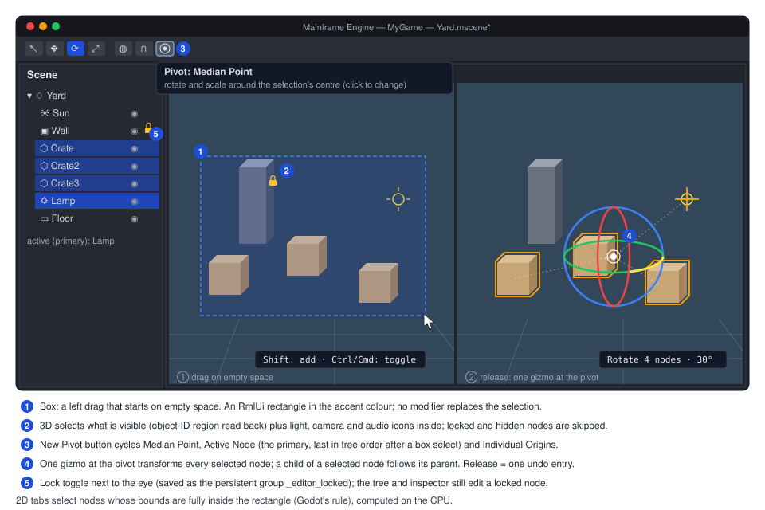
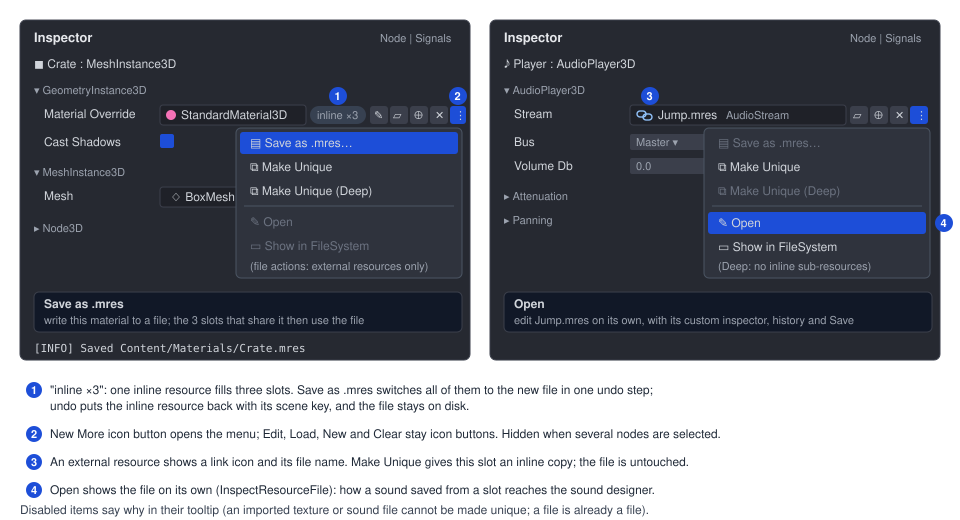
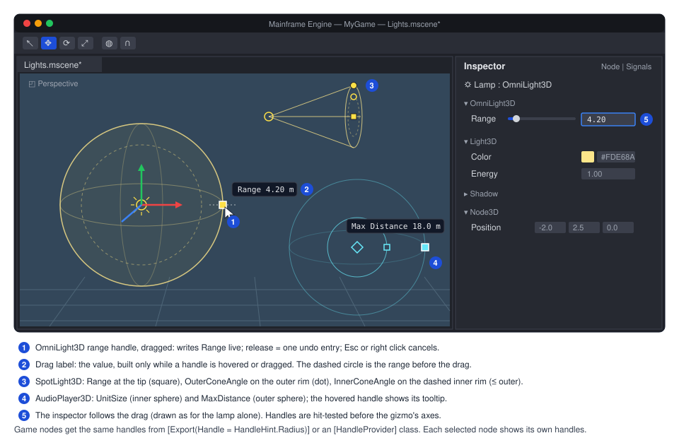
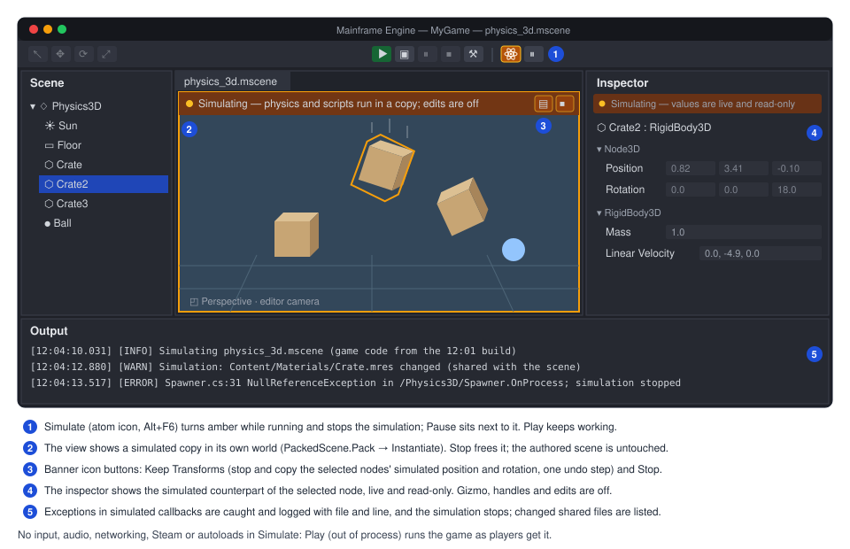

# Proposal: Editor viewport tools

**Milestone:** [Gameplay toolkit](../../milestones.md#gameplay-toolkit-) (G7) · **Status:** ⬜ planned ·
**Depends on:** [Editor](../editor.md) (M10, shipped: viewport, gizmos, picking, inspector, undo, Play) ·
**Related:** [Future: editor](editor.md) (rows "Simulate mode", "Box selection", "Multi-node gizmo", "Editor previews
and handles") · [Keyframe animation](keyframe-animation.md) (G1) · [2D content](2d-content.md) (G2) ·
[Rendering features](rendering-features.md) (G6) · sound designer (`docs/design/future/sound-designer.md` on the
unmerged local branch `feature/sound-designer`)

## Problem

The M10 editor edits one node at a time in the viewport and has no way to tune ranges by hand or to try physics
without launching the game. Five gaps, all from the [future editor backlog](editor.md):

- **No range handles.** A selected `OmniLight3D` shows its range as a sphere, a `SpotLight3D` its cone and an
  `AudioPlayer3D` its max-distance sphere (`MainframeEngine.Editor/Src/Viewport/ViewportController.cs:782-783`,
  `:787-797`, `:804-805`). They are drawn only. The values (`OmniLight3D.Range`, `SpotLight3D.Range`,
  `InnerConeAngle`, `OuterConeAngle`, `MainframeEngine/Src/Scene/Nodes3D/Light3D.cs:190-228`; `AudioPlayer3D.UnitSize`
  and `MaxDistance`, `MainframeEngine/Src/Audio/Nodes/AudioPlayer3D.cs:64-69`) can only be typed in the inspector.
  The 2D view draws no audio range at all (`ViewportController.2D.cs:245-281`), although `AudioPlayer2D.MaxDistance`
  exists (`AudioPlayer2D.cs:58-59`). There is no way for a node type or a plugin to declare its own handles.
- **Inline resources are stuck in the scene.** The inspector's resource row has Edit, Load, New and Clear
  (`MainframeEngine.Editor/Src/UI/InspectorPanel.cs:424-440`). An inline resource cannot be saved to a `.mres`, and a
  shared or external resource cannot be made unique, although the engine has both halves: `ResourceSaver.Save` makes a
  resource external (`MainframeEngine/Src/Resources/ResourceSaver.cs:48-70`) and `Resource.Duplicate(deep)` copies one
  (`MainframeEngine/Src/Resources/Resource.cs:80-93`). The sound designer proposal (unmerged branch
  `feature/sound-designer`, `docs/design/future/sound-designer.md`, Open questions) depends on this action. It says:
  "a 'Save as .mres' action on the slot (already on the future-editor list) turns one into a file the designer
  opens". Custom inspector headers only appear for the top-level target, so inline sounds get no designer today.
- **No box selection.** A left drag on empty space does nothing: a `Click` drag is swallowed
  (`ViewportController.cs:412-413`), and a release picks only when the mouse moved less than 4 points (`:382-383`).
  GPU picking reads back one pixel per request (`MainframeEngine/Src/Rendering/Meshes/ObjectIdPicker.cs:103-140`,
  one `uint` per request in a 64-entry readback buffer, `:31`, `:54-55`). 2D picking is a CPU point test
  (`ViewportController.2D.cs:159-185`).
- **The gizmo moves one node.** `GizmoTarget` is `Selection.Primary` only (`ViewportController.cs:571-574`; 2D
  `ViewportController.2D.cs:75-78`), so with three crates selected the gizmo moves the last one. This is listed under
  Known issues in [Editor](../editor.md#known-issues). The inspector already edits several nodes as one undo entry
  (`EditedScene.SetProperties`, `MainframeEngine.Editor/Src/Session/EditedScene.cs:112-138`).
- **No in-process simulation.** `SceneTree.EditMode` (`MainframeEngine/Src/Scene/SceneTree.cs:84`) runs only `[Tool]`
  nodes' process callbacks (`:395`, `:419`) and never steps the fixed-step servers (`:324`). Game code's lifecycle
  callbacks are skipped too (`EditModeScripts`, `:91`; `Node.SkipsScriptCallbacks`,
  `MainframeEngine/Src/Scene/Node.EditMode.cs:27-40`). To see a stack of crates fall, the user must Play: save,
  `dotnet build`, launch a process ([Editor → Play](../editor.md#play)).

There is also no node lock. Godot's lock (`_edit_lock_`) keeps a node out of viewport picking. Box selection makes
it worth having, so this proposal adds a minimal one.

## Goals

- Drag handles for light and audio ranges in 3D and 2D, with one undo entry per drag, and a small API so engine
  nodes, game nodes and editor plugins can declare handles.
- Inline resource actions in the inspector: **Save as .mres**, **Make Unique** (shallow and deep), **Open** a file
  resource on its own, **Show in FileSystem**. Load, New and Clear stay. Every slot change is undoable and UIDs stay
  correct.
- Box selection in 3D (visible objects, from the object-ID target) and 2D (node bounds), with add and toggle
  modifiers, skipping locked and hidden nodes.
- A gizmo that moves, rotates and scales every selected node around a shared pivot (median, active, individual
  origins), in local or global space, as one undo entry.
- **Simulate**: run physics and game scripts in the open scene inside the editor, then stop and get the authored
  scene back untouched.

## Non-goals

- Collision shape handles, camera FOV handles and "create collision from mesh". The handle API covers them; they stay
  on the [future editor](editor.md) "Editor previews and handles" row.
- Audio preview (the sound designer branch has it).
- Player input, audio, networking, Steam or autoloads inside Simulate. Play does all of that, out of process.
- Editing the scene while it simulates. Edits wait until Stop.
- A general node metadata system. The lock uses a reserved persistent group.
- Lasso or paint selection.

## Design

### Order of work

| Phase | Feature | Value | Cost | Why this order |
|---|---|---|---|---|
| G7.1 | Multi-node gizmo | high | low | Fixes a known issue. The gizmo math already returns a pose, so this is a delta applied to many nodes. |
| G7.2 | Inline resource actions | high | low | Uses `ResourceSaver.Save` and `Resource.Duplicate`, which exist. Unblocks the sound designer's inline sounds. |
| G7.3 | Range handles + handle API | high | medium | New hit-test and drag code, but the same commit pattern as the gizmo. |
| G7.4 | Box selection + lock | medium | medium | 2D is CPU only. 3D needs a region readback in `ObjectIdPicker` (engine, GPU). |
| G7.5 | Simulate mode | high | high | Engine changes in `SceneTree`, the physics servers and node callbacks; new failure modes (game exceptions in the editor process). |

### G7.1 Multi-node gizmo

**Targets.** `GizmoTargets(scene)` (new, replaces `GizmoTarget`) returns the selected nodes that are `Node3D` (or
`Node2D` in a 2D tab), editable (`EditedScene.IsEditable`), inside the tree, visible and not locked. A node whose
ancestor is also selected is dropped: it follows its parent, as in Godot and Blender. The list is rebuilt when the
selection or the scene version changes, never per frame.

**Pivot.** A new toolbar icon button cycles three modes (Blender's pivot point; Godot has median only):

| Mode | Gizmo origin | Rotate / scale around |
|---|---|---|
| Median Point (default) | average of the targets' global positions | that point |
| Active Node | `Selection.Primary` | the primary's origin |
| Individual Origins | median point (for the handles) | each node's own origin |

Icons: `point` (median), `target` (active), `circles` (individual; a new entry in
`MainframeEngine.Editor/Content/icons/icons.txt`, vendored from Tabler like the others). Tooltip:
"Pivot: Median Point — rotate and scale around the selection's centre (click to change)". Like the gizmo mode,
space and snap, it lasts for the session.

**Space.** Global uses the world axes. Local uses the primary node's axes for the drawn handles. With Local, a
translate drag moves each node the same distance along *its own* corresponding local axis, as Godot does. Scale stays
local per node, as today (`TransformGizmo.Axes`, `MainframeEngine.Editor/Src/Viewport/TransformGizmo.cs:83-89`).

**Math.** `TransformGizmo` stays a single-pose tool. The controller feeds it the pivot pose
(`position = pivot`, `rotation = axes`, `scale = One`) and turns its result into a delta:

```csharp
// New, in ViewportController (3D). start[i] = each target's global pose captured at drag start.
var (p, r, s) = gizmo.Drag(camera, viewPixels, mouse);
var move = p - pivot;                                    // translate
var turn = r * Quaternion.Inverse(axes);                 // rotate
foreach (ref readonly var t in starts)                   // pooled list, no per-move allocation
{
    var origin = mode == Pivot.Individual ? t.Position : pivot;
    t.Node.GlobalPosition = origin + Vector3.Transform(t.Position - origin, turn) + move;   // + scale term below
    t.Node.Rotation = ParentInverse(t.Node) * turn * t.Rotation;
    t.Node.Scale = t.Scale * s;                          // factor per local axis
}
```

For scale, positions are scaled about the pivot in gizmo space; each node's own `Scale` gets the same factor per
local axis (exact for uniform scale; non-uniform scale on rotated nodes cannot shear, as in Godot). Translate snapping
snaps the pivot's delta, not each node's absolute position, so relative offsets survive. `TransformGizmo2D` already
takes a separate gizmo origin and node position (`TransformGizmo2D.cs:107`), so 2D needs only the loop.

**Undo.** Drag start records `Position`, `RotationDegrees` and `Scale` per target (as `TryBeginGizmo` does for one,
`ViewportController.cs:576-592`). Release commits one `CompositeAction` named "Move 3 nodes" with
`alreadyApplied: true`, the pattern of `EndGizmo` (`:617-643`). Cancel restores every node. The inspector refreshes
live as it does now.

**Drawing.** The gizmo is drawn at the pivot. Each target keeps its selection box; in Individual Origins mode a small
cross marks each origin. Idle frames reuse the cached target list and allocate nothing.



### G7.2 Inline resource actions

**Row buttons.** The resource row keeps its icon buttons (Edit, Load, New, Clear) and gains one: **More**
(`dots-vertical`, new atlas entry, tooltip "More — save, make unique, show the file"). It opens the existing popup
menu (`MenuItem`, `MainframeEngine.Editor/Src/UI/PopupMenu.cs:10`) with icons, the same widget as the FileSystem
context menu. The label shows where the value lives: a `link` icon and the file name for an external resource;
"inline" for an inline one; "inline ×3" when the same inline resource fills three slots in the scene.

| Item | Icon | Enabled when | What it does |
|---|---|---|---|
| Save as .mres… | `device-floppy` | inline, type can be saved (not `PackedScene`) | file picker (`FilePickerMode.Save`, `*.mres`), then see below |
| Make Unique | `copy` | external `.mres`, or inline used by more than one slot | `Duplicate(deep: false)`; the slot gets the copy |
| Make Unique (Deep) | `copy` | as above, and the resource has inline sub-resources | `Duplicate(deep: true)` |
| Open | `pencil` | external `.mres` | `InspectorPanel.InspectResourceFile` (`InspectorPanel.Resource.cs:18`): its own history, Save and custom inspector |
| Show in FileSystem | `folder` | external | `FileSystemPanel.Select(path)` (`FileSystemPanel.cs:294`) and focus the panel |

Imported assets (a `Texture2D` from a `.png`, a model, a sound file) are external but their data lives in the source
file, so Make Unique is disabled for them, with the reason in the tooltip.



**Save as .mres.** `ResourceSaver.Save` turns the object it is given into an external resource by setting
`ResourcePath` and `Uid` (`ResourceSaver.cs:64-67`). Doing that to the slot's object would make undo impossible,
because those setters are internal to the engine. Instead:

1. `copy = original.Duplicate(deep: true)`. Inline sub-resources go into the new file, not shared with the scene.
2. `ResourceSaver.Save(copy, path)`. The copy gets a new `res_` UID and is registered with the asset database and the
   loader cache.
3. Every slot in the edited scene that holds `original` gets `copy`. That is one `CompositeAction` of
   `SetPropertyAction`s ("Save Material as Crate.mres"). Slots are found by walking the nodes the scene owns and the
   inline resources they reach, the same set `SceneWriter` writes. Godot changes every reference because it changes
   the object itself; replacing every slot keeps that behaviour.
4. Output logs `Saved Content/Materials/Crate.mres`.

Undo puts the inline `original` back in every slot. It keeps its `SceneLocalId`, so the next scene save writes the
same bytes as before. The file stays on disk, as in Godot. Redo puts `copy` back. If the chosen path is an existing
`.mres` whose UID is loaded (`ResourceLoader.IsCached`), the save is refused ("Crate.mres is in use; choose another
name or open it"). Otherwise `ResourceSaver.Save` would register a second object under that UID. An existing file
that is not loaded is overwritten after a confirm, and its UID is kept (`ResourceSaver.ExistingUid`), so other scenes
that reference it keep working.

The scene's resource table changes from an inline entry to a reference (format 2, [Scene
serialization](../scene-serialization.md#file-format)):

```json
// before
"StandardMaterial3D_7b21a": { "type": "StandardMaterial3D", "props": { "AlbedoColor": [0.8, 0.3, 0.2, 1] } }
// after Save as .mres (the key is re-hashed from the UID on save)
"StandardMaterial3D_4e0c2": { "ref": "res_5f3a9c01d2e4", "path": "Content/Materials/Crate.mres" }
```

**Make Unique** works the same way on one slot: the slot gets an inline copy. The copy has no `SceneLocalId`, so its
table key is hashed from where it is first used. The file and other users of the shared resource are not touched.
With several nodes selected the More menu is hidden, as nested resource editing is single-node today
([Multi-select editing](../editor.md#multi-select-editing)).

**Sound designer.** With this in place, an inline `ZzfxStream` (a type on the `feature/sound-designer` branch) on an
`AudioPlayer3D` is one Save as .mres and one Open away from its designer. This answers the sound-designer open
question without nesting custom headers.

### G7.3 Range handles and the handle API

**Built-in handles** (editor, `MainframeEngine.Editor/Src/Viewport/Handles/BuiltInHandles.cs`, new). Distances are
world units in 3D and pixels in 2D:

| Node | Handle | Position | Drag | Writes |
|---|---|---|---|---|
| `OmniLight3D` | Range | centre + camera right × `Range`, on a view-facing circle drawn at the range | along camera right (fixed at drag start) | `Range` |
| `SpotLight3D` | Range | cone tip, centre + forward × `Range` | along forward | `Range` |
| | Outer angle | rim of the end circle | along the rim direction; angle = atan(offset / `Range`) | `OuterConeAngle` (pushes `InnerConeAngle` down with it) |
| | Inner angle | rim of a dimmer inner circle | as above | `InnerConeAngle`, clamped to ≤ `OuterConeAngle` |
| `AudioPlayer3D` | Unit size | on a new inner sphere at `UnitSize` | along camera right | `UnitSize` |
| | Max distance | on the existing sphere; hollow at 2 × `UnitSize` when `MaxDistance` is 0 (tooltip "Max Distance: unlimited — drag to set") | along camera right | `MaxDistance` |
| `AudioPlayer2D` | Max distance | on a new circle at `MaxDistance` | along +X | `MaxDistance` |
| `PointLight2D` | Texture scale | right edge of the texture rectangle (only with a `Texture`) | along the node's +X | `TextureScale` |

Values clamp to the property's `[Export(Range)]` hint (for example `Range = "0,4096,0.01"`). With Snap on, distances
snap to the move step and angles to the rotate step (`GizmoSnap`, `TransformGizmo.cs:27`).



**Interaction.** Every selected node with a provider shows its handles (Godot shows each selected node's gizmo), as
8-point squares in `OverlayLines` (no depth test), highlighted on hover and while dragged. A drag edits the one node
whose handle was grabbed. Handles are hit-tested before the transform gizmo, because they are small and placed on
purpose. The grab distance is the gizmo's `GrabPixels`. A new `DragKind.Handle` follows the gizmo's life cycle:

- press: capture the boxed `before` value of each property the handle may write (`ExportPropertyInfo.GetValue`, once);
- move: the provider sets the property live through the typed CLR property (`omni.Range = r`), no boxing; the
  inspector refreshes; a small RmlUi label next to the mouse shows "Range 4.20 m";
- release: one `CompositeAction` ("Set Range on Lamp") with `alreadyApplied: true`, the same as `EndGizmo`. That is
  one history entry per drag. A merge key per mouse move would create and drop an action per event instead.
- Esc or right click while dragging: restore the `before` values (new; the gizmo gets the same cancel).

Idle frames (handles drawn, nothing hovered) allocate nothing. The handle list is a reused `List<EditorHandle>` of
structs, and the label string is built only while hovering or dragging.

**API** (new, `MainframeEngine.Editor/Src/Viewport/Handles/`). It mirrors the handle half of Godot's
`EditorNode3DGizmoPlugin` (`_get_handle_name`, `_get_handle_value`, `_set_handle`, `_commit_handle`); commit and
cancel are done by the editor:

```csharp
/// <summary>One draggable point of a selected node (world space; 2D: x, y in pixels, z = 0).</summary>
public readonly record struct EditorHandle(int Id, Vector3 Position, Vector3 DragAxis, HandleStyle Style = HandleStyle.Square);

/// <summary>What a drag tells the provider: the handle's start, the mouse ray, and the point on the drag axis.</summary>
public readonly struct HandleDrag
{
    public Vector3 NodeOrigin { get; init; }     // the node's global position at drag start
    public Vector3 Axis { get; init; }           // the handle's DragAxis (unit)
    public float Along { get; init; }            // signed distance from NodeOrigin along Axis (closest point to the ray)
    public bool Snap { get; init; }
    public float SnapStep { get; init; }         // move step or rotate step, by handle kind
    public EditorCamera Camera { get; init; }
}

/// <summary>Declares a node type's handles. Register with [HandleProvider(typeof(TNode))].</summary>
public interface IHandleProvider
{
    /// <summary>Adds the handles for <paramref name="node"/> in this view. Called each frame per selected node; must not allocate.</summary>
    void GetHandles(Node node, EditorCamera camera, Vector2 viewPixels, List<EditorHandle> handles);

    /// <summary>The exported properties a drag of <paramref name="id"/> may change (captured for undo).</summary>
    ReadOnlySpan<string> Properties(Node node, int id);

    /// <summary>Tooltip text, e.g. "Range 4.20 m" (only called while hovered or dragged).</summary>
    string Describe(Node node, int id);

    /// <summary>Applies a drag live (typed setters; the editor commits or cancels).</summary>
    void Drag(Node node, int id, in HandleDrag drag);
}

[AttributeUsage(AttributeTargets.Class, Inherited = false)]
public sealed class HandleProviderAttribute(Type nodeType) : Attribute { public Type NodeType { get; } = nodeType; }
```

Providers are found the way `CustomInspectors` finds inspectors: assemblies that reference the editor, game
assemblies included (`MainframeEngine.Editor/Src/Inspector/InspectorModel.cs:194-246`). The scan is shared and reset
on code reload. The nearest base type's provider wins.

**Declarative hint for game nodes.** Game projects do not reference the editor. A float export can ask for a stock
handle instead:

```csharp
[Export(Range = "0,50,0.1", Handle = HandleHint.Radius)]   // new ExportAttribute.Handle, recorded in ExportHints
public float AggroRadius { get; set; } = 8f;
```

`HandleHint` (new, engine, `MainframeEngine/Src/Serialization/Attributes.cs`): `Radius` (sphere/circle around the
origin) and `Length` (along the node's forward, −Z in 3D and +X in 2D). The generator records it like `Range`. The
editor's `HintHandleProvider` draws and drags it through `ExportPropertyInfo.SetValue`, which boxes one float per
mouse move while dragging only. Explicit providers win over hints.

### G7.4 Box selection and lock

**Gesture.** A left press on empty space (no handle, no gizmo axis) starts `DragKind.Click` as today. Once the mouse
moves past `ClickPixels` (4 points) it becomes `DragKind.Box`, in every gizmo mode. The rectangle is an RmlUi element
over the view image (`#box-select` in `viewport.rml`: accent border, 15% accent fill). It needs no GPU work and uses
the theme's accent colour.

| Modifier at release | Result |
|---|---|
| none | replace the selection |
| Shift | add |
| Ctrl / Cmd | toggle each node |

Alt stays orbit. A click keeps its rule (Cmd/Ctrl or Shift toggles, `ViewportController.cs:383`); for a box, Shift
adds, as in Godot and Blender. The new selection is in tree order, so `Selection.Primary` (the active node for the
pivot) is the last of them in the tree. `Selection` gets `Set(IReadOnlyList<Node>)`, `AddRange` and `ToggleRange`,
each raising `Changed` once.

**3D: visible objects from the object-ID target.** New engine API:

```csharp
// SubViewport (new), next to RequestPick (MainframeEngine/Src/Scene/SubViewport.cs:135)
public PickHandle RequestPickRegion(int x, int y, int width, int height);
public bool TryGetPickRegionResult(PickHandle handle, List<Node> nodes);   // distinct nodes, filled by the caller's list
```

`ObjectIdPicker` gets region requests next to the 1×1 ones. The rectangle (clamped to the target) is copied with one
`vkCmdCopyImageToBuffer` into a transient host-visible `GpuBuffer` sized `w × h × 4` bytes. The buffer comes from
`IVulkanContext.Allocator` and is released through `Deletions` once read. Like a point pick, it is read once the
frame's fence has signalled (two frames later) and the frame never waits. The CPU scans the ids into a reused
`HashSet<uint>` and resolves them with `SceneTree.Find(NodeId)`. A full 2560×1440 view is about 14.7 MB for one frame
and a millisecond-scale scan. That is a one-off on mouse release, not per-frame work, so the allocation gate is
unaffected. Only what is visible gets selected, like Blender with X-ray off. Godot selects by bounds through walls;
see Open questions.

Then, on the CPU:

- icon nodes (lights, cameras, audio players, listeners; the `_iconNodes` list, `ViewportController.cs:699-715`) whose
  projected origin is inside the rectangle are added;
- every hit goes through `EditedScene.SelectableFor`, so a mesh inside an instanced sub-scene selects the instance, as
  a click does (`EditedScene.cs:80-92`);
- duplicates, locked nodes and nodes that are not `IsVisibleInTree()` are dropped.

**2D: bounds.** CPU only, over the cached `_nodes2D` list (`ViewportController.2D.cs:198-214`). A node is selected
when its world bounds are fully inside the rectangle (Godot's 2D rule): `CollisionShape2D` rectangles and circles,
`Sprite2D.GetRect()` transformed, `Camera2D` frames. Nodes without bounds are selected when their origin is inside.
Hidden and locked nodes are skipped. G2's `AnimatedSprite2D` and `TileMapLayer` add their bounds the same way
([2D content](2d-content.md)).

**Lock.** A lock toggle (icon `lock`, new atlas entry) sits next to the eye in each Scene panel row. Tooltip:
"Lock — the node cannot be picked, box-selected or moved in the viewport; select it here". A locked node is in the
reserved persistent group `_editor_locked` (`Node.AddToGroup(name, persistent: true)`,
`MainframeEngine/Src/Scene/Node.Groups.cs:17`). Persistent groups are already saved in `.mscene` node entries, so
locks need no format change, are shared through version control as Godot's `_edit_lock_` is, and survive
instancing. Toggling the lock is an undoable `SetGroupAction` (new). Click picking, box selection, the gizmo and
handles skip locked nodes. The tree and the inspector still edit them.

### G7.5 Simulate mode

**What it is.** Simulate (toolbar icon `atom`, Alt+F6) runs the active scene's physics and game scripts inside the
editor's viewport. Stop (Alt+F6 again, or the Stop button that replaces it) brings back the authored scene exactly as
it was. Pause freezes the simulation; the camera still moves.



**A copy, not the edited world.** The backlog row says "in the edited world". This design simulates a *copy* in a
twin world instead, and freeing the copy is the restore:

1. `PackedScene.Pack(scene.Root)` (`MainframeEngine/Src/Resources/PackedScene.cs:71`) packs the scene in memory,
   unsaved edits included. Untitled scenes work too.
2. A new `SubViewport` with its own `World3D` (its own physics space, lights and sky) is added next to the tab's
   viewport, with `Simulation = ViewportSimulation.Running` (new, below). It renders through the tab's editor camera
   (`CameraOverride`).
3. `Instantiate()` and `AddChild`: game code's `OnEnterTree`/`OnReady` run for real.
4. The edited tab's viewport stops updating (`UpdateMode = Disabled`), and the simulated viewport's target is
   published as `engine://editor-viewport`.
5. Stop frees the simulated subtree and viewport and publishes the edited view again.

Simulating the edited nodes in place and restoring a snapshot afterwards was rejected:

- game `OnReady` never ran on the edited nodes, because edit mode skips it, and running it mid-life is wrong;
- side effects (spawned children, connected signals, changed values) would all have to be found and reverted;
- restoring by re-instantiating gives new node objects, which breaks the undo history, the selection and the
  inspector, all of which hold node references.

With a copy, the edited tree and its history are never touched.

**Engine changes** (`MainframeEngine/Src/Scene`, `MainframeEngine/Src/Physics`):

```csharp
/// <summary>How a sub-viewport's subtree behaves while the tree is in <see cref="SceneTree.EditMode"/> (new).</summary>
public enum ViewportSimulation { None, Running, Paused }

public class SubViewport
{
    /// <summary>
    /// Running: the subtree runs as in a game although the tree is in EditMode. Every process and lifecycle callback
    /// runs, game scripts included, and its physics spaces step. Paused: as a paused tree, for this subtree only.
    /// Set before adding children. Input is never dispatched to the subtree. (New.)
    /// </summary>
    public ViewportSimulation Simulation { get; set; }
}
```

- `Node` resolves a `_simulated` flag on enter tree from its viewport, as it resolves its process mode. The checks
  `(!editMode || node.IsTool)` in the physics and process loops (`SceneTree.cs:395`, `:419`) become
  `(!editMode || node.RunsInEditMode)`, where `RunsInEditMode = _isTool || _simulated`. The input loops (`:464`,
  `:484`, `:492`) keep `IsTool`, so simulated nodes get no input. `SkipsScriptCallbacks` returns false for simulated
  nodes. `CanProcess` treats `Paused` like the tree's pause for that subtree.
- `SceneTree.Tick` steps the fixed-step servers in edit mode when at least one sub-viewport is simulating (`:324`).
  `PhysicsServer3D` and `PhysicsServer2D` then step, and interpolate, only the spaces whose viewport is `Running`
  (`PhysicsServer3D.cs:83-100`, `PhysicsServer2D.cs:132-150`). All physics calls stay in `Src/Physics`.
- **Exceptions.** Today an exception in a callback escapes `SceneTree.Tick`. For simulated nodes only, the dispatch
  loops wrap the call in `try/catch`; the non-throwing path costs nothing in .NET. An exception is logged with the node
  path and the game file and line (clickable in Output, like game logs). It sets `SceneTree.SimulationFault`, and the
  editor stops the simulation next frame. Games are unaffected: their callbacks are not wrapped.
- `UiLayer.IsInertInEditor` (`MainframeEngine/Src/UI/UiLayer.cs:117`) stays true inside a simulation. HUDs and menus
  do not draw over the editor view; the UI preview tab shows documents.

**What runs and what does not:**

| Runs | Does not run |
|---|---|
| `OnEnterTree`/`OnReady`/`OnProcess`/`OnPhysicsProcess`/`OnExitTree` of every node in the copy, game scripts with or without `[Tool]` | `OnInput`/`OnUnhandledInput`; the project's input map is not installed in the editor, so `Input.IsActionPressed` reads false |
| 3D and 2D physics: bodies, areas and their signals, `CharacterBody*.MoveAndSlide` | Audio: the editor process has no audio device (`MainframeEngine.Editor/Src/EditorApp.cs:88-89`); players advance silently |
| Timers, tweens, deferred calls, `QueueFree`; Spine, particles, G1 `AnimationPlayer` | Networking: `MultiplayerApi` (registered by `Engine`) refuses `Host`/`Connect` while a simulation runs and logs a warning; no socket opens |
| Physics debug draw, the editor's icons and selection boxes (mapped by path) | Steam, project autoloads (game code that needs them faults and stops the simulation), the game's own cameras (the editor camera is used) |

**Editor behaviour while simulating.**

- The Scene panel and the viewport keep selection. A click picks a simulated node and selects the edited node at the
  same path; the selection boxes draw on the simulated counterparts.
- The inspector shows the simulated counterpart's values live (refreshed at 10 Hz), read-only, under a banner
  "Simulating — values are live and read-only". Gizmos, handles, box selection and every edit command are disabled.
  Undo and redo wait.
- **Keep Transforms** (banner icon button `device-floppy`, tooltip "Keep Transforms — copy the selected nodes'
  simulated positions and rotations into the scene, as one undo step") is Unreal's "Keep Simulation Changes" for
  transforms. Use it to settle props with physics: drop rocks, keep where they land. A click reads the selected
  counterparts' `Position` and `RotationDegrees`, stops the simulation and applies them to the edited nodes as one
  `CompositeAction`. It is the only way simulated state reaches the scene.
- Saving the scene and Play leave the simulation running (Play is its own process). Only the active tab simulates, so
  switching or closing the tab, closing the project and a code reload stop it.
- Before starting, if `ProjectService.NeedsRebuild` is set, the editor asks "Game code changed since the last reload:
  Build & Reload first?" (Simulate uses the loaded game assembly).

**Code reload.** `ProjectService.ReloadGameAssembly` (`MainframeEngine.Editor/Src/Projects/ProjectService.cs:259-283`)
stops a running simulation first, before `ReleaseEditorReferences`. Freeing the copy drops every game object it
created; the GC-verified unload then works as today. Output says "Simulation stopped for code reload."

**Safety.** Game code runs in the editor's process. Exceptions are caught, but an infinite loop, a stack overflow or a
native crash would take the editor down. So:

- Simulate writes recovery copies of dirty scenes first (`EditorWorkspace.WriteRecoveryCopies`,
  `MainframeEngine.Editor/Src/EditorWorkspace.cs:688`) when the scene contains game types;
- the toolbar tooltip says what Simulate does not isolate: "Simulate (Alt+F6) — run physics and scripts in this view;
  Stop restores the scene. Game code runs inside the editor: use Play for full games".

Play stays the way to run the game as players get it.

**Shared external resources.** The copy shares external resources (`.mres`, textures) through the loader cache. A
script that changes an external material changes the editor's copy too. During a simulation the editor listens to
`Resource.Changed` on loaded external resources and, on Stop, lists the ones that changed in Output as a warning.
Restoring them is an open question.

### Threading and allocation

Everything runs on the main thread. Idle frames (nothing dragged, nothing simulating) allocate nothing: target lists,
handle lists and icon lists are cached by scene version. Drags allocate what they do today (inspector refresh strings,
one composite action on release). The region readback allocates one transient GPU buffer per box selection. Simulate
allocates what the game allocates; the allocation gate covers only idle editor frames
([Editor → Performance](../editor.md#performance)).

### UI strings

The editor's own UI does not go through `Tr` today (no `Tr._` call in `MainframeEngine.Editor/Src`), so these strings
are plain literals, like the rest of the editor. Player-facing strings are not involved.

## Testing

- **Unit (`Tests/MainframeEngine.Editor.Tests`):**
  - `ViewportMathTests`: multi-node pivot math. Median, active and individual origins; local translate along each
    node's own axis; rotate about the pivot; uniform scale about the pivot; snapped pivot delta keeps relative
    offsets; nested selection drops children.
  - `MultiSelectAndSignalsTests`: a multi-node gizmo drag is one undo entry; undo and redo restore every node;
    cancel restores.
  - New `HandleTests`: built-in providers (omni range on camera right, spot angle from rim offset, inner ≤ outer,
    unit size ≤ max distance, `[Export(Range)]` clamping, snapping); hint provider on a `TestNodes` type; one history
    entry per drag; cancel; hit priority over the gizmo.
  - New `ResourceActionTests`: Save as .mres writes a file with a new UID, swaps every slot holding the inline
    resource, undo restores the inline object with its `SceneLocalId`, the re-saved scene is byte-identical after
    undo, refusal when the target UID is cached; Make Unique (shallow shares sub-resources, deep does not); disabled
    states for imported assets and `PackedScene`.
  - `Viewport2DTests`: 2D box selection (enclosed bounds, origins, hidden, locked, modifiers).
  - `SceneOperationsTests`: lock toggle is undoable and saved as the persistent group.
- **Unit (`Tests/MainframeEngine.Tests`):** `SceneTree` with a `Running` sub-viewport in `EditMode`: game-script
  callbacks run inside it and are skipped outside; physics steps only its space; input is not dispatched to it;
  `Paused` stops it; an exception in a simulated callback sets `SimulationFault` and does not escape `Tick`; a
  non-simulated exception still escapes. `ExportHints.Handle` is recorded by the generator.
- **Render tests (`Tests/MainframeEngine.RenderTests`):** `SceneTests.ObjectIdPickingAndSubViewportsWork` gains a
  region pick (three meshes, one occluded, one outside the rectangle). `EditorRenderTests`' smoke run gains a box
  selection, a handle drag, and a simulate start/stop that checks the edited scene is unchanged and idle frames still
  allocate nothing afterwards. Range handles and the pivot draw into the editor's overlay lines; one new golden of the
  editor view with handles (moltenvk and lavapipe).
- **QA (`Tests/QA/editor-walkthrough.qa`):** new script commands `box-select x0 y0 x1 y1 [shift|cmd]`,
  `handle-drag <id> dx dy`, `simulate start|pause|stop`, `res-menu <row> <item>`. Steps: box-select three crates,
  rotate them around the median, undo; drag a lamp's range; Save as .mres on an inline material; simulate the
  physics scene for 120 frames, capture, stop, capture (crates back in place).
- **Demo:** no new scene. `Examples/Demo/Content/Scenes/physics_3d.mscene` and `physics_2d.mscene` are the simulate
  QA scenes; `audio_3d.mscene` covers the audio handles.

## Acceptance

- Selecting an omni or spot light or a 3D audio player shows handles; dragging one changes the value live and Undo
  reverts it in one step. Game nodes get handles from `[Export(Handle = …)]` or an `[HandleProvider]`.
- An inline resource can be saved as a `.mres` (every slot follows; undo restores it) and an external or shared one
  made unique. The ZzFX designer opens on a sound saved from a slot.
- Dragging on empty space box-selects visible meshes and icon nodes in 3D and enclosed nodes in 2D, with Shift and
  Ctrl/Cmd; locked and hidden nodes are skipped.
- With several nodes selected the gizmo moves, rotates and scales all of them around the chosen pivot, as one undo
  entry. The Known issue "The gizmo moves the last selected node only; there is no box selection" is gone.
- Simulate runs `physics_3d.mscene` in the editor; Stop shows the authored scene unchanged (byte-identical
  `SceneSaver.ToJson`); Keep Transforms copies selected transforms as one undo entry; a game exception stops the
  simulation with a clickable error; a code reload during a simulation stops it and unloads cleanly.
- The editor's idle frames still allocate nothing.
- When it ships, update [Editor](../editor.md) (Viewport, Inspector, Undo / redo, Multi-select editing, Play, Known
  issues), [Scene graph & nodes](../scene-graph-and-nodes.md) (`SubViewport.Simulation`, edit-mode rules),
  [Physics](../physics.md) (spaces stepping in edit mode), [Scene serialization](../scene-serialization.md)
  (`Handle` hint, the `_editor_locked` group) and remove the rows from [Future: editor](editor.md).

## Task list

1. **G7.1 Multi-node gizmo.** `GizmoTargets` (3D and 2D), pivot modes and toolbar button, delta application, one
   composite undo entry, cancel; tests; `editor.md`.
2. **G7.2 Inline resource actions.** More button and menu, slot scan and the "inline ×N" label, Save as .mres
   (copy, save, swap all slots, refusal rules), Make Unique (shallow and deep), Open, Show in FileSystem; tests;
   docs. Tell the sound-designer branch its open question is answered.
3. **G7.3 Range handles.** `EditorHandle`/`IHandleProvider`/`[HandleProvider]` with the shared plugin scan,
   `DragKind.Handle`, hit priority, Esc and right-click cancel (gizmo too), drag label; built-in providers (omni,
   spot, audio 3D, audio 2D, point light 2D); `ExportAttribute.Handle` + generator + `HintHandleProvider`; tests,
   golden, QA.
4. **G7.4 Box selection and lock.** `Selection` range methods, `DragKind.Box`, RmlUi rectangle, 2D bounds selection;
   `ObjectIdPicker` region requests + `SubViewport.RequestPickRegion`; icon-node rectangle test; lock toggle,
   `_editor_locked` group, `SetGroupAction`, picking and gizmo filters; tests, render test, QA.
5. **G7.5 Simulate mode.**
   1. Engine: `ViewportSimulation`, resolved `_simulated` flag, process and physics loop rules, fixed-step servers
      stepping only running spaces, guarded callbacks + `SimulationFault`, `MultiplayerApi` refusal; engine tests.
   2. Editor: start (pack, twin viewport, publish), stop, pause, toolbar and Alt+F6, read-only live inspector,
      selection mapping, edit lock-out, recovery copies, stop on tab switch and code reload, external-resource change
      warning; tests, QA.
   3. Keep Transforms.

## Open questions

- **Select through.** Should 3D box selection also offer Godot's behaviour (bounds in the frustum, occluded objects
  included) as a View-menu toggle? It is CPU only (mesh bounds against the rectangle's frustum) and cheap to add.
- **Large region readback.** If 15 MB transient buffers prove a problem on mobile-class GPUs (editor-on-tablet is not
  planned), a compute pass could write the distinct ids into a small buffer instead.
- **Restoring external resources after Simulate.** Re-reading changed `.mres` values into the same instances needs a
  `ResourceLoader` "reload in place", which does not exist. Until then the editor only warns.
- **Simulation audio.** Once the editor has an audio device (the sound designer branch adds previews), should
  simulated players be audible behind a toolbar toggle? Default: muted.
- **Step one physics frame** while Simulate is paused: useful for debugging contacts; cheap. Add it in G7.5 or later?
- **Lock storage.** A persistent group is shared through version control, as in Godot. If teams want per-user locks,
  they could move to `<project>/.mainframe/` (the project-local cache folder the thumbnail cache uses).

## Related

[Editor](../editor.md) · [Future: editor](editor.md) · [Scene serialization](../scene-serialization.md) ·
[Physics](../physics.md) · [Audio](../audio.md) · [Keyframe animation](keyframe-animation.md) ·
[2D content](2d-content.md) · [Rendering features](rendering-features.md) · [Milestones](../../milestones.md)
