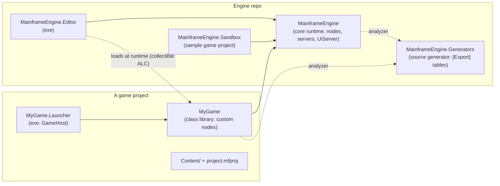
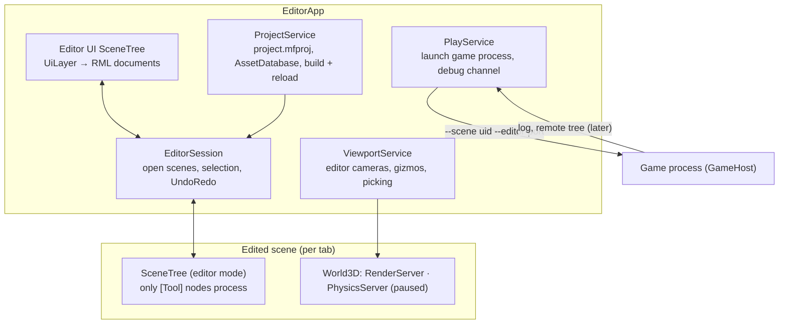
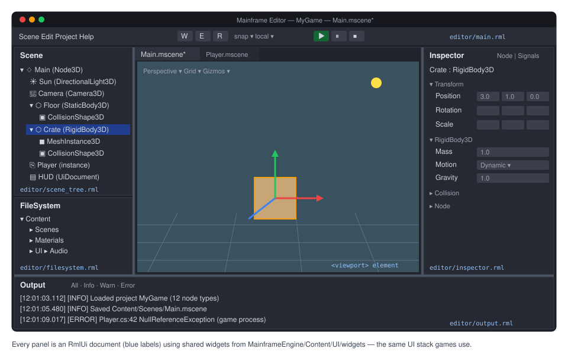
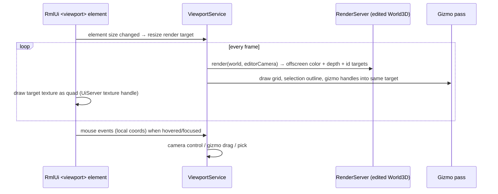

# Proposal: Mainframe Editor

**Milestone:** M10 · **Status:** ⬜ planned · **New project:** `MainframeEngine.Editor` (exe) →
references `MainframeEngine` · **Depends on:** [Node system](node-system.md),
[Scene serialization](scene-serialization.md), [Materials & meshes](materials-and-meshes.md) (render
targets), [Game UI (RmlUi)](game-ui.md), [SDL windowing](sdl-windowing.md)

## Problem

Every scene is built in C# and tuned by recompiling. A Godot-style editor needs four things:
- a node tree it can edit;
- a file format to save to;
- a viewport into the scene;
- an inspector driven by node metadata.

The first two come from M2. This proposal designs the editor application itself.

## Goals

- A separate **`MainframeEngine.Editor`** csproj whose only engine dependency is the `MainframeEngine`
  core library. There is no editor code in the runtime.
- **The editor UI is built with the same UI system as games:** RmlUi through the engine's `UiServer`,
  with RML/RCSS documents. The editor dogfoods the game UI. Editor widgets (property editors, tree
  view, splitters) live in a shared UI module, so games can use them too.
- Godot-like workflow: scene tree, inspector, viewport with gizmos, file system browser, output log,
  play/stop, undo/redo.
- Open a **game project**, load its C# node types, and edit scenes that use them.
- **Play** the scene in a separate game process so a game crash never takes the editor down.

## Non-goals (v1)

Visual scripting, animation timeline, terrain/particle editors, plugin marketplace, multi-window
docking, and console builds.

## Solution layout

- **`GameHost : Engine`** is a new, non-abstract host in core. It reads `project.mfproj` (name, main
  scene, window, physics tick rate, input map), loads the main scene and lets the `SceneTree` run the
  frame. With it, games no longer need to subclass `Engine`, although subclassing still works.
- **`EditorApp : Engine`** is the editor's host. It owns the editor `SceneTree` (the editor UI) plus
  one **edited-scene world** per open scene tab.

## Architecture

### Edit mode vs play mode

| | Edit mode (in editor) | Play mode |
|---|---|---|
| Where | edited `SceneTree` inside the editor process | separate `GameHost` process |
| `OnProcess` / `OnPhysicsProcess` | only nodes marked `[Tool]` | all nodes |
| Physics | world exists (for picking/gizmos) but does not step | steps normally |
| Audio | muted unless previewing | normal |
| Static state | isolated per world where possible | fresh process |

Play mode is **out-of-process**, as in Godot:
1. The editor saves dirty scenes.
2. It runs `dotnet build` on the game project if sources changed.
3. It launches `MyGame.Launcher --scene <uid> --editor-port <n>`.
4. A localhost TCP debug channel streams `Log` output back to the editor. A remote scene tree
   inspector comes later.

This avoids the engine's static state (for example the `NodeId` counter) leaking between runs, and a
game crash cannot corrupt the editor.

## UI (RmlUi)

| Panel | Document | Content |
|---|---|---|
| Menu bar + toolbar | `editor/main.rml` | Scene, Edit, Project, Help · play ▶ / pause ⏸ / stop ⏹ · transform mode W/E/R · snap · local/global |
| Scene tree | `editor/scene_tree.rml` | node hierarchy with icons; drag to reparent; right-click: add child, instance scene, rename, delete, duplicate |
| File system | `editor/filesystem.rml` | `Content/` tree from `AssetDatabase`; drag scenes, meshes or sounds into the tree or viewport |
| Viewport | `editor/viewport.rml` | tabs per open scene; `<viewport>` element showing the edited world's render target |
| Inspector | `editor/inspector.rml` | `[Export]` properties of the selection grouped by `[ExportGroup]`; Signals tab |
| Output | `editor/output.rml` | `Log` sink with level filters and click-through to `file:line` |

- **Layout v1:** fixed regions with draggable splitters (a `<splitter>` element). Sizes persist in
  `~/.mainframe/editor_layout.json`. Docking and tear-off are later.
- **Theme:** `editor/theme.rcss`, a dark theme matching the docs palette. Icons are an SVG/PNG atlas.
- **Data binding:** panels use RmlUi data models, for example `scene_tree` bound to a flattened tree
  view model and `inspector` bound to a property list. See [Game UI → data binding](game-ui.md#data-binding).
- **Shared widgets** in `MainframeEngine/Content/UI/widgets/`: `tree-view`, `property-*` editors (number
  with drag, vector3, color picker, enum dropdown, resource slot, node path), `splitter`, `tabs`,
  `context-menu`. These are the same components a game's settings menu can use.
- ImGui remains available as a developer overlay (F12) for engine debugging. It is never used for
  editor features.

## Viewport

- **Render target:** each viewport owns color, depth and an **object-ID target** (`R32_UINT`, the
  node's `NodeId`). This needs offscreen render-target support from
  [M3](materials-and-meshes.md). The color target is registered with `UiServer` as a texture handle,
  and the `<viewport>` element draws it.
- **Editor camera:** independent of the scene's `Camera3D`.
  - Fly: hold RMB + WASD/QE, like the Sandbox.
  - Orbit: Alt+LMB or MMB.
  - Pan: Shift+MMB.
  - Zoom: wheel.
  - Focus the selection: F.
  - Perspective/orthographic toggle; top/front/side views.
- **Picking:** read back the ID target pixel under the cursor (one frame of latency, staged copy). The
  result is exact for meshes, Spine and billboards. Box selection reads a region.
- **Gizmos:** translate, rotate and scale handles, drawn in an overlay pass with depth test off.
  - Handle hit-testing uses screen-space distance to projected axes or rings.
  - Snapping: grid step, angle step and scale step.
  - Local or global space.
- **Editor-only visuals:** grid (`SceneGrid3D`), light and camera icons, collision shape wireframes,
  audio range spheres, camera frusta. They are drawn by `ViewportService` and never saved.
- **2D scenes:** an orthographic camera, a 2D grid and 2D gizmos, used for scenes whose root is a `Node2D`.

## Inspector

- The selection's `NodeTypeInfo` (from the [source generator](scene-serialization.md#property-model))
  provides the property list. The inspector shows one row per `[Export]` property, with a widget
  chosen from the property type and hints.
- Multi-selection shows common properties. Mixed values display as "—".
- Resource properties show an inline sub-inspector (expand), a "Make unique" action and "Save as .mres".
- **Signals tab:** lists `[Signal]` events, then shows a connect dialog where you pick the target node
  and a compatible method. Connections are serialized in the scene.
- **Custom inspectors:** `[CustomInspector(typeof(MyNode))]` classes in a game assembly can add RML
  sections. This is the plugin hook.

## Undo / redo

- `UndoRedo` holds a history of `IEditorAction` (`Do`/`Undo`), per scene tab.
- Actions: `SetProperty`, `AddNode`, `RemoveNode` (keeps the subtree for undo), `Reparent`, `Rename`,
  `MoveInTree`, `InstanceScene`, `ConnectSignal`.
- **Merging:** continuous edits (gizmo drag, number drag) merge into one action by key until the mouse
  is released.
- Tab titles show `*` when the history position differs from the last save.

## Game project and code reload

- **Open project:** read `project.mfproj` → scan `Content/` → `dotnet build MyGame.csproj` → load
  `MyGame.dll` into a **collectible `AssemblyLoadContext`** → register its `NodeTypeInfo`s.
- **Reload on rebuild:** a `FileSystemWatcher` on the source folder sets a "rebuild needed" badge.
  Rebuilding then:
  1. serializes all open scenes to memory;
  2. unloads the ALC (all references to game types must be dropped first);
  3. loads the new assembly;
  4. re-instantiates the scenes from memory.
- Unknown types (a class was deleted or renamed) load as a placeholder `MissingNode` that keeps its
  serialized properties, so no data is lost. This mirrors Godot's handling of missing scripts.
- **New project wizard:** creates the csproj pair from templates (`dotnet new`-style), `project.mfproj`,
  `Content/Scenes/Main.mscene`.

## Engine changes this requires

| Change | Where | Reason |
|---|---|---|
| Multiple worlds per process (`World3D` instances) | [Node system](node-system.md#servers) | edited scene separate from editor UI |
| Offscreen render targets + object-ID pass | [Materials & meshes](materials-and-meshes.md) / RenderServer | viewport and picking |
| `UiServer` can wrap an engine texture as an RmlUi texture | [Game UI](game-ui.md) | `<viewport>` element |
| `ILogSink` on `Log` | `Debugging/Log.cs` | Output panel and debug channel |
| `GameHost` + `project.mfproj` | core | play mode and shipping games without a subclass |
| `[Tool]` attribute respected by `SceneTree` in editor mode | Node system | edit-time behaviour |

## Phases

| Phase | Deliverable |
|---|---|
| E1 · Shell | `MainframeEngine.Editor` csproj, `EditorApp`, RmlUi layout with splitters, menu bar, Output panel, open/save `.mscene` |
| E2 · Tree + Inspector | scene tree panel (add/remove/rename/reparent), inspector with property widgets, undo/redo |
| E3 · Viewport | render target in `<viewport>`, editor camera, grid, ID picking, selection outline, transform gizmos with snapping |
| E4 · Project + Play | open/new project, game assembly load and reload, file system panel with drag-drop, out-of-process play/stop with log streaming |
| E5 · Polish | signals tab, multi-select, resource sub-inspectors, 2D editing, custom inspectors, layout persistence |

## Task list

- [ ] Add the `MainframeEngine.Editor` project to the solution (refs `MainframeEngine` only)
- [ ] `EditorApp : Engine`; `GameHost : Engine` + `project.mfproj` in core
- [ ] Shared RmlUi widgets (`tree-view`, `property-*`, `splitter`, `tabs`, `context-menu`) in core content
- [ ] Editor documents + theme
- [ ] `EditorSession` (open scenes, selection, `UndoRedo`)
- [ ] `ViewportService`: render targets, editor camera, ID picking, gizmos
- [ ] `ProjectService`: `AssetDatabase`, build, collectible ALC reload, `MissingNode`
- [ ] `PlayService`: launch game, debug channel, log streaming
- [ ] `ILogSink` + Output panel
- [ ] Docs: editor user guide + current-state design doc once E1 lands

## Open questions

- Should the editor support an in-process "simulate" mode (physics and scripts in the edited world)
  in addition to out-of-process play?
- Should the editor itself be a `GameHost` project (scene-driven UI), or code-driven? Default:
  code-driven `EditorApp` with RML documents.
- How should multiple editor windows (multi-monitor) work once SDL multi-window is available?

## Related

[Milestones](../../milestones.md) · [Node system](node-system.md) · [Scene serialization](scene-serialization.md) ·
[Game UI](game-ui.md) · [Materials & meshes](materials-and-meshes.md) · [SDL windowing](sdl-windowing.md)
