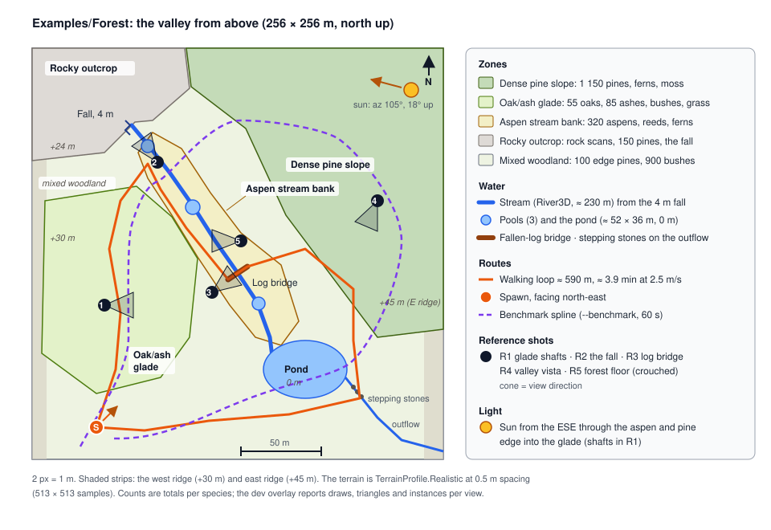
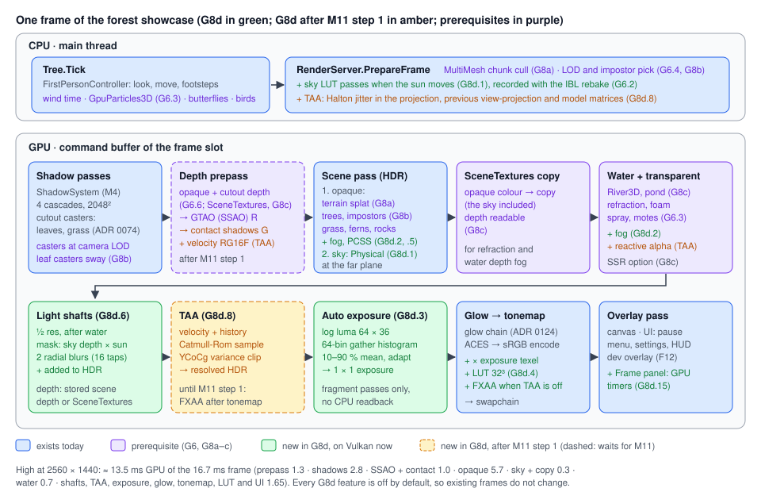

# Proposal: Forest showcase (Examples/Forest: a first-person walk through a forest, plus the rendering it needs)

**Milestone:** [Gameplay toolkit](../../milestones.md#gameplay-toolkit-) (G8d) · **Status:** ⬜ planned ·
**Depends on:** [Rendering features](rendering-features.md) (G6.1 PBR, G6.2 IBL, G6.3 particles, G6.4 LOD; G6.6 SSAO),
[Terrain](terrain.md) (G8a, Realistic profile), [Procedural trees](procedural-trees.md) (G8b, Realistic style),
[Water](water.md) (G8c: `River3D`, `SceneTextures`); TAA and contact shadows also on step 1 of
[M11 backend abstraction](rendering-backend-abstraction.md) · **Related:** [Demo](../demo.md),
[Demo download](demo-download.md), [Save games and settings](save-and-settings.md) (G4: the settings menu),
[ADR 0149](../../../memory/decisions/0149-terrain-trees-water-engine-features.md)



## Problem

Brogan asked for "a demo of a AAA or AA scene … a FPS walking sim in a small forest setting with streams of water", to
show that the engine can render at the level people expect from Unreal or Unity. Nothing in the engine or its examples
does that today.

- **The only example is a feature gallery.** [`Examples/Demo`](../demo.md) has one small scene per feature. It has no
  free camera (`docs/design/cameras-and-input.md:126-131`), and no file in `MainframeEngine/`, `Examples/` or
  `Templates/` implements a first-person controller.
- **G6 and G8a–c supply content features, not the frame.** PBR, IBL, LOD, particles and SSAO
  ([G6](rendering-features.md)), terrain ([G8a](terrain.md)), trees ([G8b](procedural-trees.md)) and water
  ([G8c](water.md)) are planned. G6 lists TAA, volumetric fog and SSR as non-goals ([rendering-features.md →
  Non-goals](rendering-features.md#non-goals)).
- **No anti-aliasing.** The scene target and the swapchain are single-sample
  (`MainframeEngine/Src/Rendering/Vulkan/RenderTarget.cs:254`,
  `MainframeEngine/Src/Rendering/Vulkan/VulkanRenderer.Presentation.cs:214`). A forest is mostly alpha-cut leaves and
  grass, which alias badly without it.
- **Fixed exposure, no grading.** Exposure is one push constant
  (`MainframeEngine/Content/Shaders/Post/TonemapPost.vk.frag.slang:123`) from `IVulkanContext.Exposure`
  (`MainframeEngine/Src/Rendering/Vulkan/IVulkanContext.cs:134`); [color-pipeline.md → Known
  issues](../color-pipeline.md#known-issues) lists "No auto-exposure". Nothing follows ACES.
- **No fog.** No shader or source file implements fog (the only match is a comment,
  `MainframeEngine/Src/Imaging/Bitmap.cs:6`).
- **The sky has no atmosphere.** `SkyEnvironmentType` is `Procedural`, `Panoramic` or `Cubemap`
  (`MainframeEngine/Src/Rendering/Sky/SkyEnvironmentType.cs:3`). The gradient sky has its own `SunDirection`
  (`MainframeEngine/Src/Scene/Nodes3D/WorldEnvironment.cs:313`), unrelated to any `DirectionalLight3D`
  (`MainframeEngine/Src/Scene/Nodes3D/Light3D.cs:136`).
- **Hard-edged sun shadows.** Four-cascade CSM with a fixed-radius Poisson PCF; [shadow-system.md → Known
  issues](../shadow-system.md#known-issues) says "No contact-hardening (PCSS), EVSM or screen-space contact shadows"
  ([ADR 0072](../../../memory/decisions/0072-pcf-and-receiver-bias.md)).

What exists and is enough: `CharacterBody3D` with `Velocity`, `FloorSnapLength` and `MoveAndSlide()`
(`MainframeEngine/Src/Physics/3D/CharacterBody3D.cs:40`, `:75`, `:153`); `RayCast`, `ShapeCast` and `IntersectShape`
(`MainframeEngine/Src/Physics/3D/PhysicsDirectSpaceState3D.cs:47`, `:75`, `:107`); `Input.MouseMode = Captured`
(`MainframeEngine/Src/Scene/Input/InputState.cs:19`, ADR 0125) and gamepad axes in the input map; `AudioPlayer3D`, buses
and an allocation-free reverb (`MainframeEngine/Src/Audio/AudioBusLayout.cs:139`); glow and the Godot tonemap
(`MainframeEngine/Src/Rendering/Post/GlowEffect.cs`, ADR 0124); allocation gates
(`Tests/MainframeEngine.RenderTests/SceneTests.cs:191`, `:433`); the Demo's release zip (`build/package-demo.sh`, the
`demo` job at `.github/workflows/publish.yml:109`).

## Goals

- **`Examples/Forest`**, a standalone mfgame project like the Demo: a 256 × 256 m valley with a stream, a waterfall,
  pools, a fallen-log bridge, a pond and four forest zones, walked in first person on a 3–5 minute loop.
- **`FirstPersonController`** (Forest code): mouse look, WASD, sprint, crouch, jump, head bob, footsteps per terrain
  surface, wading, gamepad, FOV and sensitivity settings.
- **A concrete quality bar**: UE5/HDRP forest techniques mapped to the phases that provide them, and five reference
  shots.
- **The rendering G6 and G8a–c do not cover** (G8d.1–G8d.8), with Godot-style settings: physical sky, height fog with
  sun in-scattering, light shafts, auto exposure, LUT grading, FXAA, TAA, soft sun shadows and contact shadows.
- **Measured budgets**: 2560 × 1440 at 60 fps on High (Apple M-series Pro on MoltenVK, RTX 3060-class PC), a Medium
  tier, 0 B per frame, and a `--benchmark` fly-through that writes frame-time percentiles.
- CC0 and procedural content (the Forest's code and scenes are MIT), a release zip, README screenshots and a cut-down
  forest render golden on both drivers.

## Non-goals

- Global illumination (Lumen-style GI, probe volumes, baked lightmaps). Indirect light is the sky's IBL (G6.2) plus SSAO
  (G6.6), and the scene is lit to suit that: an open canopy and a low sun. This is the largest gap to Unreal 5.
- Virtual geometry (Nanite), virtual shadow maps, ray tracing, GPU-driven rendering, compute shaders
  ([why](#no-compute-and-no-gpu-driven-culling)).
- Volumetric clouds, weather, a day-night cycle (the sun can move and the sky follows, but the showcase is one morning).
- Depth of field, motion blur, upscaling (FSR, TAAU), HDR display output, VR.
- Gameplay: NPCs, animals with AI, interaction, objectives. Butterflies and birdsong are ambience.
- A first-person controller in the engine ([decision 1](#decisions)), and any change to the Demo.

## Design

### The project: `Examples/Forest`

```
Examples/Forest/
├── Forest.slnx, Directory.Build.props, global.json, .gitignore, .gitattributes, NOTICE.md   (as in the Demo)
├── project.mfproj            "Mainframe Forest": main scene, input map, rendering, audio, autoload Hud
├── Forest/                   node library: Src/{Player, World, Audio, Ambience, Ui, Benchmark, Shots}
├── Forest.Desktop/           GameHost.Run(args, typeof(Forest.FirstPersonController).Assembly) + --write-terrain
├── Forest.Tests/             xUnit v3; no GPU and no LFS content needed
└── Content/                  Scenes/ (forest.mscene, forest_terrain/), Terrain/Layers/, Trees/ (TreeOptions, impostors,
                              bark, leaves), Foliage/, Props/{Rocks,Logs}/, Sky/ (HDRI, .cube), Audio/, UI/, Settings/,
                              locale/ (en + qps)
```

- **Not in `MainframeEngine.slnx`.** It builds through `Forest.slnx` with `MainframeEnginePath = ../..`, like the Demo
  ([demo.md → Purpose](../demo.md#purpose)).
- **Authored in the editor.** The Demo builds its scenes in C#; the Forest also showcases the Terrain dock (G8a), so it
  is sculpted, painted and scattered by hand. A deterministic `ValleyGenerator` (`Forest.Desktop -- --write-terrain`)
  writes only the starting height field: ridges, valley floor, outcrop, the stream bed carved along the `River3D`
  spline and the pond basin. After that the committed `forest.mscene` and `forest_terrain/` are the source of truth;
  there is no byte-for-byte scene contract.
- **`project.mfproj`**: main scene `forest`, window 1600 × 900, `rendering.antiAliasing = Taa`, `rendering.shadows =
  High`, the [input map](#input-and-settings), the [bus layout](#audio) and an autoload `Hud` (pause menu, settings,
  benchmark overlay).
- **`just` recipes** (new, next to `demo`): `forest *args` runs `dotnet run --project Examples/Forest/Forest.Desktop -c
  Release -- {{args}}` (Release, because Debug is not representative); `forest-screenshots frames="300"` runs
  `build/forest-screenshots.sh` (the five reference shots into `docs/images/forest`, display awake); `forest-bench
  *args` runs `build/forest-bench.sh` (fly the benchmark spline, compare with this machine's baseline, quiet machine
  only).

#### LFS and the asset budget

Binary content is Git LFS through `Examples/Forest/.gitattributes`, a copy of `Examples/Demo/.gitattributes` plus
`*.hdr`, `*.exr` and `*.cube` (text, but large). The root `.gitattributes` has no `*.hdr` rule.

| Budget | Limit | Estimate |
|---|---|---|
| Repository (LFS objects under `Examples/Forest`) | **≤ 400 MB** | ≈ 250 MB: terrain layers 55, rocks 55, impostors 40, HDRI 25, logs 22, bark and leaves 15, audio 15, UI 10, terrain data 5, other 8 |
| Release zip | ≤ 300 MB | JPG, OGG and PNG barely compress further |
| Extracted | **≤ 1 GiB** | ≈ 260 MB; the same cap as the [Demo download](demo-download.md)'s extraction |
| README screenshots (`docs/images/forest/`, root LFS) | ≤ 15 MB | five 1600 × 900 PNGs |

Albedo and ORM are JPG (ambientCG's `-JPG` packs); normal maps are PNG only where JPG blocks show in a reference shot;
alpha cards are PNG. **CI never needs the content:** `Forest.Tests` uses synthetic terrain and the render golden is
built from engine test assets ([Testing](#testing)). Only the release job and local runs pull `Examples/Forest/**`, as
the publish workflow already does for the Demo (`publish.yml:72`, `:83`, `:118`). `NOTICE.md` follows
`Examples/Demo/NOTICE.md` (asset, path, source URL, author as a courtesy, licence), and a test fails when a file under
`Content/` is neither listed nor generated.

#### Release

`build/package-demo.sh` becomes `build/package-example.sh <Demo|Forest> <version> <out>` (`package-demo.sh` stays as a
wrapper). `publish.yml` gains a `forest` job next to `demo` (lines 109–125): `git lfs pull
--include="Examples/Forest/**"`, `build/forest-smoke.sh` on lavapipe, then `MainframeEngine.Forest-v<version>.zip` and
`MainframeEngine.Forest.zip` (top folder `MainframeEngine.Forest/`), attached by the existing release step. The
[Download Demo](demo-download.md) dialog gets an example picker (Demo or Forest); its validation already accepts any
project with `project.mfproj`, a `*.Desktop` project and `Content/Scenes/`. Self-contained player builds are [open
question 6](#open-questions).

### The scene

A 256 × 256 m valley (`TerrainProfile.Realistic`, 0.5 m spacing, 513 × 513 samples) runs north to south: the west ridge
is +30 m, the east ridge +45 m, the rocky outcrop in the north-west +24 m, and the floor falls to the pond at 0 m. The
**stream** (`River3D`, G8c, ≈ 230 m of spline) starts at a 4 m fall off the outcrop, steps down through three pools,
passes under a fallen-log bridge and enters the **pond** (`TerrainData` water layer, ≈ 52 × 36 m). A small outflow
leaves the pond to the south-east; the path crosses it on stepping stones. **Sun:** a morning sun at azimuth 105°
(east-south-east), elevation 18°, shining through the aspen and pine edge into the glade.

| Zone | Area | Character | Main content |
|---|---|---|---|
| Dense pine slope | NE and E slope, ≈ 1.9 ha | Dark and steep, needle floor, shafts at its western edge | pines, ferns, moss, a few boulders |
| Oak/ash glade | W centre, ≈ 1.2 ha | Open canopy, long grass and flowers, sun shafts, butterflies | oaks, ashes, bushes, meadow grass |
| Aspen stream bank | middle stream, ≈ 0.8 ha | Bright trunks, trembling leaves, wet ground | aspens, ferns, reeds by the pools, mud and gravel |
| Rocky outcrop | NW corner, ≈ 0.7 ha | Cliffs, the fall, sparse pines | rock scans, moss, gravel scree |
| Pond | S, ≈ 0.15 ha of water | Still water, reeds, reflections | reeds, mud shore, logs |

#### Trees (Ez Tree presets, G8b Realistic style)

Variants are presets × seeds; each variant has one impostor atlas. Distances are nominal at 2560 × 1440 and a 70°
vertical FOV: G6.4 picks levels by projected error, so they scale with resolution and `LodBias`.

| Species | Variants | Count | Where | LOD0 | LOD1 | LOD2 | Impostor |
|---|---|---|---|---|---|---|---|
| Pine | `pine_small/medium/large` × 2 seeds (6) | 1 400 | slope 1 150, outcrop 150, edges 100 | < 20 m, ≤ 40k tris | 20–50 m, ≤ 12k | 50–110 m, ≤ 3k | > 110 m |
| Oak | `oak_medium/large` (2) | 55 | glade | < 25 m, ≤ 60k | 25–60 m | 60–130 m | > 130 m |
| Ash | `ash_medium/large` (2) | 85 | glade edge | < 25 m, ≤ 50k | 25–60 m | 60–130 m | > 130 m |
| Aspen | `aspen_small`, `aspen_medium/large` × 2 seeds (5) | 320 | stream bank | < 18 m, ≤ 30k | 18–45 m | 45–100 m | > 100 m |
| Bush | `bush_1/2/3` (3) | 900 | glade understorey, edges | < 15 m | 15–40 m | — | culled > 70 m (visibility range) |

Bark is ambientCG Bark001 (oak, ash), Bark002 (aspen) and Bark003 (pine), as the presets use, at 1K (it tiles along the
trunk). Leaves are Ez Tree's `ash`, `aspen`, `oak` and `pine` PNGs (MIT). Wind: `WorldEnvironment.WindDirection` from
the east, `WindStrength` 0.3, gusts from `WindTurbulence`; aspens get the strongest leaf flutter through G8b's
per-species settings. Trees are scattered through G8a `MultiMesh` chunks from painted density maps; hero trees at the
reference shots are placed by hand.

#### Ground cover and props

| Item | Source | Density or count | Draw distance (High / Medium) |
|---|---|---|---|
| Meadow grass | generated blade clumps (G8a `FoliageType`, no alpha texture) | 6 / m² in the glade, 3 / m² in other open ground | 35 m / 22 m, density fade over the last 10 m |
| Reeds | generated blade clumps | 8 / m² in a 2 m band at the pond and pools | 40 m / 25 m |
| Ferns | CC0 fern scan (Poly Haven) or generated fronds | 0.6 / m² on the pine floor and stream bank | 45 m / 30 m |
| Flowers | generated cards | 0.3 / m² in the glade | 25 m / 15 m |
| Rocks | Poly Haven scans: 3 boulder or cliff pieces at 2K, 5 small rocks at 1K | ≈ 260 instances | `_LODn` or the G6.4 simplifier |
| Fallen logs | Poly Haven dead-trunk scans (2 models, 2K) | 14, including the bridge | — |

Exact Poly Haven and ambientCG asset IDs are chosen in G8d.11–12 and recorded in `NOTICE.md`. Collision: trunk capsules
(G8b), convex hulls for rocks and logs, a walkable box on the bridge log, six stepping stones, and invisible
`StaticBody3D` walls behind the ridges; grass, ferns, reeds and flowers have none.

#### Terrain layers (ambientCG, `TerrainLayer`, G8a)

G8a's `Texture2DArray` needs equal sizes, so all six layers are 2048² with full mips in three arrays (albedo sRGB,
normal, ORM). The height for height blending comes from ambientCG's displacement map, packed where G8a puts it.

| Layer | ambientCG category (ID in `NOTICE.md`) | Resolution | Painted where |
|---|---|---|---|
| `moss` | Moss | 2K | pine floor, rock bases, around the bridge |
| `leaf_litter` | Ground, forest leaves | 2K | glade, aspen bank |
| `dirt` | Ground, dirt | 2K | the path, steep earth |
| `rock` | Rock | 2K | outcrop, any slope over 40° (slope rule) |
| `gravel` | Gravel | 2K | stream bed, pools, path edges |
| `mud` | Ground, wet mud | 2K | within 1.5 m of water |

The path is painted dirt with gravel edges, so the ground shows the way without signs.

#### Sky: physical by default, HDRI as an option

The default is **`Sky.Mode = Physical`** ([G8d.1](#g8d1-physical-sky)) with the morning sun: sky, sun disc, fog colour,
shafts and IBL all follow the one `DirectionalLight3D`, so they agree by construction. The option is a Poly Haven
morning forest or meadow **HDRI** (4K `.hdr`, G6.2's float path), chosen in the pause menu (Sky: Physical | HDRI), in a
second `WorldEnvironment` whose light is matched to the HDRI's sun by hand. The HDRI brings real clouds, but its baked
ground shows through canopy gaps at the horizon, which is why it is not the default.

#### Audio

| Layer | Nodes | Bus | Notes |
|---|---|---|---|
| Ambient bed | two `AudioPlayer` loops (wind in pines; birds and leaves) | Ambience | crossfaded by zone weights at the listener |
| Stream | two `AudioPlayer3D` tracking the nearest points on the `River3D` spline | Water | continuous along ≈ 230 m with 2 voices; `MaxDistance` 30 m, `LowPassAtMaxDistance` |
| Fall | `AudioPlayer3D` splash + a low roar layer | Water | `MaxDistance` 80 m |
| Birds | `BirdScheduler`: a pool of 6 `AudioPlayer3D` in the canopy, 10–40 m from the listener | Ambience | Poisson-timed (mean 4 s), species weighted per zone (a woodpecker on the pine slope), no immediate repeats |
| Footsteps, wading | `AudioPlayer3D` at the feet; 6 variations per surface, `PitchRandomness` 0.08 | Foley | [footsteps](#footsteps-and-wading) |

Buses are Master → Ambience, Water, Foley and UI, with a light Freeverb (`AudioEffectReverb`) on Foley; about 16 voices
play at once. Sources are CC0 recordings (Freesound, filtered to CC0 only), each listed in `NOTICE.md`. The Ez Tree
demo's `ambience.mp3` has no stated licence and is not used.

#### Particles and life (G6.3)

Dust motes (additive `GpuParticles3D` billboards in the glade's shaft volume, so the shafts read as volume), spray at
the fall's base (blended, sorted by view depth), and a Forest `Butterflies` node: 24 butterflies with CPU wander
steering, each two wing quads in a `MultiMesh` with a flap angle, in preallocated arrays. Falling leaves are optional
polish.

#### The walking loop

About 590 m, 3.9 minutes at the 2.5 m/s walk speed (≈ 2 minutes sprinting). From the spawn in the south-west, facing
north-east: north through the glade (shafts, butterflies), up to the falls viewpoint below the outcrop, down the west
bank past the pools, across the log bridge, east into the edge of the pine slope, down to the pond's east shore, over
the outflow's stepping stones, and west along the south shore to the spawn. The path never needs a jump. The map shows
it, with reference shots R1–R5 on or near it.

### `FirstPersonController`

Forest code (`Forest/Src/Player/`), Godot-shaped and allocation-free:

```csharp
public class FirstPersonController : CharacterBody3D             // Forest code; promotion: decision 1
{
    [Export] public float WalkSpeed { get; set; } = 2.5f;          // m/s
    [Export] public float SprintSpeed { get; set; } = 5f;
    [Export] public float CrouchSpeed { get; set; } = 1.3f;
    [Export] public float Acceleration { get; set; } = 14f;        // m/s² on the floor
    [Export] public float JumpVelocity { get; set; } = 4.2f;       // ≈ 0.9 m at 9.8 m/s²
    [Export] public float StandingHeight { get; set; } = 1.75f;
    [Export] public float MouseSensitivity { get; set; } = 0.1f;   // degrees per mouse count
    [Export] public float GamepadLookSpeed { get; set; } = 140f;   // degrees per second at full deflection
    [Export(Range = "60,110,1")] public float HorizontalFov { get; set; } = 90f;   // to Camera3D.Fov (vertical)
    [Export] public bool HeadBob { get; set; } = true;
    [Export] public NodePath Terrain { get; set; }                 // the Terrain3D for SurfaceAt
    [Export] public FootstepSet[] Footsteps { get; set; } = [];    // per TerrainLayer name, plus "wood" and "water"
    [Signal] public event Action<string>? Footstep;               // surface name; the HUD and tests listen
    // also: AirControl 0.3, CoyoteTime 0.1 s (also the jump buffer), CrouchHeight 1.1 m, InvertY,
    //       HeadBobAmount 0.035 m, StrideLength 0.75 m (one footstep per stride at walk speed)
}
```

- **Structure.** A capsule body; a `Head` `Node3D` at eye height (top − 0.12 m) holding the `Camera3D`; a `Feet`
  `AudioPlayer3D`.
- **Look.** `OnInput` applies `InputEventMouseMotion.Relative` while `Input.MouseMode == Captured` (yaw on the body,
  pitch on the head, clamped to ±89°), per event for the lowest latency. The right stick is read in `OnProcess` with a
  0.15 radial deadzone and a squared response curve. The mouse is captured at start and on a click after pausing; Escape
  or Start opens the pause menu and sets `Visible`. A captured mouse is not released on focus loss ([known
  issue](../cameras-and-input.md#known-issues)); the pause menu does not depend on it.
- **Move.** `OnPhysicsProcess` reads `Input.GetVector("move_left", "move_right", "move_forward", "move_back")`, turns it
  into a velocity in the body's yaw frame, accelerates towards the target speed (sprint, crouch or wading scaled),
  applies gravity and the jump (coyote time, jump buffer), then calls `MoveAndSlide()`. `FloorSnapLength` 0.3 m keeps
  the walk glued to bumps; `FloorMaxAngle` 45° lets steep ridges stop the player without invisible walls inside the
  valley.
- **Crouch.** The capsule swaps to the crouch height and the head eases down over 0.15 s. Standing up first checks the
  space with `DirectSpaceState.IntersectShape` (preallocated result list); if blocked, the player stays crouched.
- **Head bob.** A sine of the distance walked: vertical at the stride frequency, sideways at half of it, scaled by
  speed, easing out when stopping, and switchable off for players prone to motion sickness. Its phase triggers
  footsteps.

#### Footsteps and wading

A footstep asks `Terrain3D.SurfaceAt(position)` for the dominant `TerrainLayer` and picks the `FootstepSet` by layer
name (`moss`, `leaf_litter`, `dirt`, `rock`, `gravel`, `mud`). When the floor collider from `MoveAndSlide` is not the
terrain, a `surface` metadata string on that body wins: the bridge log is `wood`, rocks are `rock`. For water the
controller uses G8c's world queries (`GetWorld3D().Water`, which covers the pond and the `River3D` stream alike;
`Terrain3D.WaterDepthAt` alone sees only the terrain's water layer):

- `WaterDepthAt(feet) ≥ 0.05` m: footsteps use the `water` set and a wading loop plays, its volume scaled by speed;
- move speed × `WaterQueries.WadeSpeedScale(ImmersionAt(feet))` (G8c's defaults: 1 down to 0.4 between 0.3 m and
  1.2 m of immersion), so knee-deep water slows the walk;
- at 1.2 m immersion the player cannot go deeper (no swimming): the pond's deep centre acts as a soft wall.

Sets load when the controller enters the tree; variations come from the tree's seeded RNG, never the same file twice in
a row.

#### Input and settings

Input actions (`project.mfproj`, keyboard and mouse / gamepad): `move_forward/back/left/right` (WASD / left stick),
`look_*` (mouse / right stick), `sprint` (Shift held / left stick press toggles), `crouch` (C or Ctrl held / B or
Circle toggles), `jump` (Space / A or Cross), `pause` (Escape / Start) and `photo`, which hides the HUD (F2 / View).

The pause menu's settings page stores values in [G4](save-and-settings.md)'s `UserSettings` when it has shipped,
otherwise in a small Forest JSON file in user data: horizontal FOV (`game.fov`, 60–110°, default 90°), mouse
sensitivity and invert Y (`game.mouseSensitivity`, `game.invertY`), gamepad look speed (`game.padLookSpeed`), head bob
(`game.headBob`), quality preset (`game.quality`: High, Medium, see [Budgets](#budgets)), anti-aliasing
(`display.antiAliasing`), shadows (`display.shadows`, G4) and bus volumes (`audio.volume`, G4).

### The quality bar: "looks like UE or Unity"

| # | Technique in UE5/HDRP forest scenes | Here | Phase |
|---|---|---|---|
| 1 | PBR (GGX), image-based lighting from the sky | metallic-roughness `StandardMaterial3D`, radiance cube | G6.1, G6.2 |
| 2 | Physically based sky and sun (SkyAtmosphere, HDRP Physically Based Sky) | `Sky.Mode = Physical` | **G8d.1** |
| 3 | Exponential height fog with sun in-scattering | `WorldEnvironment` fog | **G8d.2** |
| 4 | Light shafts | screen-space `LightShafts` (froxel fog: decision 2) | **G8d.6** |
| 5 | Eye adaptation | `AutoExposure` histogram | **G8d.3** |
| 6 | Filmic tonemap, bloom, LUT grading | ACES (ADR 0006), glow (ADR 0124), `ColorGradingLut` | exists, **G8d.4** |
| 7 | Temporal AA (TAA, TSR, DLAA) | `AntiAliasing.Taa`; FXAA fallback | **G8d.8**, G8d.4 |
| 8 | Cascaded soft shadows with contact hardening | CSM + PCSS filter | M4, **G8d.5** |
| 9 | Screen-space contact shadows | `ContactShadows` | **G8d.7** |
| 10 | Ambient occlusion (GTAO) | SSAO | G6.6 |
| 11 | Layered terrain with height-blended PBR layers | `TerrainSplatMaterial3D` | G8a |
| 12 | Dense instanced foliage with LOD | `MultiMesh`, `FoliageType`, LOD | G8a, G6.4 |
| 13 | Trees with wind, two-sided translucency, LODs, impostors | `FoliageMaterial3D`, `TreeImpostor` | G8b |
| 14 | Water: flow, refraction, depth colour, foam, reflections | `River3D`, `WaterMaterial3D`, SSR option | G8c |
| 15 | Particles: dust, spray, insects | `GpuParticles3D` | G6.3 |
| 16 | Spatial audio, reverb, ambience | `AudioPlayer3D`, buses, Freeverb | exists (M7) |
| 17 | Dynamic GI (Lumen, APV) | **not provided**: sky IBL + SSAO, open canopy | non-goal |
| 18 | Nanite, virtual shadow maps | **not provided**: LOD + impostors + CSM | non-goal |

#### Reference shots

Five fixed poses (`Forest/Src/Shots/ReferenceShots.cs`, `--shot <n>`) with a fixed time, wind phase and frame count, so
they are deterministic. They are the README images and the sign-off for "looks like UE or Unity": Brogan reviews them
next to comparable Unreal and Unity sample-scene screenshots (not committed).

| Shot | Pose | Must show |
|---|---|---|
| **R1 Glade shafts** | in the glade at eye height, looking east into the low sun through the aspen and pine edge | shafts with dust motes; fog in-scattering towards the sun; back-lit leaves; no aliasing on thin branches against the sky; exposure that keeps sky and shade readable |
| **R2 The fall** | at the first pool, looking north-west up the fall | flow and foam; refraction and depth colour in the pool; wet rock at the waterline; spray; rock scan detail with contact shadows |
| **R3 Log bridge** | west bank, 12 m from the bridge, looking at it across the pool | the log's PBR bark and moss; trees reflected in the water (IBL, optional SSR); mud and gravel height-blend at the edge; ferns |
| **R4 Valley vista** | high on the pine slope, looking south-west to the pond | depth layering through fog and aerial perspective; no visible LOD or impostor pops; stable distant shadows; the physical sky at the horizon |
| **R5 Forest floor** | crouched on the aspen bank, 0.5 m above the ground | grass and fern detail; leaf litter and moss blending; SSAO and contact shadows under leaves; soft shadows widening away from casters |

### Rendering beyond G6 (G8d.1–G8d.8)



- **Defaults.** Every new feature is off by default (`AntiAliasing.None`), so existing scenes and goldens do not change.
- **Root world only.** Post features run for the tree's root world, like glow
  (`MainframeEngine/Src/Servers/RenderServer.cs:427`). The editor viewport (a `SubViewport`) shows the forward-shaded
  fog and physical sky, not shafts, TAA, auto exposure or the LUT; those show in Play.
- **Order.** Shadows, offscreen views, then the depth prepass, as in the engine and G6.6. The sky draws **after** the
  opaques, at the far plane with a less-or-equal depth test: the canopy hides most of it, and drawing it before G8c's
  colour copy keeps it in the water's refraction.
- **Binding budget.** G8d adds one sampler and no sampled image to the mesh fragment stage: 14 images, 9 samplers, 3
  sets ([G6's table](rendering-features.md#binding-budget)). Contact shadows share G6.6's AO image (which becomes R8G8);
  PCSS needs one non-comparison sampler over the cascade array; the sky LUTs are bound only by the sky pipeline; fog
  reads the radiance cube G6.2 binds. The frame UBO (`include/frame.slang`) grows by ≈ 112 B (fog, TAA jitter, previous
  view-projection).

#### G8d.1 Physical sky

A Hillaire-style atmosphere (Hillaire 2020, the model behind Unreal's SkyAtmosphere) in fragment passes:

| LUT | Size, format | When |
|---|---|---|
| Transmittance | 256 × 64, `R16G16B16A16_SFLOAT` | when atmosphere parameters change |
| Multiple scattering | 32 × 32, RGBA16F; 64 directions looped per texel (Hillaire uses a compute reduction) | same |
| Sky view | 192 × 108, RGBA16F, latitude-warped around the horizon | each frame the sun or camera altitude changes |

The sky pass samples the sky-view LUT and adds the sun disc, coloured by the transmittance LUT, so a low sun turns
orange by itself. **The sun is the first `DirectionalLight3D`** in the world (its −Z axis; Godot's rule for sky
shaders); `Sky.SunDirection` applies only without one. Sun radiance = the light's linear colour × `Energy` ×
`EnergyMultiplier`. `SkyRadiance` (G6.2) renders this sky into its cube like any other mode; a moving sun bumps the
sky's version and `Sky.ProcessMode = Automatic` spreads the rebake. `AtmosphereModel` (internal, pure C#) integrates
the same transmittance and single scattering for unit tests and the `sky-physical` render test, as `SkyGridReference`
does for the gradient sky.

```csharp
public enum SkyEnvironmentType { Procedural, Panoramic, Cubemap, Physical }   // Physical is new
```

New `Sky` properties for the physical mode use Godot's `PhysicalSkyMaterial` names and scale Earth's Hillaire constants
(6360 km planet, 100 km atmosphere, 8 km Rayleigh and 1.2 km Mie scale heights, an ozone layer): `RayleighCoefficient`
(2 = Earth), `RayleighColor` (0.3, 0.405, 0.6), `MieCoefficient` (0.005), `MieEccentricity` (0.8), `MieColor`
(0.69, 0.729, 0.812), `Turbidity` (10, scales Mie density), `SunDiskScale` (1), `EnergyMultiplier` (1), plus
`AltitudeMeters` (300, the camera's height above sea level).

**Shaders:** `Sky/Sky.Physical.vk.frag.slang`, `Sky/AtmosphereLut.vk.frag.slang` (one entry point per LUT),
`include/atmosphere.slang`. **Cost:** ≈ 0.2 ms per LUT rebuild (rare), 0.03 ms sky view, ≈ 0.05 ms for the mostly
hidden sky draw. **MoltenVK:** each LUT is one render pass (one encoder), recorded with the offscreen work and ended
through `RenderTarget.End` and its barrier, as the IBL bake is. **M11:** does not wait (fullscreen passes in the
`GlowEffect` pattern, which M11 ports first).

#### G8d.2 Height fog with sun in-scattering

Forward fog, as Godot does it: `include/fog.slang`'s `applyFog(color, worldPos)` runs last in the mesh, terrain,
foliage, water and sky fragment shaders, so transparent surfaces fog correctly and no depth is needed. Density is
distance fog (`FogDensity`) plus exponential height fog integrated analytically along the view ray (`FogHeightDensity`
falloff above `FogHeight`); that is smoother than Godot's per-point height term and keeps its names. Colour starts at
`FogLightColor × FogLightEnergy`, mixes towards the sun's radiance by `pow(saturate(dot(V, L)), 8) × FogSunScatter`, and
towards the sky by `FogAerialPerspective` (the radiance cube at a rough mip in the view direction), so distant hills
take the sky's colour. `FogSkyAffect` scales fog on the sky.

- **`WorldEnvironment`** (Godot 4 names and defaults): `FogEnabled` (false), `FogLightColor` (0.518, 0.553, 0.608),
  `FogLightEnergy` (1), `FogSunScatter` (0), `FogDensity` (0.01), `FogAerialPerspective` (0), `FogSkyAffect` (1),
  `FogHeight` (0), `FogHeightDensity` (0). The Forest: density 0.004, height 2 m, height density 0.15, sun scatter
  0.35, aerial perspective 0.6.
- **Cost:** ≈ 25 ALU per fragment, under 0.2 ms at 1440p. **MoltenVK:** nothing special. **M11:** does not wait.

#### G8d.3 Auto exposure

No compute, so the histogram is gathered in fragment passes and never read back to the CPU:

1. Downsample the resolved HDR image to 64 × 36 `R16_SFLOAT` log2 luminance (2 passes).
2. **Gather histogram:** a 64 × 1 pass where each fragment is one bin and loops over the 2 304 texels, counting those in
   its range as fractions (≈ 150k fetches, ≈ 0.02 ms). No scatter, blending or points, so it ports to any M11 backend.
3. A 1 × 1 pass drops the darkest `AutoExposureLowPercent` and brightest `AutoExposureHighPercent` (Unreal's 10 % and
   90 %), takes the mean, computes `AutoExposureScale / luminance` clamped to `AutoExposureMin/MaxExposure`, adapts with
   `1 − exp(−dt · AutoExposureSpeed)` from the previous value and writes a ping-pong `R32_SFLOAT` 1 × 1. The first frame
   snaps.
4. `TonemapPost` and the glow's first level multiply by that texel; `IVulkanContext.Exposure` and `TonemapExposure`
   become compensation. A host-visible copy one frame slot late feeds the dev overlay; nothing waits on it.

**`WorldEnvironment`:** `AutoExposureEnabled` (false), `AutoExposureScale` (0.4, Godot's), `AutoExposureSpeed` (0.5),
`AutoExposureMinExposure` (0.25), `AutoExposureMaxExposure` (8), `AutoExposureLowPercent` (10),
`AutoExposureHighPercent` (90). Godot keeps these on `CameraAttributes`; the engine has none and post is per root world,
so they sit on `WorldEnvironment`. **Cost:** ≈ 0.06 ms. **MoltenVK:** nothing is blended, so the design does not rely on
`R32_SFLOAT` blending, which Vulkan does not require. **M11:** does not wait.

#### G8d.4 LUT grading, FXAA and the anti-aliasing setting

- **`WorldEnvironment.ColorGradingLut`**: a `Texture2D` 32³ strip (1024 × 32, linear) and `ColorGradingLutStrength`
  (0–1). A `.cube` importer (Resolve, Photoshop and Krita export it) converts any N³ cube to a strip. The LUT applies in
  `TonemapPost` **after** the curve, on the sRGB-encoded value (LUTs are graded on display images), with manual
  interpolation between blue slices; the `SrgbOnly` swapchain path decodes again afterwards
  ([color-pipeline.md → Swapchain](../color-pipeline.md#swapchain)). An identity LUT reproduces the input within ±1. The
  Forest ships `forest_morning.cube`: warm highlights, slightly cooler shade, gentle saturation.
- **`rendering.antiAliasing`** (`RenderingProjectSettings`, `MainframeEngine/Src/Project/ProjectSettings.cs:366`):
  `AntiAliasing { None, Fxaa, Taa }`, default `None`, overridable as a G4 user setting.
- **FXAA** (3.11, quality preset): tonemap writes an `R8G8B8A8_UNORM` intermediate with luma in alpha; FXAA draws it
  into the swapchain and the overlay follows in the same pass. One extra pass, ≈ 0.3 ms at 1440p. It is the fallback
  when TAA is off or not built yet; it cannot fix sub-pixel needles and grass.
- **Shaders:** `Post/Fxaa.vk.frag.slang`, `include/grading.slang`. **M11:** does not wait.

#### G8d.5 Soft sun shadows (PCSS-style CSM)

A new `ShadowSystem.Filter` value, `Pcss`, used on `High` for directional lights whose
`DirectionalLight3D.LightAngularDistance` (Godot's `light_angular_distance`; default 0 = today's behaviour) is above 0;
the Forest's sun uses 0.5°. A 16-tap Poisson blocker search in the cascade layer (through the new non-comparison
sampler, over the light's angular size projected on the cascade's depth range) estimates the penumbra
`(dReceiver − dBlocker) · tan(angle)` in texels; the existing 16-tap Poisson comparison filter then runs at that radius,
clamped to [`FilterRadius`, 8 texels]. Shadows harden at trunk bases and rocks and soften with distance, which is what
makes R5 read as real. Cutout casters (ADR 0074) work unchanged. **Cost:** ≈ +0.4 ms at 1440p over Poisson 16.
**MoltenVK:** two samplers on one depth image is fine; indices stay clamped as `shadows.slang` requires. **M11:** does
not wait (shader code in the existing lookup).

#### G8d.6 Screen-space light shafts

Mitchell's radial blur (GPU Gems 3) at half resolution, after water and before TAA:

1. **Mask:** sky pixels (depth at the far plane) weighted by `smoothstep` on the angle to the sun. Leaves and trunks cut
   the mask, so shafts come from real canopy gaps.
2. **Blur:** two radial passes of 16 taps towards the sun's screen position (256 effective taps), `LightShaftsDecay` per
   tap.
3. **Composite:** added to the HDR colour, tinted by the sun's radiance, scaled by `LightShaftsIntensity` and by the
   fog's sun in-scattering (no fog, no shafts), faded as the sun leaves the screen or goes behind the camera.

Depth comes from `SceneTextures` (G8c); without it, the scene target keeps its own depth (`RenderTarget` `SampleDepth`,
store instead of don't-care), so shafts need **no prepass**. **`WorldEnvironment`:** `LightShaftsEnabled` (false),
`LightShaftsIntensity` (1), `LightShaftsDecay` (0.96), `LightShaftsDensity` (0.8); `rendering.lightShaftsQuality`
(`Low` = one blur pass). **Cost:** ≈ 0.35 ms High, 0.2 ms Medium. **MoltenVK:** three half-resolution passes; two blur
passes rather than three keep encoders down on Apple's tile-based GPUs. **M11:** does not wait.

#### G8d.7 Contact shadows

After the prepass (next to GTAO), a pass marches 12 steps in screen space towards the first shadowed directional light
over `ContactShadowLength`, against the prepass depth, with a 0.2 m thickness test and interleaved-gradient-noise jitter
(TAA resolves it). It writes the G channel of G6.6's AO target (R8G8); the scene pass multiplies that light's shadow
term by it. It catches what CSM cannot: pebbles, grass blades, the gap under a log. **Settings:**
`DirectionalLight3D.ContactShadows` (false), `ContactShadowLength` (0.5 m), `rendering.contactShadows`. **Cost:** ≈ 0.3
ms at half resolution with G6.6's bilateral upsample. **MoltenVK:** one more encoder, unless it is a second output of
the GTAO pass. **M11: waits** for the depth prepass, which G6.6 builds after M11 step 1 on the encoder API.

#### G8d.8 TAA

- **Jitter.** Halton (2, 3), 8 samples, a sub-pixel offset in `frame.projection` only (shadow and impostor projections
  stay unjittered). The sign accounts for the engine's Y-flipped viewport; the index comes from the frame counter, so
  `--fixed-fps` runs are deterministic.
- **Motion vectors.** The depth prepass gets a second attachment, `R16G16_SFLOAT` velocity:
  - static instances (`MultiMesh` foliage, rocks, terrain chunks) use the current model matrix for both frames
    (a specialization constant);
  - moving nodes read a parallel `PreviousModel` buffer (64 B per instance), written only when TAA is on from last
    frame's transform (physics interpolation already keeps it);
  - **wind** (G8b's `FoliageMaterial3D`, G8a grass) is a pure function of time and wind parameters, so the velocity
    shader evaluates it at `frame.time` and `frame.prevTime` with the previous wind values: swaying leaves get true
    motion vectors;
  - water, particles and the sky get camera-only motion reconstructed from depth.
- **Resolve** (fullscreen, HDR, before auto exposure and glow): closest-depth velocity in 3 × 3; Catmull-Rom history
  from a ping-pong `R16G16B16A16_SFLOAT` pair; YCoCg variance clipping (γ = 1.25); luminance-weighted blend with
  feedback 0.88 (fast motion) to 0.95 (still); a reactive mask (water and particles write the scene alpha through a
  separate MAX blend) lowers their history weight. History resets on camera cuts and resize; `rendering.taaSharpness`
  (0.25) adds a light CAS-style sharpen.
- **Alpha-cut foliage.** Without MSAA there is no alpha-to-coverage: cutout edges alias in each frame, but the jitter
  moves the cut and the history integrates coverage, so leaf and needle edges converge to smooth partial coverage in
  about 8 frames. That is TAA's main benefit in a forest. Distant canopy thinning is handled by coverage-preserving
  alpha mips (G8b); flicker of bright sky through needles by the luminance weighting and the slightly wide clip box;
  ghosting behind swaying branches by true wind velocity and velocity-difference disocclusion. G8b's dithered
  mesh-to-impostor fade resolves to a smooth fade under TAA ([decision 10](#decisions) covers mesh LODs).
- **Cost:** ≈ 0.5 ms resolve + 0.2 ms for velocity; ≈ 74 MiB at 1440p (two RGBA16F histories, one RG16F velocity).
  **MoltenVK:** ping-pong images (never read and write one image); RG16F colour attachments are core; the second
  prepass attachment fits Apple's tile memory. **M11: waits.** A second prepass attachment on every opaque pipeline,
  history images and new barriers is the reasoning that parks G6.6 until the encoder API. Until then the Forest uses
  FXAA.

**SSR** is G8c's option for water; the Forest enables it on the pond and pools (R3) when it ships. G8d adds nothing:
wet rock and mud use roughness and IBL, and reflection probes stay a non-goal.

#### What waits on M11

| Phase | Vulkan now | After M11 step 1 | Why |
|---|---|---|---|
| G8d.1 sky, G8d.2 fog, G8d.3 auto exposure, G8d.4 LUT + FXAA | ✓ | | fullscreen passes in the `GlowEffect` pattern, or shader code in existing passes |
| G8d.5 PCSS | ✓ | | shader code in the shadow lookup |
| G8d.6 light shafts | ✓ | | post pass on the stored scene depth or `SceneTextures` |
| G8d.7 contact shadows | | ✓ | needs the depth prepass (G6.6) |
| G8d.8 TAA | | ✓ | velocity in the prepass, history, barriers |

If M11 slips, the Forest ships with FXAA and without contact shadows (and without SSAO if G6.6 slips too); the reference
shots then name what is missing.

#### No compute and no GPU-driven culling

None is required at this scale. About 1 900 trees, 900 bushes and ≈ 250k grass, reed and fern instances become ≤ 300
instanced draws per view after batching and 16 m `MultiMesh` chunking, and culling the chunks on the CPU (G8a) costs
well under 1 ms. GPU-driven indirect drawing would save little and needs compute and indirect-draw plumbing the engine
lacks before M11. Particles (≤ 2 000) fit G6.3's CPU simulation; the histogram, sky LUTs and IBL prefilter are small
fragment passes. When M11 brings compute, the histogram and LUTs can move to compute with the same outputs.

### Budgets

| Tier | Resolution | Hardware | Target | Settings |
|---|---|---|---|---|
| **High** | 2560 × 1440 native | Apple M-series Pro (MoltenVK); RTX 3060-class PC | 60 fps: p50 ≤ 14 ms GPU, p99 ≤ 16.7 ms frame | shadows High + PCSS; SSAO High; TAA; contact shadows; shafts High; grass 35 m |
| **Medium** | 1920 × 1080 native | base Apple M-series; GTX 1660-class PC | 60 fps | shadows Medium (3 cascades, PCF 3×3, no PCSS); SSAO Low; TAA; no contact shadows; shafts Low; grass 22 m at 60 % density; `LodBias` 0.6 |

**GPU frame at High** (ms, 1440p):

| Pass | ms | Pass | ms |
|---|---|---|---|
| Depth prepass + velocity | 1.3 | Sky (physical) + LUTs | 0.15 |
| Shadows: 4 cascades, cutout casters | 2.8 | Colour copy (`SceneTextures`) | 0.15 |
| SSAO + contact shadows | 1.0 | Water + particles | 0.7 |
| Opaque: terrain | 1.2 | Light shafts | 0.35 |
| Opaque: trees + impostors | 2.4 | TAA | 0.5 |
| Opaque: grass, reeds, ferns, bushes | 1.6 | Auto exposure + glow | 0.55 |
| Opaque: rocks, logs | 0.5 | Tonemap + LUT + UI | 0.25 |
| | | **Total** | **≈ 13.5** (3.2 ms headroom) |

CPU main thread ≤ 6 ms: `Tree.Tick` ≤ 1.5 ms (physics, controller, birds, butterflies, particles), `PrepareFrame` ≤ 3 ms
(chunk culling, LOD selection, instance writes for ≤ 30k instances).

**Per view, by zone** (worst pose, High). The dev overlay and the benchmark JSON report these; the benchmark fails a run
over a cap.

| Zone (shot) | Main draws | Shadow draws (4 cascades) | Main triangles | Shadow triangles | Visible instances |
|---|---|---|---|---|---|
| Pine slope | 220 | 480 | 3.5 M | 6.5 M | 9k |
| Glade (R1) | 180 | 400 | 2.5 M | 5 M | 14k |
| Aspen bank (R5) | 200 | 420 | 3.0 M | 5.5 M | 16k |
| Outcrop and fall (R2) | 160 | 300 | 2.0 M | 3.5 M | 6k |
| Vista (R4) | 250 | 500 | 4.0 M | 7 M | 22k |
| **Cap** | **300** | **700** | **5 M** | **8 M** | **30k** |

**GPU memory** (High, 1440p) ≤ 2 GiB, estimated ≈ 1.5 GiB: terrain arrays 384 MiB (6 layers × 3 maps × 2048², RGBA8 with
mips); rocks 272 and logs 128; impostor atlases ≈ 150 (≈ 14 tree variants × 1024² × 2 maps); bark, leaves and foliage
120; render targets ≈ 200 (HDR, two depths, velocity, colour copy, two TAA histories, glow, AO, shafts); shadows 64
(4 × 2048² D32); meshes, instance buffers and terrain chunks ≈ 150; the HDRI option, radiance cube and sky LUTs ≈ 70.
Textures are uncompressed RGBA8 today; BC7/BC5 through M12's KTX2 path would cut ≈ 1 GiB to ≈ 0.3 GiB
([decision 3](#decisions)).

**Allocation:** 0 B per frame in steady state, checked over the auto-walk and the fly-through ([Testing](#testing));
birds, footsteps, butterflies and river emitters use preallocated pools. **Load:** ≤ 10 s from launch to the first frame
on an SSD (cold, Release), ≤ 5 s warm; textures decode on worker threads behind a loading screen and pipelines are
pre-warmed.

### Benchmark mode

`Forest.Desktop -- ++ --benchmark [--tier High|Medium] [--out <file>]` (game arguments after `++`, `GameHost.UserArgs`)
loads the scene, waits 120 warm-up frames, then flies `BenchmarkSpline`: a 60 s `Curve3D` (G8c) low through the glade
and past the fall, up over the pine canopy, skimming the pond and ending at the spawn (the dashed line on the map). It
runs with `--fixed-fps 60 --no-vsync`, so frame *n* shows the same pose on every machine while wall-clock frame times
are measured.

- **Frame timers.** A new engine `GpuFrameTimers` generalises `ShadowSystem`'s timestamp pair to named passes (shadows,
  prepass, scene, water, post, overlay), read when the frame slot comes round and shown in a new dev overlay **Frame**
  panel.
- **Output** (`artifacts/forest-bench/*.json`): machine, GPU, driver, tier, resolution, `loadMs`, frame-time p50, p90,
  p99, p99.9 and max, CPU ms (`Engine.LastFrameCpuMilliseconds`, `MainframeEngine/Src/Core/Engine.cs:192`), GPU ms per
  pass, draw, triangle and instance maxima, bytes allocated.
- **`just forest-bench`** compares with `Examples/Forest/benchmark-baseline.json` and fails when p50 or p99 is more than
  10 % slower or anything is allocated: the [`just bench`](../testing.md#benchmarks) rules (machine-specific baseline,
  `--write-baseline` to re-record, quiet machine only), but separate from BenchmarkDotNet's CPU micro-benchmarks.

## Testing

- **Unit** (`Tests/MainframeEngine.Tests`): `AtmosphereModel` (zenith and horizon transmittance against reference
  values, LUT parameterisation round trips, a warmer sun at low elevation); the fog height integral against numeric
  integration; histogram percentiles, adaptation, clamps and the first-frame snap; the `.cube` parser (17³, 32³, 33³,
  strip layout, identity); the Halton jitter and its matrix including the Y flip, and history-reset rules; the PCSS
  penumbra math; round trips of the new `WorldEnvironment`, `Sky` and `rendering.*` settings; `GpuFrameTimers`.
- **Render tests** (`Tests/MainframeEngine.RenderTests`, goldens for `moltenvk` and `lavapipe`):
  - `sky-physical`, self-checked against `AtmosphereModel` in the sky-view region (as `SkyGridReference` does), plus a
    golden;
  - `fog-height`: planes at known distances and heights match the CPU fog factor;
  - `auto-exposure`: a uniform grey world of known luminance converges to `Scale / L` within 2 %;
  - `lut`: identity within ±1 of the no-LUT frame; a channel-swap LUT swaps channels;
  - `fxaa`, `light-shafts`: goldens; `pcss`: the penumbra far from a caster is wider than near it; `contact-shadows`:
    a golden plus measured darkening under a small caster that CSM misses;
  - `taa`: a static scene converges near a 16× supersampled reference; a moving box leaves no trail over 2 px; an
    alpha-cut fence converges to partial coverage;
  - **`forest-mini`**, built in code from engine test assets (`Tests/Content`; no Forest LFS content): a 32 × 32 m
    Realistic terrain with three 256² layers, six fixed-seed Ez Tree trees (pine, aspen), a grass `MultiMesh`, a short
    `River3D`, the physical sky, fog, shafts and auto exposure, TAA once it exists. Golden per driver at frame 90 with a
    fixed wind phase.
- **Gates:** validation clean in every new scene, including a resize with TAA and a moving sun (LUT and IBL rebuild);
  every existing golden unchanged with G8d features at their defaults; `forest-mini` allocation gate, 0 B over 300
  frames with the camera on a spline.
- **`Forest.Tests`** (no GPU, no LFS): the controller on a synthetic Realistic `TerrainData` (two layers, a water area),
  driven through `SceneTree.PushInput` at a fixed tick: walk, sprint and crouch speeds, acceleration, air control; jump
  height ≈ v² / 2g, coyote time, jump buffer; slope limit; blocked stand-up; mouse scaling and pitch clamp; gamepad
  deadzone, curve and invert Y; the FOV conversion; head bob amplitude and switch; one footstep per stride with the
  right set per surface, `wood` from body metadata, the `water` set and the wading slowdown; 0 B over 600 physics ticks
  (`AllocationGate`). Also: the project file (main scene, keyboard and gamepad bindings, `antiAliasing`), `NOTICE.md`
  coverage, and content ≤ 400 MB (read from LFS pointer files when the content is not pulled).
- **Forest smoke** (`build/forest-smoke.sh`; release job and local, needs the content): build `Forest.slnx` with
  warnings as errors, run `Forest.Tests`, run the scene for 120 frames, then `++ --autowalk` (synthetic input walks the
  loop with footsteps, wading and birds; a 600-frame window after warm-up must allocate 0 B); fail on
  `[ERROR]`/`[FATAL]` log lines or validation messages.
- **Screenshots:** `just forest-screenshots` (`build/forest-screenshots.sh`) runs `--shot 1…5` with `--fixed-fps 60
  --max-frames 300 --screenshot` at 2560 × 1440 in Release and resizes to 1600 × 900 into
  `docs/images/forest/r1…r5.png`. The README Showcase gets a Forest row (R1 large, R2–R5 small).

## Acceptance

- `just forest-bench` at 2560 × 1440 High on an M-series Pro and on an RTX 3060-class PC: p50 ≤ 14 ms GPU and p99
  ≤ 16.7 ms frame; Medium at 1920 × 1080 on a base M-series Mac the same; every per-zone cap holds; 0 B per frame; load
  ≤ 10 s cold.
- The loop takes 3–5 minutes at walk speed with no jump; every controller feature works with keyboard and mouse and with
  a gamepad; footsteps follow the surface; wading slows the player.
- The five reference shots show everything listed for them, and Brogan signs them off.
- Validation is clean; `forest-mini` and the G8d render tests have goldens on both drivers; existing goldens are
  unchanged with the features off.
- The release has `MainframeEngine.Forest-vX.Y.Z.zip` (≤ 300 MB, ≤ 1 GiB extracted, no LFS pointers) that opens, builds
  and plays from the Download dialog, and the README Showcase shows the Forest.
- Docs: a new `docs/design/forest.md` (the current state, like `demo.md`); [sky.md](../sky.md),
  [color-pipeline.md](../color-pipeline.md), [shadow-system.md](../shadow-system.md), [testing.md](../testing.md),
  [release.md](../release.md), [demo.md](../demo.md) (a pointer), [milestones.md](../../milestones.md), the README; an
  ADR for the G8d rendering choices (forward fog, fragment histogram, TAA after M11 step 1).

## Task list

1. **G8d.1 Physical sky.** `Physical` mode and properties, `AtmosphereModel`, the LUT passes, sun from the first
   `DirectionalLight3D`, the G6.2 IBL hookup, `sky-physical`. Refresh `.spv` and `shaders.lock` (every phase).
2. **G8d.2 Height fog.** `include/fog.slang` in every lit and sky shader, the frame UBO block, settings, `fog-height`.
3. **G8d.3 Auto exposure.** Downsample, gather histogram, 1 × 1 ping-pong, tonemap and glow input, readout,
   `auto-exposure`.
4. **G8d.4 LUT grading, FXAA, `rendering.antiAliasing`.** `.cube` importer, `ColorGradingLut`, FXAA, `lut`, `fxaa`.
5. **G8d.5 Soft sun shadows.** `Pcss`, `LightAngularDistance`, the blocker sampler, quality mapping, `pcss`.
6. **G8d.6 Light shafts.** Scene depth store (or `SceneTextures`), mask, blur, composite, settings, `light-shafts`.
7. **G8d.7 Contact shadows** (after M11 step 1 and G6.6). March pass, R8G8 AO+contact target, `contact-shadows`.
8. **G8d.8 TAA** (after M11 step 1). Jitter, velocity and `PreviousModel`, wind velocity in G8a/G8b shaders, resolve,
   reactive mask, sharpening, history resets, `taa`.
9. **G8d.9 Project scaffold.** `Examples/Forest` from the template (`Forest.slnx`, three projects, `project.mfproj`,
   `.gitattributes`, `NOTICE.md`), the `just forest` recipes, a CI build + `Forest.Tests` step without LFS.
10. **G8d.10 `FirstPersonController`.** Movement, look, crouch, jump, head bob, the input map, footsteps by surface,
    wading, settings (G4 or local), the pause menu, `Forest.Tests`.
11. **G8d.11 Terrain, stream and pond.** `ValleyGenerator` and `--write-terrain`, sculpting, the six `TerrainLayer`s and
    painting, the `River3D` stream with the fall and pools, the pond, the path, edge walls.
12. **G8d.12 Vegetation and props.** Tree variants and impostors, density maps, grass, reeds, ferns, flowers, rocks,
    logs, the bridge, stepping stones, collision.
13. **G8d.13 Audio.** Bus layout, ambient beds and zone crossfade, river emitters, the fall, `BirdScheduler`, footstep
    and wading sets, `NOTICE.md` entries.
14. **G8d.14 Lighting and polish.** Sun, fog, grade and wind tuning; dust motes, spray, butterflies; the reference shots
    and `--shot`; the HDRI option; the loading screen.
15. **G8d.15 Benchmark and gates.** `GpuFrameTimers` and the Frame panel, `--benchmark`, the spline, `just forest-bench`
    and its baseline, `--autowalk` and its allocation window, `build/forest-smoke.sh`, `forest-mini` goldens on both
    drivers.
16. **G8d.16 Release.** `build/package-example.sh`, the `forest` job in `publish.yml`, the Download dialog's example
    picker, `just forest-screenshots` and the README row, `docs/design/forest.md`, the ADR.

## Decisions

Decided by the user on 2026-10-08, who accepted every default, and recorded in
[ADR 0149](../../../memory/decisions/0149-terrain-trees-water-engine-features.md). Each entry keeps the question it
settled; **Decision:** is what to build.

1. **Promote `FirstPersonController` to the engine?** Unity ships one in its starter assets and Unreal in its templates;
   Godot has none. **Decision:** keep it in the Forest; when a second project needs it, make it a `dotnet new mfgame`
   template option rather than an engine node.
2. **Froxel volumetric fog** (shafts that work off-screen, local lights in fog) needs a 3D froxel grid filled per frame,
   which is compute work. **Decision:** no; revisit after M11 brings compute. Screen-space shafts and analytic height fog
   cover the reference shots.
3. **Desktop texture compression** (BC7/BC5 through M12's KTX2 reader and `mf-cook`) would cut texture memory ≈ 4×.
   **Decision:** not required for the 2 GiB budget; adopt it when the M12 cooker lands.
4. **Upscaling for Medium** (TAAU, FSR 1). **Decision:** no; Medium renders 1080p natively.
5. **Clouds with the physical sky.** **Decision:** none (a clear morning; the HDRI option has clouds). A 2D cloud layer
   in the sky shader can come later.
6. **Self-contained player builds in the release** help people without the SDK but cost release time and storage.
   **Decision:** attach osx-arm64 and win-x64 Forest player zips (`just package-game`); the source zip is always
   attached.
7. **LFS quota.** ≈ 250 MB of new LFS content counts against the organisation's storage and bandwidth. **Decision:** stay
   within the 400 MB budget, check the quota before G8d.11, and never pull Forest content in CI.
8. **Underwater rendering.** G8c leaves underwater fog to G8d. **Decision:** none; the walk never goes below 1.2 m of
   immersion, so the camera never enters the water.
9. **Sun colour from the atmosphere.** The physical sky knows the sun's transmittance. **Decision:** the light colour
   stays authored; a `Sky` option to drive it can come with a day-night cycle.
10. **Dithered cross-fade between mesh LODs** (G6 has none; G8b fades only mesh to impostor). **Decision:** add it in
    G8d.8 only if mesh LOD pops are visible in R4.
11. **Grass that bends around the player** (a player-position push in G8a's grass shader). **Decision:** no; it is not in
    the reference shots.
12. **Post effects in the editor viewport** (root-world only, like glow). **Decision:** Play only; the editor shows the
    forward-shaded fog and physical sky.

## Related

[Milestones](../../milestones.md#gameplay-toolkit-) · [Terrain (G8a)](terrain.md) · [Procedural trees
(G8b)](procedural-trees.md) · [Water (G8c)](water.md) · [Rendering features (G6)](rendering-features.md) · [Rendering
backend abstraction (M11)](rendering-backend-abstraction.md) · [Demo](../demo.md) · [Demo project](demo-project.md) ·
[Demo download](demo-download.md) · [Save games and settings (G4)](save-and-settings.md) · [Sky](../sky.md) · [Shadow
system](../shadow-system.md) · [Color pipeline](../color-pipeline.md) · [Cameras & input](../cameras-and-input.md) ·
[Physics](../physics.md) · [Audio](../audio.md) · [Testing](../testing.md) · [Mobile core (M12)](mobile.md) (KTX2) ·
[ADR 0149](../../../memory/decisions/0149-terrain-trees-water-engine-features.md) · [ADR
0144](../../../memory/decisions/0144-slang-shader-language.md) · [ADR
0124](../../../memory/decisions/0124-godot-tonemap-and-glow.md) · [ADR
0125](../../../memory/decisions/0125-mouse-mode.md) · [ADR
0072](../../../memory/decisions/0072-pcf-and-receiver-bias.md) · [ADR
0074](../../../memory/decisions/0074-alpha-tested-shadow-casters.md)
