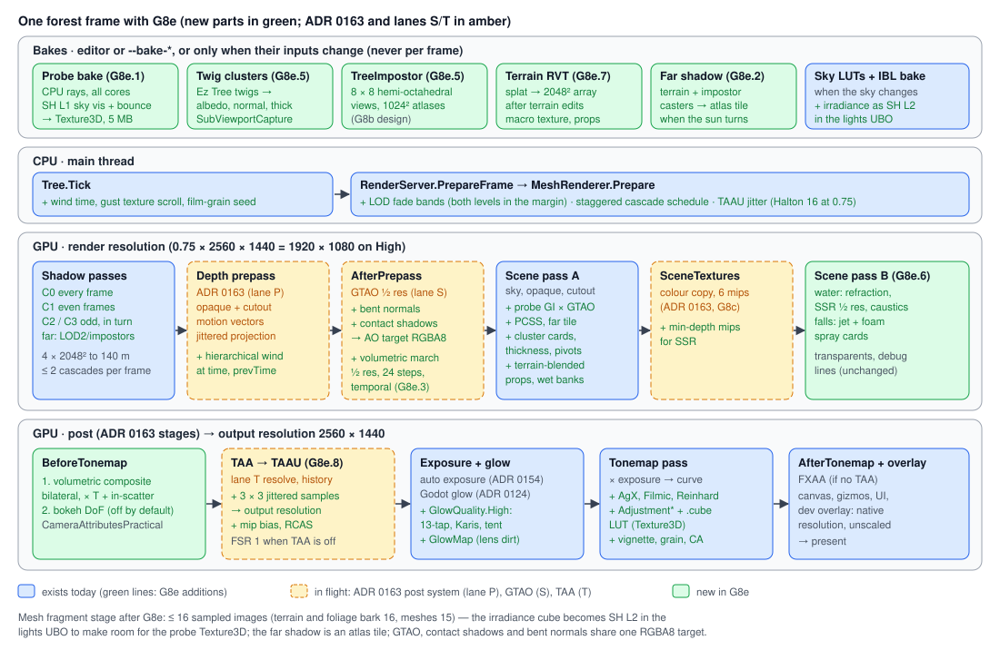

# Proposal: Forest visual quality (the Unreal look: probe GI, soft shadows, volumetric light, cinematic post, Ez Tree foliage, water, art, upscaling)

**Milestone:** [Gameplay toolkit](../../milestones.md#gameplay-toolkit-) (G8e) · **Status:** ⬜ planned ·
**Depends on:** [Forest showcase](forest-showcase.md) (G8d; current state in [forest.md](../forest.md)); ADR 0163 (the
post-processing system: `PostEffect` stages `AfterPrepass` / `BeforeTonemap` / `AfterTonemap`, `SceneTextures`, the
depth prepass, motion vectors and projection jitter); SSAO/GTAO ([G6.6](rendering-features.md#ssao)) and TAA
([G8d.8](forest-showcase.md#g8d8-taa)), both now on Vulkan ahead of M11; [Procedural trees](procedural-trees.md)
(G8b: `TreeImpostor`); [Water](water.md) (G8c: refraction, SSR, falls) · **Related:**
[Rendering features](rendering-features.md) (G6.3 particles, G6.4 LOD), [Terrain](terrain.md) (G8a),
[Rendering backend abstraction](rendering-backend-abstraction.md) (M11: compute), [ADR 0149](../../../memory/decisions/0149-terrain-trees-water-engine-features.md),
[ADR 0164](../../../memory/decisions/0164-forest-visual-quality-plan.md)



## Problem

Brogan, 2026-10-08: "I want the forest level to look like it was made in Unreal Engine." The slice
([forest.md](../forest.md)) is playable and its five reference shots
(`docs/images/forest/r1-glade.png` … `r5-floor.png`) show where it falls short:

- **Flat shade.** Indirect light is the sky's irradiance looked up by normal only
  (`MainframeEngine/Content/Shaders/include/environment.slang:20`), times material AO
  (`MainframeEngine/Content/Shaders/include/lights.slang:175`). Nothing knows that a point under a pine canopy sees a
  tenth of the sky an open glade sees, so the Forest raises `AmbientEnergy` to 1.6 to keep the shade readable
  (`Examples/Forest/Forest/Src/World/ForestScene.cs:79`, "no GI"). R1 and R5: shade under the canopy is as bright and
  as blue as shade in the open; trunk bases and boulders do not ground (R2's rocks float).
- **Short, hard-edged sun shadows.** The Forest affords 2 × 1024² cascades to 60 m (`ForestScene.cs:46-48`) because
  alpha-tested leaves make every cascade texel expensive ([procedural-trees.md → Cost](../procedural-trees.md#cost)).
  The filter is a fixed-radius Poisson disc (`include/shadows.slang:53`, `:96`), so leaf shadows 20 m below the canopy
  are as sharp as a trunk's at its base. Past 60 m nothing casts: R4's far slopes are evenly lit, and the ridges never
  shadow the valley under a 21° sun.
- **Light shafts only from visible sky.** The shafts are a screen-space radial blur of sky pixels near the sun
  (`MainframeEngine/Src/Rendering/Post/LightShafts.cs:60`,
  [color-pipeline.md → Light shafts](../color-pipeline.md#light-shafts-adr-0160)):
  they vanish when the sun leaves the screen, cannot be lit or shadowed in the air between trunks, and read as a milky
  veil in R1. The fog is analytic and unshadowed (`include/fog.slang`).
- **A plain post chain.** `Tonemapper` is the engine's ACES fit or Godot's ACES
  (`MainframeEngine/Src/Rendering/Post/PostProcessSettings.cs:4`); there is no LUT, depth of field, vignette or grain,
  and the glow's first level has no anti-flicker filter.
- **Leaf cards.** Ez Tree emits one or two crossed quads per leaf from one leaf PNG
  (`MainframeEngine/Src/Trees/Generation/TreeParams.cs:114`, `TreeGenerator.cs:630`): a canopy of thousands of identical
  cards, visibly so at 10–40 m (R1, R4). Wind is a per-leaf flutter plus a translation downwind weighted by height
  (`include/wind.slang:117-121`): no trunk sway, no branch rotation. Translucency is a view-dependent back-light with no
  thickness (`Foliage/Foliage.vk.frag.slang:44`). Mips are box-filtered blits (`Rendering/Resources/Texture2D.cs:48`), so
  alpha coverage drops with distance and canopies speckle. No impostors yet
  ([procedural-trees.md → TreeScatter](../procedural-trees.md#treescatter)); four species.
- **Water and the fall.** No refraction or SSR ([water.md → Not yet](../water.md#not-yet)): the pond reflects only the
  sky (R4). `River3D` has no falls (`MainframeEngine/Src/Scene/Nodes3D/Water/River3D.cs:16`): R2's fall is a steep,
  tiled ribbon without spray.
- **Art.** Props meet the terrain at a hard seam (R2 boulders, R3 log); ground clutter is one stone and one fern; there
  is no grade.
- **No headroom.** At 2560 × 1440 the slice already runs p50 18.4 ms on an Apple M5 ([forest.md →
  Performance](../forest.md#performance)), over the 16.7 ms frame before any of the above.

The engine has no compute pipelines (`MainframeEngine/Src/Rendering/Vulkan/PipelineCache.cs:74` only mentions them), no
3D textures and no MSAA (`MainframeEngine/Src/Rendering/Vulkan/RenderTarget.cs:254`). Every design below works within
that.

## Goals

- The eight phases Brogan approved (ADR 0164), in order: **G8e.1** baked sky occlusion and bounce (`LightProbeVolume`)
  with GTAO, **G8e.2** shadow quality, **G8e.3** volumetric light, **G8e.4** cinematic post, **G8e.5** Ez Tree foliage
  extensions, **G8e.6** water, **G8e.7** an art pass, **G8e.8** TAA upscaling.
- 60 fps at 2560 × 1440 output on an Apple M-series Pro (MoltenVK) and an RTX 3060 with every phase on, 0 B per frame,
  validation clean.
- Reference-shot criteria per phase ([Acceptance](#acceptance)), signed off by Brogan next to Unreal sample scenes.
- Godot names for settings where Godot has the feature; everything off by default, so existing scenes and goldens do not
  change.

## Non-goals

- **Lumen, Nanite, virtual shadow maps, hardware ray tracing, MegaLights.** See [Honest limits](#honest-limits).
- **Dynamic GI** (DDGI, SSGI, VoxelGI/SDFGI) and a day-night cycle; the bake supports one sun direction.
- **Compute.** Froxel fog, FSR 2/3 and GPU culling wait for M11's compute.
- DLSS, XeSS and MetalFX ([G8e.8](#g8e8-taa-upscaling)); HDR display output; clouds; tessellation or displacement.
- Quixel Megascans content ([licensing](#licensing-and-content)).

## The Unreal look, technique by technique

| Unreal technique | What it does for a forest | Our equivalent | Phase |
|---|---|---|---|
| Lumen GI, or Volumetric Lightmap + sky light occlusion (UE4) | dark, green-brown shade under the canopy; bright glades; bounce off sunlit ground | `LightProbeVolume`: baked SH L1 bounce + sky visibility, terrain-following | **G8e.1** |
| GTAO with bent normals, specular occlusion | trunks and rocks ground themselves; no sky glare in crevices | lane S GTAO + bent normals, combined with the probes | **G8e.1** |
| Cascaded shadows with caching, far cascades | crisp near, stable far, without the cost | staggered cascade updates, 4 × 2048² to 140 m | **G8e.2** |
| Source-angle soft shadows (contact hardening) | dappled light: leaf shadows soften with distance | PCSS from `LightAngularDistance` | **G8e.2** |
| Screen-space contact shadows | grass, pebbles, the gap under a log | march in the prepass depth | **G8e.2** |
| Distance-field / heightfield shadows | ridges shadow the valley far away | static far-shadow atlas tile (terrain + canopy) | **G8e.2** |
| Volumetric fog with shadowed sun | shafts in the air between trunks, from any view | ½-res ray march of the cascades, temporal | **G8e.3** |
| Post Process Volume: filmic tonemap, LUT, bloom, DoF, vignette, grain, fringe | the film look | AgX/ACES, `.cube` LUT, HQ glow, bokeh DoF, film effects | **G8e.4** |
| SpeedTree: frond clusters, hierarchical wind, subsurface leaves, LOD dither, billboards | dense, soft canopies that move as one tree | Ez Tree + cluster cards, pivot wind, thickness maps, dither fades, `TreeImpostor` | **G8e.5** |
| Single Layer Water, SSR, caustics; Niagara falls | pools that show the bed and the trees | `SceneTextures` refraction + SSR, caustics, falls + spray | **G8e.6** |
| Megascans + Runtime Virtual Texture blending | scanned clutter that sits in the ground | CC0 scans, terrain macro texture (RVT-lite) | **G8e.7** |
| TSR / TAAU | 1440p from a 1080p render | TAAU in the TAA resolve; FSR 1 fallback | **G8e.8** |
| Lumen reflections | reflections of the forest in everything | **not provided**: SSR on water; sky IBL × probe visibility elsewhere | — |
| Nanite, virtual shadow maps | unlimited geometry and shadow detail | **not provided**: LODs, impostors, cached CSM | — |

### Honest limits

- **No Lumen.** Lumen traces software distance fields and screen space every frame, with compute, for fully dynamic
  GI and reflections. That needs compute, a GPU scene representation and a denoiser; the engine has none of them
  before M11. G8e.1 is static: move the sun far, or move a boulder, and the bake is stale.
- **No Nanite, VSM or hardware ray tracing.** Geometry stays LOD chains and impostors; shadows stay cascades.
- **Why static is fine here.** The valley is static: terrain, rocks and trees never move, and wind displaces leaves by
  centimetres, well below the 2 m probe spacing. There is one sun at a fixed morning angle. What GI adds to a forest is
  low-frequency: sky occlusion under the canopy and green-brown bounce, which is what a probe volume stores. Fine
  occlusion comes from GTAO and contact shadows every frame. UE4-era forests were lit this way (static lighting with a
  Volumetric Lightmap for movable objects).
- **The honest gap** is local reflections (water only) and indirect light at under 2 m (GTAO's screen-space radius).

## Design

### Budget and order

- **Target:** 2560 × 1440 output, 60 fps: p50 ≤ 14 ms GPU, p99 ≤ 16.7 ms frame, on an M-series Pro and an RTX 3060.
  The scene renders at 0.75 scale (1920 × 1080) and G8e.8 upscales; 1.0 scale is the "native" option.
- **Order and waves** (progress log): W5 = G8e.2, G8e.4 (with lanes S and T); W6 = G8e.1, G8e.3, G8e.5, G8e.6; W7 =
  G8e.8, G8e.7. G8e.8 lands last but its budget is assumed throughout.
- **Root world only** for post (volumetrics, DoF, TAAU), as today. Probes, shadows, foliage and water are forward
  shading and work in every view, including the editor viewport.

**GPU frame at High** (ms at 1440p output, 1920 × 1080 internal; estimates: the slice's M5 measurements × ≈ 0.6 for a
Pro-class GPU; each phase measures its own on both machines):

| Pass | ms | Pass | ms |
|---|---|---|---|
| Slice today at 1080p, minus its shadows, shafts and FXAA | 6.4 | G8e.3 volumetric march + temporal + composite | 0.9 |
| Depth prepass + motion vectors (ADR 0163) | 1.0 | G8e.4 HQ glow, LUT, film effects (DoF off) | 0.3 |
| Prepass reuse in the scene pass (equal test, no cutout discard) | −1.2 | G8e.5 cluster cards and impostors (fewer, larger cards) | −0.8 |
| GTAO + bent normals (S) + contact shadows | 0.8 | G8e.5 hierarchical wind (vertex) | 0.2 |
| G8e.1 probe sampling + combine | 0.3 | G8e.6 colour copy, refraction, SSR ½ res, caustics | 0.8 |
| G8e.2 shadows: staggered 4 × 2048² to 140 m + PCSS | 2.2 | G8e.7 clutter, density, terrain blend | 0.8 |
| G8e.2 far shadow tile (only when the sun moves) | 0 | G8e.8 TAAU resolve + RCAS (replaces TAA) | 0.7 |
| | | **Total** | **≈ 12.4** (≈ 4 ms headroom to 16.7) |

Medium (1920 × 1080 output at 0.75, base M-series): volumetric ¼ res and 12 steps, 3 cascades × 1024², no SSR, no
PCSS, probes and GTAO kept. **Memory** added at High: probes 5 MB, cascades 64 MiB (was 8), far tile 16 MiB, cluster
atlases ≈ 120 MiB (7 species × 3 maps × 1024² with mips), impostors ≈ 150 MiB, terrain macro 32 MiB, volumetric 16 MiB,
TAAU history 59 MiB: ≈ 0.45 GiB, within G8d's 2 GiB.

### Binding budget

The mesh fragment stage stays within 16 sampled images and 16 samplers
([G6 → Binding budget](rendering-features.md#binding-budget)):

| Fragment stage | Today | After G8e |
|---|---|---|
| Shadows (set 1): cascades, atlas, 4 point cubes | 6 | 6; the cascade array becomes a separate image with a comparison and a point sampler (PCSS's blocker search), so +1 sampler, no image |
| Material (set 2): albedo, normal, emission, ORM (terrain: 3 arrays + 2 weight maps) | 4 (5) | 4 (5); foliage bark adds a detail array at b6 (5) |
| Frame (set 0): radiance, irradiance, BRDF LUT | 3 | radiance, BRDF LUT, AO (S), probes, terrain macro = 5: the irradiance cube becomes SH L2 in the lights UBO ([G8e.1](#sky-irradiance-as-sh)) |
| **Worst case** | 14 (terrain) | **16** (terrain, foliage bark); meshes 15 |

New per-view data goes into set 0, as G6 decided; set 3 stays free for skinning.

### G8e.1 Sky occlusion and bounce light: `LightProbeVolume`

#### Choice

| Option | What it gives | Needs | Verdict |
|---|---|---|---|
| **DDGI** (probe grid updated by ray tracing every frame) | dynamic GI, moving sun | ray tracing or compute ray marching per probe, per frame | no: the engine has neither before M11. The probe layout below keeps the door open |
| **SSGI** | bounce from what is on screen | prepass, TAA, a denoiser | no: the canopy that occludes the sky is mostly above or behind the camera, off screen; noisy in foliage |
| **Lightmaps** | sharp static GI on surfaces | a second UV set, per-object texels, a GPU or CPU bake | no: 1 500 instanced, swaying trees and 250k grass instances cannot have lightmaps; the terrain would be the only receiver |
| **Baked probe volume** | low-frequency sky occlusion and bounce for every receiver, static or moving | a CPU bake, one 3D texture, a few fetches per pixel | **chosen** |

#### What a probe stores

Per probe, 16 numbers in four RGBA16F texels (32 B):

- **Sky visibility**, SH L1 (4 scalars): the fraction of the sky seen in each direction, through the canopy's
  transmittance. Shading convolves it with the cosine lobe at N for a visibility in [0, 1], and its linear band gives
  the probe's bent direction. Stored apart from the sky's colour, so a new HDRI or turbidity needs no re-bake.
- **Bounce irradiance**, SH L1 RGB (12 scalars): light that reached the probe after at least one bounce (sun and sky off
  terrain, bark, leaves, rocks and water), multi-bounce. It depends on the sun's direction.

A fifth slab per column holds the ground height (terrain-following layout) and the probe's validity (bake only).

#### Layout and node

```csharp
public enum ProbeLayout { Box, TerrainFollowing }

public partial class LightProbeVolume : Node3D           // the first visible one in a world is used
{
    [Export] public Vector3 Size { get; set; } = new(32, 16, 32);           // Box: extents around the node
    [Export] public ProbeLayout Layout { get; set; } = ProbeLayout.Box;
    [Export] public Vector3 ProbeSpacing { get; set; } = new(2, 2, 2);      // m; Y ignored by TerrainFollowing
    [Export] public float[] LayerHeights { get; set; } = [0.3f, 1.2f, 2.5f, 4.5f, 7.5f, 12, 18, 27];  // m above ground
    [Export] public NodePath Terrain { get; set; }                           // TerrainFollowing
    [Export] public int RaysPerProbe { get; set; } = 256;
    [Export] public int Bounces { get; set; } = 3;
    [Export] public float Energy { get; set; } = 1f;                         // scales bounce (art control)
    [Export] public LightProbeData? Data { get; set; }                       // the bake (.mres + .probes binary)
    public BakeResult Bake(IProgress<float>? progress = null, CancellationToken ct = default);   // CPU, all cores
}
```

- **TerrainFollowing** (the Forest): an XZ grid at 2 m over the terrain and `LayerHeights` above the ground under each
  column, denser near the ground where receivers are. 256 m → 129 × 129 × 8 = 133k probes, 5.3 MB. A box grid at 2 m
  up to the canopy would be 666k probes (21 MB) with most of them in the air or the ridges.
- **Box** for anything else (interiors, props scenes): a regular grid.
- **Texture:** a new `Texture3D` resource (Godot's name; `R16G16B16A16_SFLOAT`, no mips): X × (5 · layers) × Z, the five
  slabs stacked along Y (≤ 2048 per axis, Vulkan's minimum `maxImageDimension3D`). Sampling clamps Y to the slab's texel
  centres, so hardware trilinear never blends two slabs. Volume transform and layer table go in `FrameData` (+48 B).
- **`GeometryInstance3D.GIMode`** (Godot: `Disabled`, `Static`, `Dynamic`; default `Static` for meshes and terrain,
  `Disabled` for grass): `Static` instances occlude and bounce in the bake; every lit surface, including `Dynamic` ones,
  samples the probes.

#### The bake (CPU)

`ProbeBaker` (`MainframeEngine/Src/Lighting/Probes/`), `Parallel.For` over probe columns, deterministic for a seed. The
scene becomes ray-traceable proxies through `IProbeBakeProxy`:

| Source | Proxy | Albedo |
|---|---|---|
| `Terrain3D` | the height field with a min-max mip pyramid (quadtree DDA) | splat layers' mean colours × weights per cell |
| `Tree3D`, `TreeScatter` | branches from `TreeSkeleton` as tapered capsules (BVH); leaves as a 0.5 m leaf-area-density grid per variant, crossed with Beer–Lambert transmittance (G = 0.5) | bark and leaf texture means; leaf transmission 0.15 |
| meshes with `GIMode.Static` | their coarsest LOD's triangles (BVH) | the albedo texture's mean × colour |
| water | its plane | 0.05 |

Per probe, `RaysPerProbe` Fibonacci directions with a per-probe rotation:

1. **Trace** each ray to its first hit, through canopy cells with stochastic leaf events; a miss adds its transmittance
   to sky visibility. At a hit, one shadow ray to the sun (through the canopy) is cached with the hit's position,
   normal and albedo.
2. **Bounce** iteration k: radiance at a hit = albedo / π × (sun irradiance × cached sun visibility × N·L + sky
   irradiance × visibility of iteration k−1's nearest probe + bounce of iteration k−1's nearest probe). Iterations 2 and
   3 reuse the cached hits, so they cost probe lookups, not rays.
3. **Validity and leaks:** a probe whose rays hit back faces more than 25 % of the time is inside geometry (a boulder,
   a trunk) and is replaced by its valid neighbours' average (dilation), so hardware trilinear needs no per-probe weights.
   A 3 × 3 × 3 blur over valid probes removes ray noise.

**Bake time** (estimate, 10–12-core M-series Pro): 34M primary + 34M shadow rays at ≈ 4M rays/s/core: ≈ 2–10 s, plus
proxy build ≈ 1 s. Target ≤ 60 s. **Storage:** `LightProbeData` (`.mres` header with a `BakeHash` of the inputs, plus a
`.probes` fp16 blob in LFS).

**Editor:** a **Bake Lighting** button on `LightProbeVolume` (progress, cancel), a probe debug view (spheres showing the
SH, invalid probes red) and an "indirect only" view mode. Headless: `--bake-lighting <scene>`. The Forest generates its
valley at load, so `ForestValley` hashes its inputs (`ValleyLayout`, seed, generator versions); a stale or missing bake
logs one warning and the scene renders with today's sky-only ambient.

#### Shading

`include/probes.slang` (+ `include/indirect.slang` for the combine), called by every lit shader before fog:

```slang
ProbeSample p   = sampleProbes(worldPos + Ngeo * 0.3 * spacing + V * 0.1);   // 5 fetches: ground height + 4 slabs
float  skyVis   = p.skyVisibility(N);                       // cosine-convolved SH L1, 0..1
float3 bentN    = normalize(N + p.bentDirection() * 0.5 + gtaoBentNormal);
float  ao       = multiBounceAo(min(gtaoAo, s.ao), s.albedo);              // Jimenez 2016 fit
float3 diffuse  = (skyIrradiance(bentN) * skyVis + p.bounce(N) * probeEnergy) * ao;
float  specOcc  = specularOcclusion(skyVis, gtaoBentCone, R, roughness);    // cone–cone, Jimenez 2016
float3 specular = iblSpecular(R, roughness) * envBrdf * specOcc;
```

- **GTAO (lane S)** writes AO and a view-space bent normal; G8e.1 widens its target to RGBA8 (R AO, G contact shadow
  from G8e.2, BA bent normal, octahedral). GTAO is the small scale (< 2 m), the probes the large one; the multi-bounce
  fit keeps bright leaves and moss from going grey.
- **Specular occlusion** fixes the second half of the flat look: wet rock and the water under trees no longer reflect
  the full bright sky.
- **Wind-animated foliage** samples at its swayed fragment position, so a moving leaf slides through a smooth field; the
  bake uses the rest pose, and the sway (≤ 0.35 m) is far below the spacing. Leaves sample twice from the same fetches,
  at N and −N: the −N side lights their translucency (G8e.5), so a sunless canopy still glows green from below.
  `Custom0.w`'s ellipsoid canopy AO drops to `CanopyAoStrength` 0.4: the probes now carry canopy occlusion. Impostors
  sample at their reconstructed fragment position. Particles and butterflies sample at their centre.
- **No volume, or a stale bake:** `sampleProbes` returns visibility 1 and no bounce, which is today's frame exactly.

#### Sky irradiance as SH

The 32² irradiance cube ([sky.md → Image-based lighting](../sky.md#image-based-lighting)) becomes nine SH L2 RGB
coefficients (112 B) in the lights UBO, projected by the IBL bake into a 9 × 1 target, read back when its frame slot
comes round (as the shadow timestamps are; no stall) and written into the UBO by the CPU; until then the previous
coefficients stay. L2
matches a cosine-convolved sky within ≈ 2 % (Ramamoorthi and Hanrahan 2001). It frees a set-0 image for the probes, and
`skyIrradiance(bentN)` becomes 9 multiply-adds.

**Cost:** ≈ 0.3 ms at 1080p internal (5 fetches, ≈ 60 ALU). **MoltenVK:** 3D textures are core. **Mobile:** the
probes are cheaper than SSAO; `rendering.probes = Off` on Low.

### G8e.2 Shadow quality

Today: 2 × 1024² cascades to 60 m, 2.0 ms GPU on an M5 at 1080p. The cost is cascades × resolution² × canopy overdraw,
redrawn every frame.

| Setting (`DirectionalLight3D`) | Default | Forest | Notes |
|---|---|---|---|
| `ShadowCacheMode` | `Off` | `Staggered` | engine name; Godot has none |
| `ShadowCascades`, `ShadowResolution`, `ShadowMaxDistance` | 4, 2048, 100 | 4, 2048, 140 m | |
| `LightAngularDistance` | 0 | 0.5° | Godot's `light_angular_distance`; > 0 enables PCSS on `High` |
| `ContactShadows`, `ContactShadowLength` | false, 0.5 m | true, 0.4 m | G8d.7's design |
| `FarShadowEnabled`, `FarShadowDistance`, `FarShadowResolution` | false, 0 (= the terrain's bounds), 2048 | true | engine names |

- **Staggered cascades.** Cascade 0 renders every frame; cascade 1 on even frames; cascades 2 and 3 on alternate odd
  frames (60 / 30 / 15 / 15 Hz). At most two cascade passes per frame, so there is no spike. Each cascade is sampled
  with the matrix it was rendered with (already per cascade in `ShadowUBO`), and its fitted sphere grows by the
  camera's maximum travel in its interval (10 m/s × 4 frames = 0.7 m) so a stale cascade still covers its slice. Wind
  in a 4-frame-old cascade lags 67 ms: invisible at 30 m. A camera cut re-renders all four.
- **Coarse casters far away.** Cascades 2–3 draw trees at LOD2 or their impostor caster (G8e.5): `TreeScatter`'s
  `ShadowMaxLod` per cascade instead of per scatter.
- **PCSS** as [G8d.5](forest-showcase.md#g8d5-soft-sun-shadows-pcss-style-csm) designs it: a 16-tap blocker search
  through the new point sampler, penumbra `(dReceiver − dBlocker) · tan(angle)` in texels, then the Poisson filter at
  that radius (clamped to [`FilterRadius`, 8 texels], and to the next cascade's texel size at a blend). With TAA on, the
  Poisson pattern rotates per pixel and per frame (interleaved gradient noise), so 8 search + 12 filter taps converge
  like 16 + 16; without TAA it stays fixed (no crawl, ADR 0072). Leaf shadows 20 m down blur into dapples; trunk bases
  stay sharp.
- **Contact shadows** (G8d.7): 12 steps toward the sun over `ContactShadowLength` in the prepass depth at ½ res, with
  0.2 m thickness and IGN jitter, upsampled with GTAO's bilateral pass into the AO target's G channel. Grass blades,
  pebbles and the underside of the bridge log.
- **Far shadow (the terrain heightfield).** The terrain's coarsest chunk level plus tree impostor casters render once
  into a 2048² tile of the shadow atlas, orthographic along the sun over the terrain's bounds (12.5 cm texels over
  256 m), re-rendered only when the sun turns by more than 0.1° or a static caster changes. `dirShadow` blends to it
  past the last cascade with a wide filter (4 texels): the west ridge shadows the valley floor at sunrise, and far tree
  lines shade their slopes. A ray-marched heightfield (Unreal's heightfield shadows) would need the height map in set 1
  (one more image) and would miss the trees; the atlas tile costs no binding.

**Cost** (est., Pro-class, 1080p internal):

| Configuration | Coverage | GPU per frame | Memory |
|---|---|---|---|
| Today: 2 × 1024², every frame | 60 m | ≈ 1.2 ms | 8 MiB |
| Engine default: 4 × 2048², every frame | 100 m | ≈ 8 ms | 64 MiB |
| **G8e.2:** 4 × 2048², staggered, coarse far casters, + PCSS | 140 m + far tile to 256 m | **≈ 1.8 + 0.4 ms** (contact shadows 0.3, counted with GTAO) | 80 MiB |

Medium: 3 × 1024² staggered to 90 m, Poisson 16, far tile at 1024², contact shadows off.

### G8e.3 Volumetric light

| | Froxel volume | **Screen-space ray march (chosen)** |
|---|---|---|
| Resolution | 160 × 90 × 64 cells: one cell is 16 px at 1440p | ½ res per pixel, 24 steps per ray |
| Thin shafts between branches | smeared | sharp |
| Without compute | a 2D-atlas volume plus a 6-pass prefix scan over (scatter, optical depth) | 3 fragment passes |
| Transparent surfaces | fogged correctly (forward lookup) | approximated (see below) |
| Local lights | yes | sun only |

The forest has one light, its look is thin shafts, and its only transparent surface is shallow water. **Froxels wait for
M11's compute** (as G8d decided), when they can also serve local lights.

1. **March** (`AfterPrepass`, ½ res): from the camera to min(prepass depth, `VolumetricFogLength`), 24 steps with
   exponential spacing (`VolumetricFogDetailSpread`) and an IGN offset that rotates each frame. Per step: density =
   the height fog's function (`include/fog.slang`) × `VolumetricFogDensity` × a 32³ wind-scrolled noise `Texture3D`;
   sun visibility = one comparison tap of the cascade (or the far tile) at that point; phase = Henyey–Greenstein
   (`VolumetricFogAnisotropy`); ambient in-scatter = sky irradiance × the probes' sky visibility (G8e.1), so the air
   under the canopy is darker than the glade's. Output RGBA16F: in-scattered light, transmittance.
2. **Temporal** (½ res): reproject with the previous view-projection from depth (ADR 0163's camera motion), clamp to the
   3 × 3 neighbourhood, blend `VolumetricFogTemporalReprojectionAmount` (0.9); ping-pong history.
3. **Composite** (`BeforeTonemap`, first): a depth-aware bilateral upsample, `color · T + inscatter`.

- **Beyond `VolumetricFogLength`** the forward analytic fog takes over: `applyFog` starts its integral at the length
  when volumetrics are on, so nothing is counted twice and distant hills keep G8d.2's aerial perspective.
- **Water** does not write the prepass, so the march runs to the stream bed: the in-scatter of ≤ 2 m of "air" under the
  surface is added on top. Accepted and documented.
- **Light shafts:** `LightShaftsEnabled` defaults off in the Forest when volumetrics are on (open question 5); Medium
  keeps the screen-space shafts instead.
- **`WorldEnvironment`** (Godot 4 names and defaults): `VolumetricFogEnabled` (false), `VolumetricFogDensity` (0.05),
  `VolumetricFogAlbedo` (white), `VolumetricFogEmission` (black), `VolumetricFogAnisotropy` (0.2), `VolumetricFogLength`
  (64), `VolumetricFogDetailSpread` (2), `VolumetricFogAmbientInject` (0), `VolumetricFogSkyAffect` (1),
  `VolumetricFogTemporalReprojectionEnabled` (true), `VolumetricFogTemporalReprojectionAmount` (0.9); engine additions
  `VolumetricFogNoiseScale` (8 m) and `VolumetricFogNoiseStrength` (0). Forest: density 0.02, anisotropy 0.6, length
  64 m, noise 0.4. `rendering.volumetricFogQuality`: High ½ res × 24, Medium ¼ res × 12, Off.
- **Cost:** ≈ 0.6 ms march (≈ 10M shadow taps), 0.1 temporal, 0.15 composite. **MoltenVK:** three encoders.

### G8e.4 Cinematic post chain

On ADR 0163's stages, in this order: `BeforeTonemap` — volumetric composite, **DoF**, TAA/TAAU (lane T, G8e.8), auto
exposure, **glow**; the tonemap pass — exposure, **tonemapper**, **LUT**, **film effects**; `AfterTonemap` — RCAS or
FXAA, then the overlay.

- **Tonemappers.** `Tonemapper { Engine, GodotAces, Linear, Reinhard, Filmic, Agx }` (existing values keep their numbers;
  the new ones are Godot 4's `TONE_MAPPER_*`), ported from Godot 4.4's tonemap shader (MIT, credited in
  THIRD_PARTY_NOTICES) with `TonemapWhite`. AgX desaturates bright highlights the way film does, so the sun through
  leaves goes white instead of ACES' saturated yellow; the Forest picks between ACES and AgX in G8e.7.
- **Colour grading** (G8d.4's `.cube` design under Godot's names): `AdjustmentEnabled`, `AdjustmentBrightness`,
  `AdjustmentContrast`, `AdjustmentSaturation` (1) and `AdjustmentColorCorrection`, a `Texture3D` (G8e.1) imported from
  `.cube` (any N³), applied after the curve on the display-encoded value with hardware trilinear. An identity LUT
  reproduces the input within ±1.
- **Glow quality.** `GlowQuality { Standard, High }` (engine; Standard is today's Godot glow): High downsamples with
  the 13-tap filter and a Karis average on the first level (no fireflies from sun glints under TAA) and upsamples with a
  3 × 3 tent (Jimenez 2014). Godot's `GlowMap` and `GlowMapStrength` add a lens-dirt texture.
- **Depth of field** on **`CameraAttributesPractical`** (Godot's resource, on `Camera3D.Attributes` or
  `WorldEnvironment.CameraAttributes`; the camera's wins): `DofBlurFarEnabled`, `DofBlurFarDistance` (10),
  `DofBlurFarTransition` (5), `DofBlurNearEnabled`, `DofBlurNearDistance` (2), `DofBlurNearTransition` (1),
  `DofBlurAmount` (0.1). CoC from the prepass depth; ½-res prefilter with separate near and far layers; a
  golden-angle gather (16 taps High, 32 for shots) for circular bokeh; TAA cleans the noise; composite by CoC.
  Subtle by design and off by default.
- **Film effects** (engine names; inside the tonemap pass, so no extra pass), on `CameraAttributesPractical`:
  `VignetteIntensity` (0), `VignetteRoundness` (1); `FilmGrainIntensity` (0), `FilmGrainSize` (1.5 px), seeded by the
  frame index so `--fixed-fps` frames are deterministic; `ChromaticAberrationIntensity` (0, in pixels at the corner:
  red and blue sampled radially apart). All off by default; the Forest uses vignette 0.2 and grain 0.015, no
  aberration.
- **Cost:** HQ glow +0.1 ms, LUT and film effects 0.05 ms, DoF 0.6 ms when on.

### G8e.5 Foliage quality: Ez Tree extensions

**Can Ez Tree reach Unreal or SpeedTree quality?** The skeleton, trunk and branches: yes. Ez Tree grows a parametric
branch hierarchy (levels, children, angles, gnarliness, twist, taper, a growth force), which is the same kind of model
SpeedTree's generators use, and its ring meshes are what SpeedTree emits; root flares and collars are below. The leaves:
no. One quad per leaf cut from one PNG is the web-demo look; production trees use **cluster cards** (twigs carrying
many leaves, with normal, thickness and AO), hierarchical wind, translucency maps and LOD down to impostors. So the
generator stays and grows these extensions (ADR 0164: no SpeedTree, no Megascans).

#### Leaf-cluster cards

- **`TwigOptions`**: a small Ez Tree preset per species (one branch level of twigs at real leaf size, 20–60 leaves),
  grown by the same `TreeGenerator`.
- **`TreeClusterBaker`** (editor and `--bake-tree-clusters`): renders 8 twig variants orthographically into a 4 × 2
  atlas (1024², 256 × 512 cells) through `SubViewportCapture` (ADR 0136) with G8b's linear bake target and three output
  modes: albedo + alpha; card-space normal (the twig's real leaf normals, so a flat card shades like a twig); thickness
  and AO (layered alpha through the twig, and depth-based self-occlusion). Edges dilated. `Content/Trees/Clusters/
  <species>_{albedo,normal,thick}.png`, ≈ 3 MB per species.
- **Generator:** `TreeLevel.LeafMode { Single, Cluster }`. In `Cluster` mode the last level's leaf slots become cards of
  the cluster's size, fewer and larger (≈ 400 instead of 4 000 per oak): two crossed quads or a V-bent card, oriented by
  the branch. Normals blend toward the canopy ellipsoid (`ClusterNormalRounding` 0.6, SpeedTree's trick) for a soft
  canopy silhouette. Cards keep `Custom0` and get the wind streams below. Fewer, larger cards also cut cutout overdraw,
  the forest's main cost.

#### Hierarchical wind (Pivot Painter-like)

- **Data.** Two new optional streams, `MeshSurface.Custom1` and `Custom2` (RGBA16F each, layout `MeshInstancedExt2` at
  binding 3, 16 B per vertex): the object-space pivot of the vertex's level-1 branch and a stiffness, then the pivot of
  its level-2 branch and a stiffness. `TreeSkeleton` already has every branch's origin and parent. Directions are
  derived, not stored: level 1 heads from pivot 1 to pivot 2, level 2 from pivot 2 to the vertex. Without the streams,
  today's wind runs.
- **Motion** (`include/wind.slang`, `windHierarchy`), from the root down, each a rotation (not a translation, so
  branches keep their length):
  1. **Trunk sway** around the instance origin: angle ∝ strength × height² / trunk stiffness, 0.2–0.4 Hz, phased by
     the instance origin's hash, plus the gust below.
  2. **Branch bend** around pivot 1, axis `cross(branchDir, wind)`: a downwind lean plus an oscillation at a frequency
     ∝ 1/√length, phased per branch (`Custom0.z`).
  3. **Twig bend** around pivot 2, faster and smaller.
  4. **Leaf flutter:** Ez Tree's three sines, unchanged.
- **Gusts:** a 256² tileable gust texture (generated, no asset) scrolled along the wind in world XZ and sampled per
  instance in the vertex stage (set 0, vertex-only), so gusts roll across the meadow and the treetops together; grass
  (G8a) uses it too.
- Shadow casters, the depth prepass and motion vectors run the same function (at `time` and `prevTime` for velocity, as
  G8d.8 designs). Cost ≈ 40 ALU per vertex.

#### Bark detail

- **Root flare:** the trunk's ring radius × `RootFlare` (1.6) over `RootFlareHeight` (0.8 m), with five buttress lobes
  from a hashed angular profile.
- **Branch collars:** a child's base radius blends up to `CollarScale` × (1.25) over `CollarLength` (2 × its radius),
  welding the joint.
- **Moss on top:** `FoliageMaterial3D.MossCoverage` (0) masks up-facing bark (world normal · up, plus noise and
  `Custom0.x` so the trunk base gets most): moss albedo and normal from a `DetailLayers` `Texture2DArray` at set 2 b6
  (layers: moss albedo + height, moss normal, bark detail normal), the one image the budget allows.
- **Detail normals:** layer 2, tiled `DetailScale` (6×) over the bark UVs, blended with UDN.

#### Two-sided leaves with a translucency map

The back-light becomes thickness-driven wrap transmission: `albedo · TranslucencyColor · (1 − thickness) ·
wrap(dot(−N, L), 0.5) · (0.5 + 0.5 · pow(saturate(dot(V, −L)), TranslucencyScatter)) · shadow`, plus ambient
transmission from the probes at −N. The thickness comes from the cluster atlas, so the dense centre of a twig stays dark
and its edges glow.

#### Alpha coverage

- **Coverage-preserving alpha mips** (Castaño 2010): `TextureImportSettings.PreserveAlphaCoverage` and
  `AlphaCoverageCutoff`; at import each mip's alpha is scaled until the fraction of texels above the cutoff matches mip
  0. Distant canopies keep their density instead of speckling away.
- **Alpha to coverage needs MSAA**, which the engine does not have (single-sample targets, `RenderTarget.cs:254`).
  `FoliageMaterial3D.AlphaAntialiasingMode` (Godot's `alpha_antialiasing_mode`: `Off`, `AlphaToCoverage`) therefore
  maps `AlphaToCoverage` to the TAA-era equivalent on single-sample targets: the cutoff is sharpened by derivatives
  (`(a − cutoff) / fwidth(a) + 0.5`, stable at any distance) and dithered across `AlphaAntialiasingEdge` (Godot's name,
  0.3) with the frame's IGN, so TAA resolves edges to fractional coverage. True A2C needs an MSAA path (open question 8).

#### LOD cross-fade and impostors

- **Every LOD transition fades**, not only mesh to impostor: Godot's `GeometryInstance3D.VisibilityRangeBeginMargin`,
  `VisibilityRangeEndMargin` and `VisibilityRangeFadeMode` (`Disabled`, `Self`). Inside the margin both levels draw;
  each instance computes its own distance in the shader and discards against complementary dither thresholds
  (`TreeScatter` chunks overlap their batches in the band). TAA turns the dither into a fade.
- **`TreeImpostor`** exactly as [procedural-trees.md → TreeImpostor](procedural-trees.md#treeimpostor) designs it:
  hemi-octahedral 8 × 8 views in a 1024² atlas (albedo + alpha, normal + depth), lit live, chained after LOD2 at
  `ImpostorScreenHeight` 120 px, dithered switch. G8e adds an impostor shadow caster for cascades 2–3 and the far tile,
  and probe sampling at the depth-reconstructed position.

#### Species

New presets `birch`, `spruce`, `fir` and `beech` (small, medium, large), with:
- `TreeLevel.LengthProfile` (engine-only, a `Curve` of child length over the position along the parent): the conical
  spruce and fir silhouettes; beech's layered, spreading crown;
- needle clusters for spruce and fir (twigs of many thin "leaves");
- bark and leaves from CC0 sources: ambientCG bark sets and leaf scans where they exist, generated leaves otherwise.

#### Licensing and content

Quixel Megascans trees are licensed for use in Unreal Engine only. Poly Haven (CC0) has very few trees. So the rule
stays "CC0 + procedural": Ez Tree (MIT) grows every tree, cluster atlases are baked from it, bark and leaf images come
from ambientCG or Poly Haven (CC0), and every file is listed in `NOTICE.md`.

### G8e.6 Water

- **Refraction and SSR** through `SceneTextures`, as [water.md → `SceneTextures`](water.md#scenetextures) and G8c.6–8
  design them, now on ADR 0163's `SceneTextures` (Vulkan now, as SSAO and TAA). SSR at ½ res: a view-space march (24
  steps, binary refine, IGN jitter, TAA resolves it) against a min-depth mip chain built with fragment passes; misses
  fall back to `iblSpecular` × the probes' sky visibility, so the pond reflects a dark tree line instead of bright sky
  even off screen. `rendering.waterSsr` (Off on Medium).
- **Caustics:** in the water's own fragment shader. The refracted bed position comes from the scene depth; a generated
  tileable caustic pattern (two scrolled layers, `min` blend) is projected along the sun onto the bed's world XZ, scaled
  by the bed's sun shadow and `exp(−absorption · depth)`, and added to the refracted colour. The pattern shows only
  through water, needing no decal pass.
- **The fall:** G8c.3's falls (lip, a ballistic jet, a plunge with foam) for `River3D`, with a `WaterfallMaterial`
  variant of `WaterMaterial3D` (flow down the jet, streaked foam, aerated white at the base), plus spray:
  - **`SprayCards`** (ships first, no dependency): 6–10 camera-facing soft cards at the plunge with scrolling noise
    alpha, depth-faded against the scene, lit by the probes;
  - G6.3 `GpuParticles3D` replaces them when it lands (G8c's `Amount = clamp(8 × drop × width, 8, 64)`).
- **Wet banks:** the terrain splat darkens albedo and lowers roughness within 0.3 m above the water level (from the
  water layer and `River3D`'s carve), so the waterline reads.

### G8e.7 Art pass

- **Hand-composed shots.** R1–R5 recomposed by eye in the editor, plus **R6 Under the pines** (deep shade: the GI shot)
  and **R7 The fall, close** (spray, wet rock, caustics). Each pose stores a FOV and an optional DoF.
- **More scans:** 6–10 Poly Haven CC0 scans (rocks, roots, branches, pine cones) and an ambientCG debris layer, within
  G8d's 400 MB LFS budget; a near **clutter** `FoliageType` (twigs, cones, small stones, leaf cards) to 15 m.
- **Prop-to-terrain blending (RVT-lite).** A **terrain macro texture**: the splat material rendered top-down once (and
  after edits) into a 2-layer 2048² `Texture2DArray` (albedo + height, normal + roughness; 12.5 cm texels), bound in set
  0. `StandardMaterial3D.TerrainBlend` (0) blends a prop's albedo, normal and roughness toward the macro texel below it
  over `TerrainBlendHeight` (0.3 m) above the ground, with noise. Boulders and logs sink into moss and dirt. The macro
  also shades distant terrain and feeds the probe baker's albedo.
- **Grade:** `forest_morning.cube` authored in Resolve or Krita from the R1–R7 renders; ACES or AgX picked.
- **Density and variety:** the new species, understorey saplings and dead branches, per-instance hue and value jitter
  from the instance origin's hash (no instance data), denser pine slope.
- **Before/after list** (`docs/images/forest/g8e/`, JPG, ≤ 8 MB): each phase commits R1–R7 before and after.

### G8e.8 TAA upscaling

- **`rendering.scaling3DMode`** (Godot's `scaling_3d_mode`): `Bilinear`, `Fsr` (FSR 1), `Taau`;
  **`rendering.scaling3DScale`** (0.25–1, default 1; the Forest's High uses 0.75 at 1440p). `rendering.fsrSharpness`
  (Godot's, 0.2).
- **TAAU** in lane T's resolve: the scene, prepass, GTAO, volumetrics and DoF run at render resolution; the resolve
  reconstructs each output pixel from the 3 × 3 jittered input samples around it (Blackman–Harris weights by the
  sub-pixel distance), reprojects the output-resolution history (Catmull–Rom), clips in YCoCg and blends. Halton
  length becomes 8 / scale², rounded up to a power of two (16 at 0.75). Glow, auto exposure, tonemap and the LUT run
  at output resolution; the UI is never scaled.
- **Mip bias** `log2(scale)` (−0.42 at 0.75) through `frame.mipBias` in the material sampling helpers, so textures keep
  their output-resolution sharpness.
- **RCAS** (from FSR 1) after the resolve, replacing G8d.8's CAS-style sharpen.
- **FSR 1** (EASU + RCAS) as the spatial mode when TAA is off.
- **Licences:** FSR 1 is MIT (AMD FidelityFX) and ports to Slang fragment shaders. FSR 2 and 3 are MIT but compute
  shaders: after M11. DLSS (NVIDIA SDK licence, closed binaries, RTX only) and XeSS (Intel's licence) are not
  open-source and not portable; MetalFX is Metal-only and unreachable through MoltenVK. TAAU is in-house code (MIT).
- **Cost:** ≈ 0.6 ms resolve at 1440p output + 0.1 ms RCAS; saves ≈ 40 % of every per-pixel pass.

## Testing

- **Unit** (`Tests/MainframeEngine.Tests`): SH L1/L2 projection and cosine convolution against numeric integrals; probe
  layout (box and terrain-following) round trips; the bake on analytic scenes (a probe under an infinite plane sees
  visibility 0.5; a probe in a closed box sees 0; a sunlit white floor bounces E·ρ/π upward within 3 %); bake
  determinism per seed and across thread counts; validity dilation; the height-field DDA against brute force; canopy
  transmittance against Beer–Lambert; `LightProbeData` and `BakeHash` round trips; the staggered cascade schedule
  (never more than two passes per frame, cuts re-render all) and sphere growth; PCSS penumbra math; the AgX and
  Reinhard curves against Godot's reference values; the `.cube` importer (17³, 32³, 33³, identity); coverage-preserving
  mips keep coverage within 2 % per mip; branch pivots (continuous at junctions, every vertex's pivots on its own
  branch chain); `LengthProfile`; TAAU Halton length and weights; settings round trips.
- **Render tests** (goldens on `moltenvk` and `lavapipe`, self-checks where possible):
  - `probes`: a roofed box open on one side under a sky; the inside must be darker than the outside by the bake's
    visibility ratio ± 10 %, and a red wall must tint the floor next to it;
  - `shadow-staggered`: a still scene matches the every-frame golden; a moving camera shows no gap for 4 frames;
  - `pcss`, `contact-shadows`, `far-shadow` (a ridge shadows a plane beyond the last cascade);
  - `volumetric-fog`: a sunlit box with a shadowing slab; in-scatter only in the lit volume; temporal convergence;
  - `post-cinematic`: each tonemapper, an identity and a channel-swap LUT, DoF, vignette, grain at a fixed frame;
  - `tree-clusters`, `tree-wind-hierarchy` (trunk tip moves less than branch tips; two times differ), `impostor`,
    `lod-fade`;
  - `water-ssr`, `water-caustics`, `waterfall`; `taau` (a static scene at 0.75 within 1.5 dB PSNR of native after 16
    frames);
  - **`forest-mini`** gains the probes, staggered shadows, clusters and TAAU (new golden).
- **Gates:** allocation 0 B over 300 frames in `forest-mini` with every phase on; validation clean, including a resize
  with TAAU and a sun turn that re-renders the far tile and re-projects the sky SH; every existing golden unchanged with
  G8e at its defaults; `just forest-bench` at 2560 × 1440 High.

## Acceptance

Per phase, the shots (2560 × 1440, `just forest-screenshots`) show the criterion, the numbers hold, and Brogan signs off
the before/after pair:

| Phase | Shots | Criterion |
|---|---|---|
| G8e.1 | R5, R6, R1 | Mean luminance of shaded ground under dense pines ≤ 0.5 × shaded ground in the glade (today ≈ 1×); trunk bases darker than trunks at 2 m; no leaks in the probe debug view; `AmbientEnergy` back to 1 |
| G8e.2 | R1, R5, R4 | Leaf-shadow penumbra measurably wider 15 m below the canopy than at a trunk base; ridge shadow on the far slopes at sunrise; no cascade seams; a still camera shows no shimmer over 2 s; shadows with PCSS ≤ 2.2 ms GPU |
| G8e.3 | R1, R1b (60° off the sun) | Shafts in the air between trunks with the sun off screen; no banding or crawl in motion; ≤ 0.9 ms |
| G8e.4 | all | The grade and tonemapper chosen; film effects at their Forest values; DoF only in R4/R5 photo variants; ≤ 0.35 ms without DoF |
| G8e.5 | R1, R3, R4 | No single-leaf cards readable at 10–40 m; trunk sway and branch motion visible in the fly-through video; no LOD or impostor pop in R4's spline; four new species placed |
| G8e.6 | R2, R3, R7 | Trees reflected in the pools; the bed refracted with caustics; the fall has a jet, foam and spray |
| G8e.7 | R2, R3, R6, R7 | No hard prop–terrain seams; clutter on the floor; the before/after set committed |
| G8e.8 | benchmark | `just forest-bench` at 2560 × 1440 High: p50 ≤ 14 ms GPU, p99 ≤ 16.7 ms on an M-series Pro and an RTX 3060; Medium on a base M-series at 1080p the same; 0 B per frame |

Docs: [lighting.md](../lighting.md), [shadow-system.md](../shadow-system.md), [color-pipeline.md](../color-pipeline.md),
[sky.md](../sky.md), [procedural-trees.md](../procedural-trees.md), [water.md](../water.md),
[terrain.md](../terrain.md), [forest.md](../forest.md), [testing.md](../testing.md); an ADR per phase (0164 records the
plan).

## Task list

1. **G8e.1 Probe GI.** `Texture3D`; sky irradiance as SH L2 in the lights UBO; `LightProbeVolume`, `LightProbeData`,
   `GIMode`; `ProbeBaker` with terrain, tree (capsules + canopy density) and mesh proxies; validity, dilation, blur;
   `include/probes.slang` and `indirect.slang` in every lit shader; GTAO target RGBA8 with bent normals; specular
   occlusion; Bake Lighting button, debug views, `--bake-lighting`; the Forest's bake and hash; `probes`.
2. **G8e.2 Shadows.** `ShadowCacheMode.Staggered` and the scheduler; per-cascade `ShadowMaxLod`; separate cascade
   image + point sampler; PCSS from `LightAngularDistance` with TAA rotation; contact shadows into the AO target; the far
   tile; quality mapping; `shadow-staggered`, `pcss`, `contact-shadows`, `far-shadow`.
3. **G8e.3 Volumetric light.** March, temporal and composite as `PostEffect`s; noise `Texture3D`; `applyFog` start
   distance; `VolumetricFog*` settings and quality; `volumetric-fog`.
4. **G8e.4 Cinematic post.** Tonemappers (Godot port), `Adjustment*` + `.cube` importer, `GlowQuality.High`,
   `GlowMap`, `CameraAttributesPractical` with DoF and film effects; `post-cinematic`.
5. **G8e.5 Foliage.** `TwigOptions`, `TreeClusterBaker`, `LeafMode.Cluster`; `Custom1/2` streams and
   `windHierarchy` in mesh, caster, prepass and velocity shaders; gust texture; root flare, collars, moss and detail
   normals; thickness-driven translucency; coverage-preserving mips and `AlphaAntialiasingMode`; visibility-range
   margins and fades; `TreeImpostor` (G8b.6) with impostor casters; birch, spruce, fir, beech and `LengthProfile`;
   tests.
6. **G8e.6 Water.** `SceneTextures` refraction and SSR (G8c.6–8) on ADR 0163; caustics; falls (G8c.3),
   `WaterfallMaterial`, `SprayCards`; wet banks; `water-ssr`, `water-caustics`, `waterfall`.
7. **G8e.7 Art pass.** Shots R1–R7 recomposed; scans and clutter; terrain macro texture and `TerrainBlend`; grade;
   density and variety; before/after set; `NOTICE.md`.
8. **G8e.8 Upscaling.** `scaling3DMode/Scale`, TAAU in the resolve, mip bias, RCAS, FSR 1; `taau`; the final
   `forest-bench` baselines on both machines.

Refresh `.spv` and `shaders.lock` in every phase that touches shaders.

## Open questions

1. **Bake the probes at load instead of committing them?** The valley is generated at load, so a background bake
   (≈ 5–10 s) could fade in. **Default:** commit `forest.probes` (≈ 5 MB, LFS) from `--bake-lighting`; a stale hash
   warns and falls back to sky-only. Revisit if the bake stays under 5 s.
2. **A moving sun.** Sky visibility already re-lights with any sky. **Default:** bounce is baked for one sun; a later
   version stores bounce for four sun angles and blends.
3. **Several `LightProbeVolume`s** (a cave inside the valley). **Default:** one per world, the first; others warn.
4. **Froxel volumetrics** for local lights and transparents. **Default:** after M11 brings compute.
5. **Screen-space shafts with volumetrics on.** **Default:** off on High (volumetrics replace them), on for Medium.
6. **Auto exposure on `CameraAttributesPractical`** (where Godot 4 keeps it). **Default:** keep G8d's
   `WorldEnvironment.AutoExposure*`; the camera resource holds only DoF and film effects for now.
7. **DoF in gameplay.** **Default:** off while walking; on in the photo mode and the R4/R5 photo shots.
8. **An MSAA path for true alpha to coverage.** **Default:** no; TAA with derivative-sharpened, dithered alpha.
9. **Ship FSR 1.** **Default:** yes, as the spatial mode with TAA off (MIT, small).
10. **Leaf textures for the new species.** **Default:** ambientCG CC0 scans where they exist, generated leaves
    otherwise; no non-CC0 sources.
11. **Wind in stale cascades.** **Default:** cascades 2–3 keep the pose they were rendered with (≤ 67 ms old).
12. **Dynamic resolution** toward the frame budget. **Default:** no; fixed `scaling3DScale` per tier.
13. **Terrain macro resolution.** **Default:** 2048² over the terrain (12.5 cm); 4096² only if R2's blends look soft.
14. **Probe spacing.** **Default:** 2 m in XZ and the eight layers; 1 m (4× the memory and bake) if R6 shows blotches.

## Related

[Milestones](../../milestones.md#gameplay-toolkit-) · [Forest showcase (G8d)](forest-showcase.md) ·
[Forest (current state)](../forest.md) · [Procedural trees (G8b)](procedural-trees.md) · [Water (G8c)](water.md) ·
[Terrain (G8a)](terrain.md) · [Rendering features (G6)](rendering-features.md) · [Rendering backend abstraction
(M11)](rendering-backend-abstraction.md) · [Lighting](../lighting.md) · [Shadow system](../shadow-system.md) ·
[Color pipeline](../color-pipeline.md) · [Sky](../sky.md) · [Materials & meshes](../materials-and-meshes.md) ·
[ADR 0164](../../../memory/decisions/0164-forest-visual-quality-plan.md) · [ADR
0149](../../../memory/decisions/0149-terrain-trees-water-engine-features.md) · [ADR
0160](../../../memory/decisions/0160-screen-space-light-shafts.md) · [ADR
0072](../../../memory/decisions/0072-pcf-and-receiver-bias.md) · [ADR
0136](../../../memory/decisions/0136-subviewport-capture-transparent-bg.md)
