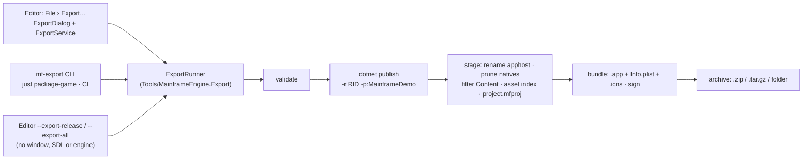
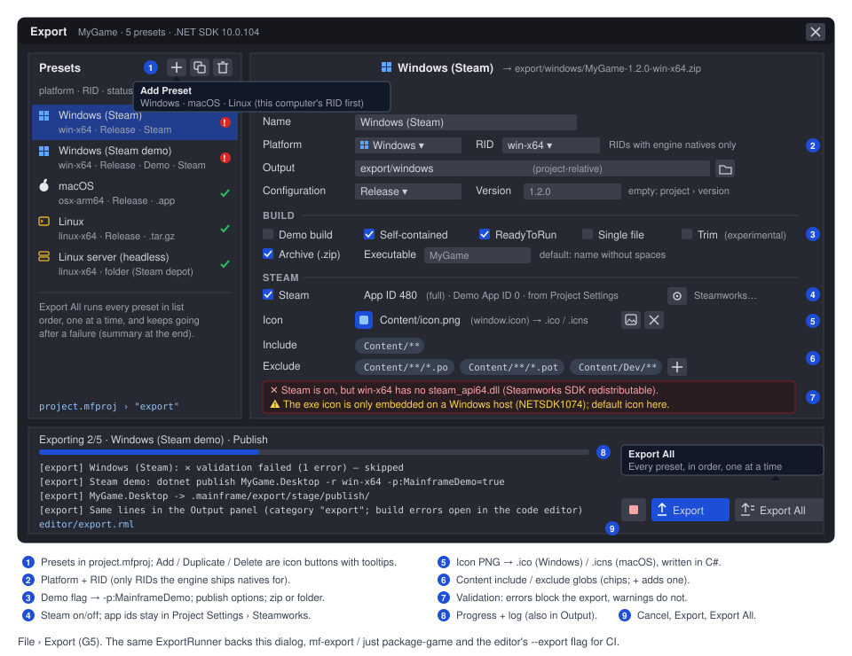

# Proposal: Game export from the editor

**Milestone:** [Gameplay toolkit](../../milestones.md#gameplay-toolkit-) (G5) · **Status:** ⬜ planned ·
**Depends on:** [M10 editor](../editor.md) (Play pipeline, Output panel, Project Settings),
[Release → Games](../release.md#games) (`build/package-game.sh`, which this replaces) · **Related:**
[Mobile core](mobile.md) (M12.7 extends the same `export` presets), [Steamworks](../steamworks.md),
[Project and GameHost → demo builds](../project-and-gamehost.md#demo-builds),
[Distribution via NuGet](distribution-nuget.md)

## Problem

A game can be packaged for players today, but only from a shell with an engine checkout:

- `build/package-game.sh` (`just package-game csproj rid out`, `justfile:115-117`) runs a self-contained, untrimmed
  Release `dotnet publish` for one RID (`package-game.sh:56`). It renames the apphost (`:58-61`) and deletes the
  engine natives of other platforms (`:63-69`). Then it builds a macOS `.app` (Info.plist, `.icns` through
  `sips`/`iconutil`, ad-hoc or Developer ID `codesign`, optional notarization, `:73-141`), a Windows zip (exe icon through
  ImageMagick `magick` → `ApplicationIcon`, `:51-55`, `:142-146`) or a Linux `.tar.gz` (`:147-152`).
- It reads `project.mfproj` with `sed` (`json()`, `:21`; the icon at a fixed 4-space indent, `:25`), so any other
  layout of the file breaks it. It needs bash, `zip`, and macOS or ImageMagick for icons. It is not used by CI.
- Nothing in the editor exports. The editor already builds and runs games: `DotnetGameBuilder` runs `dotnet build`
  through `ProcessRunner` (`MainframeEngine.Editor/Src/Play/GameBuilder.cs:37`, `Src/Tools/ProcessRunner.cs:27`),
  `DotnetSdk` finds the SDK (`Src/Projects/DotnetSdk.cs:23`, `DetectAsync` `:86`) and `PlayController` writes build
  diagnostics to the Output panel with click-to-source (`Src/Play/PlayController.cs:317`). The File menu ends at
  Save / Close Tab / Quit (`Src/EditorCommands.cs:587-601`).
- Demo builds exist but must be chosen by hand. `isDemo` (`MainframeEngine/Src/Project/ProjectSettings.cs:55`) is
  read by `build/MainframeGame.props` (regex on the file) and overridden per build with `-p:MainframeDemo=true|false`.
  `GameHost.Run` replaces it with the flag the game was built with (`GameHost.BuiltAsDemo`, `GameHost.cs:192-193`;
  `GameHost.IsDemo`, `:79`). Shipping the full game and its Steam demo means two publishes with different flags.
- Shipped builds scan `Content/` on the first UID lookup: `AssetDatabase.Refresh` loads `Content/assets.index.json`
  when it exists (`MainframeEngine/Src/Resources/AssetDatabase.cs:97-104`), but nothing calls `WriteIndex`
  (`:152`) except tests.
- Steam cannot work in any export yet: no `steam_api` natives ship (`docs/design/steamworks.md#natives`,
  `memory/context/current-state.md:58`), and Steamworks.NET 2024.8.0 is x64-only, so `osx-arm64` never starts Steam.
  The script does not warn about either.
- [Mobile](mobile.md#editor-integration) (M12.7) already plans a `project.mfproj` `export` array and an Export dialog.
  There is no desktop half for it to extend.

## Goals

- **File › Export…** opens a dialog of export presets stored in `project.mfproj` (`export`). One click exports a
  preset; **Export All** exports every preset in turn.
- One C# **`ExportRunner`** that the editor, `just package-game`, a headless CLI and CI all use, so they produce the
  same output. `package-game.sh` goes away.
- Per preset: platform + RID, output folder, configuration, demo flag, Steam on/off, version, icon, publish options
  (self-contained, ReadyToRun, single file, trimming) and content include/exclude globs.
- Validation before anything runs: missing SDK, desktop project or main scene, unsupported RID or host, missing Steam
  natives, excluded files that scenes still reference.
- Progress, cancel and the full log in the dialog and in the Output panel; build errors open in the code editor.
- Packaging works from any host where the platform allows it, and no external tools are needed for icons or
  archives.
- The `export` schema is the one M12.7 extends with Android and iOS fields.

## Non-goals

- Uploading to stores: SteamPipe/`steamcmd` depots, itch.io `butler`. The output is a folder or archive that those
  tools take.
- Windows Authenticode signing, Linux packages (`.deb`, AppImage, Flatpak) and installers.
- Cooked content and packs. Desktop keeps shipping source files ([ADR 0011](../../../memory/decisions/0011-json-scenes-no-binary-bake.md));
  the cook step is M12.5 `mf-cook`, used by mobile presets only.
- Godot's "export selected scenes and dependencies" mode. v1 filters by globs and warns about broken references.
- Bundling the .NET SDK with the editor. Exporting needs the SDK, as Play does.
- New credentials storage. macOS signing keeps using the keychain identity and `notarytool` profile names, as the
  script does. Mobile secrets are M12.7 ([mobile.md](mobile.md#editor-integration)).

## Design



### Preset schema (`project.mfproj` → `export`)

`export` is an array of presets. Keys common to every platform sit next to platform-specific ones, flat, as in the
mobile draft ([mobile.md:669-683](mobile.md#editor-integration)). Default values are not written, like every other
section (`ProjectSettingsFormat.Write`, `ProjectSettingsFormat.cs:106`).

```jsonc
"export": [
  { "name": "Windows (Steam)", "platform": "windows", "rid": "win-x64",
    "output": "export/windows", "steam": true },
  { "name": "Windows (Steam demo)", "platform": "windows", "rid": "win-x64",
    "output": "export/windows-demo", "demo": true, "steam": true },
  { "name": "macOS", "platform": "macos", "rid": "osx-arm64", "output": "export/macos",
    "bundleId": "com.example.mygame", "copyright": "© 2026 Example",
    "sign": "Developer ID Application: Example (ABCDE12345)", "notaryProfile": "example-notary" },
  { "name": "Linux", "platform": "linux", "rid": "linux-x64", "output": "export/linux" },
  { "name": "Linux server (headless)", "platform": "linux", "rid": "linux-x64",
    "output": "export/server", "archive": false, "exclude": ["Content/Audio/**"] }
]
```

| Key | Platforms | Default | Meaning |
|---|---|---|---|
| `name` | all | required, unique | Shown in the dialog; the CLI selects presets by it. |
| `platform` | all | required | `windows`, `macos`, `linux`; M12.7 adds `android`, `ios`. Selects the known keys. |
| `rid` | desktop | the platform's first supported RID | `win-x64`, `linux-x64`, `osx-arm64`, `osx-x64`: the RIDs with engine natives under `MainframeEngine/runtimes/`. |
| `output` | all | `export/<name as a slug>` | Output folder, project-relative or absolute. Must not be inside `Content/`. |
| `configuration` | all | `Release` | `Debug` exports are development runs (see [Steam](#steam)). |
| `demo` | all | `false` | Passed as `-p:MainframeDemo=true\|false`, so one project ships both builds. The top-level `isDemo` stays the editor and Play setting. |
| `steam` | desktop | `false` | Off: the exported `project.mfproj` gets app ids 0 (Steam stays inert). On: validated, see [Steam](#steam). |
| `version` | all | `""` = project `version`, else `0.0.0` | Names the archive and fills the macOS `CFBundleShortVersionString`. Mobile maps it to `versionName`. |
| `icon` | all | `""` = `window.icon` | A PNG; becomes `.ico` (Windows) and `.icns` (macOS). |
| `exe` | desktop | the name without spaces | The player-facing executable name (the script's `--exe`). |
| `selfContained` | desktop | `true` | `false` makes players install .NET 10. Meant for servers that already have it. |
| `readyToRun` | desktop | `true` | `-p:PublishReadyToRun`: faster start-up and a larger output. The editor's own release uses it (`justfile:124-125`). |
| `singleFile` | desktop | `false` | `-p:PublishSingleFile` + `IncludeNativeLibrariesForSelfExtract`. `Content/` and `project.mfproj` stay next to the exe. |
| `trim` | desktop | `false` | `-p:PublishTrimmed`. Experimental: warns until the engine is trim-clean (M12.6). |
| `archive` | all | `true` | Zip (Windows, macOS) or `.tar.gz` (Linux). `false` leaves a folder, e.g. a Steam depot's content root. |
| `include` | all | `["Content/**"]` | Globs, project-relative with `/`. Only matching `Content/` files ship. |
| `exclude` | all | `["Content/**/*.po", "Content/**/*.pot"]` | Applied after `include`. `.mo` catalogs are compiled at build time, so the sources need not ship. |
| `bundleId` | macos (iOS in M12.7) | `com.mainframegames.<exe lowercased>` | `CFBundleIdentifier` (the script's default). |
| `copyright` | macos | `""` | `NSHumanReadableCopyright`. |
| `sign` | macos | `""` = ad-hoc | A Developer ID identity name (not a secret). It can be overridden by `MF_SIGN_IDENTITY`. |
| `notaryProfile` | macos | `""` = no notarization | A `notarytool` keychain profile name. It can be overridden by `MF_NOTARY_PROFILE`. |

Glob syntax is `*` (within one folder), `**` (any depth) and `?`, matched case-sensitively on project-relative paths.
A small matcher in the export library handles it. `Microsoft.Extensions.FileSystemGlobbing` would be a new package,
and `FileSystemName.MatchesSimpleExpression` has no `**`.

### Format 3 and migration

`ProjectSettingsFormat.Current` goes from 2 to 3 (`ProjectSettingsFormat.cs:20`). The step 2 → 3 does not change the
tree. The bump matters because an older editor would drop the section: its reader only warns about unknown keys
(`Known(...)`, `:394`), and `Write` writes only the sections it models. So an older editor would silently delete every
preset on its next save. With format 3, it rejects the file instead ("Update the engine.", `:72`). The template's
`project.mfproj` moves to `"format": 3` and has no presets. The dialog offers to add one for the host's RID.

C# model (new, `MainframeEngine/Src/Project/ExportPreset.cs`). It lives in core, next to `ProjectSettings`, because
the reader and writer must round-trip it. Games parse the section and never use it.

```csharp
public sealed class ProjectSettings
{
    // …
    /// <summary>The <c>export</c> section: presets for File › Export, mf-export and M12.7 mobile exports.</summary>
    public List<ExportPreset> ExportPresets { get; } = [];   // new
}

/// <summary>One export preset (new). Common keys here; platform keys in <see cref="Options"/>.</summary>
public sealed class ExportPreset
{
    public required string Name { get; set; }
    public required ExportPlatform Platform { get; set; }          // Windows, MacOS, Linux (Android, Ios: M12.7)
    public string? Output { get; set; }
    public string Configuration { get; set; } = "Release";
    public bool Demo { get; set; }
    public string Version { get; set; } = "";
    public string Icon { get; set; } = "";
    public bool Archive { get; set; } = true;
    public List<string> Include { get; } = ["Content/**"];
    public List<string> Exclude { get; } = ["Content/**/*.po", "Content/**/*.pot"];
    public required IExportPlatformOptions Options { get; set; }   // DesktopExportOptions now
}

public sealed class DesktopExportOptions : IExportPlatformOptions
{
    public string Rid { get; set; } = "";
    public bool Steam { get; set; }
    public string Exe { get; set; } = "";
    public bool SelfContained { get; set; } = true;
    public bool ReadyToRun { get; set; } = true;
    public bool SingleFile { get; set; }
    public bool Trim { get; set; }
    public MacOsExportOptions? MacOs { get; set; }                 // bundleId, copyright, sign, notaryProfile
}
```

The reader checks known keys per `platform` (common keys plus that platform's). An Android key on a Windows preset
warns like any unknown key. Names must be unique, and a duplicate throws `InvalidDataException` with the key path,
like other wrong values. Serialization stays hand-written `Utf8JsonWriter`/`JsonObject` code, as in the rest of
`ProjectSettingsFormat`. There is no reflection, so it is AOT-safe.

### The export library and `ExportRunner`

A new project, `Tools/MainframeEngine.Export` (class library, namespace `MainframeEngine.Export`, references
`MainframeEngine`), holds the pipeline. A thin `Tools/MainframeEngine.Export.Cli` (assembly `mf-export`, like
`mf-l10n`) wraps it. The editor references the library. Tool code moves out of the editor into it, unchanged
except for namespaces:

- `ProcessRunner` (`Src/Tools/ProcessRunner.cs`). Its one editor dependency, `EditorCommands.IsRecoverable`, becomes a
  local check.
- `DotnetSdk` (`Src/Projects/DotnetSdk.cs`).
- `GameProjectLayout` (`Src/Projects/GameProjectLayout.cs`; `DesktopProjectOf`, `:119`).
- `MsBuildOutputParser` and `BuildDiagnostic` (`Src/Play/BuildDiagnostics.cs`).
- `ThumbnailCache.Downscale` (`Src/FileSystem/ThumbnailCache.cs:158`), which moves to `MainframeEngine/Src/Imaging`
  next to `Png` for icon sizes.

```csharp
namespace MainframeEngine.Export;

public sealed record ExportRequest(string ProjectDirectory, ExportPreset Preset, string? OutputOverride = null);

public enum ExportPhase { Validate, Publish, Stage, Icon, Bundle, Sign, Notarize, Archive }

/// <summary>Progress: the phase, a 0–1 fraction when known (null: indeterminate), and a short status line.</summary>
public readonly record struct ExportProgress(int PresetIndex, int PresetCount, ExportPhase Phase, float? Fraction, string Status);

public enum ExportIssueSeverity { Warning, Error }
public sealed record ExportIssue(ExportIssueSeverity Severity, string Code, string Message, string? Fix = null);

public sealed record ExportResult(
    bool Succeeded, bool Cancelled, string? ArtifactPath, TimeSpan Duration,
    IReadOnlyList<ExportIssue> Issues, IReadOnlyList<BuildDiagnostic> Diagnostics, string? Error);

public sealed class ExportRunner(ExportEnvironment environment)   // dotnet path, host OS/RID, engine checkout, clock
{
    /// <summary>Checks a preset without running anything slow (no build). Thread-safe.</summary>
    public IReadOnlyList<ExportIssue> Validate(ProjectSettings project, ExportPreset preset);

    /// <summary>Validates, then exports. Never throws for export failures: they are in the result.</summary>
    public Task<ExportResult> RunAsync(ExportRequest request, IProgress<ExportProgress>? progress,
        Action<string>? onLine, CancellationToken cancellationToken);

    /// <summary>Runs presets one after another; a failed or invalid preset does not stop the rest.</summary>
    public Task<IReadOnlyList<ExportResult>> RunAllAsync(string projectDirectory, IReadOnlyList<ExportPreset> presets,
        IProgress<ExportProgress>? progress, Action<string>? onLine, CancellationToken cancellationToken);
}
```

`ExportPlan` (new, pure) turns a preset into paths and arguments, so the decisions are unit-testable without
running `dotnet`. The steps:

1. **Validate** (see [Validation](#validation)). Errors stop this preset.
2. **Publish.** It runs `dotnet publish <Desktop.csproj> -c <cfg> -r <rid> --self-contained <bool> -p:MainframeDemo=<demo>
   -p:PublishReadyToRun=<bool> -p:PublishSingleFile=<bool> -p:PublishTrimmed=<bool> [-p:ApplicationIcon=<ico>]
   --artifacts-path <project>/.mainframe/export/obj/<rid>-<full|demo> -o <stage>/publish -nologo -v:minimal
   -clp:NoSummary -p:GenerateFullPaths=true` through `ProcessRunner`. Output lines stream to `onLine`, and
   diagnostics are parsed with `MsBuildOutputParser.ParseAll` as Play does. `--artifacts-path` keeps export
   intermediates (other RIDs, demo defines, Release) away from the `bin/`/`obj/` the editor's Play and code reload
   use. A change of `DefineConstants` between the full and demo exports then never rebuilds or races the editor's
   Debug output. (E5.1 confirms that `--artifacts-path` also moves the referenced game library and the engine
   projects.) The stage is `<project>/.mainframe/export/stage/<preset slug>`, emptied first.
3. **Stage.**
   - Rename the apphost to `exe` (`.exe` on Windows; `chmod +x` elsewhere), as the script does.
   - Delete engine natives of other platforms. The list is every file under `MainframeEngine/runtimes/<other rid>/native`
     that the publish copied, not the script's hard-coded `enet mfrmlui mfsvg`, so new natives are pruned too.
   - Filter `Content/` with `include`/`exclude`. `.meta` sidecars of kept files stay: importers read their settings
     (`TextureImportSettings.FromMeta`, `ModelImportSettings.FromMeta`).
   - Write `Content/assets.index.json` with `new AssetDatabase(stage).Scan()` + `WriteIndex()`, so shipped builds
     skip the start-up scan.
   - Write the exported `project.mfproj` with `ProjectSettings.Save` (see [Exported project file](#exported-project-file)).
   - Fail if a `steam_appid.txt` is in the stage.
4. **Icon.** `IconWriter` (new) decodes the PNG (StbImageSharp, already a core dependency), downsizes it and encodes
   PNGs with `Png.EncodeRgba8` (`MainframeEngine/Src/Imaging/Png.cs:60`). It then writes:
   - `.ico` with PNG entries at 16, 32, 48, 64, 128 and 256 px (valid since Windows Vista), written before step 2 and
     passed as `ApplicationIcon`;
   - `.icns` with PNG chunks `icp4`/`icp5`/`icp6`/`ic07`/`ic08`/`ic09`/`ic10` (16 to 1024 px).

   No `sips`, `iconutil` or ImageMagick is needed.
5. **Bundle (macOS).** `<Name>.app/Contents/{MacOS,Resources}` and the same Info.plist keys as the script (name, bundle
   id, executable, icon, version, copyright, `LSMinimumSystemVersion` 11.0, `NSHighResolutionCapable`, games
   category). `AppBundleWriter` writes it as an XML plist, with no template file.
6. **Sign / Notarize (macOS host only).** Same behaviour as the script. With no `sign`, the bundle gets an ad-hoc
   `codesign --force --deep --sign -`, because Apple Silicon refuses unsigned code. With `sign`, every Mach-O and then
   the bundle get the hardened runtime, a timestamp and the .NET entitlements (JIT, unsigned executable memory,
   library validation off). With `notaryProfile`, `xcrun notarytool submit --wait`, then `stapler staple`, then a
   re-zip. Each tool runs through `ProcessRunner`, and its output goes to the log.
7. **Archive.** `<output>/<exe>-<version>-<rid>.zip` (Windows, macOS) or `.tar.gz` (Linux), as today. Windows and
   Linux archives are written in C#: `System.IO.Compression.ZipArchive`, and `System.Formats.Tar` + `GZipStream` with
   explicit Unix modes, so the executable bit survives an export from Windows. macOS uses `ditto -c -k --norsrc
   --noextattr --keepParent` (the script's fix for extended attributes in the zip). The archive is written as
   `<name>.partial` and renamed over the old one at the end, so a cancelled or failed export leaves the previous
   artifact intact. With `archive: false`, the stage folder (or `.app`) is moved to `<output>/<exe>-<version>-<rid>/`.
8. **Clean.** The stage is deleted. The artifacts cache under `.mainframe/export/obj` is kept for incremental
   exports. The template's `.gitignore` gains `export/` and `.mainframe/`.

**Cancel** cancels the token. `ProcessRunner` kills `dotnet` with its process tree (or `codesign`/`notarytool`), the
runner deletes the stage and the `.partial` file, and the result has `Cancelled = true`.

### Exported project file

The runner never copies `project.mfproj` as-is (the desktop project copies it into `publish/`,
`MyGame.Desktop.csproj:14`). It loads the project's settings, changes a copy and writes it with `ProjectSettings.Save`
over the published one:

- `ExportPresets` cleared, because output paths and signing identities are not the player's business;
- `IsDemo` set to the preset's `demo` (`GameHost` takes the built flag anyway; this keeps the file honest);
- `steam: false` → `Steam.AppId = Steam.DemoAppId = 0`, `RestartThroughSteam = false`;
- `Version` set to the effective version.

### Steam

App ids stay in the `steam` section (`SteamProjectSettings`, `ProjectSettings.cs:340`). The preset only has
`steam: true|false`. `ProjectSettings.SteamAppId` already picks `demoAppId` or `appId` from the built demo flag
(`:81`), so per-preset ids could only disagree with it. The dialog shows the effective id read-only, with an icon
button to Project Settings › Steamworks. This differs from Godot, whose export presets carry platform options only.

For `steam: true`, validation checks:

| Check | Severity | Why |
|---|---|---|
| effective app id (full or demo) ≠ 0 | error | an id of 0 leaves Steam off ([steamworks.md](../steamworks.md#project-settings)) |
| `steam_api64.dll` / `libsteam_api.so` / `libsteam_api.dylib` present for the RID in `MainframeEngine/runtimes/<rid>/native` | error | no natives ship today ([Natives](../steamworks.md#natives)); without them `Steam.TryInitialize` reports `NativeLibraryMissing` |
| RID is not `osx-arm64` | error | Steamworks.NET 2024.8.0 is x64-only → `UnsupportedPlatform`. The fix says to use `osx-x64` (Rosetta) |
| `configuration` is `Release` | warning | a Debug build is a development run (`GameHost.IsDevelopmentRun`, `GameHost.cs:107`): it writes `steam_appid.txt` on players' machines and never relaunches through Steam |

The Steam errors are deliberate. A preset that says Steam is on must not ship a build where Steam silently never
starts. The fix text names both ways out: install the redistributables
([steamworks.md → enabling Steam](../steamworks.md#natives)), or turn Steam off for this preset.

### Hosts and platforms

| Target | From macOS | From Windows | From Linux |
|---|---|---|---|
| `win-x64` | ✅ (exe icon: warning, see below) | ✅ | ✅ (exe icon: warning) |
| `linux-x64` | ✅ | ✅ (modes set in the tar) | ✅ |
| `osx-arm64`, `osx-x64` | ✅ ad-hoc, Developer ID, notarization | ❌ error | ❌ error |

- Self-contained cross-publishing works from any host (`release.md#games`).
- **Windows exe icon.** The SDK only writes Win32 resources into the apphost on a Windows host. Elsewhere it warns
  NETSDK1074, and the exe keeps the default icon. Validation turns that into a warning in advance. E5.1 checks it on
  .NET 10.
- **macOS needs a macOS host.** Apple Silicon refuses unsigned native code, and `codesign` exists only on macOS.
  Ad-hoc signing from other hosts (a managed signer) is an open question.
- **ReadyToRun across OSes.** Crossgen2 targets other OSes from the runtime packs. E5.1 checks each row. If a cell
  fails, validation turns `readyToRun` into a warning and publishes without it.
- **Other RIDs** (`linux-arm64`, `win-arm64`) appear only when `MainframeEngine/runtimes/<rid>/native` exists. Today
  only `linux-x64`, `osx-arm64`, `osx-x64` and `win-x64` do.

### Validation

`ExportRunner.Validate` is cheap: no process is started, except `DotnetSdk.DetectAsync`, which is cached per
session. The dialog re-runs it on every edit, and the CLI runs it before each preset.

| Code | Severity | Condition |
|---|---|---|
| `sdk-missing` | error | no .NET SDK ≥ 10 (`DotnetSdk.DetectAsync`; the message ends with the download URL) |
| `no-desktop-project` | error | `GameProjectLayout.DesktopProjectOf` is null |
| `main-scene` | error | `mainScene` empty or not resolvable through the project's `AssetDatabase` (UID or `Content/` path) |
| `main-scene-excluded` | error | the main scene, an autoload scene or the bus layout is filtered out |
| `rid-unsupported` | error | no engine natives for the RID |
| `host-unsupported` | error | macOS target from a non-macOS host |
| `output-in-content` | error | `output` is inside `Content/` (the next export would ship the last one) |
| `duplicate-name` | error | two presets share a name (also rejected on load) |
| `steam-*` | error/warning | see [Steam](#steam) |
| `notarize-needs-sign` | error | `notaryProfile` without `sign` (the script's rule) |
| `broken-reference` | warning | a kept `.mscene`/`.mres` references an excluded file. The scan is the read-only part of `ReferenceFixer`'s walk (`{"ref"\|"instance": uid, "path"}` objects and exact `Content/` path strings), moved to the library |
| `meta-excluded` | warning | an `exclude` drops `.meta` sidecars of kept files |
| `icon` | warning | the icon is missing or not a PNG, or is smaller than 256 px (512 recommended for `.icns`) |
| `win-icon-host` | warning | Windows exe icon from a non-Windows host |
| `trim` / `single-file` | warning | experimental options |
| `version` | warning | `version` is not `MAJOR.MINOR.PATCH[-suffix]` (macOS rejects other `CFBundleShortVersionString`s) |
| `unsaved` | — | the editor saves every scene first (`EditorCommands.SaveAll`, as Play does, `PlayController.cs:208`), and the export does not start if a save is cancelled |

### Editor: File › Export…



- **Menu.** The File menu gains `Export…` (`file.export`, Ctrl+Shift+E, icon `package-export`) after Save As, enabled
  when a project with a desktop project is open. Project › Project Settings gets no export page, because the dialog
  is the editor for the section.
- **Dialog** (new `MainframeEngine.Editor/Src/UI/ExportDialog.cs`, `Content/Editor/export.rml`, an `EditorDocument`
  like `ProjectSettingsDialog`):
  - The left list has a platform glyph and a status badge (✕ errors, ⚠ warnings, ✓) per preset. The header holds icon
    buttons with tooltips: **Add Preset** (a popup of platforms, the host's RID first; Android/iOS appear disabled
    until M12.7), **Duplicate** and **Delete** (confirmed).
  - The right side shows the options in the order of the schema table, grouped as general, Build, Steam, Icon and
    Content. Include and exclude globs are chips with an add icon button.
  - Validation sits under the options. Each issue has its fix text, and some fixes have an icon button (open Project
    Settings › Steamworks, pick an icon file).
  - Edits go to the project's `ProjectSettings` with undo/redo inside the dialog and are saved with the file, as in
    Project Settings. Primary actions keep text labels with icons (**Export**, **Export All**), and **Cancel** is an
    icon button (`player-stop`), following the editor's icons-over-text rule.
- **Progress.** A bar (determinate for Stage and Archive, indeterminate during Publish, Sign and Notarize), a status
  line `Exporting 2/5 · <preset> · <phase>`, and the last 200 log lines in a monospace list. The dialog may be closed
  during an export, which keeps running. The Output panel shows the same lines and a toolbar chip shows progress.
- **Output panel.** Lines are added as `[export] …`. A new `export` category with the `package-export` icon is added
  to `OutputCategories.IconOf` (`Src/Output/OutputLog.cs:76`). Publish diagnostics are added like build diagnostics
  (file and line, so errors open in the code editor). The result line for each preset links the artifact ("Show in
  Finder/Explorer").
- **`ExportService`** (new `Src/Export/ExportService.cs`) follows `PlayService`'s threading
  (`Src/Play/PlayService.cs:29-34`):
  - Runner progress and lines arrive on background threads and are only queued.
  - `Update()` (main thread, once per editor frame) drains them and raises `Changed`/`Line`/`Finished`.
  - An idle `Update` allocates nothing.
  - One export pipeline runs at a time. While it runs, Play, Build & Reload and Export are disabled with a tooltip
    saying why. While the editor is building, Export waits for that build first.
- **Export All** runs `ExportRunner.RunAllAsync` over the list in order, one preset at a time (parallel `dotnet
  publish` runs fight over the same projects). It ends with a summary: `3 exported, 1 failed, 1 skipped (invalid)`.
- **Icons.** `package-export`, `file-zip`, `brand-windows`, `brand-apple` and `brand-ubuntu` are not in the atlas yet.
  They are added to `MainframeEngine.Editor/Content/icons/icons.txt` (`just editor-icons-fetch`, `just editor-icons`).

### Headless export: CLI, `just`, CI

- **`mf-export`** (new): `dotnet run --project Tools/MainframeEngine.Export.Cli -c Release --`
  - `--project <dir> --preset "<name>" [--output <dir>]`
  - `--project <dir> --all`
  - `--project <dir> --list`, which prints the presets and their validation.
  - The ad-hoc form `<Desktop.csproj> <rid> <out> [--name] [--exe] [--version] [--bundle-id] [--copyright] [--icon]
    [--sign] [--notarize] [--demo] [--steam]` keeps the script's arguments, mapped onto an unsaved preset, so
    existing commands keep working.
  - Exit codes: 0 = success, 1 = a preset failed, 2 = usage or validation error. Errors go to stderr in MSBuild
    format so CI annotates them.
- **`just package-game`** calls `mf-export` with the same arguments, and `build/package-game.sh` is deleted.
  `release.md#games` is rewritten around presets.
- **Editor flags** (Godot's names). `MainframeEngine.Editor --project <dir> --export-release "<preset>" [<output>]`,
  `--export-debug "<preset>"` (configuration `Debug`) and `--export-all` run the library from `Program.cs` before an
  `EditorApp` exists, like `--validate-demo-zip` (`Program.cs:14-15`): no window, SDL or engine. Users with only the
  released editor (no checkout) can then export from scripts, provided their game builds.
- **CI.** The `template` job (`.github/workflows/ci.yml:279`) gains a step after the smoke run. `mf-export` runs a
  `linux-x64` preset of the generated game, unpacks the `.tar.gz` and runs it with `--headless --max-frames 30`
  (`HeadlessHost`). That proves the content, `project.mfproj` and the asset index are in place. A game's own CI does
  the same with its preset names.

### Mobile (M12.7) extends the same schema

- **Kept:** the M12.7 presets from [mobile.md](mobile.md#editor-integration) live in the same `export` array, with
  the common keys: `name`, `platform`, `output`, `configuration`, `demo`, `version`, `icon`, `archive`, `include`,
  `exclude`.
- **New platform values:** `platform: "android" | "ios"` select `AndroidExportOptions` / `IosExportOptions`
  (`IExportPlatformOptions`). They hold the mobile keys as drafted: `applicationId`, `versionCode`, `orientation`,
  `tier`, `packs`, `signing`, `bundleId`, `team` and `capabilities`. `bundleId` is the same key as on macOS.
- **Version name:** the mobile draft's `versionName` becomes the common `version`. This is the one change to the
  draft, so that a desktop and an Android preset of one game do not need two version keys. `versionCode: "auto"`
  stays Android-only.
- **Content filters:** `include`/`exclude` decide which files enter the export. Mobile `packs` then assigns the
  included files to install-time, fast-follow and on-demand packs.
- **Pipeline:** `ExportRunner` gains platform steps behind an `IExportPlatform` (new) interface, one per platform:
  - Desktop: publish → stage → bundle → archive.
  - Android: cook → build/publish of `MyGame.Android` → APK/AAB signing.
  - iOS: cook → build of `MyGame.iOS` → archive.

  The common parts (validation framework, progress, Output, cancel, the CLI and `--export-*` flags) are shared.
- **Steam:** stays desktop-only (`DesktopExportOptions.Steam`).
- **Format:** M12.7 needs no format bump for the new platform values. An older editor rejects an unknown `platform`
  with a clear error, instead of dropping the preset.

### Threading and allocation

Export is editor and tool code. Nothing runs per game frame, so the allocation gate is unaffected. In the editor:

- the runner works on the thread pool;
- `ExportService.Update` drains queues on the main thread and allocates only when there is something to report;
- RmlUi data model updates happen on the main thread, through `Model.Dirty`.

The runner never touches RmlUi, the scene tree or the editor's `AssetDatabase.Current`. It builds its own
`AssetDatabase` over the stage.

## Testing

- **Unit, settings** (`Tests/MainframeEngine.Tests/Project/`): preset parse/write round trip; defaults omitted;
  per-platform known keys (an Android key on a Windows preset warns); duplicate names throw; migrations 1 → 3 and
  2 → 3 keep everything else unchanged; a format-3 file read with `currentFormat: 2` is rejected (the old-editor
  guard); the Demo's format-1 `project.mfproj` upgrades.
- **Unit, export library** (new `Tests/MainframeEngine.Export.Tests`, or a folder in the editor tests, which already
  host `ProcessRunnerTests` and `DotnetSdkTests`):
  - `ExportPlan` arguments for each option and platform (demo, R2R, single file, trim, icon, `--artifacts-path`).
  - Glob matcher (`*`, `**`, `?`, case-sensitivity, `/` only).
  - Content filter over a fixture tree.
  - Natives pruning from a fake `runtimes/` tree.
  - Exported `project.mfproj` transform (Steam off zeroes ids and restart; presets stripped; demo and version set).
  - `.ico`/`.icns` writers (parse headers back, decode each embedded PNG and check the sizes).
  - Tar and zip Unix modes (the apphost is executable after an export from a simulated Windows host).
  - Every validation code, positive and negative.
  - `.partial` cleanup on cancel.
  - `mf-export` argument parsing, including the legacy `package-game` form.
- **Integration** (needs the SDK, alongside `ProjectCreationIntegrationTests`): create a game from the template, export
  a `linux-x64` (Linux/macOS hosts) or `win-x64` preset, and check the artifact layout. Check the renamed exe,
  `project.mfproj` (no presets), `Content/assets.index.json`, no foreign natives and no `.po`. A second export with
  `demo: true` produces an assembly whose `MainframeDemo` metadata is `true` (`GameHost.BuiltAsDemo`).
- **Editor unit** (`Tests/MainframeEngine.Editor.Tests`): `ExportService` queueing and draining with a fake runner
  (events only on the main thread, idle `Update` allocates 0 bytes); menu enablement; Export disabled while Play
  builds.
- **QA** (`Tests/QA/export.qa`, new): open File › Export, add a Linux preset, toggle Demo, add an exclude chip, capture
  the dialog, export, wait for the result line, capture the Output panel. Add a dialog capture to
  `readme-screenshots.qa`.
- **CI:** the `template` job's export-and-run step (above). No render tests or goldens change: nothing renders
  differently.
- **Demo:** `Examples/Demo/project.mfproj` gets presets (Windows, macOS, Linux, Linux server), so `just demo` users
  and the README can show the dialog.

## Acceptance

- In the editor, File › Export… on a template game exports a working build for the host platform with one click. The
  build runs on a clean machine without the .NET SDK or an engine checkout.
- Export All on the Demo produces Windows, macOS (on a Mac), Linux and server artifacts. Invalid presets are reported
  and skipped, and the rest still export.
- Full and Steam demo builds come from one project with no manual `isDemo` edit, and `#if DEMO` code differs between
  them.
- A Steam preset reports the missing `steam_api` natives (and `osx-arm64`) before building.
- Cancel stops `dotnet publish` within a second or two and leaves the previous artifact in place.
- `just package-game` and `mf-export --preset` produce byte-identical archive contents to the editor for the same
  preset (timestamps excluded). `build/package-game.sh` is gone.
- An older editor (format 2) refuses a format-3 project instead of deleting its presets.
- CI's `template` job exports and runs the template game.
- Docs updated when this ships: `docs/design/release.md` (Games: presets, `mf-export`, hosts table),
  `docs/design/editor.md` (new "Export" section: dialog, service, flags),
  `docs/design/project-and-gamehost.md` (`project.mfproj` format 3, `export` section, demo builds via presets),
  `docs/design/steamworks.md` (export-time Steam checks) and `docs/design/testing.md` (export tests, CI step).
  [mobile.md](mobile.md#editor-integration) uses `version` instead of `versionName`.

## Task list

1. **G5.1 Spikes.** Confirm on .NET 10:
   - `--artifacts-path` isolates the game, its library and engine intermediates from the editor's `bin/`/`obj/`;
   - NETSDK1074 when the exe icon is set from a non-Windows host;
   - ReadyToRun for every RID from each host;
   - single-file start-up with RmlUi/SDL natives self-extracted;
   - an `.icns` with PNG chunks shows in Finder and the Dock.

   Record the outcomes in an ADR (runner in C#, export library, format 3).
2. **G5.2 Schema.**
   - `ExportPreset`, `DesktopExportOptions`, `MacOsExportOptions`; the reader and writer; `ProjectSettingsFormat.Current
     = 3` + migration; tests.
   - Template `project.mfproj` format 3; template `.gitignore` (`export/`, `.mainframe/`).
3. **G5.3 Library.**
   - `Tools/MainframeEngine.Export` + tests project; move `ProcessRunner`, `DotnetSdk`, `GameProjectLayout`,
     `MsBuildOutputParser`, `Downscale`; the editor references the library.
   - `ExportPlan`, glob matcher, content filter, natives pruning, exported project file, asset index, `IconWriter`,
     `AppBundleWriter`, macOS signing/notarization, archivers, `ExportRunner.Validate`/`RunAsync`/`RunAllAsync`.
4. **G5.4 CLI and CI.**
   - `mf-export` (preset, `--all`, `--list` and the legacy form); `just package-game` → `mf-export`; delete
     `build/package-game.sh`.
   - Editor `--export-release`/`--export-debug`/`--export-all` in `Program.cs`.
   - The CI `template` export-and-run step.
5. **G5.5 Editor.**
   - `ExportService`, `ExportDialog` + `export.rml`, File › Export…, Output category and icon, toolbar progress chip,
     mutual exclusion with Play and Build & Reload, new atlas icons.
   - Editor tests; `Tests/QA/export.qa`; Demo presets.
6. **G5.6 Docs.** The current-state docs listed under Acceptance; move this proposal's content into them.

## Open questions

- **macOS signing from Windows/Linux.** Should the runner gain a managed ad-hoc Mach-O signer, so `osx-*` exports work
  from any host? This is code-signature format work, the same in spirit as the SDK's apphost signing, and no
  package. Or should "macOS needs a Mac" stay?
- **Single-file default.** Should it ever become the default for Windows? It needs the self-extract of natives, and it
  slows the first start.
- **Version stamping.** Pass `-p:Version=<version>` so the game's assemblies carry the version? As a global property,
  it would stamp the engine assemblies too. Should there be a game-only property in `MainframeGame.props` instead?
- **Presets in `project.mfproj` or a separate file?** Godot keeps `export_presets.cfg` apart from `project.godot`.
  This proposal follows [mobile.md](mobile.md#editor-integration) (one file, fewer moving parts). A separate
  `export.mfexport` would keep team-specific paths out of the main file.
- **Per-preset Steam app id override** (e.g. a playtest app): add it later if someone needs it, or never?
- **Content packs for desktop (`.mfpak`).** Should desktop exports later use M12.1's pack format to hide source files?
  Not before M12.1 exists.

## Related

- [Release → Games](../release.md#games), the behaviour this keeps
- [Mobile core → Editor integration](mobile.md#editor-integration), the M12.7 presets that extend the schema
- [Steamworks → Natives](../steamworks.md#natives) and [Project settings](../steamworks.md#project-settings)
- [Project and GameHost → Demo builds](../project-and-gamehost.md#demo-builds)
- [Editor → Play](../editor.md#play), the build, Output and threading pattern reused here
- [Distribution via NuGet](distribution-nuget.md), for exports of games that use engine packages instead of a checkout
- Sibling Gameplay toolkit proposals: [Save games and settings](save-and-settings.md) (G4) adds no export needs,
  because saves live in the user-data folder, not in the export.
