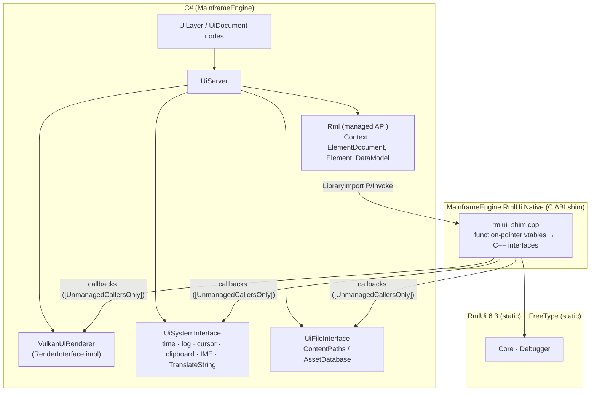
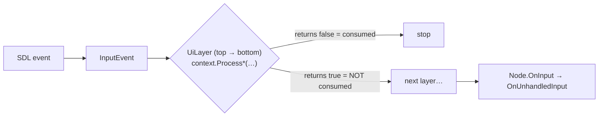

# Proposal: Game UI (RmlUi)

**Milestone:** M8 · **Status:** ⬜ planned · **Decision:** RmlUi for HTML/CSS-style UI (agreed
2026-10-05) · **Depends on:** [SDL windowing](../build-and-platforms.md#windowing-sdl2), [GPU resources](../gpu-resources.md),
[Color pipeline](../color-pipeline.md) · **Used by:** games and the [Editor](editor.md)

## Library

| | |
|---|---|
| Library | [RmlUi](https://github.com/mikke89/RmlUi) **6.3** (C++17, MIT): HTML/CSS-like documents (`.rml` / `.rcss`), data bindings, templates, animations, transitions |
| Fonts | built-in FreeType font engine (FreeType license: use the **FTL** option and add the credit) |
| C# binding | **None maintained.** Existing packages (RmlUi.Net 1.0.1, PourrezJ.RmlUi.Net 1.1.1, KumaEngine.RmlUi.Net) are works in progress, mostly Windows-only. Their managed render interface lacks clip masks, layers and filters. The PourrezJ fork (RmlUi 6.2) is the best starting point. |
| Plan | **Own the binding:** fork the PourrezJ C shim (`RmlUiNative`) into the engine repo, update it to RmlUi 6.3, extend it with the full render interface, and build natives per platform ourselves. |

## Goals

- In-game UI written as RML/RCSS documents with data binding to C# state.
- The **same UI stack powers the editor** ([Editor](editor.md#ui-rmlui)), so the editor dogfoods
  game UI.
- Native Vulkan rendering on the engine's device, render pass and command buffers. RmlUi never creates
  its own Vulkan instance.
- Correct HiDPI handling, IME and clipboard (via SDL), and keyboard/gamepad navigation.
- Localization through RmlUi's `TranslateString` hook ([Localization](localization.md)).
- Hot reload of `.rml`/`.rcss` in development, plus the RmlUi visual debugger.

## Non-goals (v1)

World-space (3D in-world) UI panels, custom font engine/HarfBuzz shaping, RTL text.

## Architecture




### Projects and natives

| Piece | Location | Notes |
|---|---|---|
| Native shim | `Native/RmlUi/` (CMake) | RmlUi 6.3 + FreeType as git submodules. C ABI: `rml_*` functions, handles as `void*`, interfaces passed as structs of function pointers. |
| Managed API | `MainframeEngine/Src/UI/Rml/` | `LibraryImport` (source-generated P/Invoke), `SafeHandle` wrappers, `[UnmanagedCallersOnly]` callbacks, UTF-8 marshalling |
| Binaries | `MainframeEngine/runtimes/{win-x64, linux-x64, osx-arm64, osx-x64}/native/` | built by a GitHub Actions matrix. macOS builds a universal dylib, and it must be placed under **both** osx RIDs (the PourrezJ package only ships `osx-x64`, which NuGet won't select for arm64). |

Once built, the native binaries are committed (or pulled from CI artifacts by an MSBuild target), so
contributors don't need CMake.

## Render interface (Vulkan)

The implementation is a port of RmlUi's official `RmlUi_Renderer_VK` onto our device. That backend is
MIT, and master after 6.3 adds full effects and MoltenVK support. Only its pipeline, descriptor and
buffer logic is reused. Instance, device and swapchain code is dropped.

| RmlUi call | Implementation |
|---|---|
| `CompileGeometry(vertices, indices)` | copy into a **retained geometry arena** (host-visible, persistently mapped; later device-local via the upload queue). Returns a handle → `{vbOffset, ibOffset, indexCount}`. |
| `RenderGeometry(handle, translation, texture)` | bind pipeline (textured, or untextured via a 1×1 white texture), bind texture set, push `{mat4 transform, vec2 translation}`, `vkCmdDrawIndexed` |
| `ReleaseGeometry(handle)` | free the arena range through the **deletion queue** (after the frame slot retires) |
| `LoadTexture(dims, source)` | `ContentPaths` → StbImageSharp → **premultiply alpha** → `VkTexture`. The `engine://` scheme wraps an existing engine texture or render target (used by the editor `<viewport>`, minimaps, avatars). |
| `GenerateTexture(rgba, dims)` | font atlases and generated images; the data is already premultiplied |
| `ReleaseTexture` | deletion queue |
| `EnableScissorRegion` / `SetScissorRegion(rect)` | `vkCmdSetScissor`, in framebuffer pixels (window coords × DPI scale) |
| `SetTransform(m)` | stored and pushed with the next draws (null = identity) |
| `EnableClipMask` / `RenderToClipMask` | **phase 2:** stencil write/test pipelines |
| `PushLayer` / `CompositeLayers` / `PopLayer`, filters, shaders | **phase 2:** offscreen layer targets, blur, drop-shadow, gradients (box-shadow, `filter:`, `linear-gradient`) |

- **Vertex format:** `Rml::Vertex` is 20 bytes: `vec2 position` (offset 0), `RGBA8 premultiplied colour`
  (offset 8), `vec2 tex_coord` (offset 12).
- **Blending:** premultiplied alpha, `ONE / ONE_MINUS_SRC_ALPHA` for both colour and alpha.
- **Projection:** orthographic in pixels, origin top-left, viewport **not** Y-flipped (same as ImGui;
  see [Coordinate conventions](../coordinate-conventions.md#viewport)).

### Where UI renders in the frame

| Phase | Pass |
|---|---|
| v1 (basic set) | inside the main render pass, after scene geometry and before ImGui. Depth test off. |
| v2 (effects) | its own **UI render pass** after the tonemap ([Color pipeline](../color-pipeline.md)). It loads swapchain colour, adds an `S8`/`D24S8` stencil attachment for clip masks, and has offscreen layer targets for filters. |

## System and file interfaces

| Hook | Engine behaviour |
|---|---|
| `GetElapsedTime` | engine clock (seconds since start) |
| `LogMessage(type, msg)` | `Log.Debug/Info/Warning/Error` |
| `SetMouseCursor(name)` | SDL system cursors (`pointer`, `text`, `move`, `resize`, …) |
| `SetClipboardText` / `GetClipboardText` | SDL clipboard |
| `ActivateKeyboard(caret, lineHeight)` / `DeactivateKeyboard` | SDL text input start/stop + IME candidate rect |
| `TranslateString(out, in)` | [Localization](localization.md#rmlui-integration) catalog lookup |
| File interface `Open/Read/Seek/Tell/Close` | `ContentPaths` / `AssetDatabase`, so documents load from `Content/` in dev and from the pack in shipped builds |

## Contexts, layers and documents

- **`UiLayer : Node`** owns one RmlUi `Context`, like Godot's `CanvasLayer`. Properties:
  - `Layer` (draw/input order);
  - `Visible`;
  - `ScaleMode` (pixels, or reference resolution with scale).

  Context dimensions are the framebuffer size, and `SetDensityIndependentPixelRatio(fbScale)` handles
  HiDPI.
- **`UiDocument : Node`** is a child of a `UiLayer`. Properties: `Source` (an `.rml` resource),
  `Visible` (`Show`/`Hide`) and `Modal`. It loads on `OnEnterTree` and unloads on `OnExitTree`.
- Games typically have a HUD layer (0), a menu layer (10) and an overlay layer (100). The editor uses
  its own layers.

```csharp
public partial class Hud : UiDocument
{
    [Export] public NodePath PlayerPath { get; set; }
    private Player _player = null!;

    protected override void OnReady()
    {
        _player = GetNode<Player>(PlayerPath);
        Model = CreateDataModel("hud")
            .Bind("health",  () => _player.Health)
            .Bind("ammo",    () => _player.Ammo)
            .Event("pause",  _ => Tree.Paused = true);
        GetElementById("quit")!.Click += _ => Tree.Quit();
    }
    protected override void OnProcess(in GameTime t) => Model.DirtyAll(); // or Dirty("health") on change
}
```

```html
<!-- Content/UI/hud.rml -->
<rml>
<head><link type="text/rcss" href="hud.rcss"/></head>
<body data-model="hud">
  <div id="health">♥ {{ health }}</div>
  <div id="ammo">{{ ammo }}</div>
  <button data-event-click="pause">Pause</button>
  <button id="quit">Quit</button>
</body>
</rml>
```

### Data binding

- Wraps `DataModelConstructor`:
  - `Bind(name, getter[, setter])` maps to `BindFunc`;
  - `Event(name, handler)` maps to `BindEventCallback`;
  - `Struct<T>()` and `Array<T>()` register types;
  - `Dirty(name)` and `DirtyAll()` mark changes.
- Later, a source generator can bind `[UiBindable]` properties automatically and dirty them when they
  are set.
- Element access: `GetElementById`, `QuerySelector(All)`, attributes, classes, `InnerRml`, and events
  as C# events (`Click`, `Change`, `Submit`, `Focus`, `Blur`, `MouseOver`, …).

## Input routing



- **RmlUi's return value is inverted from what you might expect:** `Process*` returns **true when the
  event was *not* consumed**. `UiServer` wraps this as a `bool consumed` so it can't be misread.
- **Mouse:** `ProcessMouseMove(x, y, mods)` in framebuffer pixels, plus button down/up, wheel, and
  `ProcessMouseLeave` on window leave.
- **Keyboard:** SDL scancodes → `Rml::Input::KeyIdentifier` table, with modifier flags.
- **Text:** SDL text-input events → `ProcessTextInput`.
- **Gamepad:** D-pad and left stick → arrow keys, A → Enter, B → Escape, sent as key events so RmlUi's
  focus navigation works. Verify RmlUi 6.3's `nav-*` property support during implementation.
- `UiDocument.Modal` blocks input to lower layers while it is shown.

## Development tools

- **Hot reload:** in debug builds, a `FileSystemWatcher` on `Content/UI` clears RmlUi's style sheet and
  template caches and reloads affected documents. Data model state is preserved because it lives in C#.
- **Debugger:** the RmlUi visual debugger plugin, toggled with F8 (element inspector, event log,
  outlines).
- **Shared widget library:** `MainframeEngine/Content/UI/widgets/` (templates + RCSS + small C#
  behaviours), used by the editor and available to games: `tree-view`, `property-*`, `splitter`,
  `tabs`, `context-menu`, `dropdown`, `slider`, `color-picker`, `modal`.

## Task list

- [ ] Fork the PourrezJ `RmlUiNative` shim into `Native/RmlUi/`; bump to RmlUi 6.3; FreeType (FTL) static
- [ ] Extend the C ABI: full render interface (clip mask, layers, filters, shaders), system, file, data models, events, debugger
- [ ] CI matrix → natives for win-x64, linux-x64, osx universal (placed under osx-arm64 and osx-x64)
- [ ] Managed API (`LibraryImport`, SafeHandles, callbacks)
- [ ] `VulkanUiRenderer` v1 (basic set) inside the main pass
- [ ] `UiServer`, `UiLayer`, `UiDocument`; HiDPI ratio; `engine://` texture scheme
- [ ] Input routing (mouse, keys, text/IME, gamepad → nav keys) with "consumed" semantics
- [ ] Data model API + element events
- [ ] Hot reload + debugger toggle
- [ ] v2: UI render pass with stencil, layers and filters (port of the master VK effects)
- [ ] Shared widget library
- [ ] Sandbox: HUD (FPS, health), pause menu with settings (VSync, volume via [Audio](../audio.md) buses)
- [ ] Credits screen entry for FreeType (FTL requirement)

## Risks

| Risk | Mitigation |
|---|---|
| We own a native binding and per-platform builds | small C ABI surface; CI matrix; fork prior art instead of starting from zero |
| Full VK effects and MoltenVK fixes are only on RmlUi master | v1 uses the basic set (in 6.3); v2 ports from master, or from 6.4 once it is tagged |
| Inverted `Process*` return semantics | wrapped once in `UiServer` with tests |
| Clip masks need a stencil buffer | v2 UI pass owns a stencil attachment |
| Premultiplied-alpha mistakes | premultiply on texture load; one blend state; visual tests with semi-transparent images |

## Related

[Milestones](../../milestones.md) · [Editor](editor.md) · [Localization](localization.md) · [SDL windowing](../build-and-platforms.md#windowing-sdl2) ·
[ImGui & debug tools](../imgui-and-debug-tools.md) · [Color pipeline](../color-pipeline.md)
