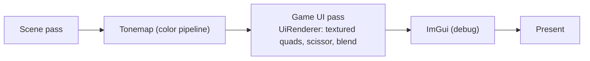

# Proposal: Game UI

**Milestone:** M6 · **Status:** ⬜ planned · **Needs:** dependency decision

## Problem

ImGui is for debugging. Shipped games need styled, localizable, gamepad-navigable UI. The README lists
RmlUi, Myra and Skia as candidates, plus GetText for localization.

## Goals

- In-game UI (menus, HUD) rendered by the Vulkan backend, after the scene and before ImGui.
- Data binding to game state; keyboard, mouse and gamepad navigation.
- Localization of strings.
- ImGui remains available as a debug overlay.

## Dependency decision (to discuss)

| Option | Model | Notes |
|---|---|---|
| RmlUi (binding) | HTML/CSS-like documents | Mature; needs a custom Vulkan render interface |
| Myra | C# widgets | MonoGame-oriented; needs a renderer adapter |
| SkiaSharp + custom widgets | immediate 2D canvas | Flexible; more code to write |

Record the choice as an ADR before adding packages.

## Proposed design

- A `UiRenderer` implements the library's render interface: vertex/index upload, texture handles,
  scissor regions. It reuses the [GPU resource management](gpu-resource-management.md) upload queue.
- Input routing: UI → ImGui → game, with "consumed" flags.
- Localization: string tables loaded from `Content/Localization/*.po`.

## Task list

- [ ] Choose the library (ADR)
- [ ] `UiRenderer` Vulkan backend
- [ ] Input routing + focus
- [ ] Localization tables
- [ ] Sandbox: main menu + HUD with FPS

## Related

[Milestones](../../milestones.md) · [ImGui & debug tools](../imgui-and-debug-tools.md) · [Color pipeline](color-pipeline.md)
