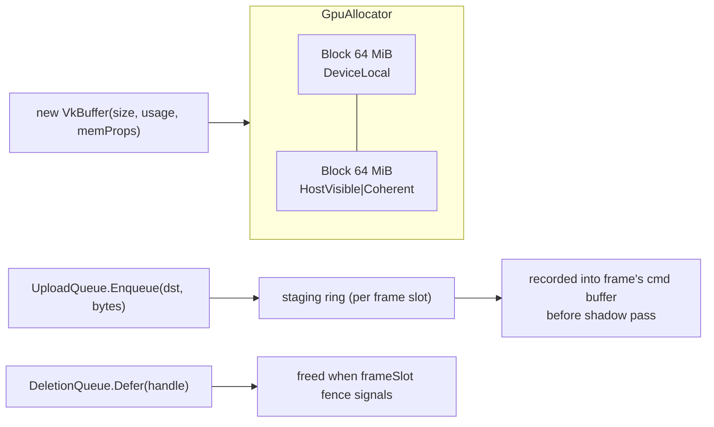

# Proposal: GPU Resource Management

**Milestone:** M3 · **Status:** ⬜ planned · **Touches:** every Vulkan consumer

## Problem

- Every buffer and image calls `vkAllocateMemory` directly. The shadow system alone makes dozens of
  allocations (roughly 116 MiB), and drivers cap the allocation count (`maxMemoryAllocationCount`,
  often 4096).
- Each upload is a one-time command buffer followed by `QueueWaitIdle`, which stalls the GPU; the sky
  does this three times.
- Helpers (`CreateBuffer`, `FindMemoryType`, `CopyBuffer`, `CreateShaderModule`) are copy-pasted
  across `ShapeBase`, `SceneGrid`, `SkyEnvironment`, `SpineRenderer`, `ShadowSystem` and ImGui.
- Disposal relies on `DeviceWaitIdle` in each `Dispose`.

## Goals

- One `GpuAllocator` that sub-allocates from large blocks per memory type.
- One `UploadQueue`: staging ring + batched copies, fenced, no `QueueWaitIdle`.
- One `DeletionQueue`: objects are freed when the frame that last used them retires.
- One set of shared helpers (`VkBuffer`, `VkImage`, `VkTexture`), following the abstractions already
  prototyped in `Examples/SilkVulkanExamples/Vulkan/1.4_Abstractions`.

## Non-goals

Defragmentation, aliasing, async compute.

## Proposed design

- A simple free-list or buddy allocator per memory type, with dedicated allocations for images over
  32 MiB.
- Staging upload is recorded at the start of the frame command buffer, with a barrier to the
  consumer stage. Startup uploads use one batched submit.
- `IDisposable` on GPU wrappers defers to the deletion queue instead of `DeviceWaitIdle`.

**Dependency decision:** this could adopt VMA through a binding, but that is a new NuGet package and
needs discussion (CLAUDE.md). The default plan is a small in-house allocator.

## Task list

- [ ] `VkBuffer`/`VkImage`/`VkTexture` wrappers + shared helpers; delete the copies
- [ ] `GpuAllocator` (per-type blocks, free list)
- [ ] `UploadQueue` + staging ring
- [ ] `DeletionQueue` keyed by frame slot
- [ ] Port the Shadow, Sky, Grid, Shapes, Spine and ImGui code
- [ ] Debug ImGui panel: allocation count, bytes per heap

## Open questions

- In-house allocator or a VMA binding?

## Related

[Milestones](../../milestones.md) · [Vulkan renderer](../vulkan-renderer.md) · [Materials & meshes](materials-and-meshes.md)
