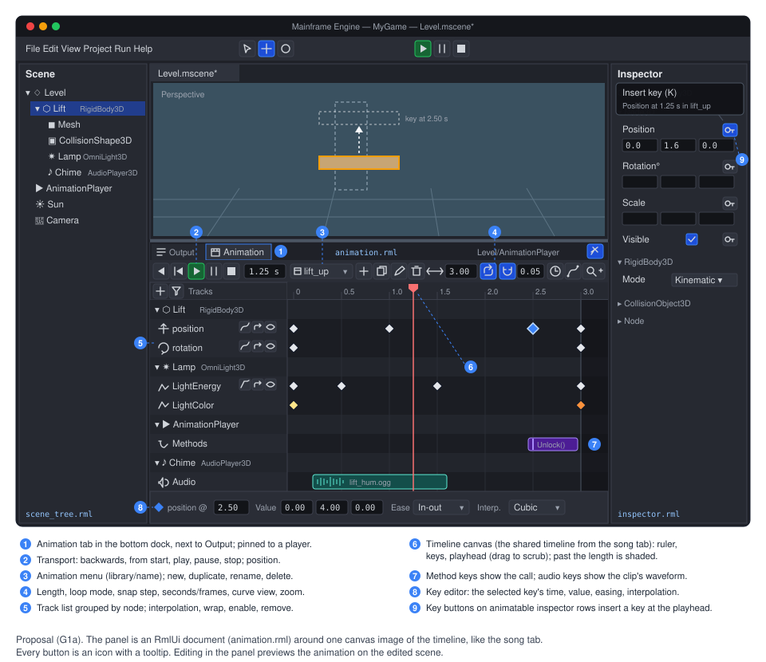
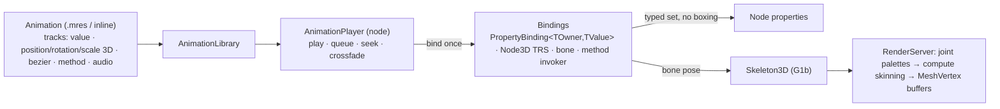

# Proposal: Keyframe animation (Animation, AnimationPlayer, skinning)

**Milestone:** [Gameplay toolkit](../../milestones.md#gameplay-toolkit-) (G1: G1a animation + timeline, G1b skinning) ·
**Status:** ⬜ planned · **Depends on:** [Scene serialization](../scene-serialization.md) (resources, generator),
[Editor](../editor.md), the song tab's timeline on the unmerged `feature/sound-designer` branch
([shared timeline](#shared-timeline-component)) · **Related:** [2D content](2d-content.md) (G2: `AnimatedSprite2D` uses
the same player ideas), [Rendering features](rendering-features.md) (G6: PBR shaders skinned meshes must still feed),
[Editor viewport tools](editor-viewport-tools.md) (G7: Save as `.mres` / Make unique for imported libraries),
[Mobile](mobile.md) (AOT), [Rendering backend abstraction](rendering-backend-abstraction.md) (compute in M11)



## Problem

The engine can move things over time only from code, or with Spine:

- **`Tween`** (`MainframeEngine/Src/Scene/Tween.cs`) is a port of Godot's: `TweenProperty(object target, string
  property, object finalValue, double duration)` (`Tween.cs:102-109`). It is code-only (nothing is authored or saved),
  and it reaches properties by reflection: `TweenPropertyPath.Parse` calls `Type.GetProperty` and
  `PropertyInfo.GetValue/SetValue` (`Tween.cs:836-883`). Values are boxed and split into new `float[]`s on every step
  (`TweenValues`, `Tween.cs:887-967`), so each step allocates, and the reflection is not trimming-safe.
- **`SpineNode`** (`MainframeEngine/Src/Nodes/SpineNode.cs:14`) plays animations of a Spine skeleton by name
  (`Animation`, `SpineNode.cs:64-65`). It animates nothing else.
- There is **no keyed animation data**: no resource with keys, no player node, no editor timeline. Doors, lifts, light
  flickers, UI motion and cutscenes are hand-written per game.
- **Imported models are static.** [Asset pipeline](../asset-pipeline.md) says skinning and animations are not imported
  (`asset-pipeline.md:117`; also `ModelImporter.cs:100`), and [Materials & meshes](../materials-and-meshes.md) lists no
  skinning (`materials-and-meshes.md:373`). The importer's Assimp flags have no bone handling
  (`ModelImporter.cs:213-219`). `MeshVertex` is position, normal and UV only (`MeshVertex.cs:13-21`), the mesh and
  shadow vertex layouts have no joints or weights (`MeshVertex.cs:51-91`, `Content/Shaders/Mesh/Mesh.vk.vert:8-16`), and
  `MeshSurface` stores positions, normals, UVs and indices only (`Rendering/Resources/Mesh.cs:108-120`).

What exists and helps:

- The generator already emits **typed accessors** for every `[Export]` member: `ExportPropertyInfo<TOwner, TValue>` with
  `Get(TOwner)`/`Set(TOwner, TValue)` delegates (`Serialization/ExportPropertyInfo.cs:51-90`), found by name with
  `NodeTypeInfo.FindProperty` (`NodeTypeInfo.cs:184`). Only the inspector uses the boxed `GetValue/SetValue`.
- Vector-like values already have **float-array codecs** (`FloatArrayCodec<T>`, `Serialization/Codecs.cs:229-256`):
  vectors, quaternions, both colour types, transforms, `Rect2`, and game `[SerializableValue]` structs
  (`Codecs.FloatArray`, `Codecs.cs:121-128`).
- `Mathf` has Godot's `CubicInterpolateInTime`, `BezierInterpolate` and `Ease` (`Math/Mathf.cs:542`, `:658`, `:786`).
- A kinematic `RigidBody3D` turns node moves into velocity, so it pushes what it touches (`RigidBodyMode.Kinematic`,
  `Physics/PhysicsTypes.cs:9-13`). Moving a `StaticBody3D` teleports it (`CollisionObject3D.cs:198`).
- The song tab on the local branch `feature/sound-designer` has a timeline with ruler, grid, playhead, snapping, zoom
  and drag gestures (`MainframeEngine.Editor/Src/Music/SongCanvases.cs`, `SongCanvasController.cs`, `SongGrid.cs`,
  `SongView.cs`, `Content/Editor/song.rml`). It is not on `main`.

## Goals

- **G1a.** An `Animation` resource (`.mres` or inline) with value, 3D transform, bezier, method and audio tracks; an
  `AnimationLibrary`; an `AnimationPlayer` node with Godot's playback API (play, play backwards, pause, stop, seek, queue,
  speed, crossfade on switch, signals, idle or physics processing).
- Applying animated values **allocates nothing and uses no reflection**: typed setters reached through the generated
  registration, AOT- and trimming-safe.
- An editor **Animation panel** in the bottom dock: tracks list, keys on a timeline, ruler, scrubbing, preview on the
  edited scene, key buttons in the inspector, everything undoable. Its timeline is the song tab's, extracted into a shared
  editor component.
- **G1b.** glTF (and FBX via Assimp) skeletons, skins and animation clips import into `Skeleton3D`, skinned
  `MeshInstance3D`s and an `AnimationLibrary`, played by the same `AnimationPlayer`. Skinning runs on the GPU and works in
  shadows, picking and sub-viewports.

## Non-goals

- `AnimationTree`, state machines, blend spaces and blend trees, layered or additive animation. The player crossfades
  between two animations on switch, nothing more. A later proposal can add a tree on top of the same bindings.
- IK, retargeting between skeletons, ragdolls, morph targets (blend shapes), animation compression.
- 2D skeletal animation (Spine covers it) and sprite-frame animation ([2D content](2d-content.md), G2).
- Per-frame animation of RmlUi styles. In-document UI motion uses RmlUi's own RCSS `transition` and `@keyframes`;
  `UiElement.SetProperty` takes strings (`UI/UiElement.cs:116`), which would allocate every frame. Animations reach UI by
  method keys (toggle a class, show a document) and by animating node properties such as `CanvasItem.Modulate`.
- Replacing `Tween`. It stays the code API; it can adopt the new bindings later ([G1.7](#task-list)).

## Design



New code lives in `MainframeEngine/Src/Animation/` (engine) and `MainframeEngine.Editor/Src/Animation/` +
`MainframeEngine.Editor/Src/Timeline/` (editor).

### Animation resource

All new types. Names follow Godot 4 (`Animation`, `TYPE_POSITION_3D`, `LOOP_PINGPONG`, `INTERPOLATION_CUBIC`, …).

```csharp
public enum AnimationLoopMode : byte { None, Linear, PingPong }
public enum AnimationInterpolation : byte { Nearest, Linear, Cubic }
public enum AnimationUpdateMode : byte { Continuous, Discrete }

[EditorIcon("movie")]
public sealed class Animation : Resource
{
    [Export(Range = "0.001,3600,0.001")] public float Length { get; set; } = 1f;     // seconds
    [Export] public AnimationLoopMode LoopMode { get; set; }
    [Export(Range = "0.001,1,0.001")] public float Step { get; set; } = 1f / 30;     // editor snap (Godot's step)
    [Export] public List<AnimationTrack> Tracks { get; set; } = [];
    public int Version { get; }        // bumped by edits; players re-bind when it changes
    public void NotifyChanged();       // after editing arrays in place (like MeshSurface)
}

public abstract class AnimationTrack : Resource
{
    [Export] public NodePath Path { get; set; }       // relative to AnimationPlayer.RootNode
    [Export] public bool Enabled { get; set; } = true;
    [Export] public float[] Times { get; set; } = []; // seconds, ascending
}

/// Any animatable [Export] property: "Energy", "Position", "Position:y", "Modulate:a".
public sealed class ValueTrack : AnimationTrack
{
    [Export] public string Property { get; set; } = "";
    [Export] public int Components { get; set; } = 1;            // floats per key
    [Export] public float[] Values { get; set; } = [];           // Times.Length * Components
    [Export] public float[] Transitions { get; set; } = [];      // per key, Godot's ease curve (empty: all 1 = linear)
    [Export] public AnimationInterpolation Interpolation { get; set; } = AnimationInterpolation.Linear;
    [Export] public AnimationUpdateMode Update { get; set; }
    [Export] public bool LoopWrap { get; set; } = true;          // interpolate last → first across the loop
}

/// Node3D (or Skeleton3D bone) channels, Godot's TYPE_POSITION_3D / ROTATION_3D / SCALE_3D.
public sealed class Position3DTrack : AnimationTrack { [Export] public string Bone { get; set; } = ""; [Export] public Vector3[] Values { get; set; } = []; /* + Interpolation, LoopWrap */ }
public sealed class Rotation3DTrack : AnimationTrack { [Export] public string Bone { get; set; } = ""; [Export] public Quaternion[] Values { get; set; } = []; }
public sealed class Scale3DTrack    : AnimationTrack { [Export] public string Bone { get; set; } = ""; [Export] public Vector3[] Values { get; set; } = []; }

/// One float with per-key handles (Godot's TYPE_BEZIER): (time offset, value offset) pairs.
public sealed class BezierTrack : AnimationTrack
{
    [Export] public string Property { get; set; } = "";
    [Export] public float[] Values { get; set; } = [];
    [Export] public Vector2[] InHandles { get; set; } = [];
    [Export] public Vector2[] OutHandles { get; set; } = [];
}

public sealed class MethodTrack : AnimationTrack
{
    [Export] public string[] Methods { get; set; } = [];
    [Export] public string[] Arguments { get; set; } = [];       // per key: a JSON array, e.g. "[2, \"open\"]"
}

public sealed class AudioTrack : AnimationTrack                  // Path points at an AudioPlayer/2D/3D
{
    [Export] public AudioStream?[] Streams { get; set; } = [];
    [Export] public float[] StartOffsets { get; set; } = [];
}
```

- **Why flat arrays.** Keys are parallel arrays like `MeshSurface` (`Mesh.cs:108-120`) and `Gradient`
  (`Rendering/Resources/Gradient.cs:19-22`). They serialize with the existing codecs (no new codec, no format change),
  read fast, and stay compact in JSON. Tracks are inline sub-resources in a list, like `AudioBusLayout.Buses`
  (`Examples/Demo/Content/Settings/AudioBusLayout.mres`). The generator skips generic types, so tracks are concrete
  classes; `ValueTrack` flattens any value to floats instead of one class per value type.
- **Deviation: path and property are separate.** Godot writes `"Lift:position:y"` in one `NodePath`. The engine's
  `NodePath` has no sub-names (`Scene/NodePath.cs:9-28`), so a track has `Path` + `Property` (or `Bone`). Property names
  are the C# `[Export]` names (as in `.mscene` files), not Godot's snake_case, so they match the inspector and the scene
  file. Sub-components use Tween's suffixes (`:x/:y/:z/:w`, `:r/:g/:b/:a`, `Tween.cs:854-862`).
- **No 2D transform tracks.** `Node2D.Position`, `RotationDegrees` and `Scale` are already `[Export]`
  (`Scene/Node2D.cs:33-64`), so value tracks set them through typed setters at the same cost. Godot 4 does the same. 3D
  gets dedicated tracks because `Node3D.Rotation` (a quaternion) is not exported (`Scene/Node3D.cs:64`) and must slerp,
  and because bones use the same tracks.

Example `.mres` (format 2, as `ResourceSaver` writes it):

```json
{
  "format": 2,
  "uid": "res_4c1e0a77d2b9",
  "type": "Animation",
  "resources": {
    "Position3DTrack_h2k9a": {
      "type": "Position3DTrack",
      "props": { "Path": "Lift", "Times": [0, 1, 2.5, 3], "Values": [[0, 0, 0], [0, 1, 0], [0, 4, 0], [0, 4, 0]] }
    },
    "ValueTrack_p0x1c": {
      "type": "ValueTrack",
      "props": { "Path": "Lift/Lamp", "Property": "LightEnergy", "Components": 1,
                 "Times": [0, 0.5, 1.5, 3], "Values": [0.2, 1.4, 0.6, 1], "Interpolation": "Cubic" }
    },
    "MethodTrack_9w3mq": {
      "type": "MethodTrack",
      "props": { "Path": "Lift", "Times": [2.5], "Methods": ["Unlock"], "Arguments": ["[]"] }
    }
  },
  "props": {
    "ResourceName": "lift_up",
    "Length": 3,
    "Tracks": [ { "res": "Position3DTrack_h2k9a" }, { "res": "ValueTrack_p0x1c" }, { "res": "MethodTrack_9w3mq" } ]
  }
}
```

### Evaluation

- **Interpolation.** `Nearest` holds the previous key. `Linear` lerps per component (quaternions: slerp, shortest
  arc). `Cubic` uses `Mathf.CubicInterpolateInTime` with the neighbouring keys (Godot's cubic; quaternions: a port of
  Godot's `spherical_cubic_interpolate_in_time`). A key's `Transitions` value bends the segment after it with `Mathf.Ease`
  (1 = linear, &lt;1 ease out, &gt;1 ease in, negative = in-out), like Godot's key transition. Bezier tracks evaluate
  `Mathf.BezierInterpolate` and solve time from the handles (Godot's bezier track).
- **Discrete values.** `bool`, integers, enums and `Vector2I`/`Rect2I` force `Discrete` (Godot's `UPDATE_DISCRETE`):
  the value changes when the playhead reaches a key, never in between.
- **Loops.** `None` clamps to `[0, Length]`; `Linear` wraps; `PingPong` reflects. With `LoopWrap`, the segment from the
  last key to the end interpolates towards the first key.
- **Key lookup** keeps a cursor per bound track (the last segment): normal playback moves it forward one segment at most;
  seeks binary-search. No allocation.
- **Method and audio keys** fire when the playhead passes them, in play direction, including across a loop boundary.
  `Seek` does not fire them unless `update` is true (Godot). Ping-pong fires each key once per pass.

### Binding properties without boxing or reflection

A player turns each track into a **binding** once, when an animation starts or its `Version` changes, and reuses it
every frame. Binding resolves the target node from `RootNode` + `Path`, finds the property in the generated type
info, and creates a typed applier.

```csharp
// New: per value type, how to turn it into floats and back (no allocation; Pack reads a span).
public interface IAnimationValueOps<T>
{
    int Components { get; }
    bool Discrete { get; }
    void Unpack(in T value, Span<float> destination);
    T Pack(ReadOnlySpan<float> source);
}

// New in ExportPropertyInfo<TOwner, TValue>: the generator already instantiates this class with concrete types,
// so the generic applier below is compiled ahead of time (no MakeGenericType, no Reflection.Emit).
internal override PropertyBinding? Bind(object owner, int component) =>
    AnimationValueOps.Get<TValue>() is { } ops ? new PropertyBinding<TOwner, TValue>((TOwner)owner, this, ops, component) : null;

internal sealed class PropertyBinding<TOwner, TValue>(TOwner owner, ExportPropertyInfo<TOwner, TValue> property,
    IAnimationValueOps<TValue> ops, int component) : PropertyBinding where TOwner : class
{
    public override void Write(ReadOnlySpan<float> value)
    {
        if (component < 0) { property.Set(owner, ops.Pack(value)); return; }
        Span<float> all = stackalloc float[ops.Components];          // read-modify-write one component
        ops.Unpack(property.Get(owner), all);
        all[component] = value[0];
        property.Set(owner, ops.Pack(all));
    }
}
```

- `AnimationValueOps.Get<T>()` is a static generic cache (like `Codecs.Cache<T>`): built-in ops for `float`, `double`,
  integers, `bool`, enums (discrete), and for every type whose codec is a `FloatArrayCodec<T>` — vectors, `Quaternion`,
  `Color`, `System.Drawing.Color`, `Transform3D/2D`, `Rect2`, `Vector2I`, and game `[SerializableValue]` structs
  registered with `Codecs.FloatArray` (resolved through `Codecs.Deferred<T>` at bind time). `FloatArrayCodec` gains an
  internal `IFloatVectorCodec<T>` interface for this. Its public `pack` takes a `float[]`, so ops for game types copy into
  one scratch array allocated with the binding.
- A property whose type has no ops (strings, resources, `NodePath`) is reported once per bind (`Log.Warning`, and a track
  warning icon in the editor) and skipped.
- **Transform tracks** bind straight to `Node3D.Position`, `Rotation`, `Scale` (or a bone index on a `Skeleton3D`): typed
  calls, no property lookup.
- **Per-frame cost:** find the segment, interpolate into a `stackalloc` span, call one delegate. The only allocations are
  bindings (when an animation first plays) and the binding table, which is kept per animation and reused.
- **Stale targets.** A binding holds its node; if the node is freed (`Node.IsInstanceValid`) or the tree under `RootNode`
  changes, the binding is re-resolved lazily on the next evaluation. Missing nodes are skipped with one warning.

### Method tracks: generated invokers

Godot calls any method by name. That needs reflection, so method keys call only methods marked with a new
**`[AnimationMethod]`** attribute. The generator (new `CallableModel` + emitter beside `RpcModel`,
`MainframeEngine.Generators/Models.cs:112`) emits, per method, its name, parameter types, a codec per parameter, and
`static (object o, object?[] a) => ((Lift)o).Unlock()`-style invokers. Parameters may be any `[Export]`-supported type.

- Arguments are stored as JSON text per key and parsed **once at bind time** with the parameters' codecs
  (`ValueCodec<T>.Read(JsonElement, …)`), boxed once into an argument array kept by the binding. Calling unboxes; nothing
  allocates per call.
- New diagnostics: an `[AnimationMethod]` on a generic, static or inaccessible method, or with unsupported parameters,
  is an error (next free `MFG0xx` ids).
- `CallbackModeMethod` (Godot's): `Deferred` (default) queues calls in the player's own pre-sized list, run after all of
  the player's tracks are applied; `Immediate` calls during evaluation.

### Audio tracks

An audio key sets `Stream` on the target `AudioPlayer`/`AudioPlayer2D`/`AudioPlayer3D` and calls `Play(fromSeconds)`
(`Audio/Nodes/AudioPlayer.cs:66`); seeking into the middle of a clip starts it at the right offset when `update` is
true. Stopping the animation stops the players it started. Audio in the editor is disabled today
([Editor → edit mode](../editor.md#edit-mode-and-edited-worlds)); previewing audio tracks in the panel needs the editor
audio preview from the sound-designer branch, else the panel shows waveforms only.

### AnimationLibrary

```csharp
[EditorIcon("books")]
public sealed class AnimationLibrary : Resource
{
    [Export] public List<Animation> Animations { get; set; } = [];   // names: Animation.ResourceName, unique
    public Animation? Get(string name);
}
```

There is no dictionary codec (`Codecs.cs` has lists and arrays only), so a library is a list and the name is the
animation's `ResourceName`. A player has several libraries; a library's `ResourceName` is its prefix, Godot style
(`""` for the default library, `"imported/run"` for an animation of the library named `imported`).

### AnimationPlayer node

```csharp
public enum AnimationCallbackMode : byte { Physics, Idle, Manual }     // Godot's callback_mode_process
public enum AnimationMethodCallMode : byte { Deferred, Immediate }    // Godot's callback_mode_method

[EditorIcon("player-play")]
public class AnimationPlayer : Node
{
    [Export] public List<AnimationLibrary> Libraries { get; set; } = [];
    [Export(NodeType = "Node")] public NodePath RootNode { get; set; } = "..";
    [Export] public string Autoplay { get; set; } = "";
    [Export] public AnimationCallbackMode CallbackModeProcess { get; set; } = AnimationCallbackMode.Idle;
    [Export] public AnimationMethodCallMode CallbackModeMethod { get; set; } = AnimationMethodCallMode.Deferred;
    [Export(Range = "0,10,0.01")] public float PlaybackDefaultBlendTime { get; set; }
    [Export] public List<AnimationBlendTime> BlendTimes { get; set; } = [];   // From, To, Seconds (like SpineAnimationMix)
    [Export] public float SpeedScale { get; set; } = 1f;
    [Export] public bool Active { get; set; } = true;

    public string CurrentAnimation { get; }      // "" when stopped
    public string AssignedAnimation { get; }
    public double CurrentAnimationPosition { get; }
    public double CurrentAnimationLength { get; }
    public bool IsPlaying { get; }

    public void Play(string name = "", double customBlend = -1, float customSpeed = 1f, bool fromEnd = false);
    public void PlayBackwards(string name = "", double customBlend = -1);
    public void Pause();
    public void Stop(bool keepState = false);
    public void Seek(double seconds, bool update = false, bool updateOnly = false);
    public void Queue(string name);
    public void ClearQueue();
    public void Advance(double delta);           // Manual mode, tests, the editor preview
    public Animation? GetAnimation(string name);
    public void GetAnimationNames(List<string> into);

    [Signal] public event Action<string>? AnimationStarted;
    [Signal] public event Action<string>? AnimationFinished;          // not for looping animations (Godot)
    [Signal] public event Action<string, string>? AnimationChanged;    // a queued animation took over
}
```

- **Constructor** does nothing (cheap and side-effect free); libraries are bound when an animation plays. `Autoplay`
  starts in `OnReady`, outside the editor.
- **Processing.** `Idle` advances in `OnProcess`, `Physics` in `OnPhysicsProcess` (fixed step), `Manual` only through
  `Advance`. Animated `Node3D`s that are physics bodies should use `Physics`: a kinematic `RigidBody3D` then moves by
  velocity and renders interpolated (`CollisionObject3D.cs:14-20`). The editor's node warnings (`NodeWarnings.For`,
  `MainframeEngine.Editor/Src/SceneTree/NodeWarnings.cs:11`) warn when an `Idle` player animates a body's transform, and
  when a track moves a `StaticBody3D` (it teleports; use a kinematic `RigidBody3D`). Doors and lifts are kinematic
  rigid bodies animated in physics mode; no new body type is needed.
- **Queue.** `Queue` appends; when a non-looping animation ends, the next starts (with its blend time) and
  `AnimationChanged(old, new)` fires.
- **Crossfade on switch.** `Play` during playback blends from the old animation to the new one over `customBlend`, else
  the `BlendTimes` entry for the pair, else `PlaybackDefaultBlendTime`. During a blend the player evaluates both and mixes
  per binding: floats lerp, quaternions slerp, discrete values switch at half time. A target only the old animation
  animates keeps its value from the blend start (Godot's "capture"); one only the new animation animates is set as is.
  Only the incoming animation fires method and audio keys. A third `Play` during a blend restarts the blend from the
  current mix. Accumulation buffers are part of the binding table (pre-sized), so blending does not allocate.
- **Signals** pass animation names that already exist as strings; raising them allocates nothing.
- **Ordering.** Animations apply in the player's own process callback, ordered by `ProcessPriority` like any node. Code
  that reads animated values in the same frame sets a higher priority.
- **Threading.** Everything runs on the main thread, inside the tree tick.

### Networking

There is no built-in replication of player state in G1. Deterministic playback makes the simple pattern work: the game
replicates the gameplay state that starts an animation (a door's `[Replicated] bool IsOpen`,
[Networking → replication](../networking.md#replication)) and each peer calls `Play` locally. For late joiners,
`AnimationPlayer.GetSyncState()`/`ApplySyncState(name, position)` (new) let a game send the current animation and
position in its own spawn data. Do not also mark animated properties `[Replicated]`: snapshots and the player would fight.
Server-side physics (a lift's collision) runs from the server's player; clients' lifts are only visual.

### Editor: the Animation panel

The panel sits in the bottom dock (the `Output` rectangle of `EditorLayout`, `MainframeEngine.Editor/Src/Layout/EditorLayout.cs:101`),
which gains a tab strip: **Output | Animation**. Selecting an `AnimationPlayer` opens the Animation tab; a pin icon
keeps the panel on that player while other nodes are selected for keying (Godot's behaviour). The tab choice and pin
persist in `editor_layout.json`.

Layout (see the mockup): `animation.rml` (new) holds the chrome; the timeline is one canvas image, like the song tab.

- **Transport** (icon buttons with tooltips): play backwards, play from start, play, pause, stop; the playhead position
  (seconds, or frames at `1/Step`).
- **Animation menu**: library/name dropdown, then new, duplicate, rename, delete. New animations go into the player's
  default library (created inline when missing).
- **Length**, **loop mode** (one icon that cycles none / linear / ping-pong), **snap** (magnet + step), seconds/frames,
  **curve view** (bezier tracks and the selected value track as curves with handles), zoom.
- **Track list** (RmlUi, data-bound): tracks grouped by target node with the node's type icon and colour family; per
  track an icon for its kind, the property or bone name, and icon buttons for interpolation (nearest / linear / cubic),
  loop wrap, enable and remove. A header `+` adds a track (pick node, then property or kind); a filter shows only the
  selected nodes' tracks. A warning icon marks tracks whose node or property is missing.
- **Timeline canvas**: ruler (seconds with adaptive steps), grid, keys as diamonds (selected keys blue, colour keys show
  their colour), method keys as labelled markers, audio keys as clips with waveforms, the playhead (drag on the ruler to
  scrub), the area past `Length` shaded. Mouse: click selects, Shift/Cmd add, drag moves (snapped; Alt duplicates),
  rubber-band selects, double-click on a lane inserts a key, wheel scrolls, Cmd/Ctrl+wheel zooms around the mouse.
  Keys: Delete, Cmd/Ctrl+D duplicate, Cmd/Ctrl+C/V copy/paste at the playhead, K insert keys for the selected node.
- **Key editor** row: the selected key's time, value (per component, coloured X/Y/Z), easing and interpolation.
  The inspector is not used for keys: editor types are not registered with the generator
  ([Editor → structure](../editor.md#structure)), so a transient "key object" could not be inspected.
- **Inspector key buttons.** While the panel edits an animation, every inspector row whose value type is animatable gets a
  `key` icon button (tooltip "Insert key (K) — Position at 1.25 s in lift_up"). Clicking it inserts a key with the
  current value at the playhead, creating the track if needed: `Position`/`RotationDegrees`/`Scale` of a `Node3D` create
  transform tracks, other rows value tracks. In the 3D view, K keys the selected `Node3D`s' transforms.
- **Preview.** The edited scene is in `SceneTree.EditMode` (`Scene/SceneTree.cs:84`), so the player does not process.
  The editor's new `AnimationEditor` (a `[Tool]` node, like `ViewportController`) drives it: scrubbing calls
  `Seek(t, update: true)`, play calls `Advance(delta)` each frame. Before the first preview it captures the current
  values of every property the animation binds (boxed `ExportPropertyInfo.GetValue` — editor-only, not per frame) and
  restores them when the panel closes, the pin moves to another player, the tab switches, or the scene is saved (save
  restores, writes, then re-applies the preview). Saved scenes always hold authored values, not a preview frame. Godot
  needs a `RESET` animation for this; the capture makes it unnecessary.
- **Undo.** Animation edits go into the scene tab's `UndoRedo` (`Undo/UndoRedo.cs:9`) as new actions:
  `AddTrackAction`/`RemoveTrackAction`, `SetTrackKeysAction` (old and new key arrays of one track; small, so whole
  arrays are kept), `SetAnimationPropertyAction` (length, loop, step), `AddAnimationAction`/`RemoveAnimationAction`,
  `RenameAnimationAction`. Key drags merge by key until release (`EndMerge`), like gizmo drags. Preview writes are not
  history entries. An animation in an external `.mres` library is edited the same way and saved with the scene
  ([open question 5](#open-questions)). Imported libraries (G1b) are read-only until saved as `.mres`
  ([Editor viewport tools](editor-viewport-tools.md), G7).
- **Icons** to add to `MainframeEngine.Editor/Content/icons/icons.txt`: `keyframe`, `keyframes`, `player-skip-back`,
  `player-track-prev`, `repeat-off`, `vector-bezier`, `timeline`, `zoom-in`, `zoom-out`, `pin`, `books` (the `AnimationLibrary` type icon). Present already: `key`,
  `movie`, `player-play`, `player-pause`, `player-stop`, `repeat`, `magnet`, `plus`, `trash`, `filter`, `bone`.

### Shared timeline component

The song tab's timeline is the starting point. On `feature/sound-designer` it is split as:

| Branch file | What is reusable | What is song-only |
|---|---|---|
| `Music/SongCanvases.cs` | `SongCanvas : Node2D` `[Tool]` base: dp drawing helpers (`Box`, `Outline`, `Line`, `Text` at `PixelScale`), cached UI font, palette colours, ruler and grid drawing, playhead | bar/beat labels, clips, waveforms, piano roll |
| `Music/SongCanvasController.cs` | `Press`/`Drag`/`Release`/`CancelGesture` with `DragThreshold`, `Wheel` scroll and zoom around the mouse, x ↔ time (`ArrangeX`/`ArrangeTickAt`), lane hit testing, merge-key history per gesture | clip/note gestures, audition |
| `Music/SongGrid.cs` | `Round`/`Floor`/`Ceiling` snapping, position formatting into a span | musical snaps, note names |
| `Music/SongView.cs` | `[Tool]` driver: sizes a canvas `SubViewport` to a panel rect (`Place`), publishes it as an `engine://` texture (`Publish`), routes mouse input and double-clicks to the controller (`OnInput`) | renders, audio drops |
| `Music/SongTab.cs` | scroll/zoom state (`ArrangeScrollTick`, `ArrangePixelsPerTick`, `ArrangeScrollY`) | the song document |

Extraction into `MainframeEngine.Editor/Src/Timeline/` (new):

- `TimelineViewState` — scroll position, pixels per unit, vertical scroll, zoom limits, `X(time)`, `TimeAt(x)`,
  `ZoomAround(x, factor)`. Time is `double` (seconds for animation; songs pass ticks).
- `ITimelineScale` — ruler steps and labels for a zoom level: `MusicalScale` (bars/beats from a PPQ and time
  signature) and `SecondsScale` (0.1/0.5/1/5 s steps, or frames). Labels format into cached strings or spans, so drawing
  allocates nothing (the song canvas's rule).
- `TimelineCanvas : Node2D` `[Tool]` — the dp drawing helpers, `DrawRuler(scale)`, `DrawGrid`, `DrawPlayhead`,
  `DrawRegion` (loop band / past-length shading).
- `TimelineGestures` — the press/drag/release state machine with threshold, double-click and rubber band; the owner
  implements `ITimelineGestureTarget` (hit test, begin, update, commit, cancel).
- `TimelineHost` — the viewport sizing, `engine://` publishing and input routing from `SongView`.
- `TimelineSnap` — the generic parts of `SongGrid` over `double`.

**Dependency.** This needs `feature/sound-designer` merged into `main` first; the song tab is then moved onto the shared
component in the same PR as the extraction (G1.5), with its tests (`Tests/MainframeEngine.Editor.Tests/Music/`) kept
green. If the branch has not merged when G1.5 starts: build `Src/Timeline/` on `main` by lifting the generic code from the
branch (`git show feature/sound-designer:…`), with the same API and its own tests; the branch then rebases onto it and
replaces its private copies before it merges. Either way only one timeline exists after both land.

### G1b: skeletons and skinning

**Nodes and resources** (new, Godot 4 names):

```csharp
[EditorIcon("bone", Family = EditorIconFamily.Space3D)]
public class Skeleton3D : Node3D
{
    [Export] public string[] BoneNames { get; set; } = [];
    [Export] public int[] BoneParents { get; set; } = [];           // -1 for roots; parents before children
    [Export] public Transform3D[] BoneRests { get; set; } = [];
    public int BoneCount { get; }
    public int FindBone(string name);
    public void SetBonePosePosition(int bone, Vector3 p);  public Vector3 GetBonePosePosition(int bone);
    public void SetBonePoseRotation(int bone, Quaternion r); public Quaternion GetBonePoseRotation(int bone);
    public void SetBonePoseScale(int bone, Vector3 s);     public Vector3 GetBonePoseScale(int bone);
    public Transform3D GetBoneGlobalPose(int bone);
    public void ResetBonePoses();
}

[EditorIcon("bone")]
public sealed class Skin : Resource
{
    [Export] public string[] BindNames { get; set; } = [];          // bone per joint, matched by name when bound
    [Export] public Transform3D[] BindPoses { get; set; } = [];     // inverse bind matrices
}
```

- `MeshSurface` gains `[Export] int[] Joints` (4 per vertex) and `[Export] Vector4[] Weights` (one per vertex, sum 1);
  both empty for static meshes. `MeshInstance3D` (`Scene/Nodes3D/GeometryInstance3D.cs:67`) gains
  `[Export] NodePath Skeleton` and `[Export] Skin? Skin`.
- Bones are data, not nodes (Godot 4's model): a 60-bone character is one node, and bone tracks address
  `Path = "Armature/Skeleton3D"`, `Bone = "Hips"`. Pose arrays are allocated when `BoneNames` is set (load time). Global
  poses are recomputed once per frame when dirty, parents first.
- `BoneAttachment3D` (Godot's) follows a bone's global pose, for weapons and props (G1.11).

**GPU skinning: a compute pre-pass.** Each skinned `MeshInstance3D` gets, per `FrameSlot`, its own vertex buffer in the
`MeshVertex` layout, written by a compute shader from the bind-pose vertices, a joints/weights buffer and the instance's
joint palette. After that the instance is an ordinary mesh: the existing mesh, shadow (`Shadow2DInstanced`,
`ShadowPointInstanced`), picking (`MeshId`) and outline pipelines draw it unchanged, because shadows read only location 0
with a 32-byte stride (`MeshVertex.cs:7-10`). One new shader replaces a skinned variant of every vertex shader, and the
G6 PBR shaders need no skinning code. This is also how Godot 4 skins.

- **Frame order.** `RenderServer.SkinMeshes(Root)` (new) runs right after `Renderer.BeginFrame()` and before
  `OnShadowPass` (`Core/Engine.cs:513-522`), with no render pass active: it writes the palettes
  (`skeleton global pose × inverse bind`, 3×4 floats per joint) into a host-visible ring keyed by
  `IVulkanContext.FrameSlot` and sized `MaxFramesInFlight` (`Rendering/Vulkan/IVulkanContext.cs:18`, `:51`), dispatches
  one compute per skinned surface range, then one barrier (compute write → vertex attribute read). Skipped frames
  (`FrameStarted` false) skip it.
- **Buffers.** The joints/weights buffer is uploaded with the mesh (`IVulkanContext.Uploads`); output buffers come from
  `IVulkanContext.Allocator` and go to `Deletions` on free, like every other GPU object
  ([GPU resources](../gpu-resources.md)). Memory per instance: vertices × 32 B × `MaxFramesInFlight`.
- **Batching.** Skinned instances are not instanced together (each has its own vertex buffer); each is one draw per
  surface. Many identical skinned characters are a later optimisation.
- **Limits.** New entries in `MainframeEngine/Content/Shaders/limits.json`: `MAX_SKIN_JOINTS` (256, joints per skin;
  importer and `Skin` validation reject more) and `MAX_JOINT_INFLUENCES` (4, Assimp's `LimitBoneWeights` default).
- **Bounds.** Culling uses per-bone bind-space boxes (computed once from the vertices each joint moves), transformed by
  the current pose and merged: O(bones) per skinned instance, no allocation, tight enough for shadow-caster culling.
- **Pipelines.** The renderer has no compute pipelines yet (`PipelineCache.cs:74` only mentions
  `vkCreateComputePipelines`); G1.9 adds compute pipeline creation to `IVulkanContext.Pipelines`. MoltenVK supports
  compute.
- **Allocation.** Palette writes and dispatches are per-frame code: no allocation (allocation gate), no validation
  warnings (validation gate).

**Import** (`MainframeEngine/Src/Resources/Import/ModelImporter.cs`, the `Builder`):

1. Add `PostProcessSteps.LimitBoneWeights` when any mesh has bones.
2. Bones are the nodes named by any mesh's `MBones`. Their lowest common ancestor's parent becomes a `Skeleton3D`
   (named after the armature node); bone nodes become bones (name, parent, rest = node transform) and leave the node
   tree. Non-bone children of bones become `BoneAttachment3D`s (G1.11; before that, a warning and they are kept under the
   skeleton).
3. Each skinned mesh's weights become `Joints`/`Weights` (top 4, normalised); its bones' offset matrices become a `Skin`.
   The `MeshInstance3D` points at the skeleton.
4. Each `aiAnimation` becomes an `Animation`: length = duration ÷ ticks per second (25 when the file says 0), one
   `Position3DTrack`/`Rotation3DTrack`/`Scale3DTrack` per channel (bones by `Bone`, other nodes by path), keys in seconds.
   Channels that never change are dropped; with `optimizeAnimations`, keys that linear interpolation reproduces within a
   tolerance are removed.
5. The clips go into an inline `AnimationLibrary` on a new `AnimationPlayer` child named `AnimationPlayer`
   (`RootNode = ".."`). Instances share it: the importer's clone copies exported values and shares resources
   (`ModelImporter.cs:244-268`).

New `.meta` settings (`ModelImportSettings`, `ModelImporter.cs:20-36`, `FromMeta`/`ToMetaSettings`):

```json
{
  "importer": "model",
  "settings": {
    "scale": 1,
    "importAnimations": true,
    "optimizeAnimations": true,
    "clips": [ { "name": "Run", "loop": "Linear" }, { "name": "Jump", "loop": "None", "rename": "jump_start" } ]
  }
}
```

glTF has no loop flag, so `clips` sets loop modes and names. Clip entries need types in the `AssetJsonContext`
source-generated JSON context (AOT). Nothing is written to disk: imports stay in memory
([ADR 0011](../../../memory/decisions/0011-json-scenes-no-binary-bake.md)).

**Root motion** is an [open question](#open-questions).

## Testing

- **Unit (`Tests/MainframeEngine.Tests/Animation/`, new):** interpolation per mode and value type (float, vectors,
  quaternion slerp/cubic, both colour types, discrete bool/enum/int), transitions, bezier; loop none/linear/ping-pong and
  loop wrap; sub-component tracks (`Position:y`, `Modulate:a`); seek with and without `update`; method keys across loop
  boundaries, backwards and ping-pong, deferred vs immediate; queue and `AnimationChanged`; crossfade weights and capture;
  `Idle`/`Physics`/`Manual`; freed targets re-bind; game `[SerializableValue]` structs animate; unsupported types warn
  once. `.mres` round trip through `ResourceSaver`/`ResourceLoader`, and `MissingResource` for unknown track types.
- **Generator (`Tests/MainframeEngine.Tests/Scene/GeneratorTests.cs`):** `[AnimationMethod]` invokers and diagnostics.
- **Allocation gate (`Tests/MainframeEngine.Tests/AllocationGate.cs`):** 1 000 nodes with position, rotation, a colour
  and a sub-component track, idle and physics, during a crossfade, with method keys firing: zero bytes per frame.
- **Benchmark:** `AnimationEvaluate1k` in `Tests/MainframeEngine.Benchmarks` (+ `baseline.json`).
- **Editor (`Tests/MainframeEngine.Editor.Tests/Animation/`, `…/Timeline/`):** timeline math (time ↔ x, zoom around the
  mouse, snapping, ruler steps), gestures (threshold, rubber band, Alt-duplicate), every undo action, inspector key
  button creates the right track kind, preview capture/restore, saving while previewing writes authored values. The song
  tab tests stay green after the extraction.
- **Import (G1b):** extend the generated CC0 test model (`Tests/MainframeEngine.Tests/TestAssets/TestModel.cs`) with a
  two-bone skinned box and a two-key clip; tests for skeleton shape, weights, skin, clip tracks, `.meta` clip settings.
- **Render tests (G1b):** a `skinned` golden (the test model posed at a fixed time, with a shadow, also picked through the
  ID pass) for `moltenvk` and `lavapipe`; the validation gate (compute barrier) and allocation gate scenes include a
  skinned mesh.
- **QA:** `Tests/QA/animation-walkthrough.qa` (new): select an `AnimationPlayer`, create an animation, key `Position` at
  0 s and 1 s from the inspector, scrub, play, undo, save, reopen; a screenshot of the panel for `docs/images`.
- **Demo:** an `animation_3d` scene in `Examples/Demo` (a lift as a kinematic body in physics mode, a door with a method
  key, a flickering lamp, a chime audio track); with G1b a CC0 skinned character with idle/walk clips and crossfades.

## Acceptance

- A lift, a door and a light flicker are authored in the editor's Animation panel, saved in the scene (or a `.mres`), and
  play in the game with `Play`/`Queue`/crossfades; characters ride the lift.
- Evaluating 1 000 animated nodes allocates nothing per frame and uses no reflection; the engine still has no
  `Reflection.Emit`.
- Every panel action is undoable; saving never writes previewed values; every button is an icon with a tooltip.
- After G1.5, the song tab and the Animation panel share one timeline component.
- (G1b) A skinned glTF character imports with its clips, plays and crossfades through `AnimationPlayer`, casts correct
  shadows, can be picked, and passes the render, validation and allocation gates on MoltenVK and lavapipe.
- Docs updated when this ships: a new current-state `docs/design/animation.md`; `editor.md` (bottom dock tabs,
  Animation panel, inspector key buttons, undo actions); `scene-serialization.md` (`[AnimationMethod]`, diagnostics);
  `asset-pipeline.md` (bones, skins, clips, `.meta` settings; the "Not imported" list); `materials-and-meshes.md`
  (skinning, known issues); `gpu-resources.md` and `vulkan-renderer.md` (compute pipelines, skinning pass);
  `physics.md` (animating kinematic bodies); `demo.md`; and `CLAUDE.md` (project structure, frame order).

## Task list

**G1a**

1. **G1.1 Bindings.** `IAnimationValueOps<T>`, `AnimationValueOps.Get<T>()`, `IFloatVectorCodec<T>` on
   `FloatArrayCodec`, `ExportPropertyInfo.Bind`, sub-component parsing; unit tests.
2. **G1.2 Animation resource.** Track types, evaluation (nearest/linear/cubic, slerp, transitions, bezier, discrete),
   loop modes, key cursor; `.mres` round trip.
3. **G1.3 AnimationLibrary + AnimationPlayer.** Play/backwards/pause/stop/seek/queue/speed/autoplay, signals, process
   modes, `Advance`, crossfade, node warnings; allocation gate; benchmark.
4. **G1.4 Method and audio tracks.** `[AnimationMethod]` model, emitter and diagnostics; argument parsing; audio keys.
5. **G1.5 Shared timeline.** Extract `Src/Timeline/` from the song tab and move the song tab onto it (after
   `feature/sound-designer` merges; else land it on `main` first, see [above](#shared-timeline-component)).
6. **G1.6 Animation panel.** Bottom dock tabs, `animation.rml`, track list, timeline canvas, transport, key editor,
   preview capture/restore, undo actions, inspector key buttons, K in the 3D view, new icons; editor tests; QA script.
7. **G1.7 Demo and docs.** `animation_3d` Demo scene, `animation.md`, `editor.md`, `physics.md`. Optional: move
   `Tween`'s `TweenPropertyPath` onto the bindings (removes its reflection and per-step allocation).

**G1b**

8. **G1.8 Skeleton and skin.** `Skeleton3D`, `Skin`, `MeshSurface.Joints/Weights`, `MeshInstance3D.Skeleton/Skin`,
   bone tracks; unit tests.
9. **G1.9 GPU skinning.** Compute pipelines, `Content/Shaders/Skinning/Skin.vk.comp` (+ `.spv`, `shaders.lock`), palette
   ring per `FrameSlot`, per-instance output buffers, `RenderServer.SkinMeshes` in the frame, bone-box bounds,
   `limits.json`; render golden, validation and allocation gates.
10. **G1.10 Import.** Bones → `Skeleton3D`, weights, skins, clips → `AnimationLibrary` + `AnimationPlayer`, `.meta`
    settings; test model; `asset-pipeline.md`, `materials-and-meshes.md`.
11. **G1.11 Follow-ups.** `BoneAttachment3D`; Demo skinned character; "Save animations as .mres" with
    [G7](editor-viewport-tools.md).

## Open questions

1. **Compute pre-skinning or vertex-shader skinning?** Compute (proposed) keeps one skinning shader for every pipeline
   but costs a vertex buffer per instance per frame in flight and a barrier; vertex-shader skinning costs no memory but
   needs a skinned variant of the mesh, shadow, point-shadow, ID and outline shaders (and of G6's PBR shaders). On mobile
   TBDR GPUs compute writes are extra bandwidth. M11's backend API must expose compute either way (WebGPU has it).
2. **Assimp or a glTF reader for animation?** Assimp is already the importer, but its FBX importer inserts
   `$AssimpFbx$` pivot nodes unless its `PRESERVE_PIVOTS` option is off (the importer passes no options today), and
   morph targets and sparse accessors are uneven. A managed glTF reader would be exact for glTF. Candidate if needed:
   SharpGLTF (MIT, actively maintained). New dependency: discuss first.
3. **Root motion.** Godot 4 has `root_motion_track` on the mixer: the player extracts a bone's motion each frame and a
   `CharacterBody3D` applies it in `MoveAndSlide`. Needed for some character games; out of G1 unless a game needs it.
4. **Large clips in JSON.** Imported clips are never written, but a clip saved as `.mres` (G7) can be megabytes of JSON.
   A binary sidecar would revisit ADR 0011.
5. **Editing external libraries.** Saving a scene could also save the dirty external `.mres` animations it edited
   (Godot), or the panel could use the `.mres` file's own history (`EditedResource`, [Editor → resource files](../editor.md#resource-files-and-custom-inspectors)).
   The first is simpler for users; it needs dirty tracking for external resources the editor does not have yet.
6. **Built-in replication** of `AnimationPlayer` state (current animation and position on spawn), instead of the
   game-side pattern above.
7. **Auto-key (record) mode**: gizmo drags and inspector edits insert keys while recording. Godot 4 has no such mode;
   Blender users expect it.
8. **Generalise `[AnimationMethod]`** into an attribute other systems use (UI bindings, editor buttons).
9. **Discrete string/resource tracks** (swap a texture or mesh on a key). Method keys and G2's sprite frames may be enough.
10. **Morph targets** (blend shapes) for faces: a later item with its own GPU path.

## Related

[Scene serialization](../scene-serialization.md) · [Asset pipeline](../asset-pipeline.md) ·
[Materials & meshes](../materials-and-meshes.md) · [GPU resources](../gpu-resources.md) · [Physics](../physics.md) ·
[Networking](../networking.md) · [Editor](../editor.md) · Music editor (`docs/design/future/music-editor.md` on `feature/sound-designer`) ·
[2D content](2d-content.md) · [Rendering features](rendering-features.md) · [Editor viewport tools](editor-viewport-tools.md) ·
[Mobile](mobile.md)
