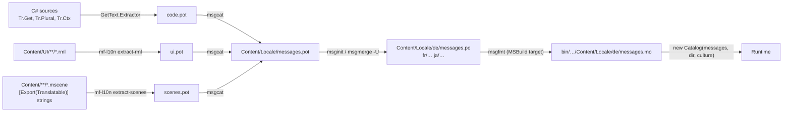

# Proposal: Localization (GetText.NET)

**Milestone:** M9 · **Status:** ⬜ planned · **Depends on:** [Game UI](../game-ui.md),
[Scene serialization](../scene-serialization.md), [Shaders](../shaders.md)

## Library

| | |
|---|---|
| Package | [`GetText.NET`](https://www.nuget.org/packages/GetText.NET) **10.0.1** (pin; an 11.0 preview exists) |
| Repo | [perpetualKid/GetText.NET](https://github.com/perpetualKid/GetText.NET), MIT (fork of NGettext), fully managed |
| Runtime format | **`.mo` only.** No `.po` parser, so `.po` files are compiled with `msgfmt` (GNU gettext) or Poedit. |
| Extractor | `GetText.NET.Extractor` dotnet tool (`GetText.Extractor`). Scans **C# only** and writes a `.pot`. |
| Plurals | built-in per-culture rules, or the `.mo` file's `Plural-Forms` header via `MoAstPluralLoader` |

## Goals

- Every player-facing string can be translated: C# code, RML documents and scene properties.
- A standard gettext workflow (`.pot` → `.po` per language → `.mo`) that works with Poedit, Weblate or Crowdin.
- Switch language at runtime with no restart.
- Plurals and context (`msgctxt`) supported.
- A pseudo-locale for testing truncation and missing strings.

## Non-goals (v1)

RTL layout, per-locale assets other than fonts (localized textures and audio come later),
number/date formatting beyond .NET `CultureInfo`.

## Workflow



- **`mf-l10n`** is a small engine CLI tool (`Tools/MainframeEngine.L10n`). It extracts translatable
  text from RML (text nodes and `title`/`placeholder`/`value` attributes) and from scene files
  (`[Export(Translatable)]` string properties). It writes `.pot` entries with `#:` file:line
  references. It also generates the pseudo-locale (see below).
- **Build step:** an MSBuild target compiles each `Content/Locale/*/messages.po` → `messages.mo` in the
  output with `msgfmt`. If gettext tools are missing, it warns and falls back to committed `.mo`
  files, the same pattern as the [shader pipeline](../shaders.md).
- The editor gets a **Project → Localization** panel that runs extract → merge and shows translation
  coverage per language.

## Runtime API

```csharp
public static class Tr                      // MainframeEngine.Localization
{
    public static string Get(FormattableString text);                                   // _()
    public static string Plural(FormattableString one, FormattableString many, long n);
    public static string Ctx(string context, FormattableString text);
    public static CultureInfo Locale { get; }
    public static void SetLocale(string cultureName);   // loads catalog, raises LocaleChanged
    public static event Action? LocaleChanged;
}

label.Text = Tr.Get($"Score: {score}");                 // msgid "Score: {0}"
status     = Tr.Plural($"{n} enemy left", $"{n} enemies left", n);
menu       = Tr.Ctx("menu", $"Open");                   // disambiguated by context
```

- A thin wrapper over a `GetText.Catalog`. Interpolated strings become `{0}`-style msgids, which is
  native GetText.NET behaviour.
- The extractor runs with alias flags so the wrapper calls are recognized (`-as Tr.Get -ap Tr.Plural -ad Tr.Ctx`).
- **Catalog management is ours**, not `CatalogManager`. That class keys its cache on `CurrentCulture`
  while `Catalog` defaults to `CurrentUICulture`. `SetLocale` builds a new
  `Catalog(new MoAstPluralLoader("messages", localeDir, culture))`, then swaps it in atomically.
  `CurrentCulture` and `CurrentUICulture` are set together.
- **Locale lookup:** GetText.NET tries `pt_BR`, then `pt-BR`, then `pt`. Files live at
  `Content/Locale/{locale}/messages.mo` (no `LC_MESSAGES` folder).
- **Startup:** the locale comes from the user settings, otherwise the OS UI language, otherwise the
  project default (`en`). Strings fall back to the msgid (source language) when untranslated.

## RmlUi integration

- `UiSystemInterface.TranslateString(out translated, in input)` calls `Tr.Get(input)` and returns `1`
  when a translation exists, otherwise `0`.
- **Auto-translate, as in Godot:** any RML text that exactly matches a msgid is translated. To opt
  out, an element uses `class="no-tr"`; the extractor skips it, and the shim marks it untranslatable.
- **Runtime switching:** on `LocaleChanged`, `UiServer` reloads every visible `UiDocument` from its
  `Source`. Data-model state lives in C#, so nothing is lost. Strings built in C# and passed through
  data bindings are re-evaluated with `DirtyAll()`.
- **Fonts:** a per-locale font fallback list in project settings (for example Noto Sans JP/SC/KR for
  CJK) is loaded by `UiServer` on locale change.

## Scene strings

- `[Export(Translatable = true)] public string Text { get; set; }` marks a node property for extraction.
- At runtime, nodes whose `AutoTranslate` property is true (the default) display `Tr.Get(Text)` and
  refresh on `LocaleChanged`.

## Pseudo-localization

`mf-l10n pseudo` generates a `qps` locale from the `.pot`:
- accented characters (`Settings` → `Šéţţîñĝš`);
- about 30% length expansion;
- `[` `]` brackets around every string.

Selecting `qps` in the debug menu shows untranslated hard-coded strings (no brackets) and truncation.

## Editor integration

- Localization panel: extract, merge, coverage table, open `.po` in an external editor.
- A preview-locale dropdown in the editor viewport toolbar, so UI scenes can be checked in each language.
- A warning when an RML text node or translatable property has no entry in `messages.pot` after extraction.

## Task list

- [ ] Add `GetText.NET` 10.0.1 (pinned)
- [ ] `Tr` API + catalog management + `LocaleChanged`
- [ ] MSBuild `msgfmt` target with committed-`.mo` fallback
- [ ] `mf-l10n` tool: RML and scene extractors, pseudo-locale
- [ ] Extractor configuration for C# (alias flags) + `msgcat` merge script
- [ ] RmlUi `TranslateString` hook, document reload on locale change, `no-tr` opt-out
- [ ] Per-locale font fallback
- [ ] `[Export(Translatable)]` + node auto-translate
- [ ] Sandbox: English + one other language + `qps` in the pause-menu settings
- [ ] Editor Localization panel (with [Editor](editor.md) E5)

## Risks

| Risk | Mitigation |
|---|---|
| `.mo`-only runtime needs gettext tools at build time | committed `.mo` fallback; Poedit also produces `.mo` |
| The extractor only scans C# | the engine's `mf-l10n` covers RML and scenes |
| Sparse release notes; a major-version jump to 11 | pin 10.0.1; read the diff before upgrading |
| Exact-match auto-translate can catch strings that weren't meant to be translated | `no-tr` opt-out; extraction report |

## Related

[Milestones](../../milestones.md) · [Game UI](../game-ui.md) · [Scene serialization](../scene-serialization.md) · [Editor](editor.md)
