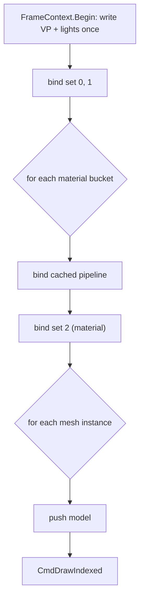

# Proposal: Materials & Meshes

**Milestone:** M3 · **Status:** ⬜ planned · **Touches:** `ShapeBase`, `SpineRenderer`, lighting, new `Mesh`/`Material` types

## Problem

- Every `ShapeBase` instance creates its own pipeline, descriptor pool and UBO set.
- The only "material" is a flat `Color`. UVs are uploaded but ignored.
- There is no way to load a model, even though `Silk.NET.Assimp` is already referenced.
- Each drawable re-uploads the 1200-byte lights UBO.

## Goals

- A shared **pipeline cache** keyed by (shaders, vertex layout, raster/blend/depth state).
- **Per-frame shared sets**: one camera/lights/shadows set bound once per pass, not per object.
- A `Material` (shader + textures + parameters) and a `Mesh` (vertex/index buffers + layout).
- `MeshNode` loading glTF/OBJ/FBX through Assimp.
- Texture support in lit shaders (albedo first; normal maps later).

## Non-goals

PBR (a possible later proposal), bindless, and GPU-driven rendering.

## Proposed design

### Descriptor frequency model

| Set | Frequency | Contents | Owner |
|---|---|---|---|
| 0 | per frame | camera VP, lights UBO, time | `FrameContext` |
| 1 | per frame | shadows (today's set 2) | `ShadowSystem` |
| 2 | per material | textures + material params UBO | `Material` |
| push | per draw | `mat4 model` (+ tint) | node |



This also fixes the MoltenVK sampler budget: material textures live in their own set, and the
shadow set stays at 15 samplers.

### Types

```csharp
public sealed class Mesh : IDisposable { VertexLayout Layout; Buffer Vertices; Buffer Indices; uint IndexCount; Bounds Bounds; }
public sealed class Material { ShaderRef Shader; Texture? Albedo; Vector4 Tint; RenderState State; }
public class MeshNode : Node3D { Mesh Mesh; Material Material; }
public static class ModelLoader { static Node Load(string path); }   // Assimp → MeshNode hierarchy
```

`Box3d` and `Quad` become `MeshNode`s backed by built-in `Mesh` instances.

## Task list

- [ ] `PipelineCache` (hash of state) and `ShaderModuleCache`
- [ ] `FrameContext` with shared set 0/1; renumber sets in `Shapes.vk.*` and `SpineLit.vk.*`
- [ ] `Texture` type (StbImageSharp → device image + mips)
- [ ] Offscreen render targets + object-ID (`R32_UINT`) pass, needed by the [editor viewport](editor.md#viewport)
- [ ] `Material`, `Mesh`, `MeshNode`; port `Box3d`/`Quad`
- [ ] Assimp `ModelLoader` (positions, normals, UVs, indices, node hierarchy)
- [ ] Remove duplicate `WriteLightsUbo` implementations
- [ ] Sandbox: load a glTF model

## Open questions

- glTF-only via a dedicated loader, or Assimp for everything? Assimp is already a dependency.
- When should we move to PBR?

## Related

[Milestones](../../milestones.md) · [GPU resource management](gpu-resource-management.md) ·
[Color pipeline](color-pipeline.md) · [Node system](node-system.md)
