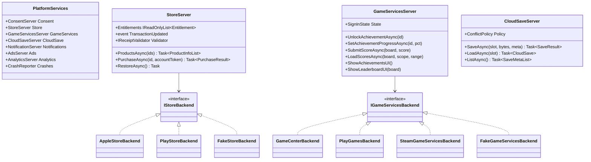
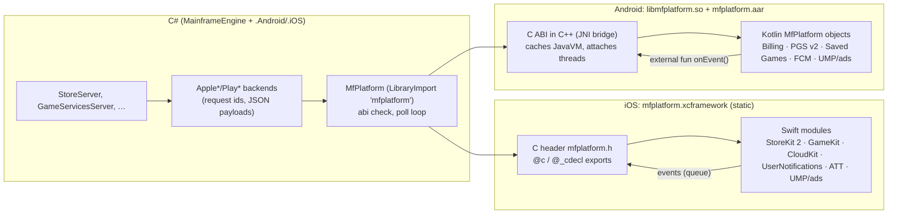
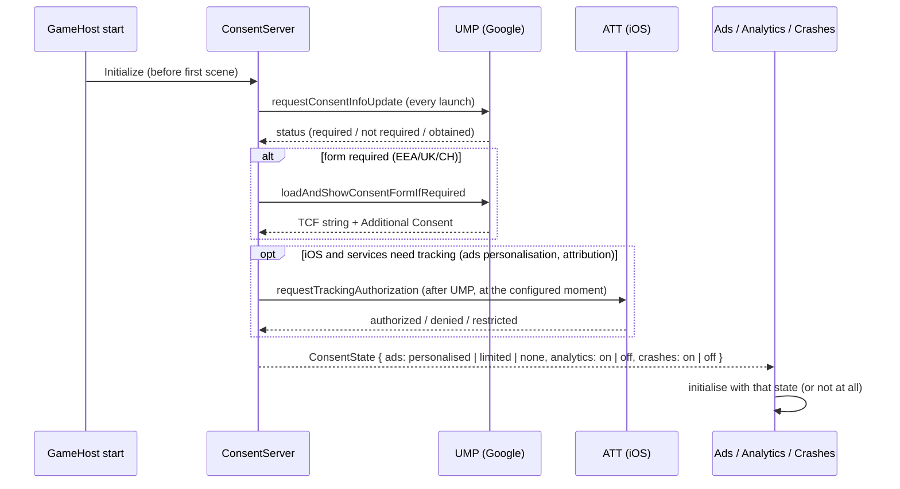
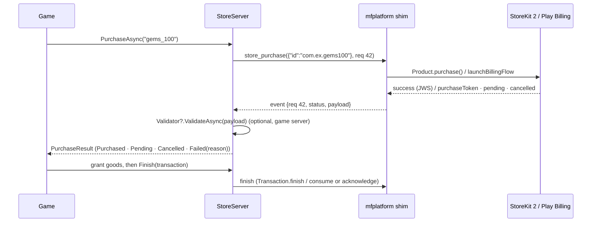

# Proposal: Mobile platform services

**Milestone:** M13 · **Status:** ⬜ planned · **Depends on:** [M12 mobile core](mobile.md) (heads, natives CI,
lifecycle, editor link) · **Decision:** [ADR 0100](../../../memory/decisions/0100-mobile-strategy.md)

> Facts were checked on 2026-10-05 (linked inline). **⚠** marks the ones that are uncertain or changing.

## Problem

A shippable mobile game needs store and platform services that have no desktop equivalent in the engine today:

- in-app purchases;
- achievements, leaderboards and cloud saves;
- ads with legally required consent;
- local and push notifications;
- analytics and crash reports.

The engine only has inert Steam wrappers ([Steamworks](../steamworks.md)). The native APIs are hostile to .NET
bindings. StoreKit 2 is Swift-only `async` API, which an Objective-C binding cannot call. Play Billing, Play Games v2,
UMP and the ad SDKs are Gradle/Maven artefacts with large dependency trees.

## Goals

- **Engine-level APIs as servers** (consistent with `RenderServer`/`AudioServer`, reached through `Tree.Servers`),
  with the same game code on iOS, Android and desktop.
- **Thin engine-owned native shims** for the platform side: Swift on iOS and Kotlin on Android, each behind one flat,
  versioned C ABI (`mfplatform`), built and tested in CI. The same pattern as `mfrmlui`
  ([ADR 0002](../../../memory/decisions/0002-rmlui-native-shim.md), [Native libraries](../natives.md)).
- **Desktop backends:**
  - Steam maps achievements, leaderboards and cloud saves when Steam runs;
  - a scriptable **fake** backend for every service (editor, tests, desktop play);
  - null backends otherwise.
- **Consent first.** No SDK that collects data initialises before the consent state allows it. The engine owns the
  ATT and UMP/TCF flow and the privacy-manifest and data-safety bookkeeping.
- **Optional per game.** A game that uses no ads pays no ad-SDK size and declares no tracking. Each service is opted
  into in the export preset.

## Non-goals

- Server-side receipt validation, a backend, or player accounts. The engine exposes a validation hook and the signed
  payloads; the game's server does the rest.
- Cross-platform entitlement sync. Social features: friends, invites, multiplayer matchmaking via Game Center or Play.
- Subscriptions: the API leaves room for them (product type, renewal info) but v1 ships consumables and non-consumables
  only (⚠ see [open questions](#open-questions)).
- Building our own ad mediation, analytics backend or crash symbolication server.

## Facts this design rests on

| Area | Fact | Source |
|---|---|---|
| StoreKit 2 | Swift-only async API. `Transaction.updates` must be observed from launch. `AppTransaction` needs iOS 16. JWS-signed transactions can be verified with the App Store Server Library. Local testing uses a `.storekit` file (Xcode 14+ can sync it with App Store Connect); sandbox testers live in App Store Connect. | [Transaction.updates](https://developer.apple.com/documentation/storekit/transaction/updates), [VerificationResult](https://developer.apple.com/documentation/storekit/verificationresult), [StoreKit testing](https://developer.apple.com/documentation/xcode/setting-up-storekit-testing-in-xcode) |
| Apple server | `verifyReceipt` and Server Notifications v1 are deprecated; use the App Store Server API and Notifications v2 (JWS). | [forums 731550](https://developer.apple.com/forums/thread/731550) |
| Play Billing | Current 9.1.0 (Jun 2026). PBL 8+ required for new apps and updates from 31 Aug 2026 (extension to 1 Nov 2026). PBL 8 is deprecated 31 Aug 2027 (2-year cycle). Purchases must be acknowledged within 3 days (3 min for license testers). License testers and the Play Billing Lab app exist for testing. | [release notes](https://developer.android.com/google/play/billing/release-notes), [deprecation FAQ](https://developer.android.com/google/play/billing/deprecation-faq), [integrate](https://developer.android.com/google/play/billing/integrate), [test](https://developer.android.com/google/play/billing/test) |
| Google server | Real-time developer notifications arrive via Pub/Sub. Look purchases up with `purchases.subscriptionsv2.get` / `productsv2`. | [RTDN](https://developer.android.com/google/play/billing/rtdn-reference) |
| Play Games v2 | Automatic sign-in at launch. Achievements, leaderboards, Saved Games (snapshots). v1 is closed to new titles since Sep 2025, its APIs are removed in `play-services-games` 25.0.0, and v1 traffic shuts down May 2027. | [migrate to v2](https://developer.android.com/games/pgs/android/migrate-to-v2), [deprecation](https://developer.android.com/games/pgs/deprecation) |
| Game Center / iCloud | `GKLocalPlayer.authenticateHandler`; `GKLeaderboard` (iOS 14+ APIs); `GKAccessPoint`. `GKSavedGame` needs an iCloud container. `NSUbiquitousKeyValueStore` holds 1 MB / 1024 keys and works for App Store builds only. Game Center, IAP, iCloud and push all need the paid Apple program. | [GKSavedGame](https://developer.apple.com/documentation/gamekit/gksavedgame), [KVS](https://developer.apple.com/documentation/foundation/nsubiquitouskeyvaluestore), [capabilities](https://developer.apple.com/help/account/reference/supported-capabilities-ios) |
| Consent | Since 16 Jan 2024, personalised Google ads in the EEA/UK (and now Switzerland) need a Google-certified, TCF-integrated CMP; UMP is one. `requestConsentInfoUpdate` runs on every launch. ATT only when tracking across apps; a missing `NSUserTrackingUsageDescription` crashes the app. | [AdMob CMP](https://support.google.com/admob/answer/13554116), [UMP Android](https://developers.google.com/admob/android/privacy), [UMP iOS](https://developers.google.com/admob/ios/privacy), [ATT](https://developer.apple.com/documentation/apptrackingtransparency) |
| Ads | AdMob iOS: SPM/CocoaPods, `GADApplicationIdentifier`, about 40 `SKAdNetworkItems`. New AdMob apps need verified **app-ads.txt** or get limited serving. AppLovin MAX (≥ 12.0) can run UMP itself and pass TCF/AC strings to networks. Unity LevelPlay 9.5 reads consent from UMP/AC CMPs and ships a privacy manifest. ⚠ No vendor publishes SDK size figures. | [AdMob quick start](https://developers.google.com/admob/ios/quick-start), [app-ads.txt](https://support.google.com/admob/answer/14538460), [MAX](https://support.applovin.com/en/max/ios/overview/integration), [LevelPlay](https://docs.unity.com/en-us/grow/levelplay/sdk/ios/sdk-integration) |
| Privacy manifests | Signed SDK manifests are required for SDKs on Apple's "commonly used" list. That includes Firebase (Core, Crashlytics, Messaging, …) but not GoogleMobileAds, UMP, AppLovin or ironSource, which ship manifests voluntarily. | [third-party SDK requirements](https://developer.apple.com/support/third-party-SDK-requirements/) |
| Push | FCM HTTP v1 only (the legacy API closed in June 2024); Android needs Google Play services. `POST_NOTIFICATIONS` is a runtime permission from Android 13. `SCHEDULE_EXACT_ALARM` is denied by default on Android 14, so games use inexact alarms or WorkManager. APNs uses token auth with a `.p8` key and an ES256 JWT, refreshed at least hourly. | [FCM v1](https://firebase.google.com/docs/cloud-messaging/send/v1-api), [notification permission](https://developer.android.com/develop/ui/views/notifications/notification-permission), [exact alarms](https://developer.android.com/about/versions/14/changes/schedule-exact-alarms), [APNs tokens](https://developer.apple.com/documentation/usernotifications/establishing-a-token-based-connection-to-apns) |
| Crash reporting | Crashlytics NDK supports native crashes but needs symbol upload. The Sentry .NET SDK reports managed exceptions plus native crashes through its bundled Cocoa/Android SDKs, and supports AOT/trimming (NativeAOT on iOS). ⚠ Sentry with NativeAOT on Android is unconfirmed; iOS NativeAOT stack-trace issues are open. | [Crashlytics NDK](https://firebase.google.com/docs/crashlytics/ndk-reports), [Sentry Android](https://docs.sentry.io/platforms/dotnet/guides/android), [Sentry Apple](https://docs.sentry.io/platforms/dotnet/guides/apple/), [sentry-dotnet#3280](https://github.com/getsentry/sentry-dotnet/issues/3280) |
| Interop | Swift exports C symbols with `@_cdecl` (underscored), or with `@c` (SE-0495, accepted Oct 2025, "Implemented (Swift 6.3)", ⚠ check the shipping Xcode). .NET for iOS references an `.xcframework` through `NativeReference`. `AndroidMavenLibrary` (.NET 9+) pulls Maven artefacts with dependency verification. Kotlin/JVM cannot export C symbols. | [SE-0495](https://github.com/swiftlang/swift-evolution/blob/main/proposals/0495-cdecl.md), [iOS build items](https://learn.microsoft.com/en-us/dotnet/ios/building-apps/build-items), [AndroidMavenLibrary](https://learn.microsoft.com/en-us/dotnet/android/binding-libs/advanced-concepts/android-maven-library) |

## Proposed design

### Engine API

Each service is a server registered by `GameHost` when the project enables it (`project.mfproj` `services`). Games
reach it through `Tree.Servers`, or through the static facades for the common calls. All results are delivered on the
game thread (`IFrameServer.Process`), as `Task`-returning methods and as `[Signal]`-style C# events for unsolicited
updates.



- **Ids are logical.** `project.mfproj` maps them per platform, so game code never branches:

  ```jsonc
  "services": {
    "store": { "products": { "remove_ads": { "type": "nonConsumable", "ios": "com.ex.removeads", "android": "remove_ads" },
                             "gems_100":   { "type": "consumable",    "ios": "com.ex.gems100",   "android": "gems_100" } } },
    "gameServices": { "achievements": { "first_win": { "ios": "first_win", "android": "CgkI…AQ", "steam": "ACH_WIN" } },
                      "leaderboards": { "high_score": { "ios": "hs", "android": "CgkI…Ag", "steam": "HighScore" } } },
    "cloudSave": { "backend": "auto" },        // auto = iCloud / Play Saved Games / Steam Cloud / local
    "consent": { "umpOnLaunch": true, "attPrompt": "beforeAds" },
    "ads": { "provider": "admob", "android": { "appId": "ca-app-pub-…" }, "ios": { "appId": "ca-app-pub-…" } },
    "notifications": { "push": false, "local": true },
    "analytics": { "provider": "none" }, "crashes": { "provider": "local" }
  }
  ```

  The cooker validates the map (every logical id has an id for each exported platform).
- **Backend selection** happens at start-up from the platform and the services section:
  - iOS → Apple backends;
  - Android → Google backends;
  - desktop with Steam running → Steam for game services and cloud saves;
  - editor / `--fake-services <file.json>` → fake;
  - otherwise null (calls complete with `ServiceUnavailable`, never throw).

### Shim architecture



- **One ABI on both platforms.** `Native/Platform/include/mfplatform.h` is the contract, built under the rules of
  [ADR 0002](../../../memory/decisions/0002-rmlui-native-shim.md): cdecl, fixed-width types, `mfplatform_bool` as
  `int32_t`, `struct_size` + `user_data` first, no exceptions across, null-checked, and
  `mfplatform_abi_version()` = `(MAJOR<<16)|MINOR`. A MINOR may only append functions or struct fields.
- **Asynchronous and request based.** Every operation is `mfplatform_<service>_<op>(const char* json_args, uint64_t
  request_id)` and returns at once. Results and unsolicited events (transaction updates, sign-in changes, push
  tokens, consent changes) are pushed into a **lock-free MPSC queue** inside the shim. `MfPlatform.Poll()`
  (`mfplatform_poll(buf, cap)`) drains it once per frame on the game thread:
  - each event is `{ type, request_id, status, payload_utf8 }`, payload as JSON;
  - payloads are parsed with a `JsonSerializerContext` (AOT-safe);
  - none of this is on the hot path, and allocations happen only when a service event arrives;
  - JSON keeps the C ABI small and stable: new fields need no ABI bump.
- **No callbacks into managed code from platform threads.** The poll model avoids `[UnmanagedCallersOnly]` reentrancy
  from StoreKit's or Play's threads. When the game is paused and the frame loop stops, events wait in the queue: a
  purchase completing in the background is delivered on resume, and is still in `Transaction.updates` / the Play
  purchase list anyway.
- **UI-presenting calls** (purchase sheet, Game Center UI, consent form, ads) need the platform's top view controller
  / activity. The shim gets it from the host: `MainframeEngine.iOS` passes the root `UIViewController` and
  `MainframeEngine.Android` the current `Activity` through `mfplatform_set_host(…)` at start-up, and again after the
  activity is recreated.
- **iOS build.**
  - A Swift package in `Native/Platform/ios/` with one target per service (`MfStore`, `MfGameKit`, `MfCloud`,
    `MfNotifications`, `MfConsent`, `MfAds`) and a core `MfPlatformCore` (queue, JSON, ABI).
  - C entry points use `@c` when the CI Xcode's Swift supports it, `@_cdecl` before that (same symbols for C callers).
  - Built by `xcodebuild -create-xcframework` (device + simulator) in `natives.yml`, then linked by the iOS head via
    `NativeReference` (`Kind=Static`, `Frameworks="StoreKit GameKit …"`, `ForceLoad`). Only the targets the export
    preset enables are linked, so an unused service's framework does not pull in its system framework.
  - Third-party iOS SDKs (UMP, an ad SDK, Firebase Messaging if chosen) are vendored as **pinned xcframeworks**
    fetched by checksum in CI from the vendor's official release URLs, never CocoaPods at build time. Their privacy
    manifests are merged into the app's at export.
- **Android build.**
  - A Gradle library module in `Native/Platform/android/` (Kotlin, `minSdk 29`) → `mfplatform.aar`. A small C++ JNI
    bridge (`libmfplatform.so`, NDK r28+, 16 KB aligned) implements the C ABI:
    - it caches `JavaVM*` in `JNI_OnLoad`;
    - it calls `@JvmStatic` Kotlin entry points;
    - Kotlin posts events back through `external fun nativeOnEvent(...)` into the same queue.
  - Kotlin/JVM cannot export C symbols, so the bridge is the price of one ABI on both platforms. The alternative,
    managed JNI calls (`JNIEnv`/`Java.Interop`) implementing the same backend interface, would split the pattern and
    is kept only as the fallback if the bridge proves troublesome.
  - Maven dependencies (Play Billing 9.x, `play-services-games-v2`, Play Core asset delivery from M12, UMP, the chosen
    ad SDK, `firebase-messaging`) are declared in the `.aar`'s POM. The Android head consumes them through
    `AndroidMavenLibrary` (.NET 9+, dependency-verified) with versions pinned centrally next to
    `Directory.Packages.props` (a `Native/Platform/android/versions.toml` the build reads), so the dependency list is
    reviewed like NuGet packages.
- **Why not .NET bindings** (generated Java binding libraries, Objective-C binding projects, community plugins)?
  - StoreKit 2 cannot be bound at all.
  - Generated Java bindings of Billing/PGS/ads pull large API surfaces into trimming and AOT analysis and break on
    every library update.
  - Community plugins add third-party NuGet dependencies (needs discussion, CLAUDE.md) with their own release cadence.
  - A shim keeps each service at ~200–600 lines of Swift/Kotlin written against the vendor's documented API, which is
    easy to update when Play Billing's two-year deprecation cycle forces a bump.
- **Tests per layer:**
  - C ABI CTest (export list from the header, as for `mfrmlui`);
  - Swift XCTest on the simulator, with StoreKit Test (`SKTestSession` + `.storekit` file) for purchase flows;
  - Kotlin unit tests + Robolectric for the event plumbing and the billing state machine against a fake
    `BillingClient`;
  - C# unit tests of every server against the fake backends.

### Privacy and consent

`ConsentServer` runs before any other service at launch, and every data-collecting service asks it first.



- **State.** `ConsentState` (`AdsPersonalisation`, `AnalyticsAllowed`, `CrashReportsAllowed`, `AttStatus`,
  `TcfString`) is persisted by the platform SDKs and mirrored in user data. `ConsentServer.ShowPrivacyOptionsAsync()`
  backs the mandatory "privacy settings" entry point in the game's options menu (UMP's
  `privacyOptionsRequirementStatus` says when it is required).
- **Defaults are conservative.** With no consent answer, ads are non-personalised (or limited ads) and analytics are
  off. Crash reports are on only if the game declares them as necessary for app functionality and lists them in the
  data-safety form and privacy nutrition labels; otherwise they are gated like analytics.
- **ATT.** Requested only when a service declares tracking (`NSPrivacyTracking = true`, plus
  `NSUserTrackingUsageDescription` added by the export). Never at launch before the player has seen the game: the
  default `attPrompt: "beforeAds"` asks right before the first ad request. Denied ATT means no IDFA; SKAdNetwork /
  AdAttributionKit still works.
- **Privacy manifest aggregation** (export step):
  - start from the engine template's `PrivacyInfo.xcprivacy` (the M12 .NET required-reason entries);
  - add each enabled service's declared collected data types and required-reason APIs from `Native/Platform/ios/<Service>/PrivacyInfo.fragment.xcprivacy`;
  - add vendor SDK manifests (which stay inside their xcframeworks and are also listed in the export report);
  - the result lists every data type for the App Store privacy label.
- **Google data safety.** The same per-service declarations produce a **data-safety worksheet**
  (`artifacts/export/data-safety.md`: data types, purpose, shared / not shared, optional / required, encrypted in
  transit, deletion) to copy into Play Console; there is no API for the form.
- **Children.** If `services.audience: "children"`:
  - ads switch to the provider's child-directed / COPPA flags (`tagForChildDirectedTreatment`, TFUA);
  - analytics and ATT are disabled;
  - the export warns about Play Families policy and Apple Kids Category rules.

### In-app purchases



- **Products** are `ProductInfo { Id, Type (Consumable, NonConsumable), DisplayName, Description, DisplayPrice,
  PriceMicros, CurrencyCode }`, fetched with `ProductsAsync`. The products map lists the ids. The display price is
  always the store's localised string, never formatted by the engine.
- **Transactions must be finished explicitly** after the game has granted the goods, because both stores re-deliver
  unfinished transactions:
  - StoreKit 2 `Transaction.finish()`;
  - Play: `consumeAsync` for consumables, `acknowledgePurchase` for others, **within 3 days** or Play refunds.

  `StoreServer.Finish` maps to the right call. Unfinished transactions are re-raised through `TransactionUpdated` at
  every launch until finished.
- **Unsolicited transactions:**
  - The iOS shim observes `Transaction.updates` from `mfplatform_init` (at launch, as Apple requires). Ask to Buy,
    refunds, offer codes and purchases on another device all arrive there.
  - Android: `PurchasesUpdatedListener`, plus `queryPurchasesAsync` on every resume (PBL 8 removed
    `queryPurchaseHistory`).
  - `enableAutoServiceReconnection()` (PBL 8+) handles disconnects.
- **Entitlements.** `StoreServer.Entitlements` (non-consumables currently owned) comes from
  `Transaction.currentEntitlements` / `queryPurchasesAsync` and is cached in user data for offline start.
  `RestoreAsync()` maps to `AppStore.sync()` (iOS; required by App Review as a visible "Restore purchases" button) and
  a re-query on Android.
- **Validation.**
  - The engine verifies what can be verified on-device without secrets: StoreKit 2's `VerificationResult` (JWS
    signature checked by StoreKit) and Play's purchase signature against the app's public key (optional, in the
    preset).
  - `IReceiptValidator` is the hook for server validation (App Store Server API / Play Developer API
    `productsv2`), where a backend exists. The engine sends the raw JWS / purchase token and an optional
    `appAccountToken` / obfuscated account id that the game supplies.
- **Pending purchases** (Ask to Buy, cash payments in some countries) return `Pending` and complete later through
  `TransactionUpdated`.
- **Testing:**
  - iOS: a `.storekit` configuration file generated from the products map (`mf-cook services --storekit`), used by
    XCTest `SKTestSession` in CI (simulator; purchase, cancel, Ask to Buy, refund, interrupted purchase) and by Xcode
    runs. Sandbox testers in App Store Connect for TestFlight builds.
  - Android: license testers (test cards; 3-minute acknowledge window, so the 3-day logic is tested quickly), internal
    track builds and the Play Billing Lab app for response-code simulation. CI covers the Kotlin billing state machine
    against a fake `BillingClient`.
  - Desktop/editor: `FakeStoreBackend` with scripted outcomes:

    ```json
    { "gems_100": ["purchased"], "remove_ads": ["pending", "purchased"] }
    ```

    plus an editor **Services** panel to trigger refunds and updates.

### Achievements, leaderboards and cloud saves

| Concept | iOS | Android | Steam (desktop) | Fake/local |
|---|---|---|---|---|
| Sign-in | `GKLocalPlayer.authenticateHandler` (shows the Game Center sheet if needed); `GKAccessPoint` optional | PGS v2 automatic sign-in at launch; `GamesSignInClient.isAuthenticated`, manual sign-in button if it fails | always signed in when Steam runs | always |
| Unlock / progress | `GKAchievement` (percentComplete) | `AchievementsClient.unlock` / `setSteps` (incremental) | `SetAchievement` + `StoreStats` (existing [Steam wrappers](../steamworks.md)) | JSON in user data |
| Leaderboards | `GKLeaderboard.submitScore` / `loadEntries` (iOS 14+ API, recurring boards) | `LeaderboardsClient.submitScore` / `loadTopScores` | `FindLeaderboard` / `UploadLeaderboardScore` / `DownloadLeaderboardEntries` | local list |
| Native UI | `GKGameCenterViewController` | `getAchievementsIntent` / `getLeaderboardIntent` | Steam overlay | RML debug panel |
| Cloud saves | **iCloud**: CloudKit private database (records ≤ 1 MB per asset; quota is the user's iCloud) behind the engine API. `GKSavedGame` as an option when the game wants Game Center-bound saves. `NSUbiquitousKeyValueStore` (1 MB total) only for small settings. | **PGS Saved Games** (snapshots: data + cover image + description + played time; conflict callbacks) | **Steam Cloud** (`ISteamRemoteStorage` file API, or Auto-Cloud configured in the Steamworks partner site) | files in user data |

- **API.** `GameServicesServer.UnlockAchievementAsync`, `SetAchievementProgressAsync` and `SubmitScoreAsync` are
  **queued and retried**. Offline unlocks are stored in user data and flushed on the next sign-in, because the native
  SDKs only partly do this themselves.
- **`CloudSaveServer`.** Slots of opaque bytes + `SaveMeta { Slot, Description, PlayedTime, ModifiedUtc, DeviceName,
  ProgressValue }`.
  - **Conflicts** (two devices) follow `ConflictPolicy`:
    - `MostRecent`;
    - `HighestProgress` (uses `ProgressValue`);
    - `Manual`: raises `ConflictDetected(local, remote)` and the game resolves it, with an RML dialog in the widget
      library.
  - The local copy is always written first (user data). The cloud write is best effort and retried.
  - Saves are also the M12 `OnApplicationPause` persistence path, so the two are one call for games.
- **Mapping desktop ↔ Steam.** Logical ids map to Steam API names in the same `services.gameServices` table. When Steam
  is not running (or its natives are not shipped, [ADR 0044](../../../memory/decisions/0044-steam-features-without-natives.md)),
  the local backend keeps unlocks so the game logic is identical.

### Notifications

- **Local notifications** (`NotificationServer.ScheduleLocal(id, title, body, fireAt | interval, data)`, `Cancel(id)`;
  title/body are already translated by the game via `Tr`):
  - iOS: `UNUserNotificationCenter` (`UNTimeIntervalNotificationTrigger` / calendar trigger), authorisation requested
    with `RequestPermissionAsync()` at a moment the game chooses.
  - Android: a notification channel per category (`project.mfproj` `services.notifications.channels`) and
    `POST_NOTIFICATIONS` at runtime on 13+. Scheduling uses **inexact** `AlarmManager.setAndAllowWhileIdle` or
    WorkManager (exact alarms are denied by default on 14+ and reserved for alarm/calendar apps).
  - Typical uses: energy refilled, daily reward. Tapping a notification launches the game with `data`, delivered as
    `NotificationOpened` after start-up.
- **Push.**
  - iOS: APNs directly; no Firebase needed. Shim:
    `registerForRemoteNotifications` → `PushTokenChanged(token)`. Entitlement `aps-environment`. The game's server
    sends with a `.p8` token key; that server is the game's.
  - Android: **FCM is required** (Google Play services). The Android shim adds `firebase-messaging` and the head needs
    the project's `google-services.json` values, which the export injects as resources (no Gradle plugin needed: the
    values are written as string resources). `FirebaseMessagingService.onNewToken` → `PushTokenChanged`.
  - Firebase Messaging on iOS is not used: one less SDK on Apple's commonly-used list.
  - Foreground pushes raise `PushReceived(data)`; background pushes show as system notifications, and tapping one
    raises `NotificationOpened`.
- **Remote content** (silent pushes to refresh data) is out of scope for v1.

### Ads

Ads are the heaviest and most regulated service, so they are **opt-in at export** (`services.ads.provider`) and
always **behind `ConsentServer`**.

| Option | Pros | Cons |
|---|---|---|
| **Google AdMob (+ mediation, + UMP)** | one vendor for ads and the certified CMP; widest docs; mediation adapters for other networks; free | app-ads.txt verification required for new apps; Google-centric demand unless mediation is configured |
| AppLovin MAX | strong game demand and in-house bidding; its consent flow can show UMP and forwards TCF/AC to mediated networks | separate dashboard, heavier SDK; its consent flow must cover every mediated network |
| Unity LevelPlay (ironSource) | strong rewarded-video demand for games; reads UMP/AC consent; ships a privacy manifest | SDK and dashboard churn (ironSource → Unity), Unity-centric docs |

- **Recommendation:** **AdMob + UMP** as the reference implementation (`MfAds` targets an `AdProvider` sub-interface
  inside the shim), because the CMP requirement is solved by the same vendor and mediation can add MAX/LevelPlay demand
  without engine changes. A MAX or LevelPlay implementation is a second shim module behind the same C ABI calls
  (`ads_load`, `ads_show`, events), chosen in the export preset.
- **Engine API.** `AdsServer`:
  - `LoadAsync(AdFormat.Interstitial | Rewarded | Banner, placement)`, `ShowAsync(placement)` → `AdResult { Shown,
    Rewarded(amount, type), Failed, Skipped }`;
  - `ShowBanner(placement, BannerPosition)` / `HideBanner`; banners respect `Engine.SafeArea`, and the ad view is a
    native view over the game surface.
  - **The engine pauses the tree and audio while a fullscreen ad shows** (lifecycle focus loss) and resumes after.
  - Rewarded callbacks are delivered only through the poll loop on the game thread.
  - Optional server-side verification (SSV) is configured in the ad network; the engine passes the custom data.
- **Compliance on export:**
  - Info.plist `GADApplicationIdentifier` and `SKAdNetworkItems` (the provider's list, pinned in the shim version);
    Android manifest `com.google.android.gms.ads.APPLICATION_ID`;
  - a reminder to host **app-ads.txt** on the developer website listed in the stores;
  - ATT usage string;
  - the data-safety worksheet updated (device identifiers, advertising data);
  - privacy manifest aggregated;
  - a size report that shows the ad SDK's share (⚠ no vendor publishes sizes, so they are measured in M13.5).
- **Testing:** the providers' test ad unit ids in debug builds, always (live ids in debug get accounts banned); a fake
  backend on desktop that draws a placeholder RML ad and simulates fill/no-fill/reward.

### Analytics and crash reporting

- **Crash reporting**, built in layers:
  1. **Engine-level, always available, no SDK.**
     - `AppDomain.UnhandledException`, `TaskScheduler.UnobservedTaskException` and the audio thread's captured fault
       write a crash file to user data on the way down: exception chain, last 200 log entries from a
       `MemoryLogSink`, device, OS, engine and game version, tier, thermal state.
     - On next launch, `CrashReporter.PendingReports` offers them to the game (upload to its own endpoint, or attach to
       a support mail), and the editor link uploads them in dev builds.
     - NativeAOT stack traces need symbols: the export keeps the `.dSYM` (iOS) and unstripped `.so` / `.dbg`
       (Android) as build artefacts, and `mf-symbolicate` maps addresses offline.
  2. **Native crashes** (signals in native code, out-of-memory kills) need a native SDK. The options:

     | Option | Managed exceptions | Native crashes | Notes |
     |---|---|---|---|
     | **Sentry** (`Sentry` NuGet, .NET SDK with bundled Cocoa/Android SDKs) | yes, with .NET stack traces | yes | AOT/trimming supported; ⚠ NativeAOT stack traces on iOS have open issues; NativeAOT on Android unconfirmed; a NuGet dependency → needs approval; self-hostable |
     | Firebase Crashlytics (via the shim) | only as "non-fatal" custom reports the engine forwards | yes (NDK) | needs symbol upload for each build, adds Firebase core (on Apple's commonly-used list → signed manifest); free |
     | Engine-only (layer 1) | yes | no (Play Console / App Store Connect still show OS crash reports with symbolication from uploaded dSYM / native debug symbols) | zero dependencies |

     **Default:** layer 1 + the stores' own crash reports (Play vitals, App Store Connect/Xcode Organizer, with debug
     symbols uploaded by `mobile-publish.yml`). A Sentry integration (`CrashReporter` backend + `AnalyticsServer`
     events) is the recommended opt-in when a game needs real-time native crash data, pending the NuGet approval and
     an AOT spike.
- **Analytics.** `AnalyticsServer.LogEvent(name, params)` with a fixed small schema (string/number params, ≤ 25
  per event) and backends: none (default), Firebase Analytics via the shim (if push already brought Firebase in on
  Android), or the game's own HTTP endpoint (batched, offline-queued, consent-gated). The engine records nothing on its
  own: no engine telemetry.

### Desktop and Steam mapping

| Service | iOS | Android | Desktop + Steam | Desktop (no Steam) / editor |
|---|---|---|---|---|
| Consent | UMP + ATT | UMP | none needed (no ads) → `ConsentState` all-allowed except ads | fake (scriptable) |
| Store | StoreKit 2 | Play Billing 9.x | null (Steam microtransactions out of scope) | fake |
| Achievements / leaderboards | Game Center | Play Games v2 | Steam user stats / leaderboards | local |
| Cloud saves | CloudKit (or GKSavedGame) | PGS Saved Games | Steam Cloud | local files |
| Notifications | UNUserNotificationCenter / APNs | NotificationManager / FCM | null | fake (shows a toast in the editor) |
| Ads | AdMob (+ mediation) | AdMob (+ mediation) | null | fake placeholder |
| Analytics / crashes | engine + optional Sentry/Firebase | same | engine (+ optional Sentry) | engine |

### Editor integration

- A **Services** section in the export dialog (enable per service, ids map editor with validation) and in project
  settings.
- A **Services** panel during desktop play (fake backends): product list with outcome buttons, achievement and
  leaderboard state, cloud-save slots with "simulate conflict", consent state switcher (EEA / non-EEA, ATT
  denied/authorised), push/notification injection.
- The editor link forwards the same fake-backend commands to a device dev build (`--fake-services` on device), so
  purchase flows can be QA'd without store accounts.

## M13 phases

| Phase | Deliverable | Acceptance |
|---|---|---|
| M13.0 Shim skeleton | `mfplatform.h` + ABI check; Swift package and Kotlin AAR + JNI bridge with the poll queue; `natives.yml` legs; `PlatformServices` + fake/null backends; `services` section + id map validation | CTest/XCTest/JUnit green in CI; a ping round trip on simulator and emulator; fake backends drive every server in unit tests |
| M13.1 Consent & privacy | `ConsentServer` (UMP, ATT), manifest aggregation, data-safety worksheet | EEA/non-EEA flows verified with UMP debug geography on device; the export report lists data types |
| M13.2 IAP | `StoreServer` on StoreKit 2 + PBL 9.x; entitlements, restore, finish/acknowledge, pending, validator hook; `.storekit` generation | XCTest StoreKit suite in CI; a license-tester purchase on the internal track; sandbox purchase via TestFlight |
| M13.3 Game services | Game Center, PGS v2, Steam mapping, offline queue; `CloudSaveServer` with CloudKit / Saved Games / Steam Cloud + conflict policies | unlock + score + save/load/conflict on both stores' test accounts; Steam path tested with the existing wrappers |
| M13.4 Notifications | local (both), push (APNs, FCM), permission flows, open-from-notification | scheduled local notification fires and opens the game with data; push token reaches a test sender |
| M13.5 Ads | AdMob + UMP reference implementation; pause/resume around fullscreen ads; export compliance (SKAdNetwork, app id, app-ads.txt reminder); size measurement | test ads (all formats) on both; consent-denied → non-personalised verified; size delta recorded |
| M13.6 Analytics & crashes | engine crash files + `PendingReports`, symbol artefacts + upload in `mobile-publish.yml`, `AnalyticsServer` with HTTP backend; optional Sentry after approval | forced managed crash is reported on next launch with a symbolicated trace; store crash dashboards show symbolicated native crashes |

## Task list

- [ ] `Native/Platform/` (header, Swift package, Kotlin module, JNI bridge, tests); `natives.yml` legs; lock entries
- [ ] `MfPlatform` binding (`LibraryImport`, ABI check, poll, JSON context); `PlatformServices`; null/fake backends
- [ ] `services` section in `ProjectSettings` (+ migration), id-map validation in `mf-cook`
- [ ] `ConsentServer`; manifest aggregation; data-safety worksheet
- [ ] `StoreServer` + Apple/Play backends; `.storekit` generator; XCTest StoreKit suite
- [ ] `GameServicesServer`, `CloudSaveServer` + Apple/Play/Steam/local backends; offline queue; conflict dialog widget
- [ ] `NotificationServer` (local + push), channels, permission flows
- [ ] `AdsServer` + AdMob/UMP module; export compliance; fake ads
- [ ] `CrashReporter` (engine files, `PendingReports`), symbol artefacts + upload; `AnalyticsServer` (HTTP backend)
- [ ] Editor: Services export section, Services play panel, device fake-services forwarding
- [ ] Docs: current-state `docs/design/mobile-services.md` when shipped; ADRs for the ads provider and crash backend

## Open questions

1. **Ads provider default:** AdMob + UMP (recommended) vs AppLovin MAX for game-focused demand? Or no ads at all in v1?
2. **Crash reporting:** approve the Sentry NuGet dependency (and a self-hosted vs SaaS choice), or stay with engine
   crash files + store dashboards?
3. **Subscriptions** (battle pass, VIP) in v1 or later? They add renewal states, grace periods and server
   notifications.
4. **Cloud saves on iOS:** CloudKit (engine-defined records, full control) vs `GKSavedGame` (simpler and Game
   Center-bound, but it needs an iCloud container anyway)? Default: CloudKit.
5. **Firebase on Android** only for FCM push, or also Analytics/Crashlytics once it is there? Default: FCM only.
6. **Swift `@c` vs `@_cdecl`:** require the Swift version with SE-0495 in CI (Xcode 26.x with Swift 6.3?), or keep
   `@_cdecl` until the minimum Xcode guarantees it?
7. **Steam microtransactions** (`ISteamMicroTxn` needs a web API backend): out of scope, or a `StoreServer` backend
   later?

## Related

[Mobile core (M12)](mobile.md) · [Milestones](../../milestones.md) · [Steamworks](../steamworks.md) ·
[Native libraries](../natives.md) · [Projects & GameHost](../project-and-gamehost.md) · [Game UI](../game-ui.md) ·
[ADR 0100](../../../memory/decisions/0100-mobile-strategy.md)
