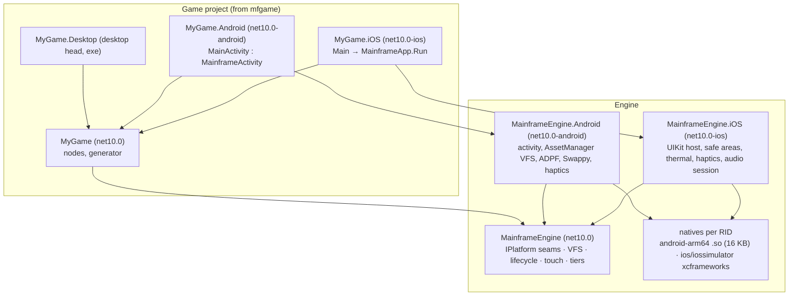
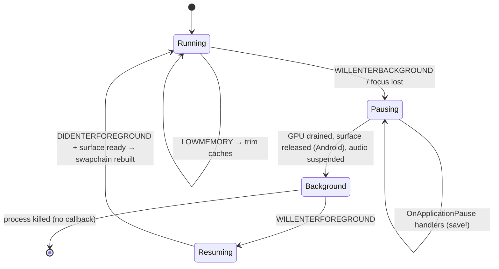
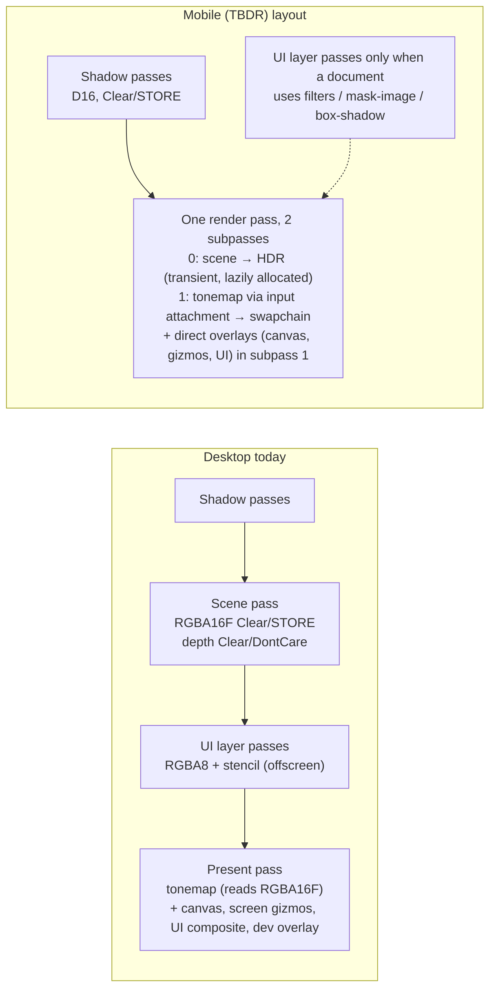
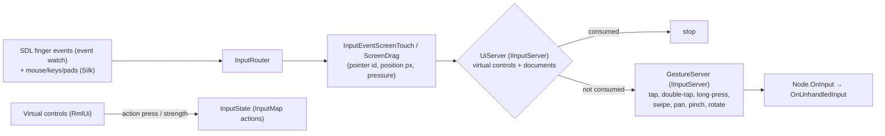
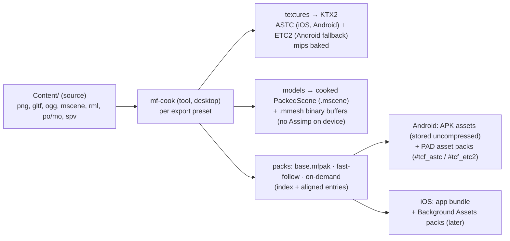
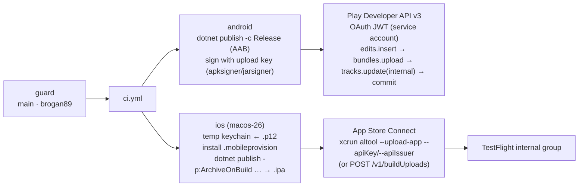

# Proposal: Mobile core (Android + iOS)

**Milestone:** M12 · **Status:** ⬜ planned · **Depends on:** [M10 editor](editor.md) (deploy, live preview),
[M3](../materials-and-meshes.md)/[M4](../shadow-system.md) (quality tiers), [M8 game UI](../game-ui.md) (virtual
controls, safe areas) · **Not a dependency:** [M11](rendering-backend-abstraction.md) (iOS runs the Vulkan renderer
through MoltenVK) · **Services:** [M13 mobile services](mobile-services.md) · **Decision:**
[ADR 0100](../../../memory/decisions/0100-mobile-strategy.md)

> Facts below were checked on 2026-10-05 against vendor documentation (linked inline). Rows marked **⚠** are
> uncertain or changed recently; each has a validation spike in [M12.0](#m120--spikes).

## Problem

The engine runs on Windows, Linux and macOS only. Everything that makes a phone different is missing:

- **Process model.** A desktop window lives until the user closes it. A phone app is paused, backgrounded and killed
  by the OS. On Android the `ANativeWindow`, and with it the `VkSurfaceKHR`, is destroyed while the app keeps
  running. On iOS, GPU work submitted in the background fails. Today `VulkanRenderer` creates one surface at
  start-up and treats a surface-format change as fatal ([Vulkan renderer → known issues](../vulkan-renderer.md#known-issues)).
- **Input.** `InputRouter` handles keyboard, mouse and gamepads (Silk.NET input), with no touch, gestures, sensors or
  haptics.
- **GPU.** Mobile GPUs are tile-based (TBDR). Bandwidth, not ALU, is the budget. The frame today is a 16-bit-float HDR
  scene pass that stores colour to memory, a tonemap pass that reads it back, an offscreen RGBA8 + stencil UI layer
  and a composite pass ([Color pipeline](../color-pipeline.md), [Game UI → rendering](../game-ui.md#rendering-vulkanuirenderer)).
  That is about 3 full-screen write + read round trips per frame before any game content.
- **Content.** Content files are loose files next to the app, loaded with `File.ReadAllBytes(ContentPaths.Resolve(...))`.
  Android APK assets are not files. Textures are decoded from PNG at run time as RGBA8, with mips generated on the GPU,
  and models import through the native Assimp at run time ([Asset pipeline](../asset-pipeline.md)).
- **Runtime.** iOS forbids JIT. The engine is mostly ready: there is no `Reflection.Emit`, the type registry is
  source-generated and the JSON uses source-generated contexts. But nobody has published it with AOT, trimming or a
  size budget, and the editor's collectible `GameAssemblyLoader` cannot exist on a device.
- **Pipeline.** No head projects, natives per mobile RID, signing, store uploads or device deploy exist.

## Goals

- **Targets:** Android 10+ (API 29), arm64-v8a. iOS 16+, arm64. Phones and tablets. For development:
  - iOS Simulator (arm64);
  - Android emulator, arm64 on Apple Silicon and x86_64 on Linux CI only ([why](#emulators-and-simulators)).
- **Feature parity:** the same 3D + 2D feature set as desktop, from the same scenes, with no mobile-only scene format.
- **Performance:** 60 fps on ~3-year-old mid-range phones (reference devices in [Testing](#testing-strategy)), with
  quality tiers, dynamic resolution, thermal response, a 30 fps battery mode and 120 Hz opt-in.
- **Rendering:** iOS = MoltenVK, reusing the Vulkan renderer. Android = native Vulkan 1.1+ against the Android
  Baseline Profile 2022.
- **Input:** touch, gestures, on-screen controls that feed `InputMap` actions, sensors, haptics, Bluetooth gamepads.
- **Editor:** export presets, one-click build + install + launch on a device, emulator or simulator, remote logs and
  play control over the existing [editor link](../project-and-gamehost.md#editor-link), live preview of content, and
  device simulation in the viewport.
- **Pipeline:**
  - `just android-*` / `ios-*` recipes;
  - CI builds of unsigned/debug AAB, APK and simulator apps;
  - a manual, main-only workflow that signs and uploads to Play internal testing and TestFlight through official APIs.
- **No accounts needed until signing.** Everything except signing and uploading works without an Apple Developer
  Program membership or a Play Console account.

## Non-goals

- Native Metal backend: only through [M11](rendering-backend-abstraction.md), and only if profiling demands it.
- Store and platform services (IAP, game services, ads, push, analytics): [M13](mobile-services.md).
- Hot-reloading C# on devices. iOS has no JIT and Mono's collectible contexts are unfinished
  ([dotnet/runtime#79711](https://github.com/dotnet/runtime/issues/79711)), so code changes mean rebuild + reinstall.
- 32-bit Android, Intel iOS simulators, tvOS, Mac Catalyst, visionOS, Android TV and Chromebooks (they may work, but
  are not tested).
- Running the editor itself on a tablet.
- WebGPU or GLES fallbacks for devices without Vulkan (7.4 % of active Android devices,
  [dashboard](https://developer.android.com/about/dashboards)): they are excluded through `<uses-feature>` in the
  manifest.

## Facts this design rests on

| Area | Fact | Source |
|---|---|---|
| .NET 10 mobile | Plain `net10.0-android`/`net10.0-ios` apps (no MAUI) are supported. A `net10.0` class library is referenced unchanged. iOS needs Xcode 26+ on macOS 15.6+. Android needs only the Android SDK + JDK 21, on any OS. | [frameworks](https://learn.microsoft.com/en-us/dotnet/standard/frameworks), [macios .NET 10 notes](https://github.com/dotnet/macios/wiki/.NET-10-release-notes), [Android deps](https://learn.microsoft.com/en-us/dotnet/android/getting-started/installation/dependencies) |
| iOS AOT | NativeAOT on iOS is fully supported since .NET 9 (`PublishAot=true`, publish only; `dotnet build` still runs Mono). Mono (the default) AOT-compiles everything and has an optional interpreter. Neither can load assemblies at run time. | [Native AOT](https://learn.microsoft.com/en-us/dotnet/core/deploying/native-aot/), [MAUI NativeAOT](https://learn.microsoft.com/en-us/dotnet/maui/deployment/nativeaot), [interpreter](https://learn.microsoft.com/en-us/dotnet/maui/macios/interpreter) |
| Android AOT | Release defaults: Mono profiled AOT (`RunAOTCompilation`, `AndroidEnableProfiledAot`), `AndroidLinkMode=SdkOnly`, outputs `aab;apk`. In .NET 10, CoreCLR and NativeAOT on Android are experimental (XA1040, NDK r27+). | [build properties](https://learn.microsoft.com/en-us/dotnet/android/building-apps/build-properties), [XA1040](https://learn.microsoft.com/en-us/dotnet/android/messages/xa1040) |
| ⚠ .NET 11 | Mobile defaults move to CoreCLR. On Android, `UseMonoRuntime=true` is rejected (NETSDK1242) and there is no interpreter. .NET 11 ships around M12's start. | [build properties](https://learn.microsoft.com/en-us/dotnet/android/building-apps/build-properties) |
| Silk.NET | 2.22 was the "mobile update": `SilkActivity` (Android) and production-ready iOS through `SilkMobile.RunApp`. 2.23.0 (Jan 2026) bundles SDL 2.32.10 and MoltenVK 1.4.1. Silk 3.0 is unreleased, and its mobile input is "not started". | [releases](https://github.com/dotnet/Silk.NET/releases), [#209](https://github.com/dotnet/Silk.NET/issues/209) |
| ⚠ Silk Android SDL | The `libSDL2.so`/`libmain.so` that Silk's `.aar` ships are **4 KB aligned** (in both 2.22 and 2.23): they fail the 16 KB rule. The issue is open with no reply. | [#2493](https://github.com/dotnet/Silk.NET/issues/2493) (ELF headers checked) |
| MoltenVK | Silk.NET.MoltenVK.Native ships iOS and iOS-simulator static libraries. MoltenVK uses only public APIs and is App Store safe. It implements a Vulkan 1.4 subset (not conformant). 1.4.x needs iOS 15+. Silk 2.22 bundles 1.2.11. | [MoltenVK](https://github.com/KhronosGroup/MoltenVK), [user guide](https://github.com/KhronosGroup/MoltenVK/blob/main/Docs/MoltenVK_Runtime_UserGuide.md) |
| Simulator GPU | Simulator Metal is roughly the Apple2 family: no programmable blending, no sRGB writes, no 2× MSAA, private-only heaps. Use it for smoke tests only. | [Metal in Simulator](https://developer.apple.com/documentation/metal/developing-metal-apps-that-run-in-simulator) |
| Android Vulkan | Vulkan 1.1 is required on 64-bit devices since Android 10. Device share (Nov 2025): 1.1 62.1 %, 1.3 26 %, 1.4 0.7 %, no Vulkan 7.4 %. Google recommends Android 10+, Vulkan 1.1+ and ABP 2022. ABP 2022 has ASTC + ETC2 and `maxBoundDescriptorSets` 4, but no descriptor indexing, timeline semaphores, dynamic rendering or float16. | [native engine support](https://developer.android.com/games/develop/vulkan/native-engine-support), [dashboard](https://developer.android.com/about/dashboards), [VP_ANDROID_baseline_2022](https://github.com/KhronosGroup/Vulkan-Profiles/blob/main/profiles/VP_ANDROID_baseline_2022.json) |
| Pre-rotation | Keep the swapchain at identity size, set `preTransform = currentTransform` and rotate in clip space. Otherwise the compositor rotates, costing 1–3 ms and bandwidth. `VK_SUBOPTIMAL_KHR` → recreate. | [pre-rotation](https://developer.android.com/games/optimize/vulkan-prerotation) |
| TBDR | Use `CLEAR`/`DONT_CARE` loads and `DONT_CARE` stores for depth and MSAA. Use `TRANSIENT_ATTACHMENT` + `LAZILY_ALLOCATED` memory, MSAA resolve on tile, and merge subpasses. | [Vulkan guide](https://docs.vulkan.org/guide/latest/tile_based_rendering_best_practices.html), [Arm](https://developer.arm.com/mobile-graphics-and-gaming/vulkan-api-best-practices-on-arm-gpus) |
| Pacing / thermal | Swappy (AGDK `games-frame-pacing` 2.1.3, prefab static lib). ADPF: thermal headroom (API 30), `PerformanceHintManager` (31; NDK 33), Game Mode (31). iOS: `ProcessInfo.thermalState` (read once before observing), Low Power Mode. | [frame pacing](https://developer.android.com/games/sdk/frame-pacing), [ADPF](https://developer.android.com/games/optimize/adpf), [thermalState](https://developer.apple.com/documentation/foundation/processinfo/thermalstatedidchangenotification) |
| ProMotion | iPhones stay at 60 Hz unless `CADisableMinimumFrameDurationOnPhone = true`. | [ProMotion](https://developer.apple.com/documentation/quartzcore/optimizing-iphone-and-ipad-apps-to-support-promotion-displays) |
| iOS background | Command buffers committed in the background fail (`notPermitted`). Stop on deactivate and drain in `applicationDidEnterBackground`. | [Metal background](https://developer.apple.com/documentation/metal/preparing-your-metal-app-to-run-in-the-background) |
| ⚠ 16 KB pages | Apps targeting API 35+ must support 16 KB pages; non-compliant updates are blocked **from 1 Feb 2027** (the original date was 1 Nov 2025). NDK r28+ aligns by default. .NET warns XA0141. | [page sizes](https://developer.android.com/guide/practices/page-sizes) (updated 2026-09-16), [XA0141](https://learn.microsoft.com/en-us/dotnet/android/messages/xa0141) |
| Play policy | New apps and updates must target **API 36** since 31 Aug 2026. At target 36, games keep orientation/resizability on large screens only with `android:appCategory="game"`, and edge-to-edge cannot be opted out of. | [target SDK](https://developer.android.com/google/play/requirements/target-sdk), [Android 16 changes](https://developer.android.com/about/versions/16/behavior-changes-16), [Android 15 changes](https://developer.android.com/about/versions/15/behavior-changes-15) |
| ⚠ Play sizes | Size limits: base module 500 MB (was 200 MB), asset pack 1.5 GB, install-time total 4 GB. Users on mobile data are warned above 200 MB. Texture-format targeting uses `#tcf_astc`/`#tcf_etc2` folders. | [size limits](https://support.google.com/googleplay/android-developer/answer/9859372), [TCFT](https://developer.android.com/guide/playcore/asset-delivery/texture-compression) |
| Apple SDK | Uploads need Xcode 26 + the iOS 26 SDK since 28 Apr 2026. The minimum OS stays our choice (16). Builds are limited to 4 GB uncompressed, and the executable `__TEXT` to **80 MB**. | [upcoming requirements](https://developer.apple.com/news/upcoming-requirements/), [build sizes](https://developer.apple.com/help/app-store-connect/reference/app-uploads/maximum-build-file-sizes) |
| ⚠ iOS asset delivery | On-Demand Resources is deprecated in the iOS 27 notes. Background Assets exists from iOS 16, but its managed tier (`AssetPackManager`) needs iOS 26. | [iOS 27 notes](https://developer.apple.com/documentation/ios-ipados-release-notes/ios-ipados-27-release-notes), [Background Assets](https://developer.apple.com/documentation/backgroundassets) |
| Privacy manifest | Every .NET iOS app needs `PrivacyInfo.xcprivacy`: the runtime calls required-reason APIs (FileTimestamp `C617.1`, SystemBootTime `35F9.1`, DiskSpace `E174.1`; UserDefaults `CA92.1` if used). | [.NET privacy manifest](https://learn.microsoft.com/dotnet/maui/ios/privacy-manifest) |
| Audio | SoundFlow 1.4.1 ships miniaudio for android-arm/arm64/x64 (16 KB aligned) and an `ios-arm64` dynamic `miniaudio.framework`, but **no simulator build**. miniaudio uses AAudio (falling back to OpenSL ES) and Core Audio. | [SoundFlow](https://github.com/LSXPrime/SoundFlow) (package inspected), [miniaudio manual](https://miniaud.io/docs/manual/index.html) |
| Other libs | Jitter2, Box2D.NET and GetText.NET have no `IsAotCompatible` metadata. ENet-CSharp ships no mobile natives. RmlUi lists Android and iOS. FreeType builds static for iOS. Steamworks.NET is desktop-only. | [ENet-CSharp](https://github.com/nxrighthere/ENet-CSharp), [RmlUi](https://github.com/mikke89/RmlUi), [Steamworks.NET](https://github.com/rlabrecque/Steamworks.NET) |
| Accounts | Apple: $99/yr. A free personal team can sideload to 3 devices with 7-day profiles. Game Center, IAP, iCloud and push need the paid program. Play: $25 one-off. New personal accounts must run a closed test with 12 testers for 14 days before production. | [memberships](https://developer.apple.com/support/compare-memberships/), [capabilities](https://developer.apple.com/help/account/reference/supported-capabilities-ios), [Play testing](https://support.google.com/googleplay/android-developer/answer/14151465) |
| Uploads | Apple lists Xcode, `xcrun altool --upload-app`, Transporter and the App Store Connect API (`POST /v1/buildUploads`). Play uses androidpublisher v3: `edits.insert → bundles.upload → tracks.update → commit`. | [upload builds](https://developer.apple.com/help/app-store-connect/manage-builds/upload-builds), [edits](https://developers.google.com/android-publisher/edits) |
| Device tools | `xcrun devicectl` installs and launches on iOS **17+** devices (Xcode 15+). `xcrun simctl` drives simulators. iOS 16 devices need the workload's `mlaunch` (`dotnet build -t:Run`). | [devicectl](https://developer.apple.com/documentation/xcode/devices) ⚠ forum-level docs |

## Proposed design



### Platform layer and project structure

**Core stays `net10.0`.** The `MainframeEngine` assembly does not multi-target, and desktop developers never need the
mobile workloads. Platform behaviour goes behind small interfaces in core (`Src/Platform/`), implemented by
platform-specific assemblies and registered by the head before the engine starts:

| Seam (core) | Desktop | Android | iOS |
|---|---|---|---|
| `IAppPlatform` (lifecycle events, orientation lock, keep-screen-on, open URL, device info, safe area, display cutouts, refresh rates) | `DesktopPlatform` (SDL window, no-ops) | `AndroidPlatform` | `IosPlatform` |
| `IContentFileSystem` (open/stream/exists/enumerate over mounts) | loose files (`ContentPaths`) | APK assets + PAD packs + overlay | bundle + Background Assets + overlay |
| `IPerformanceGovernorSource` (thermal headroom/state, power save, hint sessions) | null | ADPF + `PowerManager` | `thermalState` + Low Power Mode |
| `IHaptics`, `ISensorSource` | SDL rumble / SDL sensors | `VibratorManager` / SDL sensors + rotation vector | Core Haptics / SDL sensors + `CMMotionManager` attitude |
| `IAudioSession` (category, interruptions, routes, focus) | null | audio focus | `AVAudioSession` |
| `UserDataPaths`, pipeline-cache dir | as today | `Context.FilesDir` / `CacheDir` | `Library/Application Support` / `Library/Caches` |

- **New engine projects:** `MainframeEngine.Android` (`net10.0-android`, `SupportedOSPlatformVersion=29`) and
  `MainframeEngine.iOS` (`net10.0-ios`, `SupportedOSPlatformVersion=16.0`). They are thin: the host activity / app
  delegate, the seams above, and the `NativeReference`/`AndroidLibrary` items that carry the natives. They are excluded
  from the desktop solution filter, so `just build` stays workload-free. The mobile solution (`MainframeEngine.Mobile.slnf`)
  and the `just android-*`/`ios-*` recipes include them.
- **Game heads (from `mfgame --platforms desktop,android,ios`).** The template gains two head projects next to
  `MyGame.Desktop`:
  - `MyGame.Android`: `MainActivity : MainframeActivity`, holding the app id, icons and manifest.
  - `MyGame.iOS`: `Main.cs` → `MainframeApp.Run(args, typeof(MyGame.Spinner).Assembly)`, plus `Info.plist`,
    `PrivacyInfo.xcprivacy`, `Entitlements.plist`, `LaunchScreen.storyboard` and the asset catalogue.

  Both pass the game assembly explicitly (no `Assembly.Load` by name, see [AOT](#aot-app-size-and-startup)) and run
  `GameHost` with `project.mfproj` from the content pack. `project.mfproj` gains `mobile` and `export` sections
  ([Editor integration](#editor-integration)).
- **Natives per RID.** All engine-owned natives are built in [`natives.yml`](../natives.md#ci-githubworkflowsnativesyml)
  with two new legs.

  | Library | android-arm64 (NDK r28+, `-z max-page-size=16384`) | ios-arm64 + iossimulator-arm64 |
  |---|---|---|
  | SDL2 2.32.x (+ `SDLActivity` Java from the same tag) | **decided:** Silk.NET 2.23's `.aar` if S1 finds it 16 KB aligned; **fallback:** ours from `natives.yml` (2.22/2.23 were 4 KB aligned on 2026-10-05) | Silk 2.23 / Ultz.Native.SDL `libSDL2.a` (ships ios/iossimulator); fallback: ours |
  | MoltenVK | — (system `libvulkan.so`) | **decided:** Silk.NET.MoltenVK.Native 2.23 static lib (MoltenVK 1.4.1); fallback: ours (vendored 1.4.x xcframework built in `natives.yml`) — see [Decisions](#decisions) |
  | `mfrmlui` (RmlUi + FreeType) | `.so` | static `.a` in `mfrmlui.xcframework` |
  | `enet` | `.so` | static `.a` in `enet.xcframework` |
  | miniaudio (SoundFlow's native) | SoundFlow package (already 16 KB aligned) | SoundFlow's `miniaudio.framework` on device; **ours** for the simulator (none shipped) |
  | `mfplatform` (M13 shim) | `.so` (JNI bridge) + `.aar` | static xcframework |
  | Assimp | **not shipped**: models are cooked at export ([Asset pipeline](#asset-pipeline)) | not shipped |
  | Steamworks | not shipped: `SteamServer` is never registered on mobile | not shipped |

  - **Layout.** `MainframeEngine/runtimes/android-arm64/native/*.so` (standard RID layout; the .NET Android build
    packs them into `lib/arm64-v8a`). `MainframeEngine.iOS/Natives/*.xcframework` holds both iOS slices in one
    RID-agnostic bundle, as `.NET for iOS` expects for `NativeReference`
    ([build items](https://learn.microsoft.com/en-us/dotnet/ios/building-apps/build-items)).
  - **Lock and ABI checks.** `Native/natives.lock` covers the new binaries, and `verify-lock` checks them. CI asserts
    16 KB alignment with `llvm-readelf -l` (every `LOAD` segment `Align 0x4000`) and fails on XA0141.
  - **P/Invoke on iOS.** Static libraries have no file to `dlopen`:
    - NativeAOT: `<DirectPInvoke Include="mfrmlui;enet;SDL2;MoltenVK" />` + `<NativeLibrary Include="…a" />`.
    - Mono: a `NativeLibrary.SetDllImportResolver` on the engine assembly maps those names to
      `NativeLibrary.GetMainProgramHandle()`. Silk resolves through its own `IPathResolver`, which gets the same mapping.
    - Spike S5 confirms both.
- **Steam on mobile.** `ProjectSettings.SteamAppId` is ignored with an info log. `Steamworks.NET` stays a compile-time
  reference of core (it P/Invokes lazily and never loads), and the trimmer removes it. If the analyzer flags it, it
  moves behind a `MAINFRAME_STEAM` symbol that is not defined for mobile heads.

### Windowing and lifecycle

**Host.** SDL2 stays the windowing/input layer on every platform. That keeps the gamepad database, text input, IME,
clipboard, sensors and rumble the desktop already relies on. It goes through Silk.NET's mobile entry points:
`SilkActivity` on Android (subclassed by `MainframeActivity`) and `SilkMobile.RunApp` on iOS, which wraps
`SDL_UIKitRunApp`. Silk.NET 2.23 is tried first. Its SDL binaries are used if they pass the 16 KB check, and are
otherwise rebuilt by us in `natives.yml` ([Decisions](#decisions)). **Fallback** if the Silk mobile hosts themselves
fail spike S1: an engine-owned host per platform.

- Android: `GameActivity` (AGDK) with an `ANativeWindow` → `vkCreateAndroidSurfaceKHR`.
- iOS: a `UIView` with a `CAMetalLayer` → `vkCreateMetalSurfaceEXT`.
- Touch and lifecycle then come from the host instead of SDL.

Either way, the engine sees the same `IAppPlatform` events, so nothing above the seam changes.

**Engine changes (core, desktop-testable):**

- `Engine` must not assume `IWindow`. On mobile Silk gives an `IView` (`IWindow : IView`). Window-only calls (icon,
  centring, `ResizeToPixels`, title) move behind `if (View is IWindow w)`.
- Mobile runs `Engine.Run()` from the host callback (`SilkMobile.RunApp` on iOS, the SDL main thread on Android). A
  frame is never driven from a background thread.
- **Lifecycle events.** An SDL event watch (the `UiImeWatch` pattern,
  [UiSystemInterface.cs](../../../MainframeEngine/Src/UI/UiSystemInterface.cs)) catches `SDL_APP_WILLENTERBACKGROUND`,
  `DIDENTERBACKGROUND`, `WILLENTERFOREGROUND`, `DIDENTERFOREGROUND`, `LOWMEMORY` and `TERMINATING`. SDL documents that
  iOS sends these from inside the OS callback, so the work must be done before the watch returns. The watch runs on
  the main thread on iOS and the SDL thread on Android; the engine treats both as the game thread.



| Event | Engine does, in order | Game sees |
|---|---|---|
| Will enter background / focus lost | `Tree.Paused` stays the game's own flag. The engine: stops rendering → `vkDeviceWaitIdle` (iOS: no GPU work after this returns) → `AudioServer.Suspend()` → flushes `FileLogSink` and saves the pipeline cache → `InputState.ReleaseAll()` | `SceneTree.ApplicationPaused` event and `Node.OnApplicationPause()` (new virtual). **The last guaranteed callback**: persist game state here. |
| Surface destroyed (Android, also on rotation without `configChanges`) | `IVulkanContext.SuspendSurface()`: destroy the swapchain views/framebuffers, swapchain and `VkSurfaceKHR`. The device, pipelines, scene targets and every resource survive. | — |
| Surface created | `ResumeSurface()`: new surface → swapchain. If the surface format changed, rebuild the present-pass pipelines (today fatal → [plumbing](#mobile-ready-plumbing-checklist)). | — |
| Will enter foreground → did enter foreground | `AudioServer.Resume()`, reset the frame clock (no giant delta: the first `GameTime.DeltaTime` after resume is clamped to one frame), and rendering restarts once the surface exists | `ApplicationResumed`, `OnApplicationResume()` |
| Low memory (iOS memory warning, Android `onTrimMemory`; from API 34 only `UI_HIDDEN`/`BACKGROUND` are delivered) | `ResourceLoader.TrimUnused()` (drop zero-ref cached resources, the import cache and decoded audio clips not playing), `GpuAllocator.TrimEmptyBlocks()`, `GC.Collect` + compaction | `LowMemory` event, `OnLowMemory()` |
| Terminating | best effort: same as pause | — |

- **Process death.** Android kills backgrounded games freely, and iOS kills them under pressure. The engine does not
  serialise the scene tree automatically. Games save in `OnApplicationPause`, and the `mfgame` template shows a
  `SaveGame` autoload. The engine guarantees that the pause callbacks run before the OS may suspend the process, and
  that `UserDataPaths` points at backed-up storage. Android Auto Backup and iCloud device backup cover user data;
  caches are excluded.
- **Audio session.**
  - iOS:
    - Category from `project.mfproj` `mobile.audioSession`: `ambient` (default: mixes with the user's music and
      respects the silent switch), `soloAmbient` or `playback`.
    - Interruptions (calls, Siri, alarms) → `AudioServer.Suspend/Resume`. Resume only if the OS says
      `shouldResume`; iOS 27 adds new notifications, and the older ones are used until the minimum OS reaches 27
      ([interruptions](https://developer.apple.com/documentation/avfaudio/handling-audio-interruptions)).
    - Route changes (headphones out) pause `Music`-bus voices if the project asks to.
  - Android:
    - `AudioFocusRequest` (`AUDIOFOCUS_GAIN` for music games, `GAIN_TRANSIENT_MAY_DUCK` default); focus loss → duck
      or suspend.
    - The miniaudio device stops when backgrounded (no audio in the background unless the project opts in, which needs
      a foreground service and is out of scope).
- **Orientation and rotation.**
  - `project.mfproj` `mobile.orientation`: `landscape` (sensor landscape, default for new projects), `portrait`,
    `sensorPortrait` or `any`. It maps to `android:screenOrientation` + `android:appCategory="game"` (required to keep
    the lock on ≥ 600 dp screens at target 36) and to `UISupportedInterfaceOrientations(~ipad)`.
  - Android declares `configChanges="orientation|screenSize|screenLayout|smallestScreenSize|keyboard|keyboardHidden|density|uiMode"`
    so the activity is never recreated: a rotation or fold is just a resize.
  - **Android pre-rotation, cheaply.** Only the passes that write the swapchain need to know the transform:
    - The scene, shadow and UI layers render into offscreen targets in logical (rotated) orientation.
    - The present passes (tonemap, then the overlay renderers: canvas, screen gizmos, UI composite, dev overlay) multiply their fullscreen/clip-space positions by the
      `preTransform` rotation.
    - The swapchain stays at the identity extent with `preTransform = currentTransform`.
    - When the scene and tonemap are merged into one render pass ([Rendering](#rendering)), the scene pass draws into
      the rotated transient target too, so the rotation applies at one point per pipeline: a push constant/spec
      constant `uPreRotate` in the shared vertex include.
    - `VK_SUBOPTIMAL_KHR` after a rotation → recreate (the renderer already does).
  - iOS: the `CAMetalLayer` resizes with the view and the drawable is already oriented (no pre-rotation), so this is
    an ordinary resize.
- **Safe areas, cutouts, home indicator, system bars.**
  - `Engine.SafeArea`: a `Rect2I` in framebuffer pixels, with `SafeAreaChanged`. It comes from `UIView.safeAreaInsets`
    and `WindowInsetsCompat` (`displayCutout | systemBars`), recomputed on every resize/rotation.
  - Android is edge-to-edge (enforced at target 35/36). The engine draws under the bars and hides them in immersive
    mode (`WindowInsetsController.hide(systemBars())`, `BEHAVIOR_SHOW_TRANSIENT_BARS_BY_SWIPE`), with
    `layoutInDisplayCutoutMode = ALWAYS`.
  - iOS: `prefersHomeIndicatorAutoHidden` and `preferredScreenEdgesDeferringSystemGestures` come from
    `mobile.deferSystemGestures` (default bottom edge, so a swipe from the bottom in a game needs two swipes to go
    home), with `setNeedsUpdateOf…` when the value changes.
  - **UI.** `UiServer.SafeAreaInsets` (dp). Elements with class `mf-safe-area` get padding equal to the insets
    (RmlUi has no `env()`), updated on change. The widget library's HUD and virtual controls use it. Gameplay cameras
    are untouched: games call `Engine.SafeArea` for HUD-free regions.
- **Split screen, multi-window, foldables, Stage Manager.**
  - Android declares `resizeableActivity="true"`. Every window size is a resize, so the swapchain is recreated and
    tiers can react to the pixel count. `onMultiWindowModeChanged`/focus loss is `FocusChanged(false)`: the engine
    keeps rendering (Android 10+ multi-resume) unless `mobile.pauseOnFocusLoss`.
  - Foldables: hinge posture is out of scope; a fold or unfold is a resize.
  - iPad: Split View and Stage Manager are supported (the app is resizable). `UIRequiresFullScreen` is not used (it
    is being phased out; ⚠ verify against the current Info.plist reference at M12.2).
- **Keep screen on** while running (`FLAG_KEEP_SCREEN_ON` / `idleTimerDisabled`), toggled with `Engine.KeepScreenOn`.
- **Back button / predictive back** (Android, target 36: `onBackPressed` and `KEYCODE_BACK` are not delivered by
  default). The host registers an `OnBackPressedCallback`, which becomes an `ui_cancel` action event
  (`InputEventAction`) through the tree. With nothing handling it, `SceneTree.BackRequested` → `Quit` only if the game
  allows it.

### Rendering

**Vulkan baseline.** The renderer moves from "Vulkan 1.2" to "**Vulkan 1.1 + feature checks**" on every platform:

- Instance `apiVersion` stays 1.2. Version 1.1 implementations accept it; only device features matter.
- The engine uses no 1.2 device features today. The only version reference is `ApiVersion = Vk.Version12` in
  [VulkanRenderer.cs](../../../MainframeEngine/Src/Rendering/Vulkan/VulkanRenderer.cs).
- **Shaders compile with `--target-env=vulkan1.1` (SPIR-V 1.3).** SPIR-V 1.5 from the current `vulkan1.2` target is
  rejected by 1.1 drivers. One `.spv` set for all platforms; `shaders.lock` changes once.
- The device picker requires the **VP_ANDROID_baseline_2022** limits and features the engine uses:
  - ≤ 4 bound descriptor sets (the engine uses 3);
  - `shaderSampledImageArrayDynamicIndexing` (already checked);
  - ASTC LDR or ETC2;
  - ≤ 16 samplers per stage (the shadow set uses 6).
- Optional features (descriptor indexing, timeline semaphores, dynamic rendering, float16, `VK_GOOGLE_display_timing`)
  become `RenderCapabilities` flags that tiers can use, never requirements.
- CI runs the render tests under the Khronos **Profiles layer** emulating `VP_ANDROID_baseline_2022` on lavapipe
  ([Testing](#testing-strategy)), so a violation fails before it reaches a phone.

**iOS loader.** MoltenVK is linked statically and there is no Vulkan loader on iOS.

- `VulkanLoaderBootstrap` gains an iOS branch: `ActiveLibraryPath = null` and symbols come from the main program.
- `TryCreateVk()` builds `Vk` on a native context that resolves `vkGetInstanceProcAddr` from
  `NativeLibrary.GetMainProgramHandle()`.
- `SDL_Vulkan_LoadLibrary(NULL)` lets SDL find the same statically linked symbols. The "one library for SDL and Silk"
  invariant holds by construction.
- `VK_KHR_portability_*` handling is unchanged.
- MoltenVK settings are fixed through `MVK_CONFIG_*` env/API at start-up:
  - `MVK_CONFIG_USE_METAL_ARGUMENT_BUFFERS` per spike;
  - `MVK_CONFIG_SYNCHRONOUS_QUEUE_SUBMITS=0`;
  - `MVK_CONFIG_PREFILL_METAL_COMMAND_BUFFERS` off.

**Tile-based pass layout.** The current frame and the mobile frame:



| Today | Mobile path | Saves (2400×1080, 60 fps) |
|---|---|---|
| Scene colour `R16G16B16A16_SFLOAT`, Store → tonemap pass reads it | Scene + tonemap merged: subpass 0 writes HDR, subpass 1 reads it as an **input attachment** (`subpassLoad`, `BY_REGION` dependency). HDR colour and depth are `TRANSIENT_ATTACHMENT` in `LAZILY_ALLOCATED` memory, Store `DONT_CARE` (no backing RAM on TBDR) | ~2.5 GB/s of write + read, plus 20 MB of memory |
| HDR format RGBA16F (8 B/px) | `B10G11R11_UFLOAT_PACK32` (4 B/px) on Low/Medium tiers when it is a supported colour attachment (the UI never reads the HDR target; scene alpha is unused) | half the HDR tile footprint |
| UI always renders into an offscreen RGBA8 + stencil layer, then a fullscreen composite | **Direct UI mode:** when a frame's UI command list has no `PushLayer`/filter/`SaveLayer*` commands (the common HUD case), replay it straight into subpass 1 after the tonemap. Stencil clip masks need the swapchain pass to have a stencil attachment (transient `S8`). The offscreen path stays for documents that need layers. | one fullscreen pass + 1 RGBA8 + stencil target |
| No MSAA | Tier option: 4× MSAA scene colour + depth as transient attachments, **resolved on tile** in subpass 0 (`pResolveAttachments`), so the resolve costs no bandwidth. The tonemap input reads the resolved single-sample image. | MSAA is nearly free on TBDR, unlike a post-process AA |
| Shadow maps D32 | `D16_UNORM` on mobile tiers (comparison sampling unchanged): half the memory/bandwidth. Cascades capped by the tier. | Demo: 86 → ~43 MiB |
| `vkCmdClearAttachments` in UI layer passes | `LOAD_OP_CLEAR` at pass begin wherever possible (a clear inside a pass is a draw on TBDR, and on MoltenVK it also resets the stencil reference) | — |

- **Merge conditions.** The merge needs the scene target and the swapchain to have the same extent. With a dynamic
  resolution scale < 1, the renderer falls back to two passes. The tonemap then samples the smaller target with
  bilinear filtering (UV, not `texelFetch`) as the upscale, which costs bandwidth at a lower resolution anyway.
- **Choosing the path.** `PresentPath = Merged | Separate` is chosen per frame from the scale, and both pass objects
  exist. Desktop keeps `Separate` (no change to goldens).
- **MoltenVK.** Input attachments map to Metal programmable blending (framebuffer fetch) on Apple GPUs. Spike S3
  verifies that MoltenVK emits it and that the merged pass stays one Metal render encoder. If not, iOS keeps
  `Separate` with Store `DONT_CARE` on depth, the HDR target in `MTLStorageModeMemoryless` where MoltenVK maps lazily
  allocated memory to it, and the direct UI mode. The simulator has no programmable blending, so it always uses
  `Separate`.
- **SubViewports, picking and frame capture** keep their stored targets. They are editor/QA features: picking is never
  used on device, and capture is a dev-build flag.

**Quality tiers.** `project.mfproj` `rendering.tier`:

- `auto` picks a tier at first launch from the GPU and memory, then a 3 s calibration scene (stored in user data,
  re-run after OS/GPU-driver changes).
- `low`/`medium`/`high` force one.
- Desktop defaults to `high` = today's behaviour.

A tier is a bundle of existing knobs:

| Knob | Low | Medium | High | Today's knob |
|---|---|---|---|---|
| Render scale (of native pixels) | 0.6 | 0.75 | 1.0 (cap 2.5 Mpx) | new (`RenderServer.RenderScale`) |
| Dynamic resolution | on, 0.5–0.75 | on, 0.6–1.0 | on, 0.75–1.0 | new |
| Shadows | `Off` or `Low` | `Low` | `Medium` | [`ShadowQuality`](../shadow-system.md#quality-levels) (+ D16 maps) |
| HDR format | `B10G11R11` | `B10G11R11` | `RGBA16F` | new |
| MSAA | off | 2× | 4× | new |
| Tonemap | ACES fitted (ALU is cheap; the cost was bandwidth) | same | same | [Color pipeline](../color-pipeline.md#tonemap) |
| Anisotropy, texture max size | 2×, 1024 | 4×, 2048 | 8×, full | `.meta` / sampler clamp |
| Frame-rate target | 30 | 60 | 60 (120 opt-in) | `Engine.MaxFPS`, present mode |
| Physics ticks | 30 | 60 | 60 | `PhysicsTicksPerSecond` |

- **Dynamic resolution.**
  - A controller in `RenderServer` reads the GPU frame time from timestamp queries around the whole frame (the shadow
    system already writes timestamps). It moves `RenderScale` in 0.05 steps:
    - down after 3 frames over 90 % of the budget;
    - up after 60 frames under 70 %.
  - Targets are allocated once at the tier's maximum, and rendering uses a viewport/scissor subset, so a scale change
    never reallocates.
  - The UI, the screen gizmos and the dev overlay always render at native resolution.
- **Thermal and power governor** (`PerformanceGovernor`, a frame server):
  - Inputs:
    - Android: `getThermalHeadroom(10 s forecast)`, polled no more than once a second, and `PowerManager`
      thermal status.
    - iOS: `ProcessInfo.thermalState` and Low Power Mode.
    - Both: battery saver.
  - Responses, in order, with hysteresis and at most one step every 10 s:
    1. lower the dynamic-resolution ceiling;
    2. 120 → 60 fps;
    3. drop one tier step (shadows first);
    4. 60 → 30 fps.
  - Recovery goes in reverse after 30 s at nominal.
  - Android `PerformanceHintManager` sessions report the game and render thread target/actual durations each frame,
    so the CPU governor clocks to the work instead of overshooting.
  - All of it is visible in a `Performance` dev-overlay panel and editor-link status block (thermal level, scale, fps cap).
- **Frame pacing.**
  - Android: **Swappy** (AGDK frame pacing, static prefab lib) is linked into the Android native platform library and
    driven through a small C API. `SwappyVk_setSwapIntervalNS` for 30/60/90/120, with `SwappyVk_queuePresent` instead
    of `vkQueuePresentKHR`. It also picks the display refresh rate on multi-rate panels.
  - iOS: FIFO present through MoltenVK at the display rate, with `Engine.MaxFPS` implemented by presenting every Nth
    vsync, using `VK_GOOGLE_display_timing` (MoltenVK supports it) or, if spike S3 finds it unreliable, by gating
    `BeginFrame` on a `CADisplayLink` with `preferredFrameRateRange`.
  - 120 Hz is opt-in (`mobile.maxFrameRate: 120`) and adds `CADisableMinimumFrameDurationOnPhone = true` to the
    Info.plist. Battery/30 fps mode is a player setting (`Engine.TargetFrameRate`) that the governor respects.
- **Shader precision.** Fragment shaders of the 2D/UI/tonemap paths declare `mediump` where safe (SPIR-V
  `RelaxedPrecision`, honoured by Mali/Adreno, ignored elsewhere). The lit 3D path keeps `highp` until profiling says
  otherwise.

### Input



- **Touch events.**
  - Silk 2.x input has no touch API, so finger events (`SDL_FINGERDOWN/MOTION/UP`: touch id, finger id, normalised
    position, pressure) come from an SDL event watch (as for IME) into `InputRouter`.
  - `SDL_HINT_TOUCH_MOUSE_EVENTS=0` and `SDL_HINT_MOUSE_TOUCH_EVENTS=0`: no synthetic duplicates.
  - New events (Godot names):
    - `InputEventScreenTouch`: `PointerId`, `Position` (framebuffer px), `Pressed`, `Pressure`, `IsCanceled`.
    - `InputEventScreenDrag`: `PointerId`, `Position`, `Relative`, `Velocity`.
  - Pointer ids are stable for a touch's lifetime and reused after release. Like the existing events, they are reused
    instances, with no allocation.
  - The **editor/desktop touch emulation** produces the same events from the mouse.
- **UI routing.** Touches go to `UiServer` first, as mouse events do today ([ADR 0051](../../../memory/decisions/0051-ui-input-first.md)).
  - RmlUi 6.3 has no touch API of its own (only its SDL platform backend has touch code), so the UI server maps the
    **primary** pointer to RmlUi mouse move/down/up. A drag on a scroll container scrolls it, with inertia implemented
    in the UI server.
  - A touch the UI did not take continues to gestures and nodes. Capture works as for the mouse: the UI keeps a touch
    it took until release.
  - Multi-touch on UI elements (two buttons at once) is handled by the virtual-control layer, not by RmlUi.
- **Gesture recognisers.** `GestureServer` is an `IInputServer` after the UI, pure C# and unit-tested with synthetic
  touch streams. It emits `InputEventGesture` subclasses:

  | Gesture | Event | Defaults (dp / s) |
  |---|---|---|
  | Tap / double-tap | `InputEventTap { Position, Count }` | ≤ 10 dp movement, ≤ 0.25 s; double within 0.3 s, 40 dp |
  | Long press | `InputEventLongPress { Position, Phase }` | 0.5 s, ≤ 10 dp |
  | Swipe | `InputEventSwipe { Direction, Velocity }` | ≥ 50 dp, ≥ 300 dp/s, within 25° of an axis |
  | Pan | `InputEventPan { Phase, Delta, Position, Touches }` | starts after 10 dp |
  | Pinch | `InputEventPinch { Phase, Scale, Center }` | 2 touches |
  | Rotate | `InputEventRotate { Phase, Angle, Center }` | 2 touches, ≥ 5° to start |

  - Recognisers run simultaneously; tap and double-tap disambiguate by delay only when the game registers both.
  - Thresholds live in `project.mfproj` `input.gestures`, and dp uses the UI content scale.
  - Raw touches still reach `OnInput` for games that want their own logic.
- **Virtual controls** (RmlUi widgets in `Content/UI/widgets/touch/`):
  - Widgets: `<div class="mf-joystick" data-action-x="move_left,move_right" data-action-y="move_up,move_down">`,
    `<div class="mf-touch-button" data-action="jump">`, `<div class="mf-dpad" …>`.
  - Fixed or floating; dead zone and radius in RCSS custom properties read by the controller.
  - A C# `VirtualControls` controller owns the multi-touch hit testing for those elements. It drives `InputState`
    through a new binding kind `virtual:<control>[.x|.y][+|-]`, so one action map serves keyboard, pad and touch:
    `"move_left": { "bindings": ["key:A", "axis:LeftX-", "virtual:stick.x-"] }`.
  - Polled state, "just pressed" edges and strengths behave exactly as for pads.
  - **Visibility:** shown when the last input was touch, hidden when a gamepad or keyboard is used
    (`Input.LastDeviceKind`), overridable per document.
  - The safe-area class keeps them away from notches and the home indicator.
- **Sensors.**
  - Accelerometer and gyroscope through SDL2's sensor API (Android and iOS backends).
  - Gravity/attitude from the platform: `CMMotionManager.deviceMotion` (iOS) and `TYPE_GAME_ROTATION_VECTOR` (Android,
    no magnetometer drift correction).
  - API: `Input.Accelerometer`, `Gyroscope`, `Gravity`, `Attitude` (quaternion, screen-aligned, taking the current
    orientation into account).
  - Off by default (battery): enabled by `input.sensors` in the project or `Input.SetSensorsEnabled`.
  - No permission is needed on either platform for these sensors.
- **Haptics.**
  - `Haptics.Play(HapticEffect.Selection | Light | Medium | Heavy | Success | Warning | Error)` and
    `Haptics.PlayPattern(ReadOnlySpan<HapticEvent>)`.
  - iOS: Core Haptics (`CHHapticEngine`, restarted after the engine is reset) or `UIImpactFeedbackGenerator` for the
    presets.
  - Android: `VibrationEffect` predefined effects, plus composition primitives (API 30+, `areAllPrimitivesSupported`),
    with an amplitude-waveform fallback.
  - `VIBRATE` permission (normal, install-time). Respects the system haptics setting; `Haptics.Enabled` is a player
    setting.
  - Gamepad rumble stays on SDL (`Input.StartJoyVibration` equivalent).
- **Gamepads.** SDL2 uses the GameController framework on iOS (MFi, Xbox, DualShock 4, DualSense; Info.plist
  `GCSupportsControllerUserInteraction`, `GCSupportedGameControllers`) and Android input devices. The existing gamepad
  events, `InputMap` bindings and UI navigation work unchanged.
- **Text input.**
  - `UiSystemInterface.ActivateKeyboard` already calls SDL text input, which shows the soft keyboard.
  - The keyboard's height is reported as a bottom inset (`Engine.KeyboardInset`, from `SDL_SetTextInputRect` /
    `WindowInsets.ime`), and focused fields scroll above it.

### Audio

- **Backend.** SoundFlow/miniaudio uses AAudio (Android 8+; OpenSL ES fallback) and Core Audio (iOS). Mobile defaults
  in the template: 48 kHz, `bufferMs: 20`.
- **Natives.** SoundFlow 1.4.1 already ships 16 KB-aligned `android-arm64` and an `ios-arm64` framework. The iOS
  simulator build comes from our natives CI. Spike S4 confirms SoundFlow's managed side runs under NativeAOT and that
  its iOS framework links (App Store: dynamic frameworks inside the bundle are allowed).
- **Session.** `AudioServer.Suspend()/Resume()` (new: `ma_device_stop/start` on the SoundFlow device, with voices
  paused in place) are driven by lifecycle and interruptions. On a route change (Bluetooth connect), miniaudio
  re-initialises the device on Core Audio/AAudio. A failed restart falls back to the null device and retries every 2 s.
- **Streaming.** `AudioStreamer` opens streams through `IContentFileSystem` (seekable streams over pack entries),
  never `File.Open`.
- **Background audio** (music apps) is out of scope.

### Physics, networking, localization, UI

- **Physics.** Jitter2 and Box2D.NET are pure C# (no natives).
  - Mobile defaults: `MultiThreaded = false` (big.LITTLE cores make Jitter2's worker pool erratic, and the Low tier
    ticks at 30 Hz).
  - AOT: both have no AOT metadata, so the trim/AOT analyzers run over them in spike S2 (the `Activator.CreateInstance<T>()`
    uses are the AOT-safe generic form, to confirm).
- **Networking.**
  - ENet is built per mobile RID ([Platform layer](#platform-layer-and-project-structure)).
  - iOS App Review requires working on IPv6-only (NAT64) networks. ENet-CSharp's IPv6 support is tested against a
    NAT64 simulation (macOS Internet Sharing) before submission.
  - LAN discovery/broadcast needs `NSLocalNetworkUsageDescription` (prompted on first use).
  - Backgrounding drops connections: `MultiplayerApi` treats pause > timeout as a disconnect and offers reconnect.
  - The Steam transport is unavailable, so ENet is the only transport and the lobby handoff never selects Steam.
- **Localization.**
  - `.mo` catalogs are read through `IContentFileSystem`.
  - The OS language comes from `IAppPlatform.PreferredLanguages` (`NSLocale.preferredLanguages`, `LocaleList`)
    rather than `CultureInfo`, which on mobile may be invariant or hybrid.
  - GetText.NET (netstandard2.0, no AOT metadata) gets an AOT analyzer pass in S2.
  - Per-app language preference (Android 13 `LocaleManager`, iOS per-app language) maps to `--locale`.
- **UI.**
  - RmlUi + FreeType are built static per mobile RID.
  - The dp ratio is the display density, and the template's mobile theme bumps minimum touch targets to 44 pt / 48 dp.
  - Hot reload works over the editor link ([Live preview](#live-preview)).
  - The F8 debugger stays available in dev builds, toggled by a three-finger long press.
- The **dev overlay** is an RmlUi layer (it replaced the old immediate-mode overlay, [ADR 0115](../../../memory/decisions/0115-remove-imgui.md)), so it
  needs no extra native library on mobile; only a touch gesture to toggle it (there is no F12) is open.

### Asset pipeline

Mobile adds an **export-time cook** step. Desktop builds keep loading source files, and the mobile pipeline is
additive.



- **Textures.**
  - The import settings `.meta` gains per-platform overrides and presets:

    ```json
    { "uid": "tex_…", "importer": "texture",
      "settings": { "preset": "albedo", "mipmaps": true,
                    "platforms": { "mobile": { "format": "astc6x6", "maxSize": 2048 },
                                   "android": { "fallback": "etc2" } } } }
    ```

  - Presets (`albedo`, `normal`, `mask`, `ui`, `hdr`, `lut`) choose sensible defaults:
    - albedo → ASTC 6×6 sRGB;
    - normal → ASTC 5×5 UNORM (RG);
    - UI → ASTC 4×4 or uncompressed for pixel-exact UI atlases;
    - HDR → ASTC HDR is not in ABP 2022, so `B10G11R11`/RGBA16F stays uncompressed.
  - The cooker encodes with **astcenc** (Arm, Apache-2.0) and **etcpak** (BSD) for ETC2, then writes **KTX2** with
    baked mips (Lanczos/Kaiser, sRGB-correct). Supercompression: none (the packs are compressed as a whole).
  - Both encoders were approved on 2026-10-05 as **build tools only**:
    - built from pinned sources as host tools (checksum-pinned, like `glslc`);
    - run by `mf-cook` on the developer machine and in CI;
    - never linked into or shipped with the engine or games.
  - Licence notices go into `THIRD_PARTY_NOTICES.md` under build tools.
  - **Runtime:**
    - `Texture2D` gains a KTX2 reader (pure C#: header, level index, DFD subset).
    - `FormatInfo` gains block sizes.
    - `UploadQueue` copies per mip with block-aligned regions.
    - Device format support is checked through `vkGetPhysicalDeviceFormatProperties`. Android carries both ASTC and
      ETC2 through **texture-compression format targeting** in PAD (`textures#tcf_astc`, `#tcf_etc2`), so each device
      downloads one set.
    - Desktop may later use the same path with BC7.
  - **ETC2 vs ASTC on Android:** both are in ABP 2022, so ASTC is primary and ETC2 is the delivered fallback. Without
    PAD (sideloaded APK), the base pack carries ASTC only.
- **Models.** Assimp is not shipped to devices. The cooker runs the existing import and writes the imported
  `PackedScene` as a `.mscene` plus a binary `.mmesh` per `ArrayMesh` (vertex/index blobs, little-endian, versioned).
  - This is an export artefact only: sources stay glTF/FBX, and editable scenes stay JSON.
  - **Decided:** exports may also cook scenes to a binary form when that measurably helps load time or size.
  - [ADR 0100](../../../memory/decisions/0100-mobile-strategy.md#amendment-to-adr-0011-cooked-binary-exports) amends
    [ADR 0011](../../../memory/decisions/0011-json-scenes-no-binary-bake.md): source/editor data stays JSON, and
    exports may cook to binary.
- **Audio** stays OGG (NVorbis, managed) and WAV for short SFX. The cooker can downmix/resample per the `.meta`
  `platforms` block.
- **Shaders** ship the committed SPIR-V 1.3 set. **Scenes, RML/RCSS, `.mo`, fonts** are copied as they are.
- **Packs (`.mfpak`).**
  - The format:
    - a header + sorted path index (UIDs and paths);
    - entries stored or LZ4/zstd-compressed per entry;
    - large media 16 KB aligned, so they can be memory-mapped or read with a file descriptor + offset.
  - Android: stored uncompressed in the APK (`AndroidStoreUncompressedFileExtensions=.mfpak`) and opened through
    `AssetManager.OpenFd` → a `FileStream` at the entry's offset.
  - iOS: plain files in the bundle.
  - `IContentFileSystem` mounts packs in priority order (live-preview overlay → on-demand → fast-follow → base). It is
    the only path `ResourceLoader`, `AssetDatabase`, `UiFileInterface`, `Tr` and `AudioStreamer` read through
    ([plumbing](#mobile-ready-plumbing-checklist)).
- **Delivery.**
  - Android: **Play Asset Delivery** packs (`install-time` default; `fast-follow`/`on-demand` per content folder in the
    export preset), driven through the Play Core asset-delivery library in the Android platform layer:
    - `ContentPacks.RequestAsync(name)`, with progress;
    - the 200 MB mobile-data warning respected (UI prompt);
    - debug builds use local testing (`bundletool --local-testing`).
  - iOS:
    - **base content in the bundle** for M12.
    - Downloadable packs use **Background Assets**. Its unmanaged tier (iOS 16.1+, self-hosted) is the only one
      available at the iOS 16 minimum; the managed/Apple-hosted tier needs iOS 26.
    - On-Demand Resources is deprecated, so it is not used.
    - M12 ships the `ContentPacks` API with an iOS implementation that serves bundled packs only. Downloadable packs
      for iOS are an M12.5 stretch or follow-up, decided when the minimum OS moves.
- **Budgets** (enforced by `mf-cook --report`, failing CI over budget):

  | | Budget | Hard limit |
  |---|---|---|
  | Engine overhead, empty 3D game, Android (download, arm64 split) | ≤ 30 MB | — |
  | Engine overhead, empty 3D game, iOS (App Store thinned download) | ≤ 40 MB | executable `__TEXT` ≤ 80 MB (Apple) |
  | Base install (game + install-time packs) | ≤ 150 MB recommended | Play: base module 500 MB, install-time total 4 GB; iOS: 4 GB uncompressed |
  | Per-texture | ≤ 2048² on mobile unless the preset allows 4096 | — |

### AOT, app size and startup

**Decided:** the .NET version and runtime are chosen at M12 start by spike S2 on the then-current SDK (likely .NET 11 /
CoreCLR). Until then the design is runtime-agnostic: the engine only has to stay trim- and AOT-safe, which every
candidate below requires. The table lists the candidates, not a choice.

| | iOS | Android |
|---|---|---|
| Release candidates | **NativeAOT** (`PublishAot=true`, iOS head only, conditioned on the TFM; supported since .NET 9, smaller and faster to start) · the SDK's default runtime (.NET 10: Mono full AOT; .NET 11: CoreCLR) | the SDK's production default (.NET 10: Mono profiled AOT, `RunAOTCompilation` + `AndroidEnableProfiledAot`, startup profile from the template game; .NET 11: CoreCLR + R2R) · NativeAOT once supported (XA1040 today) |
| Debug / editor deploy | what `dotnet build` produces on that SDK (.NET 10: Mono AOT, optional `UseInterpreter=true`) | JIT + fast deployment |
| Trimming | full (NativeAOT implies it) | `SdkOnly` first, then `full` once the engine and dependencies are warning-free |

- **What this rules out at run time:** `Reflection.Emit`, dynamic code, `Assembly.Load` of a file, and collectible
  `AssemblyLoadContext`s.
  - `GameAssemblyLoader` and `DebouncedFileWatcher` code reload are editor/desktop-only and annotated
    `[RequiresDynamicCode]`/`[UnsupportedOSPlatform("ios")]`/`[UnsupportedOSPlatform("android")]`.
  - `GameSession` loads `ProjectSettings.Assemblies` with `Assembly.Load(new AssemblyName(name))`. On NativeAOT that
    only works for assemblies compiled into the image, so mobile heads pass every game assembly explicitly and
    `GameSession` skips name loading when `RuntimeFeature.IsDynamicCodeSupported` is false.
- **What is already right:**
  - The source-generated `TypeRegistry`/codecs ([ADR 0012](../../../memory/decisions/0012-source-generated-type-registry.md))
    and replication generator.
  - `AssetJsonContext` (System.Text.Json source generation) and `[UnmanagedCallersOnly]` callbacks.
  - SDL platform registration without reflection ([ADR 0003](../../../memory/decisions/0003-sdl2-via-silk-net-2x.md)).
- **Gates.**
  - `MainframeEngine.csproj` sets `IsAotCompatible=true` (trim, AOT and single-file analyzers) with 0 warnings.
  - CI publishes a NativeAOT **desktop** smoke of the template game (fast to run, same analyzer set) and the
    iOS-simulator NativeAOT build.
  - Third-party warnings (Jitter2, Box2D.NET, GetText.NET, SoundFlow, NVorbis, StbImageSharp, spine-csharp) are fixed
    upstream or suppressed with a documented justification in `Directory.Build.props`, never globally.
- **Startup budget**, from the cold-start tap to the first presented frame of the template game: **≤ 1.5 s** on an
  iPhone 12 and **≤ 2.0 s** on the Android reference device.
  - Measured with `EngineStartup` markers in the log: process start, runtime ready, window, device, first scene loaded,
    first present.
  - Android: `reportFullyDrawn()`; iOS: MetricKit in dev builds.
  - The native launch screen (iOS `LaunchScreen.storyboard`, required; Android 12 SplashScreen API) covers it, and
    shader pipelines warm from the persisted `VkPipelineCache` (in the app's cache directory).

### Editor integration

Builds on the editor's `PlayService` and the [editor link](../project-and-gamehost.md#editor-link).

- **Export presets** (`project.mfproj` `export`, editable in an Export dialog; the desktop schema, dialog and runner
  come first in [Game export](game-export.md) (G5), and mobile adds its platform keys to the same array):

  ```jsonc
  "export": [
    { "name": "Android (debug)", "platform": "android", "applicationId": "com.example.spacegame",
      "version": "1.2.0", "versionCode": "auto", "orientation": "landscape", "tier": "auto",
      "packs": { "install-time": ["Content/**"], "on-demand": ["Content/Levels/Bonus/**"] },
      "signing": "debug" },
    { "name": "iOS", "platform": "ios", "bundleId": "com.example.spacegame", "team": "ABCDE12345",
      "signing": "automatic", "capabilities": [] }
  ]
  ```

  Secrets (keystore passwords, certificates, API keys) are **never** in the project. They live in the OS keychain /
  `~/.mainframe/credentials.json` (0600) locally, and in CI secrets.
- **Device discovery** (polled while the Play menu is open):
  - `adb devices -l` (devices and emulators, model, API level, ABI);
  - `xcrun simctl list devices --json`;
  - `xcrun devicectl list devices --json-output` (iOS 17+), and the workload's `mlaunch --listdev` for iOS 16 devices.
- **One click: Play on <device>.**
  1. Save scenes.
  2. `mf-cook` for the preset into `obj/mobile/<platform>/` (incremental, by content hash).
  3. `dotnet build MyGame.<Platform> -c Debug`.
  4. Install and launch:
     - Android: `adb install -r --fastdeploy`, then `adb reverse tcp:<port> tcp:<port>`, then
       `adb shell am start -n <id>/.MainActivity --es mf_args "--editor-port <port> --scene <uid>"`.
     - iOS simulator: `xcrun simctl install booted X.app`, then `xcrun simctl launch booted <bundle> --editor-port …`
       (the simulator shares the host's loopback).
     - iOS device: `dotnet build -t:Run -p:_DeviceName=<udid>` (the workload's supported install + launch path,
       covering iOS 16 through `mlaunch`), or `xcrun devicectl device install app` + `device process launch` on 17+.
  5. Logs stream over the editor link from the first frame. Before the link is up (crash at start), `adb logcat
     --pid` / `xcrun devicectl … --console` / `simctl spawn log stream` are shown in the Output panel as a fallback.
- **Editor link transport.**
  - Android (USB or Wi-Fi with `adb connect`) uses `adb reverse`: the game connects to `localhost:<port>` as on
    desktop.
  - The iOS simulator uses loopback.
  - **iOS devices** have no `adb reverse`, so the link gains a **listen mode**: the game listens on a port and the
    editor connects. Two routes:
    - USB: an in-editor **usbmuxd client** (C#: the usbmux plist protocol over `/var/run/usbmuxd`, the mechanism
      `iproxy` uses, implemented in-house so there is no third-party tool);
    - Wi-Fi: the device's address from Bonjour (`_mainframe._tcp`), which needs `NSLocalNetworkUsageDescription` and
      `NSBonjourServices` in **dev builds only**.
  - The wire protocol is unchanged; `Hello` gains `platform`, `deviceModel`, `osVersion`, `abi`.
- **Remote control.** Stop/Pause/Resume/ReloadScene work as today. New commands:
  - `PushFiles` (chunked, ≤ 1 MiB frames);
  - `ReloadContent(paths)`;
  - `Screenshot` (PNG back to the editor);
  - `SetQualityTier`, `SimulateLifecycle(pause|resume|lowMemory)` (QA of the lifecycle paths on a device);
  - status gains fps, GPU ms, render scale, thermal level and memory.

#### Live preview

| Change | Device behaviour | Rebuild? |
|---|---|---|
| Scene (`.mscene`/`.mres`) | the editor pushes the file into the device's **overlay mount** (`{cache}/live/Content/…`, highest VFS priority), then `ReloadScene` | no |
| Texture / model / audio source | cooked for the device's preset on the host, pushed, then `ReloadContent` (resources reloaded by UID) | no |
| RML / RCSS / fonts | pushed; `UiServer` hot reload (already watches files; on device it is triggered by the link, not a `FileSystemWatcher`) | no |
| `.po` translations | compiled to `.mo` on the host, pushed, `Tr` reloads catalogs | no |
| `project.mfproj` input map / tiers | pushed; input map re-applied, tier switched | no |
| **C# code** (game or engine) | — | **yes, always.** iOS has no JIT and NativeAOT/Mono AOT cannot load new code; Android could JIT, but collectible contexts are unfinished on Mono, so it is rebuild + reinstall on both (fast deployment on Android takes seconds) |
| Manifest / Info.plist / icons / natives | — | yes, full build + reinstall |

The overlay mount is cleared on every reinstall. Release builds never mount it: the link and overlay are compiled out
unless `MAINFRAME_DEV_BUILD` is defined.

#### Device simulation in the viewport

- **Device presets** (`Content/Editor/devices.json`): iPhone SE / 15 / 16 Pro Max, iPad 10th gen / Pro 13", Pixel 8a,
  Galaxy A55, Galaxy Z Fold (folded/unfolded), plus a generic 20:9. Each has a resolution, density, safe-area insets
  per orientation, cutout shape (notch / Dynamic Island / punch-hole) and home-indicator area.
- The play window and the editor viewport can run **simulated**: the aspect and pixel size scale to fit, with the
  cutout and home indicator drawn as an overlay. `Engine.SafeArea`, `UiServer.SafeAreaInsets` and `ContentScale` take
  the preset's values. `GameHost --simulate-device <preset> --orientation landscape` passes the same values to a
  desktop play process, so the HUD lays out exactly as on the phone.
- An orientation toggle rotates the preset, raising the same resize + `SafeAreaChanged` path as a device.
- **Touch emulation**:
  - The mouse becomes pointer 0, with no mouse events emitted.
  - Alt + drag becomes a two-finger pinch/rotate around the window centre; Shift + Alt pans with two fingers.
  - It is enabled automatically in simulated mode, so gestures and virtual controls can be developed on desktop.
- Simulated lifecycle buttons (pause/resume/low memory) and a tier override in the play toolbar.

### Build and distribution pipeline

**Local** (`justfile`; they need the workloads (`dotnet workload install android ios`) and, for iOS, Xcode 26+ on
macOS):

| Recipe | Does |
|---|---|
| `just android-build [config=Debug]` | `dotnet build Examples/Demo/Demo.Android -c <config>` (Release: AAB + APK, signed with the debug key unless `MF_ANDROID_KEYSTORE` is set) |
| `just android-run [device]` | build → `adb install -r` → `adb reverse` → launch → `adb logcat --pid` |
| `just android-emulator [arm64\|x86_64]` | create/boot a Vulkan-capable AVD (`sdkmanager`, `avdmanager`, `emulator -gpu host`) |
| `just ios-build [config] [sim\|device]` | simulator: no signing; device: automatic signing with the user's team (a free personal team works for their own device, with 7-day profiles) |
| `just ios-run [sim\|device]` | build → `simctl` / `dotnet build -t:Run` → logs |
| `just mobile-cook <preset>` | `mf-cook` only, with a size report |

**CI** (`ci.yml`, new jobs; the required `ci-success` check includes them once they are stable):

| Job | Runner | Does |
|---|---|---|
| `android` | ubuntu-24.04 | Workload install, then build the Demo and template Android heads in Release (AAB + APK, debug-signed). 16 KB alignment check (`zipalign -c -P 16`, `llvm-readelf`). Size report vs budget. Upload the APK. |
| `android-emulator` | ubuntu-24.04 (KVM) | Boot an x86_64 AVD (official `sdkmanager`/`emulator` CLI, KVM through a udev rule, no third-party action), `-gpu swiftshader_indirect`. Install the Demo x86_64 debug APK, run 300 frames with the GameHost `--screenshot` flag (`--max-frames 300 --screenshot <file>`), and fail on errors, validation messages or a missing screenshot. Lifecycle QA via `adb shell input keyevent HOME` / `am start`. |
| `ios` | macos-26 (Xcode 26.x) | Build the Demo iOS head for `iossimulator-arm64` (NativeAOT publish and Mono debug) and for `ios-arm64` **unsigned** (`-p:EnableCodeSigning=false`), with size and `__TEXT` reports. |
| `ios-simulator` | macos-26 | `simctl` boot → install → launch with `--max-frames 300 --screenshot` → collect the PNG + log (`simctl get_app_container`). Smoke only (simulator Metal limits). |
| `profiles` | ubuntu-24.04 (lavapipe) | The render tests with the Khronos Profiles layer emulating `VP_ANDROID_baseline_2022` (+ `--mobile-path`: merged pass, transient attachments, D16, direct UI) and validation on. |
| `natives` (natives.yml) | + `android-arm64`, `android-x64` (dev), `ios` legs | NDK r28+ / Xcode, CTest where runnable (simulator CTest through `simctl spawn`), lock |

**Release** (`mobile-publish.yml`, manual dispatch):

- **Gating** is the same as `publish.yml`: `guard` runs only on `refs/heads/main` with `github.actor == 'brogan89'`, in
  environment `mobile-release`. It reuses `ci.yml`. Inputs: `platforms` (android, ios, both) and `track` (internal).
- **Versions.** `versionName`/`CFBundleShortVersionString` = the latest `vX.Y.Z` tag. `versionCode`/`CFBundleVersion`
  = `X*1_000_000 + Y*1_000 + Z` × 100 + attempt, so it rises monotonically on both stores.
- **Actions:** only official `actions/*`. Upload calls are plain `curl` + `openssl`/`jq` scripts in `build/mobile/`.



- **Android upload.** `build/mobile/play-upload.sh`:
  1. Sign a JWT with the service-account key (`openssl dgst -sha256 -sign`) and exchange it at
     `oauth2.googleapis.com/token`, scope `androidpublisher`.
  2. Create an edit, upload the AAB, set the `internal` track release (`status: draft` while the app is still a
     draft), and commit.

  The very first AAB must be uploaded by hand in Play Console (the API cannot create the app).
- **iOS upload.** `xcrun altool --upload-app -f X.ipa -t ios --apiKey <id> --apiIssuer <issuer>`, with the `.p8` in
  `~/.appstoreconnect/private_keys/` from a secret; altool still uploads (only its notarization role moved to
  notarytool). ⚠ If altool is retired, switch to the App Store Connect API `buildUploads` endpoints with the same key
  (same script interface). Fastlane is not used: everything it would do here is one documented CLI or REST call.
- **Secrets** (GitHub environment `mobile-release`):

  | Secret | What | Created where |
  |---|---|---|
  | `ANDROID_UPLOAD_KEYSTORE_B64`, `ANDROID_UPLOAD_KEYSTORE_PASSWORD`, `ANDROID_UPLOAD_KEY_ALIAS`, `ANDROID_UPLOAD_KEY_PASSWORD` | upload key (Play App Signing holds the app signing key) | `keytool -genkeypair -keyalg RSA -keysize 4096 -validity 10000` locally; back it up offline |
  | `PLAY_SERVICE_ACCOUNT_JSON` | service account with *Release manager* on the app | Google Cloud project → service account → JSON key; Play Console → Users and permissions → invite |
  | `PLAY_PACKAGE_NAME` (variable) | application id | — |
  | `IOS_DIST_CERT_P12_B64`, `IOS_DIST_CERT_PASSWORD` | Apple Distribution certificate + private key | Certificates, IDs & Profiles (CSR from Keychain) |
  | `IOS_PROVISIONING_PROFILE_B64` | App Store provisioning profile for the bundle id | same portal (or the App Store Connect API) |
  | `ASC_KEY_ID`, `ASC_ISSUER_ID`, `ASC_PRIVATE_KEY_P8` | App Store Connect API team key (role App Manager) | App Store Connect → Users and Access → Integrations |
  | `IOS_TEAM_ID` (variable) | 10-character team id | membership page |

- **Account setup (user, once).** Everything above the dashed line in the table below works today with no accounts.

  | Step | Unlocks |
  |---|---|
  | Install workloads, Android SDK (`InstallAndroidDependencies`), Xcode 26 | builds, emulator, simulator, own Android devices (debug key) |
  | Free Apple ID in Xcode (personal team) | own iPhone/iPad, 7-day profiles, 3 devices, no Game Center/IAP/iCloud/push |
  | ― ― ― | ― ― ― |
  | Apple Developer Program ($99/yr): enrol (individual or organisation, D-U-N-S for organisations), create the bundle id, Apple Distribution certificate, App Store profile, App Store Connect app record, API key, TestFlight internal group | signed IPA, TestFlight, all capabilities |
  | Play Console ($25): identity verification, create the app, upload the first AAB by hand (internal track), enrol in Play App Signing, link a Cloud project + service account, **closed test with 12 testers for 14 days** before production (personal accounts) | internal/closed testing via API, production later |

### Store compliance

| Item | Apple | Google | Engine / pipeline responsibility |
|---|---|---|---|
| Privacy | `PrivacyInfo.xcprivacy`: the .NET required-reason APIs (`C617.1`, `35F9.1`, `E174.1`, + `CA92.1` if `NSUserDefaults` is used); `NSPrivacyTracking = false` for M12; no collected data types in M12 | Data safety form: M12 collects nothing (no analytics, no ads). Crash logs stay on device. | Template ships the manifest; `mf-cook --report` lists the required-reason APIs the binary references (`nm`/`otool` scan of the NativeAOT executable vs the categories) so additions are caught |
| Tracking / consent | ATT only when tracking (M13 ads/analytics) | — | M13 `ConsentServer` |
| Permissions | none by default; `NSLocalNetworkUsageDescription` and `NSBonjourServices` in dev builds only (editor link); motion needs none | `INTERNET`, `VIBRATE` (normal); no storage permissions (scoped storage, app-private dirs); `POST_NOTIFICATIONS` only in M13 | Manifest/Info.plist generated from the export preset; CI fails if a release build contains the dev-only keys |
| Encryption export | `ITSAppUsesNonExemptEncryption = false` (only OS TLS / standard crypto; ENet is unencrypted) | — | Template default; revisit if a game adds custom crypto |
| Age rating | App Store Connect age-rating questionnaire | IARC questionnaire in Play Console | Documented in the export guide (user's task) |
| Signing | Apple Distribution cert + App Store profile; automatic signing locally | Upload key + Play App Signing | `mobile-publish.yml`, [secrets](#build-and-distribution-pipeline) |
| SDK / target level | Xcode 26 + iOS 26 SDK (from 28 Apr 2026); minimum iOS 16 | `targetSdkVersion 36` (from 31 Aug 2026), `minSdk 29`; 16 KB pages | Template pins; CI checks; yearly bump task in the milestones |
| Large screens | iPad multitasking: resizable | `android:appCategory="game"` (keeps orientation on ≥ 600 dp), `resizeableActivity` | Template manifest |
| Metadata | icons (asset catalogue), launch screen, screenshots, privacy policy URL | adaptive icon, feature graphic, screenshots, privacy policy URL | `mfgame` ships placeholders + an icon generator from one 1024² PNG |
| Kids / Families | only if the game targets children (out of M12 scope) | Families policy, same | Documented |

### Emulators and simulators

- **iOS Simulator: arm64 only.** Every supported development Mac is Apple Silicon, and Xcode's simulator runtimes and
  the CI `macos-26` runners are arm64. Its Metal is roughly Apple2-level, so the renderer runs its `Separate` path, no
  MSAA, with the UNORM swapchain the engine already prefers. Good for smoke tests, UI layout and lifecycle QA; never for
  performance or goldens.
- **Android emulator: arm64-v8a images on Apple Silicon** (native speed, `-gpu host` → MoltenVK on the host) **and
  x86_64 images on Linux CI**:
  - GitHub's hosted Linux runners are x86_64 with KVM; arm64 images there would be emulated and unusably slow.
  - The x86_64 image runs Vulkan through SwiftShader (`-gpu swiftshader_indirect`).
  - That needs `android-x64` natives, built in `natives.yml` and used **only** by debug/CI builds
    (`RuntimeIdentifiers=android-arm64;android-x64` in Debug; Release forces `android-arm64`).
  - Shipping stays arm64-only.

### Testing strategy

| Layer | Where | What |
|---|---|---|
| Unit (desktop, existing project) | `Tests/MainframeEngine.Tests/Mobile/` | gesture recognisers (synthetic touch streams, every threshold, simultaneous recognition), lifecycle state machine (event orders from both OSs, double pause, resume without surface), virtual-control hit testing + `virtual:` bindings, safe-area/pre-rotation math, tier selection and governor hysteresis (scripted thermal traces), KTX2 reader (Khronos sample files), `.mfpak` reader/writer and VFS mounts/overlay, export-preset parsing, usbmux/adb command builders |
| Render tests (desktop, CI) | `profiles` job + local MoltenVK | merged scene/tonemap pass, transient attachments, D16 shadows, B10G11R11 HDR, direct-UI mode, MSAA resolve on tile, pre-rotation (all 4 transforms simulated through `uPreRotate`), surface suspend/resume mid-run — each scene also renders on the desktop `Separate` path and must match within the golden tolerance, so the mobile path cannot drift visually |
| Emulator (CI) | `android-emulator` | boot + 300 frames + screenshot (SwiftShader), validation layer from the NDK, lifecycle via `adb` (HOME, return, rotate with `adb emu rotate`), low memory (`am send-trim-memory`) |
| Simulator (CI) | `ios-simulator` | boot + frames + screenshot; lifecycle via `simctl` (`ui … appearance`, background with `simctl launch` of another app) |
| On-device render test host | `MainframeEngine.RenderTests.Mobile` (Android + iOS heads of the existing host) | runs the render-test scenes on a phone, writes PNGs + `result.json` to app storage, pulled by `adb pull` / `devicectl … copy from`. Goldens per driver tag as today (`adreno-…`, `mali-…`, `apple-gpu-…`) — **local/manual** in M12, CI later through a device farm |
| Device farm (later) | Firebase Test Lab (Android **Game Loop** tests on physical devices, free daily quota); iOS on FTL needs a signed build (paid account) | nightly smoke + performance capture on 3 reference devices |
| Manual QA matrix | reference devices | **Android:** Galaxy A54/A55 (Mali-G68, Exynos 1380/1480), Pixel 7a (Mali-G710), Redmi Note 12/13 Pro (Adreno 6xx), one Android 10 device. **iOS:** iPhone 12/13 (A14/A15, the "3-year-old mid-range" bar), iPhone 15 Pro (ProMotion), iPad 9th gen (A13, iOS 16). Checklist: 60 fps in the Demo at the device's `auto` tier, 20-minute thermal soak, pause/resume ×50, rotate ×20, call interruption, Bluetooth audio + gamepad, split screen, low-memory, cold start time. |

The allocation gate ("0 B per steady-state frame") applies on mobile too. The on-device host counts
`GC.GetAllocatedBytesForCurrentThread` the same way, with NativeAOT/Mono AOT, where allocations from tiering do not
exist.

### M12 phases

#### M12.0 — Spikes

Each spike is a throwaway branch with a written result (ADR or doc update) and a go/no-go.

| Spike | Question | Pass criteria |
|---|---|---|
| S1 Silk 2.23 + SDL hosts | **Bump Silk.NET 2.22 → 2.23 on the spike branch** (decided: try 2.23 first). Is its Android SDL (`libSDL2.so`, `libmain.so`) 16 KB aligned (`llvm-readelf -l`, no XA0141)? Do its iOS SDL + MoltenVK static libs link and run? Do `SilkActivity` and `SilkMobile.RunApp` run the `Engine` loop, with touch, lifecycle events and text input through an SDL event watch? If 2.23 fails the alignment or iOS checks → fallback: vendor + build SDL2/MoltenVK in `natives.yml` (with S5) | Clear-colour `Engine` on a Pixel/Galaxy and an iPhone; background/foreground ×20 without a crash; XA0141-free AAB; ADR records 2.23 adopted or the fallback taken |
| S2 .NET + runtime pick | On the **then-current .NET** (likely 11 / CoreCLR): publish the template game with each runtime candidate per platform ([AOT table](#aot-app-size-and-startup)); triage trim/AOT warnings (Jitter2, Box2D.NET, GetText.NET, SoundFlow, NVorbis, spine-csharp); compare size, startup, frame time | 0 unexplained warnings; the scene loads and runs; ADR picks the .NET version and runtime per platform with the numbers |
| S3 MoltenVK iOS | MoltenVK (Silk 2.23's 1.4.1, or the vendored fallback from S1) static on iOS 16 + 17 devices; merged scene/tonemap pass as one Metal encoder with programmable blending; memoryless for transient attachments; `VK_GOOGLE_display_timing` | the Demo renders at 60 fps on an iPhone 12; the frame capture (Xcode GPU trace) shows one encoder for scene + tonemap |
| S4 Audio | SoundFlow on Android (AAudio) and iOS (its framework + our simulator build), NativeAOT; interruption + route change; suspend/resume | `--qa-audio` passes on both; a phone call interruption resumes cleanly |
| S5 Natives per RID | NDK r28 builds of `mfrmlui`, `enet`, SDL2; iOS static xcframeworks; P/Invoke resolution (NativeAOT `DirectPInvoke`, Mono main-program resolver) | CTest on the emulator/simulator; the managed ABI check (`mfrmlui_abi_version`) passes on device |
| S6 Vulkan 1.1 baseline | Shaders at `vulkan1.1`; render tests under the `VP_ANDROID_baseline_2022` profile on lavapipe; a 1.1-only Mali device | 0 profile/validation errors; goldens unchanged |
| S7 iOS device link | usbmux client vs Wi-Fi Bonjour for the editor link; `dotnet build -t:Run` on iOS 16 and 17 devices | logs stream within 1 s of launch over USB |

#### Later phases

| Phase | Deliverable | Acceptance |
|---|---|---|
| M12.1 Platform layer | `MainframeEngine.Android`/`.iOS`, seams, `IContentFileSystem` + `.mfpak`, natives in CI (android-arm64/x64, ios xcframeworks), Demo heads, `mfgame --platforms`, `just android-*`/`ios-*` | the Demo runs on a reference Android phone, the iOS simulator and an iPhone from `just *-run`; CI `android` + `ios` jobs green |
| M12.2 Lifecycle & display | lifecycle events/callbacks, surface suspend/resume, present-pipeline rebuild on format change, pre-rotation, safe areas + `mf-safe-area`, immersive/edge-to-edge, multi-window, low memory, audio session, back button | the QA checklist (pause ×50, rotate ×20, interruption, split screen, low memory) passes on the reference devices with 0 validation errors |
| M12.3 Rendering | Vulkan 1.1 baseline, merged pass + transient attachments, direct UI, D16 shadows, B10G11R11, MSAA on tile, tiers + `auto`, dynamic resolution, governor, Swappy, 30/60/120 | Demo ≥ 60 fps at `auto` on the reference mid-range devices; 20-minute soak holds ≥ 55 fps p95 without a forced 30 fps step on iPhone 12; `profiles` job green |
| M12.4 Input | touch events, `GestureServer`, virtual controls + `virtual:` bindings, sensors, haptics, soft-keyboard inset | a touch demo scene (joystick + buttons + pinch-zoom camera) playable; unit tests for every recogniser |
| M12.5 Assets | `mf-cook`, KTX2 runtime path, ASTC/ETC2 presets in `.meta`, cooked models, packs, PAD (install-time/fast-follow/on-demand) + TCFT, size report/budgets | a cooked Demo within budget; PAD local testing passes; no Assimp on device |
| M12.6 AOT/size/startup | `IsAotCompatible` clean, release builds on the runtimes S2 picked, startup markers, budgets in CI | cold start ≤ 1.5 s / 2.0 s; sizes within budget |
| M12.7 Editor | export presets + dialog, device discovery, one-click run, link transports (adb reverse, usbmux, Bonjour), live preview, device simulation + touch emulation | from the editor: edit a scene on desktop → it changes on the phone in < 2 s without a rebuild |
| M12.8 Pipeline & compliance | `mobile-publish.yml`, upload scripts, privacy manifest scan, store checklists, docs | a dispatched run uploads to Play internal + TestFlight (once accounts exist); without secrets the run stops at `guard` with a clear message |

### Task list

- [ ] M12.0 spikes S1–S7 → ADRs (Silk 2.23 adopted or SDL2/MoltenVK vendored, .NET version + runtime per platform, host choice)
- [ ] `IAppPlatform` + seams in core; desktop implementations; `Engine` on `IView`
- [ ] `MainframeEngine.Android` / `.iOS` projects; `MainframeEngine.Mobile.slnf`
- [ ] `natives.yml`: android-arm64/x64 (NDK r28+), ios/iossimulator xcframeworks; SDL2 + `SDLActivity` from source; 16 KB checks; lock entries
- [ ] iOS P/Invoke resolution (NativeAOT `DirectPInvoke`, Mono main-program resolver, Silk path resolver)
- [ ] `VulkanLoaderBootstrap` iOS branch; renderer `SuspendSurface`/`ResumeSurface`; present-pipeline rebuild
- [ ] Shaders to `--target-env=vulkan1.1`; `RenderCapabilities`; baseline-profile device check; `profiles` CI job
- [ ] Merged scene/tonemap render pass (input attachment), transient/lazily allocated targets, `PresentPath`
- [ ] Direct UI replay mode in `VulkanUiRenderer`; transient stencil on the present pass
- [ ] D16 shadow maps; B10G11R11 HDR option; MSAA with on-tile resolve
- [ ] `RenderScale` + dynamic resolution controller; GPU frame timestamps
- [ ] Quality tiers in `project.mfproj` (`rendering.tier`), `auto` calibration
- [ ] `PerformanceGovernor` (ADPF, thermalState, Low Power Mode, power save); Swappy integration; `CADisplayLink` fallback; 120 Hz opt-in
- [ ] Lifecycle events → `SceneTree`/`Node` callbacks; `AudioServer.Suspend/Resume`; `ResourceLoader.TrimUnused`
- [ ] Pre-rotation (`uPreRotate`) in present passes
- [ ] Safe area / keyboard inset APIs; `mf-safe-area`; immersive mode; home-indicator deferral
- [ ] Touch events, `GestureServer`, virtual controls + `virtual:` bindings, sensors, haptics
- [ ] `IContentFileSystem`, `.mfpak`, overlay mount; every content read routed through it
- [ ] `mf-cook`: KTX2 (astcenc + etcpak as pinned build tools), presets, cooked models (`.mmesh`), packs, size report
- [ ] KTX2 runtime loader; compressed formats in `FormatInfo`/`UploadQueue`
- [ ] Play Asset Delivery + TCFT; `ContentPacks` API (iOS: bundled packs)
- [ ] `IsAotCompatible` + analyzer clean-up; `GameSession` explicit assemblies; editor-only annotations
- [ ] Startup markers; budgets in CI
- [ ] Editor: export presets/dialog, device discovery, run pipeline, link listen mode + usbmux + Bonjour, `PushFiles`/`ReloadContent`/`Screenshot`/`SimulateLifecycle`, device simulation + touch emulation
- [ ] `mfgame --platforms`: heads, manifest/Info.plist/PrivacyInfo/entitlements, icon generator
- [ ] `just android-*`/`ios-*`/`mobile-cook`; CI jobs `android`, `android-emulator`, `ios`, `ios-simulator`, `profiles`
- [ ] `mobile-publish.yml` + `build/mobile/play-upload.sh` / `asc-upload.sh`; secrets doc
- [ ] On-device render-test host; reference-device QA checklist
- [ ] Docs: move this proposal into current-state docs (`mobile.md` → `docs/design/mobile.md`, plus updates to vulkan-renderer, color-pipeline, game-ui, asset-pipeline, build-and-platforms, natives, release, testing)

## Mobile-ready plumbing checklist

Cheap things to do **now**, whenever a lane touches these areas, so M12 is additive instead of a rewrite. Each item is
independent and desktop-testable.

1. **Surfaces are not forever.** Keep surface creation in one renderer method with a matching teardown, never cache
   `VkSurfaceKHR`/swapchain-derived objects outside the renderer, and make a surface-format change rebuild the present
   pipelines instead of throwing ([Vulkan renderer → known issues](../vulkan-renderer.md#known-issues)).
2. **Lifecycle hooks exist on desktop too.** Add `OnApplicationPause/Resume/LowMemory` (Engine + `SceneTree` events +
   `Node` virtuals) and raise them from window focus/minimise on desktop. Subsystems with background threads (audio,
   file log, editor link, streaming) get `Suspend/Resume`.
3. **Input events carry pointer identity.** New pointer-like events get a `PointerId` and a device kind
   (mouse/touch/pen), and positions are framebuffer pixels. Never assume one pointer, a hover state or a right button.
   `InputMap` bindings stay data (`kind:args`), so `virtual:`/`touch:` kinds slot in.
4. **Scale and insets are engine values.** Use `Engine.ContentScale`/`FramebufferSize` (pixels) and an
   `Engine.SafeArea` (full framebuffer on desktop) instead of window points or hard-coded margins. HUD documents put
   edge-anchored content inside a safe-area container.
5. **No JIT-only APIs in runtime code.** No `Reflection.Emit`, `DynamicMethod`, `Expression.Compile`,
   `MakeGenericType` on unknown types, `Assembly.Load*` of files, or reflection-based `JsonSerializer` overloads. Use
   generators and `JsonSerializerContext`. Editor/desktop-only features (collectible ALCs, file watchers) are
   annotated and isolated. Keep `IsAotCompatible` warnings at zero once enabled.
6. **All content reads go through one abstraction.** Today that is `ContentPaths.Resolve`. Prefer stream-based reads
   (`Open(path) → Stream`) over `File.ReadAllBytes`/`File.Exists`/`Directory.Enumerate*` on content, so the
   `IContentFileSystem` swap (APK assets, packs, overlays) is mechanical. Never write into the content folder at run
   time.
7. **Texture format is data.** Code that creates textures takes a format and per-mip data (or a "decoded RGBA8" fast
   path), not "RGBA8 + generate mips" as an assumption. `FormatInfo` handles block-compressed sizes.
8. **Render passes state their intent.** For every new attachment, choose load/store ops deliberately (`CLEAR` or
   `DONT_CARE` instead of `LOAD`, `DONT_CARE` stores for depth/MSAA/intermediates), avoid `vkCmdClearAttachments`,
   avoid new full-screen passes (fold into an existing pass or subpass), and keep anything that might become transient
   free of `TRANSFER_SRC`/`SAMPLED` usage unless needed.
9. **Quality is settings, not code paths.** New expensive features get a knob in `ProjectSettings`
   (`rendering.*`) with a cost note, so tiers can bundle them (as `ShadowQuality` does).
10. **Vulkan 1.1 + feature checks.** Do not rely on 1.2/1.3 core features or SPIR-V > 1.3 without a capability flag
    and fallback. Stay within ABP 2022 limits: ≤ 4 descriptor sets, ≤ 16 samplers per stage, 4 colour attachments.
11. **Time does not jump.** Frame code tolerates a long gap (clamp the delta after pause/resume), and nothing assumes
    the main loop runs while the app is in the background.
12. **Natives are built, not downloaded.** New native code joins `Native/` + `natives.yml` with a flat versioned C ABI
    (the `mfrmlui` pattern), is buildable as a static library, and keeps ELF segments 16 KB aligned.
13. **Platform features are optional servers.** Steam and audio devices already degrade gracefully (null
    device, no Steam). Keep new platform integrations behind a seam with a null implementation, never a hard
    dependency in `Engine`.
14. **Paths per user are `UserDataPaths`.** Never `Environment.CurrentDirectory`, `~` or the app folder for saves,
    logs or caches.

## Risks

| Risk | Impact | Mitigation |
|---|---|---|
| Silk.NET mobile windowing is little-used, and Silk 2.x maintenance is "ad-hoc" (Android SDL not 16 KB aligned, issue unanswered) | host may misbehave on lifecycle/touch; blocked Play updates from Feb 2027 | try Silk 2.23 first (S1); if it still fails, vendor + build SDL2/MoltenVK in `natives.yml` (S5); keep the host behind `IAppPlatform`; fallback hosts (GameActivity / UIKit + `CAMetalLayer`) designed in |
| .NET 11 changes mobile runtimes (CoreCLR default, Mono removed on Android) as M12 starts | rework of the AOT/size work | decided: the runtime is picked at M12 start (S2) on the then-current SDK; until then engine code only has to stay trim/AOT-safe, which holds for every candidate |
| MoltenVK is not conformant, and the merged pass may not map to one Metal encoder | lost TBDR win on iOS | S3 decides; the `Separate` path + memoryless + direct UI still removes most traffic; native Metal remains the M11 escape hatch |
| 62 % of Android devices are Vulkan 1.1-only; driver bugs on low-end Mali/Adreno | crashes or corruption on popular phones | ABP 2022 profile gate in CI, conservative feature use, `<uses-feature android.hardware.vulkan.version 0x401000>` (1.1), a device denylist in the export preset, and Play pre-launch reports |
| Size: NativeAOT engine + game executable near Apple's 80 MB `__TEXT` limit; app download size | rejected uploads, lower installs | size report in CI with budgets; trimming; `IlcOptimizationPreference=Size` if needed; content in packs |
| Dependencies without AOT metadata (Jitter2, Box2D.NET, GetText.NET, SoundFlow) | runtime failures only under AOT | S2 analyzer pass + device smoke tests under AOT in CI (simulator NativeAOT job) |
| Store policy drift (target API yearly, Xcode SDK yearly, 16 KB date moved once) | blocked releases | yearly "store requirements" task in the milestones; CI checks targetSdk / Xcode version against a table |
| No accounts yet | signing and upload untestable | everything up to signing runs in CI without secrets; the release workflow is exercised with dummy credentials until real ones exist |

## Decisions

Decided by the user on 2026-10-05 and recorded in [ADR 0100](../../../memory/decisions/0100-mobile-strategy.md#decisions-recorded-after-review-2026-10-05):

1. **SDL2 / MoltenVK natives: try Silk.NET 2.23 first.**
   - Spike S1 bumps Silk.NET 2.22 → 2.23 on the spike branch only. It checks 16 KB alignment of 2.23's Android SDL
     (`libSDL2.so`, `libmain.so`) and the iOS support (SDL + MoltenVK 1.4.1 static libraries).
   - **Fallback**, only if 2.23 still fails: vendor SDL2 and MoltenVK and build them in `natives.yml` (Android `.so`
     with `SDLActivity`, iOS xcframeworks).
   - **No package version changes now.** A bump lands only through the S1 result.
   - Pre-check from this research: the 2.23 `.aar` inspected on 2026-10-05 was still 4 KB aligned
     ([#2493](https://github.com/dotnet/Silk.NET/issues/2493)), so the fallback is likely for Android. S1 confirms it
     against the then-current release.
2. **.NET version and mobile runtime: decided at M12 start.**
   - The design stays runtime-agnostic. Engine code is kept trim- and AOT-safe from now on, which is what every
     candidate needs: Mono AOT, NativeAOT, CoreCLR + R2R.
   - Spike S2 runs on the then-current .NET (likely .NET 11 / CoreCLR) and picks the runtime per platform. The
     [AOT table](#aot-app-size-and-startup) lists the candidates.
3. **Approved for mobile exports:**
   - **Cooked binary meshes/scenes in exports.** ADR 0100 amends
     [ADR 0011](../../../memory/decisions/0011-json-scenes-no-binary-bake.md): sources and editor data stay JSON;
     only export artefacts may be cooked to binary.
   - **astcenc** (Apache-2.0) and an **ETC2 encoder** (etcpak, BSD) as **build tools only** (run by `mf-cook` on the
     host, never shipped in games, not runtime dependencies).
4. **Platform and services:**
   - **iOS 16 stays the minimum.** Device deploy uses the workload's `mlaunch` (`dotnet build -t:Run`) for iOS 16
     devices and `xcrun devicectl` for iOS 17+.
   - **Ads: AdMob + UMP** (M13).
   - **Crash reporting: Sentry native SDKs** (sentry-cocoa, sentry-android/NDK) behind the `mfplatform` services
     shim. This M13 dependency is approved ([Mobile services](mobile-services.md#analytics-and-crash-reporting)).

## Open questions

1. **iOS downloadable content:** wait for an iOS 26 minimum (managed Background Assets), or ship unmanaged Background
   Assets with our own CDN? Default: bundled-only for M12.
2. **Editor link on iOS devices:** in-house usbmux client (no dependency, private-ish protocol) vs Wi-Fi only? Default:
   both, with usbmux preferred if S7 shows it is stable on current macOS.
3. **Dev overlay on device** for engine developers: which touch gesture toggles the RmlUi dev overlay, next to the RmlUi
   debugger and the editor link? Default: the editor link (fps/thermal/tier status) + RmlUi debugger; revisit after M12.3.

## Related

[Milestones](../../milestones.md) · [Mobile services (M13)](mobile-services.md) · [Editor](editor.md) ·
[Rendering backend abstraction (M11)](rendering-backend-abstraction.md) · [Build & platforms](../build-and-platforms.md) ·
[Vulkan renderer](../vulkan-renderer.md) · [Color pipeline](../color-pipeline.md) · [Game UI](../game-ui.md) ·
[Native libraries](../natives.md) · [Release](../release.md) · [Testing](../testing.md) ·
[ADR 0100](../../../memory/decisions/0100-mobile-strategy.md)
