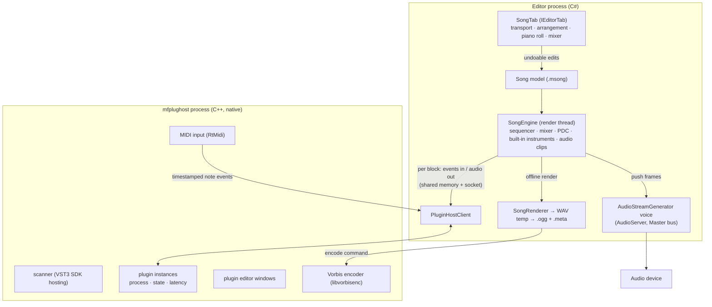
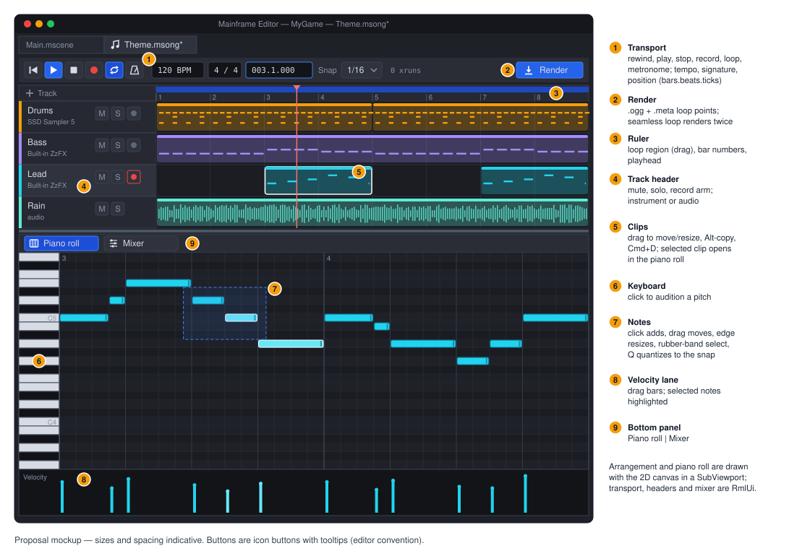
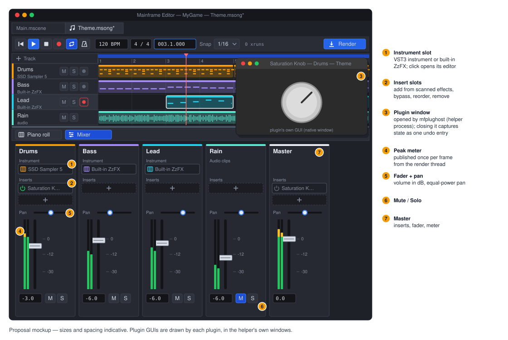

# Proposal: Music editor (songs, piano roll, VST3)

**Milestone:** unscheduled (editor tooling, after [ZzFX sounds and the sound designer](sound-designer.md)) · **Status:**
proposed (design only, 2026-10-08) · **Depends on:** [Sound designer](sound-designer.md) (editor audio, `AudioPreview`,
the ZzFX port), [Audio](../audio.md), [Editor](../editor.md), [Natives](../natives.md) · **Related:**
[UI preview tabs](../editor.md#ui-preview), [Game UI](../game-ui.md)

## Problem

Game music today is made outside the engine: in a DAW (Reaper, GarageBand) with the developer's plugins, then exported,
converted and copied into `Content/`, with loop points typed into the file's `.meta` by hand. Every change goes round
that loop again. For placeholder and prototype music, and for small games generally, a deliberately simple music tool
inside the editor would remove the round trip, keep the song's source next to the game, and make music loop correctly
in game without hand-tuned numbers.

## Goals

A **really simple DAW** as an editor tab:

- **Songs are project files** (`.msong`, JSON) that open in a tab beside scenes, with undo/redo, save and the usual
  file operations (move/rename keep references).
- **Instrument tracks** play a VST3 instrument, or the built-in ZzFX instrument when there are no plugins (other
  machines, CI). Notes live in **MIDI clips** on an arrangement timeline and are edited in a **piano roll**.
- **Effects and mixer:** VST3 effect inserts per track and on the master; volume, pan, mute, solo and meters.
- **Audio tracks:** `.wav`/`.ogg`/`.mp3`/`.flac` files and `ZzfxStream` sounds placed as clips on the timeline.
- **MIDI keyboard input:** play the selected track's instrument live and record into clips.
- **Plugin editors:** each plugin's own GUI opens in its own window (SSD Sampler's kit pages, Saturation Knob's knob).
- **Render to `.ogg`.** "Render" writes the song as an `.ogg` into the project and sets the file's loop points in its
  `.meta` from the song's loop region, so `AudioPlayer` + `AudioStream` play and loop it seamlessly in game with no
  new runtime code.
- **Plugins cannot crash the editor.** They run in a helper process.

## Non-goals

- **Live song playback in games.** Games play the rendered `.ogg`; VST plugins only exist on the developer's machine.
  Adaptive music (layers, tempo changes at run time) is a separate future design.
- Audio Units, VST2, CLAP, LV2. VST3 covers the target plugins (every plugin on the author's machine ships a `.vst3`;
  the SDK is MIT since 3.8, October 2025). CLAP is the natural second format later.
- Audio recording (microphone/line in), time-stretching, warping, comping.
- Tempo or time-signature changes within a song (one tempo, one signature per song in v1).
- Automation lanes, sends/buses beyond the master, sidechain.
- MIDI file import/export, MIDI output to hardware, MPE/note expression.
- Surround output (songs are stereo).

## Overview



The C# side owns everything musical: the song, sequencing, mixing, latency compensation and rendering. The helper is a
thin, native **plugin server**: it loads plugins, runs them on blocks it is handed, shows their windows, reads MIDI
devices and encodes Vorbis. Keeping the logic in C# means it is unit-testable with the built-in instrument and no
helper at all, and the native code stays small.

## The song model

`MainframeEngine.Editor/Src/Music/Song.cs` and friends; editor-only types (games never load songs), serialized with
`System.Text.Json` to `.msong`. The file is versioned, with migrations like `project.mfproj`:

```json
{
  "format": 1,
  "uid": "sng_…",
  "tempo": 120, "timeSignature": [4, 4], "ppq": 960,
  "loop": { "enabled": true, "start": 0, "end": 61440 },
  "render": { "output": "Content/Music/Theme.ogg", "sampleRate": 48000, "quality": 6, "tailSeconds": 2, "seamlessLoop": true },
  "master": { "volumeDb": 0, "inserts": [] },
  "tracks": [
    {
      "id": "t1", "name": "Drums", "kind": "instrument", "color": "#f59e0b",
      "volumeDb": -3, "pan": 0, "mute": false, "solo": false,
      "instrument": { "plugin": { "format": "vst3", "classId": "…", "name": "SSDSampler5", "vendor": "Steven Slate Drums" },
                      "state": "<base64 VST3 component+controller state>" },
      "inserts": [ { "plugin": { "classId": "…", "name": "Saturation Knob" }, "state": "…", "bypass": false } ],
      "clips": [ { "start": 0, "length": 15360, "notes": [ { "pitch": 36, "start": 0, "length": 240, "velocity": 110 } ] } ]
    },
    { "id": "t2", "name": "Lead", "kind": "instrument", "instrument": { "builtin": "zzfx", "params": "zzfx(...[,,220,,.1,.2,2])" }, "clips": [] },
    { "id": "t3", "name": "Rain", "kind": "audio", "clips": [ { "start": 0, "length": 30720, "file": "aud_…", "offset": 0, "gainDb": -6 } ] }
  ]
}
```

- **Time is in ticks** (960 PPQ) for everything on the timeline; seconds come from the single tempo. Audio clips store
  their file by UID (the FileSystem panel's reference fix-ups rewrite them on moves, like scenes).
- **Plugin state** is the VST3 component state followed by the controller state, base64 in the file. Songs stay one JSON
  file (no binary sidecars, in the spirit of [ADR 0011](../../../memory/decisions/0011-json-scenes-no-binary-bake.md)).
  Large sampler states make a large file; that is acceptable.
- **Plugin identity** is the VST3 class ID. A song that names a plugin the machine does not have still opens: the track
  shows "missing plugin: SSDSampler5 (Steven Slate Drums)", plays silence, and keeps its saved state for when the song goes
  back to a machine that has it.
- **Undo:** every edit is an action on the song's own `UndoRedo` history (like `EditedResource`). Note drags merge
  into one entry, the same as inspector slider drags. Plugin parameter changes made in a plugin's own window are *not*
  undoable in v1; the state is captured on save, on window close and before render.

## SongEngine

`MainframeEngine.Editor/Src/Music/Engine/`. A dedicated **render thread** produces audio in blocks of 256 frames at the
device's mix rate.

- **Sequencer:** for each block it collects the note-on/off events of every unmuted clip that overlaps it,
  sample-accurately, with loop wrap (notes that cross the loop end get their note-off at the wrap). Stopping or
  seeking sends all-notes-off. Note events go to the track's instrument with their sample offsets.
- **Instruments:** a VST3 instrument (via the helper), the **built-in ZzFX instrument** (a pool of 16 voices, each one
  `Zzfx.Generate` at the note's frequency, cached per pitch, velocity as gain; one ZzFX line per track), or nothing.
- **Audio clips** are decoded once through the engine's decoders (`AudioStream.Load` + `Preload`, resampled to the mix
  rate) and mixed at their offsets.
- **Mixer:** per track: instrument or clip audio → inserts (helper) → volume/pan (equal-power, `AudioMath`'s pan law)
  → mute/solo → master inserts → master volume. Peak meters per track are published to the UI thread once per frame.
- **Plugin delay compensation:** each plugin reports its latency. Every track is delayed so all tracks line up with
  the slowest chain, and the transport position shown is what is being heard.
- **No allocation on the render thread** after a song is prepared: buffers are pooled per track, events go in
  preallocated arrays, and model edits arrive as immutable snapshots swapped in at block boundaries.

### Playback through the AudioServer

Live playback goes through the editor's `AudioServer` (enabled by the sound-designer work). It uses a new engine
resource that mirrors Godot's **`AudioStreamGenerator`**: an `AudioStream` whose voice reads from a lock-free ring that
a producer fills (`AudioStreamGenerator.BufferSeconds`; `AudioServer.GetGeneratorPlayback(handle)` returns a playback
object with `FramesAvailable` and `PushFrames(ReadOnlySpan<float>)`). It reuses the SPSC ring and streaming-voice
machinery that already exist (`SpscRing`, `AudioStreamChannel`). The render thread keeps it two blocks ahead. It is
public engine API, so games get Godot's procedural-audio path too, and it is documented in [audio.md](../audio.md).

Latency: two 256-frame blocks plus the device buffer, about 20 ms at 48 kHz. Fine for arranging and acceptable for
playing a keyboard in v1. Recording compensates for it (below).

## Plugin host: `mfplughost`

A small native executable in `Native/PluginHost/` (C++20), built for each platform by `natives.yml` like `mfrmlui`,
with binaries committed under `MainframeEngine.Editor/runtimes/<rid>/native/` (editor-only; games never ship it) and
pinned in `Native/natives.lock`. Vendored sources, all permissively licensed:

| Library | Version | License | Used for |
|---|---|---|---|
| VST 3 SDK (`vst3sdk`: `pluginterfaces`, `base`, `public.sdk` hosting) | 3.8.x | MIT | loading, processing, state, editor views |
| RtMidi | 6.x | MIT | MIDI input devices |
| libogg + libvorbis/libvorbisenc | 1.3.x | BSD-3-Clause | Vorbis encoding for Render |

These are new third-party native dependencies; per CLAUDE.md they are listed here for discussion before any
implementation, and they get `THIRD_PARTY_NOTICES.md` rows when they land. No new NuGet packages.

### Process and protocol

- The editor starts **one helper per open song** on first need (a song with only built-in instruments and audio clips
  never starts one). The editor connects over a Unix domain socket (Windows: a named pipe) for control messages, which
  are length-prefixed binary messages: load plugin, set state, get state, latency, open/close editor, MIDI device
  list/open, encode.
- **Audio** crosses through a file-backed memory map (in `$TMPDIR`, or `/dev/shm` on Linux; .NET supports
  file-backed maps on every OS, unlike named maps). It holds one input and one output region per plugin instance per
  block. Per block the render thread writes inputs and events, sends `process(block, instances)` on the socket and
  waits for `done(block)`. One round trip per block, not per plugin: the helper runs each track's chain in order.
  Plugins run in VST3 realtime mode during playback and `kOffline` mode during Render.
- **Timeouts:** a block not answered within 4× its duration plays silence (the transport keeps going) and counts an
  xrun shown in the transport bar. During Render there is no timeout per block, only a 10 s watchdog.
- **Crash recovery:** if the helper exits or the socket drops, the editor shows "Plugin host stopped (while processing
  *Saturation Knob* on *Drums*)", restarts the helper, and reloads every plugin from its last captured state. A plugin
  that crashes the host twice in a minute is disabled for the session (track shows it, bypassed). Unsaved song edits are
  never at risk; they live in the editor.
- **Plugin windows** are the helper's own native windows (Cocoa `NSWindow` + the plugin's `NSView`; `HWND` on Windows;
  X11 with the VST3 run loop on Linux, best-effort in v1), titled "*Plugin* — *Track* — *Song*". The helper is a
  regular GUI process (on macOS it runs an `NSApplication` main loop; audio processing happens on a separate thread).
  Closing a window captures the plugin's state into the song (one undo entry: "Edit *Plugin* settings").

### Plugin scanning

`mfplughost --scan <bundle>` runs once per plugin bundle **in its own process** (so a plugin that crashes on load only
fails its own scan) and reports class ID, name, vendor, category (instrument/effect), I/O and version. Results are cached
in `~/.mainframe/plugins.json`, keyed by bundle path + modification time. Folders are the VST3 defaults:
`/Library/Audio/Plug-Ins/VST3` + `~/Library/Audio/Plug-Ins/VST3` (macOS), `%CommonProgramFiles%\VST3` (Windows),
`~/.vst3`, `/usr/lib/vst3`, `/usr/local/lib/vst3` (Linux), plus extra folders in Editor Settings. "Rescan plugins"
in Editor Settings clears the cache.

### macOS signing

Third-party plugins are signed by their vendors, so a hardened-runtime host must not enforce library validation. The
packaged editor ships `mfplughost` with the `com.apple.security.cs.disable-library-validation` entitlement (the editor
itself keeps its own entitlements). `build/package-editor.sh` gains that step; dev builds are unsigned and unaffected.

## MIDI input and recording

- Editor Settings › MIDI lists input devices (from the helper) with a toggle each; enabled devices stay open while any
  song tab is open. Without a helper running, enabling a device starts one.
- Incoming notes go to the **armed** track (one at a time; the record-arm button on its header), else the selected
  track, and play its instrument immediately (monitoring). The helper stamps each event with a monotonic clock; the
  engine maps it to the transport position the player was *hearing* (event time minus output latency) so recordings
  land where they were played.
- **Record** (transport) with an armed track writes notes into a new clip spanning the recorded range. With the loop on,
  each pass adds to the same clip (overdub). Optional input quantize (off, 1/16, 1/8) in the transport bar. Record is a
  single undo entry.
- Sustain pedal (CC64) is passed to the instrument and recorded as held note lengths. Other CCs are passed through
  live but not recorded in v1.

## The song tab (UI)

Double-clicking a `.msong` opens a **SongTab** (`IEditorTab`, like `UiPreview`). File › New › Song, or the FileSystem
panel's New menu, creates one with a single built-in-instrument track. The scene tree and inspector rest while it is
active. The layout:





- **Chrome in RmlUi** (`Content/Editor/song.rml`): the transport, track headers, the bottom panel switcher and the
  mixer strips, with icon buttons and tooltips (editor convention).
- **Arrangement and piano roll are drawn with the engine's 2D canvas** (`CanvasItem.DrawRect`/`DrawLine`/`DrawString`)
  in a `SubViewport` published to the UI as a texture, the way `ViewportPanel` shows the 3D view. Thousands of notes,
  smooth zoom and scroll, and a playhead every frame would be too many RmlUi elements. Input in that area goes to a
  `SongCanvasController` (hit testing in ticks/pitches).
- **Arrangement:** clips per track; drag to move (snaps), drag edges to resize, Alt-drag to copy, Cmd+D duplicates
  after, double-click an empty lane to create a one-bar clip, select a clip to show it in the piano roll, and drag the
  loop region in the ruler. Audio clips show their waveform (min/max peaks, cached).
- **Piano roll:** a keyboard on the left (click to audition); click to add a note of the last length, drag to move,
  drag the right edge to resize, select with a rubber band; Del deletes; Cmd+C/V/D; arrow keys nudge by the snap
  (Shift: an octave); Q quantizes the selection to the snap; a velocity lane below (drag bars). Adding or moving a
  note auditions it. Snap: off, 1/4 … 1/32, triplets.
- **Mixer panel:** one strip per track plus master: insert slots (add from the scanned effects list, open editor,
  bypass, remove, drag to reorder), pan, volume fader (dB), mute/solo, and a peak meter. The instrument slot sits at
  the top of instrument strips (choose a plugin, built-in ZzFX, open editor). The built-in instrument's ZzFX line is
  edited with the sound-designer controls in a popup.
- **Keyboard:** Space play/stop, R record, L loop, Home to start. These shortcuts apply only while the song tab is
  active and do not collide with the Play keys (F5–F8).

## Render

**Render** (transport button, also the FileSystem menu on a `.msong`):

1. Captures every plugin state, prepares a fresh engine instance in **offline** mode (no AudioServer, no timeouts,
   faster than real time where plugins allow), and renders the song from 0 to the end of the last clip plus
   `tailSeconds`, or the loop region when loop is enabled.
2. **Seamless loop** (default when looping): renders the loop region twice and keeps the second pass, so reverb and
   delay tails from the end of the loop are already present at its start, then cuts exactly at the loop length.
3. Writes a temporary 32-bit float WAV (`WavWriter` from the sound-designer work) and asks the helper to encode it
   (`encode <wav> <ogg> quality`); with no helper binary available it keeps the `.wav` as the output instead and says
   so. Output defaults to `Content/Music/<SongName>.ogg`.
4. Writes the output file's `.meta` import settings: `loop` from the song's loop toggle, `loopStart` 0 and `loopEnd` 0
   for a seamless render (the whole file is the loop), or the region in seconds otherwise; `loadMode` `Stream`.
5. Reports progress in a splash ("Rendering Theme… 63 %", cancellable) and the result in the Output panel.

The FileSystem panel badges a `.msong` whose output is older than the song ("render out of date"). Rendering is explicit;
saving never renders.

## Error handling

| Situation | Behaviour |
|---|---|
| Plugin missing on this machine | track opens with "missing plugin", plays silence, keeps state |
| Plugin fails to load or set state | message on the track; the plugin is bypassed; state kept |
| Helper crash | restart + reload from captured states; repeat offender disabled for the session |
| Helper binary missing (unsupported platform) | built-in instruments and audio clips still work; VST features disabled with a notice; Render writes `.wav` |
| Block deadline missed | silence for that block, xrun counter |
| MIDI device unplugged | device marked offline in settings; reopened when it returns |
| Song file from a newer format | opens read-only with a notice (same rule as scenes) |
| Render I/O or encode failure | error in Output; partial files deleted; the previous render is left intact (written to a temp name, then moved) |

## Testing

- **Model:** JSON round trip, migrations, UID references rewritten on file moves, missing-plugin tracks preserved
  byte for byte.
- **Sequencer and mixer** (no helper; built-in instrument and audio clips): note on/off at exact sample offsets across
  block boundaries and loop wraps, all-notes-off on stop and seek, mute/solo rules, pan law, PDC alignment with a fake
  plugin of known latency, and a deterministic offline render whose sample hash is pinned.
- **Helper protocol:** a C# `FakePluginHost` behind `IPluginHost` for unit tests (timeouts, crash during process,
  restart, state reload). Integration tests run the real helper with the VST3 SDK's example plugins (`again` effect,
  a test instrument), built with the helper as test fixtures, on all three CI OSes. These cover load, process, state
  round trip, latency, offline mode and encode. A `crasher` test plugin covers recovery.
- **Recording:** synthetic timestamped MIDI events through the fake host land at latency-compensated positions;
  overdub merges into one clip; one undo entry.
- **Render:** seamless-loop output has its tail folded in (energy at the start of the file); the `.meta` loop settings
  are written; the file plays and loops through `AudioStream` on the null device.
- **Allocation:** the render thread allocates nothing in steady-state playback (allocation counter around 1 000
  blocks).
- **QA:** `Tests/QA/editor-walkthrough.qa` gains a song step: new song, a few notes with the built-in instrument,
  render, then preview the `.ogg` from the FileSystem panel.

## Delivery

Four PRs, each usable on its own:

1. **Songs without plugins:** `.msong` model, SongTab with arrangement, piano roll and mixer, SongEngine with the
   built-in ZzFX instrument and audio clips, `AudioStreamGenerator` in the engine, Render to `.wav` + `.meta`.
2. **Plugin host:** `Native/PluginHost` (VST3 SDK), scanning, instruments and effects, plugin windows, PDC, crash
   recovery, signing step, CI natives build.
3. **Encoding:** libvorbisenc in the helper, Render to `.ogg`.
4. **MIDI input:** RtMidi in the helper, device settings, live play, recording.

Docs with the PRs: a new `docs/design/music-editor.md` (this proposal, rewritten as the as-built design),
[audio.md](../audio.md) (`AudioStreamGenerator`), [editor.md](../editor.md) (song tabs), [natives.md](../natives.md)
(`mfplughost`), `THIRD_PARTY_NOTICES.md`, ADRs for "out-of-process VST3 host, logic in C#" and "songs render to
files; games never host plugins", and the milestone table.

## Open questions

- **Which tempo/signature features come next?** Tempo maps are the most likely v2 request; ticks were chosen so they
  can be added without changing stored positions.
- **CLAP support.** The helper's protocol is format-neutral (`format` field on plugins), so CLAP is additive.
- **Per-song or shared helper?** One helper per song keeps crashes contained to a song. If many open songs make that
  heavy, a shared helper with per-song instance groups is the fallback.
- **Linux plugin GUIs** depend on each plugin's X11 support; v1 treats them as best-effort and documents which of
  the CI test plugins open there.
