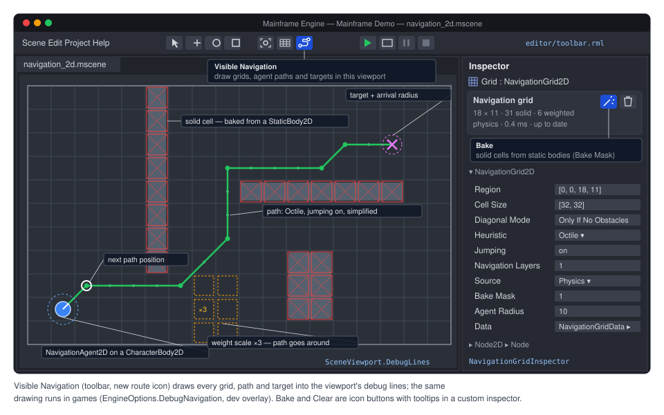

# Proposal: Navigation (grid A*, agents, later navmeshes)

**Milestone:** [Gameplay toolkit](../../milestones.md#gameplay-toolkit-) (G3) · **Status:** ⬜ planned ·
**Depends on:** [M6 physics](../physics.md) (bake from collision shapes), [M10 editor](../editor.md) (toggle, inspector)
· **Related:** [2D content](2d-content.md) (G2: `TileMapLayer` feeds the grid), [Editor viewport tools](editor-viewport-tools.md)
(G7: region handles), [Networking](../networking.md) (server-authoritative movement), [Mobile](mobile.md) (AOT)

## Problem

The engine has no navigation. There is no grid pathfinder, no graph A*, no navmesh, no navigation server and no
path-following agent. A search of `MainframeEngine/`, `MainframeEngine.Editor/` and `Examples/` for
navigation, A*, navmesh and pathfinding finds only unrelated code: RmlUi gamepad focus navigation
(`MainframeEngine/Src/UI/UiInputMap.cs:25-28`) and the editor's leaked-assembly finder
(`MainframeEngine.Editor/Src/Projects/ReferencePathFinder.cs:11`). Games that need enemies or units to walk around
walls write their own A*, usually allocating per query.

What exists and what navigation should build on:

- **Server pattern.** `IServer`, `IFrameServer` (`Process` once per frame) and `IFixedStepServer` (`FixedStep` after
  each step's `OnPhysicsProcess`) in `MainframeEngine/Src/Servers/ServerRegistry.cs:12-36`; `Register`/`Get<T>` at
  `:79` and `:104`. The engine registers the physics servers in `base.OnLoad()` (`MainframeEngine/Src/Core/Engine.cs:373-375`),
  dedicated servers in `HeadlessHost` (`MainframeEngine/Src/Project/HeadlessHost.cs:51-52`). `PhysicsServer2D` keeps
  one space per `World2D` (`MainframeEngine/Src/Physics/2D/PhysicsServer2D.cs:85-180`), registers lazily through
  `For(tree)` (`:104`) and debug-draws when `DebugDrawEnabled` (`:99`, `:152`). Edit mode runs frame servers but not
  fixed-step servers (`MainframeEngine/Src/Scene/SceneTree.cs:76-83`).
- **Movement.** `CharacterBody2D.Velocity` + `MoveAndSlide()` (`MainframeEngine/Src/Physics/2D/CharacterBody2D.cs:56`,
  `:152`), `CharacterBody3D` the same (`MainframeEngine/Src/Physics/3D/CharacterBody3D.cs:40`, `:153`), called from
  `Node.OnPhysicsProcess(float delta)` (`MainframeEngine/Src/Scene/Node.Processing.cs:149`).
- **Physics queries.** `World2D.DirectSpaceState` (`MainframeEngine/Src/Scene/World3D.cs:104-116`) with
  `IntersectShape`/`IntersectPoint` (`PhysicsServer2D.cs:45`, `:56`); 3D has the same
  (`MainframeEngine/Src/Physics/3D/PhysicsDirectSpaceState3D.cs:107`, `:125`). Queries are main-thread only and
  allocation-free ([physics.md → Queries](../physics.md#queries)). Bodies join their space in `OnEnterTree`, also in
  the editor (`MainframeEngine/Src/Physics/2D/CollisionObject2D.cs:95-100`; engine types keep their lifecycle in edit mode,
  `MainframeEngine/Src/Scene/Node.EditMode.cs:6-12`).
- **Debug drawing.** `SceneViewport.DebugLines` and `OverlayLines` (`MainframeEngine/Src/Scene/SceneViewport.cs:109`,
  `:115`): allocation-free line batches; 2D producers draw in the z = 0 plane in pixels with `AddLine2D`,
  `AddPolygon2D`, `AddCircle2D` (`MainframeEngine/Src/Rendering/Debug/DebugLines.cs:164-175`), capped at
  `MaxLines` (`:19`). `EngineOptions.DebugCollisionShapes` (`Engine.cs:77`) and the dev overlay's Physics panel
  checkbox (`MainframeEngine/Src/Debugging/DevOverlay/DevOverlayPanels.cs:238-260`, `DevOverlayStats.cs:312-322`)
  switch the physics debug draw.
- **Math.** `Vector2I` and `Rect2I` (`MainframeEngine/Src/Math/Vector2I.cs:16`, `Rect2I.cs:15`, `HasPoint` at
  `:252`) are exportable and store as number arrays ([math.md](../math.md)).
- **Editor hooks.** Custom inspector sections with `data-action` buttons (`ICustomInspector`,
  `CustomInspectorAttribute`, `MainframeEngine.Editor/Src/Inspector/InspectorModel.cs:162-191`); the toolbar's view
  toggles (`MainframeEngine.Editor/Content/Editor/toolbar.rml:69-70`).

## Goals

- `AStarGrid2D`: Godot's grid A* (region, cell size, diagonal modes, heuristics, weights, solid cells, partial paths,
  optional jump point search) with **allocation-free queries** into caller buffers.
- `AStar2D` / `AStar3D`: Godot's general point-graph A* (waypoint graphs, also usable in 3D before navmeshes exist).
- `NavigationServer2D`: a registered server with one map per `World2D`; regions register with it; agents query it.
- `NavigationGrid2D` node: a grid region whose solid cells are baked from collision shapes (through `Src/Physics`
  queries only), painted by a `TileMapLayer` (G2) or set from code.
- `NavigationAgent2D` node: target position, next path position, automatic repath, arrival distances, signals
  (`PathChanged`, `WaypointReached`, `TargetReached`, `NavigationFinished`, `VelocityComputed`).
- Debug draw in games and the editor; editor Bake button and Visible Navigation toggle.
- Deterministic results (same input, same path on every OS/CPU) for server-authoritative and lockstep games.
- A Demo scene (`navigation_2d`).
- Later phases, designed here but shipped after the core: avoidance (RVO/ORCA), 2D navmesh polygons, async path
  queries, 3D (grid on the ground plane, then navmesh baking).

## Non-goals

- Navmesh baking in the first phases. 3D baking needs a dependency decision ([Open questions](#open-questions)).
- Cross-region path stitching for grids. Grids of one map should not overlap; connected regions come with
  polygon navmeshes (G3.9) and links.
- Isometric and hexagonal grids (Godot's `CellShape`) until G2 ships `TileShape` values beyond `Square`.
- Hierarchical pathfinding (HPA*) and flow fields. They can be added on top of `AStarGrid2D` later.
- Replicating paths to clients. Clients see replicated positions; paths stay on the server.
- Behaviour trees, steering beyond path following, formations.

## Design

### Code layout

New folder `MainframeEngine/Src/Navigation/` (everything below is **new**):

| Folder / file | Contents |
|---|---|
| `AStarGrid2D.cs`, `GridSearch.cs` | the grid pathfinder and its search scratch (A*, JPS) |
| `AStar2D.cs`, `AStar3D.cs`, `PointGraph.cs` | point-graph A* |
| `NavigationServer2D.cs`, `NavigationMap2D.cs` | server, maps, path queries, sync, debug draw |
| `Nodes2D/NavigationGrid2D.cs`, `NavigationGridData.cs` | the grid region node and its baked data resource |
| `Nodes2D/NavigationAgent2D.cs` | the agent |
| `Baking/GridPhysicsBaker2D.cs` | cell solidity from `World2D.DirectSpaceState` |
| later: `Avoidance/`, `Polygons/`, `3D/` | G3.7–G3.12 |

The navigation code never calls Box2D.NET or Jitter2. It reads collision through the public query API, so the
"physics calls stay in `Src/Physics`" rule holds.

### `AStarGrid2D`

A plain C# class (Godot's is `RefCounted`), usable without a tree: games, tools and the server all use it.

```csharp
public enum GridDiagonalMode : byte { Always, Never, AtLeastOneWalkable, OnlyIfNoObstacles }
public enum GridHeuristic : byte { Euclidean, Manhattan, Octile, Chebyshev }
public enum GridPathStatus : byte { Found, Partial, NotFound, InvalidPoint, BufferTooSmall }

public class AStarGrid2D
{
    // Layout. Changing these marks the grid dirty; call Update() before querying (Godot's rule).
    public Rect2I Region { get; set; }
    public Vector2 CellSize { get; set; } = Vector2.One;
    public Vector2 Offset { get; set; }
    public GridDiagonalMode DiagonalMode { get; set; } = GridDiagonalMode.Always;
    public GridHeuristic DefaultComputeHeuristic { get; set; } = GridHeuristic.Euclidean;
    public GridHeuristic DefaultEstimateHeuristic { get; set; } = GridHeuristic.Euclidean;
    public bool JumpingEnabled { get; set; }
    public bool IsDirty { get; }
    public void Update();                                   // (re)allocates cell storage and search scratch

    // Cells. No Update() needed; each change bumps Version.
    public uint Version { get; }
    public bool IsInBounds(Vector2I id);
    public void SetPointSolid(Vector2I id, bool solid = true);
    public bool IsPointSolid(Vector2I id);
    public void SetPointWeightScale(Vector2I id, float weightScale);
    public float GetPointWeightScale(Vector2I id);
    public void FillSolidRegion(Rect2I region, bool solid = true);
    public void FillWeightScaleRegion(Rect2I region, float weightScale);
    public void Clear();                                    // region = empty, all cells free
    public Vector2 GetPointPosition(Vector2I id);           // cell centre: Offset + (id + 0.5) * CellSize
    public Vector2I GetPointAt(Vector2 position);           // new: the cell containing a position

    // Queries. Allocation-free; count is the number of points written.
    public GridPathStatus GetIdPath(Vector2I from, Vector2I to, Span<Vector2I> path, out int count,
        bool allowPartialPath = false);
    public GridPathStatus GetPointPath(Vector2I from, Vector2I to, Span<Vector2> path, out int count,
        bool allowPartialPath = false);
    public Vector2I[] GetIdPath(Vector2I from, Vector2I to, bool allowPartialPath = false);   // allocates (tools, tests)
    public int MaxSearchNodes { get; set; }                 // 0 = unlimited; exceeded → Partial or NotFound

    // Godot's _compute_cost / _estimate_cost. Overriding them disables the built-in fast paths.
    protected virtual float ComputeCost(Vector2I from, Vector2I to);
    protected virtual float EstimateCost(Vector2I from, Vector2I end);
}
```

Behaviour follows Godot 4:

- **Diagonal modes.** `Always` moves diagonally even between two solid cells; `AtLeastOneWalkable` needs one of the
  two side cells free; `OnlyIfNoObstacles` needs both (no corner cutting); `Never` is 4-way.
- **Heuristics.** Euclidean, Manhattan, Octile, Chebyshev, used for both the step cost and the estimate unless
  overridden. Step cost is multiplied by the entered cell's weight scale (≥ 0).
- **Solid start or target.** `InvalidPoint` if `from` is solid or outside the region. A solid or unreachable `to`
  returns `NotFound`, or with `allowPartialPath` the path to the reachable cell with the lowest estimate to `to`
  (`Partial`).
- **Jump point search** (`JumpingEnabled`) for every diagonal mode. Like Godot, it ignores weight scales.

Deviations from Godot, and why:

- **Buffers instead of returned arrays.** Godot returns a new `PackedVector2Array` per call. Here the caller passes a
  `Span`; `BufferTooSmall` reports the needed size in `count`. The allocating overload exists for tools and tests.
- **JPS paths list every cell.** Godot returns only the jump points. Expanding them keeps `GetIdPath` output the
  same with JPS on or off; agents simplify paths anyway.
- **Top-level enums** (`GridDiagonalMode`, `GridHeuristic`) instead of nested ones: Godot's C# binding has to call
  them `DiagonalModeEnum` because they clash with the property names.
- **`GetPointAt` and `Version`** are new: every caller needs the inverse of `GetPointPosition`, and the server needs
  to know when cells changed.

**Memory and allocation.** Cells are indexed `(y - Region.Y) * Region.Width + (x - Region.X)`. Solidity is a
`ulong[]` bitset; weights are a `float[]` allocated only when a cell gets a weight other than 1. The search scratch
(`GridSearch`) holds `float[] g`, `int[] parent`, `uint[] stamp` and an indexed binary heap, sized in `Update()`. A
per-query stamp marks cells open/closed, so a query never clears arrays (they are cleared once when the stamp wraps).
About 16 bytes per cell (a 256 × 256 grid is 1 MB). `Region.Area` is capped at 4 194 304 cells (2048²); larger
worlds need several grids or HPA* later. After `Update()`, queries, cell edits and fills allocate nothing.

**Determinism.** Costs use only `+`, `*` and `MathF.Sqrt` on `float`, which are exact IEEE operations in .NET on x64
and Arm64 (RyuJIT does not fuse multiply-adds on its own). The heap breaks ties by lower `f`, then lower `h`, then
lower cell index, and neighbours expand in a fixed order. So a grid and a query give the same path on every OS, CPU
and thread. A golden-path test locks this in.

### `AStar2D` and `AStar3D`

Godot's point-graph A* for waypoint graphs (G3.2): `AddPoint(long id, Vector2 position, float weightScale = 1)`,
`RemovePoint`, `ConnectPoints(a, b, bidirectional = true)`, `DisconnectPoints`, `SetPointDisabled`,
`GetClosestPoint(position)`, `GetClosestPositionInSegment`, `ReserveSpace(n)`, and the same span-based
`GetIdPath`/`GetPointPath` plus allocating overloads; `ComputeCost`/`EstimateCost` are virtual. Storage is a
`Dictionary<long, int>` from id to a dense slot plus slot arrays, so queries do not allocate. `AStar3D` is the same
with `Vector3`. It gives 3D games hand-placed waypoint navigation long before navmeshes (G3.12).

### `NavigationServer2D` and maps

```csharp
public sealed class NavigationServer2D : IFixedStepServer, IFrameServer
{
    public static NavigationServer2D For(SceneTree tree);   // registers a default one if missing (tests)
    public bool DebugDrawEnabled { get; set; }
    public IReadOnlyList<NavigationMap2D> Maps { get; }
    public NavigationMap2D GetMap(World2D world);           // created on first use
}

public sealed class NavigationMap2D
{
    public World2D World { get; }
    public uint IterationId { get; }                        // bumped by every sync that changed something
    public GridPathStatus QueryPath(in NavigationPathQuery2D query, NavigationPath2D result);
    public Vector2 GetClosestPoint(Vector2 point, uint navigationLayers = 1);
    public void ForceSync();                                // apply pending region changes now (tools, tests)
}

public readonly record struct NavigationPathQuery2D(Vector2 Start, Vector2 Target, uint NavigationLayers = 1,
    NavigationPathPostprocessing Postprocessing = NavigationPathPostprocessing.CorridorFunnel,
    bool AllowPartialPath = true);

public sealed class NavigationPath2D                        // reusable result; grows, never shrinks
{
    public ReadOnlySpan<Vector2> Points { get; }
    public ReadOnlySpan<Vector2I> Cells { get; }            // grid regions: the cells behind Points
    public GridPathStatus Status { get; }
    public NavigationGrid2D? Region { get; }
}
```

- `World2D` gains `NavigationMap2D? NavigationMap { get; internal set; }`, the same way it holds its
  `PhysicsSpace` (`World3D.cs:115`).
- The engine registers the server in `base.OnLoad()` right after `PhysicsServer2D` (`Engine.cs:375`), so its
  `FixedStep` runs after the physics step. `HeadlessHost` registers it too: dedicated servers are where agents run.
- **Sync points.** Region changes (a node entering or leaving, a bake, `SetCellSolid`) are queued and applied at the
  map's next sync: in `FixedStep` while the game runs, in `Process` when no fixed step ran that frame (edit mode,
  paused tree). A sync that changed anything bumps `IterationId`. Queries during a tick therefore all see the same
  map, whatever the order of the nodes that ask (Godot's model).
- **Query.** The map picks the region whose layers intersect `NavigationLayers` and that contains `Start` (regions
  are checked in registration order; the closest walkable cell within 2 cells is used if `Start` is in a solid
  cell). `Target` outside the region, or in a solid cell, is clamped to the closest reachable cell when
  `AllowPartialPath`.
- **Post-processing** reuses Godot's enum names on grids: `CorridorFunnel` keeps only the cells needed for
  line-of-sight (string pulling with a grid line test that respects the diagonal mode), `EdgeCentered` keeps the
  corners (collinear cells removed), `None` keeps every cell centre. On polygon navmeshes (G3.9) they mean what they
  mean in Godot.
- **Debug draw** (when `DebugDrawEnabled`) writes into `SceneViewport.DebugLines`: region outline, cell lines,
  solid cells (outline and cross), weighted cells (dashed amber), each agent's path, next path position and target.
  It is culled to the active `Camera2D`'s visible rect (`SceneViewport.ActiveCamera2D`, `SceneViewport.cs:131`) and
  stays well under `DebugLines.MaxLines`. Colours live in `NavigationDebugColors` (static, settable).



### `NavigationGrid2D` and `NavigationGridData`

A `Node2D` that owns an `AStarGrid2D` and registers it with the map of its viewport's `World2D` in `OnEnterTree`
(unregisters in `OnExitTree`). The constructor only sets defaults.

```csharp
[EditorIcon("grid-3x3", Family = EditorIconFamily.Space2D)]
public class NavigationGrid2D : Node2D
{
    [Export] public Rect2I Region { get; set; } = new(0, 0, 32, 32);
    [Export] public Vector2 CellSize { get; set; } = new(32, 32);
    [Export] public GridDiagonalMode DiagonalMode { get; set; } = GridDiagonalMode.OnlyIfNoObstacles;
    [Export] public GridHeuristic Heuristic { get; set; } = GridHeuristic.Octile;
    [Export] public bool JumpingEnabled { get; set; }
    [Export(Flags = true)] public uint NavigationLayers { get; set; } = 1;

    [ExportGroup("Bake")]
    [Export] public NavigationGridSource Source { get; set; } = NavigationGridSource.Physics; // Manual, Physics, TileMapLayer
    [Export(Flags = true)] public uint BakeCollisionMask { get; set; } = CollisionLayers.Default;
    [Export(Range = "0,256,0.5")] public float AgentRadius { get; set; }
    [Export(NodeType = typeof(TileMapLayer))] public NodePath TileMapLayerPath { get; set; }  // G3.6, type from G2
    [Export] public int TilePhysicsLayer { get; set; }
    [Export] public string SolidDataLayer { get; set; } = "solid";
    [Export] public string WeightDataLayer { get; set; } = "";
    [Export] public bool BakeOnReady { get; set; }
    [Export] public NavigationGridData? Data { get; set; }

    public AStarGrid2D Grid { get; }
    public void Bake();                                  // main thread; replaces Data
    public void SetCellSolid(Vector2I cell, bool solid); // runtime edits (doors, destroyed walls); applied at sync
    public void SetCellWeight(Vector2I cell, float weightScale);
}
```

- **Defaults differ from `AStarGrid2D`** on purpose: a body cannot squeeze between two diagonal wall corners, so
  the node defaults to `OnlyIfNoObstacles` and `Octile` (exact for 8-way grids).
- **Placement.** Cell `(x, y)` covers `GlobalPosition + (x, y) * CellSize` to `+ CellSize`. The node's global
  rotation and scale are ignored (a warning is logged once); grids are axis-aligned like tile maps.
- **Data.** `NavigationGridData : Resource` (inline in the scene, or a `.mres`) holds the baked state. Large grids
  must not become 16 000-line JSON arrays (the writer puts one array element per line), so cells are a compact
  string: run-length-encoded solid bits in base64, and weights as `(run, value)` pairs only where they differ from 1.

```json
{
  "format": 2,
  "uid": "res_3f2a9c0e1b7d",
  "type": "NavigationGridData",
  "props": {
    "Region": [0, 0, 18, 11],
    "Solid": "rle1:BQAIAAkHAA…",
    "Weights": "rle1:fwAD…:3",
    "BakedFrom": "Physics"
  }
}
```

  A decode error, or a `Region` that does not match the node, logs a warning and leaves the grid empty (all
  walkable) rather than failing the scene load. The codec is plain code (no reflection), so AOT/trimming is fine.
- **Physics bake** (`GridPhysicsBaker2D`, main thread, allocates; edit time or a level load). For each cell it calls
  `World2D.DirectSpaceState.IntersectShape` with one reused `RectangleShape2D` the size of the cell grown by
  `AgentRadius` on each side, masked by `BakeCollisionMask`. Only `StaticBody2D` hits count by default
  (`CollisionObject2D.cs:165`), plus `TileMapLayer` hits once G2b.3 widens query results from `CollisionObject2D` to
  `Node2D` (tile bodies report their layer); moving bodies are dynamic obstacles (avoidance, G3.7). Areas are never
  reported by queries. A 128 × 128 grid is 16 384 overlap tests, a few milliseconds. `BakeOnReady` bakes once in a deferred call
  after the scene's bodies entered the tree (procedural levels).
- **Runtime edits.** `SetCellSolid`/`SetCellWeight` change the live grid (not `Data`), queue a sync and so make
  agents repath on the next tick.

### `NavigationAgent2D`

A `Node` child of the body it steers (Godot's model). It does not move anything: the body's own
`OnPhysicsProcess` asks it where to go and calls `MoveAndSlide`. It reads the parent `Node2D`'s `GlobalPosition`,
which is the simulation position inside `OnPhysicsProcess` (interpolated render poses apply only outside it).

```csharp
[EditorIcon("route", Family = EditorIconFamily.Space2D)]
public class NavigationAgent2D : Node
{
    [Export] public Vector2 TargetPosition { get; set; }
    [Export(Range = "0.1,1000,0.1")] public float PathDesiredDistance { get; set; } = 20f;   // px, Godot's default
    [Export(Range = "0.1,1000,0.1")] public float TargetDesiredDistance { get; set; } = 10f;
    [Export(Range = "10,1000,1")] public float PathMaxDistance { get; set; } = 100f;
    [Export(Range = "0,1000,0.1")] public float TargetRepathDistance { get; set; }           // new; 0 = Godot behaviour
    [Export(Flags = true)] public uint NavigationLayers { get; set; } = 1;
    [Export] public NavigationPathPostprocessing PathPostprocessing { get; set; } = NavigationPathPostprocessing.CorridorFunnel;
    [Export] public bool DebugEnabled { get; set; }

    public Vector2 GetNextPathPosition();       // repaths if needed, advances waypoints, raises signals
    public bool IsNavigationFinished();
    public bool IsTargetReached();
    public bool IsTargetReachable();
    public float DistanceToTarget();
    public Vector2 GetFinalPosition();
    public ReadOnlySpan<Vector2> GetCurrentNavigationPath();
    public int GetCurrentNavigationPathIndex();
    public void SetVelocity(Vector2 velocity);  // → VelocityComputed (pass-through until avoidance, G3.7)

    [Signal] public event Action? PathChanged;
    [Signal] public event Action<NavigationWaypoint2D>? WaypointReached;   // struct: position, index, cell
    [Signal] public event Action? TargetReached;
    [Signal] public event Action? NavigationFinished;
    [Signal] public event Action<Vector2>? VelocityComputed;
}
```

Use from a body (the whole pattern):

```csharp
public sealed class Chaser : CharacterBody2D
{
    [Export] public float Speed { get; set; } = 140f;
    private NavigationAgent2D _agent = null!;

    protected override void OnReady() => _agent = GetNode<NavigationAgent2D>("Agent");

    protected override void OnPhysicsProcess(float delta)
    {
        if (_agent.IsNavigationFinished())
            return;
        Velocity = GlobalPosition.DirectionTo(_agent.GetNextPathPosition()) * Speed;
        MoveAndSlide();
    }
}
```

- **Repath** (lazy, inside `GetNextPathPosition`, like Godot): when `TargetPosition` changed (by more than
  `TargetRepathDistance`, which keeps chasers that set the target every tick from searching every tick), when the
  map's `IterationId` changed, when the agent is farther than `PathMaxDistance` from its current path segment, or
  after `RequestRepath()`. An idle agent costs nothing per frame.
- **Waypoints.** While the agent is within `PathDesiredDistance` of the current point it advances (raising
  `WaypointReached`). Within `TargetDesiredDistance` of the target it raises `TargetReached`; at the end of the path
  it raises `NavigationFinished` once. Signals fire on the main thread from the caller's `OnPhysicsProcess`.
- **Signals** are `[Signal]` C# events like `Area3D.BodyEntered` (`MainframeEngine/Src/Physics/3D/Area3D.cs:24-25`).
  Godot's `waypoint_reached` passes a `Dictionary`; here it is a struct, so raising it does not allocate.
- **Path storage.** Each agent owns one `NavigationPath2D`; it grows when a longer path appears and is reused after
  that, so steady state allocates nothing.
- **`SetVelocity`** raises `VelocityComputed` with the same velocity until avoidance exists, so code written for
  avoidance (move in the `VelocityComputed` handler) works before and after G3.7.

### TileMapLayer integration (with G2)

[2D content](2d-content.md) (G2b) adds `TileSet`/`TileMapLayer` and reserves this hook ("Navigation hook (G3)"
there): navigation reads a layer only through its public API (`GetUsedCells`, `GetUsedRect`, `GetCellTileData`,
`MapToLocal`, `TileSet.TileSize`, the `Changed` signal) and G2 adds no navigation fields. With
`Source = TileMapLayer` the grid:

- copies `TileSet.TileSize` as `CellSize`, the layer's position as its own, and `GetUsedRect()` as `Region` (unless
  `Region` was set by hand). Grid cell `(x, y)` is map cell `(x, y)`, so `MapToLocal` and `GetPointPosition` agree;
- marks a cell solid when its tile has collision on the physics layer `TilePhysicsLayer` (new export, default 0), or
  when its tile's bool custom data layer named `SolidDataLayer` (default `"solid"`, G2's own example) is true; empty
  cells are walkable;
- reads weights from an optional float custom data layer `WeightDataLayer` (default empty = all 1);
- re-reads the layer when it raises `Changed`, at most once per sync. With G2's signal as designed (no dirty rect)
  that is O(used cells) with a reused `List<Vector2I>`, allocation-free once sized; a 256 × 256 layer re-reads in
  well under a millisecond. If that proves too slow for games that dig every frame, a `CellsChanged(Rect2I)` signal
  is the one addition navigation would ask of G2 ([Open questions](#open-questions)).

Only `TileShape.Square` layers are accepted (the only shape G2 ships); others log a warning and leave the grid empty.
Per-tile navigation polygons (Godot's `TileSetNavigationLayer`, a name G2 reserves) belong to 2D navmeshes (G3.9).

### Editor

- **Visible Navigation** toggle on the toolbar, in the view group after Grid (`toolbar.rml:69-70`): an icon button
  (new Tabler icon `route`) with the tooltip "Visible Navigation — draw grids, agent paths and targets in this
  viewport". It sets `NavigationServer2D.DebugDrawEnabled` of the edited scene's tree. Default on, like collision
  shapes (`MainframeEngine.Editor/Src/EditorApp.cs:91`).
- **`NavigationGridInspector`** (`[CustomInspector(typeof(NavigationGrid2D))]`): a header with icon buttons **Bake**
  (new icon `wand`; "Bake — solid cells from static bodies (Bake Mask)" or "…from the TileMapLayer") and **Clear**
  (`trash`; "Clear — make every cell walkable"), and a status line: size, solid and weighted counts, source, bake
  time, and "out of date" when a body in the region moved since the bake. Bake and Clear replace `Data` through the
  inspector context, so they undo.
- **Agent gizmo.** The selected `NavigationAgent2D` draws its `TargetDesiredDistance` and `PathDesiredDistance`
  circles into `OverlayLines`. Dragging the `Region` edges uses G7.3's handle API
  ([Editor viewport tools](editor-viewport-tools.md)) once it exists; until then `Region` is edited in the inspector.
- **Icons.** `route` and `wand` are added to `MainframeEngine.Editor/Content/icons/icons.txt` (`just
  editor-icons-fetch`, then `just editor-icons`); `grid-3x3` and `trash` already exist.
- Running games use the dev overlay: a "Navigation" checkbox in the Physics panel next to "Collision shapes"
  (`DevOverlayPanels.cs:243`), and `EngineOptions.DebugNavigation` (new) to start with it on.

### Threading

- **G3.1–G3.8: main thread.** Queries run inside the caller's `OnPhysicsProcess`; bakes run on the main thread
  because physics queries are main-thread only. A 128 × 128 query is expected well under 0.1 ms (benchmarked in
  G3.1), so most games never need more.
- **G3.10: async queries (opt-in).** `NavigationMap2D.QueryPathAsync(in query, NavigationPath2D result)` returns a
  `NavigationPathRequest` handle (a struct). Workers run on the .NET thread pool through a cached
  `IThreadPoolWorkItem` (no per-request allocation), each with its own `GridSearch` scratch, against an immutable
  snapshot of the grid taken at the last sync (copy-on-write: a changed grid allocates a new snapshot only on the
  tick it changed). Results are delivered at the **next sync point**, which waits for requests submitted before it.
  Delivery therefore always lands exactly one tick later, so async queries stay deterministic. Agents with
  `AsyncPath = true` keep following the old path until the new one arrives, then raise `PathChanged`. A
  `navigation` section in `project.mfproj` (format bump + migration) holds the worker count and the default.

### Networking and determinism

- Movement is server-authoritative ([ADR 0041](../../../memory/decisions/0041-server-authoritative-per-node-authority.md)).
  Agents run where the body's movement runs: on the server (or the host). Clients get replicated positions; their
  agents stay idle. The usual gate is `if (Multiplayer is { IsServer: false }) return;`
  (`MainframeEngine/Src/Scene/Node.Network.cs:30`, `MainframeEngine/Src/Networking/Replication/MultiplayerApi.cs:119`).
- Paths depend only on the map state at the last sync and the query, never on frame timing or thread scheduling
  (see `AStarGrid2D` determinism and the async delivery rule). Lockstep games and replays get identical paths on
  every machine. Physics itself is deterministic only on one machine/build ([physics.md](../physics.md)), so
  bit-identical movement across machines is not promised; identical paths are.
- Dedicated servers (`--headless`) register the navigation server like the physics servers; nothing in navigation
  needs a window or GPU.

### Later phases

- **Avoidance (G3.7).** ORCA/RVO for agents and `NavigationObstacle2D` (radius or polygon, static or moving), run in
  the server's `FixedStep` after paths: `AvoidanceEnabled`, `Radius`, `MaxSpeed`, `NeighborDistance`,
  `MaxNeighbors`, `TimeHorizonAgents`, `TimeHorizonObstacles`, `AvoidanceLayers`/`Mask`, `AvoidancePriority` (Godot
  names). Results raise `VelocityComputed` before the next tick's `OnPhysicsProcess`. Neighbour search uses a uniform
  grid owned by the map (no allocation). The algorithm source is an open question.
- **2D navmesh polygons (G3.9).** `NavigationPolygon : Resource` (outlines → convex polygons) and
  `NavigationRegion2D` (Godot names), A* over polygon adjacency plus the funnel algorithm, `NavigationLink2D` for
  jumps and teleports, regions joined by shared edges. Baking from physics shapes and tile outlines with agent-radius
  offsetting. This is the step between grids and 3D navmeshes, and it tests the map/region/agent split on
  non-grid data.
- **3D (G3.11–G3.12).** `NavigationServer3D` with the same map/region/agent split, `NavigationAgent3D`
  (`Vector3`, plus `PathHeightOffset`), and first a `NavigationGrid3D`: an `AStarGrid2D` on the XZ plane at a
  height, baked with `IntersectShape` against 3D static bodies — enough for top-down 3D games, tower defence and RTS.
  Then `NavigationMesh` + `NavigationRegion3D` with baking from collision shapes and meshes; the baking library is
  undecided ([Open questions](#open-questions)).

## Testing

- **Unit, `Tests/MainframeEngine.Tests/Navigation/`:**
  - `AStarGrid2DTests`: each diagonal mode's corner rules on hand-made grids (expected id lists); each heuristic;
    weights reroute a path; solid start (`InvalidPoint`), solid/unreachable target (`NotFound`, `Partial`);
    out-of-region points; `BufferTooSmall` reports the needed size; dirty grid throws until `Update()`;
    `GetPointAt`/`GetPointPosition` round trip; stamp wrap-around.
  - Optimality: on 200 seeded random grids the path cost equals a brute-force Dijkstra cost for every admissible
    heuristic/diagonal-mode pair; JPS cost equals plain A* cost (uniform weights).
  - Determinism: a fixed maze gives a golden id list and hash, the same with JPS expanded, on all three CI OSes.
  - `AStar2DTests`/`AStar3DTests`: connect/disconnect, disabled points, closest point and segment, partial paths.
  - `NavigationGrid2DTests`: physics bake of rectangle/circle/capsule/polygon static bodies (expected cells),
    `AgentRadius` clearance, mask filtering, rigid and character bodies ignored; `NavigationGridData` RLE round
    trip through `.mres`, corrupt data → empty grid + warning; runtime `SetCellSolid` bumps `IterationId` at sync;
    (G3.6) `TileMapLayer` source from tile collision, a `"solid"` bool and a float weight custom data layer, re-read
    on `Changed`, non-square layers rejected.
  - `NavigationAgent2DTests` (headless tree, fixed delta): a `CharacterBody2D` reaches the target; signal order
    (`PathChanged`, `WaypointReached`…, `TargetReached`, `NavigationFinished` once); repath on map change, on target
    move beyond `TargetRepathDistance`, on being pushed past `PathMaxDistance`; unreachable target →
    `IsTargetReachable() == false` and a partial path.
  - `NavigationAllocationTests`: **0 bytes** over 300 ticks after warm-up with 64 agents chasing moving targets on a
    128 × 128 grid, runtime cell edits every 30 ticks, and debug draw on (`AllocationGate.SmallestWindow`).
- **Editor, `Tests/MainframeEngine.Editor.Tests/`:** `NavigationGridInspector` Bake/Clear change `Data` and undo; the
  Visible Navigation command toggles the server flag.
- **Benchmarks** (`Tests/MainframeEngine.Benchmarks`, new `NavigationBenchmarks`, added to `baseline.json`): 256 × 256
  open field and maze, A* vs JPS, 8-way and 4-way; 64-agent repath tick.
- **Render tests:** no new goldens; debug lines are already covered. The allocation gate's `showcase` scene is
  unchanged.
- **QA:** `Tests/QA/editor-walkthrough.qa` opens the Demo's `navigation_2d` scene, toggles Visible Navigation, bakes,
  undoes, and screenshots the viewport.
- **Demo** (`Examples/Demo`): a `navigation_2d` tab (icon `route`): a walled maze (`StaticBody2D` walls, baked grid
  saved inline), mud patches (weight 3), a dozen `Chaser` bodies with agents that follow the clicked point, and a
  side panel for diagonal mode, heuristic, jumping, Visible Navigation, and "click to add a wall" (runtime
  `SetCellSolid` → everyone repaths). `Demo.Tests` checks that headless chasers reach a target. The nav bar's number
  keys stop at 8 (`Examples/Demo/Demo/Src/Nav/DemoNav.cs:102`). They extend to 1–9 then 0 and `navigation_2d` takes the next free
  key (scheme in [2D content](2d-content.md#demo-scene)).

## Acceptance

- `AStarGrid2D` matches Godot's results on the test grids for every diagonal mode and heuristic, queries allocate
  nothing, and paths are identical on Windows, Linux and macOS.
- A `CharacterBody2D` with a `NavigationAgent2D` walks around baked walls to a target in the Demo, repaths when a wall
  is added, and the 64-agent allocation gate passes.
- The editor shows the grid, paths and targets with Visible Navigation on, and Bake/Clear work and undo.
- With G2 shipped: painting a solid tile updates the grid and agents repath.
- Docs updated when this ships: new `docs/design/navigation.md` (current state); `docs/design/physics.md` (bake via
  queries), `docs/design/editor.md` (toggle, inspector, icons), `docs/design/dev-overlay.md` (Navigation checkbox),
  `docs/design/demo.md` (new tab and its key), `docs/design/scene-graph-and-nodes.md` (new nodes),
  `docs/design/architecture-overview.md` (server list), `docs/design/testing.md` (allocation gate row), and the
  project structure in `CLAUDE.md` (`Src/Navigation/`).

## Task list

G3.1–G3.6 are the core of the milestone item (what [2D content](2d-content.md) calls "G3a"); G3.7 onwards are the
later phases.

1. **G3.1 Grid A*.** `AStarGrid2D` + `GridSearch` (A*, diagonal modes, heuristics, weights, partial paths, spans,
   determinism); unit tests, optimality and golden tests; benchmarks.
2. **G3.2 JPS and graphs.** Jump point search; `AStar2D`, `AStar3D`; tests.
3. **G3.3 Server and grid node.** `NavigationServer2D`, `NavigationMap2D` (sync, query, post-processing),
   `NavigationGrid2D`, `NavigationGridData` (RLE codec), physics bake, debug draw, `EngineOptions.DebugNavigation`,
   dev overlay checkbox; registration in `Engine` and `HeadlessHost`; tests.
4. **G3.4 Agent.** `NavigationAgent2D` (repath rules, waypoints, signals, `SetVelocity` pass-through); agent tests;
   allocation gate; Demo `navigation_2d` scene, panel, `Demo.Tests`, nav key; `just demo-screenshots`.
5. **G3.5 Editor.** Visible Navigation toggle, `NavigationGridInspector` (Bake/Clear/status, undo), agent gizmo,
   icons `route`/`wand`; editor tests; QA script step; docs (`navigation.md` and the list in Acceptance).
6. **G3.6 TileMapLayer source** (after G2b.2/G2b.3): solid/weight from tile collision and custom data layers,
   re-read on `Changed`; tests; a navigating enemy in G2's `tiles_2d` Demo scene.
7. **G3.7 Avoidance.** ORCA for agents, `NavigationObstacle2D`; tests (head-on pairs, crowds, allocation gate).
8. **G3.8 Grid polish.** Isometric cell shapes if G2 needs them; HPA* only if a game needs it.
9. **G3.9 2D navmesh polygons.** `NavigationPolygon`, `NavigationRegion2D`, funnel, `NavigationLink2D`, bake.
10. **G3.10 Async queries.** Snapshots, worker scratch, next-sync delivery, `project.mfproj` section; tests.
11. **G3.11 3D grid.** `NavigationServer3D`, `NavigationGrid3D`, `NavigationAgent3D`; Demo 3D variant.
12. **G3.12 3D navmesh.** `NavigationMesh`, `NavigationRegion3D`, baking — after the dependency decision.

## Open questions

1. **3D navmesh baking library.** Candidates, none assumed:
   - *Recast/Detour* (C++, zlib licence, actively maintained by the recastnavigation project; Godot bakes with
     Recast). Needs a native shim built per RID in `natives.yml` like `mfrmlui` ([natives.md](../natives.md)), and
     static linking for iOS ([mobile.md](mobile.md)).
   - *DotRecast* (C# port of Recast/Detour, zlib licence, NuGet; mostly one maintainer). No native build; check AOT
     and trimming, per-query allocation, and release cadence before relying on it.
   - Our own voxel/region/contour pipeline: no dependency, but months of work.
2. **Polygon clipping for 2D navmeshes** (agent-radius offsetting, merging obstacles): *Clipper2* (Boost Software
   Licence, C# version on NuGet, maintained by Angus Johnson) or simpler in-house code (ear clipping, no offsetting).
3. **Avoidance algorithm source.** Write ORCA from the paper, or port RVO2 (Apache 2.0, the library Godot uses) with
   attribution. Either way it is plain C#; the question is licence notice and test vectors.
4. **Weights with JPS.** Follow Godot (ignore weights silently) or fall back to plain A* when any weight is set?
5. **Rotated grids.** Is axis-aligned enough, or should `NavigationGrid2D` honour its global rotation?
6. **Painting cells in the editor** without a `TileMapLayer` or bodies (a small paint mode in the inspector)?
7. **Pixel defaults.** Godot's 20/10 px `PathDesiredDistance`/`TargetDesiredDistance` assume small tiles; should the
   agent derive them from the grid's `CellSize` when left at default?
8. **Tile map dirty rects.** Is G2's plain `Changed` signal enough (re-read the used cells), or should G2 add
   `CellsChanged(Rect2I)` for games that dig or build every frame?
9. **Visible Navigation in played games.** Should the editor's toggle also switch the running game's debug draw over
   the editor link (Godot's Debug menu does), or is the dev overlay enough?

## Related

- [Physics](../physics.md), [Scene graph and nodes](../scene-graph-and-nodes.md), [Networking](../networking.md),
  [Dev overlay](../dev-overlay.md), [Editor](../editor.md), [Demo](../demo.md)
- Gameplay toolkit siblings: [2D content](2d-content.md) (G2), [Editor viewport tools](editor-viewport-tools.md)
  (G7), [Save games and settings](save-and-settings.md) (G4: agents hold no saved state; save the target),
  [Keyframe animation](keyframe-animation.md) (G1)
