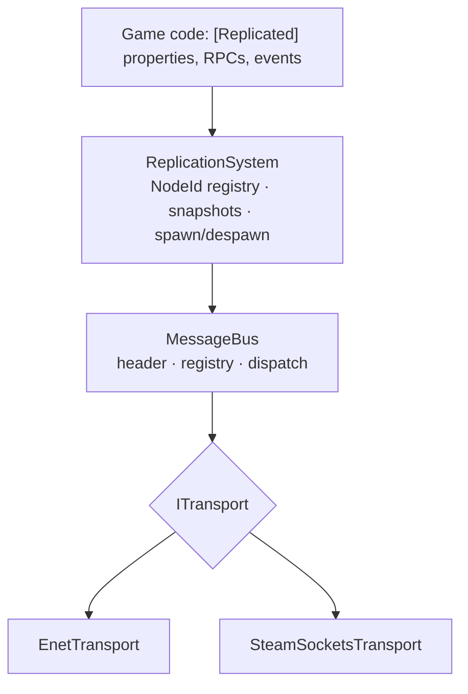
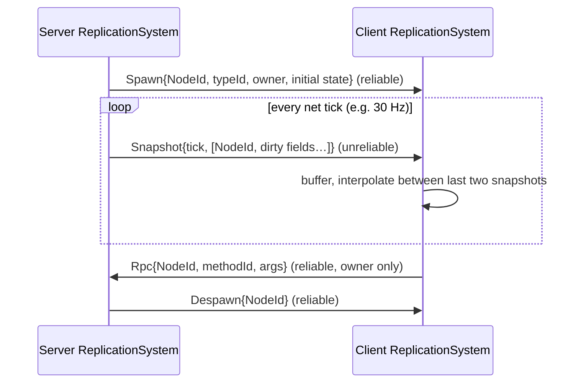

# Proposal: Networking & Replication

**Milestone:** M5 · **Status:** ⬜ planned · **Depends on:** [Scene graph v2](scene-graph-v2.md) (NodeId registry)

## Problem

The ENet layer can connect and send raw bytes, but:

- There is no message framing or dispatch, and `Read` is a hard-coded test print.
- Nothing replicates node state.
- Peers leak on disconnect.
- Public APIs are `internal`.
- ENet doesn't load on Apple Silicon.

See [Networking](../networking.md).

## Goals

- A typed **message protocol** with a header, registry and handlers.
- **Connection lifecycle events** exposed to games (`PeerConnected`, `PeerDisconnected`, `MessageReceived`).
- **Node replication:** spawn/despawn, owner/authority, and property snapshots over unreliable channels,
  with RPCs over reliable channels.
- A **transport abstraction**, so ENet and Steam Networking Sockets can be swapped.
- ENet running on osx-arm64.

## Non-goals (for now)

Client-side prediction, lag compensation, and interest management beyond "everything".

## Proposed design

### Layers

### Packet header

| Field | Type | Notes |
|---|---|---|
| `protocolVersion` | byte | reject on mismatch at connect |
| `messageId` | ushort | `MessageRegistry` assigns ids from a type list |
| `tick` | uint | server tick for snapshots |
| payload | bytes | `INetworkTransferable.NetworkWrite` |

### Channels

| Channel | Flags | Use |
|---|---|---|
| 0 | `Reliable` | spawn/despawn, RPCs, control |
| 1 | `None` (unreliable sequenced) | state snapshots |

### Replication flow

### Fixes folded in

- Remove peers on Disconnect and Timeout, and use `TryAdd` or replace on connect.
- Make the public construction APIs `public`. Log through `Log`.
- Reference-count `ENet.Library` initialization.
- Make `NetBufferPool` thread-safe or document it as main-thread-only. Fix the double `MemoryStream`
  and add a double-return guard.

### osx-arm64

Build ENet from source as a universal dylib (`lipo` x86_64 + arm64) and place it in
`runtimes/osx-arm64/native`. Alternatively, move to a maintained ENet package; that is a dependency
decision and must be discussed first.

## Task list

- [ ] `ITransport`; `EnetTransport` (fix the peer lifecycle)
- [ ] `MessageRegistry` + header + dispatch; delete the test `Read` handlers
- [ ] Public events on `NetworkNode`
- [ ] `NodeId → Node` registry (from Scene v2) + spawn/despawn
- [ ] Snapshot serialization (`[Replicated]` source generator or a manual `INetworkTransferable`)
- [ ] Client interpolation buffer
- [ ] RPCs
- [ ] osx-arm64 ENet native
- [ ] Sandbox: listen-server demo with two windows
- [ ] Fix the README networking example

## Open questions

- Should `[Replicated]` use a source generator (compile-time) or reflection (simpler)?
- Server-authoritative only, or allow client authority per node?

## Related

[Milestones](../../milestones.md) · [Networking](../networking.md) · [Steamworks integration](steamworks-integration.md)
