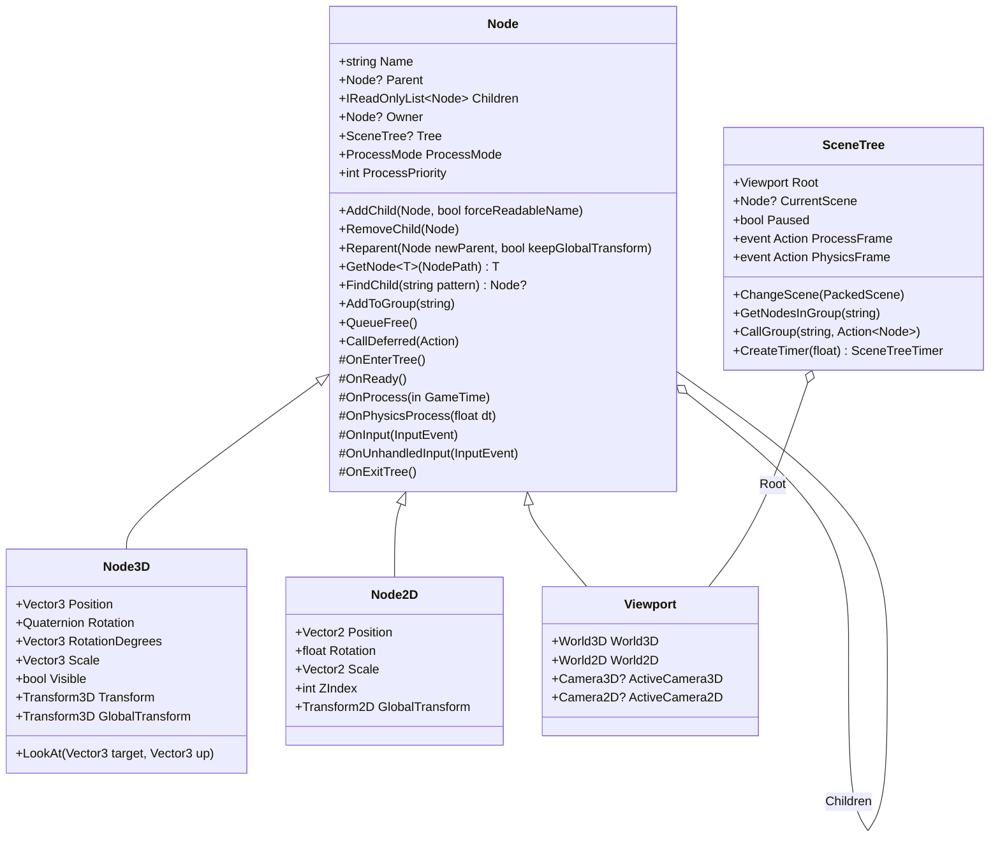
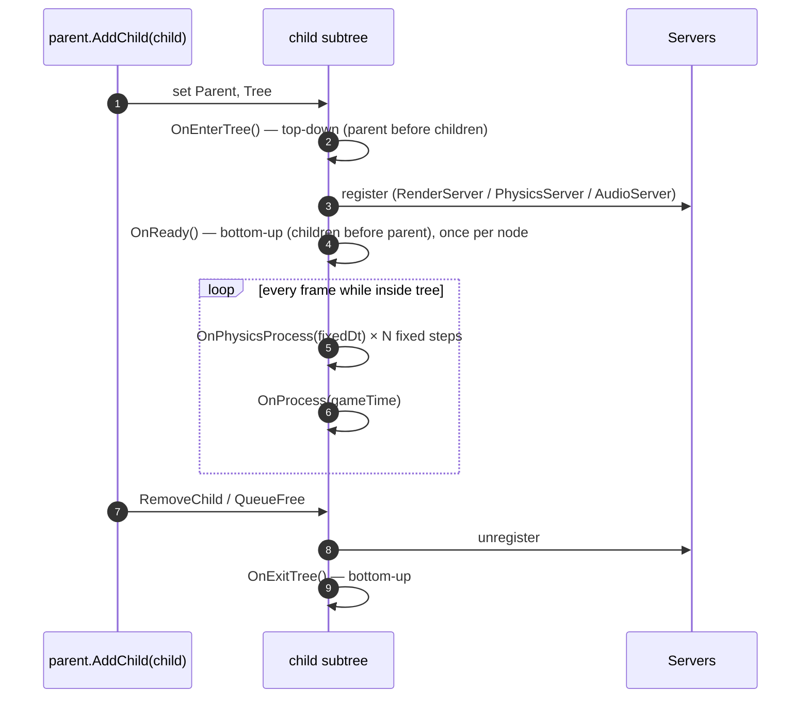
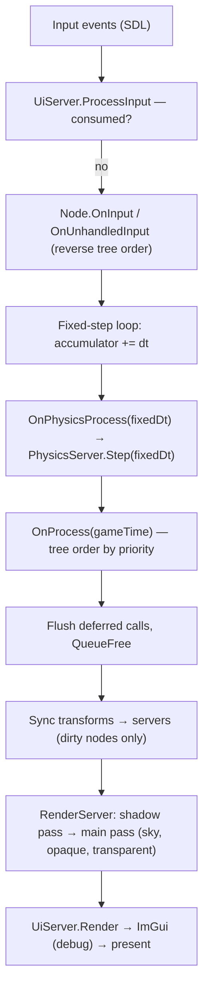

# Proposal: Node System (Godot-style Scene Tree)

**Milestone:** M2 · **Status:** ⬜ planned · **Touches:** `Node`, `Node3D`, `Engine`, every drawable,
lights, cameras, sky, Sandbox · **Companion doc:** [Scene serialization](scene-serialization.md)

## Problem

Today the "scene graph" is a flat `List<Node>` owned by the game:

- `AddChild` is inverted, and `Parent` has no effect.
- Lights, cameras, the sky and the grid are not nodes.
- Every game hand-writes its update, shadow and draw loops.
- `Node.Initialize` is a static service locator that must be called at exactly the right moment.

None of this can be saved, loaded or edited, which blocks the [editor](editor.md). See
[Scene graph & nodes](../scene-graph-and-nodes.md).

## Goals

- **Everything in a game is a node in a tree**, as in Godot. Behaviour comes from node *types*;
  scenes are reusable subtrees.
- Godot-like **lifecycle**: enter tree → ready → process / physics process → exit tree.
- **Signals**, **groups**, **node paths**, deferred calls and `QueueFree`.
- Engine-owned **`SceneTree`** that runs the frame. Games stop hand-writing loops.
- Nodes are thin front-ends to engine **servers** (rendering, physics, audio, UI). The node holds
  editable state; the server holds GPU, physics and audio objects.
- Every node property the editor needs is discoverable through `[Export]`, so scenes can be serialized
  ([Scene serialization](scene-serialization.md)) and edited ([Editor](editor.md)).

## Non-goals

- ECS or data-oriented storage. The tree is object-oriented, as in Godot. A later optimization can
  batch servers internally without changing the node API.
- A scripting language. Behaviour is C# subclasses of node types.

## Concepts (Godot mapping)

| Godot | Mainframe | Notes |
|---|---|---|
| `Node` | `Node` | name, parent, children, owner, groups, process mode |
| `SceneTree` | `SceneTree` | owns root, runs the frame, pause, groups, deferred queue |
| `Viewport` / `Window` root | `SceneTree.Root` (`Viewport`) | the root holds a `World3D` and a `World2D` |
| `_EnterTree` / `_Ready` / `_Process` / `_PhysicsProcess` / `_ExitTree` | `OnEnterTree` / `OnReady` / `OnProcess` / `OnPhysicsProcess` / `OnExitTree` | the `On*` prefix matches the existing engine style |
| `_Input` / `_UnhandledInput` | `OnInput` / `OnUnhandledInput` | UI consumes events first (see [Game UI](game-ui.md#input-routing)) |
| signals | `[Signal]` C# events + serializable connections | |
| `NodePath`, `GetNode<T>()` | `NodePath`, `GetNode<T>()` | relative (`"../Player/Camera"`) or absolute (`"/root/Main"`) |
| groups | `AddToGroup`, `SceneTree.GetNodesInGroup`, `CallGroup` | |
| `QueueFree`, `CallDeferred` | same | flushed at a defined point in the frame |
| `PackedScene` | `PackedScene` | see [Scene serialization](scene-serialization.md) |
| `Resource` | `Resource` | shared, ref-counted data: meshes, materials, shapes, audio streams |
| `@tool` | `[Tool]` | the node's code runs in the editor |
| `RenderingServer`, `PhysicsServer3D`, `AudioServer` | `RenderServer`, `PhysicsServer3D/2D`, `AudioServer`, `UiServer` | engine-internal |

## Class model



`Transform3D` is a new struct (basis + origin, with `ToMatrix4x4()`). Rotation is stored as a
**quaternion**, and Euler degrees are a convenience property, as in Godot.

### Node catalog

Every existing feature maps onto a node type. Planned types (★ = exists today in some form):

| Area | Node types |
|---|---|
| Core | `Node`, `Node2D`, `Node3D` ★, `Timer`, `Viewport` |
| 3D rendering | `MeshInstance3D` (replaces ★`Box3d`/★`Quad` with `BoxMesh`/`QuadMesh` resources), `SpineSprite3D` (★`SpineNode`), `WorldEnvironment` (★sky + ambient), `Camera3D` ★ |
| Lights | `DirectionalLight3D` ★, `OmniLight3D` (★point), `SpotLight3D` ★ |
| 2D | `Camera2D` ★, `Sprite2D`, `SpineSprite2D` |
| Physics 3D | `StaticBody3D`, `RigidBody3D`, `CharacterBody3D`, `Area3D`, `CollisionShape3D` (see [Physics](physics.md)) |
| Physics 2D | `StaticBody2D`, `RigidBody2D`, `CharacterBody2D`, `Area2D`, `CollisionShape2D` |
| Audio | `AudioPlayer`, `AudioPlayer2D`, `AudioPlayer3D`, `AudioListener3D` (see [Audio](audio.md)) |
| UI | `UiLayer`, `UiDocument` (see [Game UI](game-ui.md)) |
| Networking | `NetworkNode` ★, later `MultiplayerSpawner`, `MultiplayerSynchronizer` (see [Networking](networking-replication.md)) |
| Editor-only | `SceneGrid3D` ★, gizmo nodes (never saved) |

## Lifecycle



- `OnReady` runs once, after the node's children are ready. It is the place for `GetNode<T>()`
  lookups.
- `QueueFree` and `CallDeferred` callbacks run at the end of the frame, after process. They are never
  run in the middle of a traversal.
- `ProcessMode`: `Inherit`, `Pausable`, `WhenPaused`, `Always` or `Disabled`. `SceneTree.Paused`
  stops pausable nodes and freezes physics.
- `ProcessPriority` orders process calls (lower runs first); within a priority, nodes run in tree
  order.

## Frame order (engine-owned)



`Engine` keeps its four abstract hooks during the migration. A game can run without a `SceneTree`
(today's behaviour), or set `SceneTree.ChangeScene(...)` and let the engine drive everything. Once
the Sandbox is ported, the hooks become optional virtuals.

## Servers

Nodes hold no Vulkan, physics or audio handles directly. On `OnEnterTree` they register with the
server for their world, and on transform or property change they push updates:

| Server | Node front-ends | Owns |
|---|---|---|
| `RenderServer` | `MeshInstance3D`, `SpineSprite3D`, lights, `WorldEnvironment`, cameras | pipelines, buffers, `ShadowSystem`, draw lists (opaque/transparent buckets) |
| `PhysicsServer3D` / `PhysicsServer2D` | bodies, areas, shapes | Jitter2 `World` / Box2D `World` |
| `AudioServer` | audio players, listener | SoundFlow engine, mixer, buses |
| `UiServer` | `UiLayer`, `UiDocument` | RmlUi contexts and the render interface |

This removes the static `Node.Initialize`: servers are reached through `Tree.Root.World3D`. It also
enables multiple worlds, which the [editor viewport](editor.md#viewport) needs to render an edited
scene separately from the game.

## Transforms

- Local TRS with a dirty flag. `GlobalTransform` is computed lazily as `parent.Global × local`.
- Setting a transform marks the subtree dirty and enqueues the node for server sync (step H above).
- `Reparent(newParent, keepGlobalTransform: true)` recomputes the local transform.

## Signals

```csharp
public partial class Area3D : CollisionObject3D
{
    [Signal] public event Action<Node3D>? BodyEntered;
}

// code connection
area.BodyEntered += OnBodyEntered;

// editor connection (serialized): source path, signal name, target path, method name
// connected by reflection after the scene is instantiated; method must be [SignalHandler] or public
```

- Signals are plain C# events, so code-side use is idiomatic.
- `[Signal]` makes the event discoverable to the editor's Signals panel. Connections made in the
  editor are stored in the scene file and bound at instantiation.
- Built-in signals: `TreeEntered`, `Ready`, `TreeExiting`, `Renamed`, `ChildEnteredTree`, plus
  type-specific ones (`Timer.Timeout`, `Area3D.BodyEntered`, `AudioPlayer.Finished`, …).

## Identity

- `NodeId` stays (runtime-unique `uint`) and moves into the `MainframeEngine` namespace.
  `SceneTree.Find(NodeId)` is backed by a dictionary maintained on enter/exit. This is what
  [networking replication](networking-replication.md) needs.
- Names are unique among siblings. When a name collides, `AddChild` appends a number, as Godot does.
- Scene files reference nodes by **path relative to the scene root**, never by `NodeId`.

## Porting the existing code

| Today | After |
|---|---|
| `List<Node>` in `Game` + manual loops | `SceneTree.ChangeScene(mainScene)` |
| `Node.Initialize(renderer, shadows)` | removed; nodes use `Tree.Root.World3D` servers |
| `Box3d` / `Quad` (own pipeline each) | `MeshInstance3D` + shared mesh/material ([Materials & meshes](materials-and-meshes.md)) |
| `SpineNode` | `SpineSprite3D` (same renderer, registered with `RenderServer`) |
| `LightEnvironment.AddLight` | light nodes register with `RenderServer` |
| `SkyEnvironment` | `WorldEnvironment` node holding a `Sky` resource |
| `Camera3D` (plain class) | `Camera3D : Node3D` with `Current` flag |
| `Node.Draw / DrawShadow*` | internal to `RenderServer` |

## Task list

- [ ] `Node` tree: children list, owner, unique names, `Reparent`, `NodePath`, `GetNode<T>`, `FindChild`
- [ ] `SceneTree` + `Viewport` root; lifecycle ordering; `ProcessMode`/priority; pause
- [ ] Deferred call queue + `QueueFree`
- [ ] Groups
- [ ] `[Signal]` events + serializable connections
- [ ] `Transform3D`/`Transform2D`; `Node3D`/`Node2D` with dirty propagation and quaternions
- [ ] `RenderServer` extracted from current drawables; lights, camera and sky as nodes
- [ ] `InputEvent` types (key, mouse button, motion, wheel, gamepad, text) and routing
- [ ] Engine-owned frame order; keep the old hooks working during migration
- [ ] Port the Sandbox to a scene built in code, then loaded from a scene file once [serialization](scene-serialization.md) lands
- [ ] Update the current-state docs and CLAUDE.md

## Open questions

- Should `SceneTree` support multiple simultaneous scenes (additive loading) in v1, or only `ChangeScene`?
- Do we mirror Godot names exactly (`OmniLight3D`) or keep engine names (`PointLight3D`)? Default:
  Godot names, for familiarity.

## Related

[Milestones](../../milestones.md) · [Scene serialization](scene-serialization.md) · [Editor](editor.md) ·
[Scene graph & nodes (current)](../scene-graph-and-nodes.md) · [Materials & meshes](materials-and-meshes.md)
