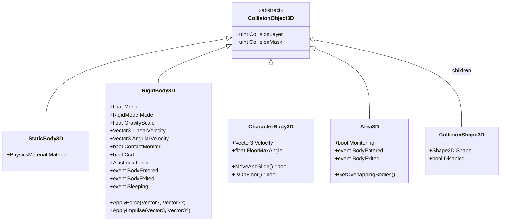
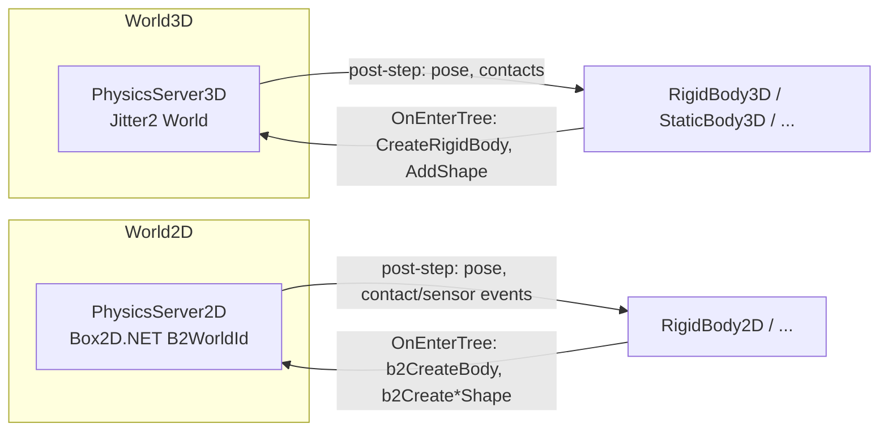
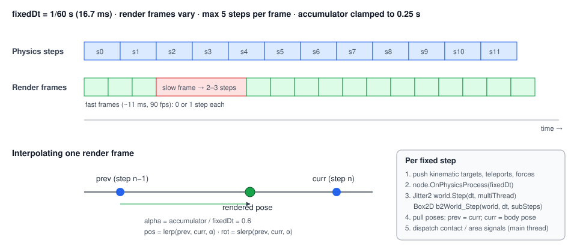

# Proposal: Physics (Jitter2 3D · Box2D 2D)

**Milestone:** M6 · **Status:** ⬜ planned · **Decision:** Jitter2 for 3D; Box2D for 2D, because
Jitter2 is 3D-only (agreed 2026-10-05) · **Depends on:** [Node system](../scene-graph-and-nodes.md)

## Libraries

| | 3D | 2D |
|---|---|---|
| Package | [`Jitter2`](https://www.nuget.org/packages/Jitter2) **2.9.0** (pin exactly; the API changes between minors) | [`Box2D.NET`](https://www.nuget.org/packages/Box2D.NET) **3.1.654** (ikpil's port of Box2D v3) |
| Repo | [notgiven688/jitterphysics2](https://github.com/notgiven688/jitterphysics2) | [ikpil/Box2D.NET](https://github.com/ikpil/Box2D.NET) |
| License | MIT | MIT |
| Native code | none: pure C#, net8/9/10 | none: pure C#, netstandard2.1 / net8–10 |
| Precision | `float` (a `Jitter2.Double` package also exists) | `float` |
| 2D support | **none** (3D only; 2.9 can lock axes for 2.5D) | native 2D |

**Why Box2D.NET and not `box2d-netstandard`:** the latter is a partial 2.4 port, last released in
2022 (2.4.7-alpha), with README-acknowledged bugs (it needs optimizations on, and bodies spawned at
the same position break its tree). Box2D.NET tracks Box2D v3 and is actively maintained. Its NuGet
package lags the repo by a few months, so pin the version and update deliberately.

Neither library needs native binaries, so all platforms including osx-arm64 are covered.

## Goals

- Godot-style physics nodes: static, rigid, character and area bodies plus collision-shape children,
  in both 3D and 2D.
- A fixed-timestep simulation decoupled from the frame rate, with interpolated rendering.
- Collision layers and masks, contact and area signals, raycasts and shape casts.
- Debug drawing in game and editor. Physics is paused in the editor's edit mode.
- Server-authoritative physics for [multiplayer](../networking.md#replication).

## Non-goals (v1)

Soft bodies (Jitter2 has them), vehicles, ragdoll tooling, cross-platform determinism for lockstep
(Jitter2 has `SolveMode.Deterministic`, but this is left as an open question).

## Node model



The 2D side mirrors this (`StaticBody2D`, `RigidBody2D`, `CharacterBody2D`, `Area2D`,
`CollisionShape2D`). All bodies derive from `Node3D`/`Node2D`. Shapes are **`Resource`s**, so they
are shareable and serialized ([Scene serialization](../scene-serialization.md)).

### Shape resources → library shapes

| Resource (3D) | Jitter2 | Resource (2D) | Box2D.NET |
|---|---|---|---|
| `BoxShape3D(Size)` | `BoxShape(size)` (full extents) | `RectangleShape2D(Size)` | `b2MakeBox(hx, hy)` → `b2CreatePolygonShape` |
| `SphereShape3D(Radius)` | `SphereShape(r)` | `CircleShape2D(Radius)` | `b2CreateCircleShape` |
| `CapsuleShape3D(Radius, Height)` | `CapsuleShape(r, height − 2r)` (length is the cylinder part; Y axis) | `CapsuleShape2D` | `b2CreateCapsuleShape` |
| `CylinderShape3D(Radius, Height)` | `CylinderShape(height, radius)` (note the argument order) | — | — |
| `ConvexPolygonShape3D(Points)` | `PointCloudShape(points)` / `ConvexHullShape` | `ConvexPolygonShape2D` | `b2MakePolygon` (≤ 8 verts) |
| `ConcavePolygonShape3D(Faces)` (static only) | `TriangleMesh` + one `TriangleShape` per triangle | `SegmentShape2D` / chain | `b2CreateSegmentShape` / `b2CreateChain` |

A `CollisionShape3D`'s local transform becomes a `TransformedShape(shape, translation, rotation)` on
the parent body. Several shape children add several shapes to one Jitter2 body (Jitter2 has no
separate compound type). After shapes change, the body calls `SetMassInertia(mass)`.

## Servers



- `PhysicsServer3D` owns one Jitter2 `World` per `World3D`. Settings come from project settings:
  - gravity;
  - `SubstepCount`;
  - `SolverIterations` (default 6, 4);
  - `AllowDeactivation`.
- `PhysicsServer2D` owns one Box2D world per `World2D`, created with `b2CreateWorld(b2DefaultWorldDef())`
  with gravity and sub-step count from project settings.
- **Body type mapping:**

  | Node | Jitter2 | Box2D |
  |---|---|---|
  | `StaticBody` | `MotionType.Static` | `b2_staticBody` |
  | `RigidBody` (Kinematic mode) | `MotionType.Kinematic` | `b2_kinematicBody` |
  | `RigidBody` (Dynamic mode) | `MotionType.Dynamic` | `b2_dynamicBody` |
  | `CharacterBody` | kinematic, moved by the engine | kinematic |

- **Units:** 3D uses metres. Box2D is tuned for objects of 0.1–10 m, so 2D uses a project setting
  `Physics2D.PixelsPerMeter` (default 100). Nodes work in pixels, and the server converts at the
  boundary.

## Fixed timestep and interpolation



```
accumulator += frameDt                       (clamped to MaxFrameDt = 0.25 s)
while accumulator >= fixedDt and steps < MaxSubstepsPerFrame (default 5):
    push: kinematic targets, teleports, forces queued by nodes
    node.OnPhysicsProcess(fixedDt)           (tree order)
    world3D.Step(fixedDt, multiThread: true) / b2World_Step(world2D, fixedDt, subSteps)
    pull: dynamic body poses → node.prev = node.curr; node.curr = pose
    dispatch contact / area signals
    accumulator -= fixedDt
alpha = accumulator / fixedDt
render transform = lerp(prev, curr, alpha), slerp for rotation
```

- `fixedDt` defaults to 1/60 s. Jitter2 recommends a fixed dt ≤ 1/60, and its `Damping` is applied
  per step, so a fixed rate keeps behaviour consistent.
- Pulled poses are written to an internal "physics transform" and do not trigger the node's dirty
  push back to the server.
- `RigidBody3D.Teleport(transform)` is explicit and resets interpolation.

## Collision layers and masks

- `CollisionLayer`/`CollisionMask` are 32-bit, Godot semantics: A and B collide if
  `(A.layer & B.mask) != 0 || (B.layer & A.mask) != 0`.
- **Box2D:** native. `B2ShapeDef.filter.categoryBits = layer`, `maskBits = mask` (both ulong).
- **Jitter2:** there are no built-in layers. Implement them in an `IBroadPhaseFilter` that reads the layer
  and mask from the shape's `RigidBody.Tag`.
  - The filter runs on **worker threads**, so it must be read-only and allocation-free.
  - The default `NarrowPhaseFilter` (`TriangleEdgeCollisionFilter`) is kept, and any custom narrow-phase
    filter chains to it.

## Contacts, areas and signals

| Event | 3D (Jitter2) | 2D (Box2D.NET) |
|---|---|---|
| Rigid body contact begin/end (`ContactMonitor = true`) | `RigidBody.BeginCollide` / `EndCollide(Arbiter)` on the main thread. Note: they also fire for speculative contacts, so filter by penetration or `Contact` impulse if needed. | poll `b2World_GetContactEvents` after the step (`beginEvents`, `endEvents`, `hitEvents`) |
| Area overlap | Area bodies are kinematic. A narrow-phase filter returns `false` (no response) for pairs involving an area and records the pair in a thread-safe per-step set; after the step, diff it with the previous set → `BodyEntered`/`BodyExited`. | `isSensor = true` shapes; `b2World_GetSensorEvents` |
| Raycast | `world.DynamicTree.RayCast(origin, dir, pre, post, out proxy, out normal, out lambda)` | `b2World_CastRayClosest(world, origin, translation, filter)` |
| Shape cast | `DynamicTree.SweepCastSphere/Box/Capsule/...` | `b2World_CastShape` |

All signals are queued during the step and dispatched on the main thread after it, so user code never
runs inside the solver.

### Query API

```csharp
var space = GetWorld3D().DirectSpaceState;
if (space.RayCast(from, to, out RayHit3D hit, collisionMask: Layers.World))
    Log.Info($"hit {hit.Collider.Name} at {hit.Position}, n={hit.Normal}");
// also: ShapeCast, OverlapSphere/Box, PointQuery — same API in 2D via DirectSpaceState2D
```

## `CharacterBody` (`MoveAndSlide`)

Implemented in the engine, because neither library ships a character controller:

1. Sweep the body's shape along `Velocity · dt` with a shape cast.
2. On a hit, move to the contact (minus a skin width), project the remaining motion onto the
   collision plane, and repeat up to 4 slides.
3. Classify the contact normal as floor, wall or ceiling using `FloorMaxAngle`. `IsOnFloor()`,
   `GetFloorNormal()` and step-snap come later.

## Threading

- Steps run on the main thread inside the fixed-step loop.
  - Jitter2 uses its process-wide thread pool when `multiThread: true`.
  - Box2D runs single-threaded in v1. Its task callbacks (`workerCount`, `enqueueTask`) are optional
    later.
- Bodies must not be created or modified from other threads.
- Several worlds (for example an editor viewport plus the game) step one at a time.

## Debug drawing

- 3D: Jitter2 `IDebugDrawer` (`DrawSegment`, `DrawTriangle`, `DrawPoint`) → engine `DebugLines`
  batch → a line-list pipeline, shared with the editor gizmos.
- 2D: Box2D `B2DebugDraw` delegates → the same `DebugLines` batch.
- Toggles: `Project → Debug → Visible Collision Shapes`, contacts and AABBs. The editor always shows
  shapes of the selection.

## Editor integration

- Physics worlds exist in edit mode (for gizmos and picking) but never step.
- Shape gizmos have handles to resize boxes, spheres and capsules. Each edit is an undoable `SetProperty`.
- A "Create collision from mesh" action builds a convex or concave shape from a `MeshInstance3D`.

## Networking

The server simulates. Clients receive body transforms through `MultiplayerSynchronizer` snapshots and
interpolate them. Client-side prediction for `CharacterBody` is a later concern. See
[Networking](../networking.md#replication).

## Task list

- [ ] Add `Jitter2` 2.9.0 and `Box2D.NET` 3.1.654 (pinned) to `MainframeEngine.csproj`
- [ ] Shape resources (3D + 2D) and conversion to library shapes
- [ ] `PhysicsServer3D` (Jitter2) and `PhysicsServer2D` (Box2D) per world; project settings
- [ ] Body nodes + `CollisionShape*` children; mass/inertia; axis locks (Jitter2 `MotionAxes`)
- [ ] Fixed-step loop, `OnPhysicsProcess`, interpolation, teleport
- [ ] Layers/masks (Jitter2 broad-phase filter, Box2D filter bits)
- [ ] Contact signals, areas, sensor events
- [ ] `DirectSpaceState3D/2D`: raycast, shape cast, overlap
- [ ] `CharacterBody3D/2D.MoveAndSlide`
- [ ] Debug draw + project toggles
- [ ] Sandbox: drop crates onto the floor; a character walking on a ramp; a 2D test scene
- [ ] Editor shape gizmos (with [Editor](editor.md) E3)

## Risks

| Risk | Mitigation |
|---|---|
| Jitter2 API churn (breaking changes in 2.8.6 and 2.9.0) | pin the exact version; keep all Jitter2 calls inside `PhysicsServer3D` |
| Box2D.NET NuGet lags its repo | pin; read the docs for the pinned version, not repo HEAD |
| Jitter2 filters run concurrently | filters are pure functions over immutable per-body data |
| Speculative `BeginCollide` | expose a `RequireTouch` option that checks penetration |
| Two engines with different APIs | the node and query API is identical across 2D and 3D; differences stay inside the servers |

## Open questions

- Do we offer Jitter2's deterministic solve mode for lockstep games?
- Double-precision builds (`Jitter2.Double`) for large worlds?

## Related

[Milestones](../../milestones.md) · [Node system](../scene-graph-and-nodes.md) · [Scene serialization](../scene-serialization.md) ·
[Editor](editor.md) · [Networking](../networking.md)
