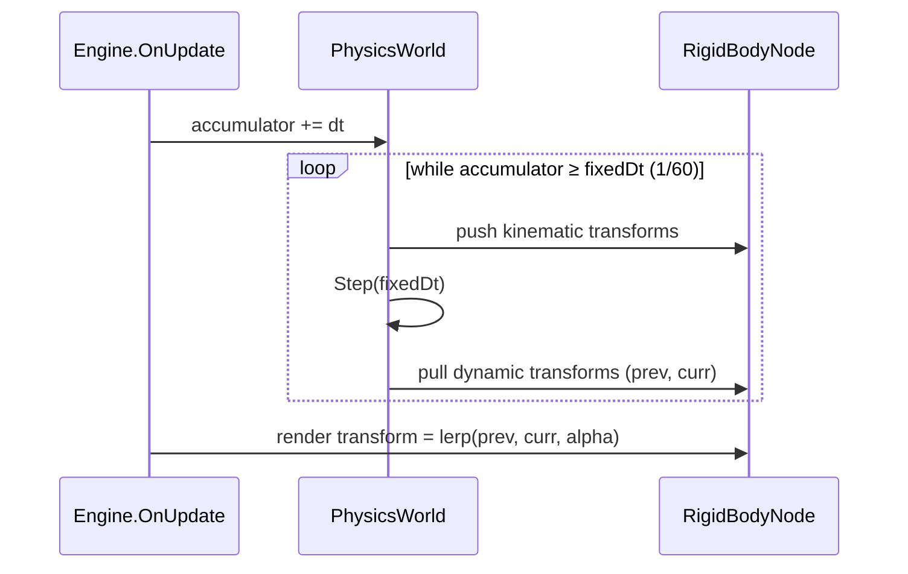

# Proposal: Physics

**Milestone:** M6 · **Status:** ⬜ planned · **Needs:** dependency decision

## Problem

There is no collision or physics. The README lists Jolt, Jitter2 and Box2D as candidates.

## Goals

- 3D rigid bodies (static, kinematic, dynamic) with box, sphere, capsule and mesh colliders.
- Optional 2D physics for Spine/2D games.
- Fixed-timestep simulation decoupled from the render rate, with interpolated transforms.
- Raycasts and overlap queries. Debug draw of colliders.

## Dependency decision (to discuss)

| Option | Dim | Notes |
|---|---|---|
| Jolt (JoltPhysicsSharp) | 3D | Fast and modern; native libs (check osx-arm64) |
| Jitter2 | 3D | Pure C#, no natives, simpler |
| Box2D (binding) | 2D | De-facto 2D standard |

Record the decision as an ADR in `memory/decisions/` before adding packages.

## Proposed design

- `PhysicsWorld` is owned by the `Scene` (see [Scene graph v2](scene-graph-v2.md)).
- `RigidBodyNode : Node3D` holds a body handle and a `Collider` description.
- Debug draw is a line-list pipeline (reuse the `SceneGrid` pipeline style) behind an ImGui toggle.
- Networking: replicate transforms only. Physics runs server-side.

## Task list

- [ ] Choose the library (ADR)
- [ ] Fixed-step loop + interpolation
- [ ] `RigidBodyNode`, `Collider` types
- [ ] Raycast / overlap API
- [ ] Collider debug draw
- [ ] Sandbox: drop boxes onto the floor quad

## Related

[Milestones](../../milestones.md) · [Scene graph v2](scene-graph-v2.md) · [Networking & replication](networking-replication.md)
