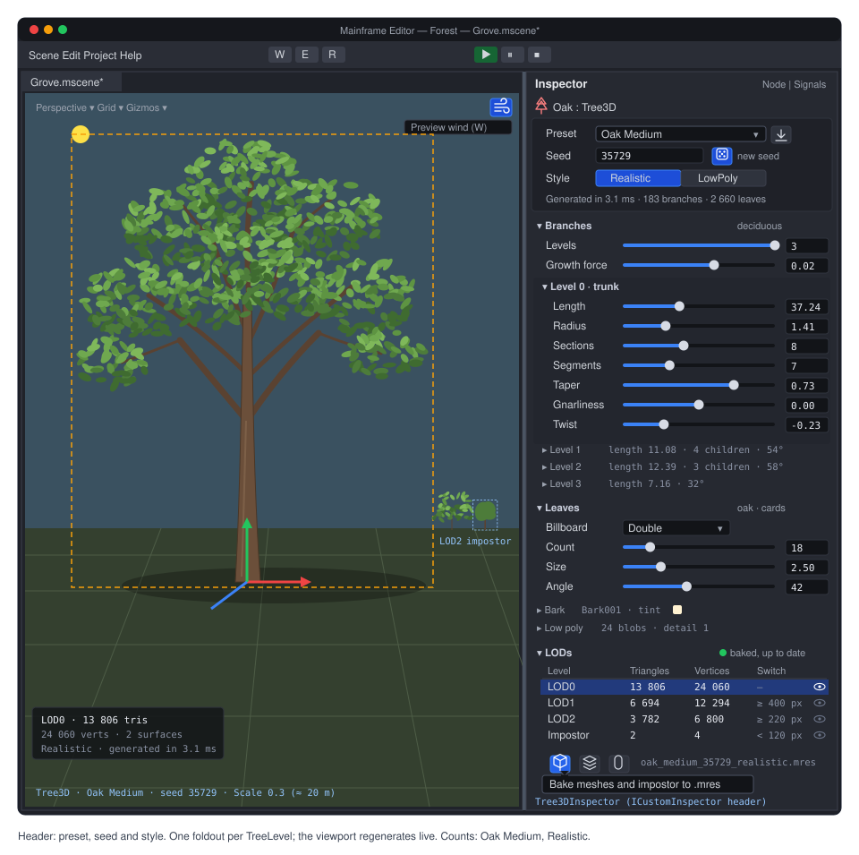
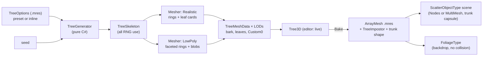

# Proposal: Procedural trees (an Ez Tree port: Tree3D, presets, wind, impostors)

**Milestone:** [Gameplay toolkit](../../milestones.md#gameplay-toolkit-) (G8b) · **Status:** ⬜ planned ·
**Depends on:** [M3 materials & meshes](../materials-and-meshes.md), [M4 shadows](../shadow-system.md) (cutout
casters), [M10 editor](../editor.md) (custom inspectors); later phases on [Rendering features](rendering-features.md)
(G6.1 PBR for bark, G6.4 LOD for impostors) and [Terrain](terrain.md) (G8a: the `Custom0` vertex stream, scatter,
`MultiMesh`) · **Related:** [Water](water.md) (G8c reads the same wind), [Forest showcase](forest-showcase.md) (G8d, the
main user), [Shaders](../shaders.md) (Slang, [ADR 0144](../../../memory/decisions/0144-slang-shader-language.md)),
[ADR 0149](../../../memory/decisions/0149-terrain-trees-water-engine-features.md)



## Problem

The engine cannot make a tree. A game that wants a forest has to model trees in a DCC tool, import them as glTF and
place every one as a node. Several parts are missing:

- **No generator.** Nothing in `MainframeEngine/Src` builds branching geometry. `ArrayMesh` and `MeshSurface`
  (`MainframeEngine/Src/Rendering/Resources/Mesh.cs:83`, `:192`) can hold procedural geometry, but nobody fills them
  with trees.
- **No foliage material.** `StandardMaterial3D` has alpha cutout and double-sided lighting
  (`MainframeEngine/Src/Rendering/Resources/Material.cs:9-19`, `:251-310`), but every vertex stays where the mesh put
  it. The 3D renderer draws only built-in materials: `MeshRenderer` picks `MeshLit` or `MeshOutline`
  (`MainframeEngine/Src/Rendering/Meshes/MeshRenderer.cs:418-419`, `ShaderSetId` in
  `MainframeEngine/Src/Rendering/Meshes/PipelineStateCache.cs:6`). There is no 3D shader material in which to write a
  wind shader, and no shared wind value.
- **No per-vertex data beyond position, normal and UV.** `MeshVertex` is a fixed 32 bytes
  (`MainframeEngine/Src/Rendering/Meshes/MeshVertex.cs:12-21`). Wind needs a weight and a phase per vertex. G8a adds an
  optional second stream (`MeshSurface.Colors`, `MeshSurface.Custom0`), which this proposal fills.
- **Lighting is Blinn-Phong only** (ADR 0014). Leaves get no light through them, and `DoubleSided` flips the normal on
  back faces (`Material.cs:301-304`), which turns a leaf card's rounded canopy normals inside out.
- **No LOD and no impostors.** G6.4 plans mesh LODs. Impostors are one of its non-goals and are picked up here.
- **Shadows cut out, but do not move.** Cutout casters exist (ADR 0074, `ShadowSystem.GetInstancedCasterPipeline`,
  `MainframeEngine/Src/Rendering/Shadows/ShadowSystem.cs:1215`), but their vertex shaders read only the position and
  UV, so a swaying leaf would cast a still shadow.

[Ez Tree](https://github.com/dgreenheck/ez-tree) (MIT, © 2024 Daniel Greenheck) solves the generation part well. It is
a small three.js library: `src/lib/tree.js` (1203 lines), `options.js`, a 22-line seeded RNG, 16 preset JSON files and a
leaf wind shader. It has a seed-stable skeleton, LODs meshed from one skeleton, and a browser app in which artists tune
presets and save them as JSON. This proposal ports it to C# and adds what a game engine needs around it.

## Goals

- **`TreeGenerator`**: a faithful C# port of Ez Tree's generator. It is pure C# (no engine types; System.Numerics for its output),
  bit-exact in its RNG, and matches Ez Tree's vertex and index counts exactly and its positions within 1e-4 for every
  preset.
- **`TreeOptions`** (resource) mirroring Ez Tree's option groups, and the **15 tree and bush presets** as `.mres`.
  Ez Tree JSON saved from its web app imports directly.
- **`Tree3D`** (`[Tool]` node): preset, seed and style, live regeneration in the editor, and **Bake** to `.mres` so
  shipped games do not run the generator at load.
- **Two styles.** `TreeStyle.Realistic`: PBR bark and alpha-cut leaf cards. `TreeStyle.LowPoly`: flat-shaded palette
  bark and blob canopies. **LowPoly runs on today's Blinn-Phong `StandardMaterial3D`**, so it can ship before G6.
- **`FoliageMaterial3D`**: a built-in material with a Slang shader. It sways with the wind (Ez Tree's model), cuts out,
  lights both sides and lets light through, and casts shadows that sway the same way. Grass (G8a) uses it too.
- **Shared wind** on `WorldEnvironment` (`WindDirection`, `WindStrength`, `WindFrequency`, `WindTurbulence`).
- **`TreeImpostor`**: octahedral impostors baked in the editor, chained after the mesh LODs.
- Trees **scatter** as G8a `ScatterObjectType` scenes (as nodes near the player or as `MultiMesh` forests, each with a
  trunk capsule), drawn as impostors far away.
- Per-frame cost on the CPU is zero: wind runs in the shaders and baked trees allocate nothing per frame.

## Non-goals

- Other generators (space colonisation, L-systems, SpeedTree import). The `TreeGenerator` seam allows them later.
- Physically simulated branches (bending under contact, breaking, falling trees). Wind is a vertex-shader effect.
- Growth animation or seasons (leaf colour over time, bare winter trees). A game can swap materials itself.
- Interaction with the wind (characters pushing foliage, wind zones). One global wind per world in G8b.
- Ez Tree's web UI, GLB export and PNG export. The editor inspector replaces the UI, and Bake replaces export.
- Ez Tree's trellis geometry (see [open question 3](#open-questions)).
- A generic mesh simplifier. LowPoly blobs are built simplified rather than decimated afterwards.

## Design



### Code layout

| Where | What |
|---|---|
| `MainframeEngine/Src/Trees/Generation/` | `TreeGenerator`, `TreeParams`, `EzRng`, `ThreeMath` (double-precision `Vec3d`, `Quatd`, `EulerXyz` matching three.js), `TreeSkeleton`, `BarkMesher`, `LeafCardMesher`, `LeafBlobMesher`, `TreeMeshData` |
| `MainframeEngine/Src/Trees/` | `TreeOptions`, `TreeLevel`, `TreeStyle`, `Tree3D`, `TreePresets`, `TreeImpostor`, `EzTreeJson` (importer) |
| `MainframeEngine/Src/Rendering/Resources/` | `FoliageMaterial3D`, `ImpostorMaterial3D` (internal to `TreeImpostor`) |
| `MainframeEngine/Content/Shaders/` | `Foliage/Foliage.vk.{vert,frag}.slang`, `Impostor/Impostor.vk.{vert,frag}.slang`, `include/wind.slang`, `Shadows/Shadow{,Point}FoliageInstanced.vk.vert.slang` |
| `MainframeEngine/Content/Trees/Presets/` | 15 preset `.mres` files (about 2 KB each) |
| `MainframeEngine.Editor/Src/Trees/` | `Tree3DInspector`, `TreeImpostorBaker`, `TreeBaker`; bark and leaf textures in `MainframeEngine.Editor/Content/Trees/` |
| `build/ez-tree-reference.mjs` | parity fixture generator (by hand, not CI), like `build/zzfx-reference.mjs` |

The generator lives in the engine assembly but uses no engine types, so it can move to its own assembly (for a command
line tool or a server) without changes.

### `TreeGenerator`

```csharp
public sealed class TreeGenerator                       // reusable: keeps its scratch lists between calls
{
    public TreeSkeleton GrowSkeleton(TreeParams p, int seed);                   // all RNG use happens here
    public TreeMeshData Mesh(TreeSkeleton s, TreeParams p, in TreeMeshDetail d); // no RNG: run once per LOD
}

public readonly record struct TreeMeshDetail(           // Ez Tree's LODDetail, plus the style
    int SectionStride = 1, double SegmentFactor = 1, int LeafStride = 1, double LeafScale = 1,
    TreeBillboard? Billboard = null, TreeStyle Style = TreeStyle.Realistic, int BlobDetail = 1);

public sealed class TreeMeshData                        // plain arrays; Tree3D turns them into MeshSurfaces
{
    public TreeSurfaceData Bark, Leaves;                // Positions, Normals, UVs, Custom0, Indices (arrays)
    public double GeometricError;                       // for G6.4 MeshLod.Error (below)
}
```

#### Algorithm

The port follows `tree.js` at the pinned commit function by function. Names in brackets are Ez Tree's.

1. **Skeleton** (`#generateSkeleton`, `tree.js:247`). Seed the RNG and push the trunk: origin 0, orientation 0, level 0,
   `length[0]`, `radius[0]`, `sections[0]`, `segments[0]`. Pop branches from a **FIFO queue** (`branchQueue.shift()`)
   until it is empty. The queue order is the RNG order, so the port must use `Queue<T>`, not recursion.
2. **Branch sections** (`#growBranch`, `:319`). For `i = 0 … sectionCount`:
   - The radius tapers: `radius · (1 − taper[level] · i/n)` for deciduous trees, `radius · (1 − i/n)` for
     evergreens. The last section of the last level gets 0.001.
   - Record `(origin, orientation, radius)`, then step the origin by `length/n` along the section's +Y.
   - Perturb the orientation: `x += rng(g, −g)`, `z += rng(g, −g)`, with `g = max(1, 1/√radius) · gnarliness[level]`.
   - Apply the twist (`twist[level]` about +Y). Then rotate toward the growth force by
     `clamp(strength / radius, ±angle)` about `up × direction`. When the trellis is on, slerp toward the nearest
     trellis point.
3. **Terminal and child branches.**
   - A deciduous tree continues each branch from its last section, one level up, with the parent's section and segment
     counts. On the last level it records a leaf there instead.
   - Below the last level, `generateChildBranches` (`:468`) places `children[level]` children:
     - one `rng()` radial offset, then a Fisher-Yates shuffle of the angle slots (`shuffledIndices`, `:736`);
     - per child, a stratified start `start + (i + rng()) · (1 − start)/count` along the parent;
     - the origin and radius are lerped between the two sections around that point, and the orientation is slerped
       between them;
     - the child is turned by `angle[level]` about X and by a jittered slot angle about Y (one `rng(0.5, −0.5)`);
     - evergreens shorten children by `1 − start`.
4. **Leaves** (`generateLeaves`, `:563`). On the last level, `leaves.count` leaves are placed the same way, with
   `leaves.angle`. `#recordLeaf` (`:632`) draws the size variance, so meshing uses no RNG.
5. **Meshing** (`#meshSkeleton`, `:279`). This step uses no RNG, so it can run once per LOD on the same skeleton.
   - **Bark** (`#meshBranch`, `:752`) keeps every `sectionStride`-th ring plus the last. A ring has
     `max(3, round(segments · segmentFactor))` vertices plus a seam duplicate; U is `j/segments · wrapsX` with
     `wrapsX = max(1, round(baseRadius · textureScale.x))`, and V alternates 0/1 by ring. No end caps; triangles are
     `(v1, v3, v2), (v2, v3, v4)`.
   - **Leaves** (`#meshLeaf`, `:655`) keep every `leafStride`-th leaf, scaled by `leafScale`: a quad of side `size`
     with its base at the leaf origin, plus a second quad turned 90° about Y for `Double` billboards. Rounded normals
     are `normalize(n + v − origin)`.

The LOD levels are Ez Tree's `defaultLODLevels` (`tree.js:91`): LOD0 full detail; LOD1 `sectionStride 3`,
`segmentFactor 0.75`, `leafStride 2`, `leafScale 1.25`; LOD2 `sectionStride 6`, `segmentFactor 0.4`, `leafStride 2`,
`leafScale 1.3` and single billboards. Ez Tree switches them at 100 and 250 units from the camera; the engine uses
G6.4's screen-space error instead, so the mesher reports each level's `GeometricError`: for bark, the largest distance
between a dropped ring centre and its interpolation between kept rings, plus the radius lost to fewer segments; for
leaves, the mean spacing of the dropped leaves.

#### RNG: bit-exact

`rng.js` is a multiply-with-carry generator. It is not a textbook one: `& 0xffffffff` produces a **signed** int32 in
JavaScript, and `>> 16` is an arithmetic shift, so negative states shift in ones. The C# port keeps both:

```csharp
internal struct EzRng                                   // src/lib/rng.js, bit-exact
{
    private int _w, _z;                                 // signed, as JS keeps them after `& mask`
    public EzRng(int seed) { _w = unchecked(123456789 + seed); _z = unchecked(987654321 - seed); }

    public double Next(double max = 1, double min = 0)  // rng.random(max, min)
    {
        _z = unchecked((int)(36969L * (_z & 65535) + (_z >> 16)));
        _w = unchecked((int)(18000L * (_w & 65535) + (_w >> 16)));
        var result = unchecked((uint)((_z << 16) + (_w & 65535)));   // JS: `>>> 0`
        return (max - min) * (result / 4294967296.0) + min;
    }
}
```

This was checked against Node 22 while writing this proposal: seed 0 gives `0.732297654031, 0.058062777622,
0.821864804020`, seed 35729 (Oak Medium) gives `0.925737335347, 0.001972383121, 0.291409873404`, and a hash of one
million draws with seed 44166 matches. These vectors become the first unit test. Seeds are integers. Ez Tree's demo
forest uses fractional seeds
(`10000 * Math.random()`), which `& mask` truncates differently for `m_w` and `m_z`. The port does not support them,
and no preset uses one.

#### Float determinism

JavaScript numbers are doubles. Three.js `Vector3`, `Quaternion` and `Euler` compute in doubles, and only
`Float32Array` rounds to float at the end (`#buildBufferGeometry`).

- **Use double where JS does.** The skeleton and meshing run in `ThreeMath` doubles, and positions are cast to float only
  when written to `TreeMeshData`. `TreeOptions` stores every generator input as `double` (`Codecs.cs:194` has a
  `DoubleCodec`). Values like `69.60000000000001` (Aspen Large) then reach the generator unchanged; a float field would
  change them.
- **Copy the three.js formulas, not System.Numerics.** The pinned three.js is 0.167.1 (Ez Tree's `package-lock.json`).
  `ThreeMath` ports exactly what the generator calls:
  - `Quaternion.setFromEuler` (XYZ), `setFromAxisAngle`, `multiply`, `premultiply`, `slerp`, `setFromUnitVectors` and
    `rotateTowards`;
  - `Euler.setFromQuaternion` through the rotation matrix, including its `0.9999999` gimbal threshold;
  - `Vector3.applyQuaternion` (the r150+ form), `applyEuler` and `lerpVectors`.
  `System.Numerics.Quaternion` is float-only and composes in another order, so it is not used here.
- **`Math.round` is not `Math.Round`.** JavaScript rounds halves up and .NET rounds them to even. `round(6 · 0.75)` is 5
  in JavaScript and 4 in C#, which would change the LOD1 segment count. The port uses `Math.Floor(x + 0.5)` everywhere
  Ez Tree calls `Math.round`.
- **Transcendentals may differ by one ulp.** V8 uses its own fdlibm port, and .NET calls the platform C library. RNG
  draws, counts, indices and every branch decision are exact (they depend only on the RNG and `+ − × ÷`). Positions can
  differ in the last bits, which is far below float precision after the cast. The parity test compares positions
  within 1e-4 Ez Tree units. Within one platform, generation is bit-reproducible. Baked meshes are identical everywhere.
- **Quirks kept on purpose**, so seeds give the same trees as in Ez Tree:
  - `#growBranch` divides the section length by `levels − 1` when `type === 'Deciduous'` (`tree.js:325`). Presets
    say `"deciduous"` in lower case, so the divisor is always 1. The port has no divisor and says so in a comment.
  - The orientation between two sections is `qB.slerp(qA, alpha)` (`:511`, `:601`). It runs from B to A, the opposite
    of the origin lerp.
  - An evergreen's last ring has radius 0. The force step then divides by zero, but the orientation it produces is
    never used. .NET's `Math.Max`/`Math.Min` propagate NaN like JavaScript, so nothing breaks.

### Outputs and vertex data

`TreeMeshData` becomes one `ArrayMesh` with two surfaces, **bark** and **leaves**. Each LOD is a G6.4 `MeshLod` with
its own geometry. Before G6.4 lands, only LOD0 is used.

| Stream | Bark | Leaf cards (Realistic) | Leaf blobs (LowPoly) |
|---|---|---|---|
| Position, normal | ring vertices, smooth normals (Realistic) or split face normals (LowPoly) | quad corners; rounded or flat normals | split face normals |
| UV | `u = j/segments · wrapsX`; `v` Ez Tree's 0/1 ping-pong, or continuous by length (`BarkUvMode`) | `(u, 1 − v)`: the engine's UV origin is top-left (`Mesh.cs:114-116`) | `(0, 1 − h)`, where `h` is the height within the blob, for flutter |
| `Custom0.x` wind weight | 0 at the trunk base, rising along each branch to 1 at the twig tips (`level` and `i/n`) | the branch weight at the attachment point | the mean weight of the blob's leaves |
| `Custom0.y` branch level | `level / (levels + 1)` | 1 (marks foliage: flutter on) | 1 |
| `Custom0.z` phase | `hash(branch index)` in [0, 1) | the parent branch's phase | the blob's phase |
| `Custom0.w` AO | `0.6 + 0.4 · (height / tree height)` | depth into the canopy: distance to the canopy hull, 0.4 … 1 | per vertex, like leaves |

The hash-based phase and AO consume no RNG, so they do not disturb parity. `Custom0` comes from G8a's optional second
stream (Godot's `ARRAY_CUSTOM0`). Without that stream (before G8a ships it), the mesh simply has no wind data.

### `TreeOptions` and `TreeLevel`

Ez Tree keys its per-level values by level number: `branch.angle[1..3]`, `children[0..2]`, and `gnarliness`,
`length`, `radius`, `sections`, `segments`, `taper` and `twist` over `[0..3]`. **Decision: `TreeLevel` sub-resources,
not parallel arrays.**

- An artist edits one level at a time: its length, radius, sections and taper together. A level foldout in the
  inspector shows exactly one `TreeLevel`. With parallel arrays, one level's values would be spread over nine array
  editors.
- Nine parallel arrays can drift in length. Here the fixed four-entry array is checked in one place.
- A custom inspector can hide what does not apply at a level: `Angle` and `Start` at level 0, `Children` at level 3.
- The cost is four small inline sub-resources per `TreeOptions`. That is negligible, and they are not shared.

```csharp
public enum TreeType : byte { Deciduous, Evergreen }          // Ez Tree's TreeType
public enum TreeBillboard : byte { Single, Double }           // Ez Tree's Billboard
public enum TreeStyle : byte { Realistic, LowPoly }
public enum BarkUvMode : byte { Continuous, EzTree }          // EzTree = 0/1 ping-pong per ring (parity tests)

[EditorIcon("trees")]
public sealed class TreeOptions : Resource                    // every generator input is double (parity)
{
    [Export] public int Seed { get; set; }                                             // seed
    [Export] public TreeType Type { get; set; }                                        // type
    [Export(Range = "0.01,10,0.01")] public double Scale { get; set; } = 0.3;          // engine: Ez Tree units → metres

    [ExportGroup("Branches")]
    [Export(Range = "0,3,1")] public int Levels { get; set; } = 3;                     // branch.levels
    [Export] public TreeLevel[] Level { get; set; } = TreeLevel.EzTreeDefaults();      // branch.<x>[0..3]
    [Export] public Vector3 GrowthDirection { get; set; } = Vector3.UnitY;             // branch.force.direction
    [Export] public double GrowthForce { get; set; } = 0.01;                           // branch.force.strength

    [ExportGroup("Bark")]
    [Export] public string BarkTexture { get; set; } = "Bark001";                      // bark.type
    [Export] public DrawingColor BarkTint { get; set; } = DrawingColor.White;          // bark.tint (0xRRGGBB)
    [Export] public bool BarkTextured { get; set; } = true;                            // bark.textured
    [Export] public Vector2 BarkTextureScale { get; set; } = Vector2.One;              // bark.textureScale
    [Export] public BarkUvMode BarkUv { get; set; }                                    // engine
    [Export] public DrawingColor BarkPaletteColor { get; set; }                        // engine: LowPoly bark

    [ExportGroup("Leaves")]
    [Export] public string LeafTexture { get; set; } = "oak";                          // leaves.type
    [Export] public TreeBillboard LeafBillboard { get; set; } = TreeBillboard.Double;  // leaves.billboard
    [Export] public double LeafAngle { get; set; } = 10;                               // leaves.angle (degrees)
    [Export] public int LeafCount { get; set; } = 1;                                   // leaves.count
    [Export] public double LeafStart { get; set; }                                     // leaves.start
    [Export] public double LeafSize { get; set; } = 2.5;                               // leaves.size
    [Export] public double LeafSizeVariance { get; set; } = 0.7;                       // leaves.sizeVariance
    [Export] public DrawingColor LeafTint { get; set; } = DrawingColor.White;          // leaves.tint
    [Export(Range = "0,1,0.01")] public float LeafAlphaCutoff { get; set; } = 0.5f;   // leaves.alphaTest
    [Export] public bool LeafRoundedNormals { get; set; } = true;                      // leaves.roundedNormals
    [Export] public DrawingColor LeafPaletteColor { get; set; }                        // engine: LowPoly blobs

    [ExportGroup("Low poly")]                                                          // engine only
    [Export] public int LowPolySectionStride { get; set; } = 2;
    [Export] public double LowPolySegmentFactor { get; set; } = 0.6;
    [Export] public double LowPolyMinBranchRadius { get; set; } = 0.15;                // thinner twigs hide in blobs
    [Export] public BlobShape BlobShape { get; set; }   [Export(Range = "0,1,1")] public int BlobDetail { get; set; } = 1;
    [Export] public double BlobSize { get; set; } = 6;  [Export] public int MaxBlobs { get; set; } = 24;
    [Export(Range = "0,0.5,0.01")] public double BlobJitter { get; set; } = 0.15;
}

public sealed class TreeLevel : Resource                      // one branch level; saved inline
{
    [Export] public double Angle { get; set; }                // branch.angle[n] (degrees; n ≥ 1)
    [Export] public int Children { get; set; }                // branch.children[n] (n ≤ 2)
    [Export] public double Gnarliness { get; set; }           // branch.gnarliness[n]
    [Export] public double Length { get; set; }               // branch.length[n]
    [Export] public double Radius { get; set; }               // branch.radius[n]
    [Export] public int Sections { get; set; }                // branch.sections[n]
    [Export] public int Segments { get; set; }                // branch.segments[n]
    [Export] public double Start { get; set; }                // branch.start[n] (n ≥ 1)
    [Export] public double Taper { get; set; }                // branch.taper[n]
    [Export] public double Twist { get; set; }                // branch.twist[n]
}
```

Setters call `Touch()`, and the `Range`s (most omitted here) are Ez Tree's slider ranges (`src/app/ui.js`), so the
inspector offers the same limits. `GrowthDirection` can stay a float `Vector3`: every preset uses (0, 1, 0). `TreeOptions.ToParams()` produces the plain `TreeParams` for the generator. `Scale` multiplies positions
after meshing and never feeds the skeleton, so parity holds at any scale.

**Units.** Ez Tree units are not metres. Oak Medium's chain of terminal branches is 37.24 + 11.08 + 12.39 + 7.16 = 68
units long. `Scale = 0.3` gives a tree of about 20 m.

### Presets

The 15 tree and bush presets become `MainframeEngine/Content/Trees/Presets/<file>.mres`. The values are copied from
the JSON unchanged, as doubles. `TreePresets` lists them under Ez Tree's display names (`presets/index.js`):

| Ez Tree name → file | Type, levels | Seed | Bark | Leaves | LOD0 triangles |
|---|---|---|---|---|---|
| Ash Small / Medium / Large → `ash_{small,medium,large}` | deciduous, 2/3/3 | 26867 / 36330 / 29919 | Bark001 | ash | 11 072 / 20 000 / 21 512 |
| Aspen Small / Medium / Large → `aspen_*` | deciduous, 2 | 36330 / 18020 / 30631 | Bark002 | aspen | 3 616 / 7 200 / 13 668 |
| Oak Small / Medium / Large → `oak_*` | deciduous, 3 | 30895 / 35729 / 23399 | Bark001 | oak | 6 806 / 13 806 / 22 566 |
| Pine Small / Medium / Large → `pine_*` | evergreen, 1 | 11744 / 13977 / 44166 | Bark003 | pine | 18 756 / 19 872 / 19 392 |
| Bush 1 / 2 / 3 → `bush_{1,2,3}` | deciduous 3, deciduous 2, evergreen 3 | 45590 / 45590 / 31343 | Bark001 | ash / aspen / pine | 13 872 / 4 760 / 16 170 |

The triangle counts come from the algorithm's counting rules applied to each preset (they do not depend on the RNG).
The parity fixture confirms them. Oak Medium's LOD1 and LOD2 have 6 694 and 3 782 triangles.

Name mapping: JSON keys `"0"`…`"3"` → `Level[0..3]`; `"deciduous"`/`"evergreen"` → `TreeType`; `"single"`/`"double"` →
`TreeBillboard`; integer tints (`16774097` = `#FFF2D1`) → opaque `DrawingColor`; `bark.type`/`leaves.type` →
`BarkTexture`/`LeafTexture` (set names, resolved by the style); `alphaTest` → `LeafAlphaCutoff`. Keys missing from a JSON file (`roundedNormals` in every preset) keep Ez Tree's defaults, as `options.copy` does.
`EzTreeJson.Read(string)` does this mapping, for the presets and for any JSON an artist saves from Ez Tree's web app
(**Save Preset**), so a tree tuned in the browser imports with the same shape. `trellis.json` is not ported (open
question 3).

### `Tree3D`

```csharp
[Tool, EditorIcon("tree", Family = EditorIconFamily.Space3D)]
public class Tree3D : GeometryInstance3D
{
    [Export] public TreeOptions? Options { get; set; }        // inline copy of a preset (edits never touch presets)
    [Export] public string Preset { get; set; } = "";         // display name it came from ("" once edited)
    [Export] public int Seed { get; set; } = -1;              // −1 = Options.Seed; bake variants use other seeds
    [Export] public TreeStyle Style { get; set; }
    [Export] public Material? BarkMaterial { get; set; }      // null = built from Style + Options
    [Export] public Material? LeafMaterial { get; set; }
    [Export] public ArrayMesh? BakedMesh { get; set; }        // set by Bake: drawn as is, generator skipped
    [Export] public TreeRuntimeGeneration RuntimeGeneration { get; set; } = TreeRuntimeGeneration.WhenNotBaked;
    [Export(Range = "-1,3,1")] public int ForceLod { get; set; } = -1;   // −1 = automatic (G6.4); before G6.4: 0

    public CapsuleShape3D? TrunkShape { get; }                // from the trunk, for colliders
    public void Regenerate();                                 // synchronous; editor debounces to one per frame
}

public enum TreeRuntimeGeneration : byte { WhenNotBaked, Always, Never }
```

- **Preset and seed.** Choosing a preset copies its `.mres` into an inline `TreeOptions` (`Resource.Duplicate(deep:
  true)`, `MainframeEngine/Src/Resources/Resource.cs:80`). `Seed` lives on the node, so many trees can share one
  `TreeOptions` and still differ.
- **Edit mode.** `Tree3D` is `[Tool]`, so in the editor it regenerates when its options change
  ([editor.md → edit mode](../editor.md#edit-mode-and-edited-worlds)). It listens to `Options.Changed` and regenerates
  at most once per frame. The inspector shows the time taken.
- **Draw.** `GetRenderMesh()` returns `BakedMesh` or the generated mesh: one `ArrayMesh`, two surfaces, LODs on the
  surfaces. Every `Tree3D` with the same baked mesh and materials batches into one instanced draw (ADR 0015).
- **Trunk shape.** `TrunkShape` is a `CapsuleShape3D` (`MainframeEngine/Src/Physics/3D/Shapes3D.cs:114`), the trunk
  capsule G8a's `MultiMesh` scatter expects. Its radius is the trunk radius at 1 m, and its height runs to the first
  child branch.

#### Bake

**Bake** (an inspector icon button, also `TreeBaker.Bake(tree, path)` for scripts) writes one `.mres` per tree, by
default `Content/Trees/<preset>_<seed>_<style>.mres`, through `ResourceSaver.Save`
(`MainframeEngine/Src/Resources/ResourceSaver.cs:48`). It holds the `ArrayMesh` (bark and leaf surfaces with `Custom0`,
LODs, materials), the `TreeImpostor` (atlases as PNG next to it), the trunk capsule, and a `BakeHash` of options, seed,
style and generator version; when the hash no longer matches, the inspector marks the bake stale. A baked tree costs at
load what any mesh costs: read and upload.

#### Runtime generation

Generation is main-thread CPU work. Estimates, to be confirmed by the G8b.1 benchmark: Oak Medium (183 branches,
2 660 leaves, 24 060 vertices at LOD0) takes about 2–5 ms for the skeleton and three LODs on a desktop CPU, so 100
unique trees add 0.2–0.5 s to a load. LowPoly blobs add about 1 ms. The output arrays of three Realistic LODs are about
2.4 MB. Impostors need the GPU and are never baked at run time, so a tree generated at run time has none.

- `WhenNotBaked` (the default): a game generates any unbaked tree at load and logs one warning per tree with the time.
- `Always`: for games that generate their worlds at run time (seeded forests). Use one `TreeGenerator` per worker
  thread and create the `MeshSurface`s on the main thread.
- `Never`: an unbaked tree draws nothing and logs an error.

### `TreeStyle.Realistic`

- **Bark.** A `FoliageMaterial3D` (opaque, wind on) with Ez Tree's ambientCG CC0 maps (`BarkNNN_1K-JPG`: `_Color`,
  `_NormalGL`, `_Roughness`). From G6.1 it shades PBR, with the roughness in the ORM binding through G6.1's
  `OrmPacker`; before that, Blinn-Phong with the colour and normal maps. NormalGL matches the engine's +Y-up convention
  (`MainframeEngine/Content/Shaders/include/material.slang:65`). `BarkTint` multiplies the albedo,
  `BarkTextureScale.y` sets the V repeat (Ez Tree: `repeat.y = 1/scale.y`), and U is already in the UVs (`wrapsX`).
- **Leaves.** A `FoliageMaterial3D` with `AlphaCutout`, `AlphaCutoff = LeafAlphaCutoff`, translucency, and both sides
  lit. With `LeafRoundedNormals`, back faces **keep** the mesh normal (`BackFace = Keep`): Ez Tree's `uCustomNormals`
  fix, which skips three.js's `normal *= faceDirection`. The textures are Ez Tree's MIT leaf PNGs (`ash`, `aspen`,
  `oak`, `pine`, 1024²), imported with `FixAlphaBorder` (`MainframeEngine/Src/Rendering/Resources/Texture2D.cs:61-65`)
  so mipmaps get no dark fringes. Without MSAA there is no alpha-to-coverage, and plain mips make distant canopies go
  thin, so leaf textures also get **coverage-preserving alpha mips**: a new texture import setting
  (`alphaCoverageCutoff` in the `.meta`, default off) scales each mip's alpha so the share of texels above the cutoff
  matches mip 0. `LeafTint` multiplies the albedo.
- **Where the textures live.** Engine `Content/` is 1.2 MB today, and the three preset barks alone are about 7 MB. The
  textures ship with the **editor** (`MainframeEngine.Editor/Content/Trees/`), which copies a set into the project's
  `Content/Trees/` the first time the project uses it. Games ship only the sets they use.
- **Before `FoliageMaterial3D`** (G8b.4), Realistic uses `StandardMaterial3D` (cutout, double-sided): flipped
  back-face normals, no translucency, no wind.

### `TreeStyle.LowPoly`

LowPoly runs the same skeleton (same seed, same silhouette) through a different mesher.

- **Fewer sections and segments.** The bark uses `LowPolySectionStride` (2) and `LowPolySegmentFactor` (0.6, at least
  3 sides). Branches thinner than `LowPolyMinBranchRadius` are dropped, because they would be hidden inside the blobs.
- **Flat shading: split normals, not derivative facets.** Each triangle gets its own three vertices with the face normal.
  - `TerrainMaterial3D` (G8a) computes facets from derivatives in its own shader. LowPoly cannot, because it must run on
    today's `StandardMaterial3D`, which interpolates vertex normals.
  - Split normals also keep facets stable for impostor bakes and need no new material flag.
  - The cost is about 3 vertices per triangle (rather than about 0.6). That is cheap at low-poly counts.
- **Untextured palette colours.** Bark uses `StandardMaterial3D { AlbedoColor = BarkPaletteColor }`, opaque and with
  no textures.
- **Blob canopies.** The leaf points become a few low-poly blobs (`LeafBlobMesher`):
  1. Bucket the skeleton's leaf origins into a grid of `BlobSize` cells.
  2. Merge the closest pair of clusters until at most `MaxBlobs` remain (greedy and deterministic: ties broken by
     index).
  3. Each cluster becomes an icosphere (`BlobDetail` 0 → 20 triangles, 1 → 80) or a `Hemisphere` (flat underside).
     It is centred on the cluster mean, sized from the spread of the points plus half a leaf size, and its vertices are
     pushed along their normals by `hash(seed, blob, vertex) · BlobJitter`. That gives hand-made lumps without using
     the RNG.
  4. Drop triangles whose three vertices lie inside another blob ("merged"). The blobs are built at their final
     detail, so no mesh simplifier is needed ("decimated").
  5. Split the normals for facets.
- **Shades.** `LeafPaletteColor` varies by ±8 % lightness per blob. On today's renderer the blobs are spread over up
  to three surfaces with three materials, all batched. Once G8a.11 lands, the shades become `MeshSurface.Colors` in one
  surface (`StandardMaterial3D.VertexColorUseAsAlbedo`).
- **Budget.** Oak Medium LowPoly is estimated at about 2 000 triangles at LOD0: about 24 blobs × 80 minus hidden
  triangles, plus about 600 for the bark. LOD1 uses `BlobDetail` 0 and fewer blobs, and LOD2 halves the blobs again.
- **Materials.** Without wind, LowPoly needs only `StandardMaterial3D` and ships in G8b.2, before G6 and before G8a's
  vertex streams. With wind (G8b.4), LowPoly switches to `FoliageMaterial3D` with no textures and the same colours.

### `FoliageMaterial3D` and wind

#### Wind on `WorldEnvironment`

```csharp
public class WorldEnvironment                     // additions to MainframeEngine/Src/Scene/Nodes3D/WorldEnvironment.cs
{
    [ExportGroup("Wind")]
    [Export] public Vector3 WindDirection { get; set; } = new(1, 0, 1);       // world space, normalised on use
    [Export(Range = "0,4,0.01")] public float WindStrength { get; set; } = 0.2f;   // m of leaf sway: Ez Tree's 0.707 × 0.3
    [Export(Range = "0,4,0.01")] public float WindFrequency { get; set; } = 0.5f;  // Ez Tree's uWindFrequency
    [Export(Range = "0,1,0.01")] public float WindTurbulence { get; set; } = 0.3f; // sideways share of the sway
}
```

`FrameData` (`MainframeEngine/Content/Shaders/include/frame.slang:8-18`, 368 bytes) gains
`float4 wind` (xyz = unit direction, w = strength) and `float4 windParams` (frequency, turbulence, 0, 0). It grows to
400 bytes. Time is already `frame.clip.z`. Grass (G8a), trees, and water ripples (G8c) all read this one wind. A world
without a `WorldEnvironment` has zero wind.

#### Wind model (`include/wind.slang`)

The model is a port of Ez Tree's leaf shader (`#createLeafMaterial`, `tree.js:924`; the `project_vertex` replacement,
`:1052`), plus a branch bend that Ez Tree does not have:

```slang
// flutter: Ez Tree's three sines with a simplex phase (ashima webgl-noise simplex3, MIT)
float  o       = 2.0 * 3.14 * simplex3(worldPos / material.flutterScale);    // Ez Tree: object space, scale 70
float  s       = 0.5 * sin(t * f + o) + 0.3 * sin(2.0 * t * f + 1.3 * o) + 0.2 * sin(5.0 * t * f + 1.5 * o);
float3 flutter = leafMask * (1.0 - uv.y) * strength * s * (dir + turbulence * cross(dir, up));
// bend: low-frequency sway of the whole branch hierarchy, weighted by Custom0.x², phased by Custom0.z
float3 bend    = material.branchBend * custom0.x * custom0.x * strength
               * (0.6 + 0.4 * sin(0.37 * t * f + 6.2832 * custom0.z)) * dir;
worldPos += material.windInfluence * (flutter * material.leafFlutter + bend);
```

- `leafMask = step(0.999, custom0.y)`: only foliage flutters. `1 − uv.y` is Ez Tree's `uv.y`, flipped for the
  top-left UV origin. Grass blades use the same convention (tip at v = 0).
- **A deliberate deviation.** Ez Tree samples the noise in object space, so every copy of a tree sways in step. The
  port samples in world space, so instances differ even when they share a mesh (`MultiMesh` backdrops, scattered
  variants).
- Ez Tree's `uWindStrength` (0.5, 0, 0.5) is a direction of (1, 0, 1) at strength 0.707 Ez Tree units. With
  `BranchBend = 0`, `WindTurbulence = 0`, `LeafFlutter = 1`, `FlutterScale = 70 · Scale` and `WindStrength = 0.707 ·
  Scale`, a leaf moves as it does in Ez Tree, scaled by `Scale` (the `foliage-wind` render test uses these values).
- Normals are not adjusted for the sway. The offset is small, and Ez Tree does not adjust them either.

#### Material

```csharp
public enum FoliageBackFace : byte { Flip, Keep, Cull }      // Keep = Ez Tree's uCustomNormals (rounded canopies)
public enum FoliageFade : byte { None, Dither, Shrink }      // Dither: impostor band; Shrink: grass (G8a)

[EditorIcon("leaf")]
public sealed class FoliageMaterial3D : Material            // setters call Touch(), as in StandardMaterial3D
{
    [ExportGroup("Albedo")]     [Export] public DrawingColor AlbedoColor { get; set; } = DrawingColor.White;
                                [Export] public Texture2D? AlbedoTexture { get; set; }
    [ExportGroup("Normal map")] [Export] public Texture2D? NormalTexture { get; set; }
                                [Export] public float NormalScale { get; set; } = 1f;
    [ExportGroup("Roughness")]  [Export] public float Roughness { get; set; } = 1f;          // used from G6.1 (ORM)
                                [Export] public Texture2D? RoughnessTexture { get; set; }
    [ExportGroup("Alpha")]      [Export] public bool AlphaCutout { get; set; }
                                [Export] public float AlphaCutoff { get; set; } = 0.5f;
    [ExportGroup("Lighting")]   [Export] public FoliageBackFace BackFace { get; set; }
                                [Export] public float Translucency { get; set; } = 0.5f;
                                [Export] public DrawingColor TranslucencyColor { get; set; } = DrawingColor.YellowGreen;
                                [Export] public float TranslucencyScatter { get; set; } = 4f;
    [ExportGroup("Wind")]       [Export] public float WindInfluence { get; set; } = 1f;
                                [Export] public float LeafFlutter { get; set; } = 1f;
                                [Export] public float BranchBend { get; set; } = 0.3f;
                                [Export] public float FlutterScale { get; set; } = 21f;      // m: 70 Ez Tree units × 0.3
    [ExportGroup("Distance fade")] [Export] public FoliageFade FadeMode { get; set; }
                                [Export] public float FadeStart { get; set; }
                                [Export] public float FadeEnd { get; set; }
}
```

- **Rendering.** The material gets a new `ShaderSetId.MeshFoliage` (`Foliage/Foliage.vk.vert` + `.frag`). It reuses the
  `StandardMaterial3D` set-2 layout. `MaterialParams` (`include/material.slang:14-22`, 80 B; 112 B after G6.1) gains
  a 48-byte foliage block (zero for other materials):
  - `float4 foliage0`: translucency, scatter, flutter, bend;
  - `float4 foliage1`: translucency colour and back-face mode;
  - `float4 foliage2`: wind influence, flutter scale, fade start, fade end.

  One set layout means ADR 0074's cutout caster pipelines bind foliage materials unchanged, and the fragment stage
  needs no new images (the binding budget of G6 is unchanged).
- **Vertex input.** The foliage vertex shaders read G8a's second vertex stream (`Custom0`) at a new location. Without
  it they read zeros: no wind, AO 1.
- **Lighting.** The fragment shader calls the shared `shadeLightsBlinnPhong` (or `shadeLightsPbr` after G6.1). It adds
  a back-lit term per light, using the same attenuation and shadow helpers: `albedo · TranslucencyColor · Translucency
  · pow(saturate(dot(V, −L)), TranslucencyScatter) · (1 − saturate(dot(N, L))) · shadow`.
  AO (`Custom0.w`) darkens the ambient term.
- **Shadow casters.** Two new caster vertex shaders, `ShadowFoliageInstanced` and `ShadowPointFoliageInstanced`, run
  the same `wind.slang` function before the existing cutout fragment shaders (ADR 0074); `GetInstancedCasterPipeline`
  gains a `foliage` flag. They are the first casters to bind the second vertex stream. Casters cannot see `frame` (set 0
  of the caster layouts is the light matrix), so the per-sub-pass light-matrix entry gains the frame's wind and time
  (32 B). Leaf shadows then sway with the leaves.
- **Grass (G8a)** uses `FoliageMaterial3D` with `BranchBend = 0`, its own `Custom0`, and `FadeMode = Shrink`:
  instances shrink to nothing between `FadeStart` and `FadeEnd`, ordered by a hash of the instance origin, as G8a's
  distance thinning asks.

### `TreeImpostor`

An octahedral impostor is a single camera-facing quad. Its texture atlas holds the tree as seen from a grid of
directions, so it reads correctly from any angle.

- **Layout.** Hemi-octahedral by default, with an 8 × 8 grid of 128 px views in one 1024² atlas (2048² with 256 px
  views as an option). Trees are rarely seen from below. `Full` octahedral is an option, for games that look down
  cliffs or fly.
- **Atlases.** Two per tree: albedo + alpha (sRGB, cutout), and object-space normal + depth (linear; depth offsets
  the shadow lookup). They fill set 2's albedo and normal slots, so there is no binding change. They are saved as PNG
  next to the `.mres`. In memory, two 1024² RGBA8 atlases with mips take about 11 MB per baked variant
  ([open question 6](#open-questions)).
- **Bake** (`TreeImpostorBaker`, editor only). It renders the tree's LOD0 orthographically from each grid direction,
  with no lighting and no wind. It uses an offscreen view and the capture path of ADR 0136
  (`MainframeEngine/Src/Rendering/Meshes/SubViewportCapture.cs`), extended with an untonemapped linear target and two
  bake output modes (albedo, normal + depth) selected by a specialization constant. Edges are dilated with
  `ImageOps.FixAlphaEdges` (`MainframeEngine/Src/Imaging/Svg.cs:106`).
- **Rendering** (`Impostor.vk.vert/frag`, `ImpostorMaterial3D`). The vertex shader turns the quad toward the camera
  and finds the grid cell for the view direction; the fragment shader blends the three nearest views (barycentric), or
  takes the nearest one at the `SingleFrame` quality for low tiers. Casters pick the view from the light direction.
- **Lighting match.** The atlas stores unlit albedo and normals. The impostor is therefore lit live with the same light
  loop, shadows, ambient, AO and translucency term as the mesh, and moves with the sun. The baker multiplies albedo by
  the mesh's mean `Custom0.w`, so canopy darkening survives. Wind is a slow sway of the whole quad (the bend term at
  the canopy weight), so it does not freeze next to swaying meshes.
- **Chaining with G6.4.** The impostor is the coarsest `MeshLod` of the bark surface. Its `Geometry` is a one-quad
  surface whose `Material` is the `ImpostorMaterial3D`. The leaf surface's matching LOD is empty (0 indices). The chain
  is LOD0 → LOD1 → LOD2 → impostor, at most 4 of G6.4's 8 levels. Two small G6.4 additions are needed:
  1. a LOD's own `Geometry.Material` overrides the surface material for that level;
  2. an empty LOD draws nothing.

  The impostor's error is set so it takes over when the tree is `ImpostorScreenHeight` pixels tall (default 120):
  `Error = 2r · T / H`, with `r` the bounds radius, `T` the project's `meshLodThreshold` (1 px) and `H` the height.
- **Switch: dither fade or hard.** G6 has no LOD cross-fade; G8b adds one only for the mesh-to-impostor step. Inside a
  band of ±10 % around the switch distance, `MeshRenderer` emits both the last mesh LOD and the impostor, and each
  discards fragments against a 4 × 4 Bayer threshold with complementary fades (`FadeMode = Dither`). The fade comes
  from the camera-to-instance-origin distance, computed in the shader, so no per-instance data is needed (G6.3 claims
  the instance padding). The dither is stable without TAA and resolves to a smooth fade with TAA (G8d).
  `ImpostorTransition.Hard` turns the band off.

### Scatter integration (G8a)

Trees scatter through G8a's `ScatterObjectType`, whose `Scenes` are the variants (`hash(Id) % Scenes.Length`).

- **Tree scenes.** **Bake variants** on the inspector bakes N seeds of one preset in one go (`oak_medium_v0..3`) and,
  with **Create collider**, wraps each in a scene: a `StaticBody3D` root with the baked `Tree3D` and a
  `CollisionShape3D` holding its trunk capsule.
- **Near: `Nodes` mode.** Each instance is its scene, with a stable id (`ITerrainObject`): fine for the few hundred trees
  around a player, up to G8a's limit of about 2 000.
- **Forests: `MultiMesh` mode.** G8a flattens the scene's meshes into per-chunk `MultiMesh`es and puts every trunk
  capsule into one static body per chunk, so 10 000 trees are not 10 000 nodes (about 8.3 ms today). The baked mesh
  brings its LODs and impostor, so distant instances cost 2 triangles each.
- **Backdrops.** Trees beyond the playable area can be a `FoliageType` with the baked mesh: no collision, no ids.
- **Variety.** Instances share meshes, so variety comes from 3–4 baked seeds per species, scale and yaw jitter, and the
  wind phase, which `wind.slang` takes from the instance origin in world space (`MultiMesh` has no per-instance custom
  data in v1).

### Editor

The image at the top shows the layout. `Tree3DInspector` is an `ICustomInspector`
(`MainframeEngine.Editor/Src/Inspector/InspectorModel.cs:162`, like `ZzfxStreamInspector`). Its header RML holds:

- **Preset** dropdown with the 15 presets and *Custom*. An **import** icon button reads an Ez Tree `.json`.
- **Seed** field with a **dice** icon button (a new random seed, one undo entry).
- **Style** toggle: Realistic / LowPoly.
- **Per-level foldouts**, *Level 0 · trunk* to *Level 3*. Each is one `TreeLevel`'s sliders, with the fields that do
  not apply hidden. **Leaves**, **Bark** and **Low poly** are foldouts too. Each foldout's summary line shows its key
  values.
- **Live preview.** The edited `Tree3D` regenerates in the viewport as sliders move (at most once per frame). A
  **wind** icon previews the wind in the edit viewport. It is off by default, so the scene holds still while editing.
- **LOD table.** Triangles and vertices per LOD and the impostor, and the switch size in pixels. A row's *eye* icon
  forces that LOD in the viewport (`ForceLod`).
- **Bake** icon button (tooltip "Bake meshes and impostor to .mres"), **Bake variants**, **Create collider**, and the
  bake status (up to date / stale / not baked).

Following the editor rule, buttons are icons with tooltips: `dice-5`, `file-import`, `package` (bake),
`stack-2` (variants), `wind`, `eye`. New Tabler icons: `tree` (`Tree3D`), `trees` (`TreeOptions`), `leaf`
(`FoliageMaterial3D`). Every change goes through the inspector context, so it can be undone.

### Licence and attribution

- **Code header.** `TreeGenerator.cs`, `EzRng.cs` and `ThreeMath.cs` carry a header like
  `MainframeEngine/Src/Audio/Synthesis/Zzfx.cs:1-14`: "A port of Ez Tree's tree generator (`src/lib/tree.js`,
  `rng.js`; https://github.com/dgreenheck/ez-tree at commit `dcf309bd86bd521083d9c70f01f2de45fdc7c457`)", then Ez Tree's
  MIT licence text (© 2024 Daniel Greenheck). `ThreeMath.cs` also carries three.js's MIT notice (© 2010–2024 three.js
  authors). `wind.slang` credits Ez Tree and ashima webgl-noise (MIT, © 2011 Ashima Arts, Stefan Gustavson).
- **`THIRD_PARTY_NOTICES.md`.** When the code lands, add a table row and a section per component, like the
  [ZzFX](../../../THIRD_PARTY_NOTICES.md#zzfx) row: Ez Tree (MIT: generator, presets, leaf textures), three.js math
  (MIT), webgl-noise (MIT), and the ambientCG bark textures (CC0 1.0, credited as a courtesy with a link per set, as Ez
  Tree's `src/app/public/textures/LICENSE.md` does).
- **Leaf textures are MIT, not CC0.** They keep the Ez Tree notice wherever they are copied: the editor's
  `Content/Trees/LICENSE.md` and the copy the editor makes into a project.
- **Pin.** Ez Tree commit `dcf309bd86bd521083d9c70f01f2de45fdc7c457` (2026-07-16, package version 1.1.0), with three.js
  0.167.1 from its `package-lock.json`. Moving the pin means re-running the fixture script and reviewing the diff.

## Testing

- **Unit (`Tests/MainframeEngine.Tests/Trees/`)**
  - `EzRng`: the vectors above and the one-million-draw hash.
  - **Parity.** `build/ez-tree-reference.mjs` is run by hand, not in CI, like `build/zzfx-reference.mjs`. From an Ez
    Tree checkout at the pin (`npm ci`), it calls `#generateSkeleton` and `#meshSkeleton` for every preset and LOD and
    writes `Tests/Content/Trees/ez-tree-reference.json`: vertex and index counts per surface, the indices, a position
    hash (float32 positions rounded to 1e-4, FNV-1a), and every 97th position and normal. The C# tests (`BarkUv =
    EzTree`, `Scale = 1`) match counts and indices exactly and positions and normals within 1e-4. A failure names the
    first diverging branch.
  - `ThreeMath`: Euler ↔ quaternion round trips at the gimbal threshold, slerp edge cases, `Math.round` halves.
  - **Determinism:** the same bytes on two runs, on a second `TreeGenerator` and on a second thread.
  - **Allocation budget:** on a reused `TreeGenerator`, Oak Medium with three LODs allocates at most its output arrays
    + 16 KB (`GC.GetAllocatedBytesForCurrentThread`).
  - `EzTreeJson`: every preset JSON → `TreeOptions` → `.mres` → load keeps the values as doubles; missing keys keep the
    defaults.
  - LowPoly: blob count ≤ `MaxBlobs`, no triangle fully inside another blob, closed blobs, triangle budgets per preset.
  - `Custom0` weights rise monotonically along every branch, leaves have `y = 1`; LOD errors rise with the level.
  - `Tree3D`: Bake round trip, `BakeHash` staleness, `Seed = −1`, the `RuntimeGeneration` modes.
- **Render tests** (goldens for `moltenvk` and `lavapipe`): `tree-lowpoly` (Oak Medium and Pine Medium on
  `StandardMaterial3D`, G8b.2); `tree-realistic` (the same pair, cut-out leaves and shadows); `foliage-wind` (frame 120
  under `--fixed-fps` with a fixed wind; with `WindStrength = 0` the frame matches the still golden bit for bit);
  `foliage-shadow` (the leaf shadow differs from the still frame and matches its golden); `tree-impostor` (mesh vs
  impostor at the switch distance within a loose tolerance, and the dither band).
- **Allocation gate.** 1 000 baked `Tree3D`s with wind, and a `MultiMesh` of 10 000 impostor trees, allocate 0 B per
  frame (the `SceneTests.cs:433` pattern).
- **Benchmarks.** `TreeGeneratorBenchmarks.OakMedium3Lods` and `LowPolyOakMedium` in `baseline.json`.
- **Editor QA.** Add a `Tree3D`, pick a preset, roll the dice, switch style, bake, reload and compare.

## Acceptance

- Every one of the 15 presets generates in C# with Ez Tree's exact vertex and index counts per LOD, and positions within
  1e-4 of the reference fixture.
- A `Tree3D` in LowPoly renders, faceted and palette-coloured, on today's Blinn-Phong `StandardMaterial3D`. It bakes
  to `.mres`, and the baked scene loads without running the generator.
- Realistic trees cut out their leaves, light both sides, let light through, and sway with `WorldEnvironment`'s wind.
  Their shadows sway with them.
- Grass (G8a) and trees share one wind. Water (G8c) reads it.
- Trees switch LOD0 → LOD1 → LOD2 → impostor by screen size, with a dither band before the impostor. Impostors are lit
  by the live sun.
- Trees scatter through `ScatterObjectType` in both modes with trunk capsules, and far instances draw as impostors.
- Validation, allocation and render gates are green. Generation stays within its allocation budget and benchmark.
- Docs: a new `docs/design/trees.md`, plus updates to [materials-and-meshes.md](../materials-and-meshes.md)
  (`FoliageMaterial3D`, `Custom0` use), [shaders.md](../shaders.md) (foliage, impostor, `wind.slang`, `FrameData`
  size), [shadow-system.md](../shadow-system.md) (foliage casters), [lighting.md](../lighting.md) (translucency) and
  [editor.md](../editor.md) (the tree inspector).

## Task list

G8b.1–G8b.3 ship first: the generator, LowPoly, Bake and the inspector need neither G6 nor G8a.

1. **G8b.1 Generator.** `EzRng`, `ThreeMath`, `TreeGenerator` (skeleton, Realistic mesher, LODs and their errors),
   `TreeMeshData`, the licence header; `build/ez-tree-reference.mjs` and its fixture; parity, determinism and
   allocation tests; benchmark.
2. **G8b.2 Options, presets, LowPoly, Tree3D and Bake.** `TreeOptions`, `TreeLevel`, `EzTreeJson`, the 15 preset
   `.mres` files; `LeafBlobMesher` and split-normal facets; `Tree3D` (edit-mode regeneration, `StandardMaterial3D` for
   both styles, `ForceLod`), `TreeBaker`, `TrunkShape`, `RuntimeGeneration`; `THIRD_PARTY_NOTICES.md` rows; render
   test `tree-lowpoly`.
3. **G8b.3 Inspector.** `Tree3DInspector` (preset, import, seed dice, style, level foldouts, live preview, LOD table,
   Bake, variants, collider); icons; editor tests; QA script step.
4. **G8b.4 Wind and `FoliageMaterial3D`** (after G8a.11, the second vertex stream). `WorldEnvironment` wind and
   `FrameData` at 400 B; `wind.slang`, `Foliage.vk.*`, `ShaderSetId.MeshFoliage`, the foliage block in
   `MaterialParams`, `FadeMode`; foliage casters and wind in the light-matrix entry; `.spv` and `shaders.lock`; render
   tests `foliage-wind` and `foliage-shadow`; allocation gate.
5. **G8b.5 Realistic style.** Bark and leaf sets in the editor content, copied into projects with `LICENSE.md`;
   coverage-preserving alpha mips; translucency and `BackFace` modes; render test `tree-realistic`; PBR bark once G6.1 lands.
6. **G8b.6 Impostors** (after G6.4). `TreeImpostorBaker` (bake output modes, linear capture), `ImpostorMaterial3D`,
   `Impostor.vk.*`; the two G6.4 additions and the dither band; render test `tree-impostor`.
7. **G8b.7 Scatter** (with G8a's object scatter and `MultiMesh`). Bake variants, Create collider, the tree scenes in
   both `ScatterObjectType` modes and the backdrop `FoliageType`; the 10k allocation gate; hand-over to
   [Forest showcase](forest-showcase.md) (G8d).

## Open questions

1. **Port fidelity vs C# idioms.** A literal port with three.js math in doubles keeps seeds and the presets' look
   identical, and lets artists use Ez Tree's web app as a designer. An idiomatic rewrite (System.Numerics floats,
   recursion) would be shorter, but every seed would give a different tree. **Default:** literal port inside
   `Generation/`, idiomatic C# around it (`Tree3D`, meshers for the engine's styles).
2. **Bark UV mode.** Ez Tree's V ping-pongs 0/1 per ring, so the bark texture mirrors at every section. **Default:**
   `Continuous` (V by arc length over the circumference) for new trees and presets. `EzTree` for parity tests and
   imported JSON that wants the exact look.
3. **Trellis.** Ez Tree pulls branches toward a trellis grid (`trellis.js`, `calculateTrellisForce`). It is useful for
   vines and espaliers, and not needed by forests or low-poly games. **Default:** no in G8b. Keep a slot for the force
   in `TreeParams`, and port it with `trellis.json` as preset 16 when a game asks. The trellis mesh itself stays a
   game asset.
4. **Runtime generation default.** `WhenNotBaked` keeps unbaked scenes working and warns. `Never` makes the cost
   visible. **Default:** `WhenNotBaked` in the editor and debug builds. Exported release builds log an error per
   unbaked tree, but still generate it.
5. **`Scale` default.** 0.3 makes Oak Medium up to about 20 m tall. Per-preset scales would be closer to real
   species, but the presets would no longer be pure Ez Tree values. **Default:** one engine-wide 0.3, set in every
   preset `.mres` as a separate engine-only field.
6. **Impostor memory.** Two 2048² RGBA8 atlases with mips take about 45 MB per baked variant; at 1024² it is about
   11 MB. The engine has no block compression yet. **Default:** 1024² (8 × 8 at 128 px), 2048² as an option. Revisit
   with GPU texture compression (M12 mobile).
7. **Evergreen LowPoly shape.** Pines read better as stacked cones than as icosphere blobs. **Default:** add
   `BlobShape.Cone`, chosen automatically for `TreeType.Evergreen` LowPoly. The cone is oriented along the parent
   branch.
8. **Where the generator runs in the editor.** Synchronous regeneration once per frame is simple. Large trees (Ash
   Large, 28 098 vertices) may make sliders stutter. **Default:** synchronous; move to a worker with a "generating…"
   overlay if the benchmark exceeds 8 ms.

## Related

[Milestones](../../milestones.md#gameplay-toolkit-) · [Terrain (G8a)](terrain.md) · [Water (G8c)](water.md) ·
[Forest showcase (G8d)](forest-showcase.md) · [Rendering features (G6)](rendering-features.md) ·
[Materials & meshes](../materials-and-meshes.md) · [Shadow system](../shadow-system.md) · [Shaders](../shaders.md) ·
[Lighting](../lighting.md) · [Editor](../editor.md) · [Editor viewport tools (G7)](editor-viewport-tools.md) ·
[ADR 0074](../../../memory/decisions/0074-alpha-tested-shadow-casters.md) (cutout casters) ·
[ADR 0144](../../../memory/decisions/0144-slang-shader-language.md) (Slang) ·
[ADR 0149](../../../memory/decisions/0149-terrain-trees-water-engine-features.md) ·
[Ez Tree](https://github.com/dgreenheck/ez-tree)
