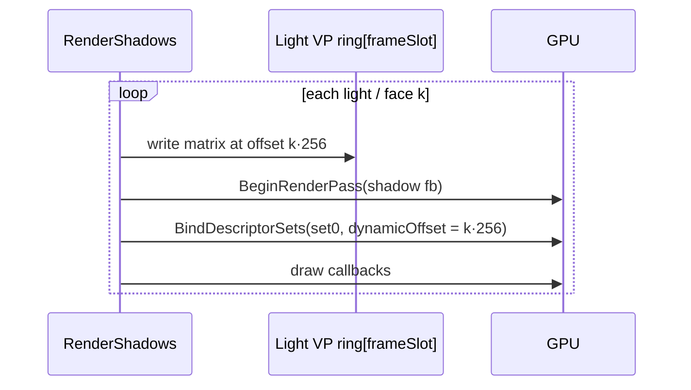

# Proposal: Renderer Stabilization

**Milestone:** M1 · **Status:** ⬜ planned · **Touches:** `ShadowSystem`, `VulkanRenderer`, lit shaders,
`SpineRenderer`, `Engine`, CLAUDE.md

## Problem

The renderer works for the Sandbox's single directional light, but it has correctness bugs that block
almost every later milestone:

- Multiple shadow-casting lights (and any point light) render with the wrong matrix.
- Changing the swapchain image count breaks every per-image array.
- Depth is remapped twice.
- Spine without a `ShadowSystem` has a mismatched pipeline layout.

See *Known issues* in [Shadow system](../shadow-system.md), [Vulkan renderer](../vulkan-renderer.md),
[Spine](../spine.md) and [Coordinate conventions](../coordinate-conventions.md).

## Goals

- Every shadow-casting light renders with its own matrix.
- The renderer survives resize, VSync toggles and minimize with any swapchain image count.
- The depth convention is consistent across all passes.
- The engine passes validation with no errors in the Sandbox and in `Examples/SpineExamples`.
- Small correctness fixes are made in Engine/Spine/Network (exit code, Spine scale and animation order).

## Non-goals

New features (cascades, materials, a resource allocator) belong to later milestones.

## Proposed design

### 1. Per-pass light matrix

The shared, host-mapped `_vpBuffer` is overwritten at record time. Each sub-pass needs its own matrix
that survives until the GPU executes it. Two options:

| Option | How | Trade-off |
|---|---|---|
| A. Push constant | Add `mat4 lightViewProj` to the shadow push blocks: 2D becomes 128 B, Point becomes 144 B | 144 B exceeds the 128 B guaranteed `maxPushConstantsSize` (most desktop drivers and MoltenVK expose 256 B, but this must be checked). Every caster's push code changes. |
| B. Dynamic-offset UBO ring | One 256-byte-aligned slot per sub-pass in a per-frame-slot buffer, bound with `UniformBufferDynamic` and a dynamic offset | No push-size dependency, caster code stays the same, and it scales to cascades |

**Recommendation: B.** It also fixes the frames-in-flight overwrite, because the ring is per frame slot.

The ring is sized `maxPasses = 4 + 7 + 4·6 = 35` slots × 256 B per frame slot.

### 2. Swapchain-count-robust resources

- Add `int FrameSlot` and `const int MaxFramesInFlight` to `IVulkanContext`, and key per-frame UBOs and
  sets by **frame slot** rather than image index (there are always 2, so nothing resizes).
- Recreate `renderFinished[]` when the image count changes. Pass `OldSwapchain`.
- Rebuild the render pass if the swapchain or depth format changes.

### 3. Depth convention

Remove `z = z·0.5 + w·0.5` from `Shapes.vk.vert`, `SpineLit.vk.vert` and `SceneGrid.vk.vert`, and
recompile the `.spv` files. Optionally move to reversed-Z later; record that decision in an ADR.

### 4. Synchronization & features

- Fix the main render pass external dependency: `srcStage = LateFragmentTests | ColorOutput`,
  `srcAccess = DepthStencilAttachmentWrite`.
- Enable `shaderSampledImageArrayDynamicIndexing` (query support first).
- Check `SampledImageBit | SampledImageFilterLinearBit` on the shadow depth format.
- Remove the `CullMode = Front` versus flip ambiguity: verify with RenderDoc and pick the cull mode
  explicitly.

### 5. Spine without shadows

Always declare the same set indices: bind a 1×1 "no shadow" dummy set at set 2 when there is no
`ShadowSystem`. This keeps `SpineLit.vk.frag` and `Shapes.vk.frag` valid and removes the layout
mismatch.

### 6. Small fixes

| Fix | Where |
|---|---|
| Don't reset `_exitCode` in `OnClose` | `Engine.cs:150` |
| Validation only when `#if DEBUG` or `EngineOptions.EnableValidation` | `Engine.cs:82` |
| Pair ImGui `NewFrame`/`Render` (call `EndFrame` on skipped frames) | `Engine.OnRender` |
| `DisplayFramebufferScale` for HiDPI | `VulkanImGuiController` |
| `SpineScale` setter applies to `Skeleton`. `SetAnimation` uses `SetAnimation`, not `AddAnimation`. Apply before `UpdateWorldTransform`. | `SpineNode` |
| Remove peers on disconnect/timeout | `ENetServer.cs:57-67` |
| Bring CLAUDE.md in line with the code (`Draw` not `OnRender`, SDL loader handoff); README was synced 2026-10-05 | CLAUDE.md |

## Task list

- [ ] Light VP dynamic-offset ring; delete `_vpBuffer`
- [ ] Pass the point pipelines to the `drawPoint` callback
- [ ] Use `ChooseUp` for directional lights
- [ ] Add `FrameSlot` to `IVulkanContext`; migrate Shapes, Spine, Sky, Grid, ImGui and Shadow per-image arrays
- [ ] Rebuild sync objects and the render pass on recreate
- [ ] Remove the depth remap from 3 vertex shaders and recompile
- [ ] Fix the render pass dependency; enable the dynamic-indexing feature
- [ ] Dummy shadow set for no-`ShadowSystem` cases
- [ ] Engine, ImGui, Spine and ENet small fixes
- [ ] CLAUDE.md sync
- [ ] Validate: Sandbox with 2 directional + 1 point + 2 spot lights, toggle VSync, resize, minimize

## Open questions

- Reversed-Z now or later?
- Should validation be controlled by an `EngineOptions` flag or by build configuration?

## Related

[Milestones](../../milestones.md) · [Shadows v2](shadows-v2.md) · [GPU resource management](gpu-resource-management.md)
