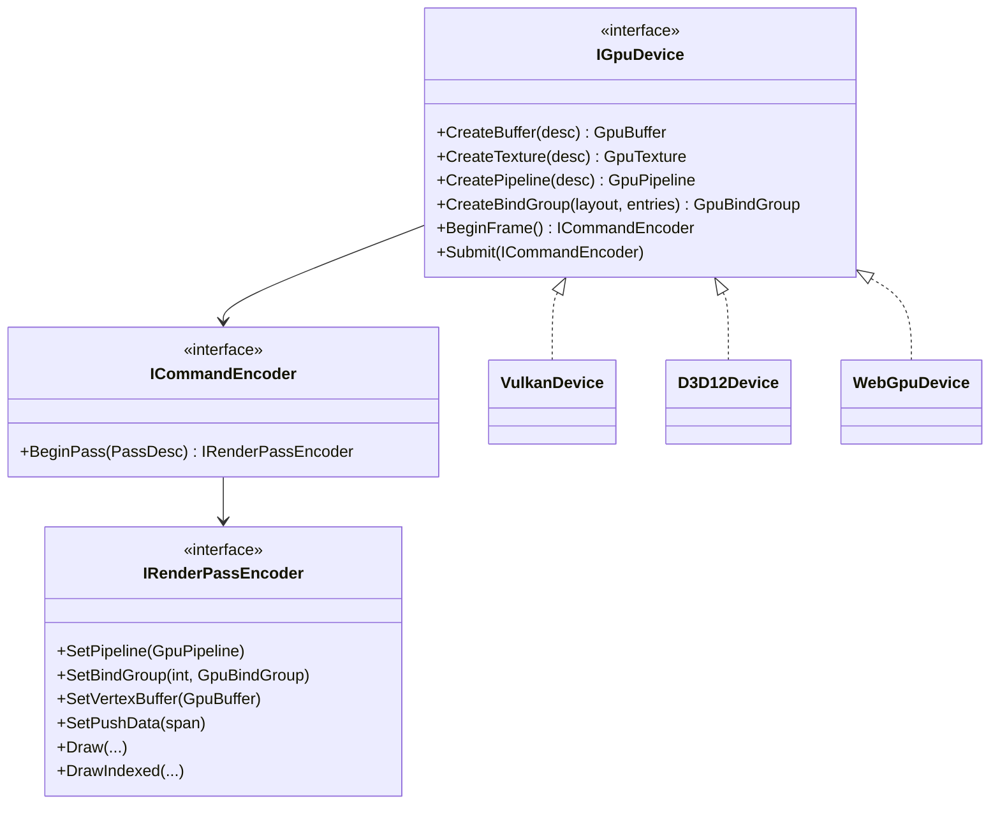

# Proposal: Rendering Backend Abstraction (D3D12, WebGPU)

**Milestone:** M11 · **Status:** ⬜ planned · **Depends on:** M3 (materials, resources) · **Shaped by:**
[Consoles](consoles.md) ([ADR 0143](../../../memory/decisions/0143-console-strategy.md))

## Problem

The README plans a WebGPU backend, but every drawable casts `IRenderer` to `IVulkanContext` and
records raw Vulkan commands. `EngineOptions.RenderingBackend` is ignored, and `IRenderer.Clear` and
`EnableDepthTest` are Vulkan no-ops that leak an OpenGL-era API.

## Goals

- A backend-neutral **render API** (resources, pipelines, command recording) that nodes use instead of
  `Vk` calls.
- Vulkan remains the reference backend with no performance regression.
- **A D3D12 backend on Windows is the first new backend**, tested in CI on WARP. It proves the API against a second
  explicit API and is the public base for an Xbox port ([Consoles](consoles.md)).
- A WebGPU backend (desktop via wgpu-native or Dawn; browser later) can be added without touching nodes. It follows
  D3D12.
- The API stays small and explicit enough that a private console backend (PS5) is a contained piece of work.
- Shaders authored once, compiled offline to SPIR-V and DXIL (and WGSL for WebGPU). Slang is the proposed language.

## Non-goals

A full render graph. Can be a follow-up.

## Proposed design

- The vocabulary follows WebGPU where it is neutral (bind groups, explicit passes), but the API is validated against
  D3D12 first. Requirements from the [console proposal](consoles.md#rendering), which are M11 acceptance criteria:
  - **Binding:** bind groups with layouts declared up front, at most 4 per pipeline (Vulkan descriptor sets, D3D12
    root-signature descriptor tables). Immutable samplers map to static samplers.
  - **Push data:** `SetPushData`, at most 128 bytes: Vulkan push constants, D3D12 root constants, and a
    dynamic-offset uniform buffer on WebGPU.
  - **Resource states:** a pass declares its attachments and the resources it reads and writes; the backend derives
    barriers (Vulkan pipeline barriers, D3D12 enhanced barriers). No raw barriers in engine code, no render graph.
  - **Pipelines are enumerable:** every pipeline description the engine can create is listed in a build-time
    pipeline manifest (material permutations × pass × vertex layout). Desktop pre-warms them at load; consoles
    compile them offline. Tests fail if a pipeline is first created mid-frame.
  - **Capabilities, not versions:** immutable comparison samplers, the 16-sampler budget, MSAA, compressed formats
    and tile-memory subpass merging (mobile) are `GpuCapabilities` that the shadow system and passes query.
  - **Presentation behind the device:** the host (`IAppPlatform`) hands the device a native window handle; the
    device owns the swapchain, so a console host can supply its own.
- Shaders: one source compiled offline per backend. **Decided and done: Slang**
  ([ADR 0144](../../../memory/decisions/0144-slang-shader-language.md)); the build compiles SPIR-V today, and DXIL (D3D12)
  and WGSL (WebGPU) are extra `slangc` targets added with their backends. Console shader compilation is a private build
  step.

## Migration order

1. Wrap Vulkan objects behind the interfaces (no behaviour change).
2. Port Sky and Grid (simplest), then shapes/materials, Spine, shadows, screen gizmos.
3. Remove `IVulkanContext` from public node APIs.
4. Implement `D3D12Device` (Windows) with WARP render tests and their own goldens; select it from
   `EngineOptions.RenderingBackend`.
5. Implement `WebGpuDevice`.

## Task list

- [ ] API interfaces + `VulkanDevice`
- [ ] Port subsystems in the order above
- [x] Shader-language ADR: Slang ([ADR 0144](../../../memory/decisions/0144-slang-shader-language.md)); [shader build](../shaders.md) on `slangc`
- [ ] DXIL (and WGSL) targets in the shader build, with their backends
- [ ] Pipeline manifest + load-time pre-warm + mid-frame-creation test
- [ ] `D3D12Device` (Windows) + WARP render tests (`Goldens/warp`) in CI
- [ ] `WebGpuDevice` (dependency decision: wgpu-native binding)
- [ ] Drop `IRenderer.Clear`/`EnableDepthTest`/`DisableDepthTest`

## Related

[Milestones](../../milestones.md) · [Vulkan renderer](../vulkan-renderer.md) · [Materials & meshes](../materials-and-meshes.md) ·
[Consoles](consoles.md) · [Mobile core (M12)](mobile.md)
