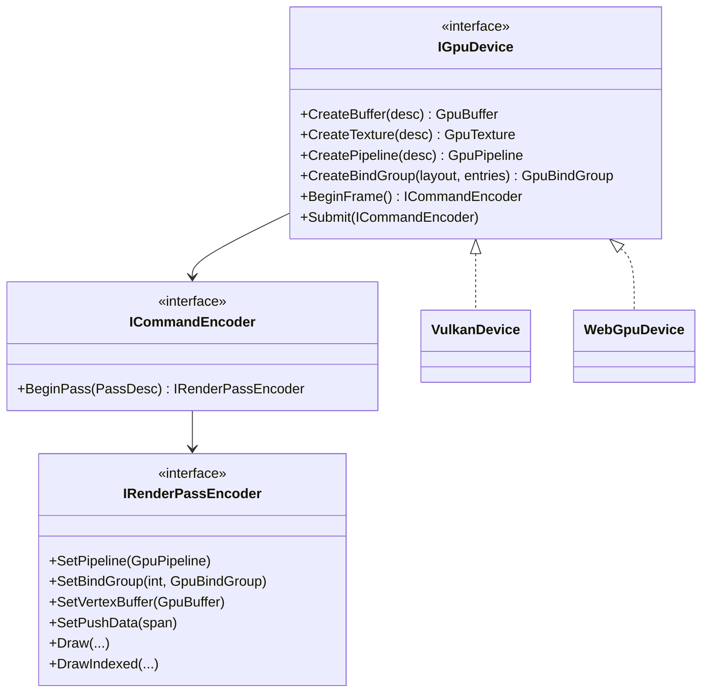

# Proposal: Rendering Backend Abstraction (WebGPU)

**Milestone:** M11 · **Status:** ⬜ planned · **Depends on:** M3 (materials, resources)

## Problem

The README plans a WebGPU backend, but every drawable casts `IRenderer` to `IVulkanContext` and
records raw Vulkan commands. `EngineOptions.RenderingBackend` is ignored, and `IRenderer.Clear` and
`EnableDepthTest` are Vulkan no-ops that leak an OpenGL-era API.

## Goals

- A backend-neutral **render API** (resources, pipelines, command recording) that nodes use instead of
  `Vk` calls.
- Vulkan remains the reference backend with no performance regression.
- A WebGPU backend (desktop via wgpu-native or Dawn; browser later) can be added without touching nodes.
- Shaders authored once (GLSL or Slang/WGSL), cross-compiled per backend.

## Non-goals

A full render graph. Can be a follow-up.

## Proposed design

- The model follows WebGPU (bind groups, explicit passes), which maps cleanly onto Vulkan.
- Push constants become `SetPushData`. On WebGPU, emulate them with a dynamic-offset uniform buffer.
- Immutable comparison samplers and the 16-sampler budget become backend capabilities that the shadow
  system queries.
- Shaders: compile GLSL → SPIR-V (Vulkan) → WGSL through Naga/Tint, or move to Slang. Decide via ADR.

## Migration order

1. Wrap Vulkan objects behind the interfaces (no behaviour change).
2. Port Sky and Grid (simplest), then shapes/materials, Spine, shadows, ImGui.
3. Remove `IVulkanContext` from public node APIs.
4. Implement `WebGpuDevice`; select it from `EngineOptions.RenderingBackend`.

## Task list

- [ ] API interfaces + `VulkanDevice`
- [ ] Port subsystems in the order above
- [ ] Shader cross-compilation in the [shader build](../shaders.md)
- [ ] `WebGpuDevice` (dependency decision: wgpu-native binding)
- [ ] Drop `IRenderer.Clear`/`EnableDepthTest`/`DisableDepthTest`

## Related

[Milestones](../../milestones.md) · [Vulkan renderer](../vulkan-renderer.md) · [Materials & meshes](materials-and-meshes.md)
