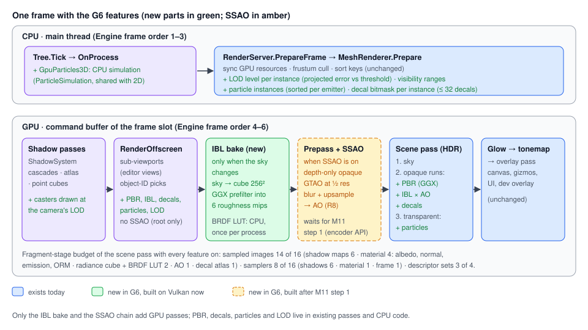

# Proposal: Rendering features (PBR, 3D particles, LOD, decals, SSAO)

**Milestone:** [Gameplay toolkit](../../milestones.md#gameplay-toolkit-) (G6) · **Status:** ⬜ planned ·
**Depends on:** [M3 materials & meshes](../materials-and-meshes.md), [M4 shadows](../shadow-system.md), [sky](../sky.md);
SSAO (G6.6) also on step 1 of [M11 backend abstraction](rendering-backend-abstraction.md) ·
**Related:** [Mobile core](mobile.md) (quality tiers, TBDR rules), [Keyframe animation](keyframe-animation.md) (G1b
skinning shares the mesh vertex shader), [Editor viewport tools](editor-viewport-tools.md) (G7: range handles, simulate
mode), [ADR 0014](../../../memory/decisions/0014-blinn-phong-now-pbr-later.md),
[ADR 0016](../../../memory/decisions/0016-normal-maps-without-tangents.md)

## Problem

The renderer is good enough for prototypes: lit, shadowed, instanced meshes in a linear HDR pipeline with ACES. A 3D
game notices what is missing, PBR and 3D particles first.

- **Shading is Blinn-Phong only.** `ShadingMode` has `BlinnPhong` and `Unshaded`
  (`MainframeEngine/Src/Rendering/Resources/Material.cs:32-39`). `StandardMaterial3D` has `Specular` and `Shininess`
  (`Material.cs:186-211`), with no metallic, roughness or AO. ADR 0014 deferred PBR "after Shadows v2 (M4) and with
  image-based lighting". M4 has shipped.
  - `shadeLightsBlinnPhong` multiplies the highlight by the base colour
    (`MainframeEngine/Content/Shaders/include/lights.slang`), so dark surfaces never get a highlight and metals
    cannot be expressed.
  - Ambient light is one flat colour (`LightsUBO.ambientColor`, `lights.slang`, `lights.slang`), set by
    `WorldEnvironment.AmbientColor` (`MainframeEngine/Src/Scene/Nodes3D/WorldEnvironment.cs:31-32`). The sky does not
    light or reflect anything.
  - Sky images are `R8G8B8A8Srgb` with one mip ([sky.md](../sky.md#gpu-resources)), so there is no HDR environment
    to light from.
- **glTF PBR data is dropped.** The importer maps base colour, normal, emission, alpha and double-sided only, and turns
  `$mat.shininess` into `Shininess` (`MainframeEngine/Src/Resources/Import/ModelImporter.cs:396-449`).
  [Asset pipeline → known issues](../asset-pipeline.md#known-issues) lists "PBR metallic/roughness maps" as not
  imported.
- **No 3D particles.** `GpuParticles2D` + `ParticleProcessMaterial` exist, but only in 2D
  (`MainframeEngine/Src/Scene/Nodes2D/GpuParticles2D.cs:11`, `:78`). Despite the Godot name they simulate **on the
  CPU** in `OnProcess` (`GpuParticles2D.cs:142-147`) and draw through the canvas (`:249-284`). The simulation is
  private to the node and 2D-only (`Vector2` state, `:80-89`). The engine has no compute pipelines (the only mention
  is a doc comment, `MainframeEngine/Src/Rendering/Vulkan/PipelineCache.cs:74`).
- **No billboards.** `Sprite3D` "has no billboard mode" (`docs/design/materials-and-meshes.md:374`,
  `MainframeEngine/Src/Scene/Nodes3D/GeometryInstance3D.cs:86-90`).
- **No LODs.** [Materials & meshes → known issues](../materials-and-meshes.md#known-issues) (`:373`) lists "No PBR,
  skinning, morph targets, LODs". A surface is one index range (`SurfaceRange`,
  `MainframeEngine/Src/Rendering/Meshes/MeshGpuResources.cs:10`), and `MeshRenderer.Prepare` draws every visible
  surface at full detail (`MainframeEngine/Src/Rendering/Meshes/MeshRenderer.cs:578-679`).
- **No decals, no SSAO.** The scene pass keeps depth `Clear/DontCare`
  ([Vulkan renderer → render passes](../vulkan-renderer.md#render-passes)), and nothing renders depth or normals
  before it (Engine order: `PrepareFrame`, `BeginFrame`, shadows, offscreen, scene pass,
  `MainframeEngine/Src/Core/Engine.cs:511-541`). `RenderTarget` can keep a sampleable depth (`SampleDepth`,
  `MainframeEngine/Src/Rendering/Vulkan/RenderTarget.cs:24-29`), but only `SubViewport` uses it.

G6 ranks below the other Gameplay toolkit items, because rendering already works for prototypes. Whether to build it on
Vulkan now or after the M11 backend abstraction is a planning decision, answered in
[Vulkan now or after M11](#vulkan-now-or-after-m11).

## Goals

- **PBR:** metallic-roughness `StandardMaterial3D` (glTF's model, Godot's property names), Cook-Torrance GGX for
  every light, image-based lighting from the existing sky, glTF metallic/roughness/occlusion import.
- **3D particles:** `GpuParticles3D` sharing the 2D simulation, billboard and mesh particles, sorting, drawn through
  the existing mesh batcher. Billboards for `Sprite3D` come with it.
- **LOD:** per-surface LOD levels, picked per instance by projected screen-space error, plus Godot's visibility ranges.
- **Decals:** a `Decal` node (albedo, normal, ORM, emission) projected onto opaque surfaces.
- **SSAO:** screen-space ambient occlusion at half resolution, opt-in per world, off on low mobile tiers.
- Per-frame code allocates nothing and the frame stays free of validation warnings. Existing Blinn-Phong goldens keep
  matching unless a phase says otherwise.

## Non-goals

- GPU (compute) particle simulation, particle collision, attractors, sub-emitters, trails, turbulence. These come
  after M11, when compute is portable to WebGPU and mobile.
- Particle shadows. Blended materials cast none today (`MaterialRenderState.CastsShadows`, `Material.cs:118-119`),
  and opaque particles do not cast in G6.
- HLOD (merged proxies of node groups), impostors, LOD cross-fade/dither, automatic LOD for skinned meshes.
- Clustered or tiled lighting. Lights stay a loop over the lights UBO.
- Temporal effects: TAA, motion vectors, temporally accumulated AO. SSR, SSIL, SDFGI, VoxelGI, lightmaps, reflection
  probes, volumetric fog.
- Custom material shaders (still "later", [materials-and-meshes.md](../materials-and-meshes.md#known-issues)).
- Godot's Burley diffuse and clearcoat/anisotropy/subsurface/sheen.

## Design



Only the IBL bake and the SSAO chain add GPU passes. PBR and decals are fragment-shader work in the existing scene
pass. Particles and LOD are CPU work feeding the existing `MeshRenderer`.

### Binding budget

Every feature samples in the mesh fragment stage, which has a hard budget: ≤ 16 samplers and sampled images per stage
and ≤ 4 descriptor sets (MoltenVK and the Android baseline profile,
[mobile.md → rendering](mobile.md#rendering), [checklist item 10](mobile.md#mobile-ready-plumbing-checklist)).

| Fragment stage | Today | With every G6 feature |
|---|---|---|
| Shadows (set 1): cascade array, atlas, 4 point cubes (`include/shadows.slang`) | 6 images / 6 samplers | same |
| Material (set 2): albedo, normal, emission (`include/material.slang`) | 3 images / 1 sampler | + ORM = 4 images / 1 sampler |
| Frame (set 0): radiance cube, BRDF LUT, AO, decal atlas | — | 4 images / 1 shared linear-clamp sampler |
| **Total** | 9 images, 7 samplers, 3 sets | **14 images, 8 samplers, 3 sets** |

Two decisions keep this within budget:

- **One ORM texture binding per material** (occlusion R, roughness G, metallic B, glTF's packing), described below.
- **New per-view textures go into set 0** (`FrameContext`, per frame slot and view), not a new set. Set 3 stays free.
  [Keyframe animation](keyframe-animation.md) G1b may want it for joint matrices.

### PBR

#### Shading model

New `ShadingMode.Pbr`, as ADR 0014 planned. Godot calls its PBR mode `PerPixel`. We use `Pbr` because `BlinnPhong`
is per-pixel too.

- **Direct light:** Cook-Torrance with GGX/Trowbridge-Reitz D, height-correlated Smith visibility and Schlick Fresnel.
  Diffuse is Lambert.
- **Roughness:** perceptual roughness `r` from the material; α = r², clamped to ≥ 0.045² against specular aliasing.
- **F0:** `mix(vec3(0.16 · s²), albedo, metallic)`, with `s` = `MetallicSpecular` (Godot's `metallic_specular`,
  default 0.5 → F0 0.04).
- **Light units unchanged:** the 1/π of Lambert is folded into the light intensity. A light of energy 1 lights a white
  diffuse surface at normal incidence to 1, the same as Blinn-Phong diffuse today (`lights.slang`). Lights,
  attenuation (`attenuate`, `lights.slang`), shadows, shadow opacity and the cascade tint are reused as they are.
- **Indirect light:**
  - diffuse = `albedo · (1 − metallic) · E(N)`. `E` is the radiance cube sampled at its roughest mip along `N` (no
    separate irradiance map: one binding fewer);
  - specular = `prefiltered(R, r · maxMip) · (F0 · A + B)`, with `(A, B)` from the BRDF LUT;
  - both × `ao`, where `ao = min(material AO, SSAO)`. `AoLightAffect` (Godot's `ao_light_affect`, default 0) also
    darkens direct light.
- **Ambient source:** the colour ambient (`ambientColor`) is mixed in by `AmbientLightSkyContribution` (below). When
  the world has no sky, PBR uses the ambient colour for diffuse and nothing for specular.

`include/lights.slang` gains `shadeLightsPbr(PbrSurface s, vec3 N, vec3 Ngeo, vec3 worldPos)`, sharing the light loops
with the Blinn-Phong path (the per-light BRDF is the only difference). The IBL terms live in a new
`include/environment.slang`. `shadeLights` (Spine) and `shadeLightsBlinnPhong` stay unchanged, so Spine and Blinn-Phong
materials render exactly as today.

`Mesh.vk.frag` picks the path from the material flags, a uniform branch like the unshaded one (`Mesh.vk.frag:35-44`).
Normal mapping keeps the derivative tangent frame of ADR 0016. Vertex tangents (MikkTSpace) are an
[open question](#open-questions).

#### `StandardMaterial3D` additions

```csharp
public enum ShadingMode : byte { BlinnPhong, Unshaded, Pbr }   // Pbr is new
public enum TextureChannel : byte { Red, Green, Blue, Alpha }   // new (Godot's BaseMaterial3D.TextureChannel)

[SerializedVersion(2)]                                          // new: v1 files keep Blinn-Phong (migration below)
public sealed class StandardMaterial3D : Material
{
    [ExportGroup("Metallic")]
    [Export(Range = "0,1,0.01")] public float Metallic { get; set; }                   // Godot default 0
    [Export(Range = "0,1,0.01")] public float MetallicSpecular { get; set; } = 0.5f;   // Godot's metallic_specular
    [Export] public Texture2D? MetallicTexture { get; set; }
    [Export] public TextureChannel MetallicTextureChannel { get; set; }                // Godot default Red

    [ExportGroup("Roughness")]
    [Export(Range = "0,1,0.01")] public float Roughness { get; set; } = 1f;            // Godot default 1
    [Export] public Texture2D? RoughnessTexture { get; set; }
    [Export] public TextureChannel RoughnessTextureChannel { get; set; }

    [ExportGroup("Ambient occlusion")]
    [Export] public bool AoEnabled { get; set; }
    [Export] public Texture2D? AoTexture { get; set; }
    [Export] public TextureChannel AoTextureChannel { get; set; }
    [Export(Range = "0,1,0.01")] public float AoLightAffect { get; set; }

    [Export] public ShadingMode ShadingMode { get; set; } = ShadingMode.Pbr;            // default flips in G6.2

    [SerializedMigration(1)]
    private static void FromV1(PropertyBag bag)
    {
        if (!bag.Contains("ShadingMode"))                  // v1 omitted the default, which was Blinn-Phong
            bag.SetString("ShadingMode", "BlinnPhong");
    }
}
```

All setters follow the existing pattern (`Touch()` on change). `Specular` and `Shininess` keep their meaning and apply
only to `BlinnPhong`. The inspector shows every group, like Godot.

**The default.** Godot's default is PBR, so ours becomes `Pbr`, in G6.2 once IBL exists. Without IBL a metal shows only
the flat ambient and looks worse than Blinn-Phong.

- Saved scenes and `.mres` files keep Blinn-Phong through the v1 → v2 migration. Only non-default values are saved,
  so v1 files omit `ShadingMode` when it was `BlinnPhong` ([scene-serialization.md](../scene-serialization.md)).
- Materials built in code (`new StandardMaterial3D()`, `StandardMaterial3D.Default`, primitives) switch to PBR. This
  is the visible change. Render-test goldens are re-recorded in one reviewed commit (see [Testing](#testing)).
- Imported models use PBR from G6.1 (below).

**ORM on the GPU.** `MaterialGpu` binds one `ormTexture` at set 2 binding 5. The material UBO
(`MaterialParams`, `include/material.slang`, 80 B) grows to 112 B:

- `vec4 pbr`: metallic, roughness, metallic specular, AO light affect;
- `uvec4 orm`: the AO, roughness and metallic channels, and the presence bits.

The three texture properties map to the binding like this:

1. All non-null ones are the **same** `Texture2D` (glTF, and Godot's ORM workflow): bind it, with the channels from the
   properties.
2. They **differ**: `OrmPacker` (new, internal) packs them into one linear RGBA8 texture. It works from the decoded
   CPU pixels (`Texture2D` decodes on first use, `Texture2D.cs:149-162`) with `Texture2D.FromPixels`, at the largest
   source size with nearest resampling. Results are cached by (texture, version) triple. This runs when the material
   changes, never per frame.

#### Import

`ModelImporter.Convert` (`ModelImporter.cs:396`) sets `ShadingMode = Pbr` and reads:

- `$mat.metallicFactor` and `$mat.roughnessFactor`;
- the textures for `TextureType.Metalness`, `TextureType.DiffuseRoughness`, and `TextureType.AmbientOcclusion` or
  `TextureType.Lightmap` (the slot Assimp uses for glTF occlusion). Silk.NET.Assimp 2.21 exposes all four (checked in
  the package). glTF's channels are metallic B, roughness G, occlusion R;
- it stops mapping `$mat.shininess` for PBR materials.

A model `.meta` setting `"shading": "pbr" | "blinnPhong"` (default `pbr`) lets a project keep the old look.

#### Image-based lighting from the sky

- **Source:** the world's `WorldEnvironment.Sky` ([sky.md](../sky.md)), whatever its mode:
  - procedural: the sky shader renders into the cube;
  - panoramic and cubemap: their textures are re-projected into the cube.
- **Radiance cube** (new `SkyRadiance`, internal, owned by the render server per `Sky`):
  - `R16G16B16A16_SFLOAT`, `Sky.RadianceSize` (Godot's `radiance_size`, default 256) with 6 mips;
  - mip 0 is the sky rendered into 6 faces with a 90° camera each (the existing `Sky.*.vk.frag` shaders through a
    per-face view of the frame set);
  - mips 1–5 are GGX-prefiltered for roughness 0.2 … 1.0 by importance sampling (a fragment pass per face and mip
    with a fullscreen triangle, like `GlowEffect`; no compute);
  - this is 36 small passes, recorded with the frame's other offscreen work, only when the sky's version changes.
  `ShadowSystem` already renders into cube faces (point lights), so the cube-face framebuffer pattern exists.
- **Update modes:** `Sky.ProcessMode` (Godot's name):
  - `Automatic` (default) spreads a rebake over frames, at most one face × mip-chain per frame, so a moving
    procedural sun costs ≈ 1/6 of a bake per frame;
  - `RealTime` rebakes everything each frame at 128² with fewer samples.
- **BRDF LUT** (new `BrdfLut`, internal): 64 × 64 `R16G16_SFLOAT` of the split-sum scale and bias. It is computed
  **on the CPU** once per process (≈ 1 M BRDF evaluations, a few ms, lazily at the first PBR material) and uploaded
  through `IVulkanContext.Uploads`. A CPU table is unit-testable against reference values and gives M11 nothing to
  port.
- **HDR skies:** panoramas can be Radiance `.hdr` files, decoded with StbImageSharp's float path (`ImageResultFloat`,
  already a dependency, `Directory.Packages.props:32`) into `R16G16B16A16_SFLOAT`. LDR panoramas still work, with
  weaker highlights. EXR would need a new dependency (out of scope).
- **Binding:** set 0 gains b2 radiance `textureCube`, b3 BRDF LUT `texture2D` and b6 a shared linear-clamp, mipmapped
  `sampler`. Worlds without a sky bind a 1×1 black cube.
  - Each world binds its own cube, so the editor's `SubViewport` worlds get IBL too.
  - A `Sky` shared between worlds is baked once (cache keyed by the `Sky` resource).

`WorldEnvironment` additions (Godot names and defaults):

| Property | Type / default | Effect |
|---|---|---|
| `AmbientLightSource` | `Background` \| `Disabled` \| `Color` \| `Sky`; `Background` | `Background` = the sky when there is one, else the colour |
| `AmbientLightSkyContribution` | float, 1 | Mix between the sky and `AmbientColor` for PBR diffuse |
| `AmbientLightEnergy` | float, 1 | Scales ambient |
| `ReflectedLightSource` | `Background` \| `Disabled` \| `Sky`; `Background` | Specular IBL on or off |

Blinn-Phong materials keep using the flat `ambientColor`, so their look does not change with these settings.

### 3D particles

#### Shared simulation

The 2D emitter's simulation is extracted into `ParticleSimulation` (new, internal sealed class, `Src/Scene/Particles/`).
It holds 3D state (`Vector3` position and velocity, age, acceleration, angle, angular velocity, scale, seed) in
arrays that are reallocated only when `Amount` changes. `Step(dt)` keeps today's ≤ 1/30 s sub-steps, phases and
restart rules (`GpuParticles2D.cs:149-197`).

- `GpuParticles2D` keeps its public API and calls the simulation in a 2D mode (z ignored, Y-down gravity).
  `GpuParticles2DTests` must pass **unchanged**: same random draw order, same results.
- If exact 2D parity would distort the shared code, the fallback is a sibling `ParticleSimulation3D` with the same
  structure. That choice is made in G6.3 with the tests as the judge.
- Like 2D, simulation is on the CPU in `OnProcess`. It stays in `Src/Scene`, not `Src/Physics` (no physics calls).

`ParticleProcessMaterial` (`GpuParticles2D.cs:11-68`) already has `Vector3` direction, gravity and box extents.

- Godot's default gravity is (0, −9.8, 0) in 3D. Our 2D default is (0, 98, 0) in pixels, so `GpuParticles3D` treats a
  material whose gravity is still the 2D default as Godot's 3D default (documented, unit-tested).
- New members (Godot names):

| Member | Default | Notes |
|---|---|---|
| `AngularVelocityMin/Max` | 0 | Degrees per second about the particle's view axis |
| `DampingMin/Max` | 0 | Velocity damping |
| `ColorRamp` | null | `Gradient` (`Src/Rendering/Resources/Gradient.cs:17`), sampled by age. Godot uses a `GradientTexture1D`; a `Gradient` avoids a texture on a CPU path |
| `ScaleCurve` | null | `Curve` (new resource, unless [keyframe animation](keyframe-animation.md) G1a adds one first): points with linear interpolation, sampled by age |

#### `GpuParticles3D`

```csharp
[EditorIcon("sparkles", Family = EditorIconFamily.Space3D)]       // new atlas icon (Tabler "sparkles")
public class GpuParticles3D : GeometryInstance3D                   // new
{
    [Export] public ParticleProcessMaterial? ProcessMaterial { get; set; }
    [Export] public Mesh? DrawPass1 { get; set; }                  // Godot's draw_pass_1; typically a QuadMesh
    [Export] public int Amount { get; set; } = 8;
    [Export] public float Lifetime { get; set; } = 1f;
    [Export(Range = "0,1,0.01")] public float AmountRatio { get; set; } = 1f;
    [Export] public bool OneShot { get; set; }
    [Export(Range = "0,1,0.01")] public float Explosiveness { get; set; }
    [Export] public float Preprocess { get; set; }
    [Export] public bool LocalCoords { get; set; }
    [Export] public bool Emitting { get; set; } = true;
    [Export] public DrawOrderEnum DrawOrder { get; set; }          // Index, Lifetime, ReverseLifetime, ViewDepth
    [Export] public Aabb VisibilityAabb { get; set; } = new(new(-4), new(4));   // Godot's default box
    public void Restart();
}
```

- `OneShot` and `Explosiveness` live in `ParticleSimulation`, so `GpuParticles2D` can expose them later.
- `CastShadows` defaults to `false` for particles.
- `Aabb` (`MainframeEngine/Src/Rendering/Meshes/Aabb.cs:6`) is not serializable today. It gets a 6-float codec in
  `Codecs.cs` and joins the generator's supported types (`MainframeEngine.Generators/TypeModelBuilder.cs:44`), as
  `Rect2` did.
- The `sparkles` (particles) and `sticker` (decal) icons are not in the editor atlas yet. They are added to
  `MainframeEngine.Editor/Content/icons/icons.txt` (`just editor-icons-fetch`, `just editor-icons`).

#### Rendering

Particles are drawn by the mesh batcher, not by a new renderer:

- **Instances.** `MeshInstanceData` is 80 B with 12 B of padding (`MeshVertex.cs:28-34`). The padding becomes
  a colour as four `System.Half` (8 B, linear, white for meshes) and `uint DecalMask` (4 B, see [decals](#decals)). The
  size and the shadow and ID paths are unchanged.
  - `Mesh.vk.vert` passes the colour on, and `Mesh.vk.frag` multiplies albedo by it.
  - For particles, `ObjectId` is the emitter's id, so picking selects the emitter.
- **Prepare.** In `MeshRenderer.Prepare`, a `GpuParticles3D` adds **one** draw item per `DrawPass1` surface. Its
  instances are the emitter's live particles.
  - The emitter writes them into its own preallocated `MeshInstanceData[]` during `Prepare`: transform from position,
    angle and scale, colour from `Color × ColorRamp(age)`. `WriteInstances` copies the span in one block.
  - `MeshDrawItem` gains an instance-span source. Emitter runs never merge with other nodes.
  - Culling uses `VisibilityAabb` transformed by the emitter. Transparent sorting among other draws uses its centre,
    as Godot does.
- **Order within an emitter.** `DrawOrder.ViewDepth` sorts live particles back to front with `Span.Sort` over
  preallocated key and index arrays. `Index`, `Lifetime` and `ReverseLifetime` need no per-frame sort.
- **Billboards.** New `StandardMaterial3D.BillboardMode`: `Disabled`, `Enabled`, `FixedY`, `Particles` (Godot's
  `billboard_mode`), plus `BillboardKeepScale`.
  - The vertex shader builds the basis from `frame.invViewRotation`, a **specialization constant** (constant 1)
    selected by a new `PipelineKey` field. Billboard mode joins `MaterialRenderState`.
  - `Particles` mode faces the camera and keeps the particle's in-plane angle and scale, read from the instance
    matrix (rotation about Z, column lengths).
  - `Sprite3D` gains `Billboard` (Godot's `SpriteBase3D.billboard`), which sets its private material's mode. This
    closes the `Sprite3D` known issue.
  - Billboarded materials cast no shadows in G6 (the caster pipelines do not billboard).
- **Lighting.** Particles use whatever material `DrawPass1` has. Unshaded + blended is the common case; lit materials
  work with the billboard's camera-facing normal.

**Allocation.** Arrays are resized only when `Amount` changes. The simulation uses no LINQ (the 2D `LiveCount`
property uses LINQ but is never called per frame). Instances are written into preallocated arrays and copied into the
frame slot's `InstanceBuffer`. Steady state allocates 0 B.

### LOD

#### Data

```csharp
public sealed class MeshLod                     // new, owned by a MeshSurface
{
    public float Error { get; init; }           // geometric error in mesh units (bounds-relative for authored LODs)
    public int[] Indices { get; init; } = [];   // into the surface's vertices (index-only LOD, Godot's model) …
    public MeshSurface? Geometry { get; init; } // … or its own vertices (authored LODs); null = share the surface's
}

public sealed class MeshSurface : Resource
{
    [Export] public MeshLod[] Lods { get; set; } = [];   // new; coarser levels, ascending Error; LOD 0 is the surface
}
```

- `MeshGpu` appends each LOD's indices (and own vertices, if any) after the surface's in the same buffers. A
  `LodRange(FirstIndex, IndexCount, VertexOffset, Error)` table hangs off each `SurfaceRange`, which already carries a
  `VertexOffset`.
- `ArrayMesh` LODs serialize as JSON arrays like the rest of the mesh (ADR 0011). Imported models are not re-serialized,
  so their LODs are rebuilt on import.

#### Sources

1. **Code:** `MeshSurface.Lods` set by procedural generators.
2. **Authored LODs** in model files: sibling nodes named `<name>_LOD0` … `<name>_LOD7` (the Unity/Unreal convention;
   Godot has none) merge into one mesh with LOD levels.
   - Their `Error` comes from the model `.meta` (`"lodErrors": [0.01, 0.02, …]`, fractions of the bounds radius).
   - The default is a doubling series starting at 1 %.
3. **Generated LODs** (Godot's `meshes/generate_lods` import option, default on in Godot) need a mesh simplifier.
   - That is a dependency decision ([open questions](#open-questions)). The recommendation is meshoptimizer through a
     `Native/` shim.
   - Until it is approved, G6.4 ships sources 1 and 2.
   - The `.meta` key `"generateLods"` is reserved now (default `false`) so projects do not change when it lands.

#### Selection

In `MeshRenderer.Prepare`, per instance and view:

- `projectedPixels = Error · maxScale(model) · k / distance`, where:
  - perspective: `k = viewportHeight / (2 · tan(fovY / 2))`, `distance` = camera to the closest point of the
    instance's AABB;
  - orthographic: `k = viewportHeight / orthoHeight` and no division by distance.
- Pick the coarsest level with `projectedPixels ≤ MeshLodThreshold / LodBias`. This is the same idea as Godot's
  `lod_bias` and `mesh_lod_threshold`.
- `GeometryInstance3D.LodBias` (new `[Export]`, default 1; higher = more detail). `rendering.meshLodThreshold` in
  `project.mfproj` (new, default 1 px; `RenderingProjectSettings`, `ProjectSettings.cs:366-392`).
- **Shadow casters** draw at the LOD the main camera picked. It is computed for every instance, including those
  culled by the camera, because casters are collected before the camera cull (`MeshRenderer.cs:603-623`). Shadows
  and the lit surface then agree.
- **Visibility ranges** (Godot's `visibility_range_begin/end`): `GeometryInstance3D.VisibilityRangeBegin/End` (new,
  0 = off). They are tested against the AABB centre distance before caster collection, so a hidden instance casts no
  shadow either. There is no fade (non-goal).

#### Sort keys

The opaque key uses all 64 bits today: `[pipeline 12][material 20][mesh 20][surface 12]`
(`MainframeEngine/Src/Rendering/Meshes/DrawList.cs:10-17`). It becomes
`[pipeline 12][material 20][mesh 17][surface 12][lod 3]`: up to 8 levels and 131 072 resident meshes (ids are dense).
`CasterKey` has 9 spare bits (`MeshRenderer.cs:682-688`) and simply appends `[lod 3]`. Equal LODs stay adjacent, so
instancing still merges them.

### Decals

#### Options in a forward renderer

| | Projected boxes ("deferred decals") | Forward decals (recommended) |
|---|---|---|
| How | Draw a box per decal after the opaques, rebuild the position from depth, blend into the HDR colour | The opaque fragment shader applies the decals that touch the pixel **before** lighting |
| Lighting | Blends after lighting: albedo decals look unlit or double-lit; normal and roughness decals are impossible | Correct: decals change albedo, normal, ORM and emission, then the surface is lit |
| Needs | Sampleable scene depth during the scene pass (a copy or a prepass); today depth is `DontCare` | Nothing new in the pass structure |
| Mobile | Reads depth, against the merged-pass plan ([mobile.md → rendering](mobile.md#rendering)) | No extra pass |
| Cost | Fill rate of the boxes | A loop per pixel over the decals assigned to that instance |

Godot 4 uses forward decals: clustered in Forward+, per-object lists in its Mobile renderer. Our lights are not
clustered either (one loop over at most 16 point lights, `limits.json`). The matching scale here is **per-instance
decal masks**:

- Per view, `Prepare` culls decals against the frustum and keeps the 32 nearest (`MAX_DECALS = 32`, a new
  `limits.json` entry). It writes them to a decal UBO in set 0 (b5, 32 × 176 B ≈ 5.6 KB, std140, per frame slot and
  view).
- For each visible opaque instance, an AABB-vs-decal-box test sets bits in `MeshInstanceData.DecalMask`. Transparent
  surfaces, particles, Spine, the sky and the grid get none.
- `Mesh.vk.frag` loops `while (mask != 0) { i = findLSB(mask); … }` before lighting:
  - transform `inWorldPos` into decal space and test the unit box;
  - fade by angle (`NormalFade`) and along the projection axis (`UpperFade`, `LowerFade`);
  - sample the atlas with `textureGrad`, using derivatives from `dpdx`/`dpdy`. The existing rule of taking derivatives
    before any branch (`material.slang`) holds.
- **Atlas.** `DecalAtlas` (new, internal) shelf-packs every decal texture in the world into one linear RGBA8 atlas
  (set 0 b4) from the decoded CPU pixels, with mips through the upload queue.
  - It is rebuilt only when the set of decal textures changes.
  - Albedo and emission are stored sRGB-encoded and decoded in the shader (`srgbToLinear`, `include/common.slang`).
    Filtering then happens in gamma space, a small accepted error that saves a second binding.
  - Normal maps and ORM are linear.
- When there are no decals, the mask is 0 and the loop costs one uniform test.

#### `Decal` node

```csharp
[EditorIcon("sticker")]                                     // new atlas icon (Tabler "sticker")
public class Decal : VisualInstance3D                       // new (Godot's Decal); projects along local −Y
{
    [Export] public Vector3 Size { get; set; } = new(2, 2, 2);
    [Export] public Texture2D? TextureAlbedo { get; set; }
    [Export] public Texture2D? TextureNormal { get; set; }
    [Export] public Texture2D? TextureOrm { get; set; }
    [Export] public Texture2D? TextureEmission { get; set; }
    [Export] public float EmissionEnergy { get; set; } = 1f;
    [Export] public DrawingColor Modulate { get; set; } = DrawingColor.White;   // sRGB-authored
    [Export(Range = "0,1,0.01")] public float AlbedoMix { get; set; } = 1f;
    [Export(Range = "0,1,0.01")] public float NormalFade { get; set; }
    [Export(Range = "0,1,0.01")] public float UpperFade { get; set; } = 0.3f;
    [Export(Range = "0,1,0.01")] public float LowerFade { get; set; } = 0.3f;
    [Export] public bool DistanceFadeEnabled { get; set; }
    [Export] public float DistanceFadeBegin { get; set; } = 40f;
    [Export] public float DistanceFadeLength { get; set; } = 10f;
}
```

- Decals affect Blinn-Phong and PBR surfaces. The ORM channels only matter for PBR.
- Godot's `cull_mask` is omitted, because 3D visuals have no render layers yet.
- Editor: a box gizmo along −Y. Its size handles come from G7's range handles
  ([editor-viewport-tools.md](editor-viewport-tools.md)).

### SSAO

#### Passes

SSAO needs depth before the scene pass. A new step, `RenderServer.RenderPrepass(Root)`, runs after `RenderOffscreen`
and before `BeginRenderPass` (`Engine.cs:521-526`), only when the root world enables SSAO:

1. **Depth prepass.** A depth-only `RenderTarget` (full resolution, `SampleDepth: true`) draws the view's opaque and
   cutout runs from the already sorted `MeshViewDraws` and the same instance buffer, as the ID pass does.
   - New `MeshDepth.vk.vert` shares the position math with `Mesh.vk.vert` through an include.
   - Cutout materials alpha-test in a depth fragment shader.
   - The scene pass keeps its own `Clear` depth in G6. Reusing the prepass depth (`Load` + less-or-equal compare,
     `invariant gl_Position`) is a later optimisation ([open questions](#open-questions)).
2. **GTAO at half resolution** (R8): horizon-based AO with 2 slices × 4 steps per pixel. View-space positions and
   normals are rebuilt from depth (no normal target: less bandwidth, and nothing is added to the prepass).
3. **Blur and upsample:** a depth-aware horizontal blur at half resolution, then a vertical blur that also performs
   the bilateral upsample into a full-resolution R8 target.
4. The scene pass samples it at set 0 b6 (`texelFetch` at `gl_FragCoord`). It multiplies indirect light only, unless
   `SsaoLightAffect > 0`. Blinn-Phong surfaces apply it to their flat ambient term, so SSAO works for both shading
   modes.

**Why GTAO.** Hemisphere SSAO (Crytek-style) needs many samples and a noise-and-blur pass to look clean. GTAO
integrates the visible horizon analytically per slice: better quality per sample and a cosine-weighted result that
matches the PBR ambient term. Godot uses ASSAO, an adaptive multi-pass variant, which is more code than this scope
needs. Without TAA there is no temporal accumulation, so the spatial blur carries the denoising.

Every pass goes through `RenderTarget.End` and its explicit barrier, which MoltenVK needs between encoders
([vulkan-renderer.md](../vulkan-renderer.md#render-passes)). When SSAO is off, there is no prepass and b6 binds a 1×1
white texture, so the frame is the same as today and existing goldens are unaffected.

#### Settings

`WorldEnvironment` (Godot names and defaults): `SsaoEnabled` (false), `SsaoRadius` (1), `SsaoIntensity` (2),
`SsaoPower` (1.5), `SsaoSharpness` (0.98), `SsaoLightAffect` (0), `SsaoAoChannelAffect` (0). Godot's ASSAO-specific
`ssao_detail` and `ssao_horizon` are left out.

Project setting `rendering.ssaoQuality` (`Off` | `Low` | `Medium` | `High`, default `Medium`) sets the slice and step
counts. `Off` disables SSAO everywhere. This follows the mobile checklist ("quality is settings, not code paths",
[item 9](mobile.md#mobile-ready-plumbing-checklist)). The mobile tier table gains a row: SSAO off on Low and Medium,
`Low` on High.

Like glow, only the tree's root world gets SSAO in G6 (`vk.PostProcess` is taken from the root world,
`MainframeEngine/Src/Servers/RenderServer.cs:426-428`). The editor viewport is a `SubViewport`
(`MainframeEngine.Editor/Src/Session/EditedScene.cs:32`), so it shows SSAO only in Play. Per-view SSAO is an open
question.

### Vulkan now or after M11

> **Superseded for SSAO (2026-10-09, [ADR 0163](../../../memory/decisions/0163-post-processing-stages-prepass-motion-vectors.md)).**
> Brogan asked for SSAO and TAA now, ahead of M11; the engine stays Vulkan-only for now. The depth prepass (shared with
> TAA and water), the post-processing stages SSAO plugs into (`AfterPrepass`), and its set 0 binding 5 (`ssaoTexture`,
> a white 1×1 fallback) are built: see [Post-processing](../post-processing.md). The prepass reuse this section left
> open is decided too: the scene pass loads the prepass depth (LESS_OR_EQUAL; cutouts EQUAL without `discard`).

**Recommendation:** build PBR, IBL, 3D particles, LOD and decals (G6.1–G6.5) on Vulkan now. Build SSAO (G6.6) only
after **M11 step 1**, the `IGpuDevice`/encoder interfaces with the Vulkan wrapper
([migration order](rendering-backend-abstraction.md#migration-order)). The WebGPU backend does not need to exist.

Reasons:

1. **Most of G6 does not touch the pass structure.**
   - PBR and decals are Slang in the existing scene pass, plus UBO fields and descriptor bindings.
   - Particles and LOD are CPU code feeding the existing `MeshRenderer`.
   - The shaders are Slang ([ADR 0144](../../../memory/decisions/0144-slang-shader-language.md)), which M11's backends
     compile to their own targets, so this shader work carries over.
2. **The new GPU passes before M11 are few and small.** The IBL bake is a handful of fullscreen-triangle passes into a
   cube, written like `SkyEnvironment` and `GlowEffect`, which M11 ports first ("Port Sky and Grid (simplest)"). M11
   then has PBR goldens to verify its port against.
3. **SSAO is the opposite.** It adds a geometry prepass, three fullscreen passes, new targets and barriers. It is also
   the one feature that collides with the mobile TBDR plan: an extra stored depth, full-screen passes, and the
   checklist's "avoid new full-screen passes" ([item 8](mobile.md#mobile-ready-plumbing-checklist)). Writing it once
   against the encoder API, with each pass's load/store intent stated, avoids writing it twice. Players also notice
   it least.
4. **No compute.** G6 adds no compute pipelines (the engine has none). GPU particle simulation waits until M11 makes
   compute portable to WebGPU and mobile.
5. **The rule if M11 slips:** SSAO stays parked. It is the lowest-value item, and nothing else in G6 depends on it.
   The `ao` term in the shaders already takes a 1×1 white texture, so adding SSAO later changes no shader interface.

**Recommended order:** G6.1 PBR → G6.2 IBL and the PBR default → G6.3 3D particles and billboards → G6.4 LOD →
G6.5 decals → G6.6 SSAO (after M11 step 1).

Within the Gameplay toolkit, G6 follows G1a–G5. G6.1–G6.3 depend on no other G item and can be
pulled forward when a 3D game needs PBR or particles first.

## Testing

- **Unit (`Tests/MainframeEngine.Tests`)**
  - `BrdfLut`: CPU table values at known (NdotV, roughness) points, compared with a reference integration within
    1e-3; deterministic output.
  - `StandardMaterial3D`: v1 → v2 migration (absent `ShadingMode` → `BlinnPhong`; explicit values kept); new
    defaults; `.mres` round trip of the PBR properties.
  - `OrmPacker`: same-texture fast path (no packing); channel packing; size mismatch; cache invalidation on texture
    version.
  - Import: extend the generated `TestModel` (`TestAssets/TestModel.cs`) with a metallic-roughness texture, factors
    and occlusion. Assert the material's PBR properties and channels. Add `_LOD1`/`_LOD2` siblings and assert the
    merged LOD levels.
  - `ParticleSimulation`: seeded determinism; `OneShot`, `Explosiveness`, `ColorRamp`, `ScaleCurve`, damping; 3D
    gravity default mapping. `GpuParticles2DTests` pass unchanged (the parity gate).
  - LOD: projected-error selection for perspective and orthographic cameras, `LodBias`, threshold, visibility ranges;
    shadow casters use the camera's LOD; new `DrawSortKey` and `CasterKey` layouts sort as specified.
  - Decals: frustum cull and nearest-32 selection; instance masks (box vs AABB, transparent instances get none);
    `DecalAtlas` packing and rebuild only on change.
  - Settings: `WorldEnvironment` and `project.mfproj` round trips (`ambient`, `ssao`, `meshLodThreshold`,
    `ssaoQuality`).
- **Render tests** (`Tests/MainframeEngine.RenderTests`, goldens for `moltenvk` and `lavapipe`):
  - `pbr`: a 5 × 5 metallic × roughness sphere grid under the procedural sky and sun (golden);
  - `pbr-furnace`, self-checked: a uniform white sky and no lights. A rough white dielectric and a white metal of
    any roughness must come out ≈ 1 within tolerance, which catches a wrong LUT, a missing prefilter or energy
    gain. Same approach as `SkyGridReference`;
  - `pbr-ibl-hdr`: a `.hdr` panorama with reflections (golden);
  - `particles-3d`: a fixed seed under `--fixed-fps`, billboard and mesh particles, blended and sorted (golden);
    `billboard`: `Sprite3D` billboard modes (golden);
  - `lod`: self-checked through `MeshRenderer.Stats` (which level drew at which distance), plus a golden;
  - `decals`: albedo, normal and ORM decals on a PBR floor and a Blinn-Phong box, with angle fade (golden);
  - `ssao`: golden with SSAO on; with SSAO off, the frame matches the `pbr` golden bit for bit.
  - **Existing goldens.** G6.1 changes none except `gltf` (imported materials become PBR), re-recorded on purpose. G6.2
    flips the default: `lit-shapes` and `multi-light` pin `ShadingMode.BlinnPhong` in their scene builders (they are
    the Blinn-Phong regression goldens). The others are re-recorded in one commit after inspecting every PNG
    ([testing.md](../testing.md)).
- **Validation gate:** every new scene runs with validation on and no warnings, including the IBL bake on its first
  frame and a resize with SSAO on.
- **Allocation gate:** 0 B per frame for `TenThousandInstancesAllocateNothingPerFrame` with PBR materials and LODs
  (`SceneTests.cs:433`). New gates: 100 emitters × 100 particles; 32 decals over 1 000 instances; a procedural sky with
  a moving sun (incremental IBL rebake every frame).
- **Frame time:** the 10k-instance test stays < 16.7 ms in Release with PBR materials.
- **Benchmarks** (`Tests/MainframeEngine.Benchmarks`, added to `baseline.json`):
  - `MeshDrawListBenchmarks.BuildAndSortOpaque10k` with LOD selection (≤ 10 % over today's ≈ 0.14 ms);
  - new `ParticleBenchmarks.Simulate10k` and `WriteInstances10k`;
  - `DecalAssignBenchmarks.Assign32x10k`;
  - `BrdfLut.Generate` (one-off, tracked against regressions).
- **Demo** (`Examples/Demo`): a new `rendering_3d.mscene` with:
  - PBR spheres and an imported glTF;
  - fire and smoke particles;
  - an LOD field with a stats readout;
  - decals on a floor;
  - an SSAO toggle once G6.6 lands.

  It joins the nav bar and the README screenshots (`just demo-screenshots`).
- **Editor QA** (`Tests/QA`): add a `GpuParticles3D` with a process material and a `QuadMesh` billboard, and a
  `Decal`. Check the inspector groups and the gizmos, save, reload and compare. Particle preview in the edit viewport
  depends on G7's simulate mode ([editor-viewport-tools.md](editor-viewport-tools.md)).

## Acceptance

- A glTF with metallic/roughness/occlusion textures imports and renders as PBR. Reflections come from the sky, and a
  `.hdr` panorama gives HDR reflections.
- v1 scenes look as before; new materials default to PBR.
- `GpuParticles3D` with billboard or mesh particles renders, sorts and stays deterministic. `GpuParticles2D` output is
  unchanged. `Sprite3D` billboards.
- Meshes with LODs switch level by projected error, shadows use the same level, and visibility ranges hide instances.
- `Decal`s project albedo, normal, ORM and emission onto opaque surfaces of both shading modes.
- (G6.6) SSAO darkens contact areas, and with SSAO off the frame is identical to the build without it.
- Validation and allocation gates are green and benchmarks are within budget. The fragment stage stays within
  16 images and samplers per stage and 3 descriptor sets.
- Docs updated when each phase ships:
  - [materials-and-meshes.md](../materials-and-meshes.md) (PBR, ORM, billboards, LOD keys, known issues);
  - [lighting.md](../lighting.md) (PBR model, ambient sources);
  - [sky.md](../sky.md) (radiance cube, `.hdr`, process modes);
  - [shaders.md](../shaders.md) (new includes and shaders);
  - [vulkan-renderer.md](../vulkan-renderer.md) and [color-pipeline.md](../color-pipeline.md) (prepass, SSAO passes);
  - [canvas.md](../canvas.md#particles) (shared simulation);
  - [asset-pipeline.md](../asset-pipeline.md) (PBR and LOD import);
  - [testing.md](../testing.md) (new render tests);
  - [mobile.md](mobile.md) (SSAO tier row);
  - [demo.md](../demo.md);
  - a new ADR amending ADR 0014 (PBR model and default), and one for decals and the "Vulkan now or after M11"
    decision.

## Task list

1. **G6.1 PBR shading**
   1. `ShadingMode.Pbr`, `TextureChannel`, the PBR properties, `[SerializedVersion(2)]` with its migration. The
      default stays `BlinnPhong` in this phase.
   2. `shadeLightsPbr` in `lights.slang`, the material UBO at 112 B, the ORM binding, `OrmPacker`. Refresh `.spv` and
      `shaders.lock`.
   3. Importer: factors, Metalness/DiffuseRoughness/Occlusion textures, `"shading"` meta setting; extended
      `TestModel`.
   4. Render test `pbr`; re-record `gltf`; unit tests.
2. **G6.2 IBL and the PBR default**
   1. `BrdfLut` (CPU) and its tests; set 0 bindings with fallbacks.
   2. `SkyRadiance`: cube capture of all three sky modes, GGX prefilter mips, `Sky.RadianceSize`, `Sky.ProcessMode`
      (incremental rebake).
   3. `.hdr` panoramas through StbImageSharp's float path.
   4. `WorldEnvironment` ambient and reflected light sources.
   5. Flip the default to `Pbr`; pin `lit-shapes`/`multi-light`; re-record and inspect the other goldens. Render tests
      `pbr-furnace` and `pbr-ibl-hdr`. Write the ADR.
3. **G6.3 3D particles and billboards**
   1. Extract `ParticleSimulation`; keep `GpuParticles2DTests` green; add `OneShot`, `Explosiveness`, damping,
      angular velocity, `ColorRamp`, `Curve` + `ScaleCurve`.
   2. `MeshInstanceData` colour and decal-mask fields; instance-span draw items; `GpuParticles3D`.
   3. `BillboardMode` (specialization constant, `PipelineKey`), `Sprite3D.Billboard`.
   4. Render tests `particles-3d` and `billboard`; allocation gate; benchmarks; `Aabb` codec; `sparkles` icon.
4. **G6.4 LOD**
   1. `MeshLod`, `MeshSurface.Lods`, the `MeshGpu` LOD table, the new sort-key layouts.
   2. Selection, `LodBias`, `rendering.meshLodThreshold`, casters at the camera's LOD, visibility ranges.
   3. Authored `_LODn` import with `lodErrors`. Reserve `generateLods`.
   4. Render test `lod`; benchmark.
   5. After the dependency decision: generated LODs.
5. **G6.5 Decals**
   1. `MAX_DECALS` in `limits.json`; decal UBO and atlas in set 0; `DecalAtlas`.
   2. `Decal` node; per-instance masks in `Prepare`; the shader loop.
   3. `sticker` icon; editor box gizmo (with G7 handles if available); render test `decals`; allocation gate; benchmark.
6. **G6.6 SSAO** (after M11 step 1)
   1. `RenderPrepass` and the depth prepass on the encoder API.
   2. GTAO, blur and upsample; `WorldEnvironment` SSAO settings; `rendering.ssaoQuality`; the mobile tier row.
   3. Render test `ssao` and the bit-identical "off" check; validation on resize; Demo toggle.

## Open questions

1. **LOD simplifier dependency** (needs approval before generated LODs):
   - **meshoptimizer** (zeux/meshoptimizer, MIT, actively maintained, the simplifier Godot uses) through a small
     `Native/` C ABI shim built by `natives.yml`. This follows the "natives are built" rule
     ([mobile checklist item 12](mobile.md#mobile-ready-plumbing-checklist)).
   - An in-house quadric-error simplifier in C#: no dependency, but slower and ours to maintain.

   Recommendation: meshoptimizer.
2. **Vertex tangents for PBR normal maps.** ADR 0016 said to revisit this with PBR. The derivative frame differs from
   baked MikkTSpace at UV seams, which glTF sample assets show. Tangents grow the vertex from 32 to 48 B and break the
   shadow pipelines' stride. Option: a separate tangent stream bound only by the lit pipeline, generated with
   mikktspace.c (zlib licence, one C file, via a shim) or a C# port. Defer until an asset shows the problem?
3. **Flipping the default to PBR** changes the look of materials built in code. Is that acceptable for existing game
   code? The alternative is keeping `BlinnPhong` as the default and setting `Pbr` only in the importer and the editor's
   "New StandardMaterial3D".
4. **Assimp glTF texture slots.** Which `TextureType` the bundled native Assimp reports for glTF's
   `metallicRoughnessTexture` (Metalness and DiffuseRoughness, or Unknown) and for occlusion (Lightmap or
   AmbientOcclusion) needs a spike against the `TestModel` before G6.1.3.
5. **SSAO in sub-viewports.** The editor viewport is a `SubViewport`, so with root-only SSAO (like glow) the editor
   never shows it. Per-view prepass and SSAO targets would cost memory per open scene tab.
6. **Prepass depth reuse.** Loading the prepass depth into the scene pass (less-or-equal compare, `invariant
   gl_Position`) saves overdraw shading but changes the opaque pipelines' depth compare and can change z-fight
   winners in goldens. Do it with M12's pass rework?
7. **Diffuse model.** Lambert (proposed) vs Godot's default Burley. Lambert is cheaper and simpler; Burley would match
   Godot ports more closely at grazing angles.

## Related

[Milestones](../../milestones.md#gameplay-toolkit-) · [Materials & meshes](../materials-and-meshes.md) ·
[Lighting](../lighting.md) · [Sky](../sky.md) · [Shadow system](../shadow-system.md) ·
[Color pipeline](../color-pipeline.md) · [Vulkan renderer](../vulkan-renderer.md) · [2D canvas](../canvas.md#particles) ·
[Asset pipeline](../asset-pipeline.md) · [Rendering backend abstraction (M11)](rendering-backend-abstraction.md) ·
[Mobile core (M12)](mobile.md) · [Keyframe animation (G1)](keyframe-animation.md) ·
[Editor viewport tools (G7)](editor-viewport-tools.md) · G8 builds on G6 and picks up some of its non-goals:
impostors in [Procedural trees (G8b)](procedural-trees.md), SSR as an option in [Water (G8c)](water.md), and fog, light
shafts and TAA in [Forest showcase (G8d)](forest-showcase.md)
