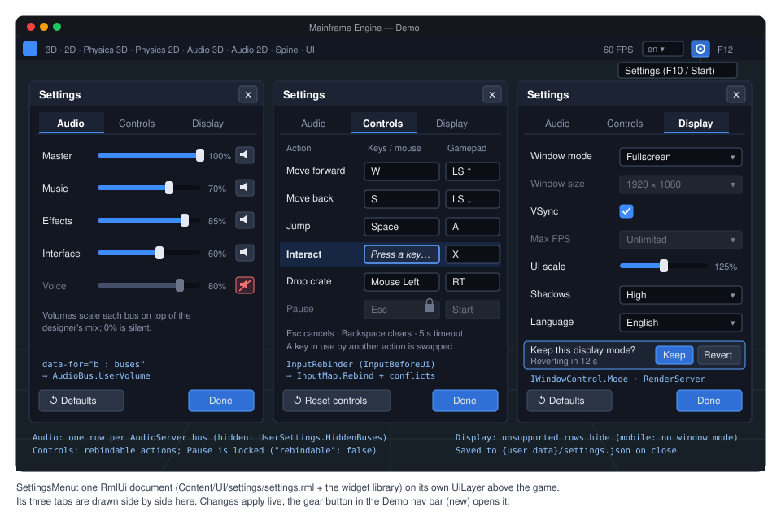

# Proposal: Save games and settings

**Milestone:** [Gameplay toolkit](../../milestones.md#gameplay-toolkit-) (G4) · **Status:** ⬜ planned ·
**Depends on:** [M10 projects](../project-and-gamehost.md) (`GameHost`, `project.mfproj`), [M8 game UI](../game-ui.md)
(widget library, data binding), [M7 audio](../audio.md) (buses), [M9 localization](../localization.md) ·
**Related:** [M13 mobile services](mobile-services.md#achievements-leaderboards-and-cloud-saves) (cloud saves build on
this), [M12 mobile core](mobile.md) (lifecycle saves, app-private storage), [Editor → Shared widgets](editor.md),
[Game export](game-export.md) (G5)

## Problem

Every game needs to save progress and remember the player's options. The engine has the pieces but no API:

- **A folder, no files.** `GameHost.UserDataDirectory` is the game's writable per-user folder, created on use, and
  `GameHost.UserDataPath("saves/run-1.json")` builds paths in it (`MainframeEngine/Src/Project/GameHost.cs:133-153`). It
  comes from `UserDataPaths` (`%APPDATA%`, `~/Library/Application Support`, `$XDG_DATA_HOME`; `MAINFRAME_USER_DATA`
  overrides the base, `MainframeEngine/Src/Core/UserDataPaths.cs:3-15`). Nothing in the engine writes saves or settings
  there; only logs live there today. The folder is named after `ProjectSettings.Name`
  (`GameHost.cs:142`), so renaming a project silently moves every player's data.
- **Versioned JSON exists for one file.** `project.mfproj` carries a `format` number. On load, older documents run
  through `ProjectSettingsFormat.Migrations`, one `ProjectMigration(From, Action<JsonObject>)` step at a time, editing the
  JSON tree; newer documents are rejected (`MainframeEngine/Src/Project/ProjectSettingsFormat.cs:10`, `20-35`, `56-103`).
  The loop is generic but lives in the project settings class, and its errors say "project format". Editor settings use
  a second, ad-hoc scheme: a `Format = 1` field in a source-generated JSON context
  (`MainframeEngine.Editor/Src/Settings/EditorSettings.cs:182-194`).
- **Writes are atomic but not durable.** `ResourceSaver.WriteAtomically` writes `path.tmp` and renames it over the target
  (`MainframeEngine/Src/Resources/ResourceSaver.cs:74-80`). There is no flush to disk before the rename, no backup and no
  corruption check. That is fine for project files under version control. It is not enough for a save the player cannot
  recreate.
- **JSON for game types.** The engine's own JSON code is reflection-free: hand-written `Utf8JsonWriter`/`JsonNode` code for
  `project.mfproj`, and source-generated `JsonSerializerContext`s elsewhere (`AssetJsonContext`,
  `MainframeEngine/Src/Resources/AssetDatabase.cs:32-38`). A save API must take the game's own context
  (`JsonTypeInfo<T>`) to stay AOT-safe for [mobile](mobile.md).
- **Input can change at run time, but cannot be rebound.** `InputMap.Bind`/`Unbind` edit an action's bindings and bump
  `Version`, so input states refresh (`MainframeEngine/Src/Scene/Input/InputMap.cs:206-269`), and `Clone` makes a deep
  copy (`InputMap.cs:278-289`). There is no conflict detection, no reset to defaults, no "press a key" capture, no
  display name for a binding and no way to say an action is not rebindable. `GameSession.Start` installs the project's
  own `InputMap` instance as the tree's map (`MainframeEngine/Src/Project/GameSession.cs:94`), so the defaults are lost as
  soon as anything rebinds.
- **Audio volume has one fader per bus.** `AudioBus.VolumeDb` (clamped to −80…+24 dB) and `Mute` are the designer's mix
  from the bus layout (`MainframeEngine/Src/Audio/AudioBus.cs:39-62`). The gain is computed from them in
  `AudioServer.ComputeBusGains` (`MainframeEngine/Src/Audio/AudioServer.cs:444`). A player volume written there would
  overwrite the mix, and `GetBusLayout` (`AudioServer.cs:302-320`) would bake it into the project if the editor saved it.
- **Display options are scattered.** `IWindowControl` exposes `Title`, `Fullscreen`, `Size`, `Position` and `ScreenBounds`
  (`MainframeEngine/Src/Scene/SceneTree.Window.cs:9-21`). `Fullscreen` maps to Silk.NET's `WindowState.Fullscreen`
  (`MainframeEngine/Src/Core/SilkWindowControl.cs:16-20`), with no choice between borderless and exclusive. VSync is
  `IRenderer.VSync` (a swapchain rebuild, `MainframeEngine/Src/Rendering/IRenderer.cs:14-15`), reachable through
  `Tree.Servers.Render.Renderer`. `Engine.MaxFPS` (`MainframeEngine/Src/Core/Engine.cs:233-241`) is not reachable from
  nodes at all. `RenderServer.ShadowQuality` changes live between Low, Medium and High, but switching to or from Off throws
  once visuals exist (`MainframeEngine/Src/Servers/RenderServer.cs:118-129`). There is no player-facing UI scale: the dp
  ratio follows the display only (`UiLayer.ScaleMode`, `MainframeEngine/Src/UI/UiLayer.cs:82`).
- **No settings UI.** The [widget library](../game-ui.md#widget-library) has sliders, checkboxes, dropdowns and buttons,
  but no tabs and no settings screen. The Demo's nav bar has a language picker and nothing else
  (`Examples/Demo/Content/Nav/nav.rml`).
- **Mobile plans assume this exists.** [Mobile core](mobile.md) says games save in `OnApplicationPause` and that "the
  `mfgame` template shows a `SaveGame` autoload" (`mobile.md:229-233`). [Mobile services](mobile-services.md) plans a
  `CloudSaveServer` with slots of bytes, `SaveMeta { Slot, Description, PlayedTime, ModifiedUtc, DeviceName,
  ProgressValue }` and conflict policies (`mobile-services.md:102-107`, `349-357`). Neither has a local save layer to
  build on.

## Goals

- A small **save API**: named slots, a metadata header readable without loading the payload, a typed payload through a
  game-provided `JsonTypeInfo<T>`, and payload migrations registered per version, in the same style as `project.mfproj`.
- **Saves that survive crashes and power loss:** temp file + flush to disk + rename, rolling backups, a checksum, and
  automatic recovery from the newest valid copy.
- **No hitch:** the snapshot is taken on the main thread and the disk work runs on a worker. Completion is reported on
  the main thread.
- A Godot-like **`ConfigFile`** for key/value data, and a typed **`UserSettings`** layer on top of it. `UserSettings`
  applies audio, input, display and language at startup (before the window opens where possible) and whenever a value
  changes.
- **Key rebinding** in `InputMap`: per-device slots, conflict policies, reset to defaults, gamepad support and a capture
  node.
- A **drop-in settings menu**: an RmlUi document and controller that games can open with one call or restyle. It is
  localized through `Tr`.
- A **storage seam** (`ISaveStorage`) and a cloud hook, so the M13 backends (Steam Cloud, iCloud, Play Saved Games) plug
  in with conflict resolution and no change to the file format.
- The **Demo** gets a settings menu from the nav bar and a save/load example.

## Non-goals

- **Encryption or anti-tamper.** Save files are plain JSON on the player's machine. The checksum detects corruption, not
  cheating. Games that need trusted progress need a server.
- **Automatic scene serialization.** The engine does not save the scene tree for the game. A save is the game's own data
  type. Godot does not do this either; `PackedScene` is for authoring, not for run-time state.
- **Cloud backends.** G4 defines the interfaces and a fake backend for tests. Steam Cloud, iCloud and Play Saved Games
  are [M13.3](mobile-services.md). Steam Auto-Cloud needs no code (see [Cloud saves](#storage-and-cloud-saves)).
- **Syncing settings across devices.** Display settings are per device. Cloud sync of the portable parts (audio, input)
  is an M13 question.
- **Render-resolution scale, quality presets beyond shadows, per-monitor selection.** These come with
  [Rendering features](rendering-features.md) (G6) or later.
- **Gamepad glyph images.** Bindings show text labels (`A`, `LB`, `RT`). Platform glyph sets are an open question.

## Design

### Overview

| Type (all new unless noted) | Where | Role |
|---|---|---|
| `JsonMigration`, `JsonMigrations` | `Src/Serialization/` | The `format`/`version` upgrade loop shared by `project.mfproj`, saves and settings |
| `DurableFile` | `Src/Serialization/` | Temp file → flush to disk → replace with backups; also used by `ResourceSaver.WriteAtomically` |
| `SaveServer : IFrameServer` | `Src/Saves/` | Slots, header listing, async save/load, play time, recovery, cloud hook |
| `SaveSchema<T>`, `SaveInfo`, `SaveSlotInfo`, `SaveResult`, `SaveLoad<T>` | `Src/Saves/` | Typed payload description, metadata, results |
| `ISaveStorage`, `LocalSaveStorage`, `ICloudSaveBackend` | `Src/Saves/` | Storage seam; local files; M13 cloud backends |
| `ConfigFile` | `Src/Serialization/` | Godot's `ConfigFile`: sections and keys, JSON on disk, versioned |
| `UserSettings` | `Src/Project/` | Typed audio/input/display/language settings over a `ConfigFile`; startup and live apply |
| `InputMap` additions, `InputRebinder` | `Src/Scene/Input/` | Rebinding, conflicts, defaults, capture |
| `AudioBus.UserVolume` (new member) | `Src/Audio/` | Player volume, multiplied on top of the designer's fader |
| `IWindowControl.Mode/VSync/MaxFps` (new members), `WindowMode` | `Src/Scene/`, `Src/Core/` | Display settings reachable from nodes |
| `UiServer.UserScale` (new member) | `Src/UI/` | Player UI scale |
| `SettingsMenu : UiDocument` + `Content/UI/settings/` | `Src/UI/Settings/` | The drop-in menu |

### Files in user data

```text
{user data}/                 GameHost.UserDataDirectory
├── settings.json            UserSettings (a ConfigFile)
├── saves/
│   ├── slot1.msave          header line + payload
│   ├── slot1.msave.bak1     previous save (rolling, saves.backups copies)
│   ├── slot1.png            optional thumbnail
│   └── autosave.msave
└── logs/                    as today
```

- Slot names are file-name safe: `[a-z0-9_-]{1,64}`. Anything else throws `ArgumentException`. Games show their own
  labels from `SaveInfo.Description`.
- **Stable folder name.** `project.mfproj` gains an optional `"userDataName"` (Godot's `config/custom_user_dir_name`).
  When it is set, `GameHost.UserDataDirectory` uses it instead of `Name`, so renaming a project or its window title never
  orphans player saves. The template sets it to the project name at creation. Adding an optional key needs no format bump:
  older engines warn about unknown keys and ignore them (`ProjectSettingsFormat.cs:386`, `608`).

### Versioned JSON: one migration loop

`ProjectSettingsFormat.Upgrade` becomes a thin wrapper over a shared helper. Its public signature and `ProjectMigration`
stay the same.

```csharp
// new — MainframeEngine/Src/Serialization/JsonMigration.cs
/// <summary>One upgrade step: rewrites a version-From document into version From+1 by editing the JSON tree.</summary>
public readonly record struct JsonMigration(int From, Action<JsonObject> Upgrade);

public static class JsonMigrations
{
    /// <summary>
    /// Runs the steps from <paramref name="version"/> to <paramref name="current"/>. Throws InvalidDataException naming
    /// <paramref name="source"/> and <paramref name="what"/> ("save version", "settings format") when a step is missing.
    /// </summary>
    public static void Upgrade(JsonObject root, int version, int current, IReadOnlyList<JsonMigration> migrations,
        string source, string what);
}
```

The rules are the same as for `project.mfproj` (`ProjectSettingsFormat.cs:56-103`):

- A missing version means 1.
- A version newer than `current` is rejected and the file is left untouched.
- Each step edits the JSON tree, and only then is the tree deserialized into the typed object.
- Saving always writes the current version.

Steps are static lambdas over `JsonObject` (no reflection), so they are trim- and AOT-safe.

Saves and settings carry **two numbers**: `format`, the engine's container layout (engine migrations), and `version`,
the game's payload (the game's migrations). Engine and game evolve separately.

### Save games

#### Payload schema

The game describes its payload once:

```csharp
// new
public sealed class SaveSchema<T>
{
    public SaveSchema(JsonTypeInfo<T> typeInfo, int version, params ReadOnlySpan<JsonMigration> migrations);
    public JsonTypeInfo<T> TypeInfo { get; }
    public int Version { get; }                       // the payload version this build writes
    public IReadOnlyList<JsonMigration> Migrations { get; }
}
```

```csharp
// game code (the Demo's crate example)
public sealed record CrateState(Vector3 Position, Quaternion Rotation, Vector3 Velocity, int Color);
public sealed record CrateSave(List<CrateState> Crates, int Spawned);

[JsonSourceGenerationOptions(PropertyNamingPolicy = JsonKnownNamingPolicy.CamelCase, IncludeFields = true)] // Vector3 has fields
[JsonSerializable(typeof(CrateSave))]
internal sealed partial class DemoSaveJson : JsonSerializerContext;

static readonly SaveSchema<CrateSave> Schema = new(DemoSaveJson.Default.CrateSave, version: 2,
    new JsonMigration(1, static root => root["spawned"] ??= root["crates"]!.AsArray().Count)); // v1 had no counter
```

There is no reflection-based fallback. An API that takes `T` without a `JsonTypeInfo<T>` would not work under trimming
or iOS AOT ([mobile](mobile.md) plumbing checklist).

#### Metadata header and file format

A `.msave` file is UTF-8 text in two parts:

1. **Line 1:** a compact JSON header object, at most 64 KiB, ending with `\n`.
2. **The rest:** the payload JSON, optionally gzip-compressed.

```json
{"kind":"mainframe-save","format":1,"slot":"slot1","version":2,"savedUtc":"2026-10-08T10:15:00Z",
 "playTimeSeconds":5423.5,"description":"Physics 3D — 14 crates","progress":0.4,"device":"brogan-mbp",
 "game":"Mainframe Demo","gameVersion":"1.2.0","engine":"0.9.3","compression":"none",
 "payloadBytes":18234,"sha256":"9f2c…","thumbnail":"slot1.png"}
```

(The header is shown wrapped here. On disk it is one line.)

Why not one JSON object: listing slots must read only headers. A first line can be read with one small buffered read and
`Utf8JsonReader`, never touching a 10 MB payload. The checksum also covers exact payload bytes without re-serializing.
Both parts are still plain JSON, readable in any editor.

The header fields are a superset of M13's `SaveMeta` (`mobile-services.md:349-350`): `slot`, `description`,
`playTimeSeconds` (PlayedTime), `savedUtc` (ModifiedUtc), `device` (DeviceName) and `progress` (ProgressValue). So
cloud backends map them one to one. `gameVersion` is `ProjectSettings.Version` (`ProjectSettings.cs:31-32`). `device` is
`Environment.MachineName` on desktop, and a model name supplied by the platform layer on mobile.

#### API

```csharp
// new — registered by GameHost and HeadlessHost; Tree.Servers.Get<SaveServer>()
public sealed class SaveServer : IFrameServer
{
    public SaveServer(ISaveStorage storage, SaveOptions options);

    public ISaveStorage Storage { get; }
    public ICloudSaveBackend? Cloud { get; set; }            // M13; null = local only

    /// <summary>Unpaused time played, advanced in Process; set from the header by Load, written by Save.</summary>
    public TimeSpan PlayTime { get; set; }

    public IReadOnlyList<SaveSlotInfo> ListSlots();           // headers only, newest first; cached until the next write
    public bool Exists(string slot);

    public Task<SaveResult> SaveAsync<T>(string slot, T data, SaveSchema<T> schema, SaveInfo info = default);
    public SaveResult Save<T>(string slot, T data, SaveSchema<T> schema, SaveInfo info = default); // blocking: quit/pause paths

    public SaveLoad<T> Load<T>(string slot, SaveSchema<T> schema);
    public Task<SaveLoad<T>> LoadAsync<T>(string slot, SaveSchema<T> schema);

    public bool Delete(string slot);                          // the slot, its backups and its thumbnail

    /// <summary>Requests a thumbnail now (e.g. as the pause menu opens, before it covers the game); the next save uses it.</summary>
    public void CaptureThumbnail();

    /// <summary>Blocks until queued writes finish (at most <paramref name="timeout"/>); OnApplicationPause and quit call it.</summary>
    public bool Flush(TimeSpan timeout);

    [Signal] public event Action<SaveResult>? Saved;          // main thread
}

public readonly record struct SaveInfo(string? Description = null, double Progress = 0, bool Thumbnail = false);

public enum SaveStatus { Ok, TooLarge, IoError, Cancelled }
public enum LoadStatus { Ok, RecoveredFromBackup, NotFound, Corrupt, TooNew, IoError }

public sealed record SaveSlotInfo(string Slot, int Format, int Version, DateTimeOffset SavedUtc, TimeSpan PlayTime,
    string? Description, double Progress, string? Device, string? GameVersion, string? ThumbnailPath, long SizeBytes,
    bool IsReadable);

public readonly record struct SaveLoad<T>(LoadStatus Status, T? Data, SaveSlotInfo? Info, string? Error);
```

Godot has no save class: Godot games use `FileAccess` with JSON or `ResourceSaver`. The names here follow the engine's
server pattern (`AudioServer`, `UiServer`). `SaveServer` is a server, not a static class, so tests and dedicated
servers can own several instances with different storage.

#### Write path

1. **Snapshot (main thread).** `SaveAsync` serializes `data` with `schema.TypeInfo` into a pooled `ArrayBufferWriter`
   right away. The bytes are the snapshot: the game may change its state on the next line. Serializing a few MB takes
   milliseconds. Saves are rare, so this is acceptable, and it avoids the aliasing bugs that a deferred serializer
   would have on mutable game objects.
2. **Size check.** A payload over `SaveOptions.MaxBytes` (default 16 MiB, from `project.mfproj` `saves.maxBytes`)
   returns `TooLarge` and writes nothing.
3. **Worker.** One worker per `SaveServer`: a single-reader `Channel<SaveJob>`. It hashes the payload (SHA-256, inbox
   `System.Security.Cryptography`), optionally gzips it (`saves.compression`, inbox `System.IO.Compression`) and builds
   the header. Jobs for the same slot that have not started yet are coalesced, so the newest save wins.
4. **Durable replace** (`DurableFile.Write`, new):
   1. Write `slot1.png.tmp` and rename it (only if there is a thumbnail; a lost thumbnail is cosmetic).
   2. Write `slot1.msave.tmp` with a `FileStream`, then `Flush(flushToDisk: true)` (`fsync`/`FlushFileBuffers`).
   3. Rotate backups: `.bak{N-1}` → `.bak{N}` … then `File.Replace(tmp, slot1.msave, slot1.msave.bak1)`. If no main
      file exists yet, use `File.Move`.

   On Windows `File.Replace` is `ReplaceFileW`. On Unix it is not a single atomic step. The gap is covered by load
   recovery below: at every moment at least one of `slot1.msave`, `.bak1` or a fully flushed `.tmp` is valid. .NET has
   no API to `fsync` a directory, so a rename can still be lost on power failure on some file systems. Recovery then
   finds the `.tmp` or the backup.
5. **Completion.** The result goes into a `ConcurrentQueue`. `SaveServer.Process` (main thread) drains it, completes
   the `Task` and raises `Saved`. The engine has no `SynchronizationContext`, so the task is completed from `Process`.
   An `await` in game code therefore continues on the main thread.

`ResourceSaver.WriteAtomically` (`ResourceSaver.cs:74-80`) switches to `DurableFile.Write` with zero backups, so
`project.mfproj`, `.mscene` and `.mres` writes also get the flush.

#### Load path and recovery

1. Read the header line. Check `kind`, then `format` (newer → `TooNew`, file untouched), then `version`
   (newer than `schema.Version` → `TooNew`).
2. Read the payload. Check `payloadBytes` and `sha256`, decompress, `JsonNode.Parse`, then
   `JsonMigrations.Upgrade(payload, version, schema.Version, schema.Migrations, …)`, then
   `payload.Deserialize(schema.TypeInfo)`.
3. On any failure (truncated, bad checksum, bad JSON, failed migration):
   1. Rename the bad file to `slot1.msave.corrupt-<utc>`. It is never deleted, so a player can send it to support.
   2. Try `.tmp` (when complete and valid), then `.bak1` … `.bakN`. The first good copy is restored as the main file and
      returned with `RecoveredFromBackup` and its own `SaveSlotInfo`. The game can then tell the player "Restored the
      save from 10:02".
   3. If no copy is valid, return `Corrupt` with the error.
4. `LoadAsync` does steps 1-3 on the worker and completes on the main thread. `Load` is synchronous: loading usually
   happens behind a loading screen, where blocking is simpler.

A successful load sets `PlayTime` from the header.

#### Threading and allocation

- Saving and loading are not per-frame work and allocate freely.
- `SaveServer.Process` runs every frame. It checks a volatile pending count and a play-time accumulator
  (`PlayTime += delta` while `!Tree.Paused`), so it allocates **0 B** when idle. It joins the allocation gate.
- `ISaveStorage` is called only from the worker, or from the calling thread for the synchronous methods, never both at
  once. A lock around the storage enforces this.
- `Dispose` (engine `OnClose`, after `SceneTree.CloseRequested`, `SceneTree.Window.cs:28-32`) calls
  `Flush(5 s)`. A quit right after `SaveAsync` still writes the save.

#### Thumbnails

`SaveInfo.Thumbnail = true`, or an earlier `CaptureThumbnail()`, uses `SceneTree.CaptureFrame`
(`MainframeEngine/Src/Scene/SceneTree.Host.cs:24-35`). The worker downsizes the RGBA pixels (box filter, default 320×180,
`saves.thumbnail`) and encodes them with `Png.EncodeRgba8` (`MainframeEngine/Src/Imaging/Png.cs:60`). Frame capture is
opt-in because it slows some drivers (`EngineOptions.EnableFrameCapture`, `Engine.cs:50-53`). `GameHost` turns it on only
when `saves.thumbnails` is true in `project.mfproj`. Otherwise the thumbnail request is ignored with a one-time warning.

### `ConfigFile`

This is Godot's `ConfigFile`: named sections holding keys. Godot stores Variants in an INI-like text format. This engine
**deviates** in two ways:

- The file is JSON (one parser, the same migrations, readable by every tool).
- Values are typed through overloads instead of a Variant, so reading a `float` never boxes.

```csharp
// new — MainframeEngine/Src/Serialization/ConfigFile.cs
public sealed class ConfigFile
{
    public const int CurrentFormat = 1;
    public int Version { get; set; }                                   // the game's version of its own sections

    public bool HasSection(string section);
    public bool HasSectionKey(string section, string key);
    public IReadOnlyList<string> GetSections();
    public IReadOnlyList<string> GetSectionKeys(string section);

    public bool GetBool(string section, string key, bool @default = false);
    public int GetInt(string section, string key, int @default = 0);
    public double GetDouble(string section, string key, double @default = 0);
    public string? GetString(string section, string key, string? @default = null);
    public bool GetStrings(string section, string key, List<string> into);
    public T? Get<T>(string section, string key, JsonTypeInfo<T> typeInfo);   // structured values, AOT-safe

    public void SetValue(string section, string key, bool value);              // + int, double, string, IEnumerable<string>
    public void Set<T>(string section, string key, T value, JsonTypeInfo<T> typeInfo);
    public bool EraseSectionKey(string section, string key);
    public bool EraseSection(string section);
    public void Clear();

    /// <summary>Missing file → empty config. Older game versions run <paramref name="migrations"/>.</summary>
    public static ConfigFile Load(string path, int currentVersion = 0, IReadOnlyList<JsonMigration>? migrations = null);
    public static ConfigFile Parse(ReadOnlySpan<byte> json, string source, int currentVersion = 0,
        IReadOnlyList<JsonMigration>? migrations = null);
    public void Save(string path);                                     // DurableFile, 1 backup
    public byte[] ToJson();
}
```

- On disk, each section is a top-level JSON object. The keys `format` and `version` at the top level are reserved.
- Wrong types return the default and log one warning per key. A player who hand-edits the file must not crash the game.
- A file that cannot be parsed is renamed to `.corrupt-<utc>`, the backup is tried, and failing that the game starts
  with defaults.
- `ConfigFile` holds a `JsonObject` tree. It is meant for options, not for per-frame reads: callers cache values.

### `UserSettings`

The decision is **both**: an untyped `ConfigFile` for game-specific keys, and a typed `UserSettings` for what the engine
applies itself. They share one file:

```json
{
  "format": 1,
  "version": 1,
  "audio":   { "volume": { "Master": 1.0, "Music": 0.7, "SFX": 0.85 }, "mute": ["Voice"] },
  "input":   { "interact": ["key:F", "pad:X"] },
  "display": { "mode": "fullscreen", "size": [1600, 900], "vsync": true, "maxFps": 0, "uiScale": 1.25, "shadows": "High" },
  "locale":  { "language": "es" },
  "game":    { "subtitles": true, "fov": 80 }
}
```

- `input` stores only the actions whose bindings differ from `project.mfproj`, as their full binding list in the
  existing text form (`InputMap.cs:28-33`). An action added in a game update keeps its defaults. An action that no
  longer exists is dropped with a warning.
- `audio.volume` is keyed by bus name. Buses missing from the layout are ignored.
- Every key is optional. A missing key means "project default", so a settings file never pins values the player did
  not change.

```csharp
// new — MainframeEngine/Src/Project/UserSettings.cs
public sealed class UserSettings
{
    public const string FileName = "settings.json";
    public static UserSettings? Current { get; internal set; }      // set by GameHost, like GameHost.Project

    public ConfigFile Config { get; }                                 // game sections live here too
    public InputMap DefaultInput { get; }                             // clone of project.mfproj's map, taken before overrides

    public float GetBusVolume(string bus);                            // 0..1, default 1
    public void SetBusVolume(string bus, float volume);
    public bool IsBusMuted(string bus);
    public void SetBusMuted(string bus, bool muted);

    public WindowMode WindowMode { get; set; }
    public Vector2I? WindowSize { get; set; }                         // windowed size in points; null = project default
    public bool VSync { get; set; }
    public int MaxFps { get; set; }
    public float UiScale { get; set; }                                // 0.75..2
    public ShadowQuality Shadows { get; set; }
    public string? Language { get; set; }

    public event Action<UserSettingsSection>? Changed;                // Audio, Input, Display, Language, Game
    public void Apply(SceneTree tree);                                // everything (startup)
    public void Reset(UserSettingsSection section);
    public void Save();                                               // {user data}/settings.json
}
```

**When values are applied:**

1. **Before the window exists.** `GameHost.Run` loads `UserSettings` right after `ProjectSettings`
   (`GameHost.cs:177-189`), from `UserDataPaths.GetDirectory(userDataName ?? Name)`. It patches the `EngineOptions` that
   `ToEngineOptions` builds (`ProjectSettings.cs:139-159`): `VSync`, `WindowSize` (windowed only) and `Locale`. The
   window opens at the right size and the first frame is already in the player's language.
2. **In `GameSession.Start`, before autoloads** (`GameSession.cs:94-104`), so autoloads already see the player's
   settings:
   - The project map is cloned into `DefaultInput`, then the input overrides are applied.
   - Bus volumes and mutes.
   - The window mode (fullscreen needs the window).
   - `MaxFps`.
   - `UiScale`.
   - Shadows. This runs before the main scene loads, so even Off works here.
3. **Live:** every setter applies at once and raises `Changed`. Saving is explicit (`Save()`); the menu saves when it
   closes. Settings writes are small and synchronous, through `DurableFile`.

`HeadlessHost` loads the file for `Config` only. It has no window, audio device or input.

**Audio.** A new `AudioBus.UserVolume` (a linear slider position from 0 to 1, default 1) multiplies the bus gain in
`ComputeBusGains`: `gain = DbToLinear(VolumeDb) · UserVolume²`. The squared curve is perceptual: 50 % ≈ −12 dB and
0 % is silent. Its setter marks the buses dirty exactly like `VolumeDb` (`AudioBus.cs:39-51`), so it costs no allocation
and goes through the same command. `GetBusLayout` does not include it, so the editor never saves a player's volume into
the project. Muting through settings sets `AudioBus.Mute`. Godot also stores linear volume
(`AudioServer.set_bus_volume_linear`); the second gain stage is a deviation that keeps the designer's mix.

**Display.**

- New `WindowMode { Windowed, Maximized, Fullscreen, ExclusiveFullscreen }` and `IWindowControl.Mode`. `Fullscreen`
  means borderless desktop fullscreen, as in Godot's `WINDOW_MODE_FULLSCREEN`. The existing `IWindowControl.Fullscreen`
  stays as a shortcut.
- New `IWindowControl.VSync` forwards to `IRenderer.VSync`. New `IWindowControl.MaxFps` forwards to `Engine.MaxFPS`.
- A change of mode or size shows a **15 s revert prompt** in the menu ("Keep this display mode?"). The prompt reverts if
  the player cannot see the screen.
- Window sizes offered are common 16:9/16:10 sizes that fit `ScreenBounds`.
- `ExclusiveFullscreen` lists the display's modes (see Open questions).
- `MaxFps` is enabled only when VSync is off. This matches `WindowSettings.MaxFps` (`ProjectSettings.cs:193-203`).
- On mobile, the window mode and size rows are hidden (`IWindowControl.Mode` reports `Fullscreen` and ignores sets).

**UI scale.** A new `UiServer.UserScale` (default 1) multiplies the dp ratio of `Dpi` and `ReferenceResolution` layers.
The dev overlay ignores it.

**Shadows.** `RenderServer.ShadowQuality` changes live between Low, Medium and High. A switch to or from Off is saved
and labelled "applies after restart", because the render server throws when shadows are toggled once visuals exist
(`RenderServer.cs:125`).

**Language.** `Tr.SetLocale` (`MainframeEngine/Src/Localization/Tr.cs:106`) with `Tr.GetAvailableLocales()`
(`Tr.cs:160`). Each language is shown in its own name.

### Key rebinding

Additions to `InputMap`, `InputAction` and `InputBinding` (all new members):

```csharp
public enum InputDeviceClass : byte { KeyboardMouse, Gamepad }

public readonly record struct InputBinding
{
    public InputDeviceClass DeviceClass { get; }                   // Key/MouseButton → KeyboardMouse; pad/axis → Gamepad
    public string DisplayName();                                   // "Space", "Left Shift", "Mouse Left", "LB", "LS ↑"
}

public sealed class InputAction
{
    public string? Label { get; set; }       // translatable display text ("Interact"); null shows Name
    public string Group { get; set; } = "";  // conflict scope: actions in different groups may share a key
    public bool Rebindable { get; set; } = true;
}

public sealed class InputMap
{
    public void SetBindings(string action, ReadOnlySpan<InputBinding> bindings);        // Version++
    public InputBinding GetBinding(string action, InputDeviceClass deviceClass, int slot); // the slot-th of that class
    public RebindResult Rebind(string action, InputDeviceClass deviceClass, int slot, InputBinding binding,
        RebindConflictPolicy policy = RebindConflictPolicy.Swap);
    public int FindConflicts(string action, InputBinding binding, List<InputAction> results); // same group, same input
    public void ResetAction(string action, InputMap defaults);
    public void ResetAll(InputMap defaults);
    public bool DiffersFrom(string action, InputMap defaults);
}

public enum RebindConflictPolicy { Swap, Unbind, Allow, Reject }
public readonly record struct RebindResult(bool Applied, InputAction? ConflictWith, InputBinding Previous);
```

- **Slots.** The menu shows two keyboard/mouse slots and one gamepad slot per action. A slot is the n-th binding of
  that device class, in list order. This needs no new storage: the list order already exists (`InputMap.cs:180-181`).
- **Conflicts.** Two bindings conflict when they have the same kind and code, the same axis direction, overlapping
  devices (`Device = -1` overlaps every pad) and the same `Group`.
  - `Swap` (default): the other action gets this slot's previous binding, or loses the binding when the slot was empty.
  - `Unbind`: remove the binding from the other action.
  - `Allow`: keep both.
  - `Reject`: do nothing.
- **Locked actions.** A non-`Rebindable` action never loses a binding. A conflict with it is always rejected, and the
  menu says "Esc is used by Pause".
- **`project.mfproj`.** Input actions gain optional `"label"`, `"group"` and `"rebindable"` keys. They are additive and
  need no format bump. The editor's input map page shows them (a lock icon toggle with a tooltip, per the editor
  icon-button rule).
- **Capture.** `InputRebinder` is a node with `InputBeforeUi = true` (ADR 0138, `MainframeEngine/Src/Scene/Node.Processing.cs:130-136`).
  It sees keys before RmlUi takes them, and handles every event it captures, so neither the UI nor the game reacts.

```csharp
// new — MainframeEngine/Src/Scene/Input/InputRebinder.cs
public sealed class InputRebinder : Node
{
    public InputRebinder() => InputBeforeUi = true;     // cheap, side-effect free
    public bool IsCapturing { get; }
    public float TimeoutSeconds { get; set; } = 5f;
    public void Begin(InputDeviceClass deviceClass);
    public void Cancel();
    [Signal] public event Action<InputBinding>? Captured;
    [Signal] public event Action? Cleared;             // Backspace / Delete
    [Signal] public event Action? Cancelled;           // Escape, gamepad Back, timeout
}
```

Capture rules:

- Capture starts on the next frame and ignores the release of the button that opened it. Clicking "Interact" with the
  mouse does not bind "Mouse Left".
- Key repeats are ignored.
- Keyboard capture takes keys and mouse buttons. Gamepad capture takes pad buttons and axes past 0.6, the UI's own
  press threshold ([game UI → input](../game-ui.md#input-routing)). Triggers become `axis:RightTrigger+`.
- Reserved inputs never bind: Escape (cancel), Backspace/Delete (clear), F8 (RmlUi debugger), F12 (dev overlay) and
  gamepad Back (cancel). Games can extend the list.
- `OnInput` allocates nothing. The captured event is already allocated by the router.

**Display names.** `DisplayName()` uses a small table for key names ("Left Shift", not `ShiftLeft`), translated through
`Tr.P("input", "…")`. Gamepad names follow the Xbox layout (A/B/X/Y, LB/RB, LT/RT, LS/RS, LS ↑).

### Settings menu



- **Content:** `MainframeEngine/Content/UI/settings/settings.rml` + `settings.rcss`. It links
  `/Content/UI/widgets/widgets.rcss` and uses only widget-library controls: `input type="range"`, checkbox, `select`,
  `button`, `.panel`.
- **Tabs** are a data-bound button strip with `data-if` panels, the pattern the Demo nav bar already uses
  (`Examples/Demo/Content/Nav/nav.rml:10-13`). LB/RB switch tabs on a gamepad. The `.tabs` style is added to
  `widgets.rcss`, which starts the "Shared widgets" work of the [editor roadmap](editor.md).
- **Controller:** `SettingsMenu : UiDocument` (new, `MainframeEngine/Src/UI/Settings/`), with `Modal = true`. It creates
  one data model `settings`:
  - `buses`: a struct list of name, label, volume and muted;
  - `actions`: a struct list of label, key1, key2, pad, capturing and locked;
  - the display scalars;
  - `locales`;
  - events `tab`, `rebind(action, class, slot)`, `reset(section)`, `keep`, `revert` and `close`.

  All bindings use the `Bind(name, owner, static getter, static setter)` overloads
  ([game UI → data binding](../game-ui.md#data-binding)), so there are no closures, and a slider drag allocates
  nothing.
- **Opening it:**

  ```csharp
  SettingsMenu.Open(Tree, new SettingsMenuOptions
  {
      PauseTree = true,                    // sets Tree.Paused while open; the menu's layer uses ProcessMode.Always
      Tabs = SettingsTabs.All,             // or Audio | Controls
      HiddenBuses = ["Voice"],
      BusLabels = { ["SFX"] = "Effects" }, // display text, translated
  });
  ```

  `Open` adds a `UiLayer` (layer 90, under the dev overlay) with the menu below the root, unless one is already open. It
  returns the menu so the game can subscribe to `Closed`.
- **Restyling:** a game can copy `settings.rml` into its own `Content/` and set `Source`. The data-model contract above
  is documented and versioned with the engine.
- **Localization.** Every string in the RML is a text node or a translated attribute, so it goes through
  `UiServer.Translator` ([localization](../localization.md#game-ui-rmlui)). Labels set from C# use `Tr.P("settings", …)`.
  Games have one catalog domain (`LocalizationOptions.Domain`, `MainframeEngine/Src/Localization/LocalizationOptions.cs:24-25`).
  So the engine ships `Content/UI/settings/settings.pot`, and `mf-l10n update --template` merges it into the game's
  `.po` files. The Demo's Spanish and `qps` catalogs prove it.
- **Saving.** `Done` or `Close` calls `UserSettings.Save()`, but only when something changed.

### Storage and cloud saves

```csharp
// new — called on the save worker only
public interface ISaveStorage
{
    string Name { get; }                                    // "local", "fake", …
    IReadOnlyList<string> List(string folder);              // "saves" → ["slot1.msave", …]
    Stream? OpenRead(string path);
    void WriteDurable(string path, ReadOnlySpan<byte> bytes, int backups);
    bool Delete(string path);
    DateTimeOffset? GetModifiedUtc(string path);
}

// new — implemented in M13 (iCloud/CloudKit, Play Saved Games, Steam Cloud) and by FakeCloudSaveBackend in tests
public interface ICloudSaveBackend
{
    string Name { get; }
    long MaxBytes { get; }                                  // per slot
    Task<IReadOnlyList<CloudSaveMeta>> ListAsync(CancellationToken ct);
    Task UploadAsync(string slot, ReadOnlyMemory<byte> file, ReadOnlyMemory<byte> thumbnail, CancellationToken ct);
    Task<CloudSaveFile?> DownloadAsync(string slot, CancellationToken ct);
}

public enum SaveConflictPolicy { MostRecent, HighestProgress, Manual }
```

- **Local first, always.** `LocalSaveStorage` (files under `{user data}/saves`) is the source of truth. After a local
  write, the server queues an upload of the same bytes. The upload is best effort and retried, as
  [mobile services](mobile-services.md#achievements-leaderboards-and-cloud-saves) requires. A save larger than the
  backend's `MaxBytes` stays local, and `SaveResult` says so.
- **Conflicts.** `SaveServer.SyncAsync()` runs at start-up, on resume and from the game's "cloud" button. It compares
  the remote headers with the local ones. Two copies conflict when both changed since the last sync; a
  `saves/.sync.json` file records the last synced hash per slot. `SaveConflictPolicy` then decides:
  - `MostRecent` uses `savedUtc`;
  - `HighestProgress` uses `progress`;
  - `Manual` raises `ConflictDetected(SaveSlotInfo local, SaveSlotInfo remote)`, and the game calls
    `ResolveConflict(slot, keepLocal)`.

  The losing copy is kept as `slot.msave.conflict-<utc>`. These are M13's policies (`mobile-services.md:351-355`). M13's
  `CloudSaveServer` becomes these backends plus its conflict dialog, not a second save system.
- **Steam Cloud with no code.** Steam Auto-Cloud can sync `{user data}/saves/*.msave` and `settings.json` once it is
  configured on the Steamworks partner site. The engine has no `ISteamRemoteStorage` wrapper today
  (`MainframeEngine/Src/Steamworks/`). The M13 Steam backend adds one for conflict handling.
- **Lifecycle.** M12's `OnApplicationPause` ([mobile](mobile.md), "the last guaranteed callback") calls
  `SaveServer.Flush`. The `mfgame` template's `SaveGame` autoload, promised in `mobile.md:229-233`, is a 30-line example
  over this API: autosave on pause and on `SceneTree.CloseRequested`.

### Paths per OS and on mobile

| Platform | `{user data}` | Backed up by |
|---|---|---|
| Windows | `%APPDATA%\{game}` (roaming) | the OS user profile |
| macOS | `~/Library/Application Support/{game}` | Time Machine |
| Linux / Steam Deck | `$XDG_DATA_HOME/{game}` (`~/.local/share`) | — (Steam Cloud if configured) |
| Android (M12) | `Context.FilesDir/{game}` (app-private, no storage permission) | Android Auto Backup |
| iOS (M12) | `Library/Application Support/{game}` | iCloud device backup |

The mobile rows come from [mobile core](mobile.md) (`mobile.md:136`, plumbing checklist item 14). G4 adds nothing
platform-specific: saves and settings use `GameHost.UserDataPath`, never the working directory.

### Security non-goals

- No encryption, obfuscation or signing. A determined player can edit any save. The SHA-256 detects truncation and bit
  rot; it does not prove who wrote the file.
- Payloads are parsed with `JsonTypeInfo<T>` and size limits (the header is at most 64 KiB, the payload at most
  `saves.maxBytes`, decompressed size included). A crafted file cannot allocate without bound or instantiate arbitrary
  types. There is no polymorphic type-name handling.
- Thumbnails are decoded only by RmlUi's image loader, through the engine's PNG reader, with the same size cap.

### `project.mfproj` additions

```json
{
  "userDataName": "MainframeDemo",
  "saves": { "maxBytes": 16777216, "backups": 2, "compression": "none", "thumbnails": true,
             "thumbnail": { "width": 320, "height": 180 } },
  "input": { "interact": { "bindings": ["key:E", "pad:X"], "label": "Interact", "group": "gameplay" },
             "pause":    { "bindings": ["key:Escape", "pad:Start"], "rebindable": false } }
}
```

All keys are optional and have defaults, so no format bump is needed. The editor's Project Settings dialog
(`MainframeEngine.Editor/Src/Projects/ProjectSettingsModel.cs`) gains a **Saves** page. The editor also gains
**Project › Open User Data Folder** (Godot has the same item), as an icon button with a tooltip in the project toolbar.

### Demo

- **Nav bar:** a gear icon button with the tooltip "Settings (F10 / Start)" opens `SettingsMenu` with all three tabs.
- **Input actions** in `Examples/Demo/project.mfproj` (today `"input": {}`):
  - `scene_next` / `scene_prev` (Page Down/Up, RB/LB). They replace the nav bar's hard-coded number keys, which stay as
    a fallback.
  - `drop` (Mouse Left, RT) and `rain` (R, Y) in Physics 3D.
  - `settings` (F10, Start).
  - `quit` (Escape, not rebindable).
- **Save/load example:** the Physics 3D panel (`Examples/Demo/Demo/Src/Physics/Physics3DPanel.cs`) gets Save, Load and
  a three-slot list with thumbnails, description ("14 crates") and play time. It saves the crates' positions, rotations,
  velocities and colours (`Dropper3D`) with the `CrateSave` schema above (version 2 with one migration, to show the
  pattern). Loading rebuilds the crates.
- The bus labels show the `BusLabels` mapping (SFX → "Effects", UI → "Interface").

## Testing

- **Unit (`Tests/MainframeEngine.Tests/Saves/`):**
  - `JsonMigrations`: missing version = 1, chain order, a missing step, newer rejected, `project.mfproj` behaviour
    unchanged (the existing `ProjectSettingsFormat` tests keep passing).
  - `DurableFile`: crash simulation at each step through an injectable file-system shim (tmp written / rotated / renamed),
    then recovery picks the right copy; backup rotation count.
  - `SaveServer` over a temporary `MAINFRAME_USER_DATA`:
    - round trip;
    - header-only listing (the payload is never read: a 50 MB payload lists in < 5 ms);
    - truncated file, flipped byte (checksum), bad JSON and failed migration → `RecoveredFromBackup` with `.corrupt-*`
      kept;
    - `TooNew` leaves the file untouched;
    - `TooLarge`;
    - same-slot coalescing;
    - `Flush` on dispose;
    - completion on the thread that calls `Process`;
    - play time accumulates only while unpaused;
    - gzip round trip;
    - slot-name validation.
  - A trimming test project (`PublishTrimmed` + `IsAotCompatible` analyzers) compiles the save API with no IL2026 or
    IL3050 warnings.
  - `ConfigFile`: sections and keys, typed getters with wrong types (default + one warning), structured values, version
    migration, corrupt file → backup → defaults.
  - `UserSettings`:
    - only changed keys are written;
    - input overrides store full lists only for changed actions;
    - unknown actions and buses are dropped;
    - `EngineOptions` patching (VSync, size, locale) before the engine starts;
    - live apply raises `Changed`.
  - `InputMap` rebinding: slots per device class, every conflict policy, groups, a locked action rejects, `Device = -1`
    overlaps a pad index, `ResetAction`/`ResetAll`, and `Version` bumps.
  - `InputRebinder` with synthetic events: the opening click is ignored, repeats are ignored, reserved keys, the axis
    threshold, timeout, captured events are handled (the UI does not see them).
  - `AudioBus.UserVolume`: gain math, 0 → silent, not in `GetBusLayout`, 0 B per change.
  - Allocation gate: `SaveServer.Process` idle, slider drags in `SettingsMenu`, `InputRebinder.OnInput`.
- **UI (`SerialRmlUi` collection):** `SettingsMenu` loads, every tab binds, Tr strings are translated in `qps`, a gamepad
  can reach every control (`nav: auto`), LB/RB switch tabs.
- **Render test:** golden `ui-settings-menu` (Controls tab in the capture state) for both drivers, recorded with
  `just golden-update`.
- **Demo (`Examples/Demo/Demo.Tests`):** a headless test saves the Physics 3D crates, reloads the scene, loads and
  compares the transforms. A version-1 fixture file migrates. `just demo-screenshots` adds `settings.png`.
- **QA script (`Tests/QA/demo-settings.qa`):**
  - open settings, change the Music volume, rebind Interact (press F), switch to fullscreen and Keep, quit;
  - restart and assert the values were restored from `settings.json`;
  - save in Physics 3D, kill the process mid-write through the QA hook, restart and load (recovered).

## Acceptance

- A game saves and loads a typed payload in one call each, under AOT/trimming analyzers with no warnings, and a
  version-1 save loads in a version-2 build through a registered migration.
- Killing the process at any point during a save never loses the previous save. A corrupted file is recovered from a
  backup and kept as `.corrupt-*`.
- `ListSlots()` reads headers only. The main-thread cost of `SaveAsync` is serialization alone.
- Volumes, mutes, bindings, window mode and size, VSync, max FPS, UI scale, shadows and language persist across
  restarts. Window size, VSync and language are applied before the first frame.
- Rebinding handles conflicts per the policy, refuses to steal a locked action's key, works for keyboard, mouse and
  gamepad, and resets per action or for everything.
- The Demo opens the settings menu from the nav bar and saves and loads crates in Physics 3D with thumbnails. The menu
  is translated into Spanish and `qps`.
- `ICloudSaveBackend` with the fake backend passes all three conflict policies. M13 needs no change to the file format.
- Allocation gate and render tests are green. `just build`, `just test` and `just format-check` pass.
- Docs updated when it ships:
  - `docs/design/project-and-gamehost.md` (user data, `userDataName`, `saves`, `UserSettings`, `SaveServer`);
  - `docs/design/cameras-and-input.md` (rebinding, `InputRebinder`, action labels, groups, lock);
  - `docs/design/audio.md` (`UserVolume`);
  - `docs/design/game-ui.md` (tabs style, `SettingsMenu`, `UserScale`);
  - `docs/design/localization.md` (`settings.pot` merge);
  - `docs/design/scene-serialization.md` (`ConfigFile`, `JsonMigrations`, `DurableFile`);
  - `docs/design/demo.md` (settings and save example);
  - `docs/design/future/mobile-services.md` (`CloudSaveServer` → `ICloudSaveBackend`).

## Task list

1. **G4.1 Foundations:** `JsonMigration`/`JsonMigrations` (with `ProjectSettingsFormat` delegating), `DurableFile`
   (with `ResourceSaver.WriteAtomically` switching to it), `userDataName`; tests.
2. **G4.2 SaveServer:** schema, header format, worker, durable replace + backups, recovery, `TooNew`/`TooLarge`, play
   time, thumbnails (capture + downscale + PNG), `saves` project section, `GameHost`/`HeadlessHost` registration; tests
   + trimming check.
3. **G4.3 ConfigFile + UserSettings:** `ConfigFile`; `UserSettings` with pre-window `EngineOptions` patching and
   `GameSession.Start` apply; `AudioBus.UserVolume`; `IWindowControl.Mode/VSync/MaxFps` + `WindowMode`;
   `UiServer.UserScale`; tests.
4. **G4.4 Rebinding:** `InputMap`/`InputAction`/`InputBinding` additions, `project.mfproj` action keys,
   `InputRebinder`, display-name table; editor input-map page (label/group/lock); tests.
5. **G4.5 Settings menu:** `.tabs` style in `widgets.rcss`, `settings.rml`/`.rcss`, `SettingsMenu` + options, revert
   prompt, `settings.pot` + `mf-l10n update --template`; UI tests + `ui-settings-menu` golden.
6. **G4.6 Demo + template:** nav-bar gear + input actions, Physics 3D save/load slots, Spanish/`qps` strings, Demo
   tests, `demo-settings.qa`; the `mfgame` template's `SaveGame` autoload example; editor Saves page and
   **Open User Data Folder**.
7. **G4.7 Cloud seam:** `ISaveStorage`/`ICloudSaveBackend`, `SyncAsync`, conflict policies, `.sync.json`, fake backend
   + tests. The real backends are M13.3.

## Open questions

1. **Exclusive fullscreen and mode lists.** Does Silk.NET's SDL `WindowState.Fullscreen` use `SDL_WINDOW_FULLSCREEN` or
   `SDL_WINDOW_FULLSCREEN_DESKTOP`, and does Silk expose the display's video modes? If not, `SilkWindowControl` calls
   SDL directly through `Silk.NET.SDL` (already present through the SDL windowing backend). This needs a spike on all
   three OSes and MoltenVK. Is exclusive fullscreen worth it at all, given that modern compositors favour borderless?
   Default: ship `Fullscreen` (borderless) and `Windowed` first.
2. **Serialize on the worker?** Main-thread serialization is safe but costs milliseconds for big worlds. An opt-in
   `SaveOptions.SerializeOnWorker` for games whose payload is immutable (records) could follow if a profile shows the
   need.
3. **Engine-owned strings.** Merge the `settings.pot` into each game's catalog (proposed), or teach `Tr` a second
   fallback domain (`mainframe.mo`) that the engine ships with translations?
4. **Gamepad glyphs.** Text labels follow the Xbox layout. PlayStation and Nintendo labels need the controller type
   (SDL's `SDL_GameControllerGetType`) and an icon atlas. Do this in G4 or later?
5. **Mouse wheel and modifier combos.** `InputBinding` has no wheel kind and no modifiers (`InputMap.cs:7-15`). Should
   rebinding wait for both, or should they be separate `InputBinding` work?
6. **Settings that sync.** Should M13 sync `audio` and `input` through the cloud (`NSUbiquitousKeyValueStore` holds
   1 MB), or keep all settings per device?
7. **Thumbnail capture cost.** `EnableFrameCapture` adds transfer-source usage to the swapchain, which is slower on
   MoltenVK (`Engine.cs:50-53`). Should thumbnails instead render into a small offscreen target (a sub-viewport pass),
   so the swapchain flag is not needed? This would depend on [Rendering features](rendering-features.md).

## Related

- [Project and GameHost](../project-and-gamehost.md): `UserDataPaths`, `project.mfproj` format and migrations
- [Cameras and input](../cameras-and-input.md): `InputMap`, actions, `Input`
- [Audio](../audio.md): buses, faders, `AudioBusLayout`
- [Game UI](../game-ui.md): widget library, data binding, input routing (ADR 0051, ADR 0138)
- [Localization](../localization.md): `Tr`, RML text, `mf-l10n`
- [Mobile core](mobile.md) (M12): lifecycle saves, app-private storage
- [Mobile services](mobile-services.md) (M13): `CloudSaveServer`, conflict policies, Steam/iCloud/Play backends
- [Editor roadmap](editor.md): "Shared widgets" (the `.tabs` style starts here)
- [Game export](game-export.md) (G5): exported builds keep `userDataName`, so player data survives renames
