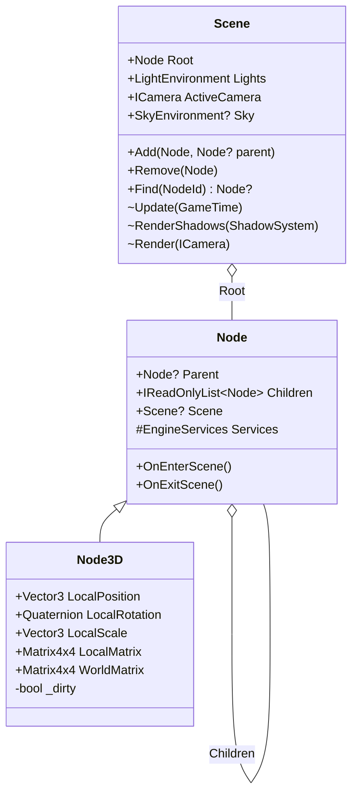
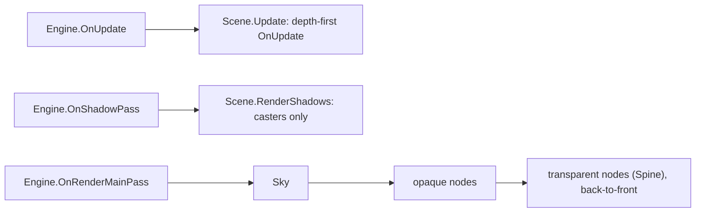

# Proposal: Scene Graph v2

**Milestone:** M2 · **Status:** ⬜ planned · **Touches:** `Node`, `Node3D`, `Engine`, Sandbox

## Problem

The "scene graph" is a flat `List<Node>` that the game owns:

- `AddChild` is inverted.
- `Parent` affects nothing.
- `ModelMatrix` is recomputed on every access from Euler angles.
- Every game must hand-write the update, shadow and draw loops.
- `Node.Initialize` is a static service locator that the game must call at exactly the right time.

See [Scene graph & nodes](../scene-graph-and-nodes.md).

## Goals

- A real parent/child hierarchy with cached local and world transforms.
- An engine-owned `Scene` that runs update, shadow and draw traversal, so games stop hand-rolling loops.
- `Node.Initialize` disappears: nodes get services from the scene they are added to.
- Quaternion rotation, with Euler kept as a convenience.

## Non-goals

ECS, serialization and an editor; these are possible follow-ups.

## Proposed design

- **Dirty flags:** setting any local TRS marks the node and its subtree dirty. `WorldMatrix` is
  recomputed lazily as `Local × Parent.World`.
- **Services:** `EngineServices { IRenderer, IVulkanContext?, ShadowSystem?, ... }` is injected on
  `OnEnterScene`. GPU resources are created there instead of in the constructor, which removes the
  ordering trap.
- **Traversal:** `Engine` gains an optional `Scene` and runs the following. Games can still override
  the hooks.

- **Registry:** `Scene.Find(NodeId)` is backed by a dictionary. This is the prerequisite for
  [networking replication](networking-replication.md).

## Task list

- [ ] `Children` list; fix `AddChild`/`RemoveChild`; reparenting keeps the world transform (optional flag)
- [ ] `Node3D` local/world TRS with dirty propagation; quaternion storage
- [ ] `Scene` class + `Engine.Scene` + default traversal
- [ ] `EngineServices` injection; remove static `Node.Initialize`
- [ ] Opaque/transparent buckets
- [ ] Port the Sandbox to `Scene`
- [ ] Move `NodeId` into the `MainframeEngine` namespace

## Open questions

- Should `Scene` own the `ShadowSystem`, or should `Engine` own it?
- Do we keep `Node.Draw(camera, lights)` or pass a `RenderContext`?

## Related

[Milestones](../../milestones.md) · [Scene graph & nodes](../scene-graph-and-nodes.md) · [Materials & meshes](materials-and-meshes.md)
