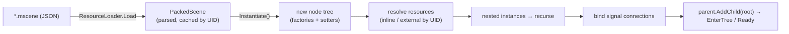

# Proposal: Scene & Resource Serialization

**Milestone:** M2 · **Status:** ⬜ planned · **Depends on:** [Node system](node-system.md) ·
**Needed by:** [Editor](editor.md), [Networking](networking-replication.md) (spawn by scene)

## Problem

Scenes are constructed in C# inside `OnLoad`. Nothing can be saved, loaded, instanced or edited.
A Godot-style workflow needs scenes stored as data (`PackedScene`) and shared assets stored as
`Resource` files, both readable by the runtime and writable by the editor.

## Goals

- **Scene files** (`*.mscene`): a node tree with property overrides, nested scene instances and signal
  connections.
- **Resource files** (`*.mres`): shared data such as materials, meshes, physics shapes and UI themes,
  referenced by scenes.
- **Stable references**: every asset has a UID, so renames and moves don't break scenes.
- **Text-based and diff-friendly** so scenes merge in git.
- **Reflection-free at runtime** where possible: a source generator emits property accessors, so it
  stays fast and works with trimming/AOT.

## Non-goals

- Binary scene format: maybe later, for shipping builds.
- Scene inheritance (Godot's "inherited scenes"): later; nested instances cover most uses.

## File format

JSON, written with `System.Text.Json` (no new dependency). One file per scene.

```json
{
  "format": 1,
  "uid": "scn_3f9a1c2e",
  "resources": {
    "1": { "type": "BoxMesh", "props": { "Size": [1, 1, 1] } },
    "2": { "ref": "res_7b21aa90", "path": "Content/Materials/Crate.mres" }
  },
  "root": {
    "type": "Node3D", "name": "Main",
    "children": [
      { "type": "DirectionalLight3D", "name": "Sun",
        "props": { "RotationDegrees": [-30, 45, 0], "Color": [1, 0.95, 0.8, 1], "Energy": 0.9 } },
      { "type": "MeshInstance3D", "name": "Crate",
        "props": { "Position": [3, 1, 0], "Mesh": { "res": "1" }, "Material": { "res": "2" } } },
      { "instance": "scn_a12b77d0", "path": "Content/Scenes/Player.mscene", "name": "Player",
        "props": { "Position": [0, 0, 2] } }
    ]
  },
  "connections": [
    { "from": "Player/Hitbox", "signal": "BodyEntered", "to": ".", "method": "OnPlayerHit" }
  ]
}
```

- **Only non-default values are written** (Godot behaviour), which keeps diffs small.
- **Nested instances** store the instanced scene's UID plus overrides keyed by property. Overrides of
  a child inside an instance use `"overrides": { "Child/Path": { ... } }`.
- **Inline resources** (`"1"`) are local to the scene. **External resources** reference an `.mres`
  file by UID, with the path as a hint.
- Vector, quaternion and color values are written as arrays. Enums are written by name.

## Property model

```csharp
public partial class DirectionalLight3D : Light3D
{
    [Export] public Color Color { get; set; } = Colors.White;
    [Export(Range = "0,16,0.01")] public float Energy { get; set; } = 1f;
    [Export] public bool CastsShadows { get; set; } = true;
    [ExportGroup("Shadow")] [Export] public ShadowResolution Resolution { get; set; }
}
```

- `[Export]` marks a property as serialized and visible in the [editor inspector](editor.md#inspector).
  Hints (`Range`, `File`, `Multiline`, `Flags`, `NodePath<T>`) drive the inspector widgets.
- A **source generator** (`MainframeEngine.Generators`, an analyzer project in the solution) emits a
  `NodeTypeInfo` for every `Node`/`Resource` subclass, in the engine and in game assemblies. It
  contains:
  - the type id string;
  - a factory (`() => new T()`);
  - a property table: name, type, default, getter/setter delegates, hints.
- `TypeRegistry` collects the generated infos at startup with `[ModuleInitializer]`. The editor also
  re-collects them when it reloads a game assembly.

Supported property types: primitives, `string`, enums, `Vector2/3/4`, `Quaternion`, `Color`,
`Transform3D`, `NodePath`, `Resource` subclasses (inline or external), and `List<T>` / arrays of
these.

## Loading and instancing



- `ResourceLoader.Load<T>(path or uid)` caches by UID and returns shared, ref-counted instances.
- `PackedScene.Instantiate()` builds the tree **outside** the scene tree, so no lifecycle callbacks run
  until the caller does `AddChild`.
- **Owner:** nodes created from a scene file get `Owner = scene root`. The saver writes only nodes
  owned by the scene being saved, so runtime-spawned children are not saved; this matches Godot.

## Saving (editor)

`SceneSaver.Save(Node root, string path)`:

1. Walk nodes whose `Owner == root`.
2. For instanced sub-scenes, write the instance reference plus overrides (diff against a pristine
   instance of the sub-scene).
3. Collect referenced resources: inline (local) or external (by UID).
4. Write properties that differ from the type default.
5. Write signal connections.

## UIDs and the asset database

- Every `.mscene`/`.mres` file carries its own `uid`. Imported assets (PNG, glTF, OGG, RML) get a
  sidecar `*.meta` file with a UID and import settings.
- `AssetDatabase` scans `Content/` at startup (editor) or reads a generated `assets.index.json`
  (runtime build) to map UID → path.
- The editor updates paths on move/rename. References stay valid because they are by UID.

## Versioning

Each file has a `format` number, and each type can declare `[SerializedVersion(n)]`. Migration
functions run on load, so old scenes keep working when properties are renamed.

## Task list

- [ ] `[Export]`, hint attributes, `[Tool]`, `[Signal]` in core
- [ ] Source generator project → `NodeTypeInfo` + `TypeRegistry`
- [ ] JSON reader/writer for property values (vectors, colors, enums, resources, node paths)
- [ ] `Resource` base + `ResourceLoader` cache by UID
- [ ] `PackedScene` load + `Instantiate()` (nested instances, overrides, connections)
- [ ] `SceneSaver` (owner-based, default-diffing)
- [ ] `.meta` sidecars + `AssetDatabase`
- [ ] Round-trip tests: build tree → save → load → compare
- [ ] Sandbox scene stored as `Content/Scenes/Sandbox.mscene`

## Open questions

- JSON vs a Godot-like custom text format? JSON is chosen for zero dependencies and tooling; revisit
  if merge conflicts get painful.
- Should the runtime build bake scenes to binary?

## Related

[Milestones](../../milestones.md) · [Node system](node-system.md) · [Editor](editor.md) ·
[Asset & shader pipeline](asset-and-shader-pipeline.md)
