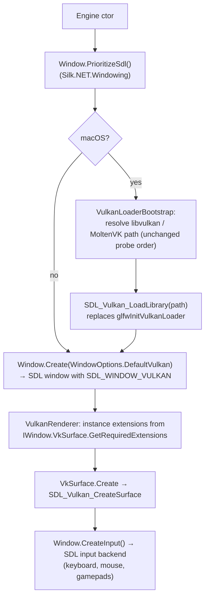

# Proposal: Switch Windowing from GLFW to SDL

**Milestone:** M0 · **Status:** ⬜ planned · **Decision:** switch to SDL (agreed 2026-10-05) ·
**Touches:** `Engine`, `VulkanLoaderBootstrap`, `VulkanRenderer` (instance extensions/surface), input

## Problem

The engine creates its window and input through Silk.NET, which picks **GLFW** by default. GLFW is
fine for a window and a Vulkan surface, but the roadmap needs more:

- **Gamepads:** GLFW's support is basic. SDL has the community controller database, rumble, gyro and
  touchpads, and it is what Steam Input and the Steam Deck expect. [Game UI](game-ui.md) wants gamepad
  navigation, and [Steamworks](steamworks-integration.md) is planned.
- **Platform services:** SDL also covers audio, haptics, IME text input, clipboard and display/DPI
  queries. It is a possible fallback for the [audio](audio.md) decision.
- **Direction of Silk.NET:** SDL is Silk.NET's long-term windowing backend. Switching now keeps
  the engine aligned with a future Silk.NET 3 upgrade.

## Current state

| Item | Today |
|---|---|
| Windowing backend | GLFW 3.4 (`Ultz.Native.GLFW`), chosen implicitly by Silk |
| SDL availability | **Already a transitive dependency** of `Silk.NET.Windowing`/`Silk.NET.Input` 2.21.0: `Silk.NET.Windowing.Sdl`, `Silk.NET.Input.Sdl`, `Silk.NET.SDL`, `Ultz.Native.SDL` 2.30.1 |
| SDL native on macOS | `libSDL2-2.0.dylib` is a universal binary (x86_64 + arm64) |
| macOS loader handoff | `VulkanLoaderBootstrap` gives GLFW the Vulkan loader through `glfwInitVulkanLoader` (see [Build & platforms](../build-and-platforms.md#macos-vulkan-loader-bootstrap)) |

No new NuGet package is needed for SDL2. Silk.NET 2.x ships **SDL2**. SDL3 arrives with Silk.NET 3,
and that upgrade would be a separate dependency change.

## Goals

- Window, surface and input run on SDL on Windows, Linux and macOS (x64 and arm64).
- On macOS, SDL and Silk's `Vk` still bind the **same** Vulkan library.
- No behaviour change for games: `Engine.Window`, `InputContext`, events and the frame loop stay the same.
- GLFW is not loaded at runtime.

## Non-goals

- SDL3 / Silk.NET 3 migration (follow-up).
- Using SDL audio (decided in [Audio](audio.md)).
- Fixing the ImGui HiDPI bug. It is independent of the backend and tracked in
  [renderer stabilization](renderer-stabilization.md#6-small-fixes).

## Proposed design

1. **Select SDL.** Call `Window.PrioritizeSdl()` before `Window.Create`. For input, Silk follows the
   window's backend. Make sure no explicit GLFW registration remains.
2. **Loader handoff.** Split `VulkanLoaderBootstrap` into probing (unchanged) and a handoff step. The
   handoff calls `SDL_Vulkan_LoadLibrary(ActiveLibraryPath)` through `Silk.NET.SDL` before the window is
   created. `TryCreateVk()` is unchanged. This preserves the rule that the window layer and Silk share
   one Vulkan library.
3. **Instance extensions and surface.** These keep going through `IWindow.VkSurface`, so the renderer
   needs no SDL-specific code. Verify that the portability-enumeration logic still works on MoltenVK.
4. **Remove GLFW.** Remove the `Silk.NET.GLFW` usage from the engine. Optionally exclude the GLFW
   backend packages, if Silk allows that cleanly.
5. **Docs.** Update [Build & platforms](../build-and-platforms.md), [Engine lifecycle](../engine-lifecycle.md),
   [Architecture overview](../architecture-overview.md) and CLAUDE.md (macOS section).

## Risks

| Risk | Mitigation |
|---|---|
| SDL2's Vulkan library loading on macOS behaves differently from GLFW's | Test against all three loader sources: bundled MoltenVK, `$VULKAN_SDK`, `~/VulkanSDK` |
| Window centring, icon, fullscreen and `FramebufferSize` differ subtly | Exercise every Sandbox ImGui toggle (VSync, fullscreen, Max FPS) and resize/minimize |
| Raw cursor mode (`CursorMode.Raw`) differs | Verify the fly-camera mouse look in the Sandbox |
| SDL2 now, SDL3 later means two migrations | The Silk abstraction keeps the second one small; the loader handoff is the only direct SDL call |

## Task list

- [ ] `Window.PrioritizeSdl()` in the `Engine` constructor
- [ ] `VulkanLoaderBootstrap`: replace `glfwInitVulkanLoader` with `SDL_Vulkan_LoadLibrary`
- [ ] Confirm the input context uses the SDL backend; test keyboard, mouse and a gamepad
- [ ] Verify on macOS arm64 (MoltenVK bundled and SDK), Windows x64, Linux x64
- [ ] Sandbox regression pass: resize, minimize, VSync, fullscreen, Max FPS, Alt cursor toggle, right-click look
- [ ] Remove the GLFW references; update the docs and CLAUDE.md
- [ ] Add an ADR in `memory/decisions/` recording the GLFW → SDL decision

## Open questions

- Stay on SDL2 until Silk.NET 3, or use SDL3 directly through a separate binding? Default: SDL2 via Silk 2.x.

## Related

[Milestones](../../milestones.md) · [Build & platforms](../build-and-platforms.md) ·
[Engine lifecycle](../engine-lifecycle.md) · [Game UI](game-ui.md) · [Steamworks integration](steamworks-integration.md)
