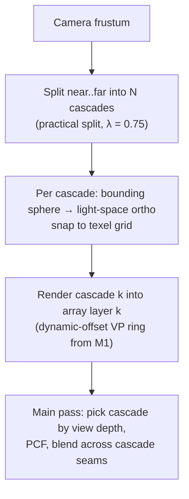

# Proposal: Shadows v2

**Milestone:** M4 · **Status:** ⬜ planned · **Depends on:** [Renderer stabilization](renderer-stabilization.md)

## Problem

- The directional shadow is a fixed ±20-unit orthographic box at the world origin, with a 50-unit far plane.
- Filtering is a single hardware compare tap. Point shadows are a single hard sample.
- All 15 maps (about 116 MiB) are allocated even when there are no lights.
- Allocations happen per frame.

See [Shadow system](../shadow-system.md).

## Goals

- **Cascaded shadow maps** (CSM) for the primary directional light, fit to the camera frustum and
  stabilized (texel snapping).
- **PCF** kernel (e.g. 3×3 or Poisson 16 taps) for 2D maps, and soft sampling for cube maps.
- A **shadow atlas** for spot lights and other directional lights, to cut memory and samplers.
- Per-light `CastsShadows` and resolution settings.
- Zero allocations per frame.

## Proposed design

| Resource | Today | Proposed |
|---|---|---|
| Directional | 4 × 2048² maps | 1 × 2048² × 4-layer array (CSM) for the sun; other directional lights go in the atlas |
| Spot | 7 × 1024² maps | 4096² atlas, tiles allocated per frame |
| Point | 4 × 512² cubes | keep cubes; optional 1024; PCF over a 20-tap disc |
| Samplers in set | 15 | 1 array + 1 atlas + 4 cubes = 6 |

## Task list

- [ ] `DirectionalLight.CastsShadows`, `ShadowResolution`, cascade count
- [ ] CSM: split, fit, snap, array image, cascade selection + seam blend
- [ ] PCF in `Shapes.vk.frag` and `SpineLit.vk.frag` (shared include)
- [ ] Spot atlas with a tile allocator
- [ ] Point PCF and normal-offset bias
- [ ] Debug view: cascade colors, atlas viewer in ImGui
- [ ] Allocation-free `RenderShadows` (static face table, no closures)

## Open questions

- Shared GLSL includes need `glslc -I` (see [asset & shader pipeline](asset-and-shader-pipeline.md)).
- Do we want EVSM or contact-hardening later?

## Related

[Milestones](../../milestones.md) · [Shadow system](../shadow-system.md) · [Lighting](../lighting.md)
